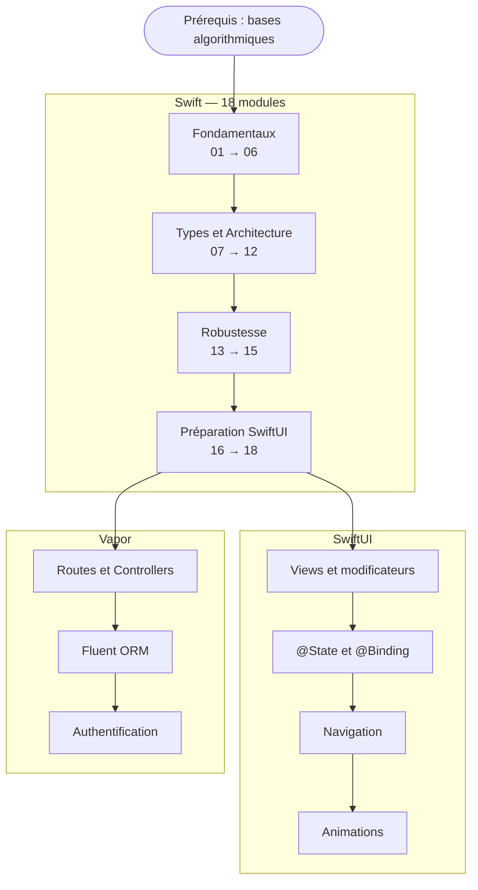

# Développement Mobile

!!! quote "Analogie"
    _Apprendre à développer pour mobile, c'est comme apprendre à conduire une voiture de sport après avoir conduit des berlines toute sa vie. Les règles de la route sont les mêmes (la logique de programmation), mais le moteur, la tenue de route et les instruments de bord sont entièrement différents. Swift n'est pas "un autre PHP" — c'est un langage conçu pour la performance, la sécurité mémoire et l'expérience développeur sur l'écosystème Apple._

## Objectif

Cette section couvre le développement mobile natif sur l'écosystème Apple, de l'initiation au langage Swift jusqu'à la construction d'applications iOS professionnelles avec SwiftUI, en passant par le développement backend avec Vapor.

Le parcours est structuré en trois phases progressives et dépendantes :

- **Swift** — le langage. **18 modules** couvrant les fondations, les concepts avancés, et une phase de préparation spécifiquement conçue pour SwiftUI (KeyPaths, Result Builders, Combine).
- **SwiftUI** — le framework d'interface. Construit entièrement sur les concepts Swift.
- **Vapor** — le framework backend Swift. APIs REST, ORM Fluent, authentification.

!!! warning "Prérequis recommandés"
    Cette section suppose une **expérience préalable en programmation** — dans n'importe quel langage. Si vous avez suivi les sections HTML, CSS et JavaScript d'OmnyDocs, vous avez le bagage algorithmique nécessaire.

 

---

## Les trois piliers

- ### :simple-swift: Swift — Le Langage
    ---
    **18 modules** structurés en trois blocs : Fondamentaux (modules 01-06), Types et Architecture (07-12) avec Codable et Property Wrappers, Robustesse et Performance (13-15) puis une phase dédiée **Préparation à SwiftUI** (16-18) couvrant KeyPaths, Result Builders et Combine.

    [Démarrer Swift](./swift/index.md)

- ### :lucide-smartphone: SwiftUI — L'Interface
    ---
    Le framework déclaratif d'Apple pour iOS, macOS, watchOS et tvOS. Views, State management (`@State`, `@Binding`, `@StateObject`), Navigation, Animations.

    *Section en préparation — Swift 18 modules requis*

- ### :lucide-server: Vapor — Le Backend Swift
    ---
    Framework web Swift pour APIs REST, middlewares d'authentification et bases de données avec Fluent ORM.

    *Section en préparation — Swift requis*

 

---

## Progression recommandée

 

---

## Ce que couvre la phase Préparation SwiftUI

Les trois derniers modules Swift sont spécifiquement conçus pour que la syntaxe de SwiftUI soit immédiatement lisible.

| Module | Ce qu'il débloque en SwiftUI |
| --- | --- |
| **16 — KeyPaths** | `ForEach(items, id: \.id)`, `$formulaire.nom`, `sorted(by: \.prix)` |
| **17 — Result Builders** | Pourquoi `VStack { Text() Button() }` compile sans virgules ni `return` |
| **18 — Combine** | Comment `@Published` notifie SwiftUI, pourquoi `$propriété` est un `Binding` |

 

---

## Pourquoi Swift en 2025

| Caractéristique | Swift | PHP / JavaScript |
| --- | --- | --- |
| Typage | Statique et inféré | Dynamique |
| Compilation | AOT (ahead of time) | Interprété / JIT |
| Gestion mémoire | ARC automatique | Garbage Collector |
| Null safety | Optionals obligatoires | null implicite |
| Paradigme dominant | Protocol-Oriented | Orienté Objet |
| Concurrence | Swift 6 + Sendable | Promises / async (JS) |
| Sérialisation JSON | Codable synthétisé | json_encode / JSON.parse |
| UI déclarative | SwiftUI + Result Builders | React + JSX |
| Réactivité | Combine / @Observable | RxJS / MobX |

 

---

## Conclusion

!!! quote "Notre recommandation"
    Ne sautez pas les 18 modules Swift — la tentation d'aller directement à SwiftUI est forte, mais elle conduit systématiquement à copier du code sans le comprendre. Les modules 16 à 18 (KeyPaths, Result Builders, Combine) sont la passerelle qui transforme SwiftUI d'une boîte noire en un système cohérent et prévisible.

**Point d'entrée : [Swift — Le Langage](./swift/index.md)**

 