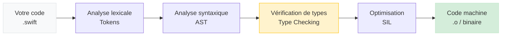

# Introduction et Environnement

<div
  class="omny-meta"
  data-level="🟢 Débutant"
  data-version="1.0"
  data-time="2-3 heures">
</div>

## Introduction

!!! quote "Analogie pédagogique - L'Atelier du Luthier"
    Un luthier qui fabrique des violons ne commence pas par choisir son vernis. Il commence par choisir son atelier, ses outils, et comprendre le bois qu'il va travailler. Swift, c'est pareil : avant d'écrire votre première application, vous devez comprendre l'environnement dans lequel vous allez travailler, comment le compilateur transforme votre code en instructions machine, et pourquoi Swift a été conçu différemment des langages que vous connaissez déjà.

Ce module vous installe dans le cockpit de Swift. À la fin, vous aurez un environnement fonctionnel et vous comprendrez ce que fait votre code — pas seulement que ça "marche".

<br>

---

## Qu'est-ce que Swift

Swift est un langage de programmation créé par Apple en 2014, rendu open source en 2015. Il a été conçu pour remplacer Objective-C — le vieux langage Apple datant des années 1980 — avec un langage moderne, expressif et sûr.

**Trois principes fondateurs guident la conception de Swift :**

- **Sécurité** — le compilateur refuse le code potentiellement dangereux. On ne peut pas accéder à de la mémoire non initialisée, ni ignorer qu'une valeur est peut-être absente.
- **Rapidité** — Swift est compilé en code machine natif. Les performances sont comparables au C++ pour la plupart des cas d'usage.
- **Expressivité** — la syntaxe est conçue pour être lisible et concise sans sacrifier la précision.

Swift fonctionne sur l'intégralité de l'écosystème Apple : iOS, macOS, watchOS, tvOS, visionOS. Il fonctionne aussi sur Linux (et donc sur des serveurs), ce qui permet à Vapor de proposer un backend full-Swift.

<br>

---

## L'Environnement de Développement

<br>

### Xcode — l'IDE officiel

**Xcode** est l'environnement de développement intégré d'Apple. C'est l'outil principal pour développer en Swift sur iOS et macOS. Il comprend un éditeur de code, un compilateur, un débogueur, un simulateur d'appareils iOS et un outil de profiling des performances.

!!! warning "Xcode est exclusivement disponible sur macOS"
    Xcode ne fonctionne pas sous Windows ni Linux. Si vous ne disposez pas d'un Mac, **Swift Playgrounds** (iPad/Mac) ou le compilateur en ligne [swift.godbolt.org](https://swift.godbolt.org) sont des alternatives pour suivre les modules de langage. Pour le développement iOS complet (simulation, build, déploiement), un Mac est indispensable.

**Installation :**

Xcode est téléchargeable gratuitement depuis le Mac App Store ou depuis [developer.apple.com/download](https://developer.apple.com/download). Vérifiez votre version :

```bash title="Terminal - Vérification de la version Swift installée"
# Affiche la version du compilateur Swift
swift --version

# Sortie attendue (exemple) :
# swift-driver version: 1.90.11.1 Apple Swift version 5.10
# Target: arm64-apple-macosx14.0
```

<br>

### Swift Playgrounds — pour apprendre sans friction

**Swift Playgrounds** est une application légère disponible sur Mac et iPad. Elle permet d'écrire du Swift et d'observer les résultats en temps réel, sans créer un projet complet. C'est l'outil idéal pour les modules de langage.

```
Xcode → Fichier → Nouveau → Playground → Blank
```

*Ou utilisez directement l'application Swift Playgrounds disponible sur le Mac App Store.*

Dans un Playground, chaque ligne est exécutée immédiatement et le résultat s'affiche dans la colonne de droite. C'est votre bac à sable — modifiez, cassez, recommencez.

<br>

---

## Hello World

Votre premier programme en Swift. Puis la même chose dans les langages que vous connaissez peut-être déjà.

=== ":simple-swift: Swift"

    ```swift title="Swift - Hello World"
    // La fonction print() affiche du texte dans la console
    // En Swift, les parenthèses sont obligatoires, le point-virgule en fin de ligne est facultatif
    print("Hello, World!")

    // Vous pouvez afficher plusieurs valeurs séparées par des virgules
    // Le paramètre separator définit le séparateur (espace par défaut)
    // Le paramètre terminator définit le caractère de fin (retour à la ligne par défaut)
    print("Hello", "OmnyDocs", separator: " — ", terminator: "!\n")
    ```

    *Swift n'a pas de fonction `main()` obligatoire pour les scripts et les Playgrounds. Dans une application iOS complète, le point d'entrée est géré automatiquement par le framework.*

=== ":simple-javascript: JavaScript"

    ```js title="JavaScript - Hello World (équivalent)"
    // Dans un navigateur
    console.log("Hello, World!");

    // Dans Node.js
    process.stdout.write("Hello, OmnyDocs!\n");
    ```

=== ":simple-php: PHP"

    ```php title="PHP - Hello World (équivalent)"
    <?php
    // PHP nécessite la balise d'ouverture
    echo "Hello, World!";

    // Avec retour à la ligne
    echo "Hello, OmnyDocs!" . PHP_EOL;
    ```

=== ":simple-python: Python"

    ```python title="Python - Hello World (équivalent)"
    # Python est le plus concis sur cet exemple
    print("Hello, World!")

    # Avec paramètres explicites
    print("Hello", "OmnyDocs", sep=" — ", end="!\n")
    ```

*La syntaxe Python de `print()` avec `sep` et `end` est la plus proche de Swift avec `separator` et `terminator`.*

<br>

---

## Les Commentaires

Les commentaires sont ignorés par le compilateur. Ils servent à documenter le code pour les autres développeurs (et pour vous-même dans trois mois).

=== ":simple-swift: Swift"

    ```swift title="Swift - Les trois types de commentaires"
    // Commentaire sur une seule ligne

    /* Commentaire
       sur plusieurs lignes */

    /* Swift supporte les commentaires imbriqués,
       /* ce qui est rare dans les langages */
       utile pour désactiver des blocs de code en développement */

    /// Documentation de fonction (format DocC)
    /// - Parameter nom: Le prénom à saluer
    /// - Returns: Un message de salutation formaté
    func saluer(nom: String) -> String {
        return "Bonjour, \(nom) !"
    }
    ```

    *Les commentaires `///` génèrent une documentation automatique utilisée par Xcode pour afficher l'aide contextuelle dans l'éditeur.*

=== ":simple-javascript: JavaScript"

    ```js title="JavaScript - Commentaires"
    // Commentaire sur une seule ligne

    /* Commentaire
       sur plusieurs lignes */

    /** Documentation JSDoc
     * @param {string} nom - Le prénom
     * @returns {string} Message de salutation
     */
    function saluer(nom) {
        return `Bonjour, ${nom} !`;
    }
    ```

=== ":simple-php: PHP"

    ```php title="PHP - Commentaires"
    <?php
    // Commentaire sur une seule ligne
    # Aussi valide en PHP (style shell)

    /* Commentaire
       sur plusieurs lignes */

    /** Documentation PHPDoc
     * @param string $nom Le prénom
     * @return string Message de salutation
     */
    function saluer(string $nom): string {
        return "Bonjour, {$nom} !";
    }
    ```

=== ":simple-python: Python"

    ```python title="Python - Commentaires"
    # Commentaire sur une seule ligne
    # Python n'a pas de commentaire multilignes natif

    """
    Les triples guillemets sont des docstrings,
    utilisées comme documentation de fonction.
    """

    def saluer(nom: str) -> str:
        """
        Salue une personne par son prénom.

        Args:
            nom: Le prénom à saluer
        Returns:
            Un message de salutation
        """
        return f"Bonjour, {nom} !"
    ```

<br>

---

## La Syntaxe de Base

Voici les règles syntaxiques fondamentales de Swift que vous devez intégrer dès le départ.

<br>

### Point-virgule facultatif

```swift title="Swift - Point-virgule facultatif"
// En Swift, le point-virgule en fin de ligne est FACULTATIF
// La convention universelle de la communauté Swift : ne pas l'écrire
print("Ligne 1")
print("Ligne 2")

// Le point-virgule est OBLIGATOIRE pour séparer plusieurs instructions sur une même ligne
// (usage rare, déconseillé pour la lisibilité)
print("A"); print("B"); print("C")
```

*Cette approche est différente de PHP (point-virgule obligatoire) et similaire à Python (pas de point-virgule) et JavaScript (facultatif mais conventionnellement présent).*

<br>

### Sensibilité à la casse

```swift title="Swift - La casse est significative"
// Swift est sensible à la casse (case-sensitive)
// Ces trois identifiants sont distincts
var nombre = 42
var Nombre = 43   // Variable différente
var NOMBRE = 44   // Variable différente encore

// Convention Swift :
// - Variables et fonctions : camelCase (commencent par une minuscule)
// - Types (Struct, Class, Enum, Protocol) : PascalCase (commencent par une majuscule)
var prenomUtilisateur = "Alice"    // camelCase : variable
struct UtilisateurProfil { }       // PascalCase : type
```

<br>

### L'interpolation de chaînes

L'interpolation permet d'insérer des valeurs directement dans une chaîne de caractères.

=== ":simple-swift: Swift"

    ```swift title="Swift - Interpolation avec \( )"
    let prenom = "Alice"
    let age = 28

    // Swift utilise \( ) pour interpoler une valeur dans une String
    let message = "Bonjour \(prenom), vous avez \(age) ans."
    print(message)
    // Affiche : Bonjour Alice, vous avez 28 ans.

    // On peut écrire n'importe quelle expression dans \( )
    let prix = 49.9
    let messageCommande = "Total : \(prix * 1.2) € TTC"
    print(messageCommande)
    // Affiche : Total : 59.879999999999995 € TTC
    ```

=== ":simple-javascript: JavaScript"

    ```js title="JavaScript - Template literals avec ${ }"
    const prenom = "Alice";
    const age = 28;

    // JavaScript utilise ${ } dans des template literals (backticks)
    const message = `Bonjour ${prenom}, vous avez ${age} ans.`;
    console.log(message);

    const prix = 49.9;
    const messageCommande = `Total : ${prix * 1.2} € TTC`;
    ```

=== ":simple-php: PHP"

    ```php title="PHP - Interpolation dans les guillemets doubles"
    <?php
    $prenom = "Alice";
    $age = 28;

    // PHP interpole dans les guillemets doubles (pas les simples)
    $message = "Bonjour $prenom, vous avez $age ans.";
    echo $message;

    // Pour les expressions complexes, utiliser des accolades
    $prix = 49.9;
    $messageCommande = "Total : {$prix} € HT";
    ```

=== ":simple-python: Python"

    ```python title="Python - f-strings avec { }"
    prenom = "Alice"
    age = 28

    # Python utilise les f-strings (Python 3.6+)
    message = f"Bonjour {prenom}, vous avez {age} ans."
    print(message)

    prix = 49.9
    message_commande = f"Total : {prix * 1.2:.2f} € TTC"
    ```

<br>

---

## Premier Programme Complet

Mettons ensemble ce que vous venez d'apprendre dans un programme cohérent.

=== ":simple-swift: Swift"

    ```swift title="Swift - Premier programme complet"
    // Programme de présentation — Swift Playground
    // Ce programme illustre print(), les commentaires et l'interpolation

    // Déclaration de constantes (on les abordera en détail au module 02)
    let nomApplication = "OmnyDocs Mobile"
    let version = "1.0.0"
    let langage = "Swift"

    // Affichage avec interpolation
    print("=== \(nomApplication) ===")
    print("Version : \(version)")
    print("Langage : \(langage)")
    print("Compilé avec : Swift \(#if swift(>=5.10) "5.10+" #else "< 5.10" #endif)")

    // Séparateur visuel
    print(String(repeating: "-", count: 30))

    // Message de bienvenue
    print("Bienvenue dans l'apprentissage de Swift !")
    print("Ce langage vous prépare à SwiftUI et Vapor.")
    ```

=== ":simple-javascript: JavaScript"

    ```js title="JavaScript - Équivalent Node.js"
    const nomApplication = "OmnyDocs Mobile";
    const version = "1.0.0";
    const langage = "JavaScript";

    console.log(`=== ${nomApplication} ===`);
    console.log(`Version : ${version}`);
    console.log(`Langage : ${langage}`);
    console.log("-".repeat(30));
    console.log("Bienvenue dans l'apprentissage de JavaScript !");
    ```

=== ":simple-php: PHP"

    ```php title="PHP - Équivalent PHP"
    <?php
    $nomApplication = "OmnyDocs Mobile";
    $version = "1.0.0";
    $langage = "PHP";

    echo "=== $nomApplication ===" . PHP_EOL;
    echo "Version : $version" . PHP_EOL;
    echo "Langage : $langage" . PHP_EOL;
    echo str_repeat("-", 30) . PHP_EOL;
    echo "Bienvenue dans l'apprentissage de PHP !" . PHP_EOL;
    ```

=== ":simple-python: Python"

    ```python title="Python - Équivalent Python"
    nom_application = "OmnyDocs Mobile"
    version = "1.0.0"
    langage = "Python"

    print(f"=== {nom_application} ===")
    print(f"Version : {version}")
    print(f"Langage : {langage}")
    print("-" * 30)
    print("Bienvenue dans l'apprentissage de Python !")
    ```

<br>

---

## Le Compilateur Swift : ce qui se passe en coulisses

Comprendre ce que fait le compilateur aide à interpréter les messages d'erreur.



*La phase de **vérification de types** (Type Checking) est là que Swift refuse le code non sûr. C'est pourquoi les messages d'erreur Swift arrivent à la **compilation** — avant même d'exécuter une seule ligne — plutôt qu'à l'exécution comme en PHP ou JavaScript.*

!!! tip "Lire les erreurs du compilateur Swift"
    Le compilateur Swift produit des messages d'erreur très détaillés. Il signale non seulement le problème mais suggère souvent la correction. Lisez chaque message en entier — il contient généralement la réponse.

    ```
    error: cannot convert value of type 'Int' to expected argument type 'String'
    print("Votre age est : " + age)
                               ^~~
    note: No overloads for '+' exist that accept a 'String' and an 'Int'
    ```

    *Ce message indique qu'on ne peut pas concaténer un `Int` et une `String` avec `+` en Swift — contrairement à JavaScript qui ferait une conversion implicite. La solution est l'interpolation : `"Votre age est : \(age)"`.*

<br>

---

## Conclusion

!!! quote "Ce qu'il faut retenir de ce module"
    Swift est un langage compilé, statiquement typé, conçu pour la sécurité et la performance sur l'écosystème Apple. L'environnement de travail principal est **Xcode** (Mac uniquement) ou **Swift Playgrounds** pour apprendre. `print()` affiche dans la console avec des paramètres `separator` et `terminator`. L'interpolation de chaînes utilise `\( )`. Les commentaires `///` génèrent de la documentation. Le compilateur détecte les erreurs **avant l'exécution** — c'est une différence fondamentale avec PHP et JavaScript.

> Dans le module suivant, nous aborderons le cœur du système de types de Swift : **`let` vs `var`**, l'inférence de types, et les types fondamentaux — `Int`, `Double`, `String`, `Bool` et leurs particularités.

<br>