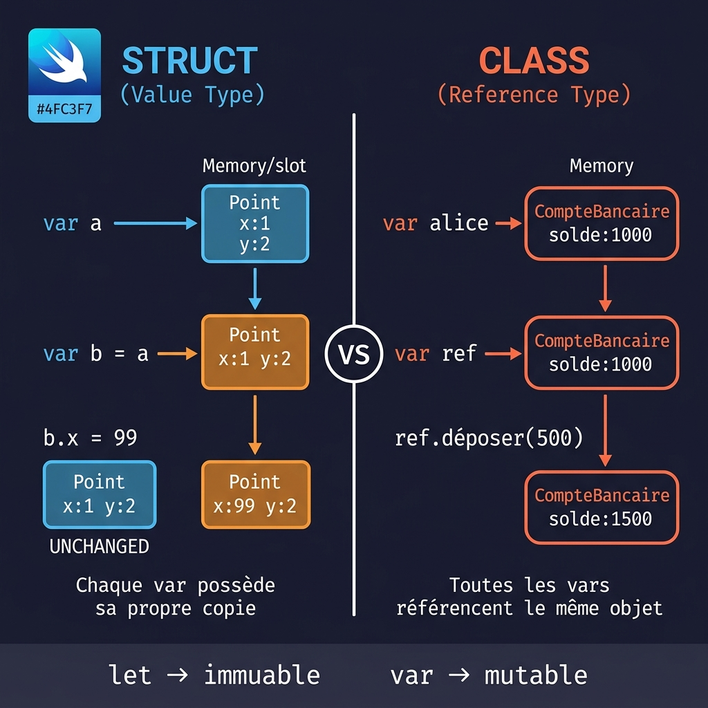

# Structs et Classes

<div
  class="omny-meta"
  data-level="🟡 Intermédiaire"
  data-version="1.1"
  data-time="3-4 heures">
</div>

## Introduction

!!! quote "Analogie pédagogique - La Photocopie et le Panneau"
    Une `struct`, c'est comme une fiche papier. Quand vous la donnez à quelqu'un, vous lui donnez une **photocopie** — il peut écrire dessus sans affecter votre original. Une `class`, c'est comme un panneau indicateur en ville. Quand vous donnez l'adresse du panneau à quelqu'un, vous lui donnez un moyen d'accéder au **même objet physique** — si l'un de vous le modifie, l'autre voit la modification.

    Cette distinction — **value type vs reference type** — est la décision architecturale la plus importante en Swift. SwiftUI est entièrement construit sur des structs.



<br>

---

## Struct — Value Type

=== ":simple-swift: Swift"

    ```swift title="Swift - Déclaration et utilisation d'une struct"
    struct Point {
        var x: Double
        var y: Double

        // Propriété calculée : calculée à la demande, pas stockée
        var description: String {
            "(\(x), \(y))"
        }

        var distanceOrigine: Double {
            (x * x + y * y).squareRoot()
        }

        // mutating : obligatoire pour les méthodes qui modifient les propriétés
        mutating func déplacer(dx: Double, dy: Double) {
            x += dx
            y += dy
        }

        func distance(vers autre: Point) -> Double {
            let dx = x - autre.x
            let dy = y - autre.y
            return (dx * dx + dy * dy).squareRoot()
        }
    }

    // Initialiseur synthétique : Swift le génère automatiquement
    var p1 = Point(x: 3.0, y: 4.0)
    print(p1.description)       // "(3.0, 4.0)"
    print(p1.distanceOrigine)   // 5.0

    p1.déplacer(dx: 1.0, dy: 0.0)
    print(p1)   // Point(x: 4.0, y: 4.0)
    ```

    ```swift title="Swift - La copie en action (value semantics)"
    var a = Point(x: 1.0, y: 2.0)
    var b = a   // COPIE — b est indépendant de a

    b.x = 99.0

    print(a.x)  // 1.0 — a non modifié
    print(b.x)  // 99.0

    // let rend la struct entièrement immuable
    let c = Point(x: 5.0, y: 5.0)
    // c.x = 10.0   // ERREUR : 'c' is a 'let' constant
    ```

=== ":simple-javascript: JavaScript"

    ```js title="JavaScript - Objet (référence par défaut)"
    // Les objets JS sont toujours des références
    const a = { x: 1.0, y: 2.0 };
    const b = a;   // Référence, pas une copie

    b.x = 99.0;
    console.log(a.x);  // 99.0 — a EST modifié

    // Pour copier : spread operator
    const c = { ...a };
    c.x = 0;
    console.log(a.x);  // 99.0 — non modifié cette fois
    ```

=== ":simple-php: PHP"

    ```php title="PHP - Tableau associatif (value semantics comme Swift)"
    <?php
    $a = ["x" => 1.0, "y" => 2.0];
    $b = $a;   // Copie en PHP pour les tableaux
    $b["x"] = 99.0;
    echo $a["x"];  // 1.0 — non modifié

    // PHP 8.2+ : readonly class (immuable)
    readonly class Point {
        public function __construct(
            public float $x,
            public float $y
        ) {}
    }
    ```

=== ":simple-python: Python"

    ```python title="Python - dataclass (référence, pas valeur)"
    from dataclasses import dataclass
    import copy

    @dataclass
    class Point:
        x: float
        y: float

    # Python : les dataclass sont des références
    a = Point(1.0, 2.0)
    b = a           # Référence
    b.x = 99.0
    print(a.x)      # 99.0 — a modifié

    # Copie explicite nécessaire
    c = copy.copy(a)
    ```

<br>

---

## Class — Reference Type

```swift title="Swift - Comportement référence d'une class"
class CompteBancaire {
    var solde: Double
    let titulaire: String

    init(titulaire: String, soldeInitial: Double = 0.0) {
        self.titulaire = titulaire
        self.solde = soldeInitial
    }

    func déposer(_ montant: Double) {
        solde += montant
    }

    func retirer(_ montant: Double) -> Bool {
        guard solde >= montant else { return false }
        solde -= montant
        return true
    }

    deinit {
        print("Compte de \(titulaire) libéré")
    }
}

// Référence partagée
let compteDAlice = CompteBancaire(titulaire: "Alice", soldeInitial: 1000.0)
let autreRéférence = compteDAlice   // Même objet en mémoire

autreRéférence.déposer(500.0)

print(compteDAlice.solde)       // 1500.0 — modifié via l'autre référence
print(autreRéférence.solde)     // 1500.0 — même objet

// === : même identité (même objet en mémoire)
print(compteDAlice === autreRéférence)   // true

let autreCompte = CompteBancaire(titulaire: "Alice", soldeInitial: 1000.0)
print(compteDAlice === autreCompte)  // false — objets distincts
```

<br>

---

## Initialiseurs

```swift title="Swift - Initialiseurs et initialiseurs faillibles"
struct Rectangle {
    var largeur: Double
    var hauteur: Double

    init(largeur: Double, hauteur: Double) {
        self.largeur = largeur
        self.hauteur = hauteur
    }

    // Initialiseur de convenance
    init(côté: Double) {
        self.init(largeur: côté, hauteur: côté)
    }

    var aire: Double { largeur * hauteur }
}

let rect  = Rectangle(largeur: 10.0, hauteur: 5.0)
let carré = Rectangle(côté: 8.0)

// Initialiseur faillible : retourne un Optional si les paramètres sont invalides
struct Temperature {
    let kelvin: Double

    init?(celsius: Double) {
        guard celsius >= -273.15 else { return nil }
        kelvin = celsius + 273.15
    }
}

let t1 = Temperature(celsius: 20.0)    // Optional(Temperature)
let t2 = Temperature(celsius: -300.0)  // nil

if let t = t1 {
    print("\(t.kelvin) K")   // 293.15 K
}
```

<br>

---

## Propriétés Avancées

```swift title="Swift - willSet, didSet et lazy"
class Formulaire {
    var nom: String = "" {
        willSet { print("va changer vers '\(newValue)'") }
        didSet  { print("a changé depuis '\(oldValue)'") }
    }

    lazy var analyseComplexe: [String] = {
        print("Calcul coûteux — une seule fois")
        return ["résultat1", "résultat2"]
    }()

    static var nombreInstances = 0

    init() { Formulaire.nombreInstances += 1 }
}

var f = Formulaire()
f.nom = "Alice"
// "va changer vers 'Alice'"
// "a changé depuis ''"

print(f.analyseComplexe)   // Déclenche le calcul
print(f.analyseComplexe)   // Résultat en cache
```

<br>

---

## Struct vs Class : Tableau de Décision

| Critère | Struct | Class |
| --- | --- | --- |
| Sémantique | Value type (copie) | Reference type |
| Héritage | Non | Oui |
| `deinit` | Non | Oui |
| Thread safety | Naturel | Risques |
| Usage SwiftUI | Presque toujours | ViewModels (`@ObservableObject`) |
| Exemples | `Array`, `String`, `CGPoint` | `URLSession`, `UIViewController` |

!!! tip "La règle Apple"
    Depuis Swift 5 : *"Use structures by default."* Les structs sont prévisibles, plus performantes dans la plupart des cas, et naturellement thread-safe. Utilisez une class uniquement si vous avez besoin d'héritage, de `deinit`, ou d'identité partagée.

<br>

---

## Exercices

!!! note "À vous de jouer"

**Exercice 1 — Value semantics**

```swift title="Swift - Exercice 1"
// Exécutez ce code et expliquez pourquoi les résultats sont différents

struct Compteur {
    var valeur: Int = 0
    mutating func incrémenter() { valeur += 1 }
}

var c1 = Compteur()
var c2 = c1

c1.incrémenter()
c1.incrémenter()

print(c1.valeur)   // ?
print(c2.valeur)   // ?

// Maintenant faites la même chose avec une class — qu'est-ce qui change ?
```

**Exercice 2 — Modéliser un panier e-commerce**

```swift title="Swift - Exercice 2"
// Créez une struct Article avec : nom (String), prix (Double), quantité (Int)
// Créez une class Panier avec : articles ([Article]), total calculé
// La class Panier doit avoir :
//   - func ajouter(_ article: Article)
//   - func supprimer(nom: String)
//   - var total: Double (propriété calculée)

// Testez :
// var panier = Panier()
// panier.ajouter(Article(nom: "Clavier", prix: 89.0, quantité: 1))
// panier.ajouter(Article(nom: "Souris", prix: 45.0, quantité: 2))
// print(panier.total)   // 179.0
```

**Exercice 3 — Initialiseur faillible**

```swift title="Swift - Exercice 3"
// Créez une struct MotDePasse avec un initialiseur faillible init?(texte:)
// L'initialiseur doit retourner nil si :
// - Le texte fait moins de 8 caractères
// - Le texte ne contient pas au moins un chiffre

// Testez :
// let p1 = MotDePasse(texte: "abc")         // nil
// let p2 = MotDePasse(texte: "abcdefgh")    // nil (pas de chiffre)
// let p3 = MotDePasse(texte: "abcdefg1")    // Optional(MotDePasse)
```

<br>

---

## Conclusion

!!! quote "Ce qu'il faut retenir de ce module"
    Les **structs** sont des value types : chaque assignation crée une copie indépendante. Les **classes** sont des reference types : les variables partagent le même objet. `mutating` est obligatoire pour les méthodes de struct qui modifient leurs propriétés. Les classes ont `deinit` et supportent l'héritage. Préférez toujours les structs.

> Dans le module suivant, nous couvrirons les **Enumerations** Swift — une version radicalement plus puissante que les enums classiques, avec les associated values.

<br>