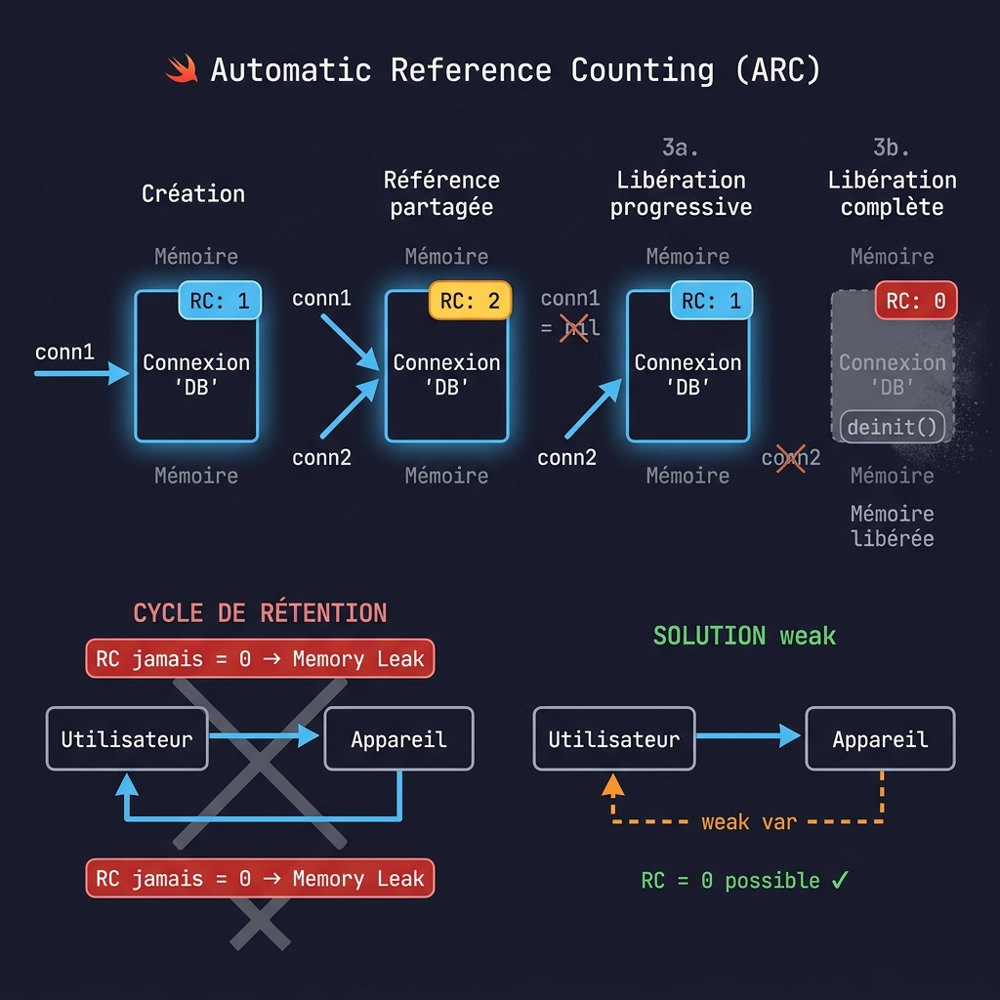
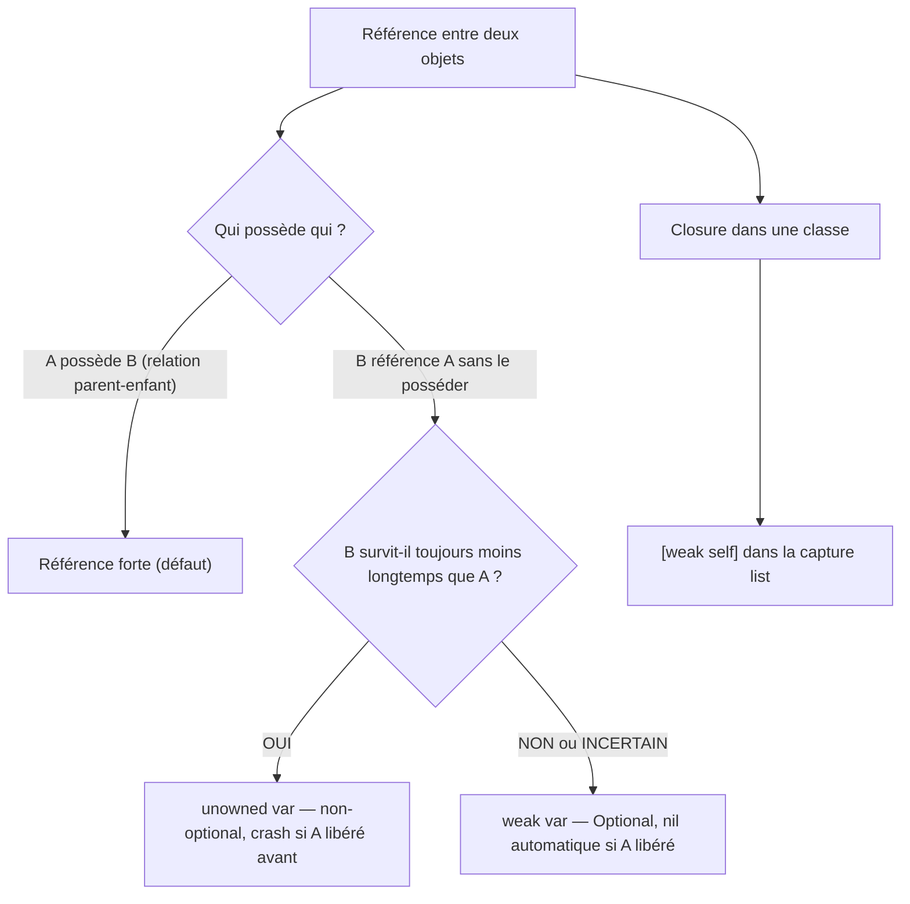

# ARC et Gestion Mémoire

<div
  class="omny-meta"
  data-level="🔴 Avancé"
  data-version="1.0"
  data-time="3-4 heures">
</div>

## Introduction

!!! quote "Analogie pédagogique - Le Contrat de Location Partagé"
    Imaginez un appartement que plusieurs personnes partagent. Chaque colocataire détient un contrat de location — une référence forte. L'appartement reste loué tant qu'au moins un contrat est actif. Quand le dernier colocataire rend les clés (sa référence est libérée), l'appartement est libéré.

    Maintenant, imaginez deux colocataires qui se louent mutuellement leur appartement : A loue chez B, B loue chez A. Aucun des deux ne peut partir sans que l'autre parte d'abord — c'est le **cycle de rétention**. Les deux appartements restent loués indéfiniment, même si tout le monde est parti de la ville.

    Swift utilise **ARC** (Automatic Reference Counting) pour gérer la mémoire. Comprendre ARC vous permet d'éviter les memory leaks — des objets qui restent en mémoire alors qu'ils ne sont plus utiles.

<br>

---

## Comment Fonctionne ARC

ARC est le mécanisme de gestion mémoire de Swift pour les **reference types** (les classes). Les value types (structs, enums, arrays) ne sont pas concernés — ils sont alloués et libérés automatiquement sur la stack.



```swift title="Swift - ARC : comptage de références automatique"
class Connexion {
    let nom: String

    init(nom: String) {
        self.nom = nom
        print("Connexion '\(nom)' établie")
    }

    deinit {
        // deinit est appelé automatiquement quand le compteur ARC atteint 0
        print("Connexion '\(nom)' fermée")
    }
}

// Compteur de références = 1
var conn1: Connexion? = Connexion(nom: "Base de données")
// "Connexion 'Base de données' établie"

// Compteur = 2 (deux variables référencent le même objet)
var conn2: Connexion? = conn1

// Compteur = 1 (conn1 ne pointe plus vers l'objet)
conn1 = nil

// Compteur = 0 — deinit est appelé automatiquement
conn2 = nil
// "Connexion 'Base de données' fermée"

// L'objet est libéré de la mémoire — aucune action manuelle requise
```

*ARC est fondamentalement différent d'un Garbage Collector (Java, Python, PHP). Un GC identifie et libère la mémoire périodiquement. ARC est déterministe : la mémoire est libérée exactement quand le dernier propriétaire disparaît.*

<br>

---

## Les Cycles de Rétention

Un cycle de rétention se produit quand deux objets se détiennent mutuellement avec des **références fortes**. ARC ne peut pas libérer l'un sans libérer l'autre — ni l'un ni l'autre n'atteint jamais un compteur de zéro.

```swift title="Swift - Le cycle de rétention en action"
class Utilisateur {
    let nom: String
    var appareil: Appareil?   // Référence forte vers Appareil

    init(nom: String) { self.nom = nom }
    deinit { print("Utilisateur '\(nom)' libéré") }
}

class Appareil {
    let modèle: String
    var propriétaire: Utilisateur?   // Référence forte vers Utilisateur — PROBLÈME

    init(modèle: String) { self.modèle = modèle }
    deinit { print("Appareil '\(modèle)' libéré") }
}

// Créer les objets
var alice: Utilisateur? = Utilisateur(nom: "Alice")
var iphone: Appareil? = Appareil(modèle: "iPhone")

// Créer le cycle : alice → iphone et iphone → alice
alice?.appareil = iphone
iphone?.propriétaire = alice

// Libérer les références externes
alice = nil   // Compteur Utilisateur : toujours 1 (iphone.propriétaire pointe encore)
iphone = nil  // Compteur Appareil : toujours 1 (alice.appareil pointait encore)

// RÉSULTAT : aucun deinit n'est appelé
// Les deux objets restent en mémoire indéfiniment — MEMORY LEAK
print("Fin du bloc — les objets ne sont jamais libérés")
```

<br>

---

## `weak` — Référence Faible

Une référence `weak` **ne contribue pas au compteur ARC**. Si tous les propriétaires forts d'un objet disparaissent, l'objet est libéré — et la référence `weak` est automatiquement mise à `nil`.

```swift title="Swift - weak pour briser les cycles de rétention"
class Utilisateur {
    let nom: String
    var appareil: Appareil?   // Référence FORTE : Utilisateur possède l'Appareil

    init(nom: String) { self.nom = nom }
    deinit { print("Utilisateur '\(nom)' libéré") }
}

class Appareil {
    let modèle: String
    // weak : référence faible — ne retient pas l'Utilisateur en vie
    // weak doit être var (pas let) et Optional (peut devenir nil)
    weak var propriétaire: Utilisateur?

    init(modèle: String) { self.modèle = modèle }
    deinit { print("Appareil '\(modèle)' libéré") }
}

var alice: Utilisateur? = Utilisateur(nom: "Alice")
var iphone: Appareil? = Appareil(modèle: "iPhone")

alice?.appareil = iphone
iphone?.propriétaire = alice

alice = nil   // Compteur Utilisateur → 0 : libéré immédiatement
// "Utilisateur 'Alice' libéré"
// appareil.propriétaire est automatiquement mis à nil par ARC

iphone = nil  // Compteur Appareil → 0 : libéré
// "Appareil 'iPhone' libéré"
```

!!! tip "Quand utiliser weak"
    Utilisez `weak` pour les références où la vie de l'objet référencé ne dépend pas du référenceur. Les cas typiques : `delegate` patterns, `parent` dans une hiérarchie de vues, `owner` dans un système de notification.

<br>

---

## `unowned` — Référence Non Possessive

`unowned` est comme `weak`, mais il suppose que l'objet référencé **existera toujours** aussi longtemps que le référenceur. Contrairement à `weak`, une référence `unowned` n'est pas Optional — si l'objet est libéré avant et que vous y accédez, le programme crashe.

```swift title="Swift - unowned pour les relations de cycle de vie garanti"
class Client {
    let nom: String
    var carteDeCredit: CarteDeCrédit?

    init(nom: String) { self.nom = nom }
    deinit { print("Client '\(nom)' libéré") }
}

class CarteDeCrédit {
    let numéro: String
    // unowned : la carte appartient TOUJOURS à un client
    // La carte ne peut pas exister sans client — leur durée de vie est liée
    unowned let client: Client   // Non-optional : garantie que le client existe

    init(numéro: String, client: Client) {
        self.numéro = numéro
        self.client = client
    }

    deinit { print("Carte '\(numéro)' libérée") }
}

var alice: Client? = Client(nom: "Alice")
alice?.carteDeCredit = CarteDeCrédit(numéro: "4242****", client: alice!)

alice = nil
// "Client 'Alice' libéré" — et la carte est libérée avec elle
// "Carte '4242****' libérée"
```

**Règle de décision `weak` vs `unowned` :**

| Situation | Choix |
| --- | --- |
| L'objet référencé peut devenir nil pendant la vie du référenceur | `weak` |
| L'objet référencé a une durée de vie supérieure ou égale au référenceur | `unowned` |
| Doute | `weak` — plus sûr (jamais de crash) |

<br>

---

## Cycles de Rétention dans les Closures

Les closures capturent les variables de leur contexte. Si une closure capture `self` (une instance de classe) et que cette instance possède la closure — **cycle de rétention**.

```swift title="Swift - Le cycle de rétention closure/self"
class TimerVue {
    var titre: String
    var onTick: (() -> Void)?

    init(titre: String) { self.titre = titre }

    func démarrer() {
        // PROBLÈME : la closure capture self fortement
        // TimerVue (self) → onTick (closure) → self (capture forte)
        onTick = {
            print("Timer : \(self.titre)")   // self capturé fortement
        }
    }

    deinit { print("TimerVue '\(titre)' libérée") }
}

var timer: TimerVue? = TimerVue(titre: "Principal")
timer?.démarrer()
timer = nil
// deinit N'est PAS appelé — cycle de rétention
```

```swift title="Swift - Briser le cycle avec capture list [weak self]"
class TimerVue {
    var titre: String
    var onTick: (() -> Void)?

    init(titre: String) { self.titre = titre }

    func démarrer() {
        // [weak self] : liste de capture — self est capturé faiblement
        onTick = { [weak self] in
            // self est maintenant Optional — peut être nil
            guard let self = self else { return }   // Swift 5.3+
            print("Timer : \(self.titre)")
        }
    }

    func démarrerAvecUnowned() {
        // [unowned self] : si vous êtes certain que self existera toujours
        // quand la closure s'exécute
        onTick = { [unowned self] in
            print("Timer : \(self.titre)")   // self non-optional, crash si libéré
        }
    }

    deinit { print("TimerVue '\(titre)' libérée") }
}

var timer: TimerVue? = TimerVue(titre: "Principal")
timer?.démarrer()
timer = nil
// "TimerVue 'Principal' libérée" — cycle brisé, deinit appelé
```

<br>

---

## Closures dans SwiftUI et Vapor

```swift title="Swift - Capture lists dans les contextes SwiftUI et async"
class ViewModelArticle: ObservableObject {
    @Published var articles: [String] = []
    private var annulable: AnyCancellable?

    func charger() {
        // Dans les closures async : [weak self] est recommandé
        // pour éviter de retenir le ViewModel après sa fermeture
        Task { [weak self] in
            guard let self = self else { return }

            let données = try? await URLSession.shared
                .data(from: URL(string: "https://api.example.com/articles")!).0

            // Retour sur le MainActor pour mettre à jour l'UI
            await MainActor.run { [weak self] in
                self?.articles = ["Article 1", "Article 2"]
            }
        }
    }
}

// Pattern courant dans Vapor pour les handlers
// (contexte request-scoped — weak moins nécessaire car durée de vie limitée)
func routes(_ app: Application) throws {
    app.get("articles") { [weak app] req -> String in
        guard let app = app else { return "Serveur arrêté" }
        return "Articles depuis \(app.environment)"
    }
}
```

<br>

---

## Détecter les Memory Leaks

```swift title="Swift - Techniques de détection des memory leaks"
// 1. Vérifier que deinit est appelé
class ServiceTest {
    init() { print("ServiceTest créé") }
    deinit { print("ServiceTest libéré — ARC OK") }
}

// Si deinit n'apparaît pas dans la console après déallocation prévue :
// → Cycle de rétention probable

// 2. Instruments (outil Xcode)
// Product → Profile → Instruments → Leaks
// Affiche en temps réel les objets non libérés

// 3. Swift Testing / XCTest : vérifier la désallocation
func testPasDeCycleDERétention() {
    weak var référenceFaible: ServiceTest?

    autoreleasepool {
        let service = ServiceTest()
        référenceFaible = service
        // service est libéré à la fin du bloc autoreleasepool
    }

    // Si référenceFaible est nil ici : ARC a bien libéré l'objet
    // XCTAssertNil(référenceFaible, "ServiceTest devrait être libéré")
}
```

<br>

---

## Résumé des Stratégies



<br>

---

## Exercices

!!! note "À vous de jouer"

**Exercice 1 — Observer ARC avec `deinit`**

```swift title="Swift - Exercice 1"
// Créez une class Ressource avec init et deinit qui impriment un message
// Instanciez trois références vers le même objet
// Définissez-les à nil une par une et observez quand deinit est appelé

class Ressource {
    let nom: String
    init(nom: String) {
        self.nom = nom
        print("✅ Ressource '\(nom)' créée")
    }
    deinit { print("🗑️ Ressource '\(nom)' libérée") }
}

// ? Quand exactement deinit est-il appelé ?
// var r1: Ressource? = Ressource(nom: "Fichier")
// var r2: Ressource? = r1
// var r3: Ressource? = r2
// r1 = nil   // deinit ici ?
// r2 = nil   // deinit ici ?
// r3 = nil   // deinit ici ?
```

**Exercice 2 — Détecter et corriger un cycle de rétention**

```swift title="Swift - Exercice 2"
// Ce code contient un cycle de rétention — trouvez-le et corrigez-le

class Nœud {
    var valeur: Int
    var suivant: Nœud?   // référence forte
    var précédent: Nœud? // référence forte — PROBLÈME?

    init(_ valeur: Int) { self.valeur = valeur }
    deinit { print("Nœud \(valeur) libéré") }
}

var n1: Nœud? = Nœud(1)
var n2: Nœud? = Nœud(2)

n1?.suivant = n2
n2?.précédent = n1

n1 = nil
n2 = nil
// deinit est-il appelé ? Sinon, comment corriger ?
```

**Exercice 3 — Capture list dans une closure**

```swift title="Swift - Exercice 3"
// Completez la classe pour éviter le cycle de rétention dans la closure

class Minuterie {
    var compte: Int = 0
    var surTick: (() -> Void)?

    func démarrer() {
        // TODO : ajoutez la capture list appropriée
        surTick = {
            self.compte += 1
            print("Tick : \(self.compte)")
        }
    }

    deinit { print("Minuterie libérée") }
}

// Vérifiez que deinit est appelé :
// var m: Minuterie? = Minuterie()
// m?.démarrer()
// m?.surTick?()
// m = nil   // deinit doit être appelé ici
```

<br>

---

## Conclusion

!!! quote "Ce qu'il faut retenir de ce module"
    ARC gère automatiquement la mémoire des reference types en comptant les références actives. Un objet est libéré quand son compteur atteint zéro. Les **cycles de rétention** empêchent ce compteur d'atteindre zéro — les objets restent en mémoire indéfiniment. `weak` brise les cycles en ne contribuant pas au comptage — la référence devient `nil` automatiquement si l'objet est libéré. `unowned` ne contribue pas au comptage et suppose que l'objet existera toujours — crash sinon. Dans les closures, `[weak self]` est le pattern standard pour éviter de capturer `self` dans un cycle.

> Vous avez terminé les 15 modules de robustesse Swift. Poursuivez avec les **3 modules de préparation SwiftUI** — KeyPaths (16), Result Builders (17) et Combine (18) — qui s'appuient directement sur tout ce que vous venez d'étudier.

<br>