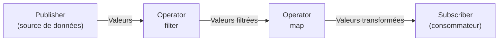

# Combine — Programmation Réactive

<div
  class="omny-meta"
  data-level="🔴 Avancé"
  data-version="1.0"
  data-time="4-5 heures">
</div>

## Introduction

!!! quote "Analogie pédagogique - Le Système d'Abonnement à un Journal"
    Imaginez un journal quotidien. Le journal est un **Publisher** — il produit des nouvelles en continu. Vous êtes un **Subscriber** — vous vous abonnez et recevez chaque édition automatiquement. Entre les deux, il peut y avoir des intermédiaires : un filtre qui ne vous envoie que les articles sur la technologie, un transformateur qui traduit les titres en français, un limiteur qui ne vous envoie qu'un article par jour.

    C'est exactement Combine. Un `Publisher` émet des valeurs dans le temps. Un `Subscriber` les reçoit. Entre les deux, vous pouvez chaîner des **opérateurs** — `filter`, `map`, `debounce`, `combineLatest` — pour transformer, filtrer et combiner les flux de données.

    `@Published` en SwiftUI ? C'est un Publisher. `ObservableObject` ? C'est un mécanisme qui centralise les Publishers d'une classe pour notifier SwiftUI de les réécouter. Une fois ce câblage compris, SwiftUI n'a plus de secret.

Combine est le framework réactif d'Apple, introduit avec SwiftUI en 2019. En Swift 6, `@Observable` simplifie certains cas, mais Combine reste omniprésent dans les codebases iOS existantes et pour les cas avancés.

<br>

---

## Les Concepts Fondamentaux

Combine repose sur trois abstractions :

- **Publisher** — émet une séquence de valeurs dans le temps
- **Operator** — transforme les valeurs entre Publisher et Subscriber
- **Subscriber** — reçoit et consomme les valeurs



<br>

---

## `Publisher` — La Source

```swift title="Swift - Les Publishers de base"
import Combine
import Foundation

// Just : émet une seule valeur puis se termine
let unSeulNombre = Just(42)

// Array.publisher : émet chaque élément puis se termine
let tableauPublisher = [1, 2, 3, 4, 5].publisher

// Timer : émet régulièrement
let timerPublisher = Timer.publish(every: 1.0, on: .main, in: .common)
    .autoconnect()

// NotificationCenter : émet à chaque notification
let notifPublisher = NotificationCenter.default
    .publisher(for: UIApplication.didBecomeActiveNotification)

// Future : émet une seule valeur asynchrone (bridge avec les callbacks @escaping)
let futurePublisher = Future<String, Error> { promesse in
    // Simulation d'une opération asynchrone
    DispatchQueue.global().asyncAfter(deadline: .now() + 1) {
        promesse(.success("Résultat chargé"))
        // ou : promesse(.failure(MonErreur.échecRéseau))
    }
}
```

<br>

---

## `Subscriber` — Consommer avec `sink`

`sink` est le Subscriber le plus courant. Il exécute deux closures : une à la complétion du Publisher, une pour chaque valeur reçue.

```swift title="Swift - sink pour consommer un Publisher"
import Combine

// sink(receiveCompletion:receiveValue:) : le subscriber universel
let abonnement = [10, 20, 30, 40].publisher
    .sink(
        receiveCompletion: { completion in
            switch completion {
            case .finished:
                print("Publisher terminé normalement")
            case .failure(let erreur):
                print("Erreur : \(erreur)")
            }
        },
        receiveValue: { valeur in
            print("Valeur reçue : \(valeur)")
        }
    )

// Affiche :
// Valeur reçue : 10
// Valeur reçue : 20
// Valeur reçue : 30
// Valeur reçue : 40
// Publisher terminé normalement
```

<br>

---

## `AnyCancellable` — Gérer la Durée de Vie

Un abonnement Combine reste actif jusqu'à ce qu'il soit annulé. `AnyCancellable` est le token qui représente cet abonnement et permet de le contrôler.

```swift title="Swift - AnyCancellable et store(in:)"
import Combine

class ServiceRecherche {
    // Set<AnyCancellable> : collection standard pour stocker les abonnements
    // Les abonnements sont annulés automatiquement quand le Set est libéré (ARC)
    private var abonnements = Set<AnyCancellable>()

    func démarrer() {
        // store(in:) stocke le AnyCancellable dans le Set
        // L'abonnement vit aussi longtemps que le Set
        [1, 2, 3].publisher
            .sink { print($0) }
            .store(in: &abonnements)   // & : passage par référence (inout)

        Timer.publish(every: 2.0, on: .main, in: .common)
            .autoconnect()
            .sink { date in print("Tick : \(date)") }
            .store(in: &abonnements)
    }

    func arrêter() {
        // Annule tous les abonnements d'un coup
        abonnements.removeAll()
    }

    deinit {
        // abonnements est libéré → tous les abonnements sont annulés automatiquement
        // Pas besoin de appeler arrêter() explicitement si la durée de vie est gérée par ARC
    }
}
```

!!! warning "Ne jamais ignorer un AnyCancellable"
    Si vous ne stockez pas le `AnyCancellable` retourné par `sink`, l'abonnement est **immédiatement annulé** — votre closure ne sera jamais appelée. C'est le bug Combine le plus fréquent chez les développeurs débutants.

    ```swift title="Swift - Le bug classique"
    // BUG : AnyCancellable ignoré — abonnement annulé instantanément
    [1, 2, 3].publisher.sink { print($0) }   // Rien ne s'affiche

    // CORRECT
    let abonnement = [1, 2, 3].publisher.sink { print($0) }
    // Ou : .store(in: &abonnements)
    ```

<br>

---

## Les Opérateurs Essentiels

Combine fournit plus de 100 opérateurs. En voici les indispensables pour SwiftUI.

```swift title="Swift - map, filter, debounce, removeDuplicates"
import Combine

// map : transformer chaque valeur
[1, 2, 3].publisher
    .map { $0 * 10 }
    .sink { print($0) }   // 10, 20, 30

// filter : garder certaines valeurs
[1, 2, 3, 4, 5, 6].publisher
    .filter { $0 % 2 == 0 }
    .sink { print($0) }   // 2, 4, 6

// compactMap : transformer et ignorer les nils
["1", "deux", "3"].publisher
    .compactMap { Int($0) }
    .sink { print($0) }   // 1, 3

// removeDuplicates : ignorer les valeurs identiques consécutives
[1, 1, 2, 2, 2, 3].publisher
    .removeDuplicates()
    .sink { print($0) }   // 1, 2, 3

// debounce : n'émettre qu'après un délai sans nouvelle valeur
// Indispensable pour la recherche en temps réel (ne pas requêter à chaque frappe)
let recherchePublisher = PassthroughSubject<String, Never>()

recherchePublisher
    .debounce(for: .milliseconds(300), scheduler: RunLoop.main)
    .removeDuplicates()
    .sink { texte in
        print("Recherche : \(texte)")
    }
    .store(in: &abonnements)

recherchePublisher.send("S")
recherchePublisher.send("Sw")
recherchePublisher.send("Swi")
recherchePublisher.send("Swif")
recherchePublisher.send("Swift")
// Après 300ms sans frappe → "Recherche : Swift" (une seule fois)
```

```swift title="Swift - combineLatest et merge"
import Combine

// combineLatest : combine les dernières valeurs de deux Publishers
// Émet chaque fois que l'un ou l'autre émet
let nomPublisher = CurrentValueSubject<String, Never>("Alice")
let âgePublisher = CurrentValueSubject<Int, Never>(28)

nomPublisher
    .combineLatest(âgePublisher)
    .sink { nom, âge in
        print("\(nom) a \(âge) ans")
    }
    .store(in: &abonnements)

nomPublisher.send("Bob")    // "Bob a 28 ans"
âgePublisher.send(30)       // "Bob a 30 ans"

// merge : fusionne deux Publishers du même type en un seul flux
let flux1 = [1, 3, 5].publisher
let flux2 = [2, 4, 6].publisher

flux1.merge(with: flux2)
    .sink { print($0) }   // 1, 3, 5, 2, 4, 6 (ordre non garanti entre les deux)
```

<br>

---

## `Subject` — Publisher que Vous Contrôlez

Un `Subject` est un Publisher que vous pouvez alimenter manuellement en appelant `send()`. Deux types existent.

```swift title="Swift - PassthroughSubject et CurrentValueSubject"
import Combine

// PassthroughSubject : émet les valeurs envoyées, pas de mémoire de la dernière valeur
// Idéal pour : événements ponctuels (bouton pressé, notification)
let événements = PassthroughSubject<String, Never>()

événements
    .sink { print("Événement : \($0)") }
    .store(in: &abonnements)

événements.send("Tap")
événements.send("Swipe")
// Un nouveau subscriber qui s'abonne ICI ne reçoit pas "Tap" ni "Swipe"

// CurrentValueSubject : stocke la dernière valeur émise
// Un nouveau subscriber reçoit immédiatement la valeur courante
let score = CurrentValueSubject<Int, Never>(0)

score
    .sink { print("Score : \($0)") }   // Reçoit immédiatement : "Score : 0"
    .store(in: &abonnements)

score.send(10)   // "Score : 10"
score.send(25)   // "Score : 25"

print(score.value)   // 25 — accès direct à la valeur courante

// Un nouvel abonné reçoit 25 immédiatement (dernière valeur connue)
score
    .sink { print("Nouveau : \($0)") }   // "Nouveau : 25" immédiatement
    .store(in: &abonnements)
```

<br>

---

## `@Published` et `ObservableObject`

C'est le cœur du lien entre Combine et SwiftUI. `@Published` est un Property Wrapper qui crée un `Publisher` pour une propriété. `ObservableObject` est un protocol qui expose un `objectWillChange` Publisher pour notifier SwiftUI.

```swift title="Swift - @Published et ObservableObject décodés"
import Combine
import SwiftUI

// ObservableObject : protocol qui fournit objectWillChange automatiquement
// @Published : property wrapper qui publie chaque changement de la propriété

class ViewModelArticles: ObservableObject {
    // @Published crée un Publisher Publisher<[Article], Never>
    // Chaque fois que articles change, un événement est émis
    @Published var articles: [Article] = []
    @Published var estEnChargement = false
    @Published var erreur: String? = nil

    // terme de recherche : on utilise @Published + Combine pour la recherche réactive
    @Published var termeRecherche: String = ""

    // Articles filtrés : propriété calculée basée sur les articles et le terme
    var articlesFiltres: [Article] {
        guard !termeRecherche.isEmpty else { return articles }
        return articles.filter { $0.titre.localizedCaseInsensitiveContains(termeRecherche) }
    }

    private var abonnements = Set<AnyCancellable>()

    init() {
        // Combiner termeRecherche avec un debounce pour la recherche réactive
        $termeRecherche   // $ accède au Publisher de @Published
            .debounce(for: .milliseconds(300), scheduler: RunLoop.main)
            .removeDuplicates()
            .sink { [weak self] terme in
                print("Recherche déclenchée : \(terme)")
                // En production : appeler une API avec ce terme
            }
            .store(in: &abonnements)
    }

    @MainActor
    func charger() async {
        estEnChargement = true
        erreur = nil

        do {
            let (données, _) = try await URLSession.shared.data(
                from: URL(string: "https://api.example.com/articles")!
            )
            let décodeur = JSONDecoder()
            décodeur.keyDecodingStrategy = .convertFromSnakeCase
            articles = try décodeur.decode([Article].self, from: données)
        } catch {
            self.erreur = error.localizedDescription
        }

        estEnChargement = false
    }
}

// Le $ devant une propriété @Published donne accès au Publisher sous-jacent
// viewModel.$articles → Publisher<[Article], Never>
// viewModel.articles  → [Article] (la valeur courante)
```

```swift title="Swift - Utilisation dans une vue SwiftUI"
import SwiftUI

struct VueArticles: View {
    // @StateObject : crée et possède le ViewModel (voir module SwiftUI)
    @StateObject private var viewModel = ViewModelArticles()

    var body: some View {
        NavigationStack {
            Group {
                if viewModel.estEnChargement {
                    ProgressView("Chargement...")
                } else if let erreur = viewModel.erreur {
                    Text("Erreur : \(erreur)")
                        .foregroundColor(.red)
                } else {
                    List(viewModel.articlesFiltres) { article in
                        Text(article.titre)
                    }
                }
            }
            .searchable(text: $viewModel.termeRecherche)
            // $viewModel.termeRecherche → Binding<String>
            // Quand l'utilisateur tape → termeRecherche change
            // → le Publisher @Published émet → le debounce filtre → recherche déclenchée
        }
        .task { await viewModel.charger() }
    }
}
```

*La chaîne complète : l'utilisateur tape → `termeRecherche` (propriété `@Published`) change → son Publisher émet → `debounce` attend 300ms → `removeDuplicates` filtre → `sink` déclenche la recherche → `articles` est mis à jour (`@Published`) → SwiftUI re-rend la vue.*

<br>

---

## `@Observable` — La Modernisation Swift 5.9

Swift 5.9 (2023) a introduit la macro `@Observable` qui simplifie `ObservableObject` + `@Published` pour les nouveaux projets.

```swift title="Swift - @Observable vs ObservableObject"
import Observation   // Swift 5.9+

// AVANT (Combine) : verbose
class ViewModelAnciensStyle: ObservableObject {
    @Published var articles: [Article] = []
    @Published var estEnChargement = false
}

// APRÈS (Observable) : concis
@Observable
class ViewModelNouveauStyle {
    var articles: [Article] = []        // Automatiquement observé
    var estEnChargement = false          // Automatiquement observé
    // Pas de @Published nécessaire
    // Pas d'import Combine nécessaire pour ce cas simple
}

// Dans la vue :
// @StateObject → @State (avec @Observable)
// @ObservedObject → aucune annotation (avec @Observable)
```

!!! note "Combine reste indispensable pour les cas avancés"
    `@Observable` simplifie l'observation basique, mais Combine reste nécessaire pour : les pipelines de transformation (`debounce`, `combineLatest`, `flatMap`), les bridges avec des APIs qui retournent des Publishers, et les codebases existantes iOS 16 et antérieur. Les deux coexistent sans problème dans un même projet.

<br>

---

## Résumé des Patterns Combine en SwiftUI

| Pattern | Code | Usage |
| --- | --- | --- |
| Observer une propriété | `$viewModel.propriété` | Réagir aux changements |
| Debounce sur la saisie | `.debounce(for:scheduler:)` | Recherche en temps réel |
| Combiner deux états | `.combineLatest(autre)` | Formulaire multi-champs |
| Filtrer les doublons | `.removeDuplicates()` | Éviter les requêtes inutiles |
| Transformer les valeurs | `.map { }` | Adapter les types |
| Annuler un abonnement | `.store(in: &abonnements)` | Gestion de la durée de vie |
| Alimenter manuellement | `subject.send(valeur)` | Événements impératifs |

<br>

---

## Conclusion

!!! quote "Ce qu'il faut retenir de ce module"
    Un **Publisher** émet des valeurs dans le temps. Un **Subscriber** (`sink`) les consomme. Le `AnyCancellable` doit toujours être stocké — sinon l'abonnement est annulé immédiatement. Les opérateurs (`map`, `filter`, `debounce`, `combineLatest`) transforment les flux entre les deux. `@Published` est un Publisher intégré à un Property Wrapper — il émet chaque fois que la propriété change. `ObservableObject` centralise ces Publishers pour notifier SwiftUI. `$propriété` donne accès au Publisher sous-jacent d'une propriété `@Published`. `@Observable` (Swift 5.9+) simplifie les cas courants, mais Combine reste le standard pour les pipelines avancés.

> Vous maîtrisez maintenant l'ensemble des fondations de Swift. Les 18 modules couvrent tout ce dont vous avez besoin pour aborder **SwiftUI** avec une compréhension réelle — pas seulement une capacité à copier des exemples.

<br>