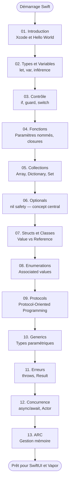

# Swift — Le Langage

!!! quote "Analogie"
    _Swift ressemble à un couteau suisse conçu par des ingénieurs obsédés par la sécurité. Chaque lame est pensée pour éviter les accidents : on ne peut pas utiliser une variable avant de l'avoir initialisée, on ne peut pas ignorer qu'une valeur est potentiellement absente, on ne peut pas accéder à de la mémoire libérée. Le langage vous force à écrire du code correct — pas parce que vous êtes discipliné, mais parce qu'il ne vous laisse pas le choix._

## Objectif

Swift est le langage de programmation officiel d'Apple. Compilé, statiquement typé, conçu pour la performance et la sécurité, il alimente l'intégralité de l'écosystème Apple — iOS, macOS, watchOS, tvOS, visionOS — et s'étend au backend avec Vapor.

Ce parcours couvre Swift de zéro jusqu'au niveau requis pour aborder SwiftUI et Vapor avec une compréhension solide — pas en surface.

!!! note "Comment lire cette section"
    Le parcours est rigoureusement séquentiel. Les **Optionals** (module 06) sont le concept le plus déroutant pour un développeur venant de PHP ou JavaScript — ne les survolez pas. Les **Protocols** (module 09) sont la fondation de SwiftUI — sans eux, `@State` et `@Binding` resteront des formules magiques incomprises.

 

---

## Les treize modules

- ### :simple-swift: 01. Introduction et Environnement
    ---
    Xcode, Swift Playgrounds, Hello World, syntaxe de base, commentaires et le compilateur Swift.

    [Voir le module 01](./01-introduction.md)

- ### :lucide-variable: 02. Types et Variables
    ---
    `let` et `var`, inférence de types, types fondamentaux (`Int`, `Double`, `String`, `Bool`), conversion et interpolation.

    [Voir le module 02](./02-types-variables.md)

- ### :lucide-git-branch: 03. Structures de Contrôle
    ---
    `if`, `else`, `guard`, `switch` avec pattern matching, boucles `for-in`, `while`, `repeat-while`.

    [Voir le module 03](./03-structures-controle.md)

- ### :lucide-function-square: 04. Fonctions et Closures
    ---
    Déclaration, paramètres nommés, valeurs de retour, fonctions comme types, closures et trailing closure syntax.

    [Voir le module 04](./04-fonctions-closures.md)

- ### :lucide-list: 05. Collections
    ---
    `Array`, `Dictionary`, `Set` — value semantics, mutabilité, itération et opérations fonctionnelles (`map`, `filter`, `reduce`).

    [Voir le module 05](./05-collections.md)

- ### :lucide-help-circle: 06. Optionals
    ---
    Le concept central de Swift. `nil`, `?`, `!`, optional binding, `guard let`, nil coalescing, optional chaining.

    [Voir le module 06](./06-optionals.md)

- ### :lucide-box: 07. Structs et Classes
    ---
    Value types vs Reference types, propriétés, méthodes, initialiseurs, `mutating`, `deinit` et quand choisir l'un ou l'autre.

    [Voir le module 07](./07-structs-classes.md)

- ### :lucide-layers: 08. Enumerations
    ---
    Enums simples, raw values, associated values, pattern matching — les enums Swift vont bien au-delà des enums classiques.

    [Voir le module 08](./08-enumerations.md)

- ### :lucide-plug: 09. Protocols et Extensions
    ---
    Protocol-Oriented Programming, conformances, extensions de types existants, default implementations — la philosophie centrale de Swift.

    [Voir le module 09](./09-protocols-extensions.md)

- ### :lucide-code-2: 10. Generics
    ---
    Fonctions et types génériques, type constraints, associated types dans les protocols — la base de SwiftUI.

    [Voir le module 10](./10-generics.md)

- ### :lucide-alert-triangle: 11. Gestion des Erreurs
    ---
    `throws`, `do/catch`, `try`, `try?`, `try!`, le type `Result<T, E>` et les error types personnalisés.

    [Voir le module 11](./11-erreurs.md)

- ### :lucide-zap: 12. Concurrence Moderne
    ---
    `async/await`, `Task`, `Actor`, `@MainActor`, `withTaskGroup` — le modèle de concurrence structurée de Swift.

    [Voir le module 12](./12-concurrence.md)

- ### :lucide-memory-stick: 13. ARC et Gestion Mémoire
    ---
    Automatic Reference Counting, cycles de rétention, `weak`, `unowned`, closures et captures — prévenir les memory leaks.

    [Voir le module 13](./13-arc-memoire.md)

 

---

## Progression recommandée

 

---

## Ce qui rend Swift différent des langages web

Pour un développeur venant de PHP, JavaScript ou Python, Swift introduit plusieurs concepts absents ou fondamentalement différents.

| Concept | Swift | Équivalent PHP / JS |
| --- | --- | --- |
| `let` vs `var` | Immuabilité au niveau compilateur | `const` JS (partiel), pas d'équivalent PHP natif |
| Optionals | `nil` explicite, gestion obligatoire | `null` implicite, erreurs à l'exécution |
| Value types | Les structs sont copiées à l'assignation | Tout objet est une référence en PHP/JS |
| `guard` | Sortie anticipée obligatoire | Early return manuel |
| Protocols | Contrats structurels sans héritage | Interfaces PHP, pas d'équivalent JS natif |
| Associated values | Enums portant des données | Pas d'équivalent direct |
| ARC | Comptage de références automatique | Garbage Collector |
| `actor` | Isolation de données pour la concurrence | Pas d'équivalent (JS est single-threaded) |

 

---

## Conclusion

!!! quote "Notre recommandation"
    Swift récompense la patience. Les modules 06 (Optionals), 07 (Structs/Classes) et 09 (Protocols) sont les trois pivots du langage. Prenez le temps de les maîtriser — chaque concept de SwiftUI est construit dessus. Utilisez Swift Playgrounds pour expérimenter sans friction : pas besoin de créer un projet entier pour tester une idée.

**Point d'entrée : [01. Introduction et Environnement](./01-introduction.md)**

 