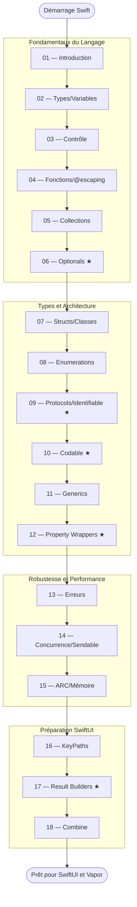

# Swift

!!! quote "Analogie"
    _Swift ressemble à un couteau suisse conçu par des ingénieurs obsédés par la sécurité. Chaque lame est pensée pour éviter les accidents : on ne peut pas utiliser une variable avant de l'avoir initialisée, on ne peut pas ignorer qu'une valeur est potentiellement absente, on ne peut pas accéder à de la mémoire libérée. Le langage vous force à écrire du code correct — pas parce que vous êtes discipliné, mais parce qu'il ne vous laisse pas le choix._

## Objectif

Swift est le langage de programmation officiel d'Apple. Compilé, statiquement typé, conçu pour la performance et la sécurité, il alimente l'intégralité de l'écosystème Apple — iOS, macOS, watchOS, tvOS, visionOS — et s'étend au backend avec Vapor.

Ce parcours couvre Swift de zéro jusqu'au niveau requis pour aborder SwiftUI et Vapor avec une compréhension solide — pas en surface.

!!! note "Comment lire cette section"
    Le parcours est rigoureusement séquentiel. Cinq modules sont des **pivots absolus** : les Optionals (06), les Protocols (09), Codable (10), les Property Wrappers (12) et les Result Builders (17). Sans eux, SwiftUI reste une boîte noire. Les modules 16 à 18 sont spécifiquement conçus pour préparer la transition vers SwiftUI.

 

---

## Fondamentaux du Langage

- ### :simple-swift: 01. Introduction et Environnement
    ---
    Xcode, Swift Playgrounds, Hello World, syntaxe de base, commentaires et le compilateur Swift.

    [Voir le module 01](./01-introduction.md)

- ### :lucide-variable: 02. Types et Variables
    ---
    `let` et `var`, inférence de types, types fondamentaux (`Int`, `Double`, `String`, `Bool`), conversion et interpolation.

    [Voir le module 02](./02-types-variables.md)

- ### :lucide-git-branch: 03. Structures de Contrôle
    ---
    `if`, `else`, `guard`, `switch` avec pattern matching, boucles `for-in`, `while`, `repeat-while`.

    [Voir le module 03](./03-structures-controle.md)

- ### :lucide-function-square: 04. Fonctions et Closures
    ---
    Paramètres nommés, valeurs de retour, **`@escaping`**, fonctions comme types, closures et trailing closure syntax.

    [Voir le module 04](./04-fonctions-closures.md)

- ### :lucide-list: 05. Collections
    ---
    `Array`, `Dictionary`, `Set` — value semantics, mutabilité, itération et `map`, `filter`, `reduce`.

    [Voir le module 05](./05-collections.md)

- ### :lucide-help-circle: 06. Optionals
    ---
    **Pivot 1/5.** Le concept central de Swift. `nil`, `?`, `!`, optional binding, `guard let`, nil coalescing, optional chaining. Exercices inclus.

    [Voir le module 06](./06-optionals.md)

 

---

## Types et Architecture

- ### :lucide-box: 07. Structs et Classes
    ---
    Value types vs Reference types, propriétés, méthodes, `mutating`, `deinit` et quand choisir l'un ou l'autre. Exercices inclus.

    [Voir le module 07](./07-structs-classes.md)

- ### :lucide-layers: 08. Enumerations
    ---
    Enums simples, raw values, associated values et pattern matching — les enums Swift vont bien au-delà des enums classiques.

    [Voir le module 08](./08-enumerations.md)

- ### :lucide-plug: 09. Protocols et Extensions
    ---
    **Pivot 2/5.** Protocol-Oriented Programming, `Equatable`, `Comparable`, `Hashable`, **`Identifiable`**, extensions, default implementations. Exercices inclus.

    [Voir le module 09](./09-protocols-extensions.md)

- ### :lucide-braces: 10. Codable — Sérialisation JSON
    ---
    **Pivot 3/5.** `Codable`, `JSONDecoder`, `JSONEncoder`, `CodingKeys`, snake_case automatique, types imbriqués et pattern réseau complet. Exercices inclus.

    [Voir le module 10](./10-codable.md)

- ### :lucide-code-2: 11. Generics
    ---
    Fonctions et types génériques, type constraints, associated types dans les protocols.

    [Voir le module 11](./11-generics.md)

- ### :lucide-package: 12. Property Wrappers
    ---
    **Pivot 4/5.** `@propertyWrapper`, `wrappedValue`, `projectedValue` (`$`), wrappers paramétrables — pont direct vers `@State`, `@Binding`, `@Published`. Exercices inclus.

    [Voir le module 12](./12-property-wrappers.md)

 

---

## Robustesse et Performance

- ### :lucide-alert-triangle: 13. Gestion des Erreurs
    ---
    `throws`, `do/catch`, `try`, `try?`, `try!`, `Result<T, E>`, error types personnalisés et `defer`.

    [Voir le module 13](./13-erreurs.md)

- ### :lucide-zap: 14. Concurrence Moderne
    ---
    `async/await`, `Task`, `Actor`, `@MainActor`, **`Sendable`** et le modèle de concurrence Swift 6.

    [Voir le module 14](./14-concurrence.md)

- ### :lucide-memory-stick: 15. ARC et Gestion Mémoire
    ---
    Automatic Reference Counting, cycles de rétention, `weak`, `unowned` et captures dans les closures.

    [Voir le module 15](./15-arc-memoire.md)

 

---

## Préparation à SwiftUI

- ### :lucide-map-pin: 16. KeyPaths
    ---
    `\.propriété`, `WritableKeyPath`, `KeyPath` comme fonction — usage dans `ForEach`, `sorted(by:)` et pont vers `@Binding`.

    [Voir le module 16](./16-keypaths.md)

- ### :lucide-hammer: 17. Result Builders
    ---
    **Pivot 5/5.** `@resultBuilder`, `buildBlock`, **`@ViewBuilder`** — comment la syntaxe déclarative `VStack { Text() Button() }` est rendue possible.

    [Voir le module 17](./17-result-builders.md)

- ### :lucide-radio: 18. Combine
    ---
    `Publisher`, `Subscriber`, `sink`, `AnyCancellable`, **`@Published`**, **`ObservableObject`** — le câblage réactif entre les ViewModels et SwiftUI.

    [Voir le module 18](./18-combine.md)

 

---

## Progression recommandée

*Les modules marqués ★ sont les pivots absolus — ne les survolez pas.*

 

---

## Ce qui rend Swift différent des langages web

| Concept | Swift | Équivalent PHP / JS |
| --- | --- | --- |
| `let` vs `var` | Immuabilité au niveau compilateur | `const` JS (partiel), pas d'équivalent PHP natif |
| Optionals | `nil` explicite, gestion obligatoire | `null` implicite, erreurs à l'exécution |
| Value types | Structs copiées à l'assignation | Tout objet est une référence en PHP/JS |
| `guard` | Sortie anticipée obligatoire | Early return manuel |
| `@escaping` | Closure qui survit à la fonction | Toutes les callbacks JS sont escaping par nature |
| Codable | Sérialisation JSON synthétisée | `json_encode` / `JSON.parse` sans typage fort |
| Protocols | Contrats structurels sans héritage | Interfaces PHP, duck typing JS |
| `Identifiable` | `id` unique requis par `ForEach` | Pas d'équivalent natif |
| Property Wrappers | Comportement encapsulé sur une propriété | Getters/setters, décorateurs TypeScript |
| KeyPaths | Référence à une propriété sans sa valeur | Pas d'équivalent direct |
| Result Builders | DSL déclaratif pour les hierarchies de vues | JSX en React (similaire conceptuellement) |
| `Sendable` | Sécurité de concurrence au compilateur | Pas d'équivalent natif |
| ARC | Comptage de références automatique | Garbage Collector |

 

---

## Conclusion

!!! quote "Notre recommandation"
    Swift récompense la patience. Les cinq pivots sont les modules 06, 09, 10, 12 et 17. Prenez le temps de les maîtriser — ils débloquent SwiftUI entièrement. Les modules 16 à 18 sont spécifiquement conçus pour que la syntaxe de SwiftUI soit immédiatement lisible, pas mystérieuse. Utilisez Swift Playgrounds pour expérimenter sans friction, et faites les exercices — le compilateur Swift est votre meilleur professeur.

**Point d'entrée : [01. Introduction et Environnement](./01-introduction.md)**

 