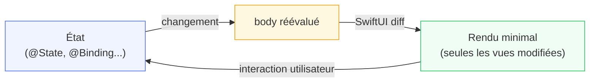

# Introduction & Architecture

<div
  class="omny-meta"
  data-level="🟡 Intermédiaire"
  data-version="1.0"
  data-time="2-3 heures">
</div>

## Introduction

!!! quote "Analogie pédagogique — L'Architecte et le Plan"
    Un maçon construit mur par mur, brique par brique, en suivant des instructions séquentielles. Si le client change d'avis sur la couleur d'une pièce, le maçon doit tout repasser manuellement. Un architecte, lui, produit un plan — il décrit à quoi ressemble le bâtiment terminé. Si le client veut changer la couleur, l'architecte modifie le plan et les conséquences se propagent automatiquement.

    UIKit est le maçon. SwiftUI est l'architecte. Vous décrivez l'interface souhaitée en fonction de l'état actuel — SwiftUI se charge de la construire, la mettre à jour et l'optimiser.

Ce module vous installe dans SwiftUI. Vous comprendrez pourquoi son approche déclarative change fondamentalement la façon d'écrire des interfaces, et vous créerez votre premier projet fonctionnel.

<br>

---

## Déclaratif vs Impératif

Avant SwiftUI, UIKit imposait un modèle **impératif** : le développeur écrivait chaque instruction de mise à jour manuellement.

```swift title="Swift (UIKit) — Approche impérative : vous pilotez chaque changement"
// UIKit : vous décrivez COMMENT modifier l'interface
// Chaque changement d'état nécessite une instruction explicite

class MonViewController: UIViewController {

    // Connexion à un élément de l'interface via Storyboard
    @IBOutlet weak var compteurLabel: UILabel!
    @IBOutlet weak var bouton: UIButton!

    var compteur = 0

    override func viewDidLoad() {
        super.viewDidLoad()
        // Mise à jour initiale — manuelle, obligatoire
        compteurLabel.text = "Compteur : 0"
    }

    @IBAction func incrementer(_ sender: UIButton) {
        compteur += 1
        // Si vous oubliez cette ligne, l'interface reste figée
        compteurLabel.text = "Compteur : \(compteur)"
    }
}
```

*En UIKit, vous êtes responsable de chaque mise à jour. Si vous oubliez de synchroniser un élément, l'interface et les données divergent silencieusement.*

SwiftUI adopte une approche **déclarative** : vous décrivez l'interface en fonction de l'état. La mise à jour est automatique.

```swift title="Swift (SwiftUI) — Approche déclarative : vous décrivez CE QUE l'interface doit afficher"
import SwiftUI

struct MonCompteur: View {

    // @State : variable d'état locale — toute modification déclenche un re-rendu
    @State private var compteur = 0

    var body: some View {
        // Ce bloc décrit l'interface pour l'état ACTUEL de compteur
        // Il sera réévalué automatiquement chaque fois que compteur change
        VStack(spacing: 20) {
            Text("Compteur : \(compteur)")
                .font(.largeTitle)

            Button("Incrémenter") {
                compteur += 1
                // Pas besoin de mettre à jour Text manuellement
                // SwiftUI recalcule body et met à jour l'affichage
            }
            .buttonStyle(.borderedProminent)
        }
    }
}
```

*`body` est réévalué automatiquement chaque fois que `compteur` change. La synchronisation entre état et interface est garantie par le framework — impossible de les désynchroniser.*

<br>

<br>

<br>

---

## Structure d'un Projet SwiftUI

Lorsque vous créez un nouveau projet SwiftUI dans Xcode (File → New → Project → App), Xcode génère une structure minimale :

```
MonApp/
├── MonAppApp.swift      ← Point d'entrée de l'application (@main)
├── ContentView.swift    ← La première vue affichée
└── Assets.xcassets/     ← Images, icônes, couleurs
```

Examinons chaque fichier généré.

<br>

### Le Point d'Entrée — `@main`

```swift title="Swift (SwiftUI) — MonAppApp.swift : le point d'entrée de l'application"
import SwiftUI

// @main indique au compilateur que c'est ici que l'application démarre
// Il n'y a pas de fonction main() explicite — @main la génère automatiquement
@main
struct MonAppApp: App {

    // body décrit la structure de l'application (fenêtres, scènes)
    var body: some Scene {

        // WindowGroup : la scène principale — une fenêtre sur iOS, redimensionnable sur macOS
        WindowGroup {
            // ContentView est la première vue affichée à l'utilisateur
            ContentView()
        }
    }
}
```

*`@main` est une macro Swift — elle déclare que cette struct est le point d'entrée. Sur iOS, une seule scene est affichée. Sur macOS, `WindowGroup` permet d'ouvrir plusieurs fenêtres.*

<br>

### La Vue Principale — `ContentView`

```swift title="Swift (SwiftUI) — ContentView.swift : anatomie d'une vue SwiftUI"
import SwiftUI

// struct View : toutes les vues SwiftUI sont des structs (value types)
// La conformance au protocole View exige une seule propriété : body
struct ContentView: View {

    // body est une computed property qui retourne un View
    // some View est un type opaque — le compilateur connaît le type exact,
    // mais le code appelant n'a pas à le connaître
    var body: some View {

        // VStack empile ses enfants verticalement
        VStack {

            // Image utilise les SF Symbols — bibliothèque d'icônes Apple
            Image(systemName: "globe")
                .imageScale(.large)
                .foregroundStyle(.tint)  // Couleur d'accentuation du système

            Text("Hello, world!")
        }
        .padding()  // Modificateur : ajoute de l'espace autour du VStack
    }
}

// #Preview est la macro Xcode qui génère la prévisualisation Live Preview
// Disponible depuis iOS 17 / Xcode 15 — remplace PreviewProvider
#Preview {
    ContentView()
}
```

*Chaque vue SwiftUI est une struct — légère, copiée, sans état partagé par défaut. Le protocole `View` n'exige qu'une chose : une propriété `body` qui retourne une autre `View`.*

<br>

---

## Live Preview — Votre Tableau de Bord

Le **Live Preview** d'Xcode affiche et rafraîchit votre interface en temps réel pendant que vous écrivez le code — sans lancer le Simulateur.

```swift title="Swift (SwiftUI) — Prévisualisation avec macros modernes (iOS 17 / Xcode 15)"
// Syntaxe moderne avec la macro #Preview
// S'adapte automatiquement au Simulateur sélectionné
#Preview {
    ContentView()
}

// Prévisualisation avec configuration
#Preview("Dark Mode") {
    ContentView()
        .preferredColorScheme(.dark)
}

#Preview("iPhone SE") {
    ContentView()
        .environment(\.sizeCategory, .extraLarge)
}
```

!!! warning "PreviewProvider (iOS 16 et versions antérieures)"
    Avant iOS 17 et Xcode 15, les previews utilisaient le protocole `PreviewProvider`. Si vous travaillez sur une codebase iOS 16, vous verrez cette syntaxe :

    ```swift title="Swift (SwiftUI) — PreviewProvider (iOS 16 — syntaxe ancienne)"
    struct ContentView_Previews: PreviewProvider {
        static var previews: some View {
            ContentView()

            // Prévisualisation en dark mode
            ContentView()
                .preferredColorScheme(.dark)
                .previewDisplayName("Dark Mode")
        }
    }
    ```

    *`PreviewProvider` est toujours valide en iOS 17+. La macro `#Preview` est simplement plus concise. Ce cours utilisera `#Preview` par défaut.*

<br>

---

## `some View` — L'Opaque Return Type

La signature `var body: some View` intrigue au premier abord. Voici pourquoi elle existe.

```swift title="Swift (SwiftUI) — Comprendre some View"
// Problème : chaque combinaison de vues produit un type différent et très long
// VStack<TupleView<(Text, Button<Text>)>> — illisible et fragile

// solution : some View (opaque return type, introduit en Swift 5.1)
// "Je retourne quelque chose qui est une View — le type exact est garanti
//  par le compilateur mais n'a pas à être exposé"

struct ContentView: View {
    var body: some View {       // some View cache le type concret
        VStack {
            Text("Bonjour")
            Button("Cliquer") { }
        }
        // Type réel : VStack<TupleView<(Text, Button<Label<Text, EmptyView>>)>>
        // Avec some View : pas besoin de l'écrire ni de s'en préoccuper
    }
}

// Contrainte fondamentale : body doit toujours retourner LE MÊME type de View
// @ViewBuilder assouplit cette règle pour les conditions (appris au module 12)
```

*`some View` est une garantie de type au moment de la compilation. Swift sait exactement quel type est retourné — mais le code qui appelle `body` n'a pas à le savoir. C'est ce qui rend le style déclaratif pratique.*

<br>

---

## Premier Projet — Configuration Xcode

Voici les étapes pour créer un projet SwiftUI from scratch.

```
1. Xcode → File → New → Project
2. Sélectionner "App" (iOS)
3. Product Name : MonPremierProjet
4. Interface : SwiftUI          ← Important
5. Language : Swift
6. Décocher "Include Tests" pour l'instant
7. Choisir un dossier → Create
```

Une fois le projet créé :

```swift title="Swift (SwiftUI) — Première vue enrichie : votre Hello World SwiftUI"
import SwiftUI

struct ContentView: View {

    // @State : l'état local de cette vue
    // Tout changement déclenche un recalcul de body
    @State private var nomUtilisateur: String = ""
    @State private var aAffichéBonjour: Bool = false

    var body: some View {
        // NavigationStack : fournit une barre de titre et gère la navigation
        NavigationStack {
            VStack(spacing: 24) {

                // Image SF Symbol — adapté automatiquement au mode clair/sombre
                Image(systemName: "hand.wave.fill")
                    .font(.system(size: 60))
                    .foregroundStyle(.orange)

                // TextField : saisie de texte — lie nomUtilisateur à la valeur saisie
                TextField("Votre prénom", text: $nomUtilisateur)
                    .textFieldStyle(.roundedBorder)
                    .padding(.horizontal)

                // Bouton — action dans la closure
                Button("Envoyer") {
                    aAffichéBonjour = true
                }
                .buttonStyle(.borderedProminent)
                .disabled(nomUtilisateur.isEmpty)  // Désactivé si le champ est vide

                // Affichage conditionnel — body est réévalué automatiquement
                if aAffichéBonjour {
                    Text("Bonjour, \(nomUtilisateur) ! 👋")
                        .font(.title2)
                        .bold()
                }

                // Spacer pousse le contenu vers le haut
                Spacer()
            }
            .padding()
            .navigationTitle("Mon Premier SwiftUI")
        }
    }
}

#Preview {
    ContentView()
}
```

*`$nomUtilisateur` crée un `Binding` vers `@State` — le `TextField` peut lire et écrire la valeur. C'est le mécanisme central de réactivité SwiftUI, appris en détail au module 04.*

<br>

---

## Le Simulateur et les Outils de Débogage

Le **Simulateur Xcode** émule un appareil iOS sur votre Mac. Il est accessible via le menu Product → Run (⌘R).

| Outil | Utilisation |
|---|---|
| **Live Preview** | Développement rapide sans lancer le simulateur. Idéal pour le style et la layout. |
| **Simulateur iOS** | Test d'interactions, animations, gestion mémoire, comportements réels. |
| **Canvas Debug** | Inspect la hiérarchie de vues en cliquant sur une vue dans le preview. |
| **Debug View Hierarchy** | (Debug → View Debugging) Visualisation 3D de la pile de vues à l'exécution. |
| **Memory Graph** | Détecter les retain cycles et fuites mémoire. |

```swift title="Swift (SwiftUI) — Utiliser print() pour déboguer"
struct ContentView: View {
    @State private var compteur = 0

    var body: some View {
        // print() dans body permet de voir combien de fois body est réévalué
        // utile pour diagnostiquer des re-rendus excessifs
        let _ = print("body réévalué — compteur =", compteur)

        Button("Tap") {
            compteur += 1
        }
    }
}
```

*`let _ = print(...)` est l'idiome pour exécuter un side-effect dans une expression SwiftUI. En production, retirez ces prints — ils révèlent la fréquence de re-rendu.*

<br>

---

## Architecture Déclarative — Résumé



*SwiftUI compare l'ancienne hiérarchie de vues avec la nouvelle (diff) et n'applique que les changements nécessaires — similaire à React Virtual DOM. Vous ne gérez jamais ce diff manuellement.*

| Concept | Ce que c'est | Ce que vous faites |
|---|---|---|
| `struct View` | Un blueprint d'interface | Définir `body` |
| `body` | La description de l'interface | Composer des vues et modificateurs |
| `@State` | La source of truth | Déclarer et modifier |
| `$` (Binding) | Lien bidirectionnel | Passer aux sous-vues |
| Modificateurs | Transformations de vue | Chaîner avec `.` |
| Live Preview | Rendu en temps réel | Observer les changements |

<br>

---

## Exercices

!!! note "À vous de jouer"

**Exercice 1 — Votre premiere vue**

```swift title="Swift — Exercice 1 : créer une carte de profil"
// Créez une vue ProfileCard qui affiche :
// - Une image SF Symbol au choix (person.circle.fill par exemple)
// - Un Text avec un nom
// - Un Text avec une description courte
// - Un fond coloré (modificateur .background())
// - Des coins arrondis (modificateur .cornerRadius())

struct ProfileCard: View {
    let nom: String
    let description: String

    var body: some View {
        // TODO : composez votre vue ici
        // Résultat attendu : une carte visuelle avec fond et coins arrondis
    }
}

#Preview {
    ProfileCard(nom: "Alice", description: "Développeuse iOS")
}
```

**Exercice 2 — Interactivité de base**

```swift title="Swift — Exercice 2 : dé numérique"
// Créez une vue DéNumérique qui :
// - Affiche un grand chiffre aléatoire entre 1 et 6 (le "dé")
// - Contient un bouton "Lancer" qui génère un nouveau nombre aléatoire
// - Utilise @State pour stocker la valeur du dé

struct DéNumérique: View {
    @State private var valeur = 1

    var body: some View {
        VStack(spacing: 30) {
            // TODO : afficher la valeur avec une grande police
            // TODO : bouton "Lancer le dé"
            //        action : valeur = Int.random(in: 1...6)
        }
    }
}
```

**Exercice 3 — Preview et Dark Mode**

```swift title="Swift — Exercice 3 : configurer les previews"
// Ajoutez à votre DéNumérique deux previews :
// 1. Une preview normale
// 2. Une preview en dark mode
// 3. Une preview avec une police plus grande (accessibility)
// Utilisez la macro #Preview ou PreviewProvider selon votre version Xcode
```

<br>

---

## Conclusion

!!! quote "Ce qu'il faut retenir de ce module"
    SwiftUI est un framework **déclaratif** — vous décrivez l'interface en fonction de l'état, pas les étapes pour la construire. Chaque vue est un `struct` qui se conforme au protocole `View` et implémente `body`. `some View` masque le type concret retourné par `body`. `@main` marque le point d'entrée de l'application. Le **Live Preview** d'Xcode vous donne un retour visuel immédiat. `$variable` crée un `Binding` — le lien bidirectionnel entre une vue et son état. Ces concepts sont les fondations de tout le reste.

> Dans le module suivant, nous explorons les **vues de base et la chaîne de modificateurs** — `Text`, `Image`, `Button`, et comment transformer visuellement n'importe quelle vue avec `.padding()`, `.font()`, `.foregroundStyle()` et une dizaine d'autres modificateurs essentiels.

<br>
