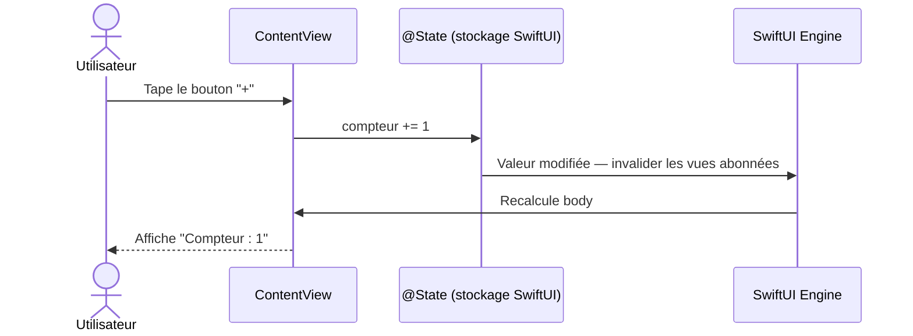
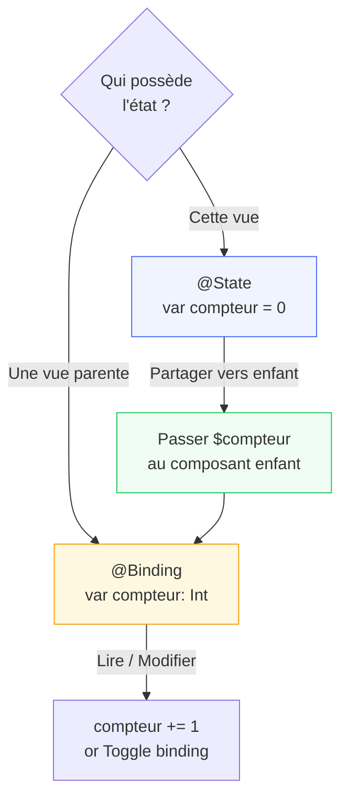

# @State & @Binding

<div
  class="omny-meta"
  data-level="🟡 Intermédiaire"
  data-version="1.0"
  data-time="2-3 heures">
</div>

## Introduction

!!! quote "Analogie pédagogique — Le Tableau d'Affichage et les Abonnés"
    Imaginez un tableau d'affichage central dans une entreprise. Le directeur y accroche une note : "Réunion à 14h". Tous les employés qui y sont abonnés voient la mise à jour immédiatement — ils n'ont pas à venir vérifier, c'est le système qui les notifie. `@State` est ce tableau d'affichage. SwiftUI abonne automatiquement les vues qui le lisent. Quand la valeur change, seules les vues abonnées se mettent à jour — les autres ne sont pas perturbées.

    `@Binding` est le mécanisme qui permet à un employé du rez-de-chaussée de modifier le tableau d'affichage à distance — sans en être propriétaire, mais avec la permission d'y écrire.

Ce module est le **premier pivot** SwiftUI. Sans `@State` et `@Binding`, une interface SwiftUI est statique et morte. Avec eux, elle est réactive.

<br>

---

## Le Problème : Pourquoi les Structs ne Peuvent pas se Modifier

Avant d'apprendre `@State`, il faut comprendre pourquoi il existe.

```swift title="Swift (SwiftUI) — Pourquoi body ne peut pas modifier ses variables"
import SwiftUI

// ⚠️ Ce code ne compile PAS — voici pourquoi
struct CompteurCassé: View {
    var compteur = 0    // Variable ordinaire dans une struct

    var body: some View {
        Button("Incrémenter") {
            compteur += 1   // ERREUR : Cannot assign to property — 'self' is immutable
            // body est une computed property sur une struct
            // Les structs sont des value types — leurs propriétés sont immuables
            // dans un contexte non-mutating
        }
    }
}
```

*SwiftUI génère constamment de nouvelles instances de vos structs lors du rendu. Une variable ordinaire serait réinitialisée à chaque rendu — la valeur serait perdue.*

<br>

---

## `@State` — La Source de Vérité Locale

`@State` est un **Property Wrapper** (module 12 du cours Swift) qui résout ce problème en externalisant le stockage de la valeur hors de la struct, géré par SwiftUI.

```swift title="Swift (SwiftUI) — @State : stockage persistant et réactif"
import SwiftUI

struct CompteurCorrecte: View {

    // @State : SwiftUI gère le stockage de cette valeur
    // - La valeur survit aux re-rendus de body
    // - Toute modification déclenche un recalcul de body
    // - private : @State ne doit jamais être partagé vers l'extérieur directement
    @State private var compteur = 0
    @State private var afficherMessage = false

    var body: some View {
        VStack(spacing: 20) {

            // Lecture de @State : directe, comme une variable normale
            Text("Compteur : \(compteur)")
                .font(.largeTitle)
                .monospacedDigit()      // Largeur fixe pour les chiffres

            HStack(spacing: 16) {
                Button("−") {
                    // Écriture de @State — déclenche automatiquement un re-rendu
                    if compteur > 0 { compteur -= 1 }
                }
                .buttonStyle(.bordered)

                Button("+") {
                    compteur += 1
                    // SwiftUI note la modification, invalide body, et le recalcule
                    // Seules les vues qui LISENT compteur sont re-rendues
                }
                .buttonStyle(.borderedProminent)
            }

            // État booléen — affichage conditionnel
            Toggle("Afficher le message", isOn: $afficherMessage)
                // $afficherMessage : le Binding (expliqué ci-dessous)

            if afficherMessage {
                Text("Le compteur est à \(compteur) !")
                    .foregroundStyle(.indigo)
                    .transition(.opacity)
            }
        }
        .padding()
        .animation(.default, value: afficherMessage)
    }
}
```

*`@State private var` est la convention obligatoire. `private` signale que cet état est interne à la vue — si vous devez le partager, utilisez `@Binding`.*

<br>

### Ce que `@State` fait en coulisses



*SwiftUI maintient un graphe de dépendances entre les propriétés `@State` et les vues. Seules les vues qui lisent `compteur` dans leur `body` sont re-rendues quand `compteur` change.*

<br>

---

## `@Binding` — État Partagé sans Possessivité

`@Binding` crée un **lien bidirectionnel** vers un `@State` appartenant à une vue ancêtre. La vue enfant peut lire et écrire la valeur — sans en être propriétaire.

```swift title="Swift (SwiftUI) — @Binding : partager l'état avec une sous-vue"
import SwiftUI

// Vue enfant — ne possède PAS l'état, y accède via @Binding
struct BoutonToggle: View {

    // @Binding : référence vers un @State externe
    // Cette vue peut lire et écrire actif — mais n'en est pas propriétaire
    @Binding var actif: Bool
    let label: String

    var body: some View {
        Button(action: { actif.toggle() }) {
            HStack {
                Image(systemName: actif ? "checkmark.circle.fill" : "circle")
                    .foregroundStyle(actif ? .green : .gray)
                Text(label)
                    .foregroundStyle(actif ? .primary : .secondary)
            }
        }
        .buttonStyle(.plain)
    }
}

// Vue parente — possède l'état
struct ListeTâches: View {

    // @State : source de vérité, possédée par cette vue
    @State private var tâche1Faite = false
    @State private var tâche2Faite = false
    @State private var tâche3Faite = false

    var toutesTerminées: Bool {
        tâche1Faite && tâche2Faite && tâche3Faite
    }

    var body: some View {
        VStack(alignment: .leading, spacing: 16) {
            Text("Mes tâches")
                .font(.title2)
                .bold()

            // $tâche1Faite : opérateur $ → crée un Binding depuis un @State
            // La vue enfant reçoit un Binding, pas la valeur directe
            BoutonToggle(actif: $tâche1Faite, label: "Configurer Xcode")
            BoutonToggle(actif: $tâche2Faite, label: "Créer premier projet")
            BoutonToggle(actif: $tâche3Faite, label: "Comprendre @State")

            Divider()

            if toutesTerminées {
                Label("Toutes les tâches sont terminées ! 🎉", systemImage: "checkmark.seal.fill")
                    .foregroundStyle(.green)
                    .font(.headline)
            }
        }
        .padding()
    }
}

#Preview {
    ListeTâches()
}
```

*L'opérateur `$` devant un `@State` produit un `Binding<T>` — une référence lecture-écriture vers la valeur. Il faut le `$` uniquement à l'endroit où vous passez la valeur à une vue enfant.*

<!-- ILLUSTRATION REQUISE : swiftui-state-binding-flux.png — Diagramme flux unidirectionnel : @State (parent) → valeur lue dans body → $State crée Binding → sous-vue reçoit Binding → sous-vue modifie → @State change → body recalculé -->

<br>

---

## Flux de Données Unidirectionnel

SwiftUI impose un flux **unidirectionnel** : les données descendent (du parent vers l'enfant), les actions remontent (de l'enfant vers le parent via `@Binding`).

```swift title="Swift (SwiftUI) — Flux unidirectionnel complet"
import SwiftUI

// Composant réutilisable : curseur avec label et valeur affichée
struct CurseurValeur: View {
    let label: String
    let plage: ClosedRange<Double>

    // @Binding : reçoit l'état, ne le possède pas
    @Binding var valeur: Double

    var body: some View {
        VStack(alignment: .leading, spacing: 4) {
            HStack {
                Text(label)
                    .font(.subheadline)
                Spacer()
                // Lecture de la valeur via Binding
                Text(String(format: "%.0f", valeur))
                    .font(.subheadline)
                    .monospacedDigit()
                    .foregroundStyle(.indigo)
            }
            // Slider écrit dans valeur via le Binding $valeur
            Slider(value: $valeur, in: plage)
                .tint(.indigo)
        }
    }
}

// Vue parente qui possède les états
struct ConfigurationApp: View {
    @State private var volume: Double = 50
    @State private var luminosité: Double = 80
    @State private var vitesse: Double = 1.0

    var body: some View {
        VStack(spacing: 24) {
            Text("Configuration")
                .font(.title2)
                .bold()

            // Les @State descendent vers CurseurValeur via $
            CurseurValeur(label: "Volume",      plage: 0...100, valeur: $volume)
            CurseurValeur(label: "Luminosité",  plage: 0...100, valeur: $luminosité)
            CurseurValeur(label: "Vitesse",     plage: 0.5...3, valeur: $vitesse)

            Divider()

            // Résumé de l'état — lu depuis les @State du parent
            Text("Volume: \(Int(volume))% · Lum: \(Int(luminosité))% · Vit: \(String(format: "%.1f", vitesse))×")
                .font(.caption)
                .foregroundStyle(.secondary)
        }
        .padding()
    }
}
```

*`Slider(value: $valeur, in:)` utilise le `$` pour passer un `Binding` au Slider — SwiftUI met à jour automatiquement `valeur` quand l'utilisateur déplace le curseur.*

<br>

---

## `@State` avec des Types Complexes

`@State` peut stocker n'importe quel type valeur — pas seulement les primitifs.

```swift title="Swift (SwiftUI) — @State avec une struct"
import SwiftUI

// Struct de données — value type, parfait pour @State
struct Formulaire {
    var prénom: String = ""
    var nom: String = ""
    var acceptéConditions: Bool = false

    var estValide: Bool {
        !prénom.isEmpty && !nom.isEmpty && acceptéConditions
    }

    var nomComplet: String { "\(prénom) \(nom)".trimmingCharacters(in: .whitespaces) }
}

struct VueInscription: View {

    // @State sur une struct — toute modification d'une propriété
    // déclenche un re-rendu (car la struct entière est copiée)
    @State private var formulaire = Formulaire()

    var body: some View {
        VStack(alignment: .leading, spacing: 20) {

            Text("Inscription")
                .font(.title)
                .bold()

            // $formulaire.prénom : Binding sur une propriété de la struct
            // Syntax sugar de Swift 5.9+ — le compilateur dérive le Binding
            TextField("Prénom", text: $formulaire.prénom)
                .textFieldStyle(.roundedBorder)

            TextField("Nom", text: $formulaire.nom)
                .textFieldStyle(.roundedBorder)

            Toggle("J'accepte les conditions", isOn: $formulaire.acceptéConditions)

            // Résumé en temps réel
            if !formulaire.nomComplet.isEmpty {
                Text("Compte pour : \(formulaire.nomComplet)")
                    .foregroundStyle(.secondary)
                    .font(.caption)
            }

            Button("Créer le compte") {
                print("Inscription de \(formulaire.nomComplet)")
            }
            .buttonStyle(.borderedProminent)
            .disabled(!formulaire.estValide)
        }
        .padding()
    }
}
```

*`$formulaire.prénom` crée un `Binding<String>` pointant sur la propriété `prénom` de la struct stockée dans `@State`. Swift génère automatiquement ces bindings sur les propriétés.*

<br>

---

## `Binding` Manuel — Créer un Binding Personnalisé

Parfois, vous avez besoin d'un `Binding` sans `@State` correspondant — pour transformer une valeur ou intercaler une logique.

```swift title="Swift (SwiftUI) — Binding.init(get:set:) pour des transformations"
import SwiftUI

struct VueThème: View {

    // @State stocke un booléen
    @State private var modeSombre = false

    var body: some View {
        VStack(spacing: 20) {

            // Toggle standard
            Toggle("Mode sombre", isOn: $modeSombre)

            // Binding personnalisé : transforme le Bool en String et vice versa
            let bindingTexte = Binding<String>(
                get: { modeSombre ? "Sombre" : "Clair" },
                set: { modeSombre = $0 == "Sombre" }
            )

            // Picker qui utilise notre Binding transformé
            Picker("Thème", selection: bindingTexte) {
                Text("Clair").tag("Clair")
                Text("Sombre").tag("Sombre")
            }
            .pickerStyle(.segmented)

            Text("Mode actuel : \(modeSombre ? "🌙 Sombre" : "☀️ Clair")")
        }
        .padding()
        .preferredColorScheme(modeSombre ? .dark : .light)
    }
}
```

*`Binding(get:set:)` est utile pour adapter une source d'état à une vue qui attend un type différent, ou pour intercepter les modifications (validation, transformation).*

<br>

---

## Résumé : Quand Utiliser Quoi



| Situation | Solution |
|---|---|
| État local à une vue (compteur, toggle, texte) | `@State private var` |
| Passer un état modifiable à une sous-vue | `@Binding var` + `$état` |
| La valeur n'a pas besoin de déclencher un re-rendu | Constante `let` ou `var` ordinaire |
| L'état doit être partagé entre plusieurs vues non liées | `@StateObject` / `@EnvironmentObject` (module 05) |

<br>

---

## Exercices

!!! note "À vous de jouer"

**Exercice 1 — Compteur avec limites et historique**

```swift title="Swift — Exercice 1 : compteur enrichi"
// Créez un CompteurLimité avec :
// - Une valeur @State (entre min et max)
// - Des boutons + et - (désactivés aux limites)
// - Un bouton Reset
// - L'historique des 5 dernières valeurs affichées

struct CompteurLimité: View {
    let min: Int
    let max: Int

    @State private var valeur: Int        // TODO : initialiser à min
    @State private var historique: [Int]  // TODO : initialement vide

    var body: some View {
        // TODO : implémenter
        // Pensez à ajouter à historique avant de modifier valeur
        // Limitez historique à 5 éléments avec dropFirst()
    }
}

#Preview {
    CompteurLimité(min: 0, max: 10)
}
```

**Exercice 2 — Composant réutilisable avec @Binding**

```swift title="Swift — Exercice 2 : sélecteur de quantité"
// Créez un SélecteurQuantité utilisable comme ceci :
// SélecteurQuantité(quantité: $panier.itemCount, max: stock)
//
// Le composant doit :
// - Afficher : [-] [valeur] [+]
// - Désactiver [-] si quantité == 0
// - Désactiver [+] si quantité == max
// - Être un composant RÉUTILISABLE avec @Binding

struct SélecteurQuantité: View {
    @Binding var quantité: Int
    let max: Int

    var body: some View {
        // TODO
    }
}

// Vue de test
struct VuePanier: View {
    @State private var quantitéA = 2
    @State private var quantitéB = 0

    var body: some View {
        VStack {
            HStack {
                Text("Produit A")
                Spacer()
                SélecteurQuantité(quantité: $quantitéA, max: 5)
            }
            HStack {
                Text("Produit B")
                Spacer()
                SélecteurQuantité(quantité: $quantitéB, max: 10)
            }
            Text("Total : \(quantitéA + quantitéB) article(s)")
                .font(.headline)
        }
        .padding()
    }
}
```

**Exercice 3 — Binding personnalisé**

```swift title="Swift — Exercice 3 : Binding avec validation"
// Créez un TextField pour un âge qui :
// - Stocke l'âge comme Int dans @State
// - Utilise Binding(get:set:) pour convertir Int ↔ String
// - Refuse l'écriture si la valeur < 0 ou > 120
// - Affiche "Âge invalide" si la valeur est hors plage

struct SaisieÂge: View {
    @State private var âge: Int = 18

    var body: some View {
        let bindingTexte = Binding<String>(
            get: { "\(âge)" },
            set: { /* TODO : convertir et valider */ }
        )

        VStack {
            TextField("Votre âge", text: bindingTexte)
                .keyboardType(.numberPad)
                .textFieldStyle(.roundedBorder)

            // TODO : afficher "Âge invalide" si hors plage
            Text("Âge : \(âge) ans")
        }
        .padding()
    }
}
```

<br>

---

## Conclusion

!!! quote "Ce qu'il faut retenir de ce module"
    `@State` est la **source de vérité** d'une vue — SwiftUI externalise le stockage et déclenche un re-rendu à chaque modification. Il doit toujours être `private`. `@Binding` est un **lien bidirectionnel** vers un `@State` externe — la vue enfant peut lire et modifier sans posséder. L'opérateur `$` transforme un `@State` en `Binding` pour le passage aux sous-vues. Le flux de données SwiftUI est **unidirectionnel** : les données descendent via paramètres, les modifications remontent via `@Binding`. `Binding(get:set:)` permet de créer des bindings personnalisés pour transformer ou valider des valeurs.

> Dans le module suivant, nous abordons la gestion d'état partagé entre plusieurs vues : **`@StateObject`**, **`@ObservedObject`** et **`@EnvironmentObject`** — quand `@State` ne suffit plus.

<br>
