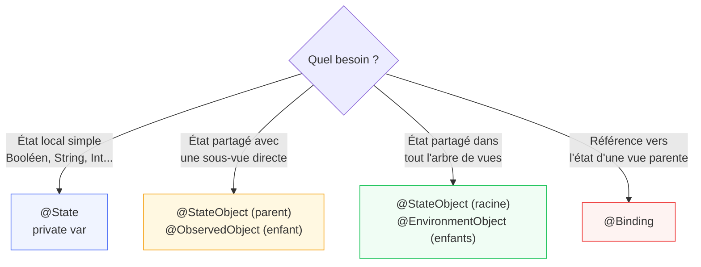

# @StateObject, @ObservedObject, @EnvironmentObject

<div
  class="omny-meta"
  data-level="🟡 Intermédiaire"
  data-version="1.0"
  data-time="3-4 heures">
</div>

## Introduction

!!! quote "Analogie pédagogique — Le Tableau de Bord et les Passagers"
    Dans un avion, le commandant de bord (la vue racine) gère les instruments — vitesse, altitude, cap. Le copilote peut lire et modifier certains instruments. Les passagers voient les informations du panneau d'affichage cabin. Personne ne crée son propre compteur de vitesse — tous lisent la même source. `@StateObject` est l'instrument que le commandant **possède et initialise**. `@ObservedObject` est l'instrument que le copilote **observe sans posséder**. `@EnvironmentObject` est le panneau d'affichage **injecté globalement** — visible par tous sans avoir à le passer manuellement de main en main.

`@State` et `@Binding` couvrent l'état local d'une vue. Dès que plusieurs vues doivent partager un état complexe — un ViewModel, un panier d'achats, un profil utilisateur — il faut `ObservableObject`.

<br>

---

## `ObservableObject` — Le Modèle Observable

`ObservableObject` est un protocole qui transforme une classe en source de données réactive. Les vues SwiftUI s'abonnent automatiquement.

```swift title="Swift (SwiftUI) — Créer un ObservableObject (iOS 16)"
import SwiftUI
import Combine

// ObservableObject : classe dont les propriétés @Published déclenchent des mises à jour
class ViewModelArticles: ObservableObject {

    // @Published : chaque modification de cette propriété émet une notification
    // Les vues SwiftUI abonnées sont automatiquement re-rendues
    @Published var articles: [Article] = []
    @Published var estEnChargement = false
    @Published var erreur: String? = nil

    // Propriété calculée — non @Published mais dépend de @Published
    var nombreArticles: Int { articles.count }

    struct Article: Identifiable {
        let id = UUID()
        let titre: String
        let auteur: String
        let lu: Bool
    }

    func charger() {
        estEnChargement = true
        erreur = nil

        // Simulation d'un appel réseau (600ms)
        DispatchQueue.main.asyncAfter(deadline: .now() + 0.6) {
            self.articles = [
                Article(titre: "Introduction à SwiftUI", auteur: "Alice", lu: true),
                Article(titre: "Comprendre @State",      auteur: "Bob",   lu: false),
                Article(titre: "MVVM avec SwiftUI",      auteur: "Alice", lu: false),
            ]
            self.estEnChargement = false
        }
    }

    func marquerLu(_ article: Article) {
        // Mise à jour dans le tableau — modifie articles → re-rendu automatique
        if let index = articles.firstIndex(where: { $0.id == article.id }) {
            articles[index] = Article(titre: article.titre, auteur: article.auteur, lu: true)
        }
    }
}
```

*`@Published` utilise Combine sous le capot (module 18 du cours Swift). Chaque changement publie un événement — SwiftUI s'y abonne automatiquement quand la vue utilise `@StateObject` ou `@ObservedObject`.*

<br>

---

## `@StateObject` — Le Propriétaire

`@StateObject` instancie **et possède** un `ObservableObject`. Il garantit que l'instance est créée une seule fois et survive aux re-rendus.

```swift title="Swift (SwiftUI) — @StateObject : posséder et créer l'ObservableObject"
import SwiftUI

struct VueListeArticles: View {

    // @StateObject : cette vue CRÉE et POSSÈDE le ViewModel
    // L'instance est créée une seule fois — même si body est recalculé des centaines de fois
    @StateObject private var viewModel = ViewModelArticles()

    var body: some View {
        NavigationStack {
            Group {
                if viewModel.estEnChargement {
                    // Spinner pendant le chargement
                    ProgressView("Chargement...")
                        .frame(maxWidth: .infinity, maxHeight: .infinity)

                } else if let erreur = viewModel.erreur {
                    // Vue d'erreur
                    ContentUnavailableView(
                        "Erreur de chargement",
                        systemImage: "wifi.slash",
                        description: Text(erreur)
                    )

                } else if viewModel.articles.isEmpty {
                    // État vide
                    ContentUnavailableView(
                        "Aucun article",
                        systemImage: "doc.text",
                        description: Text("Appuyez sur Charger pour commencer")
                    )

                } else {
                    // Liste des articles
                    List(viewModel.articles) { article in
                        HStack {
                            VStack(alignment: .leading) {
                                Text(article.titre)
                                    .font(.headline)
                                Text(article.auteur)
                                    .font(.caption)
                                    .foregroundStyle(.secondary)
                            }
                            Spacer()
                            if article.lu {
                                Image(systemName: "checkmark.circle.fill")
                                    .foregroundStyle(.green)
                            }
                        }
                        .onTapGesture {
                            viewModel.marquerLu(article)
                        }
                    }
                }
            }
            .navigationTitle("Articles (\(viewModel.nombreArticles))")
            .toolbar {
                ToolbarItem(placement: .topBarTrailing) {
                    Button("Charger") {
                        viewModel.charger()
                    }
                }
            }
            .onAppear {
                viewModel.charger()
            }
        }
    }
}
```

*`@StateObject` doit être utilisé exactement **une seule fois** par objet — dans la vue qui le crée. Les autres vues qui ont besoin du même objet utilisent `@ObservedObject` (passé en paramètre) ou `@EnvironmentObject` (injecté).*

<br>

---

## `@ObservedObject` — L'Observateur

`@ObservedObject` observe un `ObservableObject` **créé ailleurs**. La vue ne le possède pas — elle le reçoit.

```swift title="Swift (SwiftUI) — @ObservedObject : observer sans posséder"
import SwiftUI

// Sous-vue qui reçoit et observe le ViewModel
struct StatistiquesView: View {

    // @ObservedObject : reçoit l'instance depuis l'extérieur
    // Si body de la vue parente est recalculé, une nouvelle instance pourrait être injectée
    // C'est pour ça que la VUE PARENTE doit utiliser @StateObject (jamais @ObservedObject)
    @ObservedObject var viewModel: ViewModelArticles

    var articlesLus: Int {
        viewModel.articles.filter { $0.lu }.count
    }

    var body: some View {
        HStack(spacing: 24) {
            VStack {
                Text("\(viewModel.nombreArticles)")
                    .font(.title)
                    .bold()
                    .foregroundStyle(.indigo)
                Text("Total")
                    .font(.caption)
                    .foregroundStyle(.secondary)
            }

            Divider().frame(height: 40)

            VStack {
                Text("\(articlesLus)")
                    .font(.title)
                    .bold()
                    .foregroundStyle(.green)
                Text("Lus")
                    .font(.caption)
                    .foregroundStyle(.secondary)
            }

            Divider().frame(height: 40)

            VStack {
                Text("\(viewModel.nombreArticles - articlesLus)")
                    .font(.title)
                    .bold()
                    .foregroundStyle(.orange)
                Text("À lire")
                    .font(.caption)
                    .foregroundStyle(.secondary)
            }
        }
        .padding()
        .background(Color(.systemGray6))
        .cornerRadius(12)
    }
}

// Vue parente — possède le ViewModel avec @StateObject
struct DashboardView: View {
    // @StateObject ici — pas @ObservedObject
    @StateObject private var viewModel = ViewModelArticles()

    var body: some View {
        VStack {
            // Pass the viewModel via @ObservedObject
            StatistiquesView(viewModel: viewModel)

            // Même instance, partagée
            VueListeArticlesSansNavigation(viewModel: viewModel)
        }
    }
}

struct VueListeArticlesSansNavigation: View {
    @ObservedObject var viewModel: ViewModelArticles

    var body: some View {
        List(viewModel.articles) { article in
            Text(article.titre)
        }
    }
}
```

!!! warning "Règle critique : @StateObject vs @ObservedObject"
    - **@StateObject** : dans la vue qui **crée** l'objet. Une seule fois par instance.
    - **@ObservedObject** : dans les vues qui **reçoivent** l'objet en paramètre.

    Un `@ObservedObject` dans une vue qui crée l'objet (`@ObservedObject var vm = ViewModel()`) est un bug fréquent : l'instance est recrée à chaque re-rendu de la vue parente, perdant tout l'état.

<br>

<br>

<br>

---

## `@EnvironmentObject` — L'Injection Globale

`@EnvironmentObject` permet d'**injecter** un `ObservableObject` dans tout l'arbre de vues sans le passer manuellement de vue en vue.

```swift title="Swift (SwiftUI) — @EnvironmentObject : partage global sans prop-drilling"
import SwiftUI

// Le modèle partagé — par exemple le profil utilisateur connecté
class SessionUtilisateur: ObservableObject {
    @Published var estConnecté = false
    @Published var nomUtilisateur = ""
    @Published var rôle: Rôle = .visiteur

    enum Rôle: String {
        case visiteur   = "Visiteur"
        case abonné     = "Abonné"
        case admin      = "Administrateur"
    }

    func connecter(nom: String, rôle: Rôle) {
        self.nomUtilisateur = nom
        self.rôle = rôle
        self.estConnecté = true
    }

    func déconnecter() {
        nomUtilisateur = ""
        rôle = .visiteur
        estConnecté = false
    }
}

// Vue racine — injection de l'EnvironmentObject
struct AppPrincipale: View {
    // @StateObject : cette vue possède la session
    @StateObject private var session = SessionUtilisateur()

    var body: some View {
        if session.estConnecté {
            VueAccueil()
                // .environmentObject() injecte la session dans TOUT le sous-arbre
                .environmentObject(session)
        } else {
            VueConnexion()
                .environmentObject(session)
        }
    }
}

// Vue intermédiaire — N'a pas besoin de la session, ne la passe pas
struct VueAccueil: View {
    var body: some View {
        TabView {
            VueDashboard()
                .tabItem { Label("Accueil", systemImage: "house") }
            VueProfil()
                .tabItem { Label("Profil", systemImage: "person") }
        }
        // Pas de .environmentObject ici — il est hérité automatiquement
    }
}

// Vue profondément imbriquée — accède directement à la session
struct VueProfil: View {
    // @EnvironmentObject : récupère l'instance depuis l'environnement
    // Pas de paramètre — SwiftUI le trouve dans l'arbre des parents
    @EnvironmentObject var session: SessionUtilisateur

    var body: some View {
        VStack(spacing: 16) {
            Image(systemName: "person.circle.fill")
                .font(.system(size: 60))
                .foregroundStyle(.indigo)

            Text(session.nomUtilisateur)
                .font(.title2)
                .bold()

            Text("Rôle : \(session.rôle.rawValue)")
                .foregroundStyle(.secondary)

            Button("Se déconnecter") {
                session.déconnecter()
            }
            .buttonStyle(.bordered)
            .tint(.red)
        }
        .padding()
    }
}

struct VueConnexion: View {
    @EnvironmentObject var session: SessionUtilisateur
    @State private var nomSaisi = ""

    var body: some View {
        VStack(spacing: 20) {
            Text("Connexion")
                .font(.title)
                .bold()

            TextField("Votre prénom", text: $nomSaisi)
                .textFieldStyle(.roundedBorder)

            Button("Se connecter") {
                session.connecter(nom: nomSaisi, rôle: .abonné)
            }
            .buttonStyle(.borderedProminent)
            .disabled(nomSaisi.isEmpty)
        }
        .padding()
    }
}

// Preview — injecter manuellement pour la preview
#Preview {
    VueProfil()
        .environmentObject(SessionUtilisateur())
}
```

!!! warning "Crash en production si @EnvironmentObject manquant"
    Si une vue utilise `@EnvironmentObject` mais que l'objet n'a pas été injecté par un ancêtre avec `.environmentObject()`, l'application crash à l'exécution. Ce crash **n'est pas détecté à la compilation**. Pour les previews, toujours injecter manuellement.

<br>

---

## Comparatif Complet



| Wrapper | Qui crée ? | Portée | Déclenche re-rendu ? |
|---|---|---|---|
| `@State` | Cette vue | Locale | ✓ |
| `@Binding` | Vue parente | Référence | ✓ (source) |
| `@StateObject` | Cette vue | Cette vue + passé manuellement | ✓ (@Published) |
| `@ObservedObject` | Vue externe | Reçu en paramètre | ✓ (@Published) |
| `@EnvironmentObject` | Vue ancêtre | Tout le sous-arbre | ✓ (@Published) |

<br>

---

## Exercices

!!! note "À vous de jouer"

**Exercice 1 — Panier d'achats**

```swift title="Swift — Exercice 1 : ObservableObject pour un panier"
// Créez un PanierViewModel avec :
// - @Published var items: [PanierItem]
// - @Published var remise: Double (0.0 à 0.5)
// - Propriété calculée total (avec remise)
// - func ajouter(_ item: PanierItem)
// - func supprimer(_ item: PanierItem)
// Puis créez deux vues :
// - VueListeProduits (@StateObject — crée le panier)
// - VueRésuméPanier (@ObservedObject — affiche le total)

struct PanierItem: Identifiable {
    let id = UUID()
    let nom: String
    let prix: Double
    var quantité: Int
}

class PanierViewModel: ObservableObject {
    // TODO
}
```

**Exercice 2 — Thème global avec @EnvironmentObject**

```swift title="Swift — Exercice 2 : thème d'application partagé"
// Créez un ThèmeApp: ObservableObject avec :
// - @Published var couleurPrimaire: Color
// - @Published var taillePolice: CGFloat
// Injectez-le depuis App.swift (ou votre vue racine)
// Utilisez-le dans 3 vues différentes sans le passer en paramètre

class ThèmeApp: ObservableObject {
    @Published var couleurPrimaire: Color = .indigo
    @Published var taillePolice: CGFloat = 16
}

// L'objectif : modifier la couleur dans une vue → toutes les vues se mettent à jour
```

**Exercice 3 — Debugging des re-rendus**

```swift title="Swift — Exercice 3 : observer les re-rendus"
// Ajoutez print() dans le body de chaque vue de votre exercice 1
// Observez dans la console combien de fois chaque vue se re-rend
// Quand vous modifiez un item dans le panier, quelle vue se re-rend ?
// Comment minimiser les re-rendus inutiles ?
//
// Indice : extraire des sous-vues limite les re-rendus aux vues concernées

struct VueueOptimisée: View {
    @ObservedObject var panier: PanierViewModel

    var body: some View {
        let _ = print("VueOptimisée re-rendu") // Observer la fréquence
        // TODO : extraire les sous-vues pour minimiser les re-rendus
    }
}
```

<br>

---

## Conclusion

!!! quote "Ce qu'il faut retenir de ce module"
    `ObservableObject` est une classe réactive — ses propriétés `@Published` notifient les vues abonnées à chaque modification. `@StateObject` **crée et possède** l'objet — une seule fois par instance, dans la vue racine. `@ObservedObject` **observe sans posséder** — reçoit l'instance en paramètre. `@EnvironmentObject` **injecte l'objet dans tout le sous-arbre** sans prop-drilling — inject via `.environmentObject()` sur un ancêtre, récupéré via `@EnvironmentObject` dans n'importe quel descendant. La règle d'or : utilisez `@StateObject` exactement **une seule fois** par instance — les autres vues utilisent `@ObservedObject` ou `@EnvironmentObject`.

> Dans le module suivant, nous verrons `@Observable` (iOS 17+) — la version modernisée qui remplace `ObservableObject` + `@Published` par une macro Swift plus simple et plus performante, avec observation granulaire propriété par propriété.

<br>
