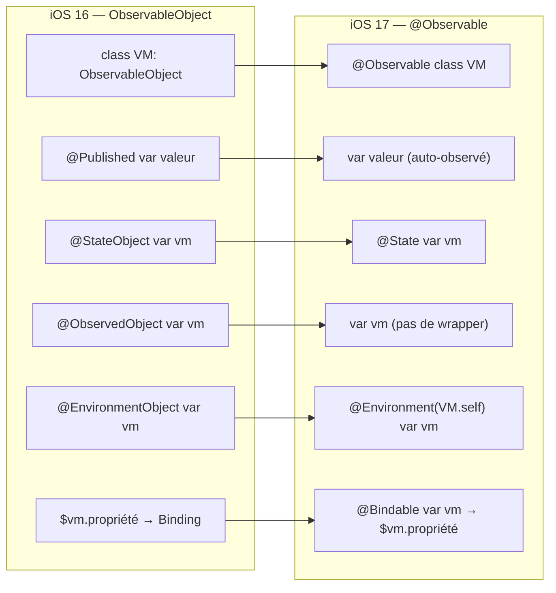

# @Observable (iOS 17+)

<div
  class="omny-meta"
  data-level="🟡 Intermédiaire"
  data-version="1.0"
  data-time="2-3 heures">
</div>

## Introduction

!!! quote "Analogie pédagogique — Le Tableau d'Affichage Intelligent"
    Dans l'ancienne version (`ObservableObject`), le tableau d'affichage sonnait l'alarme dès qu'UNE information changeait — que vous ayez besoin de cette information ou non. Si le tableau avait 10 rubriques et qu'une seule changeait, tous les abonnés — même ceux qui ne lisaient que les 9 autres rubriques — étaient réveillés pour rien. `@Observable` (iOS 17) est la version intelligente : chaque personne s'abonne exactement aux rubriques qu'elle lit, et n'est notifiée QUE quand ses rubriques à elle changent. Résultat : moins de re-rendus, meilleures performances.

!!! warning "iOS 17+ uniquement — Compatibilité"
    `@Observable` nécessite **iOS 17, macOS 14 ou watchOS 10**. Si votre application doit supporter iOS 16, utilisez `ObservableObject` (module 05). Pour les projets iOS 17+ exclusivement, `@Observable` est l'approche recommandée par Apple. Ce module enseigne les deux et explique la migration.

<br>

---

## Le Problème avec `ObservableObject`

Avant de comprendre `@Observable`, voyons le problème qu'il résout.

```swift title="Swift (SwiftUI) — Le problème de l'observation coarse-grained"
import SwiftUI

// ObservableObject classique
class ViewModelClassique: ObservableObject {
    @Published var nom: String = "Alice"
    @Published var score: Int = 0
    @Published var estConnecté: Bool = true
}

// Vue A : n'affiche que le nom
struct VueNom: View {
    @ObservedObject var vm: ViewModelClassique

    var body: some View {
        let _ = print("VueNom re-rendu")  // Observer les re-rendus
        Text(vm.nom)
    }
}

// Vue B : n'affiche que le score
struct VueScore: View {
    @ObservedObject var vm: ViewModelClassique

    var body: some View {
        let _ = print("VueScore re-rendu")  // Observer les re-rendus
        Text("\(vm.score)")
    }
}

// Problème : si vm.score change, VueNom se re-rend AUSSI
// même si elle ne montre que vm.nom
// ObservableObject publie un signal pour le ViewModel ENTIER
// → SwiftUI re-rend toutes les vues abonnées à ce ViewModel
```

*Avec `ObservableObject`, toute modification d'une propriété `@Published` déclenche un re-rendu de **toutes** les vues qui observent ce ViewModel, même celles qui n'utilisent pas la propriété modifiée.*

<br>

---

## `@Observable` — La Solution Granulaire

```swift title="Swift (SwiftUI) — @Observable : observation propriété par propriété"
import SwiftUI
import Observation    // Framework Observation (iOS 17+)

// La macro @Observable remplace la conformance à ObservableObject
// et l'annotation @Published sur chaque propriété
@Observable
class ViewModelModerne {
    var nom: String = "Alice"      // Pas de @Published nécessaire
    var score: Int = 0             // Observé automatiquement
    var estConnecté: Bool = true   // Observé automatiquement

    // Les propriétés privées ne sont PAS observées par les vues
    private var cacheDonnées: [String: Any] = [:]

    // Les computed properties SONT observées (si elles lisent des propriétés observées)
    var résumé: String { "\(nom) — \(score) pts" }
}

// Vue A : n'affiche que le nom
// Avec @Observable, SwiftUI installe une observation PRÉCISE sur vm.nom
// Si vm.score change → VueNom N'EST PAS re-rendue ✓
struct VueNomObservable: View {
    var vm: ViewModelModerne  // Pas de @StateObject ni @ObservedObject !

    var body: some View {
        let _ = print("VueNom re-rendu")
        Text(vm.nom)         // SwiftUI observe vm.nom précisément
    }
}

// Vue B : n'affiche que le score
// Observation précise sur vm.score — non affectée par les changements de vm.nom
struct VueScoreObservable: View {
    var vm: ViewModelModerne

    var body: some View {
        let _ = print("VueScore re-rendu")
        Text("\(vm.score)")  // SwiftUI observe vm.score précisément
    }
}
```

*SwiftUI trace les accès aux propriétés dans `body`. Seules les vues qui ont **accédé** à `nom` dans leur `body` sont re-rendues quand `nom` change. C'est l'observation granulaire.*

<br>

---

## `@Observable` en Pratique — Comparaison Complète

```swift title="Swift (SwiftUI) — Avant (iOS 16) vs Après (iOS 17)"
import SwiftUI

// ═══════════════════════════════════════════════════════
// VERSION iOS 16 — ObservableObject + @Published
// ═══════════════════════════════════════════════════════

class PanierIOS16: ObservableObject {
    @Published var articles: [String] = []
    @Published var promo: Double = 0.0
    @Published var adresseLivraison: String = ""

    var total: Double { Double(articles.count) * 9.99 * (1 - promo) }
}

struct VuePanierIOS16: View {
    @StateObject private var panier = PanierIOS16()  // @StateObject obligatoire

    var body: some View {
        Text("Total : \(panier.total, format: .currency(code: "EUR"))")
    }
}

// ═══════════════════════════════════════════════════════
// VERSION iOS 17 — @Observable
// ═══════════════════════════════════════════════════════

@Observable
class PanierIOS17 {
    var articles: [String] = []       // Pas de @Published
    var promo: Double = 0.0
    var adresseLivraison: String = ""

    var total: Double { Double(articles.count) * 9.99 * (1 - promo) }
}

struct VuePanierIOS17: View {
    // @State pour les modèles @Observable créés par cette vue
    @State private var panier = PanierIOS17()  // @State, pas @StateObject

    var body: some View {
        Text("Total : \(panier.total, format: .currency(code: "EUR"))")
        // Observation granulaire : re-rendu seulement si panier.total change
    }
}
```

<!-- ILLUSTRATION REQUISE : swiftui-observable-timeline.png — Timeline iOS 16 (ObservableObject) → iOS 17 (@Observable) avec les changements de syntaxe listés -->

<br>

---

## Règles de Création avec `@Observable`

```swift title="Swift (SwiftUI) — Quels wrappers utiliser avec @Observable"
import SwiftUI

@Observable
class MonModèle {
    var valeur: Int = 0
}

// Cas 1 : La vue CRÉE et POSSÈDE le modèle → @State
struct VuePropriétaire: View {
    @State private var modèle = MonModèle()   // @State (pas @StateObject)

    var body: some View {
        Text("\(modèle.valeur)")
    }
}

// Cas 2 : La vue REÇOIT le modèle en paramètre → var simple (pas de wrapper)
struct VueObservateur: View {
    var modèle: MonModèle   // Pas de @ObservedObject — juste var

    var body: some View {
        Text("\(modèle.valeur)")
        // SwiftUI installe automatiquement l'observation au premier accès
    }
}

// Cas 3 : Injecté dans l'Environment → @Environment (pas @EnvironmentObject)
struct VueEnvironnement: View {
    @Environment(MonModèle.self) var modèle  // @Environment avec le type

    var body: some View {
        Text("\(modèle.valeur)")
    }
}

// Injection dans la vue racine
struct VueRacine: View {
    @State private var modèle = MonModèle()

    var body: some View {
        VueEnvironnement()
            .environment(modèle)   // Pas .environmentObject — juste .environment
    }
}
```

*Avec `@Observable`, les conventions changent : `@StateObject` → `@State`, `@ObservedObject` → `var` simple, `@EnvironmentObject` → `@Environment(Type.self)`. Les vues qui lisent les propriétés déclenchent l'observation automatiquement.*

<br>

---

## `@Bindable` — Créer des Bindings depuis @Observable

Avec `ObservableObject`, l'opérateur `$` créait les `Binding`. Avec `@Observable`, on utilise `@Bindable`.

```swift title="Swift (SwiftUI) — @Bindable pour les bindings TextField, Toggle, etc."
import SwiftUI

@Observable
class ProfilUtilisateur {
    var nom: String = ""
    var email: String = ""
    var notificationsActives: Bool = true
    var niveauVolume: Double = 0.7
}

struct FormulaireProfil: View {

    // La vue possède le profil : @State
    @State private var profil = ProfilUtilisateur()

    var body: some View {
        Form {
            Section("Informations") {
                // @Bindable permet d'utiliser $profil.nom avec @Observable
                // Sans @Bindable, le compilateur ne peut pas dériver le Binding
                @Bindable var profil = profil

                TextField("Nom", text: $profil.nom)
                TextField("Email", text: $profil.email)
                    .keyboardType(.emailAddress)
                    .textInputAutocapitalization(.never)
            }

            Section("Préférences") {
                @Bindable var profil = profil

                Toggle("Notifications", isOn: $profil.notificationsActives)
                    .tint(.indigo)

                VStack(alignment: .leading) {
                    Text("Volume : \(Int(profil.niveauVolume * 100))%")
                    Slider(value: $profil.niveauVolume, in: 0...1)
                }
            }

            Section {
                Button("Sauvegarder") {
                    sauvegarder(profil)
                }
                .frame(maxWidth: .infinity)
                .buttonStyle(.borderedProminent)
            }
        }
        .navigationTitle("Mon Profil")
    }

    func sauvegarder(_ profil: ProfilUtilisateur) {
        print("Sauvegarde : \(profil.nom) — \(profil.email)")
    }
}

#Preview {
    NavigationStack {
        FormulaireProfil()
    }
}
```

*`@Bindable` s'utilise comme une variable locale dans `body`. Il "libère" la capacité de créer des `Binding` sur les propriétés du modèle `@Observable` avec l'opérateur `$`.*

<br>

---

## Tableau de Migration iOS 16 → iOS 17



| iOS 16 | iOS 17 |
|---|---|
| `class VM: ObservableObject` | `@Observable class VM` |
| `@Published var valeur` | `var valeur` (observation implicite) |
| `@StateObject var vm = VM()` | `@State var vm = VM()` |
| `@ObservedObject var vm: VM` | `var vm: VM` |
| `@EnvironmentObject var vm: VM` | `@Environment(VM.self) var vm` |
| `.environmentObject(vm)` | `.environment(vm)` |
| `$vm.prop` (automatique) | `@Bindable var vm = vm` puis `$vm.prop` |

<br>

---

## Support iOS 16 et iOS 17 dans le Même Projet

Si vous devez supporter les deux versions :

```swift title="Swift (SwiftUI) — Compatibilité iOS 16 et iOS 17+ dans le même projet"
import SwiftUI

// Option recommandée : utiliser ObservableObject pour la compatibilité iOS 16+
// Annoter avec @available pour signaler les améliorations iOS 17

class ViewModelCompatible: ObservableObject {
    @Published var articles: [String] = []
    @Published var titre: String = "Mon App"
}

// Quand vous passez à iOS 17 minimum :
// 1. Remplacer ObservableObject par @Observable
// 2. Supprimer tous les @Published
// 3. Remplacer @StateObject par @State
// 4. Remplacer @ObservedObject par var simple
// 5. Remplacer @EnvironmentObject par @Environment(Type.self)
// 6. Ajouter @Bindable là où vous avez besoin de $binding

// Les deux architectures fonctionnent — choisissez selon votre iOS minimum
```

!!! tip "Conseil pour les nouveaux projets"
    Si vous ciblez iOS 17+, utilisez `@Observable` dès le départ — c'est plus simple, plus performant, et la direction officielle d'Apple. Si iOS 16 est requis, utilisez `ObservableObject` — vous migrerez vers `@Observable` quando vous relèverez le minimum supporté.

<br>

---

## Exercices

!!! note "À vous de jouer"

**Exercice 1 — Réécrire en @Observable**

```swift title="Swift — Exercice 1 : migration ObservableObject → @Observable"
// Réécrivez ce ViewModel en @Observable :

class ViewModelMusique: ObservableObject {
    @Published var piste: String = "Aucune"
    @Published var artiste: String = ""
    @Published var estEnLecture: Bool = false
    @Published var volume: Double = 0.8
    @Published var historique: [String] = []

    func lire(piste: String, artiste: String) {
        self.piste = piste
        self.artiste = artiste
        self.estEnLecture = true
        historique.append("\(artiste) — \(piste)")
    }

    func pause() { estEnLecture = false }
}

// Adaptez aussi la vue qui l'utilise
struct VueLecteur: View {
    @StateObject private var vm = ViewModelMusique()  // À changer

    var body: some View {
        // TODO : garder le même comportement avec @Observable
        EmptyView()
    }
}
```

**Exercice 2 — @Bindable dans un formulaire**

```swift title="Swift — Exercice 2 : formulaire de réservation avec @Observable et @Bindable"
// Créez un modèle @Observable pour une réservation d'hôtel :
// - var nomClient: String
// - var dateArrivée: Date
// - var dateDépart: Date
// - var nombrePersonnes: Int (1 à 10)
// - var chambreSupérieure: Bool
// - var prixTotal: Double (computed : calculé depuis les dates et options)
//
// Puis créez un formulaire SwiftUI avec @Bindable pour tous les champs

@Observable
class RéservationHôtel {
    // TODO
}

struct FormulaireRéservation: View {
    @State private var réservation = RéservationHôtel()

    var body: some View {
        // TODO : Form avec tous les champs via @Bindable
    }
}
```

**Exercice 3 — Comparer les re-rendus**

```swift title="Swift — Exercice 3 : mesurer l'avantage des performances"
// Créez deux ViewModels équivalents :
// 1. ClassiqueVM: ObservableObject avec @Published var a, b, c
// 2. ModerneVM: @Observable class avec var a, b, c
//
// Puis créez deux vues qui n'affichent que la propriété "a"
// Modifiez la propriété "b" et comptez les re-rendus avec print()
// Combien de re-rendus inutiles ObservableObject génère-t-il ?
```

<br>

---

## Conclusion

!!! quote "Ce qu'il faut retenir de ce module"
    `@Observable` (iOS 17+) remplace `ObservableObject` + `@Published` avec une syntaxe plus simple et une observation **granulaire** propriété par propriété. Avec `@Observable` : pas de `@Published`, `@StateObject` → `@State`, `@ObservedObject` → `var` simple, `@EnvironmentObject` → `@Environment(Type.self)`. `@Bindable` débloque la création de `Binding` (opérateur `$`) pour les propriétés d'un modèle `@Observable`. La différence de performance est notable dans les applications complexes : seules les vues qui lisent une propriété sont re-rendues quand elle change. Pour iOS 16, continuez avec `ObservableObject`.

> Dans le module suivant, nous abordons la **navigation SwiftUI** — `NavigationStack`, `NavigationLink`, `.navigationDestination()` et `NavigationPath` pour construire des flux de navigation complexes, profonds et testables.

<br>
