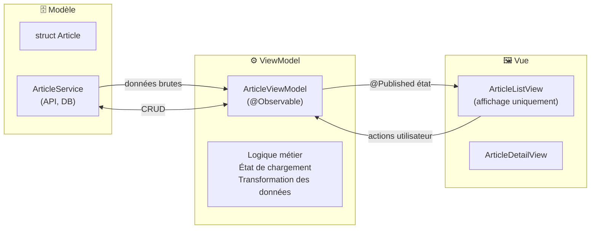

# Architecture MVVM

<div
  class="omny-meta"
  data-level="🔴 Avancé"
  data-version="1.0"
  data-time="3-4 heures">
</div>

## Introduction

!!! quote "Analogie pédagogique — La Brigade de Cuisine"
    Dans un restaurant étoilé, les rôles sont stricts. Le chef de partie (ViewModel) prépare les assiettes selon les commandes. Il ne sort jamais en salle. Le serveur (View) présente les plats aux clients (utilisateur) — il ne cuisine pas. Le gestionnaire des stocks (Model) ne prépare pas les plats — il fournit les ingrédients. Chacun connaît ses responsabilités, et personne n'empiète sur le rôle des autres. C'est MVVM : Modèle (données brutes), ViewModel (logique de présentation), Vue (interface uniquement).

Sans architecture, SwiftUI devient rapidement un monolithe où la vue fait tout : charge les données, les transforme, gère les erreurs, anime l'interface. MVVM apporte une **séparation des responsabilités** qui rend le code testable, réutilisable et maintenable.

<br>

---

## Les Trois Couches MVVM



*La règle fondamentale : **la Vue ne connaît pas le Modèle**. Elle ne voit que ce que le ViewModel lui expose. La Vue contient uniquement du code d'affichage — jamais de logique métier.*

<br>

---

## Couche Modèle — Données Brutes

```swift title="Swift (SwiftUI) — Couche Modèle : structs et services"
import Foundation

// ════════════════════════════════════════════
// MODÈLE — structures de données pures
// ════════════════════════════════════════════

// 1. Struct de données — conforme à Codable pour API, Identifiable pour ForEach
struct Article: Identifiable, Codable, Hashable {
    let id: Int
    let titre: String
    let résumé: String
    let contenu: String
    let auteur: String
    let datePublication: Date
    let catégorie: Catégorie
    var estFavori: Bool = false

    enum Catégorie: String, Codable, CaseIterable {
        case swift      = "Swift"
        case swiftui    = "SwiftUI"
        case vapor      = "Vapor"
        case autre      = "Autre"

        var couleur: String {  // Retourne une String — pas de SwiftUI dans le Modèle !
            switch self {
            case .swift:    return "blue"
            case .swiftui:  return "indigo"
            case .vapor:    return "teal"
            case .autre:    return "gray"
            }
        }
    }
}

// ════════════════════════════════════════════
// SERVICE — accès aux données (API, DB)
// ════════════════════════════════════════════

// Protocol : permet de remplacer le service réel par un mock dans les tests
protocol ArticleServiceProtocol {
    func récupérerArticles() async throws -> [Article]
    func récupérerArticle(id: Int) async throws -> Article
    func modifierFavori(articleId: Int, estFavori: Bool) async throws
}

// Implémentation réelle
final class ArticleService: ArticleServiceProtocol {

    private let baseURL = URL(string: "https://api.omnydocs.fr/articles")!

    func récupérerArticles() async throws -> [Article] {
        let (données, réponse) = try await URLSession.shared.data(from: baseURL)

        guard let http = réponse as? HTTPURLResponse,
              (200...299).contains(http.statusCode) else {
            throw ArticleErreur.serveur
        }

        return try JSONDecoder().decode([Article].self, from: données)
    }

    func récupérerArticle(id: Int) async throws -> Article {
        let url = baseURL.appendingPathComponent("\(id)")
        let (données, _) = try await URLSession.shared.data(from: url)
        return try JSONDecoder().decode(Article.self, from: données)
    }

    func modifierFavori(articleId: Int, estFavori: Bool) async throws {
        // PATCH /articles/{id}/favori
    }
}

// Service mock — utilisé dans les previews et les tests
final class ArticleServiceMock: ArticleServiceProtocol {
    func récupérerArticles() async throws -> [Article] {
        // Données statiques — pas de réseau nécessaire
        try await Task.sleep(for: .milliseconds(300))  // Simuler délai réseau
        return Article.exemples
    }

    func récupérerArticle(id: Int) async throws -> Article {
        return Article.exemples.first { $0.id == id }
        ?? { throw ArticleErreur.nonTrouvé }()
    }

    func modifierFavori(articleId: Int, estFavori: Bool) async throws { }
}

enum ArticleErreur: LocalizedError {
    case serveur
    case nonTrouvé
    case réseau(Error)

    var errorDescription: String? {
        switch self {
        case .serveur:    return "Erreur serveur. Réessayez plus tard."
        case .nonTrouvé:  return "Article introuvable."
        case .réseau(let e): return "Erreur réseau : \(e.localizedDescription)"
        }
    }
}

// Données sample pour les previews
extension Article {
    static let exemples: [Article] = [
        Article(id: 1, titre: "Introduction à SwiftUI",
                résumé: "Les bases du framework déclaratif d'Apple.",
                contenu: "SwiftUI est révolutionnaire...",
                auteur: "Alice Martin",
                datePublication: .now.addingTimeInterval(-86400 * 3),
                catégorie: .swiftui),
        Article(id: 2, titre: "Async/Await en pratique",
                résumé: "Gérer la concurrence avec élégance.",
                contenu: "Depuis Swift 5.5, async/await...",
                auteur: "Bob Dupont",
                datePublication: .now.addingTimeInterval(-86400),
                catégorie: .swift),
    ]
}
```

<br>

---

## Couche ViewModel — La Logique de Présentation

```swift title="Swift (SwiftUI) — Couche ViewModel : orchestration et état"
import SwiftUI

// ════════════════════════════════════════════
// VIEWMODEL — logique de présentation
// ════════════════════════════════════════════

@MainActor
@Observable
final class ArticleListViewModel {

    // État présenté à la Vue — jamais les modèles bruts directement
    var articles: [Article] = []
    var estEnChargement = false
    var erreur: String? = nil
    var filtreFavori = false
    var rechercheTexte = ""

    // Données filtrées — computed, dérivées de l'état
    var articlesFiltres: [Article] {
        var résultat = articles

        if filtreFavori {
            résultat = résultat.filter { $0.estFavori }
        }

        if !rechercheTexte.isEmpty {
            résultat = résultat.filter {
                $0.titre.localizedCaseInsensitiveContains(rechercheTexte) ||
                $0.auteur.localizedCaseInsensitiveContains(rechercheTexte)
            }
        }

        return résultat
    }

    var nombreFavoris: Int { articles.filter { $0.estFavori }.count }

    // Injection de dépendance — le service est injecté, pas créé dans le ViewModel
    private let service: ArticleServiceProtocol

    init(service: ArticleServiceProtocol = ArticleService()) {
        self.service = service
    }

    // ─── Actions ───────────────────────────────────────────────

    func charger() async {
        estEnChargement = true
        erreur = nil

        do {
            articles = try await service.récupérerArticles()
        } catch {
            self.erreur = error.localizedDescription
        }

        estEnChargement = false
    }

    func basculerFavori(_ article: Article) {
        guard let index = articles.firstIndex(where: { $0.id == article.id }) else { return }
        articles[index].estFavori.toggle()

        // Mise à jour asynchrone sur le serveur (fire and forget)
        Task {
            try? await service.modifierFavori(
                articleId: article.id,
                estFavori: articles[index].estFavori
            )
        }
    }

    func réinitialiserRecherche() {
        rechercheTexte = ""
        filtreFavori = false
    }
}
```

<br>

---

## Couche Vue — Affichage Uniquement

```swift title="Swift (SwiftUI) — Couche Vue : uniquement de l'affichage"
import SwiftUI

// ════════════════════════════════════════════
// VUE — affichage uniquement, aucune logique
// ════════════════════════════════════════════

struct ArticleListView: View {

    // La vue possède le ViewModel — injection du service pour les tests
    @State private var viewModel = ArticleListViewModel(
        service: ArticleServiceMock()  // Mock pour les previews et tests
    )

    var body: some View {
        NavigationStack {
            contenuPrincipal
                .navigationTitle("Articles")
                .toolbar { toolbarContent }
                .searchable(text: $viewModel.rechercheTexte)
                .task { await viewModel.charger() }
        }
    }

    // Extracted computed view — garder body concis
    @ViewBuilder
    private var contenuPrincipal: some View {
        if viewModel.estEnChargement {
            ProgressView("Chargement...")
                .frame(maxWidth: .infinity, maxHeight: .infinity)

        } else if let erreur = viewModel.erreur {
            ContentUnavailableView {
                Label("Erreur", systemImage: "wifi.slash")
            } description: {
                Text(erreur)
            } actions: {
                Button("Réessayer") { Task { await viewModel.charger() } }
                    .buttonStyle(.borderedProminent)
            }

        } else if viewModel.articlesFiltres.isEmpty {
            ContentUnavailableView.search(text: viewModel.rechercheTexte)

        } else {
            listeArticles
        }
    }

    private var listeArticles: some View {
        List(viewModel.articlesFiltres) { article in
            NavigationLink(value: article) {
                // Déléguer à un sous-composant — la Vue principale reste lisible
                ArticleCellule(article: article) {
                    viewModel.basculerFavori(article)
                }
            }
        }
        .navigationDestination(for: Article.self) { article in
            ArticleDetailView(article: article)
        }
    }

    @ToolbarContentBuilder
    private var toolbarContent: some ToolbarContent {
        ToolbarItem(placement: .topBarTrailing) {
            Button {
                viewModel.filtreFavori.toggle()
            } label: {
                Image(systemName: viewModel.filtreFavori ? "star.fill" : "star")
                    .foregroundStyle(viewModel.filtreFavori ? .yellow : .secondary)
            }
        }
    }
}

// Composant de cellule — responsabilité unique
struct ArticleCellule: View {
    let article: Article
    let onFavori: () -> Void   // Callback — la cellule délègue l'action

    var body: some View {
        HStack(spacing: 12) {
            VStack(alignment: .leading, spacing: 4) {
                Text(article.titre)
                    .font(.headline)
                    .lineLimit(2)

                HStack(spacing: 8) {
                    Text(article.auteur)
                        .foregroundStyle(.secondary)

                    Text("·")
                        .foregroundStyle(.secondary)

                    Text(article.datePublication, style: .date)
                        .foregroundStyle(.secondary)
                }
                .font(.caption)
            }

            Spacer()

            // Bouton favori — action déléguée via callback
            Button(action: onFavori) {
                Image(systemName: article.estFavori ? "star.fill" : "star")
                    .foregroundStyle(article.estFavori ? .yellow : .secondary)
            }
            .buttonStyle(.plain)
        }
        .padding(.vertical, 4)
    }
}

struct ArticleDetailView: View {
    let article: Article

    var body: some View {
        ScrollView {
            VStack(alignment: .leading, spacing: 20) {
                Text(article.titre)
                    .font(.title)
                    .bold()

                HStack {
                    Label(article.auteur, systemImage: "person")
                    Spacer()
                    Label(article.catégorie.rawValue, systemImage: "tag")
                }
                .font(.caption)
                .foregroundStyle(.secondary)

                Text(article.contenu)
                    .lineSpacing(6)
            }
            .padding()
        }
        .navigationTitle(article.titre)
        .navigationBarTitleDisplayMode(.inline)
    }
}

// Preview — injecter le mock service
#Preview {
    ArticleListView()
}
```

<br>

---

## Injection de Dépendances

L'injection de dépendances permet de remplacer le service réel par un mock dans les tests.

```swift title="Swift (SwiftUI) — Injection de dépendances : preview vs production"
import SwiftUI

// ─── En production ───────────────────────
struct MonApp: App {
    var body: some Scene {
        WindowGroup {
            ArticleListView()
            // Utilise ArticleService() par défaut — connexion API réelle
        }
    }
}

// ─── En preview ──────────────────────────
#Preview("Liste complète") {
    ArticleListView()
    // Utilise ArticleServiceMock() — données statiques, pas de réseau
}

#Preview("État erreur") {
    // Mock qui simule une erreur
    let vmErreur = ArticleListViewModel(service: ArticleServiceEchecMock())
    ArticleListView()
}

// Mock qui simule toujours une erreur
final class ArticleServiceEchecMock: ArticleServiceProtocol {
    func récupérerArticles() async throws -> [Article] {
        throw ArticleErreur.serveur
    }
    func récupérerArticle(id: Int) async throws -> Article {
        throw ArticleErreur.nonTrouvé
    }
    func modifierFavori(articleId: Int, estFavori: Bool) async throws {
        throw ArticleErreur.serveur
    }
}
```

<br>

---

## Exercices

!!! note "À vous de jouer"

**Exercice 1 — MVVM pour une app de tâches**

```swift title="Swift — Exercice 1 : app de tâches avec MVVM complet"
// Créez une app de tâches complète avec MVVM :
//
// Modèle :
// - struct Tâche (id, titre, description, priorité, estFaite, dateEchéance)
// - protocol TâcheServiceProtocol (récupérer, ajouter, modifier, supprimer)
// - TâcheServiceMock
//
// ViewModel :
// - TâcheListViewModel (@Observable, @MainActor)
// - tâchesFiltres (filtre par priorité et estFaite)
// - ajouterTâche(titre:, priorité:)
// - basculerFaite(_ tâche:)
// - supprimerTâches(at:)
//
// Vue :
// - TâcheListView (NavigationStack, List, toolbar, searchable)
// - TâcheCellule (composant séparé)
// - AjouterTâcheView (sheet avec Form)
```

**Exercice 2 — Test du ViewModel**

```swift title="Swift — Exercice 2 : tester le ViewModel sans SwiftUI"
// Créez des tests XCTest pour TâcheListViewModel
// Sans SwiftUI — uniquement la logique métier
//
// Tests à écrire :
// 1. test_charger_avecServiceMock_remplitLesArticles()
// 2. test_basculerFaite_changeLeStatut()
// 3. test_filtrerParPriorité_retourneSeulementPrioriteHaute()
// 4. test_rechercheTexte_filtreParTitre()

import XCTest
@testable import MonApp

class TâcheViewModelTests: XCTestCase {

    var viewModel: TâcheListViewModel!

    override func setUp() {
        viewModel = TâcheListViewModel(service: TâcheServiceMock())
    }

    func test_charger_avecServiceMock_remplitLesTâches() async {
        await viewModel.charger()
        XCTAssertFalse(viewModel.tâches.isEmpty)
    }

    // TODO : ajouter les autres tests
}
```

<br>

---

## Conclusion

!!! quote "Ce qu'il faut retenir de ce module"
    MVVM sépare les responsabilités en trois couches : **Modèle** (données brutes + service), **ViewModel** (logique de présentation, état, transformation), **Vue** (affichage uniquement, aucune logique métier). Le ViewModel expose des données **déjà transformées** pour l'affichage — jamais les modèles bruts. L'**injection de dépendances** via des protocols permet de remplacer le service réel par un mock pour les previews et les tests — sans modifier le ViewModel ni la Vue. Un ViewModel annoté `@MainActor` garantit que toutes les modifications de `@Observable`/`@Published` s'exécutent sur le thread principal. Les callbacks et `@ViewBuilder` permettent aux composants de signaler des actions vers le ViewModel sans le connaître directement.

> Dans le module suivant, nous abordons la **Persistance** — `@AppStorage`, `UserDefaults`, et **SwiftData** (iOS 17+) pour stocker des données localement, des simples préférences aux données relationnelles complexes.

<br>
