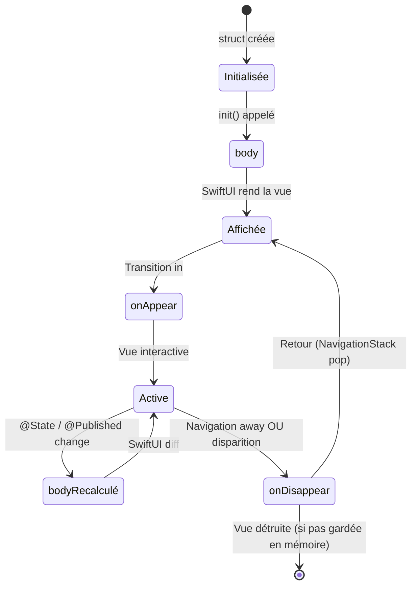

# Cycle de Vie de l'Application

<div
  class="omny-meta"
  data-level="🔴 Avancé"
  data-version="1.0"
  data-time="2-3 heures">
</div>

## Introduction

!!! quote "Analogie pédagogique — La Boutique et la Journée de Travail"
    Une boutique a un cycle de vie : ouverture (active), client mis en attente (background), télé-achat / fermeture (inactive). Le gérant s'adapte : il sécurise la caisse à la fermeture, prépare les vitrines à l'ouverture, met en pause les opérations longues pendant une interruption. SwiftUI expose ces phases via `ScenePhase` — vous y accrochez vos initialisations, nettoyages et mises en pause de manière déclarative, plutôt que via `applicationDidEnterBackground(_:)` d'UIKit.

Comprendre le cycle de vie évite les fuites mémoire, les opérations interrompues à mi-parcours et les problèmes de données non sauvegardées.

<br>

---

## `@main` et la Structure `App`

```swift title="Swift (SwiftUI) — Structure App : point d'entrée complet"
import SwiftUI
import SwiftData

// @main : une seule struct dans toute l'app peut avoir cette annotation
@main
struct OmnyDocsApp: App {

    // @StateObject dans App : créé une seule fois au lancement de l'app
    // Parfait pour les services globaux (analytics, sessions, notifications)
    @StateObject private var sessionUtilisateur = SessionUtilisateur()

    // Accès à la ScenePhase depuis l'App
    @Environment(\.scenePhase) private var scenePhase

    var body: some Scene {
        // WindowGroup : la scène principale
        // Sur iPhone : une seule fenêtre
        // Sur iPad/Mac : peut avoir plusieurs instances
        WindowGroup {
            // Vue racine — la première vue affichée
            RootView()
                .environmentObject(sessionUtilisateur)
        }
        // SwiftData : injecter le container pour toute l'app
        .modelContainer(for: [NotePersistante.self])
        // Réagir aux changements de scenePhase dans l'App
        .onChange(of: scenePhase) { _, nouvellePhase in
            switch nouvellePhase {
            case .active:
                // L'app est au premier plan et interactive
                print("App active — démarrer les tâches")
                sessionUtilisateur.démarrerSuivi()

            case .inactive:
                // L'app est visible mais non interactive (ex: notification center)
                print("App inactive — suspendre les opérations légères")

            case .background:
                // L'app est en arrière-plan
                print("App en background — sauvegarder, arrêter les tâches")
                sessionUtilisateur.sauvegarderÉtat()

            @unknown default:
                break
            }
        }
    }
}
```

<br>

---

## `ScenePhase` — Observer le Cycle de Vie

`ScenePhase` peut être observé depuis n'importe quelle vue — pas seulement depuis `App`.

```swift title="Swift (SwiftUI) — ScenePhase dans les vues"
import SwiftUI

struct VueSensibleAuCycleDeVie: View {

    @Environment(\.scenePhase) private var scenePhase
    @State private var chrono: Int = 0
    @State private var timer: Timer? = nil

    var body: some View {
        VStack(spacing: 20) {
            Text("Chrono : \(chrono) s")
                .font(.largeTitle)
                .monospacedDigit()

            Text(descriptionPhase)
                .font(.caption)
                .foregroundStyle(.secondary)
        }
        .padding()
        // Réagir aux changements de phase
        .onChange(of: scenePhase) { _, nouvellePhase in
            switch nouvellePhase {
            case .active:
                // App de nouveau visible — reprendre le chrono
                démarrerTimer()
            case .inactive, .background:
                // App cachée ou en background — mettre en pause
                arrêterTimer()
            @unknown default:
                break
            }
        }
        .onAppear {
            démarrerTimer()  // Démarrer au premier affichage
        }
        .onDisappear {
            arrêterTimer()   // Arrêter si la vue disparaît de la navigation
        }
    }

    private var descriptionPhase: String {
        switch scenePhase {
        case .active:     return "App active — chrono en marche"
        case .inactive:   return "App inactive — chrono en pause"
        case .background: return "App en background — chrono arrêté"
        @unknown default: return "Phase inconnue"
        }
    }

    private func démarrerTimer() {
        timer = Timer.scheduledTimer(withTimeInterval: 1, repeats: true) { _ in
            chrono += 1
        }
    }

    private func arrêterTimer() {
        timer?.invalidate()
        timer = nil
    }
}
```

*`ScenePhase` dans une vue représente l'état de la **fenêtre** qui contient cette vue — différent de l'état global de l'application. Sur iPhone, les deux sont confondus. Sur iPad avec multi-fenêtres, ils peuvent différer.*

<br>

---

## `onAppear` et `onDisappear`

```swift title="Swift (SwiftUI) — onAppear et onDisappear : cycle de vie de la vue"
import SwiftUI

struct VueCycleVie: View {

    @State private var données: [String] = []
    @State private var chargement = false

    var body: some View {
        List(données, id: \.self) { Text($0) }
        .navigationTitle("Données")
        // onAppear : appelé chaque fois que la vue devient visible
        // (premier affichage ET retour depuis une vue enfant)
        .onAppear {
            print("Vue visible")
            if données.isEmpty {
                charger()
            }
        }
        // onDisappear : appelé quand la vue n'est plus visible
        // (navigation vers une autre vue OU disparition définitive)
        .onDisappear {
            print("Vue cachée — nettoyage éventuel")
        }
    }

    func charger() {
        chargement = true
        // Simulation
        données = ["Swift", "SwiftUI", "Vapor"]
        chargement = false
    }
}

// Comparaison onAppear vs .task
struct ComparaisonOnAppearTask: View {
    @State private var résultat = ""

    var body: some View {
        Text(résultat)
            // onAppear : synchrone — ne peut pas appeler await directement
            .onAppear {
                // Wrapping dans Task pour lancer du code async
                Task {
                    résultat = await chargerDonnées()
                }
            }
            // .task : la bonne façon — async natif + annulation automatique
            .task {
                résultat = await chargerDonnées()  // await directement
            }
    }

    func chargerDonnées() async -> String {
        try? await Task.sleep(for: .seconds(1))
        return "Données chargées"
    }
}
```

!!! tip "Privilégier `.task { }` à `.onAppear { Task { } }`"
    `.task { }` est plus sûr qu'`onAppear` + `Task` car il annule automatiquement la tâche si la vue disparaît. Utilisez `onAppear` uniquement pour le code synchrone (configuration, analytics, logs).

<br>

---

## Cycle de Vie Complet d'une Vue



<br>

---

## Initialisation de Ressources dans `App`

```swift title="Swift (SwiftUI) — Initialiser les services globaux correctement"
import SwiftUI
import UserNotifications

@main
struct MonApp: App {

    // Initialisation des services dans init() de App
    init() {
        configurerApparence()
        demanderAutorisationsNotifications()
    }

    var body: some Scene {
        WindowGroup {
            ContentView()
        }
    }

    // Personnaliser l'apparence UIKit (navigation bar, etc.)
    private func configurerApparence() {
        let apparence = UINavigationBarAppearance()
        apparence.configureWithOpaqueBackground()
        apparence.backgroundColor = UIColor(Color.indigo)
        apparence.titleTextAttributes = [.foregroundColor: UIColor.white]
        UINavigationBar.appearance().standardAppearance = apparence
        UINavigationBar.appearance().scrollEdgeAppearance = apparence
    }

    // Demander les autorisations de notifications
    private func demanderAutorisationsNotifications() {
        UNUserNotificationCenter.current().requestAuthorization(
            options: [.alert, .badge, .sound]
        ) { accordé, erreur in
            if accordé {
                print("Notifications autorisées")
            }
        }
    }
}
```

<br>

---

## Exercices

!!! note "À vous de jouer"

**Exercice 1 — Timer résistant aux interruptions**

```swift title="Swift — Exercice 1 : chronomètre avec ScenePhase"
// Créez un chronomètre qui :
// - Démarre / Pause avec un bouton
// - SE MET EN PAUSE automatiquement quand l'app passe en background
// - REPREND automatiquement quand l'app revient au premier plan (si le chrono était actif)
// - Affiche le temps en MM:SS

struct Chronomètre: View {
    @Environment(\.scenePhase) private var phase
    @State private var secondes: Int = 0
    @State private var eActif: Bool = false
    @State private var timer: Timer? = nil

    var body: some View {
        // TODO : affichage + logique ScenePhase
        EmptyView()
    }
}
```

**Exercice 2 — Sauvegarde d'état à la fermeture**

```swift title="Swift — Exercice 2 : autosave avec ScenePhase"
// Créez un éditeur de texte simple qui :
// - Affiche un TextField (texte courant)
// - Sauvegarde automatiquement dans @AppStorage quand scenePhase passe à .background
// - Restaure le texte à l'ouverture depuis @AppStorage
// - Affiche "Sauvegardé" en bas avec l'heure de la dernière sauvegarde

struct ÉditeurAvecAutosave: View {
    @Environment(\.scenePhase) private var phase
    @AppStorage("texteÉditeur") private var textesSauvegardé = ""
    @State private var texteCourant = ""
    @State private var dernièreSauvegarde: Date? = nil

    var body: some View {
        // TODO
        EmptyView()
    }
}
```

<br>

---

## Conclusion

!!! quote "Ce qu'il faut retenir de ce module"
    `@main` + `struct MaApp: App` définit le point d'entrée SwiftUI — plus de `UIApplicationDelegate` pour la plupart des cas. `ScenePhase` expose trois états : `.active` (interactive), `.inactive` (visible mais bloquée), `.background` (cachée). Accrochez la logique de sauvegarde à `.background` et la logique de reprise à `.active`. `onAppear` est synchrone — pour le code async, préférez `.task { }`. `onDisappear` signale que la vue n'est plus visible — utile pour cleanup (timer, subscriber). L'`init()` de `App` est le bon endroit pour configurer les services globaux (apparence, notifications, analytics).

> Dans le module suivant, nous abordons l'**Accessibilité et l'Internationalisation** — VoiceOver, Dynamic Type, et la localisation pour rendre votre application inclusive et disponible en plusieurs langues.

<br>
