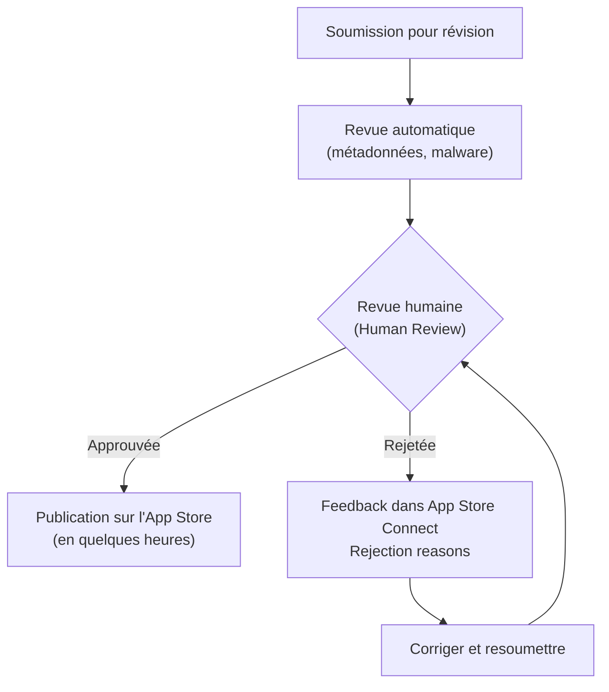

# Publication sur l'App Store

<div
  class="omny-meta"
  data-level="🔴 Avancé"
  data-version="1.0"
  data-time="3-4 heures">
</div>

## Introduction

!!! quote "Analogie pédagogique — La Certification du Produit Alimentaire"
    Un producteur artisanal ne peut pas vendre ses produits en supermarché sans certification. Il doit passer des contrôles qualité, déclarer les ingrédients (étiquette nutritionnelle), respecter les normes sanitaires, et obtenir les agréments nécessaires. L'App Store fonctionne de même : votre application passe par une revue de conformité (App Review), vous déclarez quelles données vous collectez (Privacy Nutrition Label), et vous obtenez les autorisations nécessaires (Signing & Capabilities). L'objectif commun : protéger l'utilisateur final.

Ce module couvre le processus complet de publication — de la configuration du projet à la soumission sur l'App Store.

<br>

---

## Prérequis — Compte Développeur Apple

```
Compte Apple Developer Program :
├── Coût : 99 $/an (individuel) ou 299 $/an (entreprise)
├── Inscription : https://developer.apple.com/programs/
└── Accès : App Store Connect, Certificates, Identifiers & Profiles

Configuration minimale dans Xcode :
├── Xcode → Preferences → Accounts → Ajouter Apple ID
├── Project → Signing & Capabilities → Team → Sélectionner votre équipe
└── Bundle Identifier : com.votreentreprise.monapp (unique sur l'App Store)
```

<br>

---

## Signing & Capabilities

Le **Signing** garantit que l'application exécutable provient bien de vous. Apple signe chaque app avec un certificat cryptographique.

```
Configuration dans Xcode :
Project → Target → Signing & Capabilities

1. Automatically manage signing : ✓ (recommandé — Xcode gère tout)
   OU
   Manual signing : vous gérez certificats et profils vous-même

2. Team : votre équipe Apple Developer
3. Bundle Identifier : com.votreentreprise.monapp
4. Provisioning Profile : créé automatiquement avec Automatically manage signing
```

<!-- ILLUSTRATION REQUISE : swiftui-signing-capabilities.png — Capture écran annotée de l'onglet Signing & Capabilities d'Xcode avec les zones importantes encadrées -->

### Capabilities — Fonctionnalités Spéciales

Les **Capabilities** activent les fonctionnalités système qui nécessitent des permissions Apple :

```swift title="Swift — Capabilities communes et leur usage"
// Capabilities activées dans Xcode :
// Project → Target → Signing & Capabilities → + Capability

// Push Notifications → UNUserNotificationCenter
// iCloud → NSUbiquitousKeyValueStore, CloudKit
// Sign In with Apple → ASAuthorizationAppleIDProvider
// HealthKit → HKHealthStore
// In-App Purchases → StoreKit
// Background Modes → URLSession background, silent notifications

// Chaque capability ajoute un entitlement au fichier .entitlements
// et peut nécessiter une déclaration dans Info.plist
```

<br>

---

## Info.plist — Déclarations de Permissions

Les permissions système nécessitent une déclaration textuelle dans `Info.plist` — affichée à l'utilisateur lors de la demande d'autorisation.

```xml title="XML (Info.plist) — Déclarations de permissions requises"
<?xml version="1.0" encoding="UTF-8"?>
<!DOCTYPE plist PUBLIC "-//Apple//DTD PLIST 1.0//EN"
  "http://www.apple.com/DTDs/PropertyList-1.0.dtd">
<plist version="1.0">
<dict>
    <!-- Caméra : obligatoire si vous utilisez AVCaptureSession -->
    <key>NSCameraUsageDescription</key>
    <string>OmnyDocs utilise la caméra pour numériser des documents.</string>

    <!-- Bibliothèque Photos : accès aux images de l'utilisateur -->
    <key>NSPhotoLibraryUsageDescription</key>
    <string>OmnyDocs accède à la bibliothèque pour importer des images.</string>

    <!-- Localisation en premier plan -->
    <key>NSLocationWhenInUseUsageDescription</key>
    <string>OmnyDocs utilise votre position pour les fonctionnalités de proximité.</string>

    <!-- Microphone -->
    <key>NSMicrophoneUsageDescription</key>
    <string>OmnyDocs utilise le microphone pour la transcription vocale.</string>

    <!-- Face ID -->
    <key>NSFaceIDUsageDescription</key>
    <string>OmnyDocs utilise Face ID pour sécuriser l'accès à vos données.</string>
</dict>
</plist>
```

*Le texte des permissions doit être spécifique et honnête — "OmnyDocs utilise X pour Y". Un texte vague ("utilisation interne") peut entraîner le rejet de l'app par l'App Review.*

<br>

---

## Archive et Upload

```
Processus de publication :

1. Configurer la version :
   Project → Target → General
   ├── Version : 1.0.0  (Marketing version — affichée sur l'App Store)
   └── Build : 1        (Numéro de build — doit être unique par soumission)

2. Sélectionner Any iOS Device (arm64) dans la barre d'outils d'Xcode
   (pas le Simulateur — les archives sont pour les appareils réels)

3. Archive :
   Product → Archive
   → Xcode compile et archive l'application (peut prendre 2-10 minutes)

4. Distribute (depuis Organizer) :
   Window → Organizer → Archives → Votre archive → Distribute App
   ├── App Store Connect → Distribute → Upload
   └── Xcode valide l'archive et l'envoie à App Store Connect

5. App Store Connect :
   https://appstoreconnect.apple.com
   ├── Mes apps → Votre app → App Store → Version informations
   ├── Remplir : nom, description, captures d'écran, mots-clés
   ├── Privacy Nutrition Label (obligatoire)
   └── Soumettre pour révision
```

<br>

---

## TestFlight — Bêta Test Avant Publication

TestFlight distribue votre app à des testeurs avant la publication officielle.

```
TestFlight — Deux types de testeurs :

Testeurs INTERNES (jusqu'à 100)
├── Membres de votre équipe App Store Connect
├── L'app est disponible immédiatement après upload (pas de revue)
└── Idéal pour les tests quotidiens de votre équipe

Testeurs EXTERNES (jusqu'à 10 000)
├── N'importe qui (via invitation email ou lien public)
├── Nécessite une revue TestFlight (24-48h, moins stricte que l'App Store)
└── La bêta expire automatiquement après 90 jours

Workflow TestFlight :
1. Uploader une archive dans App Store Connect
2. App Store Connect → TestFlight → Builds → Cliquer sur votre build
3. Ajouter les testeurs internes ou externes
4. Les testeurs reçoivent une invitation email et installent TestFlight
5. Ils accèdent à votre app et peuvent envoyer des feedbacks directement
```

<br>

---

## App Privacy Nutrition Label

Depuis iOS 14, Apple exige la déclaration complète des données collectées. C'est obligatoire — sans elle, votre app ne peut pas être approuvée.

```swift title="Swift — Types de données à déclarer dans la Nutrition Label"
// Dans App Store Connect : Votre App → App Privacy

// Catégories de données :
// ─── Données d'identification ──────────────
// - Nom, email, numéro de téléphone
// - Identifiant utilisateur (user ID)
// - Identifiant de l'appareil (Device ID)

// ─── Données de localisation ───────────────
// - Localisation précise (GPS)
// - Localisation approximative (région)

// ─── Données de navigation ─────────────────
// - Historique de navigation
// - Données de recherche
// - Pages vues

// ─── Données financières ───────────────────
// - Informations de paiement
// - Historique d'achats

// ─── Données de santé et de forme ──────────

// ─── Données liées à l'utilisateur ─────────
// - Contenu créé par l'utilisateur (notes, photos)

// Pour chaque catégorie collectée, vous déclarez :
// 1. Utilisation : analytics, fonctionnalités de l'app, publicité ciblée
// 2. Lié à l'identité : oui / non
// 3. Suivi inter-apps : oui / non
```

*Si votre app ne collecte aucune donnée personnelle, cochez "Aucune donnée collectée". Apple vérifie la cohérence entre vos déclarations et le comportement réel de l'app.*

<br>

---

## App Review — Critères et Rejets Courants



**Rejets les plus courants :**

| Motif | Prévention |
|---|---|
| Crash au launch | Tester sur appareil physique avant soumission |
| Interface incomplète | Aucun placeholder, aucun "TBD" en production |
| Fonctionnalité décrite manquante | Description = fonctionnalités réelles uniquement |
| Login obligatoire sans compte démo | Toujours fournir un compte démo dans les notes de review |
| Permissions non justifiées | Info.plist descriptions précises et honnêtes |
| Copie d'une autre app | Interface et valeur ajoutée originale |
| Accessibilité manquante | VoiceOver, Dynamic Type (module 16) |
| Privacy Label incorrecte | Déclaration cohérente avec le comportement réel |

```
Notes pour l'équipe de review (Review Notes) :
├── Compte démo si votre app nécessite une conexion
│   "Email : demo@test.com — Mot de passe : Demo1234!"
├── Instructions spéciales si besoin (matériel, configuration)
└── Explication pour les fonctionnalités sensibles
```

<br>

---

## Checklist Avant Soumission

```swift title="Swift — Checklist complète pré-soumission"
// ─── TECHNIQUE ──────────────────────────────────────────────
// ☐ Testé sur un appareil physique (pas seulement le Simulateur)
// ☐ Testé avec les iOS versions minimale et maximale cibles
// ☐ Aucun crash au lancement (sur appareil physique)
// ☐ Aucun warning Xcode critique non résolu
// ☐ Memory Graph : aucune fuite mémoire
// ☐ Mode sombre : interface cohérente
// ☐ Dynamic Type : interface lisible en Très Grand

// ─── ACCESSIBILITÉ ──────────────────────────────────────────
// ☐ VoiceOver : toutes les vues sont navigables
// ☐ Images avec accessibilityLabel
// ☐ Boutons avec role ou label explicite

// ─── CONTENU ────────────────────────────────────────────────
// ☐ Aucun placeholder ("Lorem ipsum", "TODO", "TBD")
// ☐ Aucun easter egg offensant
// ☐ Icône : 1024×1024 px, sans alpha, sans arrondi (Xcode arrondit)
// ☐ Captures d'écran : exactement les dimensions requises
//   - iPhone 6.7" (iPhone 15 Pro Max)
//   - iPhone 6.5" (iPhone 14 Plus)
//   - iPad 12.9" si app iPad

// ─── APP STORE CONNECT ──────────────────────────────────────
// ☐ Nom de l'app (30 caractères max)
// ☐ Sous-titre (30 caractères max)
// ☐ Description (4000 caractères max) — convaincante et honnête
// ☐ Mots-clés (100 caractères total)
// ☐ Support URL et Marketing URL renseignées
// ☐ Privacy Policy URL (obligatoire si collecte de données)
// ☐ Privacy Nutrition Label complète et honnête
// ☐ Notes pour l'équipe de review (compte démo si applicable)
// ☐ Rating du contenu (questionnaire 4+, 9+, 12+, 17+)
```

<br>

---

## Mises à Jour — Process de Mise à Jour

```
Publier une mise à jour :

1. Incrémenter le numéro de build dans Xcode
   (Version peut rester la même pour les correctifs, OU incrémenter pour les nouveautés)

2. Archive → Upload (même process)

3. App Store Connect → Votre App → + Version
   → Saisir le numéro de version
   → Renseigner "Nouveautés" (quoi de neuf dans cette version)
   → Soumettre pour révision

Conseils :
- Les mises à jour critiques (bugs crash) sont traitées en priorité
- Préparez les captures d'écran si l'interface a changé
- Les mises à jour majeures méritent de nouvelles captures d'écran
```

<br>

---

## Conclusion

!!! quote "Ce qu'il faut retenir de ce module"
    La publication sur l'App Store est un processus en plusieurs étapes : **Signing** (certificat + provisioning profile), **Capabilities** (permissions système), **Info.plist** (textes de permissions), **Archive** (Product → Archive), **TestFlight** (bêta test jusqu'à 10 000 utilisateurs), **Privacy Nutrition Label** (déclaration obligatoire des données), **App Review** (revue humaine) et **Publication**. Les rejets les plus courants sont évitables : testez sur appareil physique, fournissez un compte démo, soyez honnête dans les descriptions et les labels de confidentialité. TestFlight est votre meilleur outil de validation réelle avant soumission — utilisez-le systématiquement.

!!! quote "Félicitations — La Formation SwiftUI est Terminée"
    Vous avez parcouru 18 modules, des fondamentaux déclaratifs (`@State`, `@Binding`) aux patterns d'architecture (MVVM, SwiftData), en passant par l'async/await, les animations et la publication App Store. La prochaine étape : **Vapor** — le framework Swift côté serveur qui permettra à vos applications iOS de communiquer avec un backend robuste et sécurisé, écrit dans le même langage.

**Prochaine formation : [Vapor — Le Serveur Swift](../../vapor/index.md)**

<br>
