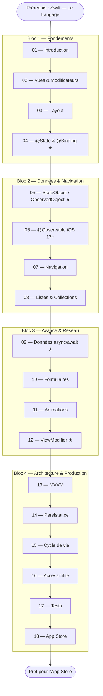

# SwiftUI — L'Interface Déclarative

!!! quote "Analogie"
    _Imaginez deux architectes face à un chantier. Le premier donne des ordres manuels : "pose cette brique ici, puis cette poutre là, puis peins ce mur en bleu". C'est UIKit — impératif, séquentiel, minutieux. Le second remet à l'équipe un plan qui dit "cette pièce doit ressembler à ça" — et l'équipe se charge de tout construire, modifier et mettre à jour s'il y a un changement. C'est SwiftUI. Vous décrivez le résultat attendu, pas les étapes pour y arriver._

## Objectif

SwiftUI est le framework Apple de création d'interfaces utilisateur lancé en 2019. Il remplace progressivement UIKit avec un paradigme déclaratif et réactif : l'interface est une fonction de l'état — quand l'état change, l'interface se met à jour automatiquement.

Ce parcours couvre SwiftUI depuis le premier `struct ContentView: View` jusqu'aux patterns d'architecture MVVM, la persistance SwiftData, et la publication sur l'App Store.

!!! note "Prérequis"
    Ce parcours suppose que vous avez complété **Swift — Le Langage** (18 modules). En particulier, les cinq pivots (modules 06, 09, 10, 12, 17) sont indispensables. `@State`, `@Binding`, `@Published` ne font sens que si vous comprenez les Property Wrappers et les Result Builders.

!!! warning "iOS 16 et iOS 17+"
    Ce cours utilise **iOS 16 comme version de référence**. Chaque fois qu'iOS 17 introduit un changement significatif (`@Observable`, SwiftData, `#Preview`), un encadré spécifique le signale et explique la migration. Ciblez iOS 16 pour la compatibilité maximale, iOS 17+ pour les patterns les plus modernes.

 

---

## Bloc 1 — Fondements de la Vue

- ### :simple-swift: 01. Introduction & Architecture
    ---
    Paradigme déclaratif vs impératif, `struct View`, `body`, `some View`, Xcode setup, Live Preview, `ContentView`, présentations du Simulateur et de l'outil de débogage SwiftUI.

    [Voir le module 01](./01-introduction.md)

- ### :lucide-layers: 02. Vues et Modificateurs
    ---
    `Text`, `Image`, `Button`, `Label`, `Divider` — chaîne de modificateurs `.font()`, `.padding()`, `.background()`, `.foregroundStyle()`. L'ordre des modificateurs est fondamental.

    [Voir le module 02](./02-vues-modificateurs.md)

- ### :lucide-layout: 03. Layout — Stack, Grid, GeometryReader
    ---
    `VStack`, `HStack`, `ZStack`, alignement, espacement, `Spacer`. `LazyVGrid`, `LazyHGrid`, `GridItem`. `GeometryReader` pour les dimensions dynamiques.

    [Voir le module 03](./03-layout.md)

- ### :lucide-toggle-right: 04. @State & @Binding
    ---
    **Pivot 1/4. Source of truth.** `@State` pour l'état local, `$` pour créer un `Binding`, `@Binding` dans les sous-vues, flux de données unidirectionnel. Les fondements de la réactivité SwiftUI.

    [Voir le module 04](./04-state-binding.md)

 

---

## Bloc 2 — Données & Navigation

- ### :lucide-database: 05. StateObject, ObservedObject, EnvironmentObject
    ---
    **Pivot 2/4.** `ObservableObject`, `@Published`, `@StateObject` (propriétaire), `@ObservedObject` (observer), `@EnvironmentObject` (injection). Quand utiliser lequel.

    [Voir le module 05](./05-stateobject-observedobject.md)

- ### :lucide-sparkles: 06. @Observable (iOS 17+)
    ---
    La macro `@Observable` remplace `ObservableObject` + `@Published`. `@Bindable`, observation granulaire propriété par propriété. Migration depuis iOS 16.

    [Voir le module 06](./06-observable.md)

- ### :lucide-navigation: 07. Navigation — NavigationStack & SplitView
    ---
    `NavigationStack`, `NavigationLink(value:)`, `.navigationDestination(for:)`, `NavigationPath`, deep linking. `NavigationSplitView` pour iPad et macOS.

    [Voir le module 07](./07-navigation.md)

- ### :lucide-list: 08. Listes & Collections
    ---
    `List`, `ForEach`, `Identifiable`, sections, swipe actions, `EditButton`, `LazyVGrid`, `LazyHGrid`. Données dynamiques et performance.

    [Voir le module 08](./08-listes-collections.md)

 

---

## Bloc 3 — Avancé & Réseau

- ### :lucide-cloud-download: 09. Données Asynchrones
    ---
    **Pivot 3/4.** `.task { }`, `async/await` dans SwiftUI, états de chargement, gestion d'erreurs. Pattern ViewModel asynchrone complet avec une API publique réelle.

    [Voir le module 09](./09-donnees-async.md)

- ### :lucide-form-input: 10. Formulaires & Validation
    ---
    `Form`, `Section`, `TextField`, `SecureField`, `Toggle`, `Picker`, `DatePicker`, `Stepper`. Validation en temps réel et feedback visuel.

    [Voir le module 10](./10-formulaires-validation.md)

- ### :lucide-sparkles: 11. Animations & Transitions
    ---
    `.animation()`, `withAnimation { }`, `Animation.spring()`, `.transition()`, `AnyTransition`, `matchedGeometryEffect`. Micro-animations et transitions de navigation.

    [Voir le module 11](./11-animations-transitions.md)

- ### :lucide-package: 12. ViewModifier & Extensions
    ---
    **Pivot 4/4.** `ViewModifier`, `@ViewBuilder`, `extension View`, création de composants réutilisables. Les patterns qui éliminent la duplication de code.

    [Voir le module 12](./12-viewmodifier-extensions.md)

 

---

## Bloc 4 — Architecture & Production

- ### :lucide-git-branch: 13. Architecture MVVM
    ---
    Pattern MVVM appliqué à SwiftUI, séparation View / ViewModel / Model, injection de dépendances, testabilité. Architecture scalable pour les applications réelles.

    [Voir le module 13](./13-mvvm.md)

- ### :lucide-hard-drive: 14. Persistance
    ---
    `@AppStorage`, `UserDefaults`, **SwiftData** (iOS 17+), `@Model`, `@Query`, `.modelContainer()`. Des préférences simples aux données relationnelles.

    [Voir le module 14](./14-persistence.md)

- ### :lucide-activity: 15. Cycle de Vie de l'App
    ---
    `@main`, `App`, `Scene`, `WindowGroup`, `onAppear`, `onDisappear`, `ScenePhase`, `AppDelegate` in SwiftUI. Initialisation et nettoyage des ressources.

    [Voir le module 15](./15-cycle-de-vie.md)

- ### :lucide-accessibility: 16. Accessibilité & Internationalisation
    ---
    `.accessibilityLabel()`, `.accessibilityHint()`, VoiceOver, Dynamic Type. `LocalizedStringKey`, `String(localized:)`, `.strings` files.

    [Voir le module 16](./16-accessibilite.md)

- ### :lucide-test-tube: 17. Tests
    ---
    `#Preview` (iOS 17) vs `PreviewProvider`, `@Previewable`, tests de ViewModels avec XCTest, bonnes pratiques de testabilité SwiftUI.

    [Voir le module 17](./17-tests.md)

- ### :lucide-upload-cloud: 18. Publication sur l'App Store
    ---
    Signing & Capabilities, Provisioning Profiles, Archive et Upload, TestFlight, Review Guidelines, App Privacy Nutrition Label.

    [Voir le module 18](./18-app-store.md)

 

---

## Progression recommandée

*Les modules marqués ★ sont les pivots absolus — ils conditionnent la compréhension de tout le reste.*

 

---

## Ce qui change avec SwiftUI

| Concept | UIKit (ancien) | SwiftUI (nouveau) |
| --- | --- | --- |
| Paradigme | Impératif — `viewDidLoad()`, `IBOutlet` | Déclaratif — `body: some View` |
| Mise à jour UI | `label.text = "..."` manuellement | Automatique quand `@State` change |
| Navigation | `UINavigationController.pushViewController()` | `NavigationStack` + `NavigationLink` |
| État partagé | Delegate, Notification | `@EnvironmentObject`, `@Observable` |
| Layout | `AutoLayout`, contraintes | `VStack`, `HStack`, `ZStack` |
| Lifecycle de vue | `viewWillAppear`, `viewDidDisappear` | `.onAppear { }`, `.onDisappear { }` |
| Tables et listes | `UITableView` + DataSource | `List` + `ForEach` |
| Collections | `UICollectionView` + Layout | `LazyVGrid`, `LazyHGrid` |
| Animations | `UIView.animate(...)` | `withAnimation { }` |
| Tests et Preview | Simulateur uniquement | `#Preview` en temps réel dans Xcode |

 

---

## Conclusion

!!! quote "Notre recommandation"
    SwiftUI est conçu pour être progressif : les quatre premiers modules suffisent pour créer une application fonctionnelle. Les pivots — @State (04), StateObject (05), async/await (09), et ViewModifier (12) — débloquent la quasi-totalité des patterns que vous rencontrerez dans une vraie application. Ne sautez pas le module 13 (MVVM) : c'est lui qui transforme un projet fonctionnel en code maintenable.

**Point d'entrée : [01. Introduction & Architecture](./01-introduction.md)**

 