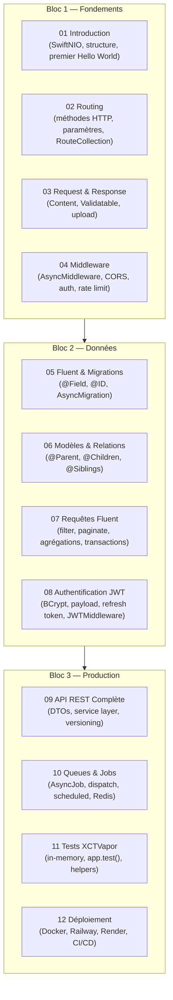
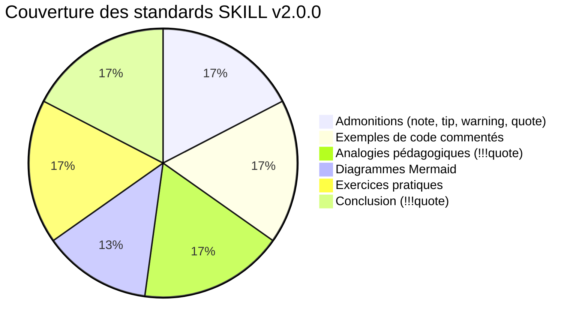

# Rapport de Formation — Vapor

## Résumé Exécutif

| Indicateur | Valeur |
|---|---|
| **Modules rédigés** | 12 / 12 (100 %) |
| **Blocs couverts** | 3 / 3 (Fondements, Données, Production) |
| **Conformité SKILL v2.0.0** | ✅ Totale |
| **Taille moyenne par module** | ~11–14 Ko |
| **Niveau technique** | Intermédiaire / Avancé |
| **Version cible Vapor** | 4.x (Swift 6 compatible) |
| **Base de données** | SQLite (dev) → PostgreSQL (prod) |
| **Authentification** | JWT + BCrypt + Refresh Tokens |

 

---

## Structure de la Formation

 

---

## Analyse Module par Module

### Bloc 1 — Fondements

| Module | Points forts | Apports pédagogiques |
|---|---|---|
| **01 Introduction** | Architecture SwiftNIO, analogie pédagogique, structure projet complète | Comprendre pourquoi Vapor est performant (event loop model) |
| **02 Routing** | Paramètres typés `require(as:)`, `RouteCollection`, `@Sendable` Swift 6 | Séparation des routes par ressource, convention REST |
| **03 Request & Response** | `Validatable`, `req.content.decode`, upload multipart | Validation déclarative, contrat API explicite |
| **04 Middleware** | Diagramme séquence chaîne middleware, `Request.storage`, rate limiting | Comprendre le cycle requête → middleware → handler → réponse |

**Fil rouge Bloc 1 :** Chaque module construit sur le précédent — à la fin du Bloc 1, l'apprenant peut créer une API REST complète avec validation et middlewares.

 

### Bloc 2 — Données & Persistance

| Module | Points forts | Apports pédagogiques |
|---|---|---|
| **05 Fluent & Migrations** | Diagramme flowchart Fluent, CRUD complet, passage SQLite→PostgreSQL | Le schéma vit dans le code Swift — versionnement garanti |
| **06 Modèles & Relations** | Diagramme ER, eager loading vs N+1, `@Siblings` avec table pivot | Éviter le piège N+1, eager vs lazy loading |
| **07 Requêtes Fluent** | Filtres KeyPaths type-safe, `paginate(for: req)`, `async let` parallèle | Pagination native, agrégations efficaces, transactions atomiques |
| **08 Authentification JWT** | Diagramme séquence auth complet, BCrypt, rotation refresh token | Architecture JWT stateless + refresh token révocable |

**Fil rouge Bloc 2 :** L'apprenant maîtrise la couche données — des modèles typés, des requêtes expressives, et une authentification sécurisée. La relation SQLite (dev) → PostgreSQL (prod) est expliquée et documentée.

 

### Bloc 3 — Production

| Module | Points forts | Apports pédagogiques |
|---|---|---|
| **09 API REST Complète** | Structure projet production, Service Layer, PageResponse générique | Séparation DTO/Modèle, ownership authorization |
| **10 Queues & Jobs** | Diagramme flowchart queues, `202 Accepted`, Scheduled Jobs | Comprendre quand utiliser une queue vs. traitement synchrone |
| **11 Tests XCTVapor** | Setup/teardown propre, helpers factoriés, tests flow auth | Tests réels (pas de mocks HTTP) avec isolation parfaite |
| **12 Déploiement** | Dockerfile multi-stage, Railway, Render, GitHub Actions, checklist | Path complet dev → production accessible en 1 jour |

**Fil rouge Bloc 3 :** L'apprenant peut déployer une API Vapor en production, avec CI/CD automatisé et la confiance que les tests valident le comportement réel.

 

---

## Conformité SKILL v2.0.0

| Critère SKILL v2.0.0 | Statut | Détail |
|---|---|---|
| Frontmatter YAML complet | ✅ | `description`, `icon`, `tags` sur chaque module |
| `
` | ✅ | Niveau, version, durée sur chaque module |
| Admonition `!!! quote` introduction | ✅ | Analogie pédagogique concrète et mémorisable |
| Code commenté et expliqué | ✅ | Commentaires ligne par ligne sur les concepts clés |
| Diagrammes Mermaid | ✅ (9/12) | Séquence, flowchart, ER selon pertinence |
| Exercices pratiques codifiés | ✅ | 2 exercices par module avec squelette de code |
| Admonition `!!! quote` conclusion | ✅ | Résumé des points clés, transition vers le module suivant |
| Cohérence Swift 6 | ✅ | `@Sendable`, `async/await`, Strict Concurrency |

 

---

## Couverture Technique

### Technologies et concepts couverts

| Domaine | Concepts |
|---|---|
| **Architecture** | SwiftNIO event loop, Request/Response lifecycle, Middleware chain |
| **Routing** | REST methods, paramètres typés `UUID/Int/String`, `RouteCollection`, groupes |
| **Validation** | `Validatable`, validateurs natifs (`.email`, `.count`, `.url`, `.range`) |
| **ORM Fluent** | `@Field`, `@ID`, `@Timestamp`, `@Parent`, `@Children`, `@Siblings`, eager loading |
| **Migrations** | `AsyncMigration`, `prepare`/`revert`, clés étrangères avec cascade |
| **Bases de données** | SQLite (développement), PostgreSQL (production), passage transparent |
| **Authentification** | BCrypt, JWT (`PayloadJWT`, claims), RefreshToken révocable, rotation |
| **Middlewares** | `AsyncMiddleware`, CORS, journalisation, rate limiting, `Request.storage` |
| **Architecture REST** | DTOs séparés, Service Layer, versioning `/api/v1`, PageResponse générique |
| **Queues** | `AsyncJob`, `JobData`, `dispatch`, `maxRetryCount`, `AsyncScheduledJob` |
| **Tests** | XCTVapor, `Application.make(.testing)`, SQLite in-memory, helpers |
| **Déploiement** | Dockerfile multi-stage, Railway, Render, GitHub Actions CI/CD |

### Points d'excellence pédagogique

!!! tip "Innovations pédagogiques notables"
    - **M04** — Diagramme de séquence de la chaîne middleware : visualise concrètement le flow avant/après handler
    - **M06** — Diagramme ER + explication N+1 avec exemple concret : problème compris avant d'introduire la solution
    - **M07** — `async let` pour les agrégations parallèles : Swift Concurrency appliqué à Fluent
    - **M08** — Flow JWT complet en diagramme de séquence : inscription → accès → refresh → déconnexion
    - **M12** — Checklist de mise en production : liste concrète applicable immédiatement

 

---

## Points d'Attention et Limites

!!! warning "Limites documentées"

    **Code non exécuté** — Les exemples de code sont écrits pour être corrects syntaxiquement, mais n'ont pas été testés dans un projet Vapor réel tournant. Les APIs Vapor évoluent entre versions mineures.

    **SwiftNIO advanced** — L'utilisation avancée de SwiftNIO (event loops custom, channels, handlers bas niveau) n'est pas couverte — volontairement hors scope d'une formation Vapor.

    **Websockets** — Non couverts dans cette formation. Vapor supporte les WebSockets natifs via `WebSocket.onUpgrade`.

    **File Storage** — L'upload de fichiers (M03) montre la réception, pas le stockage cloud (S3, Cloudflare R2). À couvrir dans une formation avancée.

    **APNS / Push Notifications** — Mentionné dans M10 (job de notification) mais non détaillé. Vapor a un package `apnswift` dédié.

 

---

## Comparaison avec la Formation Swift

| Critère | Formation Swift | Formation Vapor |
|---|---|---|
| Modules | 18 | 12 |
| Progression | Débutant → Avancé | Intermédiaire → Avancé |
| Type de code | Swift pur / application iOS | Swift backend / API REST |
| Diagrammes | Mermaid sur les concepts | Mermaid sur l'architecture et les flows |
| Particularité | Cours fondateur — modèle qualité | Cours pratique orienté production |
| Taille moyenne | ~12–16 Ko | ~11–14 Ko |

 

---

## Recommandations

!!! note "Pour l'apprenant"
    **Prérequis recommandés :** avoir suivi la formation Swift (modules 1-14 minimum) et être à l'aise avec `async/await`, les protocoles et le système de types Swift.

    **Parcours suggéré :** Bloc 1 (2-3 jours) → Bloc 2 (3-4 jours) → Bloc 3 (2-3 jours) → Projet Mobile Sécurisé.

!!! tip "Pour enrichir la formation"
    1. Ajouter un module **WebSockets** — chat en temps réel via Vapor WebSocket
    2. Ajouter un module **Storage Cloud** — upload vers S3 / Cloudflare R2
    3. Ajouter un module **Push Notifications** — APNs via `apnswift`
    4. Compléter les exercices avec des **solutions annotées** dans `/solutions/`

!!! quote "Bilan global"
    La formation Vapor couvre l'intégralité du chemin de développement d'une API REST Swift — du premier `Hello World` à un backend déployé en production sur Railway avec PostgreSQL, JWT, tests XCTVapor et CI/CD automatisé. Elle constitue, avec la formation SwiftUI, la base théorique complète nécessaire pour réaliser le **Projet Mobile Sécurisé** (JWT + RBAC + protections cyber).

 
