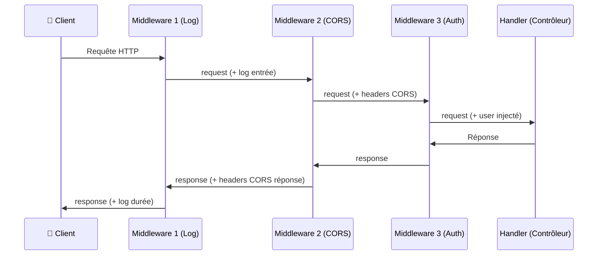

# Middleware

<div
  class="omny-meta"
  data-level="🟡 Intermédiaire"
  data-version="1.0"
  data-time="2-3 heures">
</div>

## Introduction

!!! quote "Analogie pédagogique — Le Portique de Sécurité de l'Aéroport"
    Avant d'embarquer, chaque passager passe par plusieurs points de contrôle : le guichet d'enregistrement, le contrôle des bagages, le contrôle des passeports, le scanner de sécurité. Si l'un de ces contrôles échoue, le passager est arrêté — jamais il n'atteint la porte d'embarquement (le handler). Et au retour, les bagages passent la douane. Un middleware Vapor est exactement ce point de contrôle : il s'exécute avant et après le handler, peut modifier la requête, modifier la réponse, ou stopper la chaîne complètement.

Les middlewares sont la solution élégante pour tout ce qui doit s'appliquer à **plusieurs routes simultanément** : journalisation, CORS, authentification, rate limiting, compression.

<br>

---

## Architecture d'un Middleware



*Les middlewares forment une **chaîne**. L'ordre d'ajout détermine l'ordre d'exécution. Chaque middleware appelle `next.respond(to: request)` pour passer la requête au suivant — ou renvoie une réponse directement pour court-circuiter la chaîne (ex: un middleware d'auth qui retourne 401).*

<br>

---

## Créer un Middleware Personnalisé

```swift title="Swift (Vapor) — AsyncMiddleware : middleware de journalisation"
import Vapor

// ─── Middleware de journalisation ────────────────────────────────────────────
// Enregistre chaque requête avec sa méthode, son chemin et le temps de traitement

final class JournalisationMiddleware: AsyncMiddleware {

    // respond : méthode principale du middleware
    // to request : la requête entrante
    // chainingTo next : le prochain maillon de la chaîne (middleware ou handler)
    func respond(to request: Request, chainingTo next: AsyncResponder) async throws -> Response {

        // ── Phase "before" : avant le handler ──────────────────────
        let début = Date()
        let méthode = request.method
        let chemin = request.url.path

        // Logger la requête entrante
        request.logger.info("→ \(méthode) \(chemin)")

        // ── Passer au maillon suivant ───────────────────────────────
        // try await next.respond(to: request) : appelle le handler (ou le middleware suivant)
        // La réponse sera disponible ici dès que le handler a terminé
        let réponse = try await next.respond(to: request)

        // ── Phase "after" : après le handler ───────────────────────
        let durée = Date().timeIntervalSince(début)
        let statusCode = réponse.status.code

        // Logger la réponse
        request.logger.info("← \(statusCode) \(chemin) — \(String(format: "%.0f", durée * 1000))ms")

        return réponse
    }
}
```

*Le pattern `let response = try await next.respond(to: request)` est la clé : tout ce qui précède s'exécute **avant** le handler, tout ce qui suit s'exécute **après**. Si vous ne passez pas `next.respond(to:)`, la chaîne est stoppée et votre réponse est retournée directement.*

<br>

---

## Enregistrer les Middlewares dans `configure.swift`

```swift title="Swift (Vapor) — configure.swift : enregistrement des middlewares"
import Vapor

public func configure(_ app: Application) async throws {

    // ─── Middlewares GLOBAUX ────────────────────────────────────────
    // S'appliquent à TOUTES les routes — ordre important !

    // 1. Journalisation : en premier pour capturer tout
    app.middleware.use(JournalisationMiddleware())

    // 2. CORS : doit être avant ErrorMiddleware pour les pré-vols OPTIONS
    app.middleware.use(CORSMiddleware(configuration: .init(
        allowedOrigin:  .all,                         // En dev : tout autoriser
        allowedMethods: [.GET, .POST, .PUT, .PATCH, .DELETE, .OPTIONS],
        allowedHeaders: [.accept, .authorization, .contentType, .origin,
                         HTTPHeaders.Name("X-Requested-With")]
    )))

    // 3. Gestion des erreurs : transforme les erreurs en JSON
    app.middleware.use(ErrorMiddleware.default(environment: app.environment))

    // 4. Fichiers statiques (pour servir des fichiers depuis /Public)
    app.middleware.use(FileMiddleware(publicDirectory: app.directory.publicDirectory))

    // Note : les middlewares de session, cache, etc. s'ajoutent ici

    // ─── Routes ─────────────────────────────────────────────────────
    try routes(app)
}
```

<br>

---

## Middleware d'Authentification — Pattern Complet

```swift title="Swift (Vapor) — Middleware d'authentification Bearer token"
import Vapor

// ─── Extension de Request : stockage de l'utilisateur courant ────────────────
// Request.Storage : stockage clé-valeur lié à la request (pas au thread)
extension Request {
    private struct UtilisateurCourantKey: StorageKey {
        typealias Value = UtilisateurAuthentifié
    }

    var utilisateurCourant: UtilisateurAuthentifié? {
        get { storage[UtilisateurCourantKey.self] }
        set { storage[UtilisateurCourantKey.self] = newValue }
    }
}

// Modèle de l'utilisateur authentifié (transmis aux handlers)
struct UtilisateurAuthentifié {
    let id: UUID
    let email: String
    let rôle: String
}

// ─── Middleware d'auth : vérifie le token Bearer ──────────────────────────────
final class AuthMiddleware: AsyncMiddleware {

    func respond(to request: Request, chainingTo next: AsyncResponder) async throws -> Response {

        // Extraire le Bearer token depuis les headers
        guard let bearerToken = request.headers.bearerAuthorization?.token else {
            // Pas de token → 401 Unauthorized
            throw Abort(.unauthorized, reason: "Token d'authentification requis")
        }

        // Vérifier le token (voir Module 08 pour JWT complet)
        guard let utilisateur = await vérifierToken(bearerToken, req: request) else {
            throw Abort(.unauthorized, reason: "Token invalide ou expiré")
        }

        // Injecter l'utilisateur dans la request → disponible dans le handler
        request.utilisateurCourant = utilisateur

        // Passer au handler
        return try await next.respond(to: request)
    }

    // Simulation — remplacé par vraie validation JWT en M08
    private func vérifierToken(_ token: String, req: Request) async -> UtilisateurAuthentifié? {
        guard token == "token-valide-test" else { return nil }
        return UtilisateurAuthentifié(id: UUID(), email: "alice@test.com", rôle: "admin")
    }
}

// ─── Middleware de rôle : vérifie que l'utilisateur a un rôle requis ──────────
final class RequiertRôleMiddleware: AsyncMiddleware {
    let rôleRequis: String

    init(rôle: String) { self.rôleRequis = rôle }

    func respond(to request: Request, chainingTo next: AsyncResponder) async throws -> Response {
        guard let utilisateur = request.utilisateurCourant else {
            throw Abort(.unauthorized, reason: "Non authentifié")
        }

        guard utilisateur.rôle == rôleRequis || utilisateur.rôle == "admin" else {
            // 403 Forbidden : authentifié mais pas autorisé
            throw Abort(.forbidden, reason: "Rôle '\(rôleRequis)' requis")
        }

        return try await next.respond(to: request)
    }
}
```

<br>

---

## Appliquer des Middlewares par Groupe de Routes

```swift title="Swift (Vapor) — Middlewares par groupe : auth + rôles"
import Vapor

func routes(_ app: Application) throws {

    // ─── Routes publiques (sans middleware) ────────────────────────
    app.get("statut") { req async -> String in "API opérationnelle" }
    app.post("connexion") { req async throws -> String in "Token JWT" }
    app.post("inscription") { req async throws -> String in "Compte créé" }

    // ─── Routes authentifiées ──────────────────────────────────────
    // grouped(middleware) : ajoute le middleware UNIQUEMENT à ce groupe
    let authentifié = app.grouped(AuthMiddleware())

    authentifié.get("profil") { req async throws -> String in
        // L'utilisateur est maintenant disponible via req.utilisateurCourant
        let user = req.utilisateurCourant!
        return "Profil de \(user.email)"
    }

    authentifié.put("profil") { req async throws -> String in
        "Profil mis à jour"
    }

    // ─── Routes admin (auth + rôle admin) ──────────────────────────
    let admin = authentifié.grouped(RequiertRôleMiddleware(rôle: "admin"))

    admin.get("admin", "utilisateurs") { req async -> String in
        "Liste de tous les utilisateurs (admin uniquement)"
    }

    admin.delete("admin", "utilisateurs", ":id") { req async -> HTTPStatus in
        .noContent
    }

    // ─── Routes premium (auth + rôle premium) ──────────────────────
    let premium = authentifié.grouped(RequiertRôleMiddleware(rôle: "premium"))
    premium.get("contenu-exclusif") { req async -> String in "Contenu premium" }

    // Enregistrer les contrôleurs
    try app.register(collection: ArticleController())
}
```

<br>

---

## Rate Limiting — Middleware de Limitation de Débit

```swift title="Swift (Vapor) — Rate limiting : protéger l'API contre les abus"
import Vapor

// Rate limiter simple basé sur IP — en production, utiliser Redis (voir M10)
final class RateLimitMiddleware: AsyncMiddleware {

    // Stockage en mémoire : IP → (compteur, fenêtre de temps)
    // En production : remplacer par Redis pour un fonctionnement multi-instances
    private var compteurs: [String: (count: Int, reset: Date)] = [:]
    private let limite: Int      // Nombre de requêtes maximum
    private let fenêtre: TimeInterval   // Durée de la fenêtre (secondes)

    init(limite: Int = 60, fenêtreSecondes: TimeInterval = 60) {
        self.limite = limite
        self.fenêtre = fenêtreSecondes
    }

    func respond(to request: Request, chainingTo next: AsyncResponder) async throws -> Response {

        // Identifier le client par son IP
        let ip = request.remoteAddress?.description ?? "inconnu"
        let maintenant = Date()

        // Récupérer ou initialiser le compteur
        var entrée = compteurs[ip] ?? (count: 0, reset: maintenant.addingTimeInterval(fenêtre))

        // Réinitialiser si la fenêtre est expirée
        if maintenant > entrée.reset {
            entrée = (count: 0, reset: maintenant.addingTimeInterval(fenêtre))
        }

        // Vérifier la limite
        guard entrée.count < limite else {
            // 429 Too Many Requests
            var réponse = Response(status: .tooManyRequests)
            réponse.headers.add(name: "X-RateLimit-Limit",     value: "\(limite)")
            réponse.headers.add(name: "X-RateLimit-Remaining", value: "0")
            réponse.headers.add(name: "X-RateLimit-Reset",     value: "\(Int(entrée.reset.timeIntervalSince1970))")
            réponse.headers.add(name: "Retry-After",           value: "\(Int(entrée.reset.timeIntervalSinceNow))")
            return réponse
        }

        // Incrémenter le compteur
        entrée.count += 1
        compteurs[ip] = entrée

        // Passer au handler et ajouter les headers de limite dans la réponse
        var réponse = try await next.respond(to: request)
        réponse.headers.add(name: "X-RateLimit-Limit",     value: "\(limite)")
        réponse.headers.add(name: "X-RateLimit-Remaining", value: "\(limite - entrée.count)")
        return réponse
    }
}

// Utilisation dans configure.swift ou sur un groupe de routes
// app.middleware.use(RateLimitMiddleware(limite: 100, fenêtreSecondes: 60))
```

*En production multi-instances, le stockage en mémoire (`[String: ...]`) ne fonctionne pas — chaque instance a son propre compteur. La solution est Redis (voir Module 10) ou une base de données partagée.*

<br>

---

## Gestion des Erreurs Globale

```swift title="Swift (Vapor) — ErrorMiddleware et erreurs personnalisées"
import Vapor

// Erreurs métier personnalisées — conformes à AbortError pour Vapor
enum ErreurAPI: AbortError {
    case ressourceNonTrouvée(String)
    case accèsRefusé
    case donnéesInvalides(String)
    case serviceIndisponible

    // status : le code HTTP retourné
    var status: HTTPResponseStatus {
        switch self {
        case .ressourceNonTrouvée: return .notFound
        case .accèsRefusé:         return .forbidden
        case .donnéesInvalides:    return .badRequest
        case .serviceIndisponible: return .serviceUnavailable
        }
    }

    // reason : le message d'erreur dans le JSON
    var reason: String {
        switch self {
        case .ressourceNonTrouvée(let nom): return "\(nom) introuvable"
        case .accèsRefusé:                  return "Accès non autorisé"
        case .donnéesInvalides(let msg):    return "Données invalides : \(msg)"
        case .serviceIndisponible:          return "Service temporairement indisponible"
        }
    }
}

// Usage dans les handlers
app.get("articles", ":id") { req async throws -> String in
    throw ErreurAPI.ressourceNonTrouvée("Article")
    // → HTTP 404 : {"error": true, "reason": "Article introuvable"}
}
```

<br>

---

## Exercices

!!! note "À vous de jouer"

**Exercice 1 — Middleware de journalisation enrichie**

```swift title="Swift (Vapor) — Exercice 1 : middleware de journalisation"
// Créez un JournalMiddlewareAvancé qui journalise :
// - Méthode + chemin + IP au début
// - Code de statut + durée (ms) à la fin
// - Si statut >= 400 : logguer au niveau .warning
// - Si statut >= 500 : logguer au niveau .error avec les headers de la requête
// Enregistrez-le comme middleware GLOBAL dans configure.swift

final class JournalMiddlewareAvancé: AsyncMiddleware {
    func respond(to request: Request, chainingTo next: AsyncResponder) async throws -> Response {
        // TODO
        return try await next.respond(to: request)
    }
}
```

**Exercice 2 — Middleware de version d'API**

```swift title="Swift (Vapor) — Exercice 2 : middleware de vérification de version"
// Créez un VersionAPIMiddleware qui :
// - Lit le header "X-API-Version" (ex: "2")
// - Si absent ou < 1 → 400 Bad Request
// - Si version > MAX_VERSION → 400 avec message "Utilisez /api/vN"
// - Injecte la version dans req.storage pour utilisation dans les handlers
// - Appliqué uniquement sur le groupe /api

struct VersionAPIKey: StorageKey { typealias Value = Int }

extension Request {
    var versionAPI: Int? {
        get { storage[VersionAPIKey.self] }
        set { storage[VersionAPIKey.self] = newValue }
    }
}

final class VersionAPIMiddleware: AsyncMiddleware {
    let maxVersion: Int
    init(max: Int = 2) { self.maxVersion = max }

    func respond(to request: Request, chainingTo next: AsyncResponder) async throws -> Response {
        // TODO
        return try await next.respond(to: request)
    }
}
```

<br>

---

## Conclusion

!!! quote "Ce qu'il faut retenir de ce module"
    Un middleware est un **intercept** qui s'exécute avant et après le handler — la clé est `try await next.respond(to: request)`. Tout le code avant cet appel est fase pre-handler, tout le code après est post-handler. Les middlewares **globaux** (dans `configure.swift`) s'appliquent à toutes les routes — l'ordre d'ajout est l'ordre d'exécution. Les middlewares **par groupe** (`routes.grouped(MonMiddleware())`) s'appliquent uniquement aux routes du groupe. `Request.storage` est le mécanisme pour transmettre des données d'un middleware à un handler (utilisateur courant, version API, etc.). En production : toujours un middleware CORS, un middleware d'erreur, un rate limiter Redis.

> Dans le module suivant, nous attaquons **Fluent & Migrations** — l'ORM de Vapor qui permet de définir le schéma de base de données en Swift et de le versionner avec des migrations.

<br>
