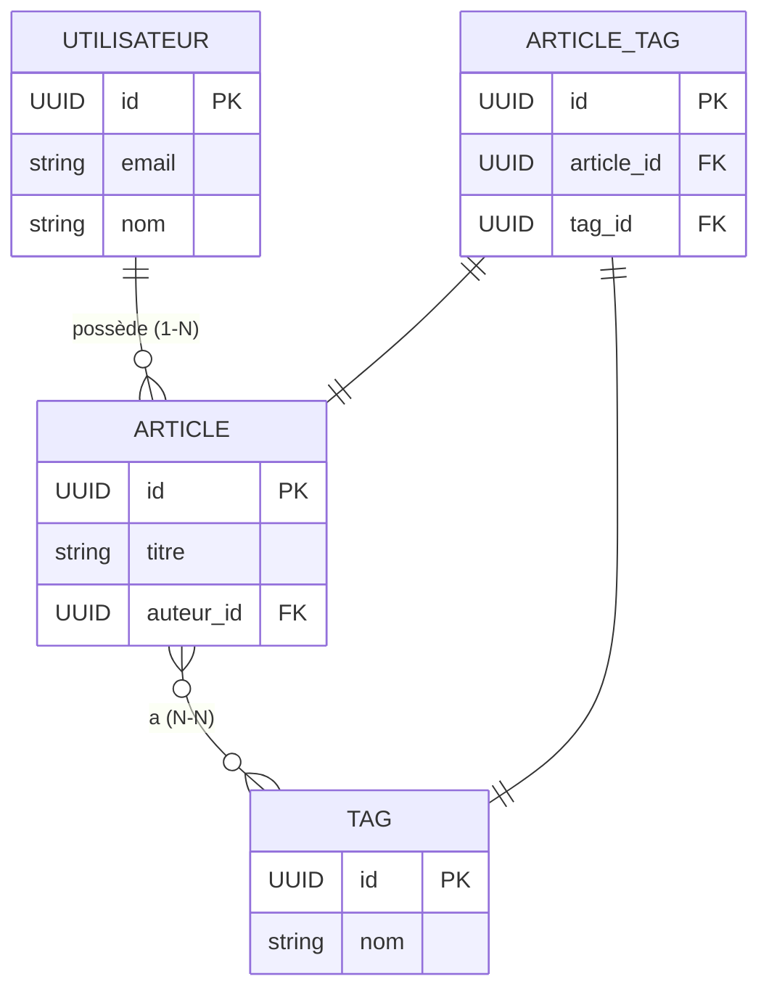

# Modèles & Relations

<div
  class="omny-meta"
  data-level="🔴 Avancé"
  data-version="1.0"
  data-time="3-4 heures">
</div>

## Introduction

!!! quote "Analogie pédagogique — L'Organigramme de l'École"
    Une école a des étudiants (`@Children` : un-à-plusieurs → une classe peut avoir plusieurs étudiants). Un étudiant appartient à une classe (`@Parent` : plusieurs-à-un). Des étudiants peuvent s'inscrire à plusieurs ateliers, et chaque atelier peut accueillir plusieurs étudiants (`@Siblings` : plusieurs-à-plusieurs via une table d'association). Quand on consulte un étudiant, on peut ou non "charger" sa classe — c'est le **eager loading** : ne charger que ce dont on a besoin, au moment où on en a besoin.

Les relations sont au cœur de toute base de données relationnelle. Fluent les exprime en Swift avec des property wrappers — `@Parent`, `@Children` et `@Siblings`.

<br>

---

## Les Trois Types de Relations



<br>

---

## `@Parent` & `@Children` — Relation Un-à-Plusieurs

```swift title="Swift (Vapor) — @Parent : l'article appartient à un utilisateur"
import Fluent
import Vapor

// ─── Modèle Utilisateur ───────────────────────────────────────────────────────
final class Utilisateur: Model, Content, @unchecked Sendable {
    static let schema = "utilisateurs"

    @ID(key: .id)
    var id: UUID?

    @Field(key: "email")
    var email: String

    @Field(key: "nom")
    var nom: String

    @Field(key: "mot_de_passe_hash")
    var motDePasseHash: String

    // @Children : "un utilisateur peut avoir PLUSIEURS articles"
    // for: \.$auteur → clé étrangère côté Article qui pointe vers Utilisateur
    @Children(for: \.$auteur)
    var articles: [Article]

    init() { }
    init(id: UUID? = nil, email: String, nom: String, motDePasseHash: String) {
        self.id = id; self.email = email; self.nom = nom
        self.motDePasseHash = motDePasseHash
    }
}

// ─── Modèle Article ───────────────────────────────────────────────────────────
final class Article: Model, Content, @unchecked Sendable {
    static let schema = "articles"

    @ID(key: .id)          var id: UUID?
    @Field(key: "titre")   var titre: String
    @Field(key: "contenu") var contenu: String

    // @Parent : "un article APPARTIENT à un utilisateur"
    // key: "auteur_id" → nom de la colonne de clé étrangère dans la table articles
    @Parent(key: "auteur_id")
    var auteur: Utilisateur

    @Timestamp(key: "créé_à",   on: .create) var créeA: Date?
    @Timestamp(key: "modifié_à", on: .update) var modifiéA: Date?

    init() { }
    init(id: UUID? = nil, titre: String, contenu: String, auteurId: UUID) {
        self.id = id
        self.titre = titre
        self.contenu = contenu
        self.$auteur.id = auteurId  // $auteur : l'objet ParentProperty (accès à l'ID)
    }
}
```

<br>

### Migrations avec Clé Étrangère

```swift title="Swift (Vapor) — Migration avec contrainte de clé étrangère"
import Fluent

struct CreateUtilisateur: AsyncMigration {
    func prepare(on database: any Database) async throws {
        try await database.schema("utilisateurs")
            .id()
            .field("email",              .string, .required)
            .field("nom",                .string, .required)
            .field("mot_de_passe_hash",  .string, .required)
            .unique(on: "email")         // Index d'unicité sur l'email
            .create()
    }
    func revert(on database: any Database) async throws {
        try await database.schema("utilisateurs").delete()
    }
}

// CreateArticle APRÈS CreateUtilisateur dans configure.swift
struct CreateArticleAvecAuteur: AsyncMigration {
    func prepare(on database: any Database) async throws {
        try await database.schema("articles")
            .id()
            .field("titre",      .string, .required)
            .field("contenu",    .string, .required)
            .field("créé_à",     .datetime)
            .field("modifié_à",  .datetime)
            // Clé étrangère : auteur_id référence id dans utilisateurs
            // .cascade : si l'utilisateur est supprimé, ses articles aussi
            .field("auteur_id", .uuid, .required,
                   .references("utilisateurs", "id", onDelete: .cascade))
            .create()
    }
    func revert(on database: any Database) async throws {
        try await database.schema("articles").delete()
    }
}
```

*`.references("utilisateurs", "id", onDelete: .cascade)` ajoute une contrainte de clé étrangère SQL — la base de données garantit l'intégrité référentielle. `.cascade` supprime automatiquement les articles quand leur auteur est supprimé.*

<br>

---

## Eager Loading — Charger les Relations

Sans eager loading, les relations ne sont pas automatiquement chargées — c'est un choix délibéré de Fluent pour éviter les requêtes N+1.

```swift title="Swift (Vapor) — Eager loading : charger les relations explicitement"
import Vapor
import Fluent

// ─── Sans eager loading : accéder à article.auteur lève une erreur ────────────
app.get("articles", "mauvais") { req async throws -> [Article] in
    let articles = try await Article.query(on: req.db).all()
    // article.auteur → EagerLoadError : relation non chargée !
    return articles
}

// ─── Avec eager loading : .with(\.$auteur) ────────────────────────────────────
app.get("articles") { req async throws -> [ArticleAvecAuteur] in
    // .with(\.$auteur) : JOIN SQL sur la table utilisateurs + peuplement automatique
    let articles = try await Article.query(on: req.db)
        .with(\.$auteur)      // Charge la relation @Parent auteur
        .all()

    // Maintenant article.auteur est accessible
    return articles.map { article in
        ArticleAvecAuteur(
            id:          article.id,
            titre:       article.titre,
            contenu:     article.contenu,
            auteurNom:   article.auteur.nom,
            auteurEmail: article.auteur.email
        )
    }
}

// ─── Charger les Children : articles d'un utilisateur ─────────────────────────
app.get("utilisateurs", ":id", "articles") { req async throws -> [Article] in
    guard let utilisateur = try await Utilisateur.find(
        req.parameters.require("id", as: UUID.self),
        on: req.db
    ) else {
        throw Abort(.notFound)
    }

    // .$articles : accès au wrapper @Children
    // .load(on: req.db) : charge les articles en mémoire
    try await utilisateur.$articles.load(on: req.db)
    return utilisateur.articles
}

// ─── DTO de réponse (sépare le modèle DB de la réponse API) ──────────────────
struct ArticleAvecAuteur: Content {
    let id: UUID?
    let titre: String
    let contenu: String
    let auteurNom: String
    let auteurEmail: String
}
```

*`.with(\.$auteur)` génère un `JOIN` SQL — plus efficace qu'un chargement séparé par article (qui créerait le fameux problème N+1 : 1 requête pour les articles + N requêtes pour chaque auteur).*

<br>

---

## `@Siblings` — Relation Plusieurs-à-Plusieurs

Une relation `@Siblings` nécessite une **table pivot** — une table intermédiaire qui contient uniquement les deux clés étrangères.

```swift title="Swift (Vapor) — @Siblings : articles et tags (N-N)"
import Fluent
import Vapor

// ─── Modèle Tag ───────────────────────────────────────────────────────────────
final class Tag: Model, Content, @unchecked Sendable {
    static let schema = "tags"

    @ID(key: .id)       var id: UUID?
    @Field(key: "nom")  var nom: String

    // @Siblings : un tag peut être associé à PLUSIEURS articles
    // through: ArticleTag.self → la table pivot
    // from: \.$tag → clé étrangère de ArticleTag vers Tag
    // to: \.$article → clé étrangère de ArticleTag vers Article
    @Siblings(through: ArticleTag.self, from: \.$tag, to: \.$article)
    var articles: [Article]

    init() { }
    init(id: UUID? = nil, nom: String) { self.id = id; self.nom = nom }
}

// ─── Table Pivot : ArticleTag ─────────────────────────────────────────────────
final class ArticleTag: Model, @unchecked Sendable {
    static let schema = "article_tag"  // Table pivot — pas de Content (pas de réponse API)

    @ID(key: .id) var id: UUID?

    // @Parent vers chaque côté de la relation
    @Parent(key: "article_id") var article: Article
    @Parent(key: "tag_id")     var tag: Tag

    init() { }
    init(articleId: UUID, tagId: UUID) {
        self.$article.id = articleId
        self.$tag.id     = tagId
    }
}

// ─── Migration de la table pivot ─────────────────────────────────────────────
struct CreateArticleTag: AsyncMigration {
    func prepare(on database: any Database) async throws {
        try await database.schema("article_tag")
            .id()
            .field("article_id", .uuid, .required, .references("articles", "id", onDelete: .cascade))
            .field("tag_id",     .uuid, .required, .references("tags",     "id", onDelete: .cascade))
            .unique(on: "article_id", "tag_id")  // Évite les doublons
            .create()
    }
    func revert(on database: any Database) async throws {
        try await database.schema("article_tag").delete()
    }
}

// ─── Utilisation des @Siblings ───────────────────────────────────────────────

// Ajouter un tag à un article
app.post("articles", ":articleId", "tags", ":tagId") { req async throws -> HTTPStatus in
    guard let article = try await Article.find(req.parameters.require("articleId", as: UUID.self), on: req.db),
          let tag     = try await Tag.find(    req.parameters.require("tagId",     as: UUID.self), on: req.db) else {
        throw Abort(.notFound)
    }

    // .attach : insère une ligne dans la table pivot article_tag
    try await article.$tags.attach(tag, on: req.db)
    return .ok
}

// Charger un article avec ses tags
app.get("articles", ":id") { req async throws -> ArticleAvecTags in
    guard let article = try await Article.query(on: req.db)
        .with(\.$tags)         // Charge la relation @Siblings tags
        .filter(\.$id == req.parameters.require("id", as: UUID.self))
        .first() else {
        throw Abort(.notFound)
    }

    return ArticleAvecTags(
        id:    article.id,
        titre: article.titre,
        tags:  article.tags.map { $0.nom }
    )
}

struct ArticleAvecTags: Content {
    let id: UUID?
    let titre: String
    let tags: [String]
}
```

<br>

---

## Exercices

!!! note "À vous de jouer"

**Exercice 1 — Relation Commentaires**

```swift title="Swift (Vapor) — Exercice 1 : Commentaire appartient à Article et Utilisateur"
// Créez un modèle Commentaire avec :
// - id: UUID
// - contenu: String
// - @Parent vers Article (clé étrangère article_id, cascade)
// - @Parent vers Utilisateur (clé étrangère auteur_id, cascade)
// - créeA: Date
//
// Migration CreateCommentaire avec les deux clés étrangères
// Route GET /articles/:id/commentaires → retourne les commentaires chargés
// avec le nom de l'auteur (eager loading des deux @Parent)

final class Commentaire: Model, Content, @unchecked Sendable {
    static let schema = "commentaires"
    // TODO
    init() { }
}
```

**Exercice 2 — API Articles avec relations**

```swift title="Swift (Vapor) — Exercice 2 : ArticleController avec relations"
// Complétez ArticleController avec :
// GET /articles          → liste avec auteurNom (eager load @Parent)
// GET /articles/:id      → un article avec auteur + tags (avec \.$auteur, \.$tags)
// POST /articles         → crée un article (dto contient auteurId: UUID)
// POST /articles/:id/tags/:tagId → attache un tag à un article
// DELETE /articles/:id/tags/:tagId → détache un tag (.$tags.detach)

// struct ArticleCompletRéponse : avec auteur imbriqué et liste de tags
struct ArticleCompletRéponse: Content {
    struct AuteurInfo: Content {
        let id: UUID?
        let nom: String
        let email: String
    }
    let id: UUID?
    let titre: String
    let auteur: AuteurInfo
    let tags: [String]
}
```

<br>

---

## Conclusion

!!! quote "Ce qu'il faut retenir de ce module"
    `@Parent(key: "col_id")` déclare la clé étrangère côté enfant (l'article qui appartient à un utilisateur). `@Children(for: \.$parent)` déclare la collection côté parent (les articles d'un utilisateur). `@Siblings(through: Pivot.self, from: \.$a, to: \.$b)` gère les relations N-N via une table pivot. L'**eager loading** est explicite en Fluent — `.with(\.$relation)` génère un JOIN, `.load(on: db)` fait une requête séparée. Ne retournez jamais directement les modèles Fluent avec des relations non chargées — utilisez des DTOs construits après le chargement. Les migrations de clés étrangères doivent être enregistrées APRÈS les migrations des tables référencées.

> Dans le module suivant, nous approfondissons les **Requêtes Fluent** — filtres, tri, pagination, comptage, agrégations et transactions pour des interactions db complexes.

<br>
