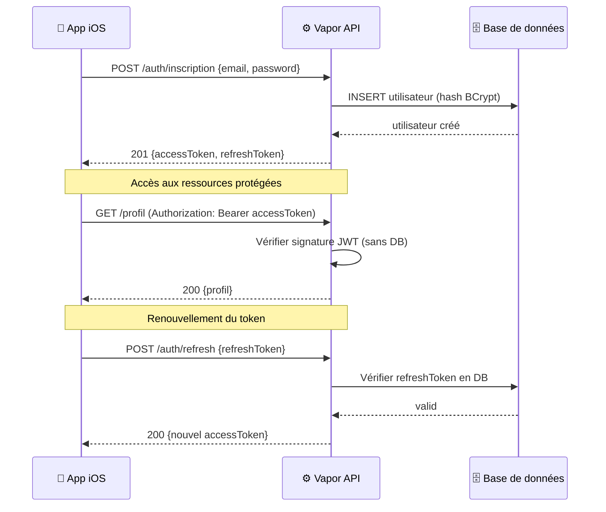

# Authentification & JWT

<div
  class="omny-meta"
  data-level="🔴 Avancé"
  data-version="1.0"
  data-time="3-4 heures">
</div>

## Introduction

!!! quote "Analogie pédagogique — Le Badge de Sécurité de l'Immeuble"
    Quand vous entrez dans un immeuble sécurisé pour la première fois, vous présentez votre identité à la réception (connexion avec email/mot de passe). On vous délivre un badge temporaire (JWT). Pour chaque accès ultérieur — porte d'ascenseur, salle de réunion, parking — vous présentez ce badge, pas votre passeport. Le badge a une durée de validité (expiration) et encode vos autorisations (rôle). Si le badge expire, vous repassez à la réception (refresh token). Le JWT fonctionne exactement ainsi — un jeton signé cryptographiquement que le serveur peut vérifier sans consulter la base de données.

JWT[^1] est le standard d'authentification stateless des APIs modernes. Vapor intègre une bibliothèque JWT officielle.

[^1]: **JWT** (JSON Web Token) : standard RFC 7519 définissant un format de jeton compact et auto-suffisant. Composé de trois parties Base64url : Header (algorithme) + Payload (claims) + Signature.

<br>

---

## Architecture d'Authentification



<br>

---

## Configuration JWT

```bash title="Terminal — Installer JWTKit"
# Ajouter JWTKit dans Package.swift
# .package(url: "https://github.com/vapor/jwt-kit.git", from: "5.0.0")
# Et dans targets : .product(name: "JWTKit", package: "jwt-kit")
```

```swift title="Swift (Vapor) — configure.swift : configuration JWT"
import JWT
import Vapor

public func configure(_ app: Application) async throws {

    // ─── Clé de signature JWT ───────────────────────────────────────
    // HMAC-SHA256 : algorithme symétrique — même clé pour signer et vérifier
    // En production : clé au moins 256 bits, stockée dans variable d'environnement
    let secret = Environment.get("JWT_SECRET") ?? "dev-secret-minimum-32-chars-long!!"

    // Enregistrer la clé dans le container de dépendances Vapor
    await app.jwt.keys.add(hmac: .init(from: secret), digestAlgorithm: .sha256)

    // ─── Autres configurations ──────────────────────────────────────
    app.databases.use(.sqlite(.file("auth.sqlite")), as: .sqlite)

    app.migrations.add(CreateUtilisateur())
    app.migrations.add(CreateRefreshToken())

    try await app.autoMigrate()
    try routes(app)
}
```

<br>

---

## Modèle Utilisateur avec Authentification

```swift title="Swift (Vapor) — Modèle Utilisateur complet pour l'authentification"
import Fluent
import Vapor

final class Utilisateur: Model, Content, @unchecked Sendable {
    static let schema = "utilisateurs"

    @ID(key: .id)                   var id: UUID?
    @Field(key: "email")            var email: String
    @Field(key: "mot_de_passe_hash") var motDePasseHash: String
    @Field(key: "prénom")           var prénom: String
    @Field(key: "rôle")             var rôle: String          // "user", "admin", "premium"
    @Timestamp(key: "créé_à", on: .create) var créeA: Date?

    init() { }
    init(id: UUID? = nil, email: String, motDePasseHash: String, prénom: String, rôle: String = "user") {
        self.id = id; self.email = email
        self.motDePasseHash = motDePasseHash
        self.prénom = prénom; self.rôle = rôle
    }
}

// ─── Migration ────────────────────────────────────────────────────────────────
struct CreateUtilisateur: AsyncMigration {
    func prepare(on database: any Database) async throws {
        try await database.schema("utilisateurs")
            .id()
            .field("email",              .string, .required)
            .field("mot_de_passe_hash",  .string, .required)
            .field("prénom",             .string, .required)
            .field("rôle",               .string, .required)
            .field("créé_à",             .datetime)
            .unique(on: "email")
            .create()
    }
    func revert(on database: any Database) async throws {
        try await database.schema("utilisateurs").delete()
    }
}
```

<br>

---

## Payload JWT — Les Claims

```swift title="Swift (Vapor) — PayloadJWT : claims du token"
import JWT
import Vapor

// JWTPayload : définit le contenu du token JWT
// Le payload est signé mais PAS chiffré — ne jamais y mettre de secrets
struct PayloadJWT: JWTPayload {

    // sub (subject) : identifiant de l'utilisateur
    var sub: SubjectClaim

    // exp (expiration) : date d'expiration du token
    var exp: ExpirationClaim

    // iat (issued at) : date de création
    var iat: IssuedAtClaim

    // Claims personnalisés — n'importe quel type Codable
    var email: String
    var rôle: String
    var prénom: String

    // verify : appelé par Vapor pour valider les claims
    func verify(using algorithm: some JWTAlgorithm) async throws {
        // Vérifier l'expiration automatiquement
        try self.exp.verifyNotExpired()
    }
}

// Créer un payload pour un utilisateur donné
extension PayloadJWT {
    static func créer(pour utilisateur: Utilisateur) throws -> PayloadJWT {
        guard let id = utilisateur.id else {
            throw Abort(.internalServerError)
        }
        return PayloadJWT(
            sub:    .init(value: id.uuidString),
            exp:    .init(value: Date().addingTimeInterval(15 * 60)),  // 15 minutes
            iat:    .init(value: Date()),
            email:  utilisateur.email,
            rôle:   utilisateur.rôle,
            prénom: utilisateur.prénom
        )
    }
}
```

*Le payload JWT contient `sub` (l'ID utilisateur), `exp` (expiration à 15 minutes — standard recommandé), `rôle` et `email`. La durée d'expiration courte (15 min) est une bonne pratique de sécurité — elle réduit la fenêtre d'exploitation d'un token volé.*

<br>

---

## Refresh Token — Pour Renouveler sans Reconnexion

```swift title="Swift (Vapor) — RefreshToken : modèle et migration"
import Fluent
import Vapor

// RefreshToken : token de longue durée stocké en DB (peut être révoqué)
// Contrairement au JWT (stateless), le refresh token est vérifiable en DB
final class RefreshToken: Model, @unchecked Sendable {
    static let schema = "refresh_tokens"

    @ID(key: .id)            var id: UUID?
    @Field(key: "valeur")    var valeur: String   // Token aléatoire (64 chars hex)
    @Field(key: "expire_a")  var expireA: Date

    @Parent(key: "utilisateur_id")
    var utilisateur: Utilisateur

    init() { }
    init(valeur: String, expireA: Date, utilisateurId: UUID) {
        self.valeur   = valeur
        self.expireA  = expireA
        self.$utilisateur.id = utilisateurId
    }

    // Générer un nouveau refresh token aléatoire
    static func générer(pour utilisateurId: UUID) -> RefreshToken {
        let valeur = [UInt8].random(count: 32).hex  // 64 caractères hexadécimaux
        let expiration = Date().addingTimeInterval(30 * 24 * 60 * 60) // 30 jours
        return RefreshToken(valeur: valeur, expireA: expiration, utilisateurId: utilisateurId)
    }

    var estExpiré: Bool { expireA < Date() }
}

struct CreateRefreshToken: AsyncMigration {
    func prepare(on database: any Database) async throws {
        try await database.schema("refresh_tokens")
            .id()
            .field("valeur",          .string, .required)
            .field("expire_a",        .datetime, .required)
            .field("utilisateur_id",  .uuid, .required,
                   .references("utilisateurs", "id", onDelete: .cascade))
            .unique(on: "valeur")
            .create()
    }
    func revert(on database: any Database) async throws {
        try await database.schema("refresh_tokens").delete()
    }
}
```

<br>

---

## Routes d'Authentification

```swift title="Swift (Vapor) — AuthController : inscription, connexion, refresh, déconnexion"
import Vapor
import Fluent
import JWT

final class AuthController: RouteCollection {

    func boot(routes: RoutesBuilder) throws {
        let auth = routes.grouped("auth")
        auth.post("inscription",  use: inscription)
        auth.post("connexion",    use: connexion)
        auth.post("refresh",      use: rafraîchir)

        // Route de déconnexion protégée par JWT (révoquer le refresh token)
        let protégé = auth.grouped(JWTMiddleware())
        protégé.delete("déconnexion", use: déconnecter)
    }

    // ─── Inscription ───────────────────────────────────────────────
    @Sendable
    func inscription(req: Request) async throws -> TokenRéponse {
        try InscriptionDTO.validate(content: req)
        let dto = try req.content.decode(InscriptionDTO.self)

        // Vérifier unicité de l'email
        if try await Utilisateur.query(on: req.db).filter(\.$email == dto.email).first() != nil {
            throw Abort(.conflict, reason: "Cet email est déjà utilisé")
        }

        // Hacher le mot de passe avec BCrypt
        // Bcrypt.hash() : fonction à sens unique + sel aléatoire intégré
        let hash = try await req.password.async.hash(dto.motDePasse)
        let utilisateur = Utilisateur(email: dto.email, motDePasseHash: hash,
                                       prénom: dto.prénom)

        try await utilisateur.save(on: req.db)

        return try await créerTokens(pour: utilisateur, req: req)
    }

    // ─── Connexion ─────────────────────────────────────────────────
    @Sendable
    func connexion(req: Request) async throws -> TokenRéponse {
        let dto = try req.content.decode(ConnexionDTO.self)

        // Chercher l'utilisateur
        guard let utilisateur = try await Utilisateur.query(on: req.db)
            .filter(\.$email == dto.email)
            .first() else {
            // Message générique — ne pas indiquer si l'email existe
            throw Abort(.unauthorized, reason: "Email ou mot de passe incorrect")
        }

        // Vérifier le mot de passe contre le hash BCrypt
        guard try await req.password.async.verify(dto.motDePasse, created: utilisateur.motDePasseHash) else {
            throw Abort(.unauthorized, reason: "Email ou mot de passe incorrect")
        }

        return try await créerTokens(pour: utilisateur, req: req)
    }

    // ─── Refresh ───────────────────────────────────────────────────
    @Sendable
    func rafraîchir(req: Request) async throws -> TokenRéponse {
        let dto = try req.content.decode(RefreshDTO.self)

        // Chercher le refresh token en DB
        guard let refreshToken = try await RefreshToken.query(on: req.db)
            .filter(\.$valeur == dto.refreshToken)
            .with(\.$utilisateur)
            .first() else {
            throw Abort(.unauthorized, reason: "Refresh token invalide")
        }

        // Vérifier l'expiration
        guard !refreshToken.estExpiré else {
            try await refreshToken.delete(on: req.db)
            throw Abort(.unauthorized, reason: "Refresh token expiré, reconnectez-vous")
        }

        // Révoquer l'ancien refresh token (rotation de token — bonne pratique)
        try await refreshToken.delete(on: req.db)

        return try await créerTokens(pour: refreshToken.utilisateur, req: req)
    }

    // ─── Déconnexion ───────────────────────────────────────────────
    @Sendable
    func déconnecter(req: Request) async throws -> HTTPStatus {
        let payload = try req.jwt.verify(as: PayloadJWT.self)
        guard let utilisateurId = UUID(uuidString: payload.sub.value) else {
            throw Abort(.badRequest)
        }

        // Supprimer TOUS les refresh tokens de l'utilisateur
        try await RefreshToken.query(on: req.db)
            .filter(\.$utilisateur.$id == utilisateurId)
            .delete()

        return .noContent
    }

    // ─── Méthode privée : générer access + refresh tokens ──────────
    private func créerTokens(pour utilisateur: Utilisateur, req: Request) async throws -> TokenRéponse {
        // Access token JWT (stateless, 15 min)
        let payload = try PayloadJWT.créer(pour: utilisateur)
        let accessToken = try await req.jwt.sign(payload)

        // Refresh token (en DB, 30 jours)
        let refreshToken = RefreshToken.générer(pour: utilisateur.id!)
        try await refreshToken.save(on: req.db)

        return TokenRéponse(
            accessToken:  accessToken,
            refreshToken: refreshToken.valeur,
            expireEn:     900   // 15 minutes en secondes
        )
    }
}

// ─── DTOs ─────────────────────────────────────────────────────────────────────

struct InscriptionDTO: Content, Validatable {
    let prénom: String
    let email: String
    let motDePasse: String

    static func validations(_ validations: inout Validations) {
        validations.add("prénom",     as: String.self, is: .count(2...50))
        validations.add("email",      as: String.self, is: .email)
        validations.add("motDePasse", as: String.self, is: .count(8...))
    }
}

struct ConnexionDTO:  Content { let email: String; let motDePasse: String }
struct RefreshDTO:    Content { let refreshToken: String }

struct TokenRéponse: Content {
    let accessToken: String
    let refreshToken: String
    let expireEn: Int           // Secondes avant expiration du access token
}
```

<br>

---

## Middleware JWT — Protéger les Routes

```swift title="Swift (Vapor) — JWTMiddleware : vérifier le token sur chaque requête"
import JWT
import Vapor

// Middleware qui intercepte chaque requête et vérifie le Bearer JWT
final class JWTMiddleware: AsyncMiddleware {

    func respond(to request: Request, chainingTo next: AsyncResponder) async throws -> Response {

        // Extraire et vérifier le JWT en une seule opération
        // Throws 401 si : pas de token, signature invalide, ou token expiré
        let payload = try await request.jwt.verify(as: PayloadJWT.self)

        // Stocker le payload dans la request pour les handlers
        request.utilisateurJWT = payload

        return try await next.respond(to: request)
    }
}

// Extension Request : accès au payload depuis les handlers
extension Request {
    private struct PayloadKey: StorageKey { typealias Value = PayloadJWT }

    var utilisateurJWT: PayloadJWT? {
        get { storage[PayloadKey.self] }
        set { storage[PayloadKey.self] = newValue }
    }

    // Raccourci — throws si non authentifié
    func utilisateurJWTRequis() throws -> PayloadJWT {
        guard let payload = utilisateurJWT else {
            throw Abort(.unauthorized)
        }
        return payload
    }
}

// Middleware de rôle JWT
final class RequiertRôleJWT: AsyncMiddleware {
    let rôle: String
    init(rôle: String) { self.rôle = rôle }

    func respond(to request: Request, chainingTo next: AsyncResponder) async throws -> Response {
        let payload = try request.utilisateurJWTRequis()
        guard payload.rôle == rôle || payload.rôle == "admin" else {
            throw Abort(.forbidden, reason: "Rôle '\(rôle)' requis")
        }
        return try await next.respond(to: request)
    }
}

// Utilisation dans routes.swift
func routes(_ app: Application) throws {
    // Routes publiques
    try app.register(collection: AuthController())

    // Routes authentifiées
    let jwt = app.grouped(JWTMiddleware())
    jwt.get("profil") { req async throws -> ProfilRéponse in
        let payload = try req.utilisateurJWTRequis()
        return ProfilRéponse(id: payload.sub.value, email: payload.email, rôle: payload.rôle)
    }

    // Route admin uniquement
    let admin = jwt.grouped(RequiertRôleJWT(rôle: "admin"))
    admin.get("admin", "utilisateurs") { req async throws -> String in "Admin uniquement" }
}

struct ProfilRéponse: Content {
    let id: String
    let email: String
    let rôle: String
}
```

<br>

---

## Exercices

!!! note "À vous de jouer"

**Exercice 1 — Flow d'authentification complet**

```bash title="Terminal — Exercice 1 : tester le flow complet avec cURL"
# BASE_URL=http://localhost:8080

# 1. Inscription
# curl -X POST $BASE_URL/auth/inscription \
#      -H "Content-Type: application/json" \
#      -d '{"prénom":"Alice","email":"alice@test.com","motDePasse":"Test1234!"}'
# → { "accessToken": "eyJ...", "refreshToken": "abc123...", "expireEn": 900 }

# 2. Accéder au profil avec le access token
# curl $BASE_URL/profil \
#      -H "Authorization: Bearer eyJ..."
# → { "id": "uuid...", "email": "alice@test.com", "rôle": "user" }

# 3. Simuler l'expiration (mettre exp à 1 seconde dans PayloadJWT.créer)
# puis recommencer avec : curl $BASE_URL/profil → 401 Unauthorized

# 4. Refresh : obtenir un nouveau access token
# curl -X POST $BASE_URL/auth/refresh \
#      -d '{"refreshToken":"abc123..."}'
# → nouveau access token

# Implémentez le flow complet et testez chaque étape
```

**Exercice 2 — Profil utilisateur protégé**

```swift title="Swift (Vapor) — Exercice 2 : UtilisateurController protégé"
// Créez un UtilisateurController avec RouteCollection :
// Toutes les routes nécessitent JWTMiddleware

// GET  /utilisateurs/moi          → profil depuis le JWT (sans requête DB)
// PUT  /utilisateurs/moi          → modifier prénom (requiert mot de passe actuel)
// POST /utilisateurs/moi/password → changer le mot de passe (motDePasseActuel + nouveau)

// Pour la modification : charger l'utilisateur en DB par payload.sub
// Vérifier le mot de passe actuel avant toute modification
// Invalider tous les refresh tokens sur changement de mot de passe

final class UtilisateurController: RouteCollection {
    func boot(routes: RoutesBuilder) throws {
        let jwt = routes.grouped(JWTMiddleware())
        let moi = jwt.grouped("utilisateurs", "moi")
        // TODO
    }
}
```

<br>

---

## Conclusion

!!! quote "Ce qu'il faut retenir de ce module"
    BCrypt (via `req.password.async.hash()`) est le standard pour hacher les mots de passe — jamais de SHA-256, MD5, ou stockage en clair. Le JWT (access token, 15 minutes, stateless) + le refresh token (en DB, 30 jours, révocable) est l'architecture recommandée pour les APIs mobiles. `req.jwt.sign(payload)` génère le JWT, `req.jwt.verify(as: MonPayload.self)` le vérifie — Vapor gère la cryptographie automatiquement. `JWTMiddleware` extrait et vérifie le token sur chaque requête protégée, en stockant le payload dans `request.storage`. Sur connexion réussie : retourner access token + refresh token + durée d'expiration. Sur connexion échouée : toujours le même message d'erreur, quelle que soit la raison (ne pas révéler si l'email existe).

> Dans le module suivant, nous assemblons tout ce que nous avons appris pour créer une **API REST Complète** — DTOs, versioning, documentation OpenAPI et patterns de production.

<br>
