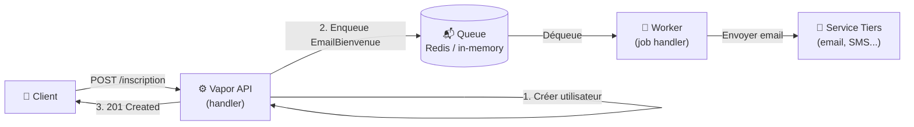

# Queues & Jobs

<div
  class="omny-meta"
  data-level="🔴 Avancé"
  data-version="1.0"
  data-time="2-3 heures">
</div>

## Introduction

!!! quote "Analogie pédagogique — La Boîte aux Lettres d'Entreprise"
    Un client envoie un courrier recommandé à une entreprise. La réceptionniste n'ouvre pas l'enveloppe, ne rédige pas la réponse, et ne traite pas le dossier pendant que vous attendez au guichet. Elle tamponne et dépose l'enveloppe dans la boîte de traitement interne, et vous dit "votre demande est enregistrée" (202 Accepted). Un agent en arrière-plan traite le dossier quand il a le temps. C'est exactement la queue Vapor : l'API enqueue le job (instantané), répond au client, et un worker traite le job de façon asynchrone — même après un redémarrage.

Les queues Vapor (`vapor-queues`) permettent d'exécuter des tâches longues en arrière-plan sans bloquer les requêtes HTTP : envoi d'emails, génération de PDF, appels API tiers, nettoyage nocturne.

<br>

---

## Architecture des Queues



*Le handler HTTP retourne immédiatement (étapes 1-3). Le Worker traite le job en arrière-plan, indépendamment du client. Si le service d'email est lent ou en panne, le job est mis en attente — pas l'utilisateur.*

<br>

---

## Installation et Configuration

```swift title="Swift (Vapor) — Package.swift : ajouter Queues"
// Dans Package.swift, dépendances :
// .package(url: "https://github.com/vapor/queues.git", from: "1.14.0"),
// .package(url: "https://github.com/vapor/queues-redis-driver.git", from: "1.1.0"),

// Cibles :
// .product(name: "Queues",            package: "queues"),
// .product(name: "QueuesRedisDriver", package: "queues-redis-driver"),
```

```swift title="Swift (Vapor) — configure.swift : configurer Queues avec Redis ou in-memory"
import Queues
import QueuesRedisDriver
import Vapor

public func configure(_ app: Application) async throws {

    // ─── Option A : Driver Redis (production recommandée) ──────────
    try app.queues.use(.redis(url: Environment.get("REDIS_URL") ?? "redis://localhost:6379"))

    // ─── Option B : Driver in-memory (développement seulement) ─────
    // Jobs perdus au redémarrage — jamais en production
    app.queues.use(.asyncTest)   // Ou .memory pour les tests sync

    // ─── Enregistrer les Jobs ──────────────────────────────────────
    app.queues.add(EmailBienvenueJob())
    app.queues.add(GénérerRapportJob())
    app.queues.add(NettoyerTokensExpirésJob())

    // ─── Démarrer le Worker intégré ────────────────────────────────
    // En production, lancer un processus worker séparé :
    // swift run App queues
    // En développement : le worker tourne dans le même processus
    try app.queues.startInProcessJobs(on: .default)

    try routes(app)
}
```

*En production, lancez le worker dans un **processus séparé** : `swift run App queues`. Cela permet de scaler les workers indépendamment de l'API et de les redémarrer sans interrompre le trafic HTTP.*

<br>

---

## Définir un Job

```swift title="Swift (Vapor) — EmailBienvenueJob : job d'envoi d'email"
import Queues
import Vapor

// ─── Payload du job : données sérialisées dans la queue ──────────────────────
// JobData : ce qu'on stocke dans Redis — doit être Codable
struct EmailBienvenueJobData: JobData {
    // Identifiant unique du type de job (utilisé par le dispatcher)
    static let name = "email-bienvenue"

    let destinataireEmail: String
    let destinataireNom: String
    let userId: UUID
}

// ─── Job : logique d'exécution ────────────────────────────────────────────────
struct EmailBienvenueJob: AsyncJob {

    typealias Payload = EmailBienvenueJobData

    // dequeue : appelé par le worker pour traiter le job
    func dequeue(_ context: QueueContext, _ payload: EmailBienvenueJobData) async throws {
        context.logger.info("Envoi email bienvenue à \(payload.destinataireEmail)")

        // Logique d'envoi d'email (avec SendGrid, Postmark, etc.)
        // try await envoierEmail(
        //     to:      payload.destinataireEmail,
        //     subject: "Bienvenue sur OmnyDocs, \(payload.destinataireNom) !",
        //     body:    templateBienvenue(nom: payload.destinataireNom)
        // )

        // Simulation
        context.logger.info("✅ Email envoyé à \(payload.destinataireEmail)")
    }

    // error : appelé si dequeue lance une erreur
    // Retourner true → requeue (retry), false → abandon
    func error(_ context: QueueContext, _ error: Error, _ payload: EmailBienvenueJobData) async throws {
        context.logger.error("❌ Échec email à \(payload.destinataireEmail) : \(error)")
        // Le job sera ré-essayé selon la configuration de maxRetryCount
    }
}

// ─── Job de rapport PDF ───────────────────────────────────────────────────────
struct GénérerRapportJobData: JobData {
    static let name = "generer-rapport"
    let rapportId: UUID
    let userId: UUID
    let type: String    // "mensuel", "annuel"
}

struct GénérerRapportJob: AsyncJob {
    typealias Payload = GénérerRapportJobData

    func dequeue(_ context: QueueContext, _ payload: GénérerRapportJobData) async throws {
        context.logger.info("Génération rapport \(payload.type) pour \(payload.userId)")

        // Opération longue : 2-30 secondes
        // 1. Requêter la DB (via context.application.db)
        // 2. Générer le PDF
        // 3. Sauvegarder dans le stockage
        // 4. Notifier l'utilisateur (push, email)
    }
}
```

<br>

---

## Envoyer un Job depuis un Handler

```swift title="Swift (Vapor) — Dispatcher un job depuis une route"
import Vapor
import Queues

// Lors de l'inscription : envoyer un job d'email
app.post("inscription") { req async throws -> Response in

    // 1. Créer l'utilisateur
    let dto = try req.content.decode(InscriptionDTO.self)
    let hash = try await req.password.async.hash(dto.motDePasse)
    let utilisateur = Utilisateur(email: dto.email, motDePasseHash: hash, prénom: dto.prénom)
    try await utilisateur.save(on: req.db)

    // 2. Envoyer le job d'email bienvenue dans la queue
    //    dispatch() : synchrone — place le job dans Redis immédiatement
    try await req.queue.dispatch(
        EmailBienvenueJob.self,
        EmailBienvenueJobData(
            destinataireEmail: utilisateur.email,
            destinataireNom:   utilisateur.prénom,
            userId:            utilisateur.id!
        )
    )

    // 3. Répondre immédiatement — pas besoin d'attendre l'email
    let réponse = UtilisateurRéponse(id: utilisateur.id!, email: utilisateur.email, prénom: utilisateur.prénom)
    return try await réponse.encodeResponse(status: .created, for: req)
}

// Générer un rapport en arrière-plan
app.post("rapports", "générer") { req async throws -> HTTPStatus in
    let payload = try req.utilisateurJWTRequis()
    let dto = try req.content.decode(GénérerRapportRequest.self)

    let rapportId = UUID()

    // Dispatch avec délai (dans 5 minutes par exemple)
    try await req.queue.dispatch(
        GénérerRapportJob.self,
        GénérerRapportJobData(
            rapportId: rapportId,
            userId:    UUID(uuidString: payload.sub.value)!,
            type:      dto.type
        ),
        maxRetryCount: 3,           // Réessayer 3 fois maximum
        delayUntil: Date().addingTimeInterval(5 * 60)  // Délai de 5 minutes
    )

    return .accepted  // 202 — la demande est enregistrée, pas encore traitée
}

struct GénérerRapportRequest: Content {
    let type: String  // "mensuel", "annuel"
}
```

*`202 Accepted` (et non `200 OK` ni `201 Created`) est le code HTTP sémantiquement correct pour "votre demande est enregistrée, elle sera traitée ultérieurement". Votre client iOS peut afficher "Rapport en cours de génération — vous recevrez une notification".*

<br>

---

## Jobs Planifiés — Scheduled Jobs

```swift title="Swift (Vapor) — Jobs planifiés : exécution récurrente"
import Queues
import Vapor

// Job de nettoyage des refresh tokens expirés
struct NettoyerTokensExpirésJob: AsyncScheduledJob {

    // run : appelé selon le planning défini dans configure.swift
    func run(context: QueueContext) async throws {
        let db = context.application.db

        // Supprimer tous les refresh tokens dont expire_a < maintenant
        let supprimés = try await RefreshToken.query(on: db)
            .filter(\.$expireA < Date())
            .delete()

        context.logger.info("🧹 Nettoyage : refresh tokens expirés supprimés")
    }
}

// Job de statistiques quotidiennes
struct StatistiquesQuotidiennesJob: AsyncScheduledJob {
    func run(context: QueueContext) async throws {
        let db = context.application.db
        let nbArticles = try await Article.query(on: db).count()
        context.logger.info("📊 Articles total : \(nbArticles)")
        // Sauvegarder dans une table de statistics...
    }
}

// Enregistrer les jobs planifiés dans configure.swift
// app.queues.schedule(NettoyerTokensExpirésJob())
//     .hourly()                          // Toutes les heures
// 
// app.queues.schedule(StatistiquesQuotidiennesJob())
//     .daily()                           // Tous les jours à minuit
//
// app.queues.schedule(MonJob())
//     .weekly()                          // Chaque semaine
//
// app.queues.schedule(MonJob())
//     .monthly()                         // Chaque mois
//
// app.queues.schedule(MonJob())
//     .at(.monday, .tuesday, ...)        // Jours spécifiques
```

<br>

---

## Exercices

!!! note "À vous de jouer"

**Exercice 1 — Job de notification**

```swift title="Swift (Vapor) — Exercice 1 : job de notification push"
// Créez NotificationPushJob avec :
// - Payload : userId, titre, corps, données (JSON string)
// - dequeue : log la notification (simulation — en vrai : appeler l'API APNs)
// - Dispatch depuis la route POST /articles quand un article est publié
//   (seulement si publié == true)
// - maxRetryCount : 3

struct NotifPushJobData: JobData {
    static let name = "notification-push"
    // TODO
}

struct NotifPushJob: AsyncJob {
    typealias Payload = NotifPushJobData
    func dequeue(_ context: QueueContext, _ payload: NotifPushJobData) async throws {
        // TODO
    }
}
```

**Exercice 2 — Job de nettoyage planifié**

```swift title="Swift (Vapor) — Exercice 2 : nettoyage des comptes inactifs"
// Créez NettoyerComptesInactifsJob (AsyncScheduledJob) qui :
// - Cherche les utilisateurs dont le dernier login > 90 jours (champ lastLogin)
// - Log le nombre de comptes trouvés
// - NE PAS supprimer : envoyer un email d'avertissement (job EmailAvertissement)
// - Planifié : une fois par semaine
// Conseil : ajouter un champ lastLogin: Date? au modèle Utilisateur + migration

struct NettoyerComptesInactifsJob: AsyncScheduledJob {
    func run(context: QueueContext) async throws {
        // TODO
    }
}
```

<br>

---

## Conclusion

!!! quote "Ce qu'il faut retenir de ce module"
    Les queues Vapor permettent d'exécuter des tâches longues **hors du cycle requête-réponse** — l'API répond immédiatement (`202 Accepted`), le worker traite en arrière-plan. Un `AsyncJob` définit son `Payload` (données Codable stockées dans Redis) et sa méthode `dequeue` (logique d'exécution). `req.queue.dispatch(MonJob.self, payload)` envoie le job dans la queue depuis un handler HTTP. `maxRetryCount` et la méthode `error` gèrent les échecs de façon robuste. Les `AsyncScheduledJob` permettent des tâches récurrentes (`hourly`, `daily`, `weekly`). En production : Redis est obligatoire pour la persistance — `in-memory` perd les jobs au redémarrage.

> Dans le module suivant, nous couvrons les **Tests XCTVapor** — configurer une base de données de test, tester les routes HTTP, les middlewares et les controllers avec le framework de test officiel de Vapor.

<br>
