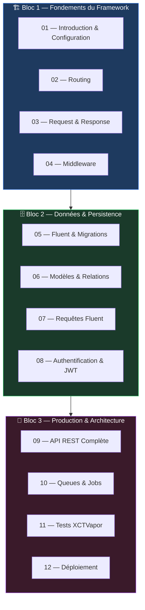

# Vapor — Le Serveur Swift

<div
  class="omny-meta"
  data-level="Index de Formation"
  data-version="1.0"
  data-time="Avril 2026">
</div>

!!! quote "Pourquoi Vapor ?"
    Vous savez construire des interfaces iOS avec SwiftUI. Mais d'où viennent les données ? Qui authentifie l'utilisateur ? Qui stocke les commandes ? Vapor répond à ces questions. Il vous permet d'écrire le **backend** de vos applications en Swift — le même langage, le même typage fort, les mêmes idiomes `async/await`. Un seul langage, de l'écran au serveur.

Vapor est un framework backend Swift, open-source, construit sur SwiftNIO[^1] (la couche réseau d'Apple). Il gère le routage HTTP, l'accès aux bases de données, l'authentification, les files de jobs et bien plus — avec la performance et la sécurité de Swift.

[^1]: **SwiftNIO** : bibliothèque réseau asynchrone bas niveau d'Apple, inspirée de Netty (Java). Vapor s'appuie sur SwiftNIO pour toutes ses entrées/sorties.

<br>

---

## Prérequis

!!! warning "Prérequis obligatoires"
    Cette formation suppose la **maîtrise complète de la formation Swift OmnyDocs** (18 modules), notamment :
    - `async/await`, `Actor`, `@MainActor` (Module 14 — Concurrence)
    - Protocols, Generics, `Codable` (Modules 09, 11, 10)
    - Gestion des erreurs avec `throws`/`do-catch` (Module 13)
    - Property Wrappers (Module 12)

    La formation **SwiftUI** n'est pas un prérequis pour Vapor — mais elle est utile pour comprendre le projet mobile sécurisé qui suit.

**Environnement requis :**

| Outil | Version | Installation |
|---|---|---|
| Swift | 6.0+ | Xcode 16+ ou `swift.org` |
| Vapor Toolbox | 18.x | `brew install vapor` |
| Xcode | 16+ | App Store Mac |
| Docker (optionnel) | 27+ | `docker.com` pour PostgreSQL |

```bash title="Terminal — Installation de Vapor Toolbox"
# Installer le Vapor Toolbox via Homebrew (macOS)
brew install vapor

# Vérifier l'installation
vapor --version
# → vapor/toolbox@18.x.x

# Créer un premier projet
vapor new MonProjet --template api
cd MonProjet

# Ouvrir dans Xcode
open Package.swift
```

<br>

---

## Structure de la Formation

La formation est organisée en **trois blocs progressifs** de 4 modules chacun.



<br>

---

## Les Modules

### Bloc 1 — Fondements du Framework

| Module | Titre | Durée | Niveau |
|---|---|---|---|
| [01 — Introduction](./01-introduction.md) | Architecture Vapor, SwiftNIO, premier projet, routes minimales | 2-3h | 🟡 Intermédiaire |
| [02 — Routing](./02-routing.md) | Routes, paramètres, groupes, contrôleurs | 2-3h | 🟡 Intermédiaire |
| [03 — Request & Response](./03-request-response.md) | Décoder le corps, Content, JSONEncoder/Decoder, headers | 2-3h | 🟡 Intermédiaire |
| [04 — Middleware](./04-middleware.md) | Middleware global et route, CORS, rate limiting, logging | 2-3h | 🟡 Intermédiaire |

### Bloc 2 — Données & Persistance

| Module | Titre | Durée | Niveau |
|---|---|---|---|
| [05 — Fluent & Migrations](./05-fluent-migrations.md) | ORM Fluent, SQLite/PostgreSQL, migrations versionnées | 3-4h | 🔴 Avancé |
| [06 — Modèles & Relations](./06-modeles-relations.md) | @Field, @Children, @Parent, @Siblings, eager loading | 3-4h | 🔴 Avancé |
| [07 — Requêtes Fluent](./07-requetes-fluent.md) | filter, sort, paginate, count, transactions | 2-3h | 🔴 Avancé |
| [08 — Authentification & JWT](./08-authentification-jwt.md) | UserAuthenticator, JWT, Bearer token, guards | 3-4h | 🔴 Avancé |

### Bloc 3 — Production & Architecture

| Module | Titre | Durée | Niveau |
|---|---|---|---|
| [09 — API REST Complète](./09-api-rest.md) | CRUD complet, DTOs, validation, versioning | 3-4h | 🔴 Avancé |
| [10 — Queues & Jobs](./10-queues-jobs.md) | Jobs asynchrones, Queues, retry, Redis | 2-3h | 🔴 Avancé |
| [11 — Tests XCTVapor](./11-tests-xctvapor.md) | XCTVapor, tester routes et middlewares, mocks | 2-3h | 🔴 Avancé |
| [12 — Déploiement](./12-deploiement.md) | Docker, Railway, Render, HTTPS, variables d'environnement | 2-3h | 🔴 Avancé |

<br>

---

## Les Quatre Pivots de la Formation

Ces modules conditionnent la compréhension de tout ce qui suit :

| Module | Concept | Ce qu'il débloque |
|---|---|---|
| **02 — Routing** | Groupes, paramètres, contrôleurs | Toute l'architecture de l'API |
| **05 — Fluent** | ORM, migrations, connexion DB | Persistance des données |
| **08 — JWT** | Tokens, guards, middlewares d'auth | Sécurité de l'API complète |
| **09 — API REST** | DTOs, validation, CRUD | Architecture prête pour production |

<br>

---

## Bases de Données Couvertes

| BDD | Module | Usage |
|---|---|---|
| **SQLite** | 05 → 09 | Développement local, pas de Docker requis |
| **PostgreSQL** | 05 (encart) | Production — avec Docker ou service cloud |

La progression commence avec SQLite (zéro configuration) et présente PostgreSQL dès que la configuration est établie.

<br>

---

## Vers le Projet Mobile Sécurisé

Ce cours Vapor est conçu pour alimenter directement le **Projet Mobile Sécurisé** — une application Swift + Vapor implémentant :

- Authentification JWT avec refresh tokens
- Contrôle d'accès basé sur les rôles (RBAC)
- Protection contre les attaques courantes (injection, rate limiting, CSRF)
- Communication chiffrée TLS

> Commencez par [01 — Introduction & Configuration](./01-introduction.md)

<br>