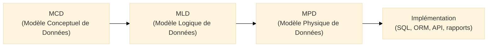
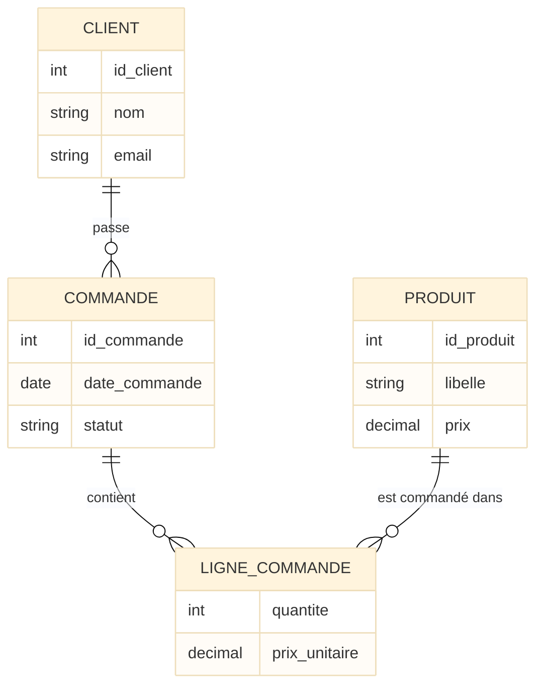
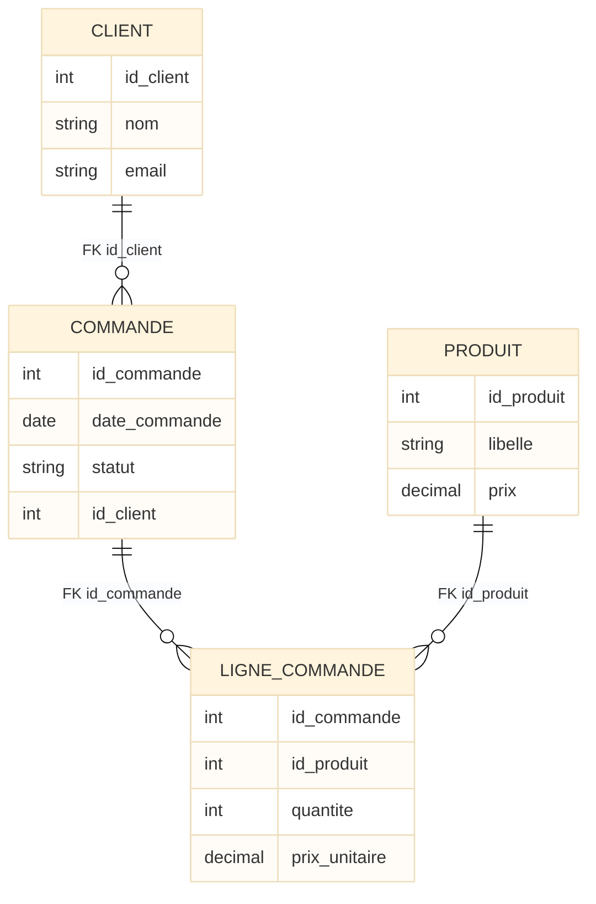
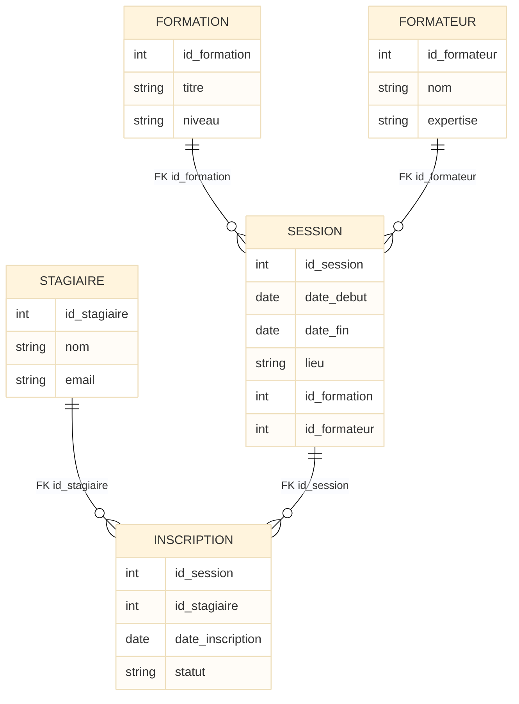
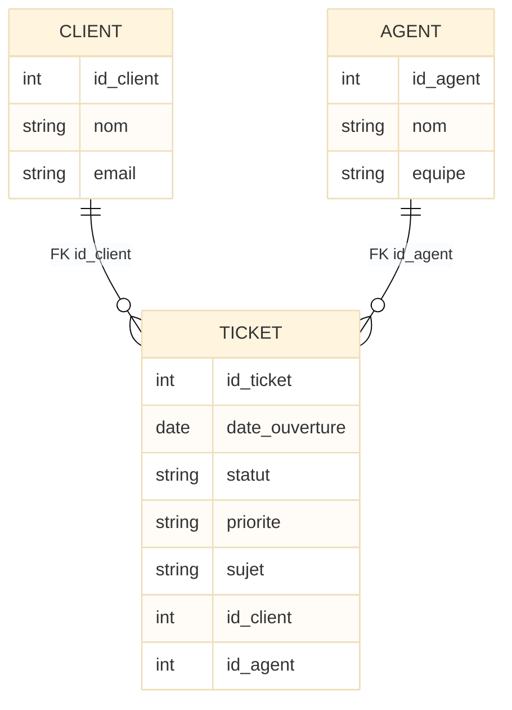

# MLD

<div
  class="omny-meta"
  data-level="🟡 Intermédiaire & 🔴 Avancé"
  data-version="1.0"
  data-time="30-40 minutes">
</div>

## Introduction au Modèle Logique de Données (MLD)

!!! quote "Analogie pédagogique"
    _Gardons l’image de l’**architecte urbain**. Le MCD, c’est le **plan conceptuel de la ville** : quels bâtiments existent, comment ils sont reliés, quelles règles de voisinage s’appliquent. Le **MLD**, lui, c’est le **plan structurel pour les ingénieurs** : on conserve la même ville, mais on transforme les idées en **structures précises** exploitables par les équipes travaux — taille des parcelles, jonctions exactes, numérotation des lots. Le MLD reste indépendant du “fournisseur de béton”, mais il est déjà entièrement **compatible avec le monde physique**._

Le **Modèle Logique de Données (MLD)** est la **traduction relationnelle** du MCD.  
Il conserve **exactement le même sens métier**, mais le reformule dans un formalisme proche du **modèle relationnel** : tables, colonnes, clés primaires, clés étrangères, contraintes.

On ne parle **toujours pas** d’un SGBD particulier (PostgreSQL, MySQL, SQL Server…), mais on adopte une structure qui pourrait être implémentée dans **n’importe quel SGBDR**[^1].

Sans MLD, on saute directement du MCD au SQL, ce qui entraîne souvent :

- des **tables mal découpées** (regroupement ou découpage arbitraire)  
- des **clés primaires / étrangères incohérentes** par rapport aux règles métier  
- des **associations n–n mal gérées** (duplication, colonnes multi-valuées)  

Le MLD joue le rôle de **pont** entre la vision métier (MCD) et la mise en œuvre physique (MPD / SQL).

!!! info "Pourquoi le MLD est essentiel ?"
    - Il fournit une **traduction rigoureuse** du MCD vers le modèle relationnel.  
    - Il permet de **stabiliser la structure des tables** avant de choisir le SGBD.  
    - Il clarifie les **clés, contraintes et relations** de manière explicite.  
    - Il sert de **référence technique** pour les DBA, les devs et les concepteurs d’API.

---

## Pour repartir des bases

### 1. Ce qu’est (et n’est pas) un MLD

!!! quote "Un MLD **décrit les données sous forme relationnelle**, mais reste indépendant des détails physiques d’un SGBD donné."

Un MLD contient :

- des **relations** (que l’on assimile à des tables logiques)  
- des **attributs logiques** (colonnes)  
- des **clés primaires** et **clés étrangères**  
- la **traduction explicite** des associations (1–n, n–n, 1–1…) du MCD  

Un MLD **ne contient pas** :

- de types physiques détaillés (`VARCHAR(255)`, `NUMERIC(10,2)`…)  
- de considérations de stockage (tablespaces, partitions…)  
- d’optimisations spécifiques (index particuliers, vues matérialisées, sharding…)

!!! note "Objectif du MLD"
    Le MLD répond à la question :  
    **“Comment traduire le MCD dans un modèle relationnel cohérent, avec des tables et des clés, sans être encore lié à un SGBD particulier ?”**

### 2. Vocabulaire minimal

| Terme                 | Rôle                                                                                       |
|----------------------|--------------------------------------------------------------------------------------------|
| **Relation**         | Table logique issue d’une entité ou association du MCD                                    |
| **Attribut**         | Colonne logique d’une relation                                                             |
| **Clé primaire (PK)**<br /><small>_PK : Primary Key_</small> | Attribut(s) identifiant de manière unique chaque ligne d’une relation                     |
| **Clé étrangère (FK)**<br /><small>_FK : Foreign Key_</small> | Attribut qui référence la clé primaire d’une autre relation                              |
| **Association n–n**  | Relation intermédiaire (table associative) portant au moins deux FKs et souvent des infos |
| **Dépendance fonctionnelle** | Lien logique où un attribut est déterminé par un ou plusieurs autres attributs[^2]  |

---

## Où se situe le MLD dans Merise ?

!!! quote "On se place au milieu de la chaîne : le MLD fait le lien entre le **MCD** (métier) et le **MPD** (physique / SQL)."

Rappel des trois niveaux :

- Le **MCD** modélise le **métier** (entités, associations, cardinalités).  
- Le **MLD** traduit ce métier en **relations** (tables logiques, PK, FK).  
- Le **MPD** adapte ces relations au **SGBD concret** (types, index, options physiques).



<small><i>Le MLD est la **charnière** : il est assez proche du métier pour rester lisible par les fonctionnels, et suffisamment structuré pour que les devs et DBA puissent le traduire en MPD / SQL.</i></small>

---

## Pour qui ? Pourquoi maintenant ?

### Pour qui ?

Le MLD est particulièrement utile :

* aux **concepteurs / architectes** : pour fixer la structure logique avant les choix physiques ;
* aux **développeurs backend / data** : pour concevoir les entités ORM, les schémas d’API, les migrations ;
* aux **DBA** : pour préparer le MPD et les scripts SQL ;
* aux **équipes d’intégration / BI** : pour comprendre la structure relationnelle des données sources.

### Pourquoi maintenant ?

On construit le MLD **après validation du MCD** :

* assez tôt pour **éviter les erreurs structurelles** dans les tables ;
* assez tard pour bénéficier d’un **MCD stabilisé** et validé par le métier.

!!! tip "Moment idéal"
    *On attaque le MLD **juste après** la validation du MCD, avant de produire les spécifications techniques détaillées, les schémas SQL et les premiers scripts de migration.*

---

## Comment établir un MLD à partir d’un MCD ?

!!! quote "On suit une série de règles **mécaniques**, mais guidées par le métier. On reste dans le relationnel, sans plonger tout de suite dans les détails physiques."

### 1. Règle générale : entité → relation

Chaque **entité** du MCD devient en général une **relation** (table logique) dans le MLD :

> Entité `CLIENT` ⟶ Relation `CLIENT`
> Entité `COMMANDE` ⟶ Relation `COMMANDE`

On y place :

* tous les **attributs** de l’entité ;
* un **identifiant logique** (clé primaire "<small>PK</small>") : `id_client`, `id_commande`…

### 2. Associations 1–n : clé étrangère côté n

Pour une association **binaire 1–n** entre deux entités :

> Un CLIENT **passe** DES COMMANDES
> (CLIENT 1,n COMMANDE)

On obtient :

* une **clé étrangère** dans la relation du côté **n** (_multiplicité la plus grande_) ;
* aucun besoin de table supplémentaire.

!!! example "Exemple"

    * MCD : `CLIENT (1,n) COMMANDE`
    * MLD :

      * `CLIENT(id_client, …)`
      * `COMMANDE(id_commande, date_commande, statut, id_client)`

        * `id_client` est **FK** vers `CLIENT(id_client)`

### 3. Associations n–n : table associative

Pour une association **n–n** :

> Un STAGIAIRE peut s’inscrire à plusieurs SESSIONS
> Une SESSION peut accueillir plusieurs STAGIAIRES

On crée une **relation associative** (table de liaison) :

* contenant au moins **deux clés étrangères** (une vers chaque entité) ;
* dont la **clé primaire** est souvent composée des deux FKs (ou d’un identifiant technique + contraintes uniques).

!!! example "Exemple"

    * MCD : `STAGIAIRE (0,n) INSCRIPTION (0,n) SESSION`
    * MLD :

      * `STAGIAIRE(id_stagiaire, …)`
      * `SESSION(id_session, …)`
      * `INSCRIPTION(id_stagiaire, id_session, date_inscription, statut)`

        * PK : `(id_stagiaire, id_session)`
        * FKs : `id_stagiaire → STAGIAIRE`, `id_session → SESSION`

### 4. Associations 1–1 : choix métier

Pour une association **1–1**, plusieurs options existent, selon le métier :

1. **Fusionner** les deux entités en une seule relation (si elles vont toujours ensemble).
2. **Porter la FK d’un côté**, avec une contrainte d’unicité, pour garder deux relations (cas d’extension facultative, par exemple).

Le choix est **métier** : on regarde si les deux objets ont réellement des cycles de vie distincts.

### 5. Attributs des associations

Si une association possède des **attributs propres** (ex : `prix_unitaire`, `quantite` sur une ligne de commande),
cela conduit **quasi systématiquement** à une **relation** dédiée dans le MLD :

> Association `COMMANDE – LIGNE_COMMANDE – PRODUIT` avec `quantite`, `prix_unitaire`
> ⟶ Relation `LIGNE_COMMANDE(id_commande, id_produit, quantite, prix_unitaire)`

### 6. Préparation à la normalisation

Une fois les relations définies :

* on analyse les **dépendances fonctionnelles**[^2] ;
* on vérifie au minimum la **3e forme normale**[^3] pour éviter redondances et anomalies ;
* on ajuste le découpage des relations si besoin (ex : séparer `ADRESSE` de `CLIENT`).

La normalisation détaillée fera l’objet d’un document dédié, mais le MLD est le moment où l’on commence à en tenir compte.

---

## Ex. fil rouge : du MCD de commandes au MLD

On repart du MCD simplifié **client – commande – produit** présenté dans la doc MCD.

### Rappel du MCD

* Entités : `CLIENT`, `COMMANDE`, `PRODUIT`
* Association : `LIGNE_COMMANDE` entre `COMMANDE` et `PRODUIT`
* Règles métier :

  * un client peut passer 0, 1 ou plusieurs commandes
  * une commande concerne exactement un client
  * une commande comporte 1 ou plusieurs lignes
  * un produit peut apparaître dans 0, 1 ou plusieurs lignes de commande

!!! info "MCD - (rappel du schéma établis dans le cours sur le MCD)"



<small><i>Ce MCD montre un cas typique **client – commande – produit** : le métier est clair (qui commande quoi, quand, et en quelle quantité), sans aucune décision SQL. Les identifiants et attributs sont visibles, mais on ne parle pas encore de types concrets ni d’index.</i></small>


### Traduction en MLD

!!! quote "Dans la suite, **les types** (`int`, `string`, `date`, `decimal`) **restent logiques**. Les types physiques concrets (`INTEGER`, `VARCHAR(255)`, `NUMERIC(10,2)`…) seront choisis au niveau du MPD."

On obtient les relations logiques suivantes :

=== "Relation CLIENT"

    | Colonne     | Rôle                           |
    | ----------- | ------------------------------ |
    | `id_client` | **PK** – identifiant du client |
    | `nom`       | Nom du client                  |
    | `email`     | Adresse e-mail                 |

=== "Relation COMMANDE"

    | Colonne         | Rôle                                                  |
    | --------------- | ----------------------------------------------------- |
    | `id_commande`   | **PK** – identifiant de la commande                   |
    | `date_commande` | Date de la commande                                   |
    | `statut`        | Statut fonctionnel (brouillon, validée, livrée…)      |
    | `id_client`     | **FK** vers `CLIENT(id_client)` – client qui commande |

=== "Relation PRODUIT"

    | Colonne      | Rôle                            |
    | ------------ | ------------------------------- |
    | `id_produit` | **PK** – identifiant du produit |
    | `libelle`    | Intitulé du produit             |
    | `prix`       | Prix unitaire de référence      |

=== "Relation LIGNE_COMMANDE"

    | Colonne         | Rôle                                                            |
    | --------------- | --------------------------------------------------------------- |
    | `id_commande`   | **FK** vers `COMMANDE(id_commande)` – commande concernée        |
    | `id_produit`    | **FK** vers `PRODUIT(id_produit)` – produit concerné            |
    | `quantite`      | Quantité commandée                                              |
    | `prix_unitaire` | Prix appliqué sur cette ligne (peut différer du prix catalogue) |

    * **Clé primaire** de `LIGNE_COMMANDE` : `(id_commande, id_produit)` (clé composée).
    * **Clés étrangères** : `id_commande`, `id_produit`.

On peut représenter ce MLD de manière compacte :



<small><i>On voit clairement le passage du MCD au MLD : les **entités** et **associations** deviennent des **relations**, les **cardinalités** se traduisent en **clés étrangères** et, pour l’association n–n, en **table associative**.</i></small>

---

## Deux exemples de MLD concrets

### Exemple 1 – MLD pour la gestion de formation

On part du MCD de ta doc MCD :

* Entités : `FORMATION`, `SESSION`, `FORMATEUR`, `STAGIAIRE`
* Association n–n : `INSCRIPTION` entre `STAGIAIRE` et `SESSION`
* Associations 1–n : `FORMATION – SESSION`, `FORMATEUR – SESSION`

**Relations logiques**

**FORMATION**

| Colonne        | Rôle                       |
| -------------- | -------------------------- |
| `id_formation` | **PK**                     |
| `titre`        | Titre de la formation      |
| `niveau`       | Niveau (débutant, avancé…) |

**SESSION**

| Colonne        | Rôle                                                       |
| -------------- | ---------------------------------------------------------- |
| `id_session`   | **PK**                                                     |
| `date_debut`   | Date de début                                              |
| `date_fin`     | Date de fin                                                |
| `lieu`         | Lieu de la session                                         |
| `id_formation` | **FK** vers `FORMATION(id_formation)` – formation associée |
| `id_formateur` | **FK** vers `FORMATEUR(id_formateur)` – formateur assigné  |

**FORMATEUR**

| Colonne        | Rôle                          |
| -------------- | ----------------------------- |
| `id_formateur` | **PK**                        |
| `nom`          | Nom du formateur              |
| `expertise`    | Domaine principal d’expertise |

**STAGIAIRE**

| Colonne        | Rôle   |
| -------------- | ------ |
| `id_stagiaire` | **PK** |
| `nom`          | Nom    |
| `email`        | E-mail |

**INSCRIPTION**

| Colonne            | Rôle                                      |
| ------------------ | ----------------------------------------- |
| `id_stagiaire`     | **PK, FK** vers `STAGIAIRE(id_stagiaire)` |
| `id_session`       | **PK, FK** vers `SESSION(id_session)`     |
| `date_inscription` | Date d’inscription                        |
| `statut`           | Statut (inscrit, annulé, présent…)        |

La représentation ER logique reste proche de celle du MCD, mais avec les PK/FK explicitées.



<small><i>On voit très bien le **pattern standard** : chaque entité devient une relation avec une PK, les associations 1–n deviennent des **FK**, et l’association n–n `STAGIAIRE–SESSION` devient une relation `INSCRIPTION` avec **PK composée**.</i></small>

---

### Exemple 2 – MLD pour le support client (tickets)

On part du MCD simplifié :

* Entités : `CLIENT`, `AGENT`, `TICKET`
* Associations 1–n : `CLIENT – TICKET`, `AGENT – TICKET`

#### Relations logiques

**CLIENT**

| Colonne     | Rôle   |
| ----------- | ------ |
| `id_client` | **PK** |
| `nom`       | Nom    |
| `email`     | E-mail |

**AGENT**

| Colonne    | Rôle             |
| ---------- | ---------------- |
| `id_agent` | **PK**           |
| `nom`      | Nom de l’agent   |
| `equipe`   | Équipe / service |

**TICKET**

| Colonne          | Rôle                                                            |
| ---------------- | --------------------------------------------------------------- |
| `id_ticket`      | **PK**                                                          |
| `date_ouverture` | Date d’ouverture                                                |
| `statut`         | Statut (ouvert, en cours, résolu…)                              |
| `priorite`       | Priorité (basse, normale, haute, critique)                      |
| `sujet`          | Sujet / résumé                                                  |
| `id_client`      | **FK** vers `CLIENT(id_client)` – client qui a ouvert le ticket |
| `id_agent`       | **FK** vers `AGENT(id_agent)` – agent actuellement en charge    |



<small><i>Ici, aucune association n–n ni table associative : les relations 1–n se traduisent simplement par des **clés étrangères** dans `TICKET`.</i></small>

---

## Lien avec le MPD et le SQL

Le passage du MLD au **MPD** consiste principalement à :

* choisir des **types physiques** pour chaque attribut (`VARCHAR`, `INTEGER`, `DATE`…) ;
* définir les **index**, les **contraintes** (UNIQUE, CHECK…), les **options de stockage** ;
* adapter au **dialecte SQL** du SGBD (PostgreSQL, MySQL, SQL Server…).

À partir du MLD “commandes”, un MPD SQL typique pourrait contenir des DDL de ce genre :

```sql
CREATE TABLE CLIENT (
    id_client    INTEGER       PRIMARY KEY,
    nom          VARCHAR(100)  NOT NULL,
    email        VARCHAR(255)  NOT NULL
);

CREATE TABLE COMMANDE (
    id_commande   INTEGER       PRIMARY KEY,
    date_commande DATE          NOT NULL,
    statut        VARCHAR(30)   NOT NULL,
    id_client     INTEGER       NOT NULL,
    CONSTRAINT fk_commande_client
      FOREIGN KEY (id_client) REFERENCES CLIENT(id_client)
);

CREATE TABLE PRODUIT (
    id_produit  INTEGER       PRIMARY KEY,
    libelle     VARCHAR(150)  NOT NULL,
    prix        NUMERIC(10,2) NOT NULL
);

CREATE TABLE LIGNE_COMMANDE (
    id_commande   INTEGER       NOT NULL,
    id_produit    INTEGER       NOT NULL,
    quantite      INTEGER       NOT NULL,
    prix_unitaire NUMERIC(10,2) NOT NULL,
    PRIMARY KEY (id_commande, id_produit),
    CONSTRAINT fk_ligne_commande
      FOREIGN KEY (id_commande) REFERENCES COMMANDE(id_commande),
    CONSTRAINT fk_ligne_produit
      FOREIGN KEY (id_produit) REFERENCES PRODUIT(id_produit)
);
```

<small><i>Le SQL n’est qu’une **traduction mécanique** du MLD : toutes les décisions clés (relations, PK, FK, tables associatives) ont été prises **au niveau du MLD**.</i></small>

---

## La place de la normalisation dans le MLD

Le MLD est aussi le moment où l’on vérifie la **qualité structurelle** du modèle :

* Absence de **colonnes multi-valuées** (liste de valeurs dans un champ).
* Absence de **duplication inutile** (redondance systématique d’informations).
* Respect des **formes normales**[^3] :

  * 1FN : valeurs atomiques ;
  * 2FN : pas de dépendance partielle à une partie de la PK ;
  * 3FN : pas de dépendance transitive (attribut dépendant d’un autre attribut non clé).

!!! danger "Un MLD mal normalisé se traduit par"

    * des anomalies **d’insertion** (impossible de créer une info sans en dupliquer d’autres) ;
    * des anomalies **de mise à jour** (il faut modifier la même info à plusieurs endroits) ;
    * des anomalies **de suppression** (supprimer une ligne fait disparaître une info encore utile).

!!! success "Un MLD bien normalisé"

    * réduit la **dette technique** ;
    * facilite l’**évolution du schéma** ;
    * simplifie l’**exploitation des données** (requêtes plus lisibles, moins de cas tordus).

---

## Le mot de la fin

!!! quote

    Le **MLD** est la **colonne vertébrale technique** qui relie le MCD (vision métier) au MPD/SQL (implémentation).  
    Sauter le MLD, c’est accepter de traduire “à la volée” un modèle métier en tables, au risque de multiplier les incohérences et les bricolages.

    Un bon MLD :

    * respecte fidèlement le MCD validé avec le métier ;
    * explicite **toutes les clés primaires et étrangères** ;
    * gère proprement les associations **1–n** et **n–n** ;
    * prépare la **normalisation** et la qualité du modèle.

    À l’inverse, un MLD bâclé se paye plus tard en :

    * migrations douloureuses ;
    * contraintes ajoutées après coup (ou non respectées) ;
    * modèles difficiles à exposer via des APIs et à exploiter en BI.

    > **Un MCD propre, sans MLD solide, c’est une excellente carte sans itinéraire.  
    > Le MLD, c’est l’itinéraire détaillé qui permet d’arriver jusqu’au SQL sans se perdre.**


[^1]: Un **SGBDR** (Système de Gestion de Base de Données Relationnel) est un SGBD qui implémente le modèle relationnel (tables, relations, contraintes) et permet de manipuler les données via SQL.

[^2]: Une **dépendance fonctionnelle** exprime qu’un attribut (ou groupe d’attributs) est déterminé par un autre (par exemple, `id_client` détermine `nom`, `email`…), ce qui est central pour la normalisation.

[^3]: Les **formes normales** sont des règles de conception qui visent à éliminer les redondances et anomalies dans les modèles relationnels (1FN, 2FN, 3FN, et au-delà). Elles seront détaillées dans un document dédié.
