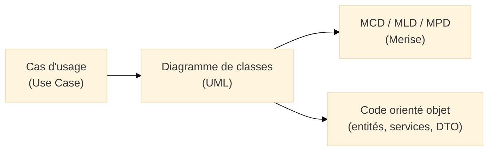
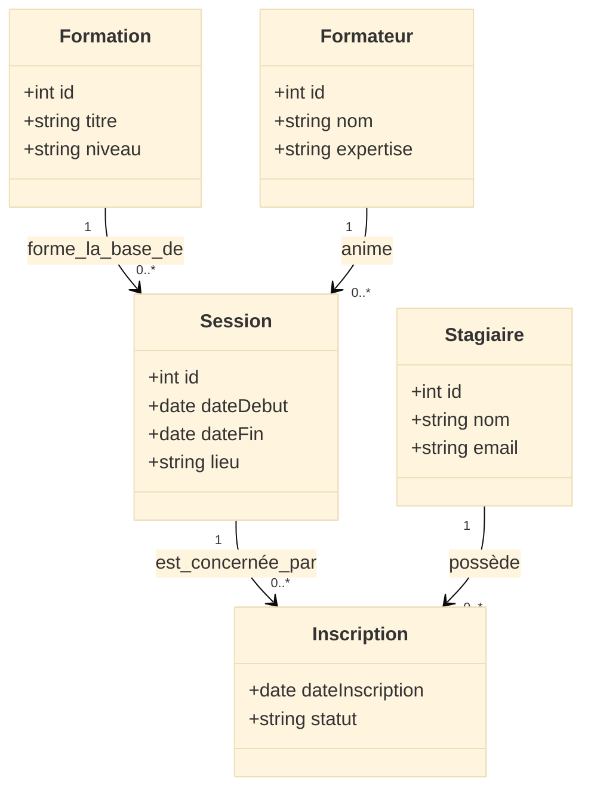
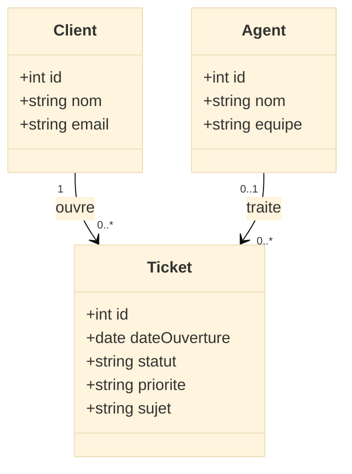

# Diagramme de classes (Class Diagram)

## Introduction au diagramme de classes

!!! quote "Analogie pédagogique"
    _Imaginez le **plan structurel d’un bâtiment** : on y voit les **pièces**, leurs **dimensions**, les **murs porteurs**, les **portes** et les **escaliers**. Ce plan ne montre pas encore les habitants ni leurs déplacements, mais il fige **la structure**. Le **diagramme de classes UML** joue exactement ce rôle pour un système logiciel : il montre **les briques structurantes** (classes), leurs **propriétés**, leurs **opérations** et la façon dont elles sont **reliées**._

Le **diagramme de classes UML** est le diagramme structurel central d’UML[^uml].  
Il décrit la **structure statique** du système : types d’objets, attributs, opérations, héritages, associations, agrégations, compositions.

Il répond à des questions comme :

- De quels **types d’objets** le système a-t-il besoin (Utilisateur, Ticket, Session, Formation…) ?  
- Quelles **données** portent-ils et quelles **opérations** proposent-ils ?  
- Comment ces objets sont-ils **liés** entre eux (1-1, 1-n, n-n) ?  
- Où se trouvent les **règles métier structurantes** (obligatoire, optionnel, cardinalités) ?

Là où le **diagramme de cas d’usage** décrit **qui fait quoi** avec le système, le diagramme de classes montre **qui est quoi** dans ce système.

---

## Pour repartir des bases

### 1. Ce qu’est (et n’est pas) un diagramme de classes

Un diagramme de classes UML représente :

- des **classes** (types d’objets) avec leurs attributs et opérations,  
- des **relations** entre ces classes (associations, héritages, dépendances),  
- des **multiplicités** (1, 0..1, 0..*, 1..*),  
- des **rôles** et **noms de relations**,  
- éventuellement des concepts plus avancés : **classes d’association**, **agrégation**, **composition**, **interfaces**.

Il ne représente pas :

- l’ordre temporel des appels (c’est le rôle des **diagrammes de séquence**),  
- les scénarios fonctionnels détaillés (c’est le domaine des **cas d’usage**),  
- la structure physique de la base (c’est déjà couvert par **Merise MPD / SQL**).

!!! note "Objectif du diagramme de classes"
    Le diagramme de classes répond à la question :  
    **“Quels sont les types d’objets du système, quelles données portent-ils, quelles opérations offrent-ils, et comment sont-ils reliés structurellement ?”**

### 2. Vocabulaire minimal

| Terme                   | Rôle                                                                                          |
|------------------------|-----------------------------------------------------------------------------------------------|
| **Classe**             | Modèle d’objet (ex. `Utilisateur`, `Ticket`, `Session`)                                      |
| **Attribut**           | Donnée portée par une classe (ex. `email`, `statut`, `dateCreation`)                         |
| **Opération / Méthode**| Comportement proposé par la classe (ex. `authentifier()`, `clore()`)                         |
| **Visibilité**         | Contrôle d’accès aux attributs/méthodes (`+` public, `-` privé, `#` protégé)[^visibilite]    |
| **Association**        | Lien structurel entre deux classes (ex. `Client` — possède → `Ticket`)[^association]         |
| **Multiplicité**       | Nombre d’instances liées : `0..1`, `1`, `0..*`, `1..*`[^multiplicite]                        |
| **Agrégation**         | Relation “partie / tout” faible : la partie peut exister sans le tout                        |
| **Composition**        | Relation “partie / tout” forte : la partie n’existe pas sans le tout                         |
| **Généralisation**     | Lien d’héritage (ex. `AgentSupport` hérite de `Utilisateur`)                                 |
| **Classe d’association** | Classe qui représente une association porteuse de données (ex. `Inscription` entre Stagiaire et Session) |

---

## Pour qui, et quand utiliser un diagramme de classes ?

-   :lucide-users:{ .lg .middle } **Pour qui ?**

    ---

    - Développeurs orientés objet (Java, C#, PHP, TypeScript, etc.)  
    - Architectes logiciels et concepteurs applicatifs  
    - Équipes DevSecOps qui doivent comprendre les **dépendances internes**  
    - Formateurs / enseignants en génie logiciel  
    - Consultants cyber qui analysent les **modèles de données applicatifs**  

-   :lucide-clock:{ .lg .middle } **Quand l’utiliser ?**

    ---

    - Après les **cas d’usage**, pour préciser la structure du domaine  
    - Lors d’une **refonte** pour comprendre un modèle existant  
    - Avant de concevoir une **API REST / GraphQL** ou un **modèle ORM**  
    - Lors de la documentation d’un **module critique** (paiement, identité, sécurité)  

-   :lucide-pencil-ruler:{ .lg .middle } **Comment l’utiliser concrètement ?**

    ---

    1. Partir des **cas d’usage** (Use Case) et du **modèle de données Merise**  
    2. Identifier les **classes du domaine** (Ticket, Formation, Session…)  
    3. Définir les **attributs** et **opérations importantes**  
    4. Poser les **relations** avec leurs **multiplicités**  
    5. Introduire l’héritage / agrégation / composition **uniquement si cela clarifie** le modèle  

-   :lucide-activity:{ .lg .middle } **Impact direct**

    ---

    - Base solide pour les **classes de votre code** (entités, services métier)  
    - Meilleure compréhension des **invariants métier** (ce qui doit toujours être vrai)  
    - Passage plus simple vers les **modèles de BDD** (Merise, ORM, SQL)  
    - Support utile pour les **revues d’architecture** et audits de sécurité  

---

## Lien avec Merise et avec le code

Le diagramme de classes se situe **entre** :

- les **cas d’usage UML** (ce que fait le système),  
- et vos **modèles Merise MCD/MLD/MPD** (ce que l’on stocke et comment).  

On peut résumer la vue “macro” ainsi :

Le diagramme de classes est :

* la **traduction orientée objet** de votre modèle métier,
* un **pont naturel** entre Merise (données persistées) et l’implémentation (code OO).

---

## Rappel sur les diagrammes UML (pour situer le diagramme de classes)

UML définit **14 types de diagrammes** regroupés en trois familles[^uml14] :

* **Structurels** : classes, objets, composants, déploiement, paquets, structure composite, profils
* **Comportementaux** : cas d’usage, activités, états
* **Interactions** : séquence, communication, vue d’ensemble d’interaction, temps

Le **diagramme de classes** est le **diagramme structurel principal** :
la plupart des autres diagrammes s’appuient sur lui.

---

## Ex. 1 – Plateforme de formation (aligné Merise)

Nous repartons de votre modèle Merise : `FORMATION`, `SESSION`, `FORMATEUR`, `STAGIAIRE`, `INSCRIPTION`.

### Scénario métier

* Un **Stagiaire** s’inscrit à une **Session** de **Formation**.
* Un **Formateur** anime plusieurs sessions.
* L’application doit connaître les **inscriptions**, les **dates**, les **lieux** et les **niveaux**.

### Diagramme de classes (vue simplifiée)

### Lecture du diagramme

* **`Formation`** et **`Session`** reprennent la structure de vos tables Merise :
  `Formation` correspond à la formation “abstraite”, `Session` à une occurrence datée.
* **`Inscription`** joue le rôle de **classe d’association** entre `Stagiaire` et `Session` :
  elle contient des données propres à la relation (date d’inscription, statut).
* Les multiplicités reprennent vos règles métier :
  une formation a **0..*** sessions, un stagiaire peut avoir **0..*** inscriptions, etc.

### Lien avec Merise

Correspondance typique :

| Merise (MLD/MPD)    | UML – Diagramme de classes         |
| ------------------- | ---------------------------------- |
| Table `FORMATION`   | Classe `Formation`                 |
| Table `SESSION`     | Classe `Session`                   |
| Table `FORMATEUR`   | Classe `Formateur`                 |
| Table `STAGIAIRE`   | Classe `Stagiaire`                 |
| Table `INSCRIPTION` | Classe d’association `Inscription` |

Le diagramme de classes fait donc le lien **code ↔ base** :

* côté **base**, vous avez déjà MCD / MLD / MPD / SQL ;
* côté **objet**, vous obtenez des entités ou modèles (ex. objets TypeScript, entités JPA, modèles Eloquent, etc.).

---

## Ex. 2 – Support client / tickets (aligné Merise)

Nous utilisons maintenant votre modèle `CLIENT`, `AGENT`, `TICKET`.

### Scénario métier

* Un **Client** ouvre un **Ticket**.
* Un **Agent support** prend en charge un ou plusieurs tickets.
* Un ticket possède un **statut**, une **priorité**, une **date d’ouverture**.

### Diagramme de classes

### Lecture du diagramme

* Chaque **Client** peut être lié à **0..*** tickets.
* Un **Agent** peut traiter plusieurs tickets, et un ticket peut être **non encore assigné** (`0..1` côté Agent si vous modélisez la possibilité “non affecté”).
* La structure du diagramme correspond à vos tables Merise :

| Merise (MPD) | UML – Classe |
| ------------ | ------------ |
| `CLIENT`     | `Client`     |
| `AGENT`      | `Agent`      |
| `TICKET`     | `Ticket`     |

Vous pouvez enrichir ce diagramme avec :

* une classe `CommentaireTicket`,
* une hiérarchie `Utilisateur` → `Client` / `Agent`,
* ou des états métier plus fins (via diagrammes d’état, dans un document dédié).

---

## Bonnes pratiques pour le diagramme de classes

Quelques règles simples pour garder des diagrammes exploitables :

* **Nommer les classes au singulier** (`Ticket`, `Session`, `Formation`),
  avec des noms métier compréhensibles par les non-développeurs.
* Limiter le nombre de classes par diagramme : si l’ensemble devient illisible,
  **découper par sous-domaine** (support, facturation, identité…).
* Ne pas tout exposer : ne montrer que les **attributs et opérations significatifs** pour la discussion.
* Utiliser les multiplicités pour **rendre visibles les règles métier** :
  différence importante entre `0..1`, `1`, `0..*` et `1..*`.
* Aligner le diagramme de classes avec :

  * vos **cas d’usage** (Use Case),
  * vos **modèles Merise**,
  * vos **entités de code** (ORM, DTO, agrégats DDD, etc.).

Le diagramme de classes n’est pas un “schéma décoratif” : c’est une **artefact central** de conception.

---

## Mot de la fin

!!! quote

    Le **diagramme de classes UML** est la colonne vertébrale de la modélisation orientée objet.  
    Il relie les besoins fonctionnels (cas d’usage) aux choix techniques (code, base, API).

    Bien construit, il permet de :

    * stabiliser le **domaine métier** avant d’écrire du code,  
    * révéler les **règles de structure** (cardinalités, parties/tout, héritages),  
    * servir de contrat durable entre développeurs, architectes et métiers.

    Mal utilisé, il dégénère en poster illisible, mis à jour une fois par an.

    > L’objectif n’est pas de tout modéliser,  
    > mais de modéliser **ce qui structure réellement le système**  
    > et qui doit rester compréhensible plusieurs années.

---

[^uml]: UML (Unified Modeling Language) est un langage de modélisation standardisé par l’OMG, destiné à représenter des systèmes logiciels de manière structurée, indépendamment des langages de programmation et des technologies concrètes.

[^visibilite]: En UML, la visibilité des membres est notée `+` (public), `-` (private), `#` (protected). Vous pouvez décider de ne pas l’afficher pour les diagrammes destinés aux métiers, et de la détailler uniquement dans les diagrammes techniques.

[^association]: Une association UML représente un lien structurel entre deux classes, généralement matérialisé par des références (champs, clés étrangères, relations ORM). Elle ne préjuge pas du sens exact de navigation dans le code, qui dépendra des choix d’implémentation.

[^multiplicite]: La multiplicité indique combien d’instances d’une classe peuvent être liées à une instance d’une autre classe. `0..*` signifie “zéro, un ou plusieurs”, `1..*` signifie “au moins un”, `0..1` signifie “facultatif”.

[^uml14]: La spécification UML 2.x distingue quatorze types de diagrammes, répartis en diagrammes structurels (classe, objet, composant, déploiement, structure composite, paquetage, profil), comportementaux (cas d’usage, activité, machine à états) et d’interaction (séquence, communication, vue d’ensemble d’interaction, timing).