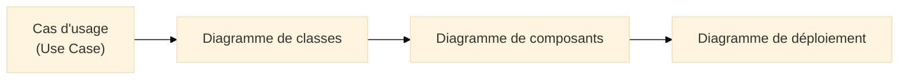
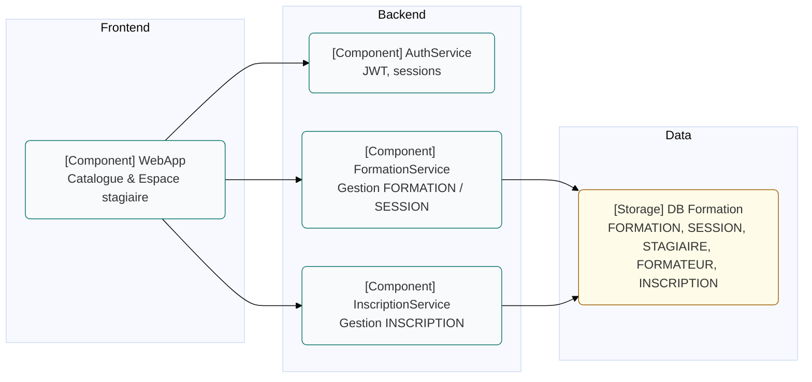
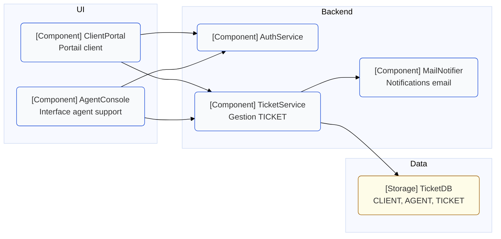

# Diagramme de composants (Component Diagram)

## Introduction au diagramme de composants

!!! quote "Analogie pédagogique"
    _Imaginez un **système Hi-Fi modulaire** : un ampli, un lecteur, des enceintes, des câbles qui relient les éléments. Chaque bloc a un rôle précis, expose des **connectiques standardisées** et peut parfois être remplacé par un autre modèle compatible. Le **diagramme de composants UML** représente exactement cela pour un système logiciel : des **blocs fonctionnels** (composants), leurs **interfaces** et leurs **dépendances**._

Le **diagramme de composants (Component Diagram)** est un diagramme structurel UML[^uml] qui décrit l’**architecture logique** d’un système :

- composants applicatifs, modules, services,  
- interfaces fournies et requises,  
- dépendances entre blocs,  
- parfois le mapping vers les artefacts déployables (binaires, packages, conteneurs).

Il répond à des questions comme :

- Quels sont les **blocs principaux** de l’application (front, API, services internes, adaptateurs) ?  
- Quels composants **dépendent** les uns des autres ?  
- Par où transitent les **flux fonctionnels critiques** (authentification, paiement, support) ?  
- Quelles interfaces sont **publiques** et lesquelles sont purement internes ?

Là où le **diagramme de classes** décrit la structure interne (types, attributs, relations), le diagramme de composants s’intéresse aux **gros blocs** et à leurs **interfaces**.

---

## Pour repartir des bases

### 1. Ce qu’est (et n’est pas) un diagramme de composants

Le diagramme de composants représente :

- des **composants** : blocs logiciels cohérents (ex. `ModuleFormation`, `ServiceTicket`, `AuthService`, `FrontendWeb`) ;  
- des **interfaces fournies** (ce que le composant offre) et **requises** (ce dont il a besoin)[^interfaces] ;  
- des **dépendances** entre composants (utilise, appelle, consomme) ;  
- parfois le lien avec des **artefacts** (JAR, packages, images Docker…).

Il ne représente pas :

- la séquence détaillée des appels (c’est le rôle des diagrammes d’interaction) ;  
- la structure interne des classes (c’est le diagramme de classes) ;  
- l’infrastructure physique (serveurs, VM, pods Kubernetes : c’est le diagramme de déploiement).

!!! note "Objectif du diagramme de composants"
    Le diagramme de composants répond à la question :  
    **“De quels blocs logiciels est composé le système, quelles interfaces exposent-ils, et comment dépendent-ils les uns des autres ?”**

### 2. Vocabulaire minimal

| Terme             | Rôle                                                                                   |
|-------------------|----------------------------------------------------------------------------------------|
| **Composant**     | Bloc logiciel déployable ou logique (service, module, microservice, bibliothèque…)    |
| **Interface fournie** | Contrat exposé par un composant (`IFormationAPI`, `ITicketService`)               |
| **Interface requise** | Contrat dont le composant a besoin (`IAuthService`, `IMailService`)              |
| **Dépendance**    | Relation “utilise / consomme” entre deux composants                                   |
| **Port**          | Point de connexion d’un composant vers une interface                                  |
| **Artefact**      | Fichier ou unité de déploiement (JAR, image Docker, package npm, binaire Go, etc.)    |

---

## Pour qui, et quand utiliser un diagramme de composants ?

-   :lucide-users:{ .lg .middle } **Pour qui ?**

    ---

    - Architectes logiciels et responsables techniques  
    - Équipes DevSecOps et SRE  
    - Développeurs backend / microservices  
    - Équipes d’intégration (API, ESB, bus d’événements)  
    - Consultants cyber qui doivent comprendre les **surfaces d’exposition**

-   :lucide-clock:{ .lg .middle } **Quand l’utiliser ?**

    ---

    - Lors de la définition ou refonte d’une **architecture applicative**  
    - Avant d’introduire des **microservices** ou un **API Gateway**  
    - Pour préparer des **audits de sécurité** ou des **analyses de risques**  
    - Pour documenter les **dépendances internes** d’un système critique  

-   :lucide-pencil-ruler:{ .lg .middle } **Comment l’utiliser concrètement ?**

    ---

    1. Identifier les **grands blocs fonctionnels** (front, back, services métier, adaptateurs externes)  
    2. Définir les **interfaces** exposées et consommées  
    3. Tracer les **dépendances** entre composants  
    4. Vérifier que la structure reflète bien les **responsabilités métier**  
    5. Valider l’architecture avec les équipes (techniques et parfois métier)

-   :lucide-activity:{ .lg .middle } **Impact direct**

    ---

    - Meilleure lisibilité de l’architecture  
    - Support pour la **revue de code** et la **revue de sécurité**  
    - Aide au découpage en **repositories**, **modules** ou **services**  
    - Base claire pour le **diagramme de déploiement**

---

## Lien avec les autres diagrammes

Le diagramme de composants se positionne clairement dans la pile :

* Les **cas d’usage** définissent les fonctionnalités attendues.
* Le **diagramme de classes** décrit les types et relations internes.
* Le **diagramme de composants** regroupe ces classes en **blocs applicatifs**.
* Le **diagramme de déploiement** indique **où** ces blocs tournent (serveurs, conteneurs…).

---

## Ex. 1 – Plateforme de formation (aligné Merise : FORMATION / SESSION)

On reprend le contexte déjà modélisé :

* Merise : `FORMATION`, `SESSION`, `STAGIAIRE`, `FORMATEUR`, `INSCRIPTION`.
* UML : cas d’usage “S’authentifier”, “Consulter le catalogue”, “S’inscrire”, etc.

Ici, l’objectif est de montrer comment ces fonctionnalités sont **portées par des composants**.

### Lecture

* `WebApp` est le composant frontal (Angular, React, autre) qui consomme :

  * `AuthService` pour l’authentification,
  * `FormationService` pour le catalogue,
  * `InscriptionService` pour les inscriptions.
* `FormationService` et `InscriptionService` accèdent à la **même base** qui contient les tables Merise : `FORMATION`, `SESSION`, `STAGIAIRE`, `FORMATEUR`, `INSCRIPTION`.

Ce diagramme permet de discuter :

* de la **séparation des responsabilités** (auth vs formation vs inscription),
* de la **surface d’attaque** (exposition de `AuthService`),
* du découpage en **microservices** éventuels dans le futur.

---

## Ex. 2 – Support client / tickets (aligné Merise : TICKET)

On reprend le domaine `CLIENT`, `AGENT`, `TICKET`.

### Contexte

* Un **Client** ouvre / consulte ses tickets via un portail.
* Un **Agent** traite les tickets via une interface dédiée.
* Un composant central `TicketService` gère la logique métier.

### Lecture

* `ClientPortal` et `AgentConsole` consomment **les mêmes services** (`AuthService`, `TicketService`) mais avec des rôles différents.
* `TicketService` gère toute la logique associée à la table `TICKET` du MPD Merise.
* `MailNotifier` est un composant spécialisé qui ne parle qu’avec `TicketService`.

Ce type de diagramme est très utile pour :

* discuter des **points de contrôle sécurité** (auth, notification, stockage),
* introduire des **API publiques** ou des **adaptateurs** (webhook, bus d’événements),
* raisonner sur les **dépendances fortes** à découpler.

---

## Bonnes pratiques pour le diagramme de composants

* Garder un **niveau de grain cohérent** : composants ni trop gros (monolithe), ni trop fins (explosion de détails).
* Nommer les composants selon leurs **responsabilités métier**, pas d’abord selon les technologies (`FormationService`, pas juste `Service1`).
* Limiter les dépendances cycliques : un composant A qui dépend de B, qui dépend de A, est un **signal d’architecture fragile**.
* Aligner les composants sur :

  * vos **cas d’usage** majeurs,
  * vos **contexts** fonctionnels (Domain-Driven Design[^ddd]),
  * vos **pipelines CI/CD** (build, test, déploiement).
* Vérifier que les frontières des composants correspondent à des **frontières de sécurité** plausibles
  (auth, chiffrement, logging, contrôle d’accès).

---

## Mot de la fin

!!! quote

    Le **diagramme de composants UML** est la carte d’architecture logique de votre système.  
    Il permet de visualiser comment les blocs logiciels s’articulent,  
    quelles interfaces ils exposent, et comment ils dépendent les uns des autres.

    Bien utilisé, il aide à :

    * clarifier le découpage en modules ou microservices,  
    * préparer les décisions d’architecture (scalabilité, résilience, sécurité),  
    * relier vos modèles Merise (données) et UML (comportement) à une vue **architecture** exploitable.

    > Un bon diagramme de composants tient sur une page,  
    > raconte une histoire claire,  
    > et reste compréhensible plusieurs années plus tard.

[^uml]: UML (Unified Modeling Language) est un langage de modélisation standardisé par l’OMG, couvrant les aspects structurels, comportementaux et d’interaction d’un système logiciel.

[^interfaces]: Dans UML, les interfaces fournies et requises permettent de modéliser explicitement les contrats entre composants : ce qu’un composant promet d’implémenter, et ce dont il dépend.

[^ddd]: Le **Domain-Driven Design (DDD)** recommande de découper le système selon des “bounded contexts” métier. Le diagramme de composants est un excellent support pour représenter ces contextes et leurs interactions.
