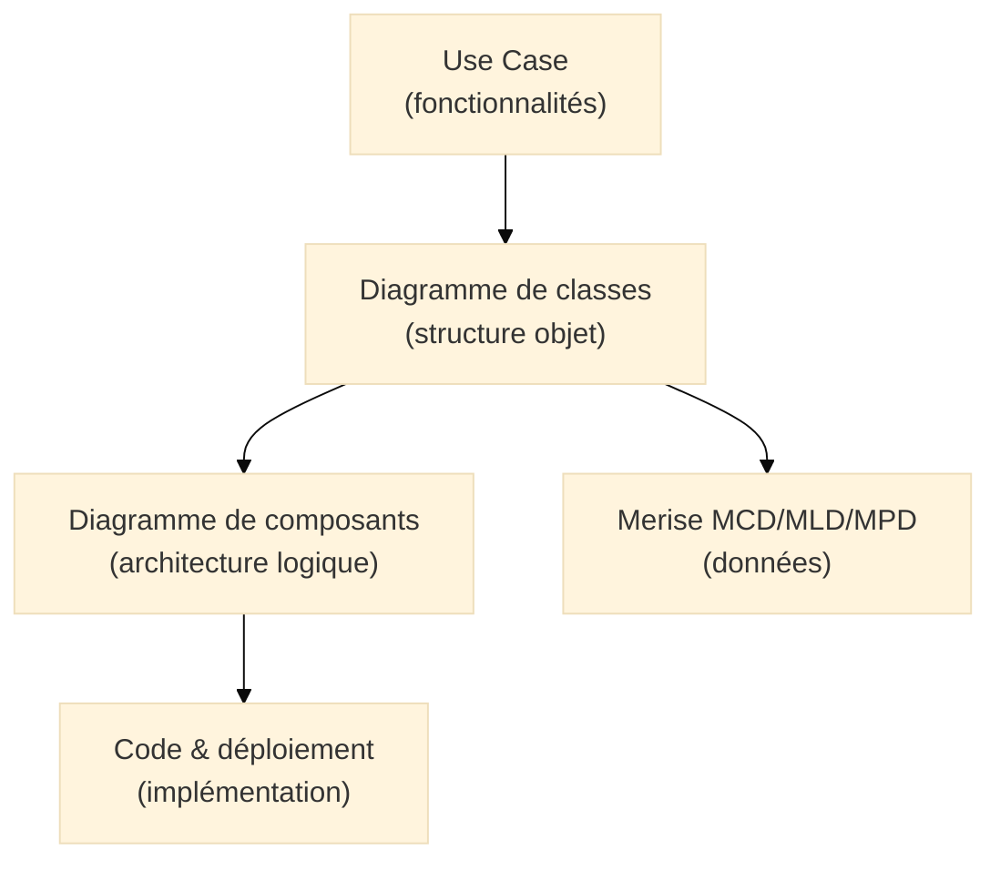
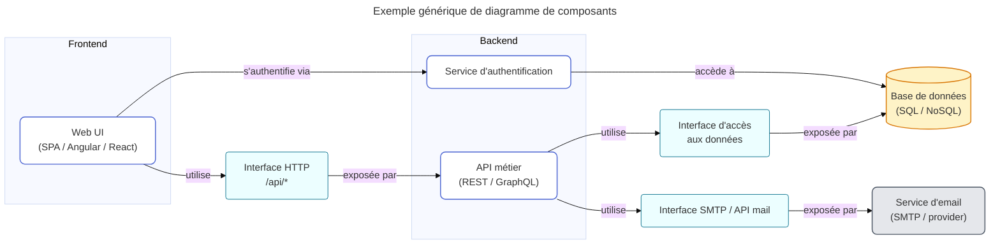
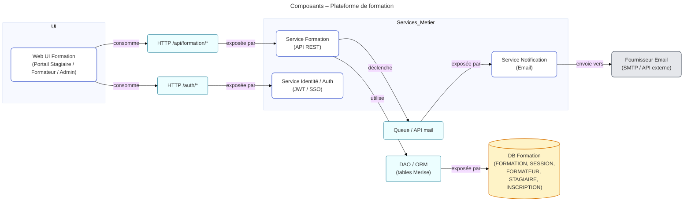
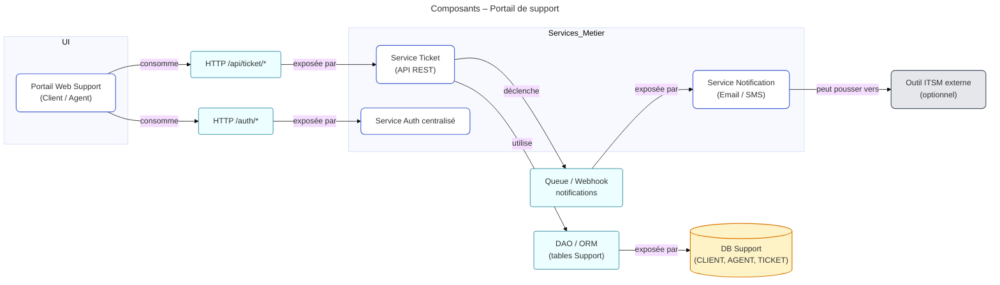

# Diagramme de composants (Component Diagram)

## Introduction au diagramme de composants

!!! quote "Analogie pédagogique"
*Imaginez un **réseau de gares** reliées par des **lignes ferroviaires**. Chaque gare rend un **service** (embarquer, débarquer, correspondances), mais vous ne voyez pas la mécanique interne des trains. Le **diagramme de composants UML** joue ce rôle : il montre **les gros blocs** du système (services, modules, applications) et **comment ils sont reliés**, sans entrer dans le détail des classes ou des tables.*

Le **diagramme de composants UML** décrit l’architecture **logique** d’un système :
il montre **quels modules** existent (applications, services, bibliothèques, microservices) et **comment ils collaborent** via des interfaces et des dépendances[^uml].

L’objectif n’est pas de dessiner l’infrastructure physique (machines, conteneurs, VLAN…) mais de représenter :

* les **composants fonctionnels ou techniques** (Front web, API, Service d’authentification, Service de notification…) ;
* les **interfaces fournies** (ce que le composant offre) et **requises** (ce dont il dépend) ;
* les **relations de dépendance** entre ces composants.

Là où le diagramme de classes décrit la **structure interne du code**,
le diagramme de composants décrit **comment les morceaux du système sont organisés et connectés**.

---

## Pour repartir des bases

### 1. Ce qu’est (et n’est pas) un diagramme de composants

Un diagramme de composants représente :

* des **composants** : morceaux cohérents du système (module `CatalogueFormation`, service `SupportTicketAPI`, bibliothèque `Paiement`)[^composant] ;
* des **interfaces** : points d’entrée ou de sortie (`REST`, `gRPC`, `Events`, `CLI`)[^interface] ;
* des **dépendances** : qui utilise quoi, dans quel sens ;
* éventuellement des **artefacts déployables** (paquet, binaire, conteneur).

Il **ne décrit pas** :

* les classes internes à un composant (diagramme de classes) ;
* les messages pas-à-pas (diagramme de séquence) ;
* la topologie physique (serveur, VM, cluster Kubernetes : diagramme de déploiement).

!!! note "Objectif du diagramme de composants"
Le diagramme de composants répond à la question :
**“Quels sont les blocs logiciels de mon système, quels services chacun fournit-il, et quelles dépendances existent entre eux ?”**

### 2. Vocabulaire minimal

| Terme                 | Rôle                                                                                           |
| --------------------- | ---------------------------------------------------------------------------------------------- |
| **Composant**         | Bloc logiciel autonome qui rend un service bien identifié (module, microservice, bibliothèque) |
| **Interface fournie** | Contrat que le composant offre aux autres (API, façade, port sortant)                          |
| **Interface requise** | Contrat dont le composant a besoin pour fonctionner (service externe, base, bus…)              |
| **Dépendance**        | Relation “utilise” : un composant dépend d’un autre pour réaliser son travail                  |
| **Port**              | Point de connexion précis d’un composant vers une interface ou un protocole                    |

---

## Pour qui, et quand utiliser un diagramme de composants ?

* :lucide-users:{ .lg .middle } **Pour qui ?**

    ---

    * Architectes logiciels
    * Tech leads / responsables techniques
    * Équipes DevSecOps / SRE
    * Consultants cyber / auditeurs SSI
    * Formateurs qui doivent illustrer une **architecture applicative moderne**

* :lucide-clock:{ .lg .middle } **Quand l’utiliser ?**

    ---

    * Lors de la **conception d’une nouvelle architecture** (monolithe structuré, SOA, microservices)
    * Lors d’une **refonte** pour clarifier les responsabilités des modules existants
    * Pour préparer des **diagrammes de déploiement** ou des **revues de sécurité**
    * Pour documenter l’architecture dans une démarche **ISO 27001 / urbanisation**

* :lucide-pencil-ruler:{ .lg .middle } **Comment l’utiliser concrètement ?**

    ---

    1. Identifier les **grands blocs** (front, back, services métier, services techniques)
    2. Définir les **interfaces exposées** (API publiques, événements, CLI)
    3. Cartographier les **dépendances entre blocs**
    4. Relier les composants à vos **modèles de données Merise** et à vos **use cases UML**

* :lucide-activity:{ .lg .middle } **Impact direct**

    ---

    * Vision claire de l’architecture, compréhensible en **1 slide**
    * Support aux décisions : découper un monolithe, isoler un module critique, externaliser un service
    * Base pour les **risques SSI** (points d’exposition, dépendances critiques, flux sensibles)

---

## Lien avec les autres modèles (Merise, UML, code)

Le diagramme de composants se place naturellement au-dessus :

* Les **use cases** indiquent *ce que le système doit faire*.
* Les **classes** détaillent *avec quels types et quelles règles métier*.
* Le **diagramme de composants** montre *quels modules portent ces classes et services*.
* Merise fixe *comment les données sont persistées*.
* Le **code** concrétise tout cela dans un langage et un environnement donnés.

---

## Représenter un système simple en composants

Pour des raisons de compatibilité Mermaid, on utilise ici une représentation en **flowchart** qui reste fidèle à la logique UML (composants + interfaces), tout en restant lisible dans votre stack.

Ce schéma montre :

* un **front** qui consomme une interface HTTP exposée par l’API,
* une **API** qui dépend d’une base de données et d’un service d’email,
* un **service d’authentification** qui s’appuie lui aussi sur la base.

Vous retrouverez la même logique dans les exemples réutilisant vos modèles Merise.

---

## Ex. 1 – Plateforme de formation (aligné Merise)

Nous repartons du modèle Merise : `FORMATION`, `SESSION`, `FORMATEUR`, `STAGIAIRE`, `INSCRIPTION`
et du diagramme de cas d’usage correspondant (Inscription, Gestion de formations, Sessions…).

### Scénario architecturel

* Une **UI Web Formation** permet au Stagiaire, au Formateur et à l’Administrateur d’interagir avec la plateforme.
* Une **API Formation** expose les fonctionnalités métier (gestion des formations, sessions, inscriptions).
* Un **Service Identité / Auth** centralise l’authentification.
* Une **Base de données Formation** stocke `FORMATION`, `SESSION`, `FORMATEUR`, `STAGIAIRE`, `INSCRIPTION`.
* Un **Service Notification** envoie des mails de confirmation d’inscription.

### Diagramme de composants

### Lien avec Merise

* Le composant **`DB Formation`** implémente directement votre **MPD / SQL** :
  `FORMATION`, `SESSION`, `FORMATEUR`, `STAGIAIRE`, `INSCRIPTION`.
* Le composant **`Service Formation`** expose des opérations cohérentes avec vos **Use Case** :
  “Consulter le catalogue”, “S’inscrire”, “Annuler une inscription”, “Gérer les sessions”.
* Le diagramme de classes correspondant regroupe les entités `Formation`, `Session`, `Stagiaire`, `Formateur`, `Inscription` dans ce même composant.

Vous obtenez ainsi une continuité claire :

> Merise (données) ←→ Classes (modèle objet) ←→ Composants (modules / services) ←→ Déploiement.

---

## Ex. 2 – Support client / tickets (aligné Merise)

Cette fois, nous utilisons le modèle : `CLIENT`, `AGENT`, `TICKET`.

### Scénario architecturel

* Un **Portail Support Web** permet au Client de créer et suivre ses tickets.
* Une **API Ticket** gère l’ensemble du cycle de vie des tickets.
* Un **Service Auth** est partagé avec d’autres applications du SI.
* Une **Base de données Support** stocke `CLIENT`, `AGENT`, `TICKET`.
* Un **Service Notification** ou un **outil ITSM externe** peut être branché pour les notifications ou l’escalade.

### Diagramme de composants

### Lien avec Merise

* Le composant **`DB Support`** correspond directement à vos tables `CLIENT`, `AGENT`, `TICKET`.
* Le composant **`Service Ticket`** implémente les cas d’usage : “Ouvrir un ticket”, “Mettre à jour un ticket”, “Clôturer un ticket”.
* Le diagramme de classes associé expose les entités `Client`, `Agent`, `Ticket`, raccordées à ce même composant.

Ce diagramme rend visibles :

* les **dépendances critiques** (par exemple, `Service Ticket` dépend fortement de `DB Support` et de `Service Auth`) ;
* les **points d’exposition** (interfaces HTTP, files de messages, webhooks) très utiles pour la cybersécurité.

---

## Bonnes pratiques pour le diagramme de composants

Quelques principes simples permettent de garder des diagrammes lisibles et utiles :

* Un **composant = une responsabilité claire** (“Gérer les formations”, “Gérer les tickets”, “Auth centralisée”).
* Un diagramme doit tenir sur **un écran** : au-delà, mieux vaut **découper par domaine** (formation, facturation, identité…).
* Les noms d’interfaces doivent évoquer le **contrat réel** : `HTTP /api/formation`, `Events TicketCreated`, `Queue mail-out`.
* Les composants de **stockage** (bases, files, caches) doivent être explicitement représentés :
  ils concentrent souvent les **données sensibles** (RGPD, données de santé, finance…).
* Le diagramme de composants doit rester synchronisé avec :

  * le **diagramme de déploiement** (qui montre sur quelles machines / conteneurs ces composants tournent),
  * les **modèles Merise** (données qu’ils manipulent),
  * les **use cases** (fonctionnalités qu’ils rendent possibles).

---

## Mot de la fin

!!! quote

    Le **diagramme de composants UML** n’est pas réservé aux grands comptes ni aux slides marketing.  
    C’est un outil concret pour **voir d’un coup d’œil l’architecture** d’un système :  
    qui parle à qui, par quel canal, et autour de quelles données.

    Bien utilisé, il permet de :

    * découper proprement un système en **modules cohérents**,  
    * identifier les **points névralgiques** (auth, données, notifications),  
    * préparer les décisions d’architecture (monolithe, microservices, externalisation),  
    * alimenter les **analyses de risques** et les **dossiers de sécurité**.

    > Le réflexe à garder :  
    > à chaque module métier important (formation, support, facturation…), demandez-vous : **“Quel composant le porte ? Quelles interfaces expose-t-il ? Quelles données Merise utilise-t-il ?”**

---

[^uml]: UML (Unified Modeling Language) est un langage de modélisation standardisé par l’OMG, permettant de décrire des systèmes logiciels à différents niveaux (fonctionnel, structurel, interaction).

[^composant]: En UML, un **composant** est une unité modulaire remplaçable, encapsulant son contenu et exposant un ensemble d’interfaces. Dans la pratique, il peut correspondre à un module, un service, une application ou une bibliothèque.

[^interface]: Une **interface** UML définit un contrat : un ensemble d’opérations offertes ou requises par un composant. Dans les architectures modernes, cela se traduit souvent par des APIs REST, gRPC, des événements ou des files de messages.
