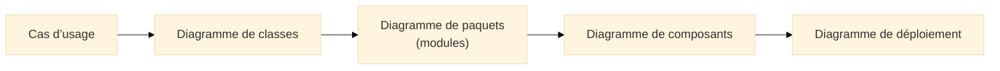
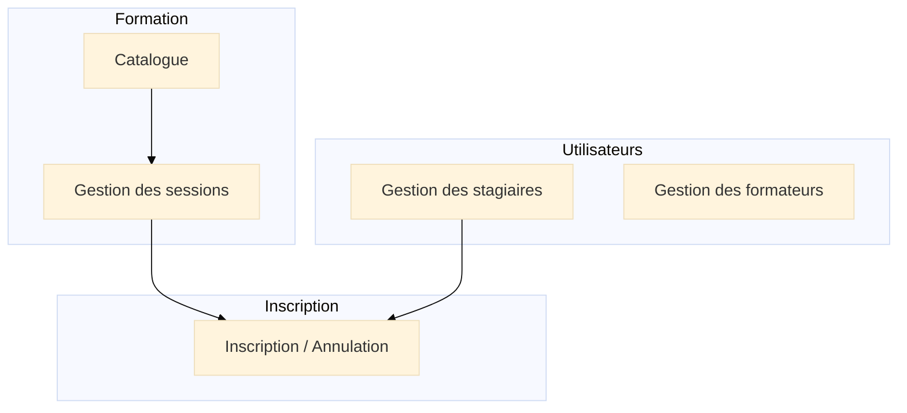
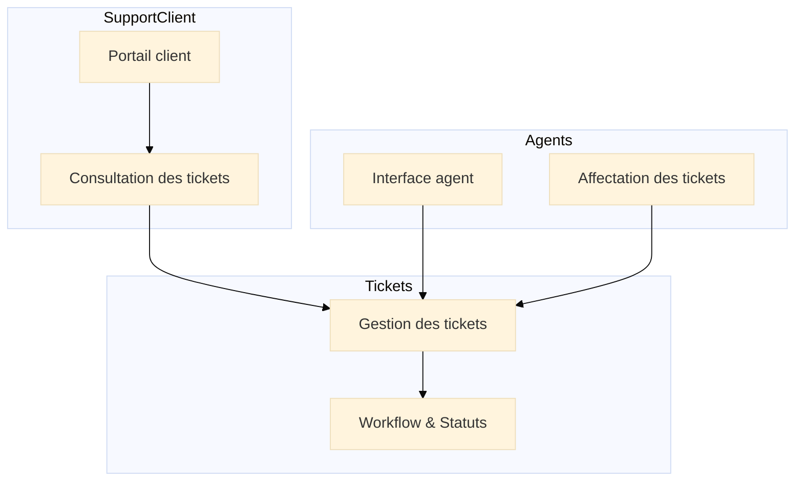

# Diagramme de paquets (Package Diagram)

## Introduction au diagramme de paquets

!!! quote "Analogie pédagogique"
*Imaginez une bibliothèque comprenant des milliers de livres. Si tous étaient posés en vrac sur une immense table, impossible de retrouver quoi que ce soit. Les **diagrammes de paquets UML** sont les **rayonnages** de cette bibliothèque : ils regroupent les éléments dans des modules cohérents, structurent l’accès et clarifient l’organisation.*

Le **diagramme de paquets** UML sert à représenter l’**organisation logique** du système[^package].
C’est un outil essentiel pour :

* prendre du recul sur l’architecture,
* diviser en **modules cohérents**,
* réduire les dépendances circulaires,
* clarifier la structure du code (ou de la documentation),
* préparer les diagrammes de composants et de déploiement.

Il répond à une question simple :

> **Comment organiser proprement un système complexe en modules lisibles et cohérents ?**

---

## Pour repartir des bases

### 1. Ce qu’est (et n’est pas) un diagramme de paquets

Ce diagramme représente :

* des **paquets** (modules),
* des **relations** entre paquets (import, dépendance, exposition),
* des **sous-paquets** (hiérarchie),
* le **regroupement logique** de plusieurs classes/composants.

Il **ne représente pas** :

* les classes internes (c’est pour le diagramme de classes),
* la logique de traitement (diagrammes d’activité/état),
* la structure physique de déploiement (diagramme de déploiement).

!!! note "Objectif"
**“Regrouper, clarifier, structurer.”**
Le diagramme de paquets donne une vue macro qui explique comment le système est divisé en sous-domaines.

### 2. Vocabulaire minimal

| Terme       | Rôle                                                               |
| ----------- | ------------------------------------------------------------------ |
| **Paquet**  | Conteneur logique (module, domaine, couche, bibliothèque)[^module] |
| **Import**  | Relation montrant qu’un paquet dépend d’un autre                   |
| **Couche**  | Structure en niveaux (presentation → business → infrastructure)    |
| **Nesting** | Imbrication de paquets (ex. `Formation.Catalogue`)                 |

---

## Pour qui, et quand utiliser ce diagramme ?

* :lucide-users:{ .lg .middle } **Pour qui ?**

    ---

    * Architectes logiciels
    * Développeurs fullstack / backend
    * Équipes DevSecOps (readability, réduction des risques d’interdépendance)
    * Formateurs / étudiants en conception logicielle
    * Auditeurs techniques

* :lucide-clock:{ .lg .middle } **Quand l’utiliser ?**

    ---

    * Avant un gros refactoring
    * Lors de la mise en place d’une architecture en couches / DDD
    * Lors d’une migration monolithe → microservices
    * Pour clarifier un projet devenu trop touffu
    * Lorsqu’il faut documenter “la structure du système” en quelques minutes

---

## Lien avec les autres diagrammes UML et Merise

Le diagramme de paquets est le **pont organisationnel** entre :

* la **modélisation métier** (Use Case + Classes),
* l’**architecture logicielle** (Composants, Déploiement).

Il aide à organiser :

* vos dossiers,
* vos namespaces,
* vos services,
* vos agrégats métier (DDM / DDD).

---

# Ex. 1 – Plateforme de formation (aligné Merise & UML)

Organisation logique basée sur vos classes : `Formation`, `Session`, `Stagiaire`, `Formateur`, `Inscription`.

### Lecture du diagramme

* **Formation** contient deux sous-paquets : catalogue global et gestion opérationnelle.
* **Utilisateurs** regroupe stagiaires et formateurs.
* **Inscription** dépend à la fois du catalogue (sessions disponibles) et des utilisateurs.

Cette structure correspond directement :

* aux classes UML,
* aux cas d’usage,
* au MPD Merise.

---

# Ex. 2 – Support client / tickets

Aligné avec votre modèle : `CLIENT`, `AGENT`, `TICKET`.

### Lecture

* Les tickets sont au centre : le module “Gestion” sert de pivot.
* Le portail client dépend des tickets.
* Les agents dépendent aussi du module central.

Toujours une vision **macro-structurelle**, pas de classes ici.

---

## Bonnes pratiques pour les diagrammes de paquets

* Garder une **structure claire et stable** : modules → sous-modules.

* Supprimer les dépendances circulaires (odeur d’architecture).

* Limiter le nombre de paquets par diagramme.

* Faire correspondre les paquets à :

  * namespaces,
  * dossiers physiques,
  * modules métiers,
  * microservices potentiels.

* Utiliser les paquets comme **point d’entrée de la documentation technique**.

---

## Mot de la fin

!!! quote

    Le **diagramme de paquets** permet de comprendre en un coup d’œil  
    **l’organisation logique** d’un système logiciel.  
    Il structure, clarifie et prépare les décisions d’architecture.

    Bien utilisé, il devient une boussole pour les développeurs, les architectes et les équipes opérationnelles, en montrant **comment le système est découpé en modules cohérents**, avant même de discuter déploiement ou code.

[^package]: Un **paquet UML** est un conteneur logique qui regroupe des éléments (classes, composants, sous-paquets).

[^module]: Correspond en pratique à un dossier, un namespace, un module métier ou une bibliothèque partagée.

