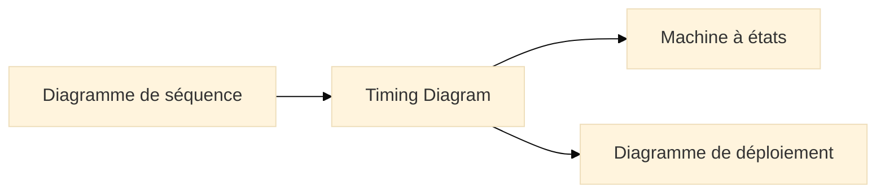
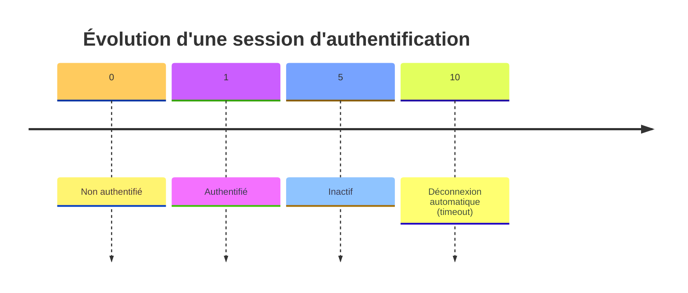
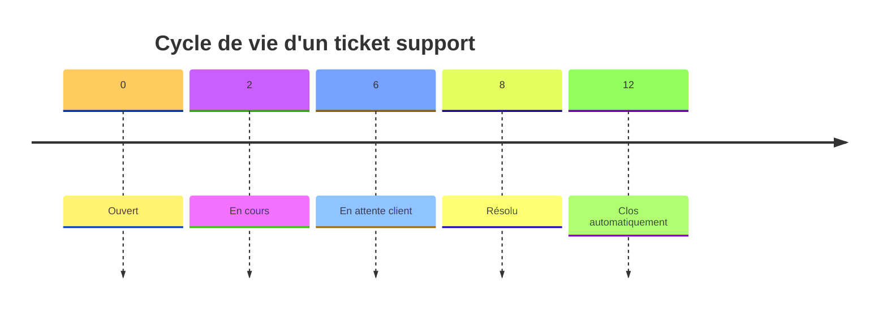

# Diagramme de temps (Timing Diagram)

## Introduction au diagramme de temps

!!! quote "Analogie pédagogique"
*Imaginez une **partition musicale** où chaque instrument suit sa propre ligne temporelle, monte ou baisse d’intensité, s’arrête ou reprend. Le **Timing Diagram UML** fait la même chose pour les objets d’un système : il montre comment **leurs états évoluent au fil du temps** et comment ces évolutions sont **synchronisées**.*

Le **diagramme de temps** (Timing Diagram) est un diagramme d’interaction UML[^uml] qui décrit :

* l’évolution d’un **état** dans le temps,
* la synchronisation entre plusieurs objets,
* les **délais**, **durées**, **contraintes temporelles**,
* l’alignement temporel des transitions d’état.

C’est un outil très utilisé dans :

* les systèmes temps réel,
* l’embarqué,
* les protocoles réseau,
* la modélisation d’identité (session, authentification),
* les workflows métier sensibles au temps.

---

## Pour repartir des bases

### 1. Ce que représente un diagramme de temps

Un Timing Diagram montre :

* un **axe du temps horizontal**,
* un ou plusieurs **lifelines** (lignes de vie),
* pour chaque lifeline :

  * des **états successifs**,
  * les **instants** où les transitions se produisent,
  * les **périodes** où un état reste stable.

On peut y associer :

* des contraintes temporelles (`t < 5s`, `durée = 3min`),
* des jalons (événements clés),
* des synchronisations entre plusieurs objets.

### 2. Ce qu’il ne représente pas

* Pas d’enchaînement logique complexe (c’est pour les diagrammes d’activité / séquence),
* Pas de structure interne des objets,
* Pas de règles métier détaillées.

Le diagramme de temps répond à :

> **Comment les objets évoluent-ils au fil du temps, et avec quelles contraintes temporelles ?**

---

## Pour qui, et quand utiliser un Timing Diagram ?

* :lucide-users:{ .lg .middle } **Pour qui ?**

    ---

    * Architectes embarqués / IoT
    * Développeurs systèmes / protocoles
    * Spécialistes cybersécurité (timeouts, sessions, réémissions)
    * Équipes métier où le **temps** est un facteur critique (paiement, authentification, SLA)

* :lucide-clock:{ .lg .middle } **Quand l’utiliser ?**

    ---

    * Pour documenter la durée d’une session (authentification)
    * Pour exprimer un délai maximal (timeout, retry)
    * Pour analyser un workflow soumis à un SLA
    * Pour synchroniser les échanges entre plusieurs modules

---

## Lien avec les autres diagrammes

Le **Timing Diagram** est la version “mesurée dans le temps” du diagramme de séquence.
Il complète naturellement la machine à états en y ajoutant une **dimension temporelle**.

---

# Ex. 1 – Session d’authentification (aligné cybersécurité)

Ce diagramme illustre la durée d’une session utilisateur :

### Lecture

* À `t=1`, l’utilisateur s’authentifie.
* Entre `t=1` et `t=5`, il est actif.
* De `t=5` à `t=10`, il est inactif.
* À `t=10`, le système applique un **timeout**.

Ce type de diagramme est parfait pour préciser :

* les stratégies de session,
* les règles de sécurité,
* la gestion des timeouts.

---

# Ex. 2 – Traitement d’un ticket support (aligné Merise `TICKET`)

On modélise ici les transitions temporelles d’un ticket :

### Lecture

* Le client ouvre un ticket à `t=0`.
* L’agent le prend en charge à `t=2`.
* En attente d’une réponse client entre `t=6` et `t=8`.
* Résolution à `t=8`.
* Clôture automatisée à `t=12` si le client n'intervient pas.

Ici, le Timing Diagram met en lumière des contraintes :

* délai maximal avant prise en charge,
* délai maximal avant réponse client,
* SLA global.

Dans un contexte cyber, ce type de diagramme documente très bien le **cycle de gestion des incidents**.

---

## Bonnes pratiques pour un Timing Diagram

* Utiliser un **axe du temps clair**, avec des jalons significatifs.
* Limiter chaque diagramme à **1–3 lignes de vie** pour la lisibilité.
* Ne représenter que les **états importants**.
* Éviter les détails superflus déjà présents dans :

  * le diagramme d’états,
  * la documentation fonctionnelle,
  * le diagramme de séquence.
* Associer le diagramme à une **explication métier du temps** :

  * délai maximal,
  * SLA,
  * timeout sécurité,
  * délai contractuel.

---

## Mot de la fin

!!! quote

    Le **Timing Diagram** est l’un des diagrammes UML les plus sous-estimés.  
    Il apporte pourtant une dimension essentielle : **la maîtrise du temps**,  
    indispensable en cybersécurité, en embarqué, en supervision, ou lorsqu’un processus métier dépend d’un SLA.

    Là où les autres diagrammes montrent **ce qu’il se passe**,  
    le diagramme de temps montre **quand cela se produit** et **pendant combien de temps**.

    C’est un outil puissant pour révéler :  

    - des délais excessifs,  
    - des zones d’ombre dans un workflow,  
    - des risques liés au timeout ou au manque d’actions utilisateur.
