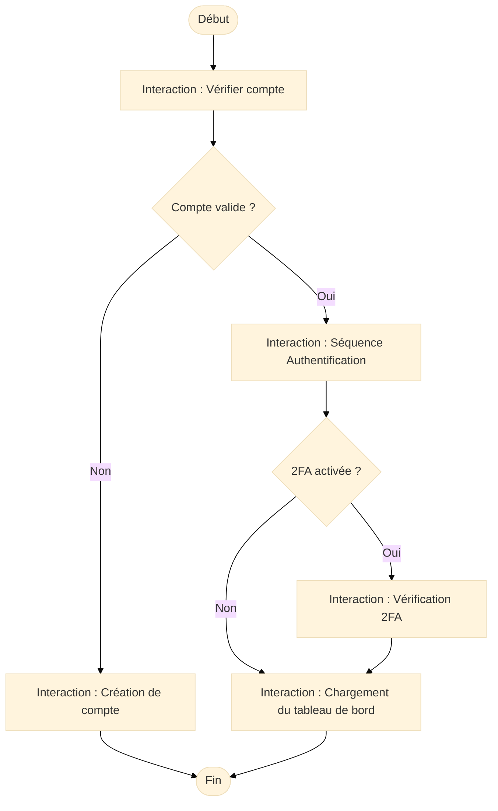
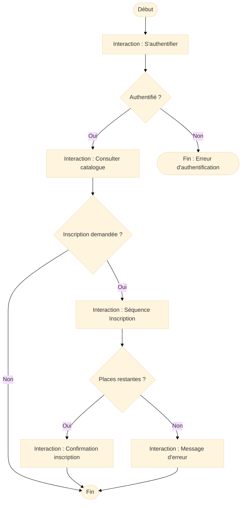

# Overview

<div
  class="omny-meta"
  data-level="🔴 Avancé"
  data-version="1.0"
  data-time="25-40 minutes">
</div>

## Introduction à la Vue d'ensemble (Overview)

!!! quote "Analogie pédagogique"
    _Imaginez le **plan d’un film** : une grande carte narrative qui montre l’enchaînement des scènes, les ramifications possibles et les transitions. Le **diagramme d’ensemble d’interaction** joue exactement ce rôle pour vos interactions UML : il orchestre plusieurs **diagrammes de séquence**, **diagrammes d’activité** et **interactions combinées** pour visualiser un processus complet._

Le **diagramme d’ensemble d’interaction (Interaction Overview Diagram)** est un diagramme UML avancé permettant de **coordonner plusieurs interactions** en un flux global.  
Il combine :

- des **noeuds d’activité**  
- des **références à des diagrammes de séquence**  
- des **décisions**, **forks**, **joins**, **boucles**  
- des **interactions conditionnelles**

Son rôle : offrir une **vue macro** des interactions, souvent trop complexes pour être représentées dans un seul diagramme de séquence.

C’est le diagramme le plus proche d’un **workflow technique**, mais orienté interactions entre objets / acteurs.

---

## Pour repartir des bases

### 1. Ce qu’est un diagramme d’ensemble d’interaction

Il représente :

- un **scénario global**, découpé en interactions,
- une orchestration entre plusieurs **diagrammes de séquence**,
- des **branches**, **alternatives**, **parallélismes**,
- des **conditions** ou **boucles** liées au comportement global.

Il est idéal pour illustrer :

- un processus d’authentification multi-étapes,
- un workflow de paiement sécurisé,
- une interaction complète d’inscription à formation,
- un traitement de ticket incluant plusieurs acteurs,
- un pipeline microservices avec appels distribués.

### 2. Ce que le diagramme n’est pas

Il ne représente pas :

- les classes (c’est le rôle du diagramme de classes),
- les règles métier détaillées (diagramme d’activité),
- l’ordre exact des messages (diagramme de séquence).

Il est là pour montrer **l’enchaînement entre des interactions**, pas leur contenu.

---

## Pour qui, et quand utiliser ce diagramme ?

<div class="grid cards" markdown>

-   :lucide-users:{ .lg .middle } **Pour qui ?**

    ---

    - Architectes logiciels  
    - Développeurs backend / API complexes  
    - Équipes DevSecOps  
    - Consultants cyber (analyse de flux, menaces, surfaces d’attaque)  
    - Analystes métier pour les processus critiques

-   :lucide-clock:{ .lg .middle } **Quand l’utiliser ?**

    ---

    - Quand un **diagramme de séquence devient trop gros**  
    - Pour représenter plusieurs scénarios imbriqués  
    - Pour expliquer l’orchestration d’un **processus critique**  
    - Pour lier **séquence**, **activité** et **interactions alternatives**  

</div>

<div class="grid cards" markdown>

-   :lucide-pencil-ruler:{ .lg .middle } **Comment l’utiliser concrètement ?**

    ---

    1. Définir le **scénario global**  
    2. Identifier les **interactions clés** (séquences, alternatives, conditions)  
    3. Représenter les nœuds comme dans un **diagramme d’activité**  
    4. Insérer des références vers d’autres diagrammes  
    5. Ajouter les conditions, branches, joins, boucles  

-   :lucide-activity:{ .lg .middle } **Impact direct**

    ---

    - Vision globale d’un processus complexe  
    - Lisibilité améliorée  
    - Idéal pour la documentation professionnelle  
    - Support pour les analyses de flux sensibles  

</div>

---

## Visualisation Mermaid (compatible Zensical)

Mermaid ne supportant pas officiellement ce diagramme UML, la représentation se fait à l’aide d’un **flowchart enrichi**, comme conseillé dans les pratiques communautaires.



Ce schéma montre un flux riche : conditions, références à des interactions, bifurcations, regroupements.

---

# Ex. 1 – Plateforme de formation (aligné Merise et UML)

### Scénario

Vous souhaitez représenter l’enchaînement complet :

1. Authentification
2. Consultation du catalogue
3. Inscription à une session
4. Confirmation / erreurs / boucles

### Diagramme (flowchart simulant un Interaction Overview)



### Lecture

* Chaque **bloc** représente une interaction (souvent un diagramme de séquence détaillé dans votre doc).
* Les **conditions** organisent le flux.
* Le modèle Merise (`FORMATION`, `SESSION`, `INSCRIPTION`) apparaît indirectement via les interactions utilisées.

---

# Ex. 2 – Support client / tickets (aligné Merise et UML)

### Scénario

1. Le client s’authentifie
2. Il ouvre un ticket
3. Un agent le prend en charge
4. Le statut évolue dans le temps
5. Le ticket se clôture

### Diagramme

```mermaid
---
config:
  theme: "base"
---
flowchart TD
    Start([Début]) --> A[Interaction : Authentification]
    A --> B{Authentifié ?}

    B -- Non --> X([Fin : Accès refusé])
    B -- Oui --> C[Interaction : Ouvrir ticket]

    C --> D[Interaction : Agent prend en charge]
    D --> E{Résolution possible ?}

    E -- Oui --> F[Interaction : Clôturer ticket]
    E -- Non --> G[Interaction : Mise à jour statut]

    G --> D  %% boucle : statut -> agent -> statut
    F --> End([Fin])
```

### Lecture

Ce diagramme :

* illustre l’orchestration complète d’un flux support,
* visualise les boucles métier (mise à jour du statut),
* fait le lien avec vos tables Merise (`CLIENT`, `AGENT`, `TICKET`),
* permet d’identifier les points critiques (ex: escalade de ticket).

---

## Bonnes pratiques pour ce diagramme

* L’utiliser uniquement pour les **processus complexes**.
* Toujours pointer vers des **diagrammes de séquence détaillés**.
* Ne jamais surcharger : c’est un diagramme “carte mentale”.
* S’assurer que chaque interaction renvoie à une **fonction métier claire**.
* Utiliser les forks / joins uniquement pour les flux réellement parallèles.

---

## Mot de la fin

!!! quote

    Le **diagramme d’ensemble d’interaction** est l’outil idéal pour visualiser
    un processus complexe mêlant plusieurs interactions.
    C’est le “chef d’orchestre” des séquences UML.

    Il permet de :
    - regrouper plusieurs scénarios en un seul flux cohérent,  
    - clarifier l’ordre des interactions importantes,  
    - préparer la documentation d’architecture ou d’audit,  
    - offrir une vision synthétique aux équipes et aux métiers.

    Utilisé avec les cas d’usage, diagrammes de classes et séquences,
    il complète parfaitement votre documentation OmnyDocs.

<br />