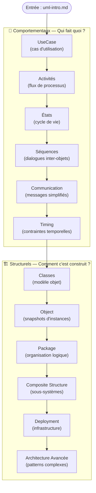

# UML — Modélisation Objet

!!! quote "Analogie"
    _Concevoir un logiciel sans modélisation, c'est bâtir un immeuble sans plan d'architecte. Chaque corps de métier (maçon, électricien, plombier) travaille de son côté, dans sa propre langue. L'UML est ce plan universel : un langage graphique standardisé que le développeur backend, le front, le DBA et le chef de projet lisent tous de la même façon, sans ambiguïté._

## Objectif

L'UML (*Unified Modeling Language*) est le standard international de modélisation logicielle, publié par l'OMG. Il propose **14 types de diagrammes** couvrant deux grandes familles : la structure statique du système et la dynamique de ses comportements.

Cette section couvre les **12 diagrammes fondamentaux**, organisés du plus accessible au plus spécialisé. L'introduction `uml-intro.md` pose les bases théoriques avant d'entrer dans les diagrammes eux-mêmes.

!!! note "Prérequis"
    Une connaissance de base de la programmation orientée objet (classes, héritage, interfaces) est recommandée avant d'aborder les diagrammes structurels. Les diagrammes comportementaux (UseCase, Activités) sont accessibles sans prérequis OOP.

 

---

## Progression recommandée

 

---

## Les 12 diagrammes

### 🔄 Diagrammes Comportementaux

- #### UseCase — Cas d'utilisation
    ---
    Le point d'entrée de toute spécification. Représente les interactions entre acteurs (utilisateurs, systèmes externes) et le système à concevoir. Outil de dialogue idéal entre client et développeur.

    [Ouvrir UseCase](./diagrammes/usecase.md)

- #### Activités — Flux de processus
    ---
    Modélise les flux de travail, les algorithmes et les processus métier. Équivalent UML du logigramme — indispensable pour documenter les règles métier complexes.

    [Ouvrir Activités](./diagrammes/activity.md)

- #### États — Cycle de vie
    ---
    Décrit tous les états possibles d'un objet et les transitions déclenchées par des événements. Essentiel pour modéliser les automates (commandes, sessions, workflows).

    [Ouvrir États](./diagrammes/state.md)

- #### Séquences — Dialogues inter-objets
    ---
    Représente les échanges de messages entre objets dans un ordre chronologique précis. Le diagramme de référence pour documenter les appels API et les protocoles.

    [Ouvrir Séquences](./diagrammes/sequence.md)

- #### Communication — Messages simplifiés
    ---
    Variante condensée du diagramme de séquences, centré sur les liens entre objets plutôt que sur l'ordre temporel. Utile pour une vue d'ensemble des collaborations.

    [Ouvrir Communication](./diagrammes/communication.md)

- #### Timing — Contraintes temporelles
    ---
    Spécialisation du diagramme de séquences pour les systèmes temps-réel. Visualise l'évolution des états en fonction d'une ligne de temps précise.

    [Ouvrir Timing](./diagrammes/timing.md)

 

---

### 🏗️ Diagrammes Structurels

- #### Classes — Modèle objet
    ---
    Le diagramme le plus utilisé en développement. Représente la structure statique du système : classes, attributs, méthodes, et leurs relations (héritage, composition, association).

    [Ouvrir Classes](./diagrammes/classes.md)

- #### Object — Snapshots d'instances
    ---
    Photographie instantanée du système à un moment précis. Illustre des instances concrètes de classes avec leurs valeurs réelles — parfait pour valider un modèle de classes.

    [Ouvrir Object](./diagrammes/object.md)

- #### Package — Organisation logique
    ---
    Représente l'organisation des éléments UML en groupes logiques (namespaces). Indispensable pour documenter l'architecture modulaire d'une application Laravel ou Swift.

    [Ouvrir Package](./diagrammes/package.md)

- #### Composite Structure — Sous-systèmes
    ---
    Modélise la structure interne d'un composant et ses ports de communication. Utilisé pour les architectures orientées composants et les systèmes embarqués.

    [Ouvrir Composite Structure](./diagrammes/composite-structure.md)

- #### Deployment — Infrastructure
    ---
    Représente le déploiement physique des artefacts logiciels sur les nœuds matériels (serveurs, conteneurs Docker, instances cloud). Pont entre développement et DevOps.

    [Ouvrir Deployment](./diagrammes/deployment.md)

- #### Architecture Avancée — Patterns complexes
    ---
    Modélisation de patterns architecturaux avancés (MVC, microservices, hexagonal). Vue de synthèse pour les systèmes distribués et les applications production-ready.

    [Ouvrir Architecture Avancée](./diagrammes/architecture-avancee.md)

 

---

## Conclusion

!!! quote "La langue commune de l'architecture"
    L'UML n'est pas une fin en soi — c'est un outil de communication. Un diagramme UML bien construit remplace des pages de spécifications textuelles ambiguës et aligne instantanément toute une équipe. Commencez par UseCase et Classes : ils couvrent 80% des besoins de modélisation quotidiens.

> Démarrez par l'[Introduction UML](./uml-intro.md) pour poser les bases théoriques, puis plongez directement dans [UseCase](./diagrammes/usecase.md) — le point d'entrée naturel de toute conception logicielle.

 
