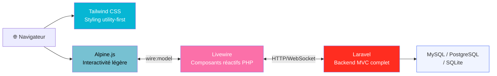

# Stacks Techniques

<div
  class="omny-meta"
  data-level="🟡 Intermédiaire"
  data-version="2024"
  data-time="2-3 heures">
</div>

## Introduction

!!! quote "Analogie pédagogique — La Boîte à Outils du Plombier"
    Un bon plombier ne choisit pas ses outils au hasard. Pour une fuite sous évier, il prend un jeu de clés. Pour un chantier entier, une perceuse colonne. Une stack technique, c'est votre boîte à outils préfabriquée : un ensemble cohérent de technologies choisies pour bien fonctionner ensemble, chacune couvrant une couche différente (base de données, backend, frontend). Choisir la bonne stack dès le départ évite de changer d'outil en milieu de chantier.

Une **stack technique** désigne l'ensemble des technologies utilisées pour construire une application, de la base de données à l'interface utilisateur. Ce hub présente les principales stacks utilisées dans l'écosystème OmnyDocs.

<br>

---

## Panorama des Stacks

```mermaid
flowchart TD
    Q1["Écosystème\nprincipal ?"] -->|PHP / Laravel| TALL
    Q1 -->|JavaScript\n(Node.js)| Q2
    Q1 -->|Contenu statique\n+ APIs tierces| JAM

    Q2["Frontend\npréféré ?"] -->|React| MERN
    Q2 -->|Angular| MEAN
    Q2 -->|Vue.js| MEVN

    TALL["⬛ TALL Stack\nTailwind · Alpine · Livewire · Laravel"]
    MERN["🔵 MERN Stack\nMongoDB · Express · React · Node.js"]
    MEAN["🟣 MEAN Stack\nMongoDB · Express · Angular · Node.js"]
    MEVN["🟢 MEVN Stack\nMongoDB · Express · Vue.js · Node.js"]
    JAM["🟠 JAMstack\nJavaScript · APIs · Markup"]

    style TALL fill:#1a1a2e,color:#fff,stroke:#4a6cf7
    style MERN fill:#f0f4ff,stroke:#4a6cf7
    style MEAN fill:#f5f3ff,stroke:#8b5cf6
    style MEVN fill:#f0fdf4,stroke:#22c55e
    style JAM fill:#fffbeb,stroke:#f59e0b
```

<br>

---

## Comparatif des Stacks

| Stack | BDD | Backend | Frontend | Cas d'usage idéal |
|---|---|---|---|---|
| **TALL** | MySQL / SQLite / PostgreSQL | Laravel (PHP) | Tailwind + Alpine + Livewire | Apps SaaS, CMS, portails métier |
| **MERN** | MongoDB | Express.js (Node) | React | SPA modernes, apps temps réel |
| **MEAN** | MongoDB | Express.js (Node) | Angular | Apps enterprise, TypeScript natif |
| **MEVN** | MongoDB | Express.js (Node) | Vue.js | Apps moderées, DX légère |
| **JAMstack** | Headless CMS / APIs | Serverless / Edge | Next.js / Astro | Sites marketing, blogs, e-commerce |
| **LAMP/LEMP** | MySQL | PHP vanilla | HTML/JS | Hébergements partagés, legacy |

<br>

---

## La TALL Stack — L'écosystème OmnyDocs

La **TALL Stack** (Tailwind · Alpine.js · Livewire · Laravel) est l'écosystème de référence d'OmnyDocs. Chaque composant a sa section dédiée :



| Composant | Documentation |
|---|---|
| **Laravel** | [→ Frameworks / Laravel](../frameworks/laravel/index.md) |
| **Tailwind CSS** | [→ Frameworks / Tailwind](../frameworks/tailwind/index.md) |
| **Alpine.js** | [→ Frameworks / Alpine](../frameworks/alpine/index.md) |
| **Livewire** | [→ Frameworks / Livewire](../frameworks/livewire/index.md) |

<br>

---

## Sections de ce Module

| Ressource | Description |
|---|---|
| [MEAN Stack →](./mean.md) | MongoDB · Express · Angular · Node.js |
| [MERN Stack →](./mern.md) | MongoDB · Express · React · Node.js |

<br>

---

## Guide de Choix

```
Votre équipe maîtrise déjà PHP ?
└── Oui → TALL Stack (Laravel) ← Recommandé OmnyDocs

Vous voulez du JavaScript full-stack ?
├── TypeScript natif, enterprise → MEAN (Angular)
├── Ecosystème riche, SPA rapides → MERN (React)
└── Légèreté, courbe douce → MEVN (Vue.js)

Vous faites un site de contenu (blog, marketing) ?
└── JAMstack (Next.js / Astro + Headless CMS)

Vous avez un hébergement mutualisé ?
└── LAMP/LEMP (PHP vanilla ou Laravel minimal)
```

!!! tip "Règle d'or"
    La meilleure stack est celle que **votre équipe maîtrise** et qui convient au **type de problème**. Ne choisissez pas une stack parce qu'elle est tendance — choisissez-la parce qu'elle résout votre problème avec les ressources disponibles.

<br>

---

## Conclusion

!!! quote "Ce qu'il faut retenir"
    Les stacks évoluent vite — React, Vue, Svelte disputent le terrain frontend pendant que Laravel, Django, Rails et Express se partagent le backend. Dans l'écosystème OmnyDocs, la **TALL Stack** est la référence : elle combine la puissance de Laravel, la réactivité de Livewire, la légèreté d'Alpine.js et l'expressivité de Tailwind. En savoir plus sur les stacks JS full-stack : **MEAN** et **MERN** sont les deux chemins les plus documentés de l'écosystème Node.js.

<br>