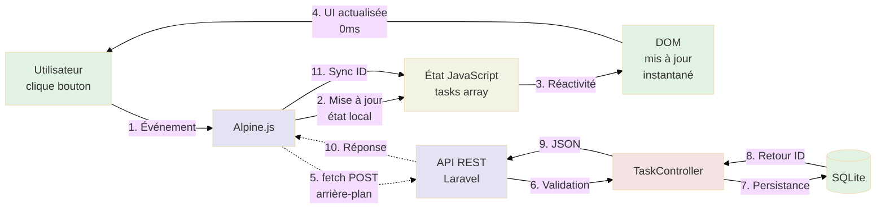

# 3b - Alpine.js Pur
²
<div
  class="omny-meta"
  data-level="🟡 Intermédiaire"
  data-version="1.0"
  data-time="120-150 minutes">
</div>

## Introduction

Après avoir maîtrisé la **réactivité côté serveur** avec Livewire (Module 6), il est temps de découvrir l'**approche inverse** : la réactivité 100% côté client avec Alpine.js. Ce module représente un **changement de paradigme majeur** dans votre apprentissage de la Stack TALL.

Imaginez que vous conduisez une voiture télécommandée (Livewire Module 6) : chaque action (tourner, accélérer) nécessite une **communication radio** avec la télécommande (serveur). Il y a toujours une **latence de ~50-100ms** entre votre commande et l'action du véhicule. Maintenant, avec Alpine.js, vous passez à une **voiture autonome** : toutes les décisions sont prises **instantanément** à bord (côté client), sans communication externe.

**Qu'est-ce qu'Alpine.js change concrètement ?**

Dans le Module 6 (Livewire), chaque action utilisateur déclenchait :
- Une requête AJAX au serveur (~50-100ms)
- Calcul côté serveur (PHP)
- Diff DOM et mise à jour
- Latence réseau visible

Avec Alpine.js, **réactivité instantanée** (0ms perçu). Chaque action déclenche :
- Manipulation JavaScript locale (mémoire navigateur)
- Mise à jour DOM immédiate
- Communication serveur **uniquement pour persistance** (en arrière-plan)

Ce module vous guidera pas à pas pour :

- **Installer Alpine.js** via CDN (aucun build requis)
- **Créer une API REST Laravel** avec `Api\TaskController`
- **Construire un composant Alpine** avec état réactif JavaScript
- **Utiliser fetch()** pour communiquer avec l'API
- **Implémenter CRUD complet** côté client avec persistance serveur
- **Comparer directement** Livewire (Module 6) vs Alpine.js (Module 7)

!!! quote "Principe du Module 7"
    "Alpine.js offre une réactivité instantanée côté client avec seulement 15KB de JavaScript. La magie opère dans le navigateur, le serveur ne sert que de persistance."

---

## Objectifs d'Apprentissage

À la fin de ce module, **vous serez capable de** :

### Objectifs Techniques

- [ ] Installer Alpine.js via CDN dans le layout
- [ ] Créer un contrôleur API REST (`Api\TaskController`)
- [ ] Configurer les routes API dans `routes/api.php`
- [ ] Créer un composant Alpine avec `x-data`
- [ ] Définir un état réactif JavaScript (propriétés, méthodes)
- [ ] Utiliser `fetch()` pour communiquer avec l'API Laravel
- [ ] Gérer les promesses JavaScript (`.then()`, `.catch()`, `async/await`)
- [ ] Utiliser les directives Alpine (`x-model`, `x-on:click`, `x-for`, `x-show`)
- [ ] Implémenter CRUD complet côté client
- [ ] Valider côté client ET serveur (double validation)

### Objectifs Conceptuels

- [ ] Comprendre la différence réactivité serveur (Livewire) vs client (Alpine)
- [ ] Visualiser le cycle requête/réponse avec API REST
- [ ] Maîtriser le concept d'état local JavaScript
- [ ] Saisir pourquoi Alpine.js est instantané (pas de latence réseau)
- [ ] Comprendre l'importance de la double validation (client + serveur)
- [ ] Anticiper les avantages/inconvénients de la réactivité client
- [ ] Comparer performance Livewire vs Alpine.js
- [ ] Préparer la transition vers Hybride (Module 8)

---

## Prérequis

Avant de commencer ce module, **assurez-vous d'avoir** :

- [ ] **Module 6 complété** : Application Livewire fonctionnelle et testée
- [ ] **Compréhension Livewire** : Propriétés réactives, directives wire, cycle AJAX
- [ ] **Connaissances JavaScript de base** : Variables, fonctions, objets, tableaux
- [ ] **Connaissances fetch()** : Requêtes HTTP, promesses (sera revu dans le module)
- [ ] **120-150 minutes** devant vous sans interruption

!!! warning "JavaScript Requis"
    **Contrairement au Module 6 (Livewire)**, Alpine.js nécessite **d'écrire du JavaScript**. Ce module suppose que vous avez des **notions de base** en JavaScript moderne (ES6+) :
    
    - Variables (`let`, `const`)
    - Fonctions fléchées (`() => {}`)
    - Promesses (`.then()`, `.catch()`)
    - Déstructuration (`{ data }`)
    - Spread operator (`...array`)

!!! danger "Ne Sautez Pas le Module 6"
    **Comprendre Livewire (Module 6) est ESSENTIEL** avant Alpine.js. Sans cette comparaison, vous ne saisirez pas **les différences architecturales** et **quand utiliser chaque approche**.

---

## Comprendre Avant d'Agir : Alpine.js vs Livewire

Avant d'installer Alpine.js, comprenons **les différences fondamentales** avec Livewire (Module 6).

### Architecture Livewire (Module 6) - Rappel

**Schéma de flux :**

```
1. Utilisateur clique "Ajouter" → 2. AJAX POST vers serveur
3. Serveur exécute TaskManager@save → 4. Validation + Création BDD
5. Serveur re-génère HTML → 6. Diff DOM calculé
7. JavaScript met à jour DOM partiellement
```

**Caractéristiques :**

- **Logique côté serveur** (PHP)
- **1 requête AJAX par action** (~50-100ms latence)
- **Validation serveur** uniquement
- **Diff DOM** pour mise à jour partielle

### Architecture Alpine.js (Module 7)

**Schéma de flux :**

```
1. Utilisateur clique "Ajouter" → 2. JavaScript local met à jour état
3. Alpine met à jour DOM immédiatement (0ms)
4. fetch() POST vers API en arrière-plan → 5. Serveur persiste en BDD
6. Réponse JSON → 7. JavaScript met à jour ID depuis serveur
```

**Caractéristiques :**

- **Logique côté client** (JavaScript)
- **Mise à jour DOM instantanée** (0ms perçu)
- **Validation client + serveur** (double sécurité)
- **API REST** pour persistance

### Tableau Comparatif Détaillé

| Aspect | Livewire (Module 6) | Alpine.js (Module 7) | Gagnant |
|--------|:-------------------:|:--------------------:|:-------:|
| **Logique métier** | PHP côté serveur | JavaScript côté client | ⚖️ (dépend compétences) |
| **Réactivité perçue** | ~50-100ms | **~0ms (instantané)** | 🟢 Alpine |
| **Latence réseau** | Visible | Invisible (arrière-plan) | 🟢 Alpine |
| **Bande passante** | ~1-5 KB/action | ~0.5-1 KB/action | 🟢 Alpine |
| **JavaScript requis** | 15KB (Livewire.js) | 15KB (Alpine.js) | ⚖️ |
| **Code JavaScript** | Généré automatiquement | ✅ **Écrire soi-même** | 🟢 Livewire |
| **Validation** | Serveur uniquement | Client + Serveur | 🟢 Alpine |
| **Persistance** | Automatique | fetch() manuel | 🟢 Livewire |
| **Complexité** | 🟡 Moyenne | 🔴 **Avancée** | 🟢 Livewire |
| **Courbe apprentissage** | 🟡 Moyenne | 🔴 Élevée | 🟢 Livewire |
| **UX (réactivité)** | ✅ Très bonne | ✅ **Excellente** | 🟢 Alpine |
| **Offline-first** | ❌ Impossible | ✅ Possible (LocalStorage) | 🟢 Alpine |
| **SEO** | ✅ Excellent (SSR) | ⚠️ Bon (hydratation) | 🟢 Livewire |

!!! tip "Pourquoi Alpine.js est Plus Complexe ?"
    Alpine.js nécessite :
    
    1. **Écrire JavaScript** (vs Livewire généré auto)
    2. **Créer API REST** (contrôleur séparé)
    3. **Gérer fetch()** manuellement (requêtes, erreurs, loading)
    4. **Valider deux fois** (client ET serveur)
    5. **Synchroniser état** (local JS vs BDD serveur)
    
    **Mais** : Offre une **réactivité instantanée** et **plus de contrôle**.

### Comment Fonctionne Alpine.js (Sous le Capot)

Ce diagramme montre **comment Alpine.js gère une action utilisateur** avec réactivité instantanée.

**Comment lire ce diagramme ?**

- Les **rectangles** représentent les composants techniques
- Les **flèches pleines** montrent les actions exécutées
- Les **flèches pointillées** montrent les retours de données
- **Séquence temporelle** : de gauche à droite



<small>*Ce diagramme illustre le cycle complet d'une action Alpine.js. Phase Instantanée (Étapes 1-4, ~0ms) : L'utilisateur clique "Ajouter", Alpine.js capture l'événement, met à jour l'état local JavaScript (array `tasks`), la réactivité Alpine met à jour le DOM immédiatement, l'UI affiche la nouvelle tâche instantanément. Phase Arrière-plan (Étapes 5-11, ~50-100ms) : En parallèle, fetch() envoie POST à l'API REST Laravel, le serveur valide et persiste en BDD, retourne JSON avec l'ID généré, Alpine synchronise l'ID local avec celui du serveur. **Clé** : L'utilisateur voit le résultat AVANT que le serveur ne réponde (optimistic UI update).*</small>

!!! info "Optimistic UI Update"
    **Alpine.js utilise une technique appelée "Optimistic UI"** :
    
    1. **Immédiatement** : Mise à jour de l'UI comme si l'action réussissait
    2. **En arrière-plan** : Envoi requête au serveur
    3. **Si succès** : Synchroniser ID/données serveur
    4. **Si échec** : Rollback l'UI + afficher erreur
    
    **Avantage** : Utilisateur perçoit réactivité instantanée même avec latence réseau.

---

## Phase 1 — Installation d'Alpine.js (Étapes 1 à 2)

### Étape 1 : Installer Alpine.js via CDN

Commençons par inclure Alpine.js dans le layout principal.

!!! info "CDN vs NPM"
    Pour ce module, nous utilisons le **CDN** (simplicité maximale, aucun build).
    
    **En production (Module 9)**, vous pouvez installer via NPM pour :
    
    - Minification personnalisée
    - Tree-shaking (réduire la taille)
    - Intégration avec Vite

**Fichier :** `resources/views/layouts/app.blade.php`

```html
<!DOCTYPE html>
<html lang="fr">
<head>
    <meta charset="UTF-8">
    <meta name="viewport" content="width=device-width, initial-scale=1.0">
    
    <title>@yield('title', 'TALL Tasks - Gestion de Tâches')</title>
    
    {{-- Tailwind CSS via CDN --}}
    <script src="https://cdn.tailwindcss.com"></script>
    
    {{-- Styles Livewire (si utilisé) --}}
    @livewireStyles
    
    {{-- NOUVEAU : Alpine.js via CDN (Version 3.x) --}}
    <script defer src="https://cdn.jsdelivr.net/npm/alpinejs@3.x.x/dist/cdn.min.js"></script>
</head>
<body class="bg-gray-100 min-h-screen">
    <header class="bg-white shadow-sm">
        <div class="max-w-4xl mx-auto px-4 py-6">
            <h1 class="text-3xl font-bold text-gray-900">
                📋 TALL Tasks
            </h1>
            <p class="text-sm text-gray-600 mt-1">
                Gestion moderne de vos tâches quotidiennes
            </p>
        </div>
    </header>

    <main class="max-w-4xl mx-auto px-4 py-8">
        @if(session('success'))
            <div class="bg-green-100 border border-green-400 text-green-700 px-4 py-3 rounded mb-6">
                {{ session('success') }}
            </div>
        @endif

        @yield('content')
    </main>

    <footer class="bg-white border-t mt-12">
        <div class="max-w-4xl mx-auto px-4 py-6 text-center text-gray-600 text-sm">
            <p>
                TALL Tasks &copy; {{ date('Y') }} - 
                Construit avec 
                <span class="text-red-500">♥</span> 
                et la Stack TALL
            </p>
        </div>
    </footer>

    {{-- Scripts Livewire (si utilisé) --}}
    @livewireScripts
</body>
</html>
```

**Changement apporté :**

```html
{{-- Alpine.js CDN (version 3.x stable) --}}
<script defer src="https://cdn.jsdelivr.net/npm/alpinejs@3.x.x/dist/cdn.min.js"></script>
```

!!! danger "Attribut defer Obligatoire"
    **`defer` est OBLIGATOIRE** pour que Alpine.js fonctionne correctement.
    
    **Pourquoi `defer` ?**
    
    - Script chargé en parallèle (pas de blocage HTML)
    - Exécuté **après** que le DOM soit complètement chargé
    - Alpine peut initialiser tous les composants `x-data`
    
    **Sans `defer`**, Alpine pourrait s'exécuter **avant** que le HTML soit prêt, causant des erreurs.

**Vérifier l'installation :**

Ouvrez la console du navigateur (F12) et tapez :

```javascript
// Vérifier qu'Alpine est disponible globalement
Alpine

// Doit afficher : {start: ƒ, component: ƒ, data: ƒ, ...}
```

!!! success "Alpine.js Installé"
    Si la console affiche l'objet Alpine, l'installation est réussie !

---

### Étape 2 : Comprendre les Directives Alpine de Base

Avant de construire l'application, familiarisons-nous avec les **directives Alpine** essentielles.

**Tableau des directives principales :**

| Directive | Rôle | Équivalent Vue.js | Exemple |
|-----------|------|-------------------|---------|
| `x-data="{}"` | Définir composant avec état | `data()` | `<div x-data="{ count: 0 }">` |
| `x-model="prop"` | Binding bidirectionnel | `v-model` | `<input x-model="title">` |
| `x-on:click="fn"` | Écouter événement | `@click` | `<button x-on:click="save()">` |
| `@click="fn"` | Raccourci `x-on:click` | `@click` | `<button @click="save()">` |
| `x-text="prop"` | Afficher texte | `{{ prop }}` | `<span x-text="count"></span>` |
| `x-html="prop"` | Afficher HTML | `v-html` | `<div x-html="content"></div>` |
| `x-for="item in items"` | Boucle | `v-for` | `<template x-for="task in tasks">` |
| `x-show="condition"` | Afficher/Cacher (CSS) | `v-show` | `<div x-show="isOpen">` |
| `x-if="condition"` | Conditionnel (DOM) | `v-if` | `<template x-if="tasks.length > 0">` |
| `x-bind:attr="val"` | Lier attribut | `:attr` | `<div x-bind:class="className">` |
| `:attr="val"` | Raccourci `x-bind` | `:attr` | `<div :class="className">` |

#### Exemple Minimal : Compteur Alpine

```html
<div x-data="{ count: 0 }">
    <!-- Afficher la valeur -->
    <p>Compteur : <span x-text="count"></span></p>
    
    <!-- Boutons d'action -->
    <button @click="count++">Incrémenter</button>
    <button @click="count--">Décrémenter</button>
    <button @click="count = 0">Réinitialiser</button>
</div>
```

**Ce que fait ce code :**

1. `x-data="{ count: 0 }"` : Crée un composant avec état `count = 0`
2. `x-text="count"` : Affiche la valeur de `count` (réactif)
3. `@click="count++"` : Incrémente `count` au clic
4. Alpine détecte changement → Met à jour `x-text` automatiquement

!!! tip "Testez dans le Navigateur"
    Créez un fichier `test-alpine.html` avec ce code et ouvrez-le dans le navigateur pour voir Alpine en action !

> Ainsi s'achève la Phase 1 - Installation d'Alpine.js (Étapes 1-2)

---

## Phase 2 — Création de l'API REST (Étapes 3 à 5)

### Étape 3 : Créer le Contrôleur API

Créons maintenant un **contrôleur API** dédié qui retourne du JSON au lieu de HTML.

**Créer le contrôleur :**

```bash
# Créer TaskController dans le namespace Api
php artisan make:controller Api/TaskController --api

# Résultat attendu :
# Controller created successfully.
```

!!! info "Option --api Expliquée"
    **`--api`** génère un contrôleur avec les méthodes RESTful standards **sans les méthodes de vues** (`create`, `edit`).
    
    **Méthodes générées** :
    
    - `index()` : Liste toutes les ressources (GET)
    - `store()` : Créer une ressource (POST)
    - `show($id)` : Afficher une ressource (GET)
    - `update($id)` : Modifier une ressource (PUT/PATCH)
    - `destroy($id)` : Supprimer une ressource (DELETE)

**Vérifier la création :**

```bash
# Vérifier que le fichier existe dans le namespace Api
ls -la app/Http/Controllers/Api/TaskController.php

# Doit afficher : TaskController.php avec date de création
```

---

### Étape 4 : Implémenter les Méthodes API

Ouvrons le contrôleur API et implémentons les **5 méthodes RESTful**.

**Fichier :** `app/Http/Controllers/Api/TaskController.php`

```php
<?php

namespace App\Http\Controllers\Api;

use App\Http\Controllers\Controller;
use App\Models\Task;
use Illuminate\Http\Request;
use Illuminate\Http\JsonResponse;

class TaskController extends Controller
{
    /**
     * Lister toutes les tâches
     * 
     * Route : GET /api/tasks
     * Retour : JSON avec tableau de tâches
     */
    public function index(): JsonResponse
    {
        // Récupérer toutes les tâches
        $tasks = Task::all();

        // Retourner JSON avec statut 200 OK
        return response()->json($tasks, 200);
    }

    /**
     * Créer une nouvelle tâche
     * 
     * Route : POST /api/tasks
     * Body : { "title": "...", "description": "..." }
     * Retour : JSON avec tâche créée + statut 201
     */
    public function store(Request $request): JsonResponse
    {
        // Valider les données (serveur)
        // IMPORTANT : Ne JAMAIS faire confiance au client
        $validated = $request->validate([
            'title' => 'required|max:255',
            'description' => 'nullable'
        ]);

        // Créer la tâche en BDD
        $task = Task::create($validated);

        // Retourner JSON avec tâche créée + statut 201 Created
        return response()->json($task, 201);
    }

    /**
     * Afficher une tâche spécifique
     * 
     * Route : GET /api/tasks/{id}
     * Retour : JSON avec détails de la tâche
     */
    public function show(Task $task): JsonResponse
    {
        // Route Model Binding résout automatiquement $task
        return response()->json($task, 200);
    }

    /**
     * Modifier une tâche existante
     * 
     * Route : PUT/PATCH /api/tasks/{id}
     * Body : { "completed": true, "title": "...", ... }
     * Retour : JSON avec tâche modifiée
     */
    public function update(Request $request, Task $task): JsonResponse
    {
        // Valider les données
        $validated = $request->validate([
            'title' => 'sometimes|required|max:255',
            'description' => 'nullable',
            'completed' => 'sometimes|boolean'
        ]);

        // Mettre à jour la tâche
        $task->update($validated);

        // Retourner JSON avec tâche mise à jour
        return response()->json($task, 200);
    }

    /**
     * Supprimer une tâche
     * 
     * Route : DELETE /api/tasks/{id}
     * Retour : JSON vide + statut 204
     */
    public function destroy(Task $task): JsonResponse
    {
        // Supprimer la tâche de la BDD
        $task->delete();

        // Retourner statut 204 No Content (succès sans body)
        return response()->json(null, 204);
    }
}
```

#### Explication Détaillée des Statuts HTTP

**Tableau des codes de statut utilisés :**

| Code | Nom | Utilisation | Exemple API |
|------|-----|-------------|-------------|
| 200 | OK | Succès lecture/modification | GET /api/tasks → Liste |
| 201 | Created | Ressource créée avec succès | POST /api/tasks → Tâche créée |
| 204 | No Content | Succès sans données retournées | DELETE /api/tasks/1 → Supprimée |
| 400 | Bad Request | Données invalides | POST sans title |
| 404 | Not Found | Ressource inexistante | GET /api/tasks/999 |
| 422 | Unprocessable Entity | Validation échouée | POST title trop long |
| 500 | Internal Server Error | Erreur serveur | Exception non gérée |

!!! info "Pourquoi 201 au lieu de 200 ?"
    **201 Created** signifie **"ressource créée avec succès"**, contrairement à **200 OK** qui signifie **"requête traitée"**.
    
    **Bonne pratique RESTful** : Utiliser le statut le plus spécifique possible.

#### Méthode `store()` : Validation Côté Serveur

```php
public function store(Request $request): JsonResponse
{
    // Validation OBLIGATOIRE côté serveur
    $validated = $request->validate([
        'title' => 'required|max:255',
        'description' => 'nullable'
    ]);

    $task = Task::create($validated);

    return response()->json($task, 201);
}
```

!!! danger "Double Validation Obligatoire"
    **Même si Alpine.js valide côté client**, vous **DEVEZ valider côté serveur**.
    
    **Pourquoi ?**
    
    - Un attaquant peut **contourner** la validation JavaScript (DevTools, Postman, cURL)
    - La validation client est pour l'**UX** (feedback immédiat)
    - La validation serveur est pour la **sécurité** (protection données)
    
    **Règle d'or** : Ne JAMAIS faire confiance aux données client.

#### Méthode `update()` : Modification Partielle

```php
public function update(Request $request, Task $task): JsonResponse
{
    $validated = $request->validate([
        'title' => 'sometimes|required|max:255',  // sometimes = optionnel
        'description' => 'nullable',
        'completed' => 'sometimes|boolean'
    ]);

    $task->update($validated);
    
    return response()->json($task, 200);
}
```

**Règle `sometimes` expliquée :**

```php
// Avec sometimes : Validation UNIQUEMENT si champ présent
'title' => 'sometimes|required|max:255'

// Request : { "completed": true }
// Résultat : ✅ Validation passe (title absent mais c'est OK)

// Request : { "title": "" }
// Résultat : ❌ Validation échoue (title présent mais vide)
```

---

### Étape 5 : Configurer les Routes API

Configurons les **routes API** dans `routes/api.php`.

**Fichier :** `routes/api.php`

```php
<?php

use App\Http\Controllers\Api\TaskController;
use Illuminate\Support\Facades\Route;

/**
 * Routes API pour les tâches
 * 
 * Toutes ces routes sont préfixées par /api automatiquement
 * Exemple : GET /api/tasks, POST /api/tasks, etc.
 * 
 * Middleware 'api' appliqué automatiquement :
 * - Throttling (limite requêtes)
 * - JSON response par défaut
 */

// Liste toutes les tâches (GET /api/tasks)
Route::get('/tasks', [TaskController::class, 'index']);

// Créer une nouvelle tâche (POST /api/tasks)
Route::post('/tasks', [TaskController::class, 'store']);

// Afficher une tâche (GET /api/tasks/{id})
Route::get('/tasks/{task}', [TaskController::class, 'show']);

// Modifier une tâche (PUT/PATCH /api/tasks/{id})
Route::put('/tasks/{task}', [TaskController::class, 'update']);
Route::patch('/tasks/{task}', [TaskController::class, 'update']);

// Supprimer une tâche (DELETE /api/tasks/{id})
Route::delete('/tasks/{task}', [TaskController::class, 'destroy']);

/**
 * SYNTAXE ALTERNATIVE : Route Resource (équivalent)
 * 
 * Cette ligne génère automatiquement les 5 routes ci-dessus
 */
// Route::apiResource('tasks', TaskController::class);
```

!!! info "Préfixe /api Automatique"
    **Laravel préfixe automatiquement** toutes les routes de `routes/api.php` avec `/api`.
    
    **Exemple :**
    
    - Route définie : `Route::get('/tasks', ...)`
    - URL réelle : `GET /api/tasks`

**Syntaxe alternative avec `apiResource` :**

```php
// Au lieu de définir 5 routes manuellement
Route::apiResource('tasks', TaskController::class);

// Génère automatiquement :
// GET    /api/tasks           → index()
// POST   /api/tasks           → store()
// GET    /api/tasks/{task}    → show()
// PUT    /api/tasks/{task}    → update()
// DELETE /api/tasks/{task}    → destroy()
```

**Vérifier les routes API :**

```bash
# Lister toutes les routes API
php artisan route:list --path=api

# Doit afficher :
# GET     /api/tasks .............. Api\TaskController@index
# POST    /api/tasks .............. Api\TaskController@store
# GET     /api/tasks/{task} ....... Api\TaskController@show
# PUT     /api/tasks/{task} ....... Api\TaskController@update
# DELETE  /api/tasks/{task} ....... Api\TaskController@destroy
```

!!! success "API REST Configurée"
    Votre API REST est maintenant opérationnelle et prête à être consommée par Alpine.js !

**Tester l'API (optionnel) :**

```bash
# Démarrer le serveur si pas déjà fait
php artisan serve

# Dans un autre terminal, tester avec curl
curl http://localhost:8000/api/tasks

# Doit retourner : []  (liste vide si aucune tâche)
```

> Ainsi s'achève la Phase 2 - Création de l'API REST (Étapes 3-5)

---

## Phase 3 — Construction du Composant Alpine (Étape 6)

### Étape 6 : Créer la Vue avec Composant Alpine

Créons maintenant la **vue Blade** qui contient le composant Alpine.js.

**Créer le fichier :**

```bash
# Créer le fichier alpine-tasks.blade.php
touch resources/views/alpine-tasks.blade.php
```

**Fichier :** `resources/views/alpine-tasks.blade.php`

```html
@extends('layouts.app')

@section('title', 'Mes Tâches - TALL Tasks (Alpine.js)')

@section('content')

{{-- 
    Composant Alpine.js avec état réactif
    
    x-data="taskManager()" : Initialise le composant avec la fonction taskManager()
    Cette fonction retourne un objet avec propriétés et méthodes réactives
--}}
<div x-data="taskManager()">
    
    {{-- Formulaire de création --}}
    <div class="bg-white rounded-lg shadow-md p-6 mb-8">
        <h2 class="text-2xl font-bold text-gray-800 mb-4">
            ➕ Créer une nouvelle tâche
        </h2>

        {{--
            @submit.prevent="save()"
            - @submit : Écoute la soumission du formulaire
            - .prevent : Empêche le comportement par défaut (rechargement)
            - save() : Appelle la méthode save() du composant Alpine
        --}}
        <form @submit.prevent="save()" class="space-y-4">
            {{-- Champ titre --}}
            <div>
                <label class="block text-sm font-medium text-gray-700 mb-2">
                    Titre de la tâche
                </label>
                {{--
                    x-model="newTask.title"
                    - Binding bidirectionnel avec newTask.title
                    - Quand l'utilisateur tape, newTask.title est mis à jour
                    - Quand newTask.title change, l'input est mis à jour
                --}}
                <input 
                    type="text" 
                    x-model="newTask.title"
                    placeholder="Ex: Terminer le Module 7"
                    required
                    class="w-full px-4 py-2 border border-gray-300 rounded-lg focus:ring-2 focus:ring-blue-500 focus:border-transparent"
                >
            </div>

            {{-- Champ description --}}
            <div>
                <label class="block text-sm font-medium text-gray-700 mb-2">
                    Description (optionnel)
                </label>
                <textarea 
                    x-model="newTask.description"
                    rows="3"
                    placeholder="Détails supplémentaires..."
                    class="w-full px-4 py-2 border border-gray-300 rounded-lg focus:ring-2 focus:ring-blue-500 focus:border-transparent"
                ></textarea>
            </div>

            {{-- Bouton soumission --}}
            <button 
                type="submit"
                class="w-full bg-blue-600 text-white font-medium py-3 px-4 rounded-lg hover:bg-blue-700 transition duration-200"
            >
                Ajouter la tâche
            </button>
        </form>
    </div>

    {{-- Liste des tâches --}}
    <div class="bg-white rounded-lg shadow-md p-6">
        <div class="flex items-center justify-between mb-4">
            <h2 class="text-2xl font-bold text-gray-800">
                📝 Mes tâches
            </h2>
            {{-- Compteur de tâches (propriété réactive) --}}
            <span class="bg-blue-100 text-blue-800 text-sm font-medium px-3 py-1 rounded-full">
                <span x-text="tasks.length"></span> tâche(s)
            </span>
        </div>

        {{-- Message si aucune tâche (x-show) --}}
        <div x-show="tasks.length === 0" class="text-center py-12">
            <p class="text-gray-500 text-lg mb-2">
                📭 Aucune tâche pour le moment
            </p>
            <p class="text-gray-400 text-sm">
                Créez votre première tâche ci-dessus !
            </p>
        </div>

        {{-- 
            Boucle sur les tâches (x-for)
            
            IMPORTANT : x-for doit être sur un <template>
            :key est OBLIGATOIRE pour performance
        --}}
        <div x-show="tasks.length > 0" class="space-y-3">
            <template x-for="task in tasks" :key="task.id">
                <div class="flex items-center justify-between p-4 rounded-lg border"
                    :class="task.completed ? 'bg-green-50 border-green-200' : 'bg-gray-50 border-gray-200'">
                    
                    <div class="flex-1">
                        {{-- Titre avec style conditionnel --}}
                        <h3 class="font-semibold"
                            :class="task.completed ? 'text-gray-500 line-through' : 'text-gray-900'"
                            x-text="task.title">
                        </h3>
                        
                        {{-- Description si présente (x-show) --}}
                        <p x-show="task.description" 
                            class="text-sm mt-1"
                            :class="task.completed ? 'text-gray-400' : 'text-gray-600'"
                            x-text="task.description">
                        </p>
                        
                        {{-- Date de création --}}
                        <p class="text-xs text-gray-400 mt-2">
                            Créée le <span x-text="formatDate(task.created_at)"></span>
                        </p>
                    </div>
                    
                    {{-- Boutons d'action --}}
                    <div class="flex items-center space-x-2 ml-4">
                        {{-- Bouton toggle (compléter/réactiver) --}}
                        <button 
                            @click="toggle(task)"
                            class="px-4 py-2 rounded-lg transition"
                            :class="task.completed 
                                ? 'bg-gray-600 hover:bg-gray-700 text-white' 
                                : 'bg-green-600 hover:bg-green-700 text-white'"
                            x-text="task.completed ? '↩️ Réactiver' : '✓ Compléter'">
                        </button>
                        
                        {{-- Bouton supprimer avec confirmation --}}
                        <button 
                            @click="if(confirm('Êtes-vous sûr de vouloir supprimer cette tâche ?')) deleteTask(task.id)"
                            class="px-4 py-2 bg-red-600 text-white rounded-lg hover:bg-red-700 transition"
                        >
                            🗑️ Supprimer
                        </button>
                    </div>
                </div>
            </template>
        </div>
    </div>

</div>

{{-- 
    Script JavaScript : Composant Alpine.js
    
    Cette fonction retourne un objet avec l'état et les méthodes
    Alpine rend cet objet réactif automatiquement
--}}
<script>
function taskManager() {
    return {
        // État du composant (propriétés réactives)
        tasks: [],              // Liste des tâches (chargées depuis API)
        newTask: {              // Formulaire de nouvelle tâche
            title: '',
            description: ''
        },

        /**
         * Initialisation du composant
         * 
         * Cette méthode est appelée automatiquement par Alpine
         * quand le composant est monté dans le DOM
         */
        async init() {
            // Charger les tâches existantes depuis l'API
            await this.loadTasks();
        },

        /**
         * Charger toutes les tâches depuis l'API
         * 
         * GET /api/tasks
         */
        async loadTasks() {
            try {
                // Requête GET vers l'API Laravel
                const response = await fetch('/api/tasks');
                
                // Parser la réponse JSON
                const data = await response.json();
                
                // Mettre à jour l'état local
                // Alpine détecte le changement et met à jour le DOM
                this.tasks = data;
            } catch (error) {
                console.error('Erreur chargement tâches:', error);
                alert('Impossible de charger les tâches');
            }
        },

        /**
         * Créer une nouvelle tâche
         * 
         * POST /api/tasks
         */
        async save() {
            try {
                // Validation côté client (basique)
                if (!this.newTask.title.trim()) {
                    alert('Le titre est obligatoire');
                    return;
                }

                // Requête POST vers l'API Laravel
                const response = await fetch('/api/tasks', {
                    method: 'POST',
                    headers: {
                        'Content-Type': 'application/json',
                        'Accept': 'application/json',
                        // Token CSRF depuis meta tag (ajouté par Laravel)
                        'X-CSRF-TOKEN': document.querySelector('meta[name="csrf-token"]').content
                    },
                    body: JSON.stringify({
                        title: this.newTask.title,
                        description: this.newTask.description
                    })
                });

                // Vérifier le statut HTTP
                if (!response.ok) {
                    throw new Error('Erreur serveur');
                }

                // Parser la réponse JSON (tâche créée avec ID)
                const task = await response.json();

                // Ajouter la tâche à l'état local
                // Alpine met à jour le DOM instantanément
                this.tasks.push(task);

                // Réinitialiser le formulaire
                this.newTask = { title: '', description: '' };

            } catch (error) {
                console.error('Erreur création tâche:', error);
                alert('Impossible de créer la tâche');
            }
        },

        /**
         * Basculer l'état de complétion d'une tâche
         * 
         * PUT /api/tasks/{id}
         */
        async toggle(task) {
            try {
                // Mise à jour optimiste (UI d'abord)
                task.completed = !task.completed;

                // Requête PUT vers l'API Laravel
                const response = await fetch(`/api/tasks/${task.id}`, {
                    method: 'PUT',
                    headers: {
                        'Content-Type': 'application/json',
                        'Accept': 'application/json',
                        'X-CSRF-TOKEN': document.querySelector('meta[name="csrf-token"]').content
                    },
                    body: JSON.stringify({
                        completed: task.completed
                    })
                });

                if (!response.ok) {
                    // Rollback en cas d'erreur
                    task.completed = !task.completed;
                    throw new Error('Erreur serveur');
                }

                // Synchroniser avec la réponse serveur
                const updatedTask = await response.json();
                Object.assign(task, updatedTask);

            } catch (error) {
                console.error('Erreur toggle tâche:', error);
                alert('Impossible de modifier la tâche');
            }
        },

        /**
         * Supprimer une tâche
         * 
         * DELETE /api/tasks/{id}
         */
        async deleteTask(taskId) {
            try {
                // Requête DELETE vers l'API Laravel
                const response = await fetch(`/api/tasks/${taskId}`, {
                    method: 'DELETE',
                    headers: {
                        'Content-Type': 'application/json',
                        'Accept': 'application/json',
                        'X-CSRF-TOKEN': document.querySelector('meta[name="csrf-token"]').content
                    }
                });

                if (!response.ok) {
                    throw new Error('Erreur serveur');
                }

                // Supprimer de l'état local
                // Alpine met à jour le DOM instantanément
                this.tasks = this.tasks.filter(t => t.id !== taskId);

            } catch (error) {
                console.error('Erreur suppression tâche:', error);
                alert('Impossible de supprimer la tâche');
            }
        },

        /**
         * Formater une date ISO en format français
         * 
         * Méthode utilitaire appelée dans la vue
         */
        formatDate(isoDate) {
            const date = new Date(isoDate);
            return date.toLocaleDateString('fr-FR', {
                day: '2-digit',
                month: '2-digit',
                year: 'numeric',
                hour: '2-digit',
                minute: '2-digit'
            });
        }
    };
}
</script>

@endsection
```

#### Explication Détaillée du Composant Alpine

**Structure du composant :**

```javascript
function taskManager() {
    return {
        // 1. ÉTAT (données réactives)
        tasks: [],
        newTask: { title: '', description: '' },
        
        // 2. LIFECYCLE (initialisation)
        init() { },
        
        // 3. MÉTHODES (actions)
        loadTasks() { },
        save() { },
        toggle() { },
        deleteTask() { },
        
        // 4. UTILITAIRES (helpers)
        formatDate() { }
    };
}
```

#### Méthode `init()` : Lifecycle Hook

**Qu'est-ce que `init()` ?**

`init()` est un **hook de cycle de vie** appelé automatiquement par Alpine quand le composant est monté.

**Équivalent Vue.js :**

```javascript
// Vue.js
mounted() {
    this.loadTasks();
}

// Alpine.js
init() {
    this.loadTasks();
}
```

**Cas d'usage typiques :**

- Charger des données depuis l'API
- Initialiser des écouteurs d'événements
- Configurer des bibliothèques tierces
- Restaurer l'état depuis LocalStorage

#### Méthode `loadTasks()` : Charger depuis l'API

```javascript
async loadTasks() {
    try {
        const response = await fetch('/api/tasks');
        const data = await response.json();
        this.tasks = data;  // Alpine met à jour le DOM automatiquement
    } catch (error) {
        console.error('Erreur chargement tâches:', error);
        alert('Impossible de charger les tâches');
    }
}
```

**Ce qui se passe :**

1. `fetch('/api/tasks')` envoie GET vers l'API Laravel
2. Serveur retourne JSON : `[{ id: 1, title: "...", ... }, ...]`
3. `response.json()` parse le JSON en objet JavaScript
4. `this.tasks = data` met à jour l'état
5. Alpine détecte changement → Met à jour tous les `x-for`, `x-text`, etc.

!!! info "async/await Expliqué"
    **`async/await`** est du sucre syntaxique pour les promesses.
    
    **Avec promesses (verbeux) :**
    
    ```javascript
    loadTasks() {
        fetch('/api/tasks')
            .then(response => response.json())
            .then(data => {
                this.tasks = data;
            })
            .catch(error => {
                console.error(error);
            });
    }
    ```
    
    **Avec async/await (propre) :**
    
    ```javascript
    async loadTasks() {
        try {
            const response = await fetch('/api/tasks');
            const data = await response.json();
            this.tasks = data;
        } catch (error) {
            console.error(error);
        }
    }
    ```

#### Méthode `save()` : Créer avec Validation

```javascript
async save() {
    // 1. Validation côté client
    if (!this.newTask.title.trim()) {
        alert('Le titre est obligatoire');
        return;
    }

    // 2. Requête POST
    const response = await fetch('/api/tasks', {
        method: 'POST',
        headers: {
            'Content-Type': 'application/json',
            'X-CSRF-TOKEN': document.querySelector('meta[name="csrf-token"]').content
        },
        body: JSON.stringify({
            title: this.newTask.title,
            description: this.newTask.description
        })
    });

    // 3. Vérifier statut
    if (!response.ok) {
        throw new Error('Erreur serveur');
    }

    // 4. Parser réponse
    const task = await response.json();

    // 5. Mettre à jour état local
    this.tasks.push(task);

    // 6. Réinitialiser formulaire
    this.newTask = { title: '', description: '' };
}
```

!!! danger "Token CSRF Obligatoire"
    **Laravel exige un token CSRF** pour toutes les requêtes POST/PUT/DELETE.
    
    **Ajouter dans `<head>` du layout** :
    
    ```html
    <meta name="csrf-token" content="{{ csrf_token() }}">
    ```
    
    **Puis dans fetch() :**
    
    ```javascript
    headers: {
        'X-CSRF-TOKEN': document.querySelector('meta[name="csrf-token"]').content
    }
    ```

#### Méthode `toggle()` : Mise à Jour Optimiste

```javascript
async toggle(task) {
    // 1. Mise à jour optimiste (UI d'abord)
    task.completed = !task.completed;

    try {
        // 2. Requête PUT en arrière-plan
        const response = await fetch(`/api/tasks/${task.id}`, {
            method: 'PUT',
            headers: { /* ... */ },
            body: JSON.stringify({ completed: task.completed })
        });

        if (!response.ok) {
            // 3. Rollback si erreur
            task.completed = !task.completed;
            throw new Error('Erreur serveur');
        }

        // 4. Synchroniser avec serveur
        const updatedTask = await response.json();
        Object.assign(task, updatedTask);
    } catch (error) {
        console.error(error);
    }
}
```

**Pourquoi "Optimistic UI" ?**

1. **UI mise à jour IMMÉDIATEMENT** (0ms perçu)
2. Requête serveur en arrière-plan (~50-100ms)
3. Si succès : Synchronisation
4. Si erreur : Rollback + message

**Avantage** : Utilisateur perçoit réactivité instantanée même avec latence réseau.

#### Méthode `deleteTask()` : Suppression Simple

```javascript
async deleteTask(taskId) {
    const response = await fetch(`/api/tasks/${taskId}`, {
        method: 'DELETE',
        headers: { /* ... */ }
    });

    if (!response.ok) {
        throw new Error('Erreur serveur');
    }

    // Supprimer de l'état local
    this.tasks = this.tasks.filter(t => t.id !== taskId);
}
```

**`filter()` Expliqué :**

```javascript
// Avant : tasks = [{ id: 1 }, { id: 2 }, { id: 3 }]
this.tasks = this.tasks.filter(t => t.id !== 2);
// Après : tasks = [{ id: 1 }, { id: 3 }]  (id 2 supprimé)
```

> Ainsi s'achève la Phase 3 - Construction du Composant Alpine (Étape 6)

---

## Phase 4 — Configuration et Tests (Étapes 7 à 10)

### Étape 7 : Ajouter le Meta Tag CSRF

Pour que fetch() fonctionne avec Laravel, ajoutons le **meta tag CSRF**.

**Fichier :** `resources/views/layouts/app.blade.php`

```html
<!DOCTYPE html>
<html lang="fr">
<head>
    <meta charset="UTF-8">
    <meta name="viewport" content="width=device-width, initial-scale=1.0">
    
    {{-- NOUVEAU : Token CSRF pour fetch() --}}
    <meta name="csrf-token" content="{{ csrf_token() }}">
    
    <title>@yield('title', 'TALL Tasks - Gestion de Tâches')</title>
    
    <script src="https://cdn.tailwindcss.com"></script>
    @livewireStyles
    <script defer src="https://cdn.jsdelivr.net/npm/alpinejs@3.x.x/dist/cdn.min.js"></script>
</head>
<!-- ... reste du code ... -->
```

**Changement apporté :**

```html
<meta name="csrf-token" content="{{ csrf_token() }}">
```

!!! info "Pourquoi dans <head> ?"
    Le meta tag doit être dans `<head>` pour être accessible **avant** que Alpine.js s'exécute.

---

### Étape 8 : Créer la Route pour la Vue Alpine

Ajoutons une route pour afficher la vue Alpine.

**Fichier :** `routes/web.php`

```php
<?php

use App\Livewire\TaskManager;
use Illuminate\Support\Facades\Route;

// Route Livewire (Module 6)
Route::get('/tasks', TaskManager::class)->name('tasks.index');

// Route Alpine.js (Module 7)
Route::get('/tasks-alpine', function () {
    return view('alpine-tasks');
})->name('tasks.alpine');

// OU créer une route pour remplacer /tasks
// Route::get('/tasks', function () {
//     return view('alpine-tasks');
// })->name('tasks.index');
```

!!! tip "Deux Versions Parallèles"
    Pour **comparer facilement**, gardez les deux routes :
    
    - `/tasks` : Version Livewire (Module 6)
    - `/tasks-alpine` : Version Alpine.js (Module 7)

---

### Étape 9 : Tester l'Application Alpine

Démarrons le serveur et testons l'application **Alpine.js** !

**Démarrer le serveur :**

```bash
# Si le serveur n'est pas déjà lancé
php artisan serve
```

**Ouvrir le navigateur :**

```
http://localhost:8000/tasks-alpine
```

!!! success "Application Alpine Accessible"
    Si vous voyez l'interface (peut-être vide), **félicitations** ! Alpine.js est opérationnel.

---

### Étape 10 : Tests Complets

#### Test 1 - Chargement Initial

**Scénario :**

1. Ouvrir `/tasks-alpine`
2. Observer la console (F12)

**Résultat attendu :**

- ✅ Requête `GET /api/tasks` visible dans Network tab
- ✅ Liste des tâches chargée (si BDD non vide)
- ✅ Compteur affiche bon nombre
- ✅ **AUCUNE erreur JavaScript** dans la console

#### Test 2 - Créer une Tâche (Instantané)

**Scénario :**

1. Remplir formulaire :
   - **Titre** : "Tâche Alpine 1"
   - **Description** : "Créée avec réactivité instantanée"
2. Cliquer "Ajouter"

**Résultat attendu :**

- ✅ **Tâche apparaît IMMÉDIATEMENT** dans la liste (0ms perçu)
- ✅ Formulaire **vidé instantanément**
- ✅ Compteur mis à jour **instantanément**
- ✅ **En arrière-plan** : Requête POST visible dans Network (~50-100ms)
- ✅ **AUCUN rechargement de page**

**Comparaison avec Livewire :**

| Aspect | Livewire (Module 6) | Alpine (Module 7) |
|--------|:-------------------:|:-----------------:|
| Affichage tâche | Après réponse serveur (~100ms) | **Immédiat (~0ms)** |
| Vidage formulaire | Après réponse serveur | **Immédiat** |
| Perception utilisateur | Réactif | **Instantané** |

#### Test 3 - Compléter une Tâche (Optimistic)

**Scénario :**

1. Cliquer sur "✓ Compléter"

**Résultat attendu :**

- ✅ **Changement INSTANTANÉ** (fond vert, texte barré, bouton "Réactiver")
- ✅ **En arrière-plan** : Requête PUT vers API
- ✅ Si serveur échoue : Rollback automatique (tâche redevient non complétée)

**Test rollback (optionnel) :**

1. Arrêter le serveur (`php artisan serve`)
2. Cliquer "Compléter"
3. **Résultat** : Changement immédiat → Puis rollback + message erreur

#### Test 4 - Supprimer avec Confirmation

**Scénario :**

1. Cliquer "🗑️ Supprimer"
2. Popup JavaScript : Cliquer "OK"

**Résultat attendu :**

- ✅ Popup confirmation native
- ✅ **Tâche disparaît IMMÉDIATEMENT** après confirmation
- ✅ **En arrière-plan** : Requête DELETE vers API
- ✅ Compteur mis à jour instantanément

---

## Comparaison Directe : Livewire vs Alpine.js

### Tableau Comparatif Final

| Aspect | Livewire (Module 6) | Alpine.js (Module 7) | Gagnant |
|--------|:-------------------:|:--------------------:|:-------:|
| **Réactivité perçue** | ~50-100ms | **~0ms (instantané)** | 🟢 Alpine |
| **Latence réseau** | Visible (bloquante) | Invisible (arrière-plan) | 🟢 Alpine |
| **Offline-capable** | ❌ Non | ✅ Possible (LocalStorage) | 🟢 Alpine |
| **Code JavaScript** | Généré auto | ✅ **Écrire soi-même** | 🟢 Livewire |
| **Validation** | Serveur uniquement | Client + Serveur | 🟢 Alpine |
| **API REST** | ❌ Pas nécessaire | ✅ **Obligatoire** | 🟢 Livewire |
| **Complexité** | 🟡 Moyenne | 🔴 **Avancée** | 🟢 Livewire |
| **Courbe apprentissage** | 🟡 PHP | 🔴 JavaScript moderne | 🟢 Livewire |
| **Maintenance** | 🟢 Simple | 🔴 État à synchroniser | 🟢 Livewire |
| **SEO** | ✅ Excellent (SSR) | ⚠️ Bon (hydratation) | 🟢 Livewire |
| **Scalabilité** | ⚠️ Serveur sous charge | ✅ Client fait le travail | 🟢 Alpine |

### Quand Utiliser Alpine.js vs Livewire ?

**Utilisez Alpine.js si :**

- ✅ **Réactivité instantanée** critique (dashboards temps réel)
- ✅ Application **interactive** avec manipulations fréquentes
- ✅ **Offline-first** requis (PWA, applications mobiles)
- ✅ Vous maîtrisez **JavaScript moderne** (ES6+, fetch, async/await)
- ✅ Vous voulez **réduire charge serveur** (calculs côté client)

**Utilisez Livewire si :**

- ✅ Équipe **PHP-focused** (pas de compétences JavaScript)
- ✅ Application **CRUD simple** sans réactivité critique
- ✅ **Sécurité prioritaire** (validation serveur uniquement)
- ✅ **SEO ultra-critique** (rendu serveur garanti)
- ✅ Vous voulez **éviter de maintenir une API REST**

**Utilisez les DEUX (Hybride - Module 8) si :**

- ✅ Vous voulez le **meilleur des deux mondes**
- ✅ Livewire pour logique métier + Alpine pour micro-interactions
- ✅ Application **professionnelle** avec exigences variées

---

## Le Mot de la Fin

### FÉLICITATIONS ! Vous maîtrisez maintenant Alpine.js.

!!! success "Application Réactive Côté Client Opérationnelle"

**Compétences Techniques Acquises :**

- ✅ **Alpine.js installé** via CDN et opérationnel
- ✅ **API REST créée** avec 5 méthodes (index, store, show, update, destroy)
- ✅ **Routes API configurées** dans `routes/api.php`
- ✅ **Composant Alpine** avec état réactif JavaScript
- ✅ **fetch() maîtrisé** pour communication serveur
- ✅ **CRUD complet** côté client avec persistance API
- ✅ **Optimistic UI** pour réactivité instantanée
- ✅ **Double validation** (client + serveur)

**Compétences Conceptuelles Acquises :**

- ✅ **Différence réactivité serveur vs client** : Livewire (PHP) vs Alpine (JavaScript)
- ✅ **Cycle API REST** : Requête fetch → Validation → Persistance → Réponse JSON
- ✅ **État local JavaScript** : Manipulation mémoire navigateur
- ✅ **Pourquoi Alpine est instantané** : Pas d'attente réseau pour UI
- ✅ **Importance double validation** : Client (UX) + Serveur (sécurité)
- ✅ **Avantages/Inconvénients Alpine** : Instantané mais complexe
- ✅ **Comparaison performance** : Livewire ~50-100ms vs Alpine ~0ms
- ✅ **Préparation Hybride** : Combiner Livewire + Alpine (Module 8)

### Points Clés à Retenir

Avant de passer au Module 8, retenez ces **8 principes fondamentaux** :

1. **Alpine.js = Réactivité client** : Logique JavaScript, état local navigateur
2. **API REST obligatoire** : Séparation front/back, communication JSON
3. **Réactivité instantanée** : UI mise à jour AVANT réponse serveur (0ms perçu)
4. **Optimistic UI** : Mise à jour immédiate + rollback si erreur
5. **Double validation obligatoire** : Client (UX) + Serveur (sécurité)
6. **fetch() + CSRF token** : Communication sécurisée avec Laravel
7. **Plus complexe que Livewire** : JavaScript moderne requis, état à synchroniser
8. **Meilleur pour réactivité** : Alpine instantané vs Livewire latence réseau

### Tableau Comparaison Avant/Après Module 7

| Aspect | Avant Module 7 | Après Module 7 |
|--------|----------------|----------------|
| **Réactivité** | Livewire (~50-100ms) | Alpine (~0ms instantané) |
| **Logique métier** | PHP côté serveur | JavaScript côté client |
| **API REST** | Pas nécessaire | ✅ **Créée et opérationnelle** |
| **État** | Propriétés PHP (serveur) | Objet JavaScript (navigateur) |
| **Validation** | Serveur uniquement | Client + Serveur |
| **Latence réseau** | Visible (bloquante) | Invisible (arrière-plan) |
| **Complexité** | 🟡 Moyenne | 🔴 Avancée |
| **UX (instantanéité)** | ✅ Très bonne | ✅ **Excellente** |
| **Prêt Hybride** | Non | ✅ **Oui** (Module 8) |

### Prochaines Étapes : Module 8 - Hybride Livewire + Alpine

Le **Module 8** vous apprendra à **combiner le meilleur des deux mondes** en utilisant Livewire ET Alpine.js dans la même application :

**Contenu du Module 8 :**

- **Architecture hybride** : Quand utiliser Livewire vs Alpine
- **Communication Livewire ↔ Alpine** : Événements, `$wire`, `dispatch()`
- **Cas d'usage** : Livewire pour logique métier, Alpine pour micro-interactions
- **Optimisation** : Réduire requêtes AJAX, cache intelligent
- **Exemple concret** : Filtres Alpine + Liste Livewire
- **Comparaison 3 versions** : Classique (Module 5) vs Livewire (6) vs Alpine (7) vs Hybride (8)

**Différences clés avec Modules 6-7 :**

| Aspect | Livewire (6) | Alpine (7) | Hybride (8) |
|--------|:------------:|:----------:|:-----------:|
| **Logique métier** | PHP | JavaScript | **PHP (Livewire)** |
| **Micro-interactions** | AJAX | JavaScript | **JavaScript (Alpine)** |
| **Réactivité** | ~50-100ms | ~0ms | **Mix intelligent** |
| **Complexité** | 🟡 Moyenne | 🔴 Avancée | 🔴 **Très avancée** |

**Durée estimée :** 150-180 minutes

**Niveau :** 🔴 Avancé

**Lien :** Module 8 : Étape 3c - Hybride Livewire + Alpine (sera disponible après validation de ce module)

!!! info "Validation de ce Module"
    Avant de passer au Module 8, assurez-vous d'avoir :
    
    - [ ] Installé Alpine.js via CDN
    - [ ] Créé l'API REST avec 5 méthodes (index, store, show, update, destroy)
    - [ ] Configuré les routes API dans `routes/api.php`
    - [ ] Créé le composant Alpine avec état JavaScript
    - [ ] Implémenté fetch() pour toutes les opérations CRUD
    - [ ] Testé création instantanée (0ms perçu)
    - [ ] Testé optimistic UI avec toggle
    - [ ] Compris la différence Livewire vs Alpine
    - [ ] Prêt à combiner les deux approches

---

[^1]: **Alpine.js** : Framework JavaScript léger (15KB) créé par Caleb Porzio pour réactivité côté client. Syntaxe déclarative inspirée Vue.js (`x-data`, `x-model`, `x-for`). Pas de build requis, fonctionne via CDN. Réactivité locale (navigateur) vs Livewire (serveur). Version actuelle : Alpine 3.x avec support TypeScript.

[^2]: **API REST** : Architecture d'API utilisant protocole HTTP et méthodes standard (GET, POST, PUT, DELETE). Principes : stateless, cacheable, uniform interface, layered system. Retourne JSON. Codes statut : 200 OK, 201 Created, 204 No Content, 404 Not Found, 422 Validation Error. Séparation front/back.

[^3]: **fetch()** : API JavaScript native pour requêtes HTTP. Remplace XMLHttpRequest. Retourne promesses. Syntaxe : `fetch(url, options).then(response => response.json())`. Options : method, headers, body. Gère CORS, CSRF. Async/await recommandé pour lisibilité. Équivalent Axios mais natif navigateur.

[^4]: **Optimistic UI** : Technique UX mettant à jour interface AVANT réponse serveur. Étapes : 1) Mise à jour UI immédiate, 2) Requête serveur arrière-plan, 3) Si succès synchroniser, 4) Si échec rollback. Avantage : Réactivité instantanée perçue. Inconvénient : Gestion erreurs complexe. Utilisé par Facebook, Twitter, Gmail.

[^5]: **async/await** : Syntaxe JavaScript ES2017 simplifiant promesses. Mot-clé `async` rend fonction asynchrone. Mot-clé `await` attend résolution promesse. Équivalent `.then()` mais plus lisible. try/catch pour gestion erreurs. Exemple : `async function load() { const data = await fetch('/api'); }`.

[^6]: **x-data** : Directive Alpine définissant composant avec état réactif. Syntaxe : `x-data="{ count: 0 }"` (objet inline) ou `x-data="componentFunction()"` (fonction retournant objet). Propriétés automatiquement réactives. Méthodes appelables dans directives. Équivalent Vue `data()`, React `useState`.

[^7]: **Route Model Binding** : Fonctionnalité Laravel résolvant paramètres route en objets Eloquent automatiquement. Exemple : `Route::delete('/api/tasks/{task}')` + `destroy(Task $task)` → Laravel exécute `Task::findOrFail($id)`. Erreur 404 si ID inexistant. Évite code boilerplate. Fonctionne avec API REST.

[^8]: **CSRF (Cross-Site Request Forgery)** : Attaque forçant utilisateur authentifié à exécuter actions non désirées. Protection Laravel : Token unique vérifié à chaque POST/PUT/DELETE. Formulaires classiques : `@csrf`. fetch() : Header `X-CSRF-TOKEN` avec valeur depuis `<meta name="csrf-token">`. Obligatoire pour sécurité API.