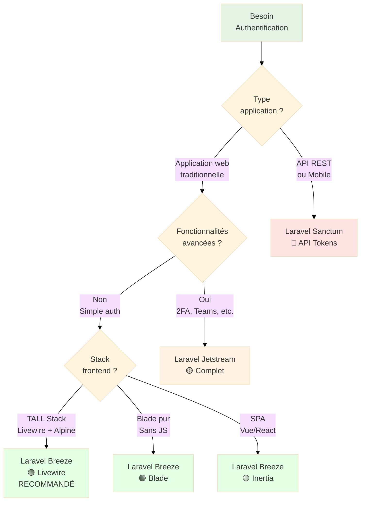

# Bonus : Authentification

<div
  class="omny-meta"
  data-level="🟡 Intermédiaire"
  data-version="1.0"
  data-time="90-120 minutes">
</div>

## Introduction

Après avoir déployé votre application en production (Module 9), il est temps d'ajouter une **fonctionnalité critique** pour la plupart des applications modernes : l'**authentification utilisateur**. Ce module bonus vous guide dans le choix et l'implémentation du système d'authentification optimal pour votre application TALL Tasks.

Imaginez que vous avez construit un immeuble sécurisé (Modules 1-9) avec portes, fenêtres, alarme. Maintenant, le Module 10 est le **système de badges et contrôle d'accès** : qui peut entrer (login), qui est déjà à l'intérieur (sessions), qui a des privilèges spéciaux (rôles), qui peut passer par l'entrée de service (API tokens). **Sans authentification, votre application est accessible à tous sans distinction.**

**Qu'est-ce que l'authentification apporte concrètement ?**

Sans authentification (Modules 1-9), vous aviez :
- Liste de tâches **partagée** par tous les visiteurs
- Aucune notion d'utilisateur ou de propriété
- Impossible de personnaliser l'expérience
- Aucune sécurité sur les données

Avec authentification (Module 10), **transformation complète** :
- **Chaque utilisateur** a sa propre liste de tâches
- **Login/Register** : Inscription et connexion sécurisées
- **Sessions persistantes** : Rester connecté entre visites
- **Protection routes** : Pages accessibles uniquement si connecté
- **Propriété données** : Un utilisateur voit UNIQUEMENT ses tâches
- **Options avancées** : 2FA, gestion profil, équipes (selon système choisi)

Ce module vous guidera pas à pas pour :

- **Comparer les 3 systèmes** : Breeze, Jetstream, Sanctum
- **Choisir le système optimal** selon vos besoins
- **Implémenter Laravel Breeze** (recommandé débutants TALL)
- **Protéger les routes** avec middleware `auth`
- **Lier les tâches aux utilisateurs** (relation Eloquent)
- **Gérer les sessions** et la déconnexion
- **Comprendre les alternatives** Jetstream (avancé) et Sanctum (API)

!!! quote "Principe du Module 10"
    "L'authentification transforme une application publique partagée en système multi-utilisateurs privé et sécurisé. C'est la fondation de toute application SaaS moderne."

---

## Objectifs d'Apprentissage

À la fin de ce module, **vous serez capable de** :

### Objectifs Techniques

- [ ] Installer Laravel Breeze avec stack Livewire + Alpine
- [ ] Configurer les routes d'authentification (login, register, logout)
- [ ] Protéger les routes avec middleware `auth`
- [ ] Créer une relation Eloquent User → Tasks (one-to-many)
- [ ] Filtrer les tâches par utilisateur connecté
- [ ] Gérer les sessions utilisateur (remember me, logout)
- [ ] Personnaliser les vues d'authentification (Blade)
- [ ] Implémenter la vérification email (optionnel)
- [ ] Gérer le reset mot de passe (forgot password)
- [ ] Comprendre les différences Breeze vs Jetstream vs Sanctum

### Objectifs Conceptuels

- [ ] Comprendre le cycle authentification (login → session → logout)
- [ ] Visualiser la différence authentification vs autorisation
- [ ] Maîtriser les concepts sessions, cookies, tokens
- [ ] Saisir l'importance du hashing mot de passe (bcrypt)
- [ ] Comprendre CSRF et sa protection automatique Laravel
- [ ] Anticiper les besoins authentification (simple vs avancé vs API)
- [ ] Comparer les 3 kits officiels Laravel (Breeze, Jetstream, Sanctum)
- [ ] Choisir le système optimal selon type d'application

---

## Prérequis

Avant de commencer ce module, **assurez-vous d'avoir** :

- [ ] **Modules 1-9 complétés** : Application TALL Tasks fonctionnelle en production
- [ ] **Compréhension Eloquent** : Relations, migrations, modèles
- [ ] **Compréhension middleware** : Concepts de base (sera approfondi)
- [ ] **Environnement dev** : Application locale ou serveur de test
- [ ] **90-120 minutes** devant vous sans interruption

!!! warning "Module Bonus = Optionnel"
    **Ce module est OPTIONNEL** mais **fortement recommandé** pour toute application destinée à plusieurs utilisateurs. Si votre application TALL Tasks est **purement personnelle** (1 seul utilisateur), vous pouvez sauter ce module.

!!! danger "Testez sur Environnement Dev"
    **N'installez PAS Breeze/Jetstream directement sur votre serveur production.** Testez d'abord sur environnement de développement local, puis déployez après validation.

---

## Comprendre Avant d'Agir : Les 3 Systèmes d'Authentification

Avant d'installer quoi que ce soit, comprenons **les 3 kits officiels Laravel** et leurs différences.

### Vue d'Ensemble des 3 Kits

**Tableau comparatif synthétique :**

| Kit | Niveau | Fonctionnalités | Stack Frontend | Cas d'usage |
|-----|:------:|----------------|----------------|-------------|
| **Laravel Breeze** | 🟢 Débutant | Login, Register, Reset password, Email verification | Blade + Tailwind<br/>Livewire + Alpine<br/>Inertia + Vue/React | Applications simples, apprentissage, prototypes |
| **Laravel Jetstream** | 🟡 Intermédiaire | Breeze + 2FA, Profile, Teams, API Tokens | Livewire + Alpine<br/>Inertia + Vue | SaaS professionnels, applications entreprise |
| **Laravel Sanctum** | 🔴 Avancé | API Tokens, SPA Authentication | Agnostique (API REST) | API REST, applications mobiles, SPA (React/Vue/Angular) |

### Diagramme de Décision : Quel Kit Choisir ?

Ce diagramme vous aide à **choisir le kit optimal** selon votre contexte.

**Comment lire ce diagramme ?**

- Suivez les **flèches** en répondant aux questions
- **Les rectangles verts** sont les recommandations



<small>*Ce diagramme de décision guide le choix du kit d'authentification. Question 1 : Type d'application ? API REST/Mobile → Sanctum. Application web → Question 2 : Fonctionnalités avancées (2FA, Teams) ? Oui → Jetstream. Non → Question 3 : Stack frontend ? TALL Stack (Livewire + Alpine) → **Breeze Livewire RECOMMANDÉ** (idéal pour nos Modules 1-9). Blade pur → Breeze Blade. SPA (Vue/React) → Breeze Inertia. Pour ce cours TALL Stack, nous utilisons Breeze Livewire.*</small>

### Comparaison Détaillée des 3 Kits

#### Laravel Breeze (🟢 Notre Choix)

**Qu'est-ce que Breeze ?**

Laravel Breeze est le **kit d'authentification minimaliste** officiel de Laravel. Il fournit une **implémentation simple et élégante** de toutes les fonctionnalités d'authentification de base.

**Tableau des fonctionnalités Breeze :**

| Fonctionnalité | Inclus | Description |
|----------------|:------:|-------------|
| **Login** | ✅ | Connexion email + mot de passe |
| **Register** | ✅ | Inscription nouveaux utilisateurs |
| **Logout** | ✅ | Déconnexion avec invalidation session |
| **Forgot Password** | ✅ | Reset mot de passe par email |
| **Email Verification** | ✅ | Vérification email après inscription |
| **Profile Update** | ✅ | Modifier nom, email, mot de passe |
| **Remember Me** | ✅ | Rester connecté entre sessions |
| **2FA (Two-Factor)** | ❌ | Authentification double facteur |
| **Teams** | ❌ | Gestion équipes multi-utilisateurs |
| **API Tokens** | ❌ | Tokens pour API REST |

**Stacks frontend disponibles :**

```bash
# Option 1 : Blade + Tailwind (classique)
php artisan breeze:install blade

# Option 2 : Livewire + Alpine (TALL Stack - NOTRE CHOIX)
php artisan breeze:install livewire

# Option 3 : Inertia + Vue
php artisan breeze:install vue

# Option 4 : Inertia + React
php artisan breeze:install react
```

**Avantages Breeze :**

- ✅ **Simplicité** : Code minimaliste, facile à comprendre et personnaliser
- ✅ **Léger** : ~15 fichiers, aucune dépendance lourde
- ✅ **Pédagogique** : Idéal pour apprendre l'authentification Laravel
- ✅ **Tailwind CSS** : Design moderne intégré
- ✅ **Multi-stack** : Blade, Livewire, Vue, React au choix

**Inconvénients Breeze :**

- ❌ **Pas de 2FA** : Si besoin authentification double facteur, utilisez Jetstream
- ❌ **Pas de Teams** : Si besoin gestion équipes, utilisez Jetstream
- ❌ **Pas d'API Tokens** : Si besoin API REST, utilisez Sanctum

!!! tip "Pourquoi Breeze pour TALL Stack ?"
    **Breeze Livewire est parfait** car il utilise **exactement la même stack** que nos Modules 6-8 (Livewire + Alpine + Tailwind). Cohérence maximale avec le reste de l'application.

---

#### Laravel Jetstream (🟡 Avancé)

**Qu'est-ce que Jetstream ?**

Laravel Jetstream est le **kit d'authentification complet** pour applications professionnelles. Il inclut **toutes les fonctionnalités Breeze PLUS** des features avancées.

**Tableau des fonctionnalités Jetstream :**

| Fonctionnalité | Breeze | Jetstream | Description |
|----------------|:------:|:---------:|-------------|
| Login, Register, Logout | ✅ | ✅ | Basiques authentification |
| Reset Password | ✅ | ✅ | Forgot password par email |
| Email Verification | ✅ | ✅ | Vérification email |
| Profile Management | ✅ | ✅ | Modifier profil utilisateur |
| **Two-Factor (2FA)** | ❌ | ✅ | Authentification double facteur (TOTP) |
| **Teams** | ❌ | ✅ | Gestion équipes multi-utilisateurs + invitations |
| **API Tokens** | ❌ | ✅ | Tokens personnels pour API REST |
| **Sessions actives** | ❌ | ✅ | Voir/révoquer sessions navigateurs |
| **Delete Account** | ❌ | ✅ | Suppression compte utilisateur |

**Stacks frontend disponibles :**

```bash
# Option 1 : Livewire + Alpine (TALL Stack)
php artisan jetstream:install livewire

# Option 2 : Inertia + Vue
php artisan jetstream:install inertia
```

**Avantages Jetstream :**

- ✅ **Complet** : Toutes les features entreprise out-of-the-box
- ✅ **2FA intégré** : Sécurité renforcée avec Google Authenticator
- ✅ **Teams** : Gestion équipes, invitations, rôles (owner, admin, member)
- ✅ **API Tokens** : Génération tokens pour consommer API
- ✅ **Production-ready** : Utilisé par des milliers d'applications SaaS

**Inconvénients Jetstream :**

- ❌ **Complexe** : Beaucoup de code, courbe apprentissage élevée
- ❌ **Opinionated** : Choix architecturaux imposés (Fortify, Actions)
- ❌ **Lourd** : ~100+ fichiers générés, difficile à personnaliser

!!! warning "Jetstream = Overkill pour Débutants"
    **Si vous apprenez Laravel/TALL**, commencez par **Breeze**. Jetstream est **trop complexe** pour débuter et peut masquer les mécanismes d'authentification Laravel.

---

#### Laravel Sanctum (🔴 API)

**Qu'est-ce que Sanctum ?**

Laravel Sanctum est un **système d'authentification par tokens** pour API REST et SPA (Single Page Applications). Il **NE fournit PAS d'interface utilisateur**, uniquement l'authentification backend.

**Tableau des cas d'usage Sanctum :**

| Cas d'usage | Description | Exemple |
|-------------|-------------|---------|
| **API Tokens** | Tokens personnels pour applications tierces | Application mobile consommant API Laravel |
| **SPA Authentication** | Cookies sécurisés pour SPA same-domain | React/Vue app sur `app.example.com` consommant API `api.example.com` |
| **Mobile Apps** | Tokens pour applications iOS/Android | Application mobile native avec backend Laravel |

**Fonctionnalités Sanctum :**

| Fonctionnalité | Description |
|----------------|-------------|
| **Token API** | Génération tokens personnels (Bearer) |
| **Cookie SPA** | Authentification SPA via cookies httpOnly |
| **Abilities** | Permissions granulaires par token (scopes) |
| **Expiration** | Tokens avec durée de vie configurable |
| **Révocation** | Supprimer tokens compromis |

**Avantages Sanctum :**

- ✅ **Léger** : Aucune interface UI, juste authentification backend
- ✅ **Flexible** : S'adapte à tout frontend (React, Vue, mobile)
- ✅ **Sécurisé** : Tokens révocables, abilities granulaires
- ✅ **Moderne** : Standard pour API REST modernes

**Inconvénients Sanctum :**

- ❌ **Pas d'UI** : Vous devez créer login/register vous-même
- ❌ **Complexe** : Gestion tokens, CORS, SPA cookies
- ❌ **API-first** : Inadapté pour applications web traditionnelles

!!! info "Sanctum vs Passport"
    **Laravel Sanctum** : Tokens simples, SPA, mobile (recommandé 90% des cas)
    **Laravel Passport** : OAuth2 complet, applications tierces complexes (overkill généralement)

---

## Phase 1 — Installation Laravel Breeze (Étapes 1 à 3)

### Étape 1 : Installer Laravel Breeze

**Pour notre application TALL Tasks, nous utilisons Breeze avec stack Livewire.**

**Installation via Composer :**

```bash
# Naviguer vers le projet
cd /chemin/vers/tall-tasks

# Installer Breeze via Composer
composer require laravel/breeze --dev

# Résultat attendu :
# Using version ^2.x for laravel/breeze
# ...
# Package operations: 1 install
```

!!! info "Pourquoi --dev ?"
    **`--dev`** installe Breeze dans `require-dev` car le scaffolding est **uniquement nécessaire pendant développement**. Une fois les fichiers générés, Breeze n'est plus utilisé.

---

### Étape 2 : Installer Stack Livewire

**Générer les fichiers d'authentification avec stack Livewire :**

```bash
# Installer Breeze avec Livewire + Alpine
php artisan breeze:install livewire

# Questions interactives (répondre selon besoins) :
# ┌ Would you like to install dark mode support?  ───────────┐
# │ ○ Yes / ● No                                             │
# └──────────────────────────────────────────────────────────┘
# → Choisir "No" (optionnel, ajoutez si vous voulez dark mode)

# ┌ Which testing framework do you prefer? ──────────────────┐
# │ ● PHPUnit / ○ Pest                                       │
# └──────────────────────────────────────────────────────────┘
# → Choisir "PHPUnit" (ou Pest si vous préférez)
```

**Ce qui se passe :**

1. **Génération fichiers** : Contrôleurs, composants Livewire, vues Blade
2. **Création routes** : `routes/auth.php` avec toutes les routes authentification
3. **Installation dépendances** : NPM packages si nécessaire
4. **Configuration** : Middleware, guards, providers

**Fichiers générés :**

```
app/
├── Http/
│   └── Controllers/
│       └── Auth/  # Contrôleurs authentification
│           ├── AuthenticatedSessionController.php  # Login/Logout
│           ├── RegisteredUserController.php        # Register
│           ├── PasswordResetLinkController.php     # Forgot password
│           └── ...
├── Livewire/
│   └── Pages/
│       └── Auth/  # Composants Livewire authentification
│           ├── Login.php
│           ├── Register.php
│           └── ...
resources/
└── views/
    ├── auth/  # Vues Blade authentification
    │   ├── login.blade.php
    │   ├── register.blade.php
    │   └── ...
    └── layouts/
        ├── app.blade.php   # Layout principal (modifié)
        └── guest.blade.php # Layout pour pages publiques (login, register)
routes/
├── auth.php  # Toutes les routes authentification
└── web.php   # Routes principales (modifiées)
```

---

### Étape 3 : Migrer et Compiler Assets

**Exécuter les migrations :**

```bash
# Exécuter migrations (crée tables users, password_resets, etc.)
php artisan migrate

# Résultat attendu :
#   INFO  Running migrations.
#
#   2014_10_12_000000_create_users_table ........ DONE
#   2014_10_12_100000_create_password_reset_tokens_table ... DONE
#   2019_08_19_000000_create_failed_jobs_table ... DONE
#   2019_12_14_000001_create_personal_access_tokens_table ... DONE
```

**Compiler les assets :**

```bash
# Installer dépendances NPM (si pas déjà fait)
npm install

# Compiler assets en développement
npm run dev

# OU build production
npm run build
```

**Démarrer le serveur :**

```bash
# Démarrer serveur dev
php artisan serve

# Ouvrir navigateur
# http://localhost:8000
```

**Vérifier l'installation :**

Vous devriez maintenant voir des **liens "Log in" et "Register"** en haut à droite de votre application !

!!! success "Breeze Installé"
    Si vous voyez les liens "Log in" et "Register", Breeze est correctement installé !

> Ainsi s'achève la Phase 1 - Installation Laravel Breeze (Étapes 1-3)

---

## Phase 2 — Protection des Routes (Étapes 4 à 5)

### Étape 4 : Comprendre les Middlewares Auth

**Qu'est-ce qu'un middleware ?**

Un **middleware** est un **filtre** qui s'exécute **avant** qu'une requête atteigne le contrôleur.

**Diagramme flux middleware :**

```
Requête HTTP → Middleware → Contrôleur → Réponse
                    ↓
                Si auth: Continuer
                Si guest: Redirect /login
```

**Middleware `auth` expliqué :**

```php
// Route SANS protection (accessible à tous)
Route::get('/public', function () {
    return 'Page publique';
});

// Route AVEC protection (accessible uniquement si connecté)
Route::get('/private', function () {
    return 'Page privée';
})->middleware('auth');

// Si utilisateur non connecté → Redirect vers /login
// Si utilisateur connecté → Accès autorisé
```

**Fichier :** `routes/web.php` (après installation Breeze)

```php
<?php

use Illuminate\Support\Facades\Route;
use App\Livewire\HybridTaskManager;

// Page d'accueil (publique, redirige vers login si non connecté)
Route::get('/', function () {
    return redirect()->route('login');
});

// Routes authentification (générées par Breeze)
require __DIR__.'/auth.php';

// Routes protégées (accessible UNIQUEMENT si connecté)
Route::middleware(['auth'])->group(function () {
    
    // Dashboard (page après login)
    Route::get('/dashboard', function () {
        return view('dashboard');
    })->name('dashboard');
    
    // Application TALL Tasks (protégée)
    Route::get('/tasks', HybridTaskManager::class)->name('tasks.index');
    
});
```

**Explication :**

```php
// Grouper routes avec middleware auth
Route::middleware(['auth'])->group(function () {
    // Toutes les routes ici nécessitent authentification
});

// Équivalent à (mais plus propre) :
Route::get('/tasks', HybridTaskManager::class)->middleware('auth');
```

!!! tip "Middleware verified (Email Verification)"
    **Si vous activez email verification**, ajoutez aussi `verified` :
    
    ```php
    Route::middleware(['auth', 'verified'])->group(function () {
        // Routes nécessitant email vérifié
    });
    ```

---

### Étape 5 : Personnaliser Navigation

**Modifier le layout principal pour afficher login/logout :**

**Fichier :** `resources/views/layouts/app.blade.php`

```html
<!DOCTYPE html>
<html lang="fr">
<head>
    <meta charset="UTF-8">
    <meta name="viewport" content="width=device-width, initial-scale=1.0">
    <meta name="csrf-token" content="{{ csrf_token() }}">
    
    <title>@yield('title', 'TALL Tasks - Gestion de Tâches')</title>
    
    @vite(['resources/css/app.css', 'resources/js/app.js'])
    @livewireStyles
    <script defer src="https://cdn.jsdelivr.net/npm/alpinejs@3.x.x/dist/cdn.min.js"></script>
</head>
<body class="bg-gray-100 min-h-screen">
    <header class="bg-white shadow-sm">
        <div class="max-w-4xl mx-auto px-4 py-6 flex items-center justify-between">
            <div>
                <h1 class="text-3xl font-bold text-gray-900">
                    📋 TALL Tasks
                </h1>
                <p class="text-sm text-gray-600 mt-1">
                    Gestion moderne de vos tâches quotidiennes
                </p>
            </div>
            
            {{-- Navigation utilisateur --}}
            <nav class="flex items-center space-x-4">
                @auth
                    {{-- Si utilisateur connecté --}}
                    <span class="text-sm text-gray-600">
                        Bonjour, <strong>{{ Auth::user()->name }}</strong>
                    </span>
                    
                    <a href="{{ route('dashboard') }}" class="text-sm text-blue-600 hover:underline">
                        Dashboard
                    </a>
                    
                    <a href="{{ route('tasks.index') }}" class="text-sm text-blue-600 hover:underline">
                        Mes tâches
                    </a>
                    
                    {{-- Formulaire logout --}}
                    <form method="POST" action="{{ route('logout') }}" class="inline">
                        @csrf
                        <button type="submit" class="text-sm text-red-600 hover:underline">
                            Déconnexion
                        </button>
                    </form>
                @else
                    {{-- Si utilisateur NON connecté --}}
                    <a href="{{ route('login') }}" class="text-sm text-blue-600 hover:underline">
                        Connexion
                    </a>
                    
                    <a href="{{ route('register') }}" class="text-sm text-green-600 hover:underline">
                        Inscription
                    </a>
                @endauth
            </nav>
        </div>
    </header>

    <main class="max-w-4xl mx-auto px-4 py-8">
        @if(session('success'))
            <div class="bg-green-100 border border-green-400 text-green-700 px-4 py-3 rounded mb-6">
                {{ session('success') }}
            </div>
        @endif

        @yield('content')
    </main>

    <footer class="bg-white border-t mt-12">
        <div class="max-w-4xl mx-auto px-4 py-6 text-center text-gray-600 text-sm">
            <p>
                TALL Tasks &copy; {{ date('Y') }} - 
                Construit avec 
                <span class="text-red-500">♥</span> 
                et la Stack TALL
            </p>
        </div>
    </footer>

    @livewireScripts
</body>
</html>
```

**Directives Blade utilisées :**

| Directive | Rôle | Exemple |
|-----------|------|---------|
| `@auth` | Afficher si connecté | `@auth <p>Connecté</p> @endauth` |
| `@guest` | Afficher si NON connecté | `@guest <p>Visiteur</p> @endguest` |
| `Auth::user()` | Récupérer utilisateur | `{{ Auth::user()->name }}` |
| `Auth::check()` | Vérifier si connecté | `@if(Auth::check()) ... @endif` |

> Ainsi s'achève la Phase 2 - Protection des Routes (Étapes 4-5)

---

## Phase 3 — Relation User ↔ Tasks (Étapes 6 à 8)

### Étape 6 : Ajouter Colonne `user_id` aux Tasks

**Créer migration pour ajouter `user_id` :**

```bash
# Créer migration
php artisan make:migration add_user_id_to_tasks_table

# Résultat attendu :
# Created Migration: YYYY_MM_DD_XXXXXX_add_user_id_to_tasks_table
```

**Fichier :** `database/migrations/YYYY_MM_DD_XXXXXX_add_user_id_to_tasks_table.php`

```php
<?php

use Illuminate\Database\Migrations\Migration;
use Illuminate\Database\Schema\Blueprint;
use Illuminate\Support\Facades\Schema;

return new class extends Migration
{
    /**
     * Ajouter colonne user_id à la table tasks
     */
    public function up(): void
    {
        Schema::table('tasks', function (Blueprint $table) {
            // Ajouter colonne user_id (clé étrangère)
            $table->foreignId('user_id')
                  ->after('id')              // Positionner après 'id'
                  ->constrained()            // Contrainte FK vers 'users.id'
                  ->onDelete('cascade');     // Supprimer tâches si user supprimé
        });
    }

    /**
     * Annuler la migration
     */
    public function down(): void
    {
        Schema::table('tasks', function (Blueprint $table) {
            // Supprimer contrainte FK puis colonne
            $table->dropForeign(['user_id']);
            $table->dropColumn('user_id');
        });
    }
};
```

**Exécuter la migration :**

```bash
# Appliquer migration
php artisan migrate

# Résultat attendu :
#   INFO  Running migrations.
#
#   YYYY_MM_DD_XXXXXX_add_user_id_to_tasks_table ... DONE
```

!!! warning "Données Existantes"
    **Si vous avez déjà des tâches** dans la BDD, cette migration **échouera** car `user_id` ne peut pas être NULL.
    
    **Solutions :**
    
    1. **Supprimer tâches** : `php artisan migrate:fresh` (⚠️ perte données)
    2. **Assigner utilisateur par défaut** : Modifier migration pour mettre `user_id = 1` sur tâches existantes
    3. **Rendre nullable temporairement** : `$table->foreignId('user_id')->nullable()` puis remplir manuellement

---

### Étape 7 : Définir Relations Eloquent

**Modifier modèle Task :**

**Fichier :** `app/Models/Task.php`

```php
<?php

namespace App\Models;

use Illuminate\Database\Eloquent\Model;
use Illuminate\Database\Eloquent\Relations\BelongsTo;

class Task extends Model
{
    protected $fillable = [
        'user_id',      // ✅ Ajouter user_id
        'title',
        'description',
        'completed'
    ];

    protected $casts = [
        'completed' => 'boolean',
    ];

    /**
     * Relation : Une tâche appartient à un utilisateur
     * 
     * @return BelongsTo
     */
    public function user(): BelongsTo
    {
        return $this->belongsTo(User::class);
    }
}
```

**Modifier modèle User :**

**Fichier :** `app/Models/User.php`

```php
<?php

namespace App\Models;

use Illuminate\Foundation\Auth\User as Authenticatable;
use Illuminate\Notifications\Notifiable;
use Illuminate\Database\Eloquent\Relations\HasMany;

class User extends Authenticatable
{
    use Notifiable;

    protected $fillable = [
        'name',
        'email',
        'password',
    ];

    protected $hidden = [
        'password',
        'remember_token',
    ];

    protected function casts(): array
    {
        return [
            'email_verified_at' => 'datetime',
            'password' => 'hashed',
        ];
    }

    /**
     * Relation : Un utilisateur a plusieurs tâches
     * 
     * @return HasMany
     */
    public function tasks(): HasMany
    {
        return $this->hasMany(Task::class);
    }
}
```

**Comprendre les relations :**

```php
// User → Tasks (one-to-many)
$user = User::find(1);
$tasks = $user->tasks;  // Collection de tâches de cet utilisateur

// Task → User (belongs-to)
$task = Task::find(1);
$owner = $task->user;   // L'utilisateur propriétaire de cette tâche
```

---

### Étape 8 : Filtrer Tâches par Utilisateur

**Modifier composant HybridTaskManager :**

**Fichier :** `app/Livewire/HybridTaskManager.php`

```php
<?php

namespace App\Livewire;

use App\Models\Task;
use Livewire\Component;
use Livewire\Attributes\Validate;
use Livewire\Attributes\On;
use Livewire\Attributes\Computed;
use Illuminate\Support\Facades\Auth;

class HybridTaskManager extends Component
{
    #[Validate('required|max:255')]
    public $title = '';

    #[Validate('nullable')]
    public $description = '';

    public $filter = 'all';
    public $searchTerm = '';

    /**
     * Créer une nouvelle tâche (avec user_id)
     */
    public function save()
    {
        $validated = $this->validate();

        // ✅ Assigner user_id de l'utilisateur connecté
        Task::create([
            'user_id' => Auth::id(),  // ID utilisateur connecté
            'title' => $validated['title'],
            'description' => $validated['description'],
        ]);

        $this->reset(['title', 'description']);
        $this->dispatch('task-created');
        session()->flash('success', 'Tâche créée avec succès !');
    }

    public function toggle($taskId)
    {
        // ✅ Vérifier que la tâche appartient à l'utilisateur
        $task = Task::where('id', $taskId)
                    ->where('user_id', Auth::id())
                    ->firstOrFail();
        
        $task->update(['completed' => !$task->completed]);
        $this->dispatch('task-toggled', taskId: $task->id);
    }

    public function delete($taskId)
    {
        // ✅ Vérifier que la tâche appartient à l'utilisateur
        $task = Task::where('id', $taskId)
                    ->where('user_id', Auth::id())
                    ->firstOrFail();
        
        $task->delete();
        $this->dispatch('task-deleted', taskId: $taskId);
        session()->flash('success', 'Tâche supprimée avec succès !');
    }

    #[On('filter-changed')]
    public function handleFilterChange($filter)
    {
        $this->filter = $filter;
    }

    /**
     * ✅ Filtrer UNIQUEMENT les tâches de l'utilisateur connecté
     */
    #[Computed]
    public function tasks()
    {
        $query = Task::where('user_id', Auth::id());  // ✅ Filtre par user

        // Appliquer filtre statut
        if ($this->filter === 'active') {
            $query->where('completed', false);
        } elseif ($this->filter === 'completed') {
            $query->where('completed', true);
        }

        // Appliquer recherche
        if (!empty($this->searchTerm)) {
            $query->where('title', 'like', '%' . $this->searchTerm . '%');
        }

        return $query->get();
    }

    /**
     * ✅ Compteurs pour l'utilisateur connecté uniquement
     */
    #[Computed]
    public function counts()
    {
        return [
            'all' => Task::where('user_id', Auth::id())->count(),
            'active' => Task::where('user_id', Auth::id())->where('completed', false)->count(),
            'completed' => Task::where('user_id', Auth::id())->where('completed', true)->count(),
        ];
    }

    public function render()
    {
        return view('livewire.hybrid-task-manager');
    }
}
```

**Changements clés :**

```php
// ✅ AVANT (sans auth) : Toutes les tâches
Task::all()

// ✅ APRÈS (avec auth) : Uniquement tâches utilisateur connecté
Task::where('user_id', Auth::id())->get()
```

!!! danger "Sécurité Critique"
    **Toujours vérifier `user_id`** dans les méthodes `toggle()` et `delete()` :
    
    ```php
    // ❌ DANGEREUX (pas de vérification user_id)
    $task = Task::findOrFail($taskId);
    // Un utilisateur pourrait modifier/supprimer tâches d'un autre !
    
    // ✅ SÉCURISÉ (vérification user_id)
    $task = Task::where('id', $taskId)
                ->where('user_id', Auth::id())
                ->firstOrFail();
    // Erreur 404 si tâche n'appartient pas à l'utilisateur
    ```

> Ainsi s'achève la Phase 3 - Relation User ↔ Tasks (Étapes 6-8)

---

## Phase 4 — Tests et Vérifications (Étapes 9 à 10)

### Étape 9 : Tester le Flux Complet

**Scénario de test complet :**

1. **Inscription** : Créer compte utilisateur
2. **Login** : Se connecter
3. **Créer tâches** : Ajouter plusieurs tâches
4. **Logout** : Se déconnecter
5. **Créer 2ème utilisateur** : Autre compte
6. **Vérifier isolation** : User 2 ne voit pas tâches User 1

**Test 1 : Inscription**

```
1. Ouvrir http://localhost:8000
2. Cliquer "Inscription"
3. Remplir formulaire :
   - Nom : John Doe
   - Email : john@example.com
   - Password : password123
   - Confirm Password : password123
4. Soumettre
5. Résultat attendu : Redirect vers /dashboard
```

**Test 2 : Créer Tâches**

```
1. Naviguer vers "Mes tâches" (/tasks)
2. Créer 3 tâches :
   - "Tâche 1 de John"
   - "Tâche 2 de John"
   - "Tâche 3 de John"
3. Vérifier qu'elles apparaissent toutes
```

**Test 3 : Logout et 2ème Utilisateur**

```
1. Cliquer "Déconnexion"
2. Créer 2ème compte :
   - Nom : Jane Smith
   - Email : jane@example.com
3. Se connecter avec Jane
4. Naviguer vers "Mes tâches"
5. Résultat attendu : AUCUNE tâche (liste vide)
6. Créer tâche : "Tâche de Jane"
7. Vérifier : Uniquement "Tâche de Jane" visible
```

**Vérification BDD :**

```sql
-- Connexion MySQL
mariadb -u tall_tasks_user -p tall_tasks_prod

-- Vérifier users créés
SELECT id, name, email FROM users;
-- Doit afficher :
-- +----+-------------+-------------------+
-- | id | name        | email             |
-- +----+-------------+-------------------+
-- |  1 | John Doe    | john@example.com  |
-- |  2 | Jane Smith  | jane@example.com  |
-- +----+-------------+-------------------+

-- Vérifier tâches avec user_id
SELECT id, user_id, title FROM tasks;
-- Doit afficher :
-- +----+---------+------------------+
-- | id | user_id | title            |
-- +----+---------+------------------+
-- |  1 |       1 | Tâche 1 de John  |
-- |  2 |       1 | Tâche 2 de John  |
-- |  3 |       1 | Tâche 3 de John  |
-- |  4 |       2 | Tâche de Jane    |
-- +----+---------+------------------+

EXIT;
```

!!! success "Isolation Utilisateurs Validée"
    Si John ne voit pas les tâches de Jane et vice-versa, l'isolation fonctionne parfaitement !

---

### Étape 10 : Personnaliser Messages

**Personnaliser page Dashboard :**

**Fichier :** `resources/views/dashboard.blade.php`

```html
<x-app-layout>
    <x-slot name="header">
        <h2 class="font-semibold text-xl text-gray-800 leading-tight">
            {{ __('Dashboard') }}
        </h2>
    </x-slot>

    <div class="py-12">
        <div class="max-w-7xl mx-auto sm:px-6 lg:px-8">
            <div class="bg-white overflow-hidden shadow-sm sm:rounded-lg">
                <div class="p-6 text-gray-900">
                    <h3 class="text-2xl font-bold mb-4">
                        Bienvenue, {{ Auth::user()->name }} ! 👋
                    </h3>
                    
                    <p class="text-gray-600 mb-6">
                        Vous êtes connecté à votre application TALL Tasks.
                    </p>
                    
                    {{-- Statistiques --}}
                    <div class="grid grid-cols-1 md:grid-cols-3 gap-4 mb-6">
                        <div class="bg-blue-50 border border-blue-200 rounded-lg p-4">
                            <p class="text-sm text-blue-600 font-medium">Total Tâches</p>
                            <p class="text-3xl font-bold text-blue-900">
                                {{ Auth::user()->tasks()->count() }}
                            </p>
                        </div>
                        
                        <div class="bg-green-50 border border-green-200 rounded-lg p-4">
                            <p class="text-sm text-green-600 font-medium">Terminées</p>
                            <p class="text-3xl font-bold text-green-900">
                                {{ Auth::user()->tasks()->where('completed', true)->count() }}
                            </p>
                        </div>
                        
                        <div class="bg-yellow-50 border border-yellow-200 rounded-lg p-4">
                            <p class="text-sm text-yellow-600 font-medium">En cours</p>
                            <p class="text-3xl font-bold text-yellow-900">
                                {{ Auth::user()->tasks()->where('completed', false)->count() }}
                            </p>
                        </div>
                    </div>
                    
                    {{-- Actions --}}
                    <div class="flex space-x-4">
                        <a href="{{ route('tasks.index') }}" 
                           class="inline-flex items-center px-4 py-2 bg-blue-600 border border-transparent rounded-md font-semibold text-xs text-white uppercase tracking-widest hover:bg-blue-700">
                            📝 Gérer mes tâches
                        </a>
                        
                        <a href="{{ route('profile.edit') }}" 
                           class="inline-flex items-center px-4 py-2 bg-gray-600 border border-transparent rounded-md font-semibold text-xs text-white uppercase tracking-widest hover:bg-gray-700">
                            ⚙️ Modifier mon profil
                        </a>
                    </div>
                </div>
            </div>
        </div>
    </div>
</x-app-layout>
```

> Ainsi s'achève la Phase 4 - Tests et Vérifications (Étapes 9-10)

---

## Le Mot de la Fin

### FÉLICITATIONS ! Votre application est multi-utilisateurs.

!!! success "Authentification Complète Implémentée"

**Compétences Techniques Acquises :**

- ✅ **Laravel Breeze installé** avec stack Livewire + Alpine
- ✅ **Routes protégées** avec middleware `auth`
- ✅ **Relation User ↔ Tasks** (one-to-many) configurée
- ✅ **Colonne user_id** ajoutée avec migration
- ✅ **Filtrage par utilisateur** dans toutes les requêtes
- ✅ **Sécurité renforcée** : Vérification user_id avant modification/suppression
- ✅ **Navigation personnalisée** : Login/Logout/Register
- ✅ **Dashboard utilisateur** avec statistiques personnalisées

**Compétences Conceptuelles Acquises :**

- ✅ **Cycle authentification** : Register → Login → Session → Logout
- ✅ **Différence auth vs guest** : Middleware, directives Blade
- ✅ **Relations Eloquent** : belongsTo, hasMany, eager loading
- ✅ **Sécurité données** : Isolation utilisateurs, vérification propriété
- ✅ **Choix système auth** : Breeze vs Jetstream vs Sanctum
- ✅ **Sessions Laravel** : Cookies, remember me, guards
- ✅ **Protection CSRF** : Automatique Laravel, tokens
- ✅ **Hashing passwords** : bcrypt automatique Laravel

### Points Clés à Retenir

Retenez ces **8 principes fondamentaux** de l'authentification Laravel :

1. **Breeze = Parfait pour TALL Stack** : Livewire + Alpine intégré, simple et extensible
2. **Middleware auth obligatoire** : Protéger routes sensibles avec `middleware('auth')`
3. **Relation User ↔ Resources** : Toujours lier ressources à utilisateurs (user_id)
4. **Vérifier user_id TOUJOURS** : Sécurité critique avant modification/suppression
5. **Auth::id() vs Auth::user()** : `id()` retourne ID, `user()` retourne objet User
6. **Directives @auth/@guest** : Affichage conditionnel dans vues
7. **Password hashing automatique** : Laravel hash automatiquement (bcrypt/argon2)
8. **Sessions sécurisées** : httpOnly cookies, CSRF protection, secure flag HTTPS

### Tableau Comparaison Avant/Après Module 10

| Aspect | Avant Module 10 | Après Module 10 |
|--------|:---------------:|:---------------:|
| **Utilisateurs** | ❌ Aucun (application partagée) | ✅ **Multi-utilisateurs** |
| **Authentification** | ❌ Aucune | ✅ **Login/Register/Logout** |
| **Isolation données** | ❌ Toutes tâches visibles | ✅ **Chaque user ses tâches** |
| **Routes protégées** | ❌ Accessibles à tous | ✅ **Middleware auth** |
| **Sécurité** | ⚠️ Vulnérable | ✅ **Sécurisée (user_id)** |
| **Sessions** | ❌ Aucune | ✅ **Persistantes + Remember me** |
| **Profil utilisateur** | ❌ N'existe pas | ✅ **Dashboard + Stats** |
| **Production-ready** | ⚠️ App démo | ✅ **SaaS multi-tenant** |

### Aller Plus Loin (Optionnel)

**Fonctionnalités avancées à implémenter :**

**1. Vérification Email :**

```php
// Activer dans User.php
use Illuminate\Contracts\Auth\MustVerifyEmail;

class User extends Authenticatable implements MustVerifyEmail
{
    // ...
}

// Protéger routes
Route::middleware(['auth', 'verified'])->group(function () {
    // Routes nécessitant email vérifié
});
```

**2. Roles et Permissions (avec Spatie) :**

```bash
composer require spatie/laravel-permission
php artisan vendor:publish --provider="Spatie\Permission\PermissionServiceProvider"
php artisan migrate
```

```php
// Assigner rôles
$user->assignRole('admin');

// Vérifier permissions
if ($user->can('edit tasks')) {
    // Autoriser
}
```

**3. Upgrade vers Jetstream (2FA + Teams) :**

```bash
# Installer Jetstream
composer require laravel/jetstream
php artisan jetstream:install livewire
npm install && npm run build
php artisan migrate
```

**4. API avec Sanctum :**

```bash
composer require laravel/sanctum
php artisan vendor:publish --provider="Laravel\Sanctum\SanctumServiceProvider"
php artisan migrate
```

### Ressources Complémentaires

**Documentation officielle :**

- [Laravel Authentication](https://laravel.com/docs/authentication)
- [Laravel Breeze](https://laravel.com/docs/starter-kits#laravel-breeze)
- [Laravel Jetstream](https://jetstream.laravel.com)
- [Laravel Sanctum](https://laravel.com/docs/sanctum)

**Packages recommandés :**

- **spatie/laravel-permission** : Roles et permissions
- **laravel/socialite** : OAuth (Google, GitHub, Facebook)
- **pragmarx/google2fa-laravel** : 2FA Google Authenticator
- **lab404/laravel-impersonate** : Se connecter en tant qu'utilisateur (admin)

---

[^1]: **Laravel Breeze** : Kit authentification minimaliste officiel Laravel. Fonctionnalités : Login, Register, Reset password, Email verification, Profile. Stacks : Blade, Livewire, Vue (Inertia), React (Inertia). ~15 fichiers générés. Idéal apprentissage et prototypes. Remplace Laravel UI (deprecated).

[^2]: **Laravel Jetstream** : Kit authentification complet pour applications entreprise. Fonctionnalités : Breeze + 2FA (TOTP), Teams multi-utilisateurs, API Tokens, Sessions management. Stacks : Livewire ou Inertia + Vue. Utilise Laravel Fortify (backend auth). ~100+ fichiers. Production SaaS professionnels.

[^3]: **Laravel Sanctum** : Système authentification API tokens et SPA. Fonctionnalités : Personal Access Tokens (PAT), SPA cookie authentication, Abilities (scopes). Usage : API REST, applications mobiles, SPA same-domain. Pas d'UI fournie (backend only). Remplace Laravel Passport pour 90% des cas (OAuth2 simple).

[^4]: **Middleware** : Filtre HTTP exécuté avant contrôleur. Middleware `auth` vérifie utilisateur authentifié, redirige `/login` sinon. Middleware `guest` inverse (redirige `/dashboard` si authentifié). Middleware `verified` vérifie email. Application : `Route::middleware(['auth'])->group(...)` ou `->middleware('auth')`.

[^5]: **Relations Eloquent** : Liaisons entre modèles. `hasMany()` : User a plusieurs Tasks. `belongsTo()` : Task appartient à User. `belongsToMany()` : Many-to-many (ex: User ↔ Roles avec table pivot). Eager loading : `$user->with('tasks')` charge relations en 1 requête. Lazy loading : `$user->tasks` charge à la demande.

[^6]: **Hashing Passwords** : Laravel hash automatiquement passwords avec bcrypt (ou argon2). Configuration `config/hashing.php`. Jamais stocker passwords plain text. `Hash::make('password')` hash, `Hash::check('input', $hash)` vérifie. Attribut `'password' => 'hashed'` dans `$casts` hash automatiquement.

[^7]: **Sessions Laravel** : Stockage état utilisateur entre requêtes HTTP. Drivers : file (défaut), database, redis, memcached. Configuration `config/session.php`. Session ID stocké dans cookie httpOnly. Remember me : cookie longue durée. `Auth::logout()` invalide session. Session lifetime configurable (120 min défaut).

[^8]: **CSRF Protection** : Cross-Site Request Forgery, attaque forçant actions non désirées. Laravel génère token unique par session. Formulaires POST/PUT/DELETE nécessitent `@csrf`. Token vérifié par middleware `VerifyCsrfToken`. API exclue CSRF (utilise tokens). SPA : cookie XSRF-TOKEN + header X-XSRF-TOKEN.