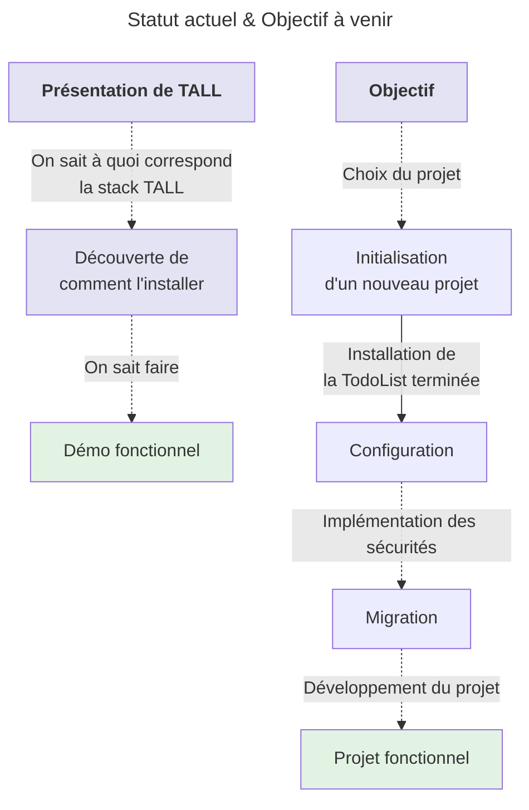
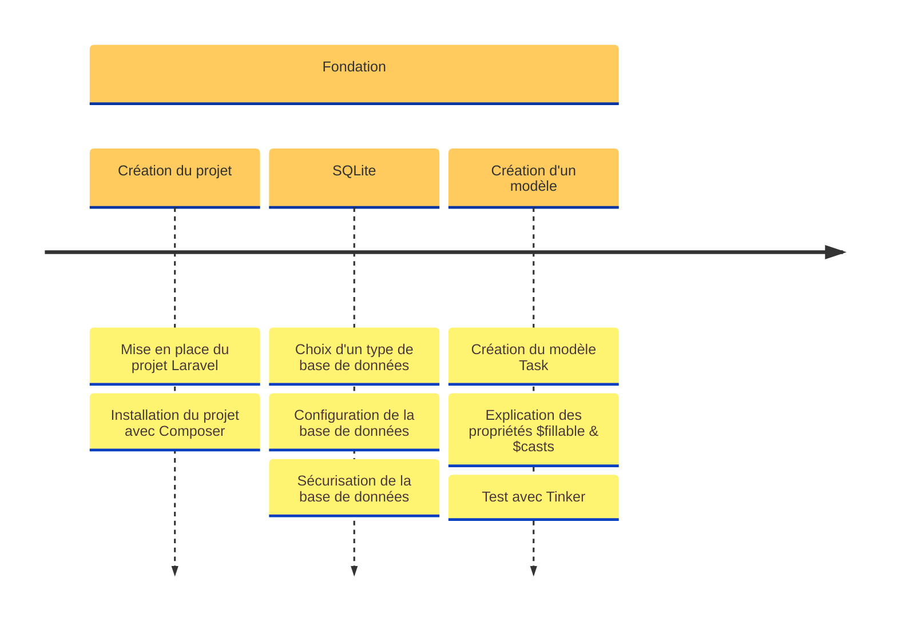
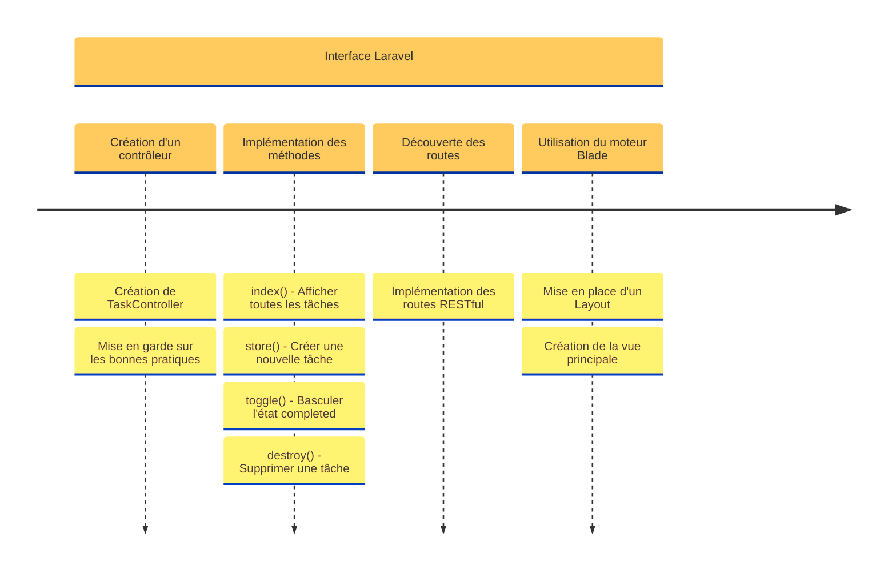
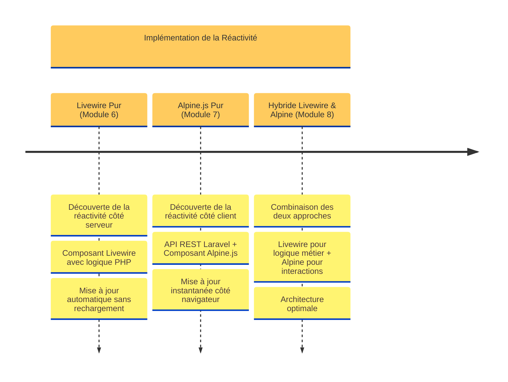
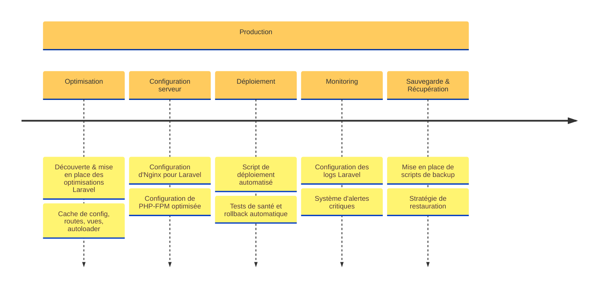
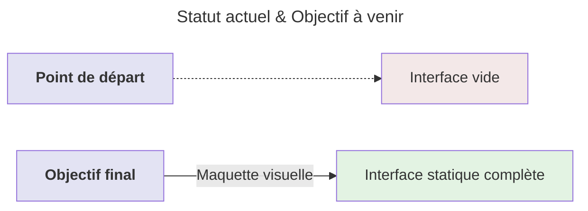
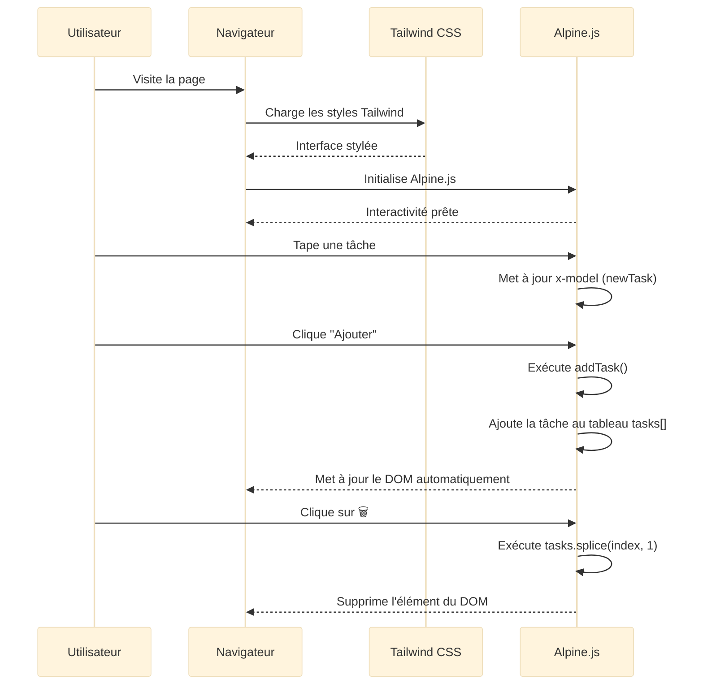

# Feuille de Route

<div
  class="omny-meta"
  data-level="🟢 Débutant"
  data-version="1.0"
  data-time="45-60 minutes">
</div>

## Introduction

Après avoir découvert la stack TALL dans le **Module 1** et configuré votre environnement dans le **Module 2**, il est temps de **visualiser le chemin complet** que nous allons parcourir ensemble. Ce module est votre **carte au trésor** : il vous montre exactement où nous allons, comment nous y arriverons, et ce que vous construirez étape par étape.

Imaginez que vous êtes sur le point de construire une maison. Vous avez découvert les matériaux (Module 1), installé vos outils (Module 2), et maintenant vous dépliez les plans de l'architecte pour comprendre la structure complète avant de poser la première brique. C'est exactement ce que nous faisons ici avec notre application **TALL Tasks**.

Ce module vous guidera à travers :

- **La démonstration visuelle** de l'application finale que nous construirons
- **La feuille de route complète** en 4 étapes majeures (Fondations → Interface → Réactivité → Production)
- **L'aperçu de chaque étape** avec ses objectifs et livrables concrets
- **La chronologie du projet** avec une vision claire de la progression
- **Les choix technologiques** et leur justification (pourquoi SQLite en dev, Alpine.js vs Livewire, etc.)

!!! quote "Principe du Module 3"
    "Une vision claire de la destination rend chaque étape du voyage plus motivante et compréhensible. Avant de coder, comprenons exactement ce que nous allons construire."

---

## Objectifs d'Apprentissage

À la fin de ce module, **vous serez capable de** :

### Objectifs Techniques

- [ ] Comprendre la structure complète d'une application TALL de A à Z
- [ ] Identifier les 4 phases majeures du développement (Fondations, Interface, Réactivité, Production)
- [ ] Reconnaître les technologies utilisées à chaque étape (SQLite, Blade, Livewire, Alpine.js, API REST)
- [ ] Visualiser l'évolution progressive d'une interface statique vers une application réactive
- [ ] Anticiper les livrables concrets de chaque module (Modèle Task, TaskController, API, composants)
- [ ] Comprendre le rôle de chaque technologie TALL dans l'application finale

### Objectifs Conceptuels

- [ ] Saisir la différence entre prototype visuel et application persistante
- [ ] Comprendre pourquoi SQLite est choisi pour le développement (vs MySQL/PostgreSQL en production)
- [ ] Maîtriser les différences architecturales entre Livewire (serveur) et Alpine.js (client)
- [ ] Anticiper les défis de chaque phase (persistance, réactivité, optimisation)
- [ ] Comprendre la progression pédagogique : du simple au complexe, du statique au réactif
- [ ] Visualiser comment les modules s'emboîtent pour former une application complète

---

## Prérequis

Avant de commencer ce module, **assurez-vous d'avoir** :

- [ ] **Module 1 complété** : compréhension de l'architecture TALL (Tailwind, Alpine, Laravel, Livewire)
- [ ] **Module 2 complété** : environnement de développement opérationnel (VS Code, PHP 8.4+, Composer, Node.js, MariaDB)
- [ ] **45-60 minutes** devant vous pour explorer la feuille de route complète
- [ ] **Capacité à visualiser** : ce module contient beaucoup de diagrammes et de schémas explicatifs

!!! info "Ce Module est une Vue d'Ensemble"
    Ce module **ne contient pas de code** à écrire. C'est un module de **planification et de compréhension**. Vous coderez dans les modules suivants (4 à 9).

!!! warning "Importance de ce Module"
    **Ne sautez pas ce module !** Beaucoup de développeurs veulent coder immédiatement, mais comprendre la vue d'ensemble vous fera gagner des heures de confusion plus tard.

---

## Comprendre Avant d'Agir : Le Projet TALL Tasks

Avant de plonger dans la feuille de route détaillée, comprenons d'abord **ce que nous allons construire** et **pourquoi**.

### L'Application TALL Tasks : Objectif Final

Nous allons construire une **application moderne de gestion de tâches** (TodoList) qui démontre **toutes les capacités de la stack TALL**. Cette application n'est pas un simple exercice : c'est un projet complet qui couvre :

- **CRUD complet** : Créer, Lire, Mettre à jour, Supprimer des tâches
- **Recherche et filtres** : Recherche instantanée et filtrage par statut
- **Statistiques dynamiques** : Compteurs en temps réel (total, terminées, en cours, taux de complétion)
- **Validation** : Validation côté serveur ET côté client
- **Persistance** : Données sauvegardées en base de données
- **Réactivité** : Mises à jour sans rechargement de page
- **Optimisation** : Déploiement en production avec Nginx, Redis, optimisations Laravel

### Pourquoi une TodoList ?

!!! question "Pourquoi ne pas construire un projet plus ambitieux ?"
    Excellente question ! Voici pourquoi une TodoList est le **projet pédagogique parfait** :
    
    1. **Fonctionnalités complètes** : CRUD, recherche, filtres, statistiques → tout ce dont vous avez besoin en vrai projet
    2. **Compréhension rapide** : Tout le monde comprend ce qu'est une tâche (pas besoin d'apprendre un domaine métier complexe)
    3. **Focus sur TALL** : L'objectif est d'apprendre TALL, pas de réinventer la roue avec un projet complexe
    4. **Transférable** : Les patterns appris (CRUD, API REST, réactivité) s'appliquent à **n'importe quelle application**
    5. **Progression visible** : Chaque module ajoute une couche de fonctionnalités visibles immédiatement

### Statut Actuel et Objectif à Venir

Ce diagramme montre où nous en sommes après les Modules 1-2 et où nous allons.

**Comment lire ce diagramme ?**

- Les **rectangles verts** représentent ce qui est **déjà accompli** (Modules 1-2)
- Les **rectangles jaunes** représentent les **étapes à venir** (Modules 4-9)
- Les **flèches pointillées** montrent la **progression logique**



<small>*Ce diagramme illustre la transition entre les modules théoriques (1-2) et les modules pratiques (4-9). Les rectangles gris représentent les connaissances acquises, les rectangles verts représentent les étapes accomplies, et les rectangles jaunes représentent les étapes à venir. Chaque flèche indique une dépendance logique : impossible de configurer sans avoir initialisé, impossible de migrer sans avoir configuré.*</small>

---

## La Frise Chronologique du Projet : Vue d'Ensemble

Cette frise chronologique présente les **4 étapes majeures** de notre parcours d'apprentissage TALL. Chaque étape s'appuie sur la précédente pour construire progressivement une application complète.

### Étape 1 : Les Fondations (Module 4)

La première étape pose les **bases solides** de notre application : la structure de données et la persistance.

**Comment lire ce diagramme ?**

- **3 phases** dans cette étape : Création projet → Configuration SQLite → Modèle Task
- Chaque phase a des **livrables concrets** (projet créé, BDD configurée, modèle testé)



<small>*Ce diagramme montre la progression de l'Étape 1 (Fondations). La section "Fondation" contient 3 phases majeures : (1) Création du projet Laravel avec Composer, (2) Configuration de SQLite comme base de données de développement avec sécurisation, (3) Création du modèle Task avec propriétés protégées et test via Tinker. Chaque phase a des livrables concrets : projet installé → BDD configurée → modèle opérationnel.*</small>

**Livrables de l'Étape 1 :**

- ✅ Projet Laravel `tall-tasks` créé et opérationnel
- ✅ Base de données SQLite configurée et sécurisée
- ✅ Modèle `Task` avec propriétés `$fillable` et `$casts`
- ✅ Migration appliquée (table `tasks` créée)
- ✅ Test avec Tinker validé (création de tâches fonctionnelle)

---

### Étape 2 : Interface Laravel (Module 5)

La deuxième étape construit l'**interface utilisateur classique** avec Laravel : contrôleurs, routes et vues Blade.



<small>*Ce diagramme montre la progression de l'Étape 2 (Interface Laravel). La section "Interface Laravel" contient 4 phases majeures : (1) Création du TaskController avec bonnes pratiques, (2) Implémentation des 4 méthodes CRUD essentielles (index, store, toggle, destroy), (3) Configuration des routes RESTful dans web.php, (4) Création du layout Blade et de la vue principale. Chaque phase ajoute une couche de fonctionnalités : contrôleur → méthodes → routes → vues.*</small>

**Livrables de l'Étape 2 :**

- ✅ `TaskController` avec 4 méthodes (index, store, toggle, destroy)
- ✅ Routes RESTful configurées dans `routes/web.php`
- ✅ Layout Blade (`layouts/app.blade.php`) avec header/footer
- ✅ Vue principale (`tasks/index.blade.php`) avec formulaire et liste
- ✅ Application fonctionnelle **MAIS** avec rechargements de page

!!! warning "Limitation de l'Étape 2"
    À la fin de l'Étape 2, l'application **fonctionne** mais **recharge la page** à chaque action (ajout, suppression, modification). C'est normal ! Nous ajouterons la réactivité dans l'Étape 3.

---

### Étape 3 : Implémentation de la Réactivité (Modules 6-8)

La troisième étape est la **plus importante** : elle transforme notre application statique en application moderne et réactive. Cette étape se divise en **3 parcours parallèles** pour explorer les différentes approches TALL.



<small>*Ce diagramme montre les 3 parcours parallèles de l'Étape 3 (Réactivité). Module 6 (Livewire Pur) : réactivité côté serveur avec composants PHP, mises à jour automatiques via AJAX. Module 7 (Alpine.js Pur) : réactivité côté client avec API REST, mises à jour instantanées en JavaScript. Module 8 (Hybride) : combinaison intelligente des deux approches pour une architecture optimale (Livewire pour logique métier + Alpine pour micro-interactions). Chaque parcours est indépendant et peut être suivi dans l'ordre de votre choix.*</small>

??? abstract "Parcours 3a : Livewire Pur (Module 6 - 🟢 Recommandé pour débuter)"

    **Architecture :** Réactivité côté serveur (PHP)

    - **Composant** : `app/Livewire/TaskManager.php`
    - **Vue** : `resources/views/livewire/task-manager.blade.php`
    - **Logique** : Tout en PHP côté serveur
    - **Communication** : Requêtes AJAX automatiques (gérées par Livewire)
    - **Avantages** : Simplicité, validation serveur, sécurité intégrée
    - **Inconvénients** : Légère latence réseau sur chaque action

??? abstract "Parcours 3b : Alpine.js Pur (Module 7 - 🟡 Plus avancé)"

    **Architecture :** Réactivité côté client (JavaScript)

    - **API REST** : `app/Http/Controllers/Api/TaskController.php`
    - **Routes API** : `routes/api.php` (GET/POST/PUT/DELETE)
    - **Composant Alpine** : Fonction JavaScript `taskManager()`
    - **Vue** : `resources/views/alpine-tasks.blade.php`
    - **Logique** : JavaScript côté client
    - **Communication** : Requêtes fetch() vers API REST
    - **Avantages** : Réactivité instantanée, léger (~15KB)
    - **Inconvénients** : Nécessite API REST, validation côté client + serveur

??? abstract "Parcours 3c : Hybride Livewire + Alpine (Module 8 - 🔴 Avancé)"

    **Architecture :** Combinaison intelligente des deux approches

    - **Livewire** : Gère la logique métier, validation, persistance (serveur)
    - **Alpine.js** : Gère les filtres, animations, micro-interactions (client)
    - **Communication** : Événements entre Livewire et Alpine (`$wire`, `dispatch()`)
    - **Composant** : `app/Livewire/HybridTaskManager.php`
    - **Vue** : `resources/views/livewire/hybrid-task-manager.blade.php`
    - **Avantages** : Meilleur des deux mondes (performance + sécurité)
    - **Inconvénients** : Complexité accrue, nécessite maîtrise des deux

**Livrables de l'Étape 3 (selon le parcours choisi) :**

- ✅ **Livewire** : Composant réactif côté serveur, mises à jour automatiques
- ✅ **Alpine.js** : API REST complète, composant réactif côté client
- ✅ **Hybride** : Architecture optimale combinant les forces des deux
- ✅ Application **entièrement réactive** sans rechargements de page

!!! tip "Quel Parcours Choisir ?"
    - **Débutant** : Commencez par **Livewire Pur** (Module 6) - le plus simple
    - **Intermédiaire** : Ajoutez **Alpine.js Pur** (Module 7) pour comparer
    - **Avancé** : Maîtrisez l'**Hybride** (Module 8) pour projets professionnels
    
    **Recommandation** : Suivre les 3 modules dans l'ordre pour comprendre les différences architecturales !

---

### Étape 4 : Production (Module 9)

La quatrième et dernière étape prépare l'application pour un **déploiement en production** avec optimisations, sécurité et monitoring.



<small>*Ce diagramme montre la progression de l'Étape 4 (Production). La section "Production" contient 5 phases critiques : (1) Optimisation Laravel avec cache de config/routes/vues, (2) Configuration serveur Nginx + PHP-FPM optimisée, (3) Déploiement automatisé avec scripts et tests de santé, (4) Monitoring avec logs Laravel et alertes critiques, (5) Sauvegarde avec scripts backup et stratégie de restauration. Chaque phase ajoute une couche de robustesse pour un environnement production fiable.*</small>

**Livrables de l'Étape 4 :**

- ✅ Configuration Nginx + PHP-FPM optimisée pour Laravel
- ✅ Scripts de déploiement automatisé avec rollback
- ✅ Optimisations Laravel (cache config, routes, vues, autoloader)
- ✅ Système de monitoring avec logs et alertes
- ✅ Scripts de sauvegarde et restauration automatiques
- ✅ Application **prête pour la production**

---

## Démo Visuelle : Avant de Construire, Visualisons

Avant de commencer à coder, explorons l'interface finale pour comprendre **exactement ce que nous allons construire**. Cette démonstration vous montre l'évolution de l'interface du statique au réactif.

### Aperçu de l'Application Finale

Ce diagramme montre la **transformation progressive** de notre application.



<small>*Ce diagramme illustre la progression de notre interface. Point de départ : interface vide (nouveau projet Laravel). Objectif final : interface statique complète avec Tailwind CSS. Cette maquette servira de base pour ajouter la réactivité dans les modules suivants (6-8). Les couleurs codent les états : rouge = vide, vert = complète.*</small>

### Installation Express pour la Démo

Si vous voulez tester la démo maintenant (optionnel), voici comment l'installer rapidement.

```bash
# Installation rapide avec Composer
composer create-project laravel/laravel tall-tasks-demo
cd tall-tasks-demo

# Démarrer le serveur de développement
php artisan serve
```

!!! note "Cette Démo est Optionnelle"
    Vous n'êtes **pas obligé** de créer cette démo maintenant. Le Module 4 vous guidera pour créer le vrai projet `tall-tasks` depuis zéro.

### Évolution de l'Interface : Du HTML Brut au Stylé avec Tailwind

Nous allons créer l'interface en **3 étapes progressives** pour comprendre l'apport de chaque technologie.

??? abstract "Étape 1 : HTML Simple (Sans Tailwind, Sans Alpine)"

    **Code HTML brut sans aucun style :**

    ```html
    <!DOCTYPE html>
    <html lang="fr">
        <head>
            <meta charset="utf-8" />
            <meta name="viewport" content="width=device-width, initial-scale=1" />
            <title>TALL Stack Demo</title>
        </head>
        <body>
            <div>
                <div>
                    <!-- En-tête avec badges technologiques -->
                    <header>
                        <h1>Démonstration de la TALL Stack</h1>
                        <div>
                            <span>Tailwind CSS</span>
                            <span>Alpine.js</span>
                            <span>Laravel</span>
                            <span>Livewire</span>
                        </div>
                    </header>

                    <!-- Démo Interactive Simple -->
                    <div>
                        <h2>Démo Interactive</h2>

                        <!-- Formulaire -->
                        <div>
                            <input type="text" placeholder="Nouvelle tâche..." />
                            <button>Ajouter</button>
                        </div>

                        <!-- Liste des tâches -->
                        <div>
                            <template>
                                <div>
                                    <span></span>
                                    <button>🗑️</button>
                                </div>
                            </template>
                        </div>

                        <!-- Compteur dynamique -->
                        <p>Total: <span></span> tâches</p>
                    </div>

                    <!-- Aperçu de ce que nous allons construire -->
                    <div>
                        <h3>Ce que nous allons construire :</h3>
                        <ul>
                            <li>Interface moderne et responsive avec <strong>Tailwind CSS</strong></li>
                            <li>Interactions fluides avec <strong>Alpine.js</strong></li>
                            <li>Base de données et logique avec <strong>Laravel</strong></li>
                            <li>Temps réel sans JavaScript complexe avec <strong>Livewire</strong></li>
                        </ul>
                    </div>
                </div>
            </div>
        </body>
    </html>
    ```

    **Résultat :** Interface fonctionnelle mais **laide** (pas de style, juste du HTML brut)

??? abstract "Étape 2 : Avec Tailwind CSS (Stylé mais Pas Réactif)"

    **Ajout de Tailwind CSS via CDN :**

    ```html
    <!DOCTYPE html>
    <html lang="fr">
        <head>
            <meta charset="utf-8" />
            <meta name="viewport" content="width=device-width, initial-scale=1" />
            <title>TALL Stack Demo</title>
            <script src="https://cdn.tailwindcss.com"></script>
        </head>
        <body class="bg-gray-100">
            <div class="min-h-screen py-8">
                <div class="max-w-4xl mx-auto px-6">
                    <!-- En-tête avec badges technologiques -->
                    <header class="text-center mb-8">
                        <h1 class="text-4xl font-bold text-gray-800 mb-4">
                            Démonstration de la TALL Stack
                        </h1>
                        <div class="flex justify-center gap-2 mb-6">
                            <span class="px-3 py-1 bg-blue-100 text-blue-800 rounded-full text-sm">Tailwind CSS</span>
                            <span class="px-3 py-1 bg-green-100 text-green-800 rounded-full text-sm">Alpine.js</span>
                            <span class="px-3 py-1 bg-red-100 text-red-800 rounded-full text-sm">Laravel</span>
                            <span class="px-3 py-1 bg-purple-100 text-purple-800 rounded-full text-sm">Livewire</span>
                        </div>
                    </header>

                    <!-- Démo Interactive Simple -->
                    <div class="bg-white rounded-lg shadow-md p-6 mb-6">
                        <h2 class="text-xl font-semibold mb-4">🎮 Démo Interactive</h2>

                        <!-- Formulaire -->
                        <div class="flex gap-2 mb-4">
                            <input
                                type="text"
                                placeholder="Nouvelle tâche..."
                                class="flex-1 px-4 py-2 border rounded-lg focus:ring-2 focus:ring-blue-500"
                            />
                            <button class="px-6 py-2 bg-blue-600 text-white rounded-lg hover:bg-blue-700">
                                Ajouter
                            </button>
                        </div>

                        <!-- Liste des tâches -->
                        <div class="space-y-2">
                            <div class="flex items-center justify-between p-3 bg-gray-50 rounded">
                                <span>Exemple de tâche</span>
                                <button class="text-red-500 hover:text-red-700">🗑️</button>
                            </div>
                        </div>

                        <!-- Compteur dynamique -->
                        <p class="mt-4 text-center text-gray-600">
                            Total: <span class="font-bold text-blue-600">0</span> tâches
                        </p>
                    </div>

                    <!-- Aperçu de ce que nous allons construire -->
                    <div class="bg-gradient-to-r from-blue-50 to-purple-50 rounded-lg p-6">
                        <h3 class="text-lg font-semibold mb-3">Ce que nous allons construire :</h3>
                        <ul class="space-y-2">
                            <li class="flex items-center gap-2">
                                <span class="w-2 h-2 bg-green-500 rounded-full"></span>
                                Interface moderne et responsive avec <strong>Tailwind CSS</strong>
                            </li>
                            <li class="flex items-center gap-2">
                                <span class="w-2 h-2 bg-green-500 rounded-full"></span>
                                Interactions fluides avec <strong>Alpine.js</strong>
                            </li>
                            <li class="flex items-center gap-2">
                                <span class="w-2 h-2 bg-green-500 rounded-full"></span>
                                Base de données et logique avec <strong>Laravel</strong>
                            </li>
                            <li class="flex items-center gap-2">
                                <span class="w-2 h-2 bg-green-500 rounded-full"></span>
                                Temps réel sans JavaScript complexe avec <strong>Livewire</strong>
                            </li>
                        </ul>
                    </div>
                </div>
            </div>
        </body>
    </html>
    ```

    **Résultat :** Interface **belle et moderne** mais **statique** (pas d'interactions, les boutons ne font rien)

??? abstract "Étape 3 : Avec Tailwind CSS + Alpine.js (Stylé ET Réactif)"

    **Ajout d'Alpine.js pour la réactivité côté client :**

    ```html
    <!DOCTYPE html>
    <html lang="fr">
        <head>
            <meta charset="utf-8" />
            <meta name="viewport" content="width=device-width, initial-scale=1" />
            <title>TALL Stack Demo</title>
            <script src="https://cdn.tailwindcss.com"></script>
            <script defer src="https://unpkg.com/alpinejs@3.x.x/dist/cdn.min.js"></script>
        </head>
        <body class="bg-gray-100">
            <div class="min-h-screen py-8">
                <div class="max-w-4xl mx-auto px-6">
                    <!-- En-tête avec badges technologiques -->
                    <header class="text-center mb-8">
                        <h1 class="text-4xl font-bold text-gray-800 mb-4">
                            Démonstration de la TALL Stack
                        </h1>
                        <div class="flex justify-center gap-2 mb-6">
                            <span class="px-3 py-1 bg-blue-100 text-blue-800 rounded-full text-sm">Tailwind CSS</span>
                            <span class="px-3 py-1 bg-green-100 text-green-800 rounded-full text-sm">Alpine.js</span>
                            <span class="px-3 py-1 bg-red-100 text-red-800 rounded-full text-sm">Laravel</span>
                            <span class="px-3 py-1 bg-purple-100 text-purple-800 rounded-full text-sm">Livewire</span>
                        </div>
                    </header>

                    <!-- Démo Interactive Simple avec Alpine.js -->
                    <div
                        class="bg-white rounded-lg shadow-md p-6 mb-6"
                        x-data="{
                            tasks: ['Apprendre TALL Stack', 'Créer une app géniale'],
                            newTask: '',
                            addTask() {
                                if(this.newTask.trim()) {
                                    this.tasks.push(this.newTask);
                                    this.newTask = '';
                                }
                            }
                        }"
                    >
                        <h2 class="text-xl font-semibold mb-4">🎮 Démo Interactive (Alpine.js)</h2>

                        <!-- Formulaire -->
                        <div class="flex gap-2 mb-4">
                            <input
                                type="text"
                                x-model="newTask"
                                @keyup.enter="addTask()"
                                placeholder="Nouvelle tâche..."
                                class="flex-1 px-4 py-2 border rounded-lg focus:ring-2 focus:ring-blue-500"
                            />
                            <button
                                @click="addTask()"
                                class="px-6 py-2 bg-blue-600 text-white rounded-lg hover:bg-blue-700"
                            >
                                Ajouter
                            </button>
                        </div>

                        <!-- Liste des tâches -->
                        <div class="space-y-2">
                            <template x-for="(task, index) in tasks" :key="index">
                                <div class="flex items-center justify-between p-3 bg-gray-50 rounded">
                                    <span x-text="task"></span>
                                    <button
                                        @click="tasks.splice(index, 1)"
                                        class="text-red-500 hover:text-red-700"
                                    >
                                        🗑️
                                    </button>
                                </div>
                            </template>
                        </div>

                        <!-- Compteur dynamique -->
                        <p class="mt-4 text-center text-gray-600">
                            Total: <span x-text="tasks.length" class="font-bold text-blue-600"></span> tâches
                        </p>
                    </div>

                    <!-- Aperçu de ce que nous allons construire -->
                    <div class="bg-gradient-to-r from-blue-50 to-purple-50 rounded-lg p-6">
                        <h3 class="text-lg font-semibold mb-3">Ce que nous allons construire :</h3>
                        <ul class="space-y-2">
                            <li class="flex items-center gap-2">
                                <span class="w-2 h-2 bg-green-500 rounded-full"></span>
                                Interface moderne et responsive avec <strong>Tailwind CSS</strong>
                            </li>
                            <li class="flex items-center gap-2">
                                <span class="w-2 h-2 bg-green-500 rounded-full"></span>
                                Interactions fluides avec <strong>Alpine.js</strong>
                            </li>
                            <li class="flex items-center gap-2">
                                <span class="w-2 h-2 bg-green-500 rounded-full"></span>
                                Base de données et logique avec <strong>Laravel</strong>
                            </li>
                            <li class="flex items-center gap-2">
                                <span class="w-2 h-2 bg-green-500 rounded-full"></span>
                                Temps réel sans JavaScript complexe avec <strong>Livewire</strong>
                            </li>
                        </ul>
                    </div>
                </div>
            </div>
        </body>
    </html>
    ```

    **Résultat :** Interface **belle, moderne ET réactive** (vous pouvez ajouter/supprimer des tâches, le compteur se met à jour automatiquement)

    !!! success "Testez la Démo Maintenant !"
        Si vous visitez `http://localhost:8000` avec le code ci-dessus, vous pouvez **interagir** avec l'application :
        
        - Tapez une tâche dans le champ
        - Appuyez sur "Ajouter" ou sur Entrée
        - Cliquez sur 🗑️ pour supprimer une tâche
        - Le compteur "Total" se met à jour automatiquement

## Diagramme de Séquence : Comprendre le Fonctionnement

Ce diagramme montre **comment Alpine.js rend l'interface réactive** sans communiquer avec le serveur.

**Comment lire ce diagramme ?**

- Les **participants** représentent les acteurs (Utilisateur, Navigateur, Tailwind CSS, Alpine.js)
- Les **flèches** montrent les interactions dans le temps
- **Séquence temporelle** : de haut en bas



<small>*Ce diagramme illustre le cycle de vie d'une interaction Alpine.js côté client. Étape 1 : Chargement initial (Tailwind stylise, Alpine initialise). Étape 2 : Utilisateur tape une tâche (x-model met à jour newTask en temps réel). Étape 3 : Clic sur "Ajouter" (addTask() ajoute au tableau tasks[], Alpine met à jour le DOM automatiquement). Étape 4 : Clic sur 🗑️ (tasks.splice() supprime du tableau, Alpine met à jour le DOM). IMPORTANT : Aucune communication serveur dans cette démo, tout se passe côté client.*</small>

!!! warning "Limitation de cette Démo"
    Cette démo Alpine.js est **100% côté client**. Si vous rechargez la page, **toutes les tâches disparaissent** car elles ne sont pas sauvegardées en base de données.
    
    C'est exactement ce que nous allons résoudre dans les modules suivants en ajoutant Laravel + base de données !

---

## Pourquoi Choisir SQLite pour le Développement ?

Avant de commencer le Module 4, comprenons **pourquoi nous utilisons SQLite en développement** et **MySQL/PostgreSQL en production**.

### Avantages de SQLite en Développement

!!! info "Simplicité Maximale"
    **SQLite ne nécessite aucune installation de serveur de base de données séparé**, contrairement à MySQL/MariaDB ou PostgreSQL.

**Tableau comparatif des avantages :**

| Critère | SQLite (Dev) | MySQL/PostgreSQL (Prod) |
|---------|:------------:|:-----------------------:|
| **Installation** | ✅ Aucune (fichier unique) | ❌ Serveur à installer |
| **Configuration** | ✅ Minimale (un fichier) | ❌ Complexe (user, password, port) |
| **Portabilité** | ✅ Fichier unique partageable | ❌ Dump/Import nécessaires |
| **Performance (mono-utilisateur)** | ✅ Excellente | ⚠️ Overkill pour dev |
| **Apprentissage** | ✅ Parfait pour comprendre les concepts | ⚠️ Complexité inutile en dev |
| **Performance (multi-utilisateurs)** | ❌ Limitée | ✅ Optimisée |
| **Production** | ❌ Non recommandé | ✅ Essentiel |

!!! danger "SQLite en Production : Non Recommandé"
    **SQLite est idéal pour le développement et l'apprentissage**, mais **pas adapté pour la production** avec plusieurs utilisateurs simultanés.
    
    **Pourquoi ?**
    
    - Pas de gestion avancée des connexions concurrentes
    - Pas de gestion des transactions complexes multi-utilisateurs
    - Pas de réplication/clustering
    
    **En production**, nous utiliserons **MySQL/MariaDB ou PostgreSQL** (voir Module 9).

### Simplicité de Configuration SQLite

**Avec SQLite :**

```bash
# Créer la base de données
touch database/database.sqlite

# Configurer .env
DB_CONNECTION=sqlite
DB_DATABASE=./database/database.sqlite
```

**Avec MySQL/MariaDB :**

```bash
# Installer le serveur MySQL
sudo apt install mysql-server

# Se connecter en root
mysql -u root -p

# Créer la base de données
CREATE DATABASE tall_tasks;

# Créer l'utilisateur dédié
CREATE USER 'tall_user'@'localhost' IDENTIFIED BY 'password';

# Attribuer les privilèges
GRANT ALL PRIVILEGES ON tall_tasks.* TO 'tall_user'@'localhost';

# Configurer .env
DB_CONNECTION=mysql
DB_HOST=127.0.0.1
DB_PORT=3306
DB_DATABASE=tall_tasks
DB_USERNAME=tall_user
DB_PASSWORD=password
```

**Conclusion :** SQLite = 2 lignes. MySQL = 15+ lignes et configuration serveur.

!!! tip "Portabilité Exceptionnelle"
    La base de données SQLite est **un seul fichier** (`database/database.sqlite`). Vous pouvez :
    
    - Le partager avec votre équipe via Git (attention : exclure de `.gitignore` uniquement en dev)
    - Le sauvegarder en copiant simplement le fichier
    - Le restaurer en remplaçant le fichier
    
    **Idéal pour l'apprentissage et les projets personnels !**

---

## Le Mot de la Fin

### FÉLICITATIONS ! Vous avez maintenant une vision claire du parcours complet.

!!! success "Feuille de Route Maîtrisée"

**Compétences Acquises dans ce Module :**

- ✅ **Vision d'ensemble** : Vous connaissez les 4 étapes majeures du projet (Fondations, Interface, Réactivité, Production)
- ✅ **Livrables concrets** : Vous savez exactement ce que vous construirez dans chaque module
- ✅ **Choix technologiques** : Vous comprenez pourquoi SQLite en dev, pourquoi 3 parcours pour la réactivité
- ✅ **Progression pédagogique** : Vous voyez la logique du simple au complexe, du statique au réactif
- ✅ **Démo interactive** : Vous avez testé l'interface finale avec Alpine.js
- ✅ **Diagrammes explicatifs** : Vous visualisez les flux, les architectures, les séquences

### Ce qui Rend cette Feuille de Route Unique

**Vision Progressive :**

Notre feuille de route suit une **progression naturelle** qui respecte votre courbe d'apprentissage :

1. **Fondations (Module 4)** : Base de données et modèles → Vous apprenez la persistance
2. **Interface (Module 5)** : Contrôleurs, routes, vues → Vous apprenez le MVC
3. **Réactivité (Modules 6-8)** : Livewire, Alpine, Hybride → Vous comprenez les approches modernes
4. **Production (Module 9)** : Optimisations, déploiement → Vous professionnalisez

**Trois Parcours de Réactivité :**

La force de cette feuille de route est de vous montrer **3 approches différentes** pour la même fonctionnalité :

- **Livewire Pur** : Idéal pour débuter (tout en PHP, simple)
- **Alpine.js Pur** : Comprendre l'approche client/API
- **Hybride** : Architecture optimale pour projets professionnels

Vous pouvez choisir selon votre niveau et vos préférences !

### Points Clés à Retenir

Avant de passer au Module 4, retenez ces **8 principes fondamentaux** :

1. **Progression logique** : Chaque module s'appuie sur le précédent (impossible de sauter des étapes)
2. **SQLite en dev** : Simplicité maximale pour apprendre (MySQL/PostgreSQL en production)
3. **3 parcours réactivité** : Livewire (serveur), Alpine (client), Hybride (optimal) - choisissez selon votre niveau
4. **Démo interactive** : Interface Alpine.js testable immédiatement pour visualiser l'objectif
5. **Livrables concrets** : Chaque module produit quelque chose de tangible (modèle, contrôleur, composant)
6. **Du statique au réactif** : Évolution naturelle de l'interface (HTML → Tailwind → Alpine → Livewire)
7. **Production finale** : Module 9 transforme l'app dev en app production (Nginx, optimisations, monitoring)
8. **Modules indépendants** : Vous pouvez suivre Livewire OU Alpine OU les deux selon vos besoins

### Tableau Comparaison Avant/Après Module 3

| Aspect | Avant Module 3 | Après Module 3 |
|--------|----------------|----------------|
| **Vision projet** | Floue, pas de direction claire | Vision complète des 4 étapes majeures |
| **Objectifs modules** | Inconnus | Livrables concrets identifiés par module |
| **Choix SQLite** | Pourquoi pas MySQL ? | Compréhension des avantages en dev |
| **Parcours réactivité** | Confusion Livewire vs Alpine | Compréhension des 3 approches possibles |
| **Interface finale** | Abstraite | Testée avec démo Alpine.js interactive |
| **Production** | Pas anticipée | Module 9 prévoit optimisations/déploiement |
| **Motivation** | Incertaine | Objectif clair visualisé |

### Prochaines Étapes : Module 4 - Fondations

Le **Module 4** vous apprendra à **poser les fondations solides** de l'application TALL Tasks :

**Contenu du Module 4 :**

- **Création projet Laravel** : `composer create-project` ou `laravel new tall-tasks`
- **Configuration SQLite** : Création fichier, configuration `.env`, génération `APP_KEY`
- **Modèle Task** : Classe `Task` avec `$fillable`, `$casts`, migration complète
- **Test avec Tinker** : Validation de la persistance en base de données
- **Diagrammes explicatifs** : Flux de création, architecture Eloquent

**Durée estimée :** 60-90 minutes

**Niveau :** 🟢 Débutant

**Lien :** Module 4 : Étape 1 - Fondations (sera disponible après validation de ce module)

!!! info "Validation de ce Module"
    Avant de passer au Module 4, assurez-vous d'avoir :
    
    - [ ] Compris les 4 étapes majeures de la feuille de route
    - [ ] Visualisé l'application finale avec la démo Alpine.js
    - [ ] Compris pourquoi SQLite en dev et MySQL/PostgreSQL en production
    - [ ] Identifié quel parcours réactivité vous intéresse (Livewire / Alpine / Hybride)
    - [ ] Téléchargé les diagrammes pour référence future (optionnel)

[^1]: **SQLite** : Système de gestion de base de données relationnelle stocké dans un fichier unique (sans serveur). Idéal pour développement, tests, prototypes. Limité en production multi-utilisateurs. Compatible avec syntaxe SQL standard.

[^2]: **MVC (Model-View-Controller)** : Pattern architectural séparant application en 3 couches : Modèle (données/BDD), Vue (présentation/HTML), Contrôleur (logique métier). Laravel implémente MVC : Eloquent (Modèle), Blade (Vue), Controllers (Contrôleur).

[^3]: **API REST** : Interface de programmation respectant les contraintes REST (Representational State Transfer). Utilise méthodes HTTP standard (GET, POST, PUT, DELETE) pour exposer ressources. Alpine.js communique avec API REST Laravel pour persistance.

[^4]: **Computed Property** : Propriété calculée dynamiquement à partir d'autres données. En Livewire : méthode `getXxxProperty()` accessible via `$this->xxx`. Recalculée automatiquement quand dépendances changent. Évite recalculs inutiles (mise en cache).

[^5]: **Tinker** : REPL (Read-Eval-Print Loop) interactif Laravel permettant d'exécuter code PHP dans contexte application. Utile pour tester modèles, requêtes Eloquent, fonctions. Accessible via `php artisan tinker`. Alternative : exécuter code dans routes/web.php temporairement.
