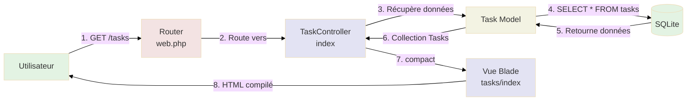
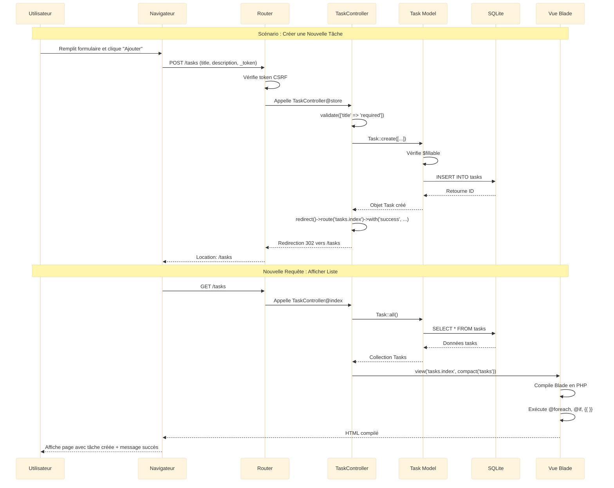

# 2 - Interface Laravel

<div
  class="omny-meta"
  data-level="🟢 Débutant"
  data-version="1.0"
  data-time="90-120 minutes">
</div>

## Introduction

Après avoir posé des **fondations solides** dans le Module 4 (modèle Task + SQLite), il est temps de **construire l'interface utilisateur** avec Laravel classique. Ce module vous apprendra à créer une application CRUD complète en suivant le pattern **MVC (Modèle-Vue-Contrôleur)**.

Dans ce module, nous construisons **volontairement une application sans réactivité** (avec rechargements de page). Cela peut sembler un pas en arrière, mais c'est **pédagogiquement essentiel** pour comprendre :

- Comment fonctionne le **cycle requête/réponse HTTP** classique
- La différence entre une **application statique** et une **application réactive** (Modules 6-8)
- L'architecture **MVC** qui est la base de Laravel

Imaginez que vous apprenez à conduire. Vous commencez avec une voiture manuelle (Module 5) avant de passer à une automatique (Modules 6-8). Comprendre les fondamentaux vous rendra **meilleur avec les technologies avancées**.

Ce module vous guidera pas à pas pour :

- **Créer TaskController** avec 4 méthodes (index, store, toggle, destroy)
- **Configurer les routes RESTful** dans `routes/web.php`
- **Créer le layout Blade** (`layouts/app.blade.php`) avec header/footer
- **Construire la vue principale** (`tasks/index.blade.php`) avec formulaire et liste
- **Styliser avec Tailwind CSS** pour obtenir une interface moderne
- **Tester l'application** en créant, modifiant et supprimant des tâches

!!! quote "Principe du Module 5"
    "Maîtrisez le MVC classique avant d'ajouter la réactivité. Une base solide garantit une compréhension profonde des architectures modernes."

---

## Objectifs d'Apprentissage

À la fin de ce module, **vous serez capable de** :

### Objectifs Techniques

- [ ] Créer un contrôleur avec Artisan (`php artisan make:controller`)
- [ ] Implémenter les 4 méthodes CRUD (index, store, toggle, destroy)
- [ ] Configurer les routes RESTful dans `routes/web.php`
- [ ] Créer un layout Blade avec `@yield` et `@section`
- [ ] Passer des données du contrôleur à la vue avec `compact()`
- [ ] Utiliser les directives Blade (`@foreach`, `@if`, `@csrf`, `@method`)
- [ ] Créer un formulaire POST avec protection CSRF
- [ ] Gérer la soumission de formulaire avec validation
- [ ] Rediriger après action avec `redirect()->route()`
- [ ] Styliser avec Tailwind CSS via CDN
- [ ] Tester l'application complète dans le navigateur

### Objectifs Conceptuels

- [ ] Comprendre le pattern MVC (Modèle-Vue-Contrôleur)
- [ ] Visualiser le cycle requête/réponse HTTP complet
- [ ] Saisir la différence entre GET (lecture) et POST/DELETE (modification)
- [ ] Maîtriser le concept de routes nommées (named routes)
- [ ] Comprendre pourquoi CSRF est critique pour la sécurité
- [ ] Anticiper les limitations d'une application sans réactivité
- [ ] Visualiser comment Blade compile en PHP natif
- [ ] Préparer mentalement l'ajout de réactivité (Modules 6-8)

---

## Prérequis

Avant de commencer ce module, **assurez-vous d'avoir** :

- [ ] **Module 4 complété** : Projet `tall-tasks` créé, SQLite configuré, modèle Task opérationnel
- [ ] **Tests Tinker validés** : Création/lecture/modification/suppression fonctionnelles
- [ ] **Serveur de développement** prêt à démarrer (`php artisan serve`)
- [ ] **Navigateur moderne** : Chrome, Firefox, Safari, Edge (dernière version)
- [ ] **90-120 minutes** devant vous sans interruption

!!! warning "Connaissance Blade Requise"
    Ce module suppose que vous avez des **notions de base de Blade** :
    
    - Syntaxe `{{ $variable }}` pour afficher des données
    - Directives `@if`, `@foreach`, `@include`
    - Concept de layout et héritage de vues
    
    Si Blade est nouveau pour vous, consultez la [documentation officielle](https://laravel.com/docs/blade) avant de continuer.

!!! danger "Ne Sautez Pas les Tests"
    À la fin de ce module, vous **devez tester l'application** dans le navigateur. Une interface qui "semble" fonctionner peut cacher des bugs subtils. **Testez chaque fonctionnalité** (créer, compléter, supprimer) avant de passer au Module 6.

---

## Comprendre Avant d'Agir : Le Pattern MVC

Avant de coder, comprenons **l'architecture MVC** qui structure toute application Laravel.

### Qu'est-ce que le Pattern MVC ?

**MVC** signifie **Modèle-Vue-Contrôleur**, un pattern architectural qui sépare l'application en **trois couches distinctes** :

**Tableau des trois couches :**

| Couche | Responsabilité | Fichiers Laravel | Exemple |
|--------|----------------|------------------|---------|
| **Modèle** | Logique métier + Accès BDD | `app/Models/Task.php` | Règles de validation, relations, requêtes Eloquent |
| **Vue** | Présentation + Interface utilisateur | `resources/views/tasks/index.blade.php` | HTML, Blade, Tailwind CSS |
| **Contrôleur** | Orchestration + Logique applicative | `app/Http/Controllers/TaskController.php` | Réception requêtes, appel modèles, retour vues |

!!! info "Pourquoi Séparer les Responsabilités ?"
    **Sans MVC**, tout le code serait mélangé dans un seul fichier (HTML + PHP + SQL). **Avec MVC** :
    
    - **Maintenabilité** : Changer l'interface n'affecte pas la logique métier
    - **Testabilité** : Tester le contrôleur sans toucher aux vues
    - **Réutilisabilité** : Utiliser le même modèle dans plusieurs contrôleurs
    - **Collaboration** : Designers travaillent sur vues, développeurs sur contrôleurs/modèles

### Cycle Requête/Réponse HTTP dans Laravel MVC

Ce diagramme montre **comment une requête HTTP traverse les couches MVC** de Laravel.

**Comment lire ce diagramme ?**

- Les **rectangles** représentent les composants techniques
- Les **flèches pleines** montrent le flux d'exécution
- Les **flèches pointillées** montrent les retours de données
- **Séquence temporelle** : de gauche à droite



<small>*Ce diagramme illustre le cycle complet requête/réponse HTTP dans Laravel MVC. Étape 1 : L'utilisateur visite `/tasks`, le navigateur envoie une requête GET. Étape 2 : Le Router (web.php) identifie la route et appelle `TaskController@index`. Étape 3 : Le contrôleur demande les tâches au modèle Task via `Task::all()`. Étape 4 : Le modèle exécute `SELECT * FROM tasks` dans SQLite. Étape 5-6 : SQLite retourne les données, le modèle les transforme en Collection Eloquent. Étape 7 : Le contrôleur passe les données à la vue avec `compact('tasks')`. Étape 8 : Blade compile la vue en HTML et renvoie la réponse au navigateur.*</small>

### Différence entre Application Statique et Réactive

**Tableau comparatif :**

| Aspect | Application Statique (Module 5) | Application Réactive (Modules 6-8) |
|--------|:-------------------------------:|:----------------------------------:|
| **Rechargement page** | ✅ À chaque action | ❌ Aucun rechargement |
| **Expérience utilisateur** | ⚠️ Latence visible | ✅ Instantané |
| **Complexité** | 🟢 Simple (HTML + PHP) | 🔴 Avancée (Livewire/Alpine) |
| **Technologies** | Blade + Tailwind | Blade + Tailwind + Livewire/Alpine |
| **Performance** | ⚠️ Requête complète | ✅ Mise à jour partielle DOM |
| **SEO** | ✅ Excellent | ✅ Excellent (SSR) |
| **Apprentissage** | 🟢 **Commencez ici** | 🔴 Nécessite base solide |

!!! tip "Pourquoi Commencer par le Statique ?"
    Comprendre le **cycle requête/réponse classique** est **essentiel** pour maîtriser les architectures réactives. Livewire (Module 6) et Alpine (Module 7) **s'appuient sur cette base**. Sans elle, vous ne comprendrez pas ce qui se passe "sous le capot".

---

## Phase 1 — Création du Contrôleur (Étapes 1 à 2)

### Étape 1 : Créer le TaskController

Nous allons créer un contrôleur dédié à la gestion des tâches avec Artisan.

!!! info "Qu'est-ce qu'un Contrôleur ?"
    Un **contrôleur** est une classe PHP qui **orchestre les interactions** entre le modèle et la vue. Il :
    
    - Reçoit les requêtes HTTP (GET, POST, DELETE)
    - Appelle les méthodes du modèle (Task)
    - Prépare les données pour la vue
    - Retourne une réponse (vue Blade, JSON, redirection)

**Créer le contrôleur :**

```bash
# Créer TaskController dans app/Http/Controllers/
php artisan make:controller TaskController

# Résultat attendu :
# Controller created successfully.
```

**Vérifier la création :**

```bash
# Vérifier que le fichier existe
ls -la app/Http/Controllers/TaskController.php

# Doit afficher : TaskController.php avec date de création
```

!!! success "Contrôleur Créé"
    Vous avez maintenant un fichier `app/Http/Controllers/TaskController.php` contenant une classe vide prête à être complétée.

---

### Étape 2 : Implémenter les 4 Méthodes CRUD

Ouvrez le fichier `app/Http/Controllers/TaskController.php` et implémentons les **4 méthodes essentielles**.

**Fichier :** `app/Http/Controllers/TaskController.php`

```php
<?php

namespace App\Http\Controllers;

use App\Models\Task;
use Illuminate\Http\Request;

class TaskController extends Controller
{
    /**
     * Afficher la liste de toutes les tâches
     * 
     * Route : GET /tasks
     * Vue : resources/views/tasks/index.blade.php
     * 
     * Cette méthode récupère TOUTES les tâches depuis la BDD
     * et les passe à la vue pour affichage.
     */
    public function index()
    {
        // Récupérer toutes les tâches de la base de données
        // Task::all() retourne une Collection Eloquent
        $tasks = Task::all();

        // Passer les tâches à la vue tasks/index.blade.php
        // compact('tasks') équivaut à ['tasks' => $tasks]
        return view('tasks.index', compact('tasks'));
    }

    /**
     * Créer une nouvelle tâche
     * 
     * Route : POST /tasks
     * Redirection : Retour vers GET /tasks
     * 
     * Cette méthode reçoit les données du formulaire,
     * valide les champs obligatoires, crée la tâche en BDD.
     */
    public function store(Request $request)
    {
        // Valider les données du formulaire
        // title : obligatoire + max 255 caractères
        // description : optionnel (nullable)
        $validated = $request->validate([
            'title' => 'required|max:255',
            'description' => 'nullable'
        ]);

        // Créer la nouvelle tâche en BDD
        // create() utilise mass assignment → nécessite $fillable
        // completed est false par défaut (défini dans migration)
        Task::create($validated);

        // Rediriger vers la page d'accueil avec message de succès
        // route('tasks.index') génère l'URL /tasks
        return redirect()->route('tasks.index')
            ->with('success', 'Tâche créée avec succès !');
    }

    /**
     * Basculer l'état de complétion d'une tâche
     * 
     * Route : POST /tasks/{task}/toggle
     * Redirection : Retour vers GET /tasks
     * 
     * Cette méthode inverse l'état completed :
     * - true → false (tâche non complétée)
     * - false → true (tâche complétée)
     */
    public function toggle(Task $task)
    {
        // Inverser l'état de complétion
        // ! inverse la valeur boolean (true → false, false → true)
        $task->update([
            'completed' => !$task->completed
        ]);

        // Rediriger vers la page d'accueil
        return redirect()->route('tasks.index');
    }

    /**
     * Supprimer une tâche
     * 
     * Route : DELETE /tasks/{task}
     * Redirection : Retour vers GET /tasks
     * 
     * Cette méthode supprime définitivement la tâche de la BDD.
     */
    public function destroy(Task $task)
    {
        // Supprimer la tâche de la base de données
        // DELETE FROM tasks WHERE id = ?
        $task->delete();

        // Rediriger vers la page d'accueil avec message de succès
        return redirect()->route('tasks.index')
            ->with('success', 'Tâche supprimée avec succès !');
    }
}
```

#### Explication Détaillée des Méthodes

**Tableau récapitulatif des méthodes :**

| Méthode | Route HTTP | URL | Action | Retour |
|---------|-----------|-----|--------|--------|
| `index()` | GET | `/tasks` | Afficher toutes les tâches | Vue Blade |
| `store()` | POST | `/tasks` | Créer une nouvelle tâche | Redirection |
| `toggle()` | POST | `/tasks/{id}/toggle` | Basculer completed | Redirection |
| `destroy()` | DELETE | `/tasks/{id}` | Supprimer la tâche | Redirection |

!!! info "Route Model Binding"
    Remarquez que `toggle(Task $task)` et `destroy(Task $task)` reçoivent directement un **objet Task**.
    
    **Laravel fait automatiquement** :
    
    ```php
    // Au lieu de faire manuellement :
    $task = Task::findOrFail($id);
    
    // Laravel le fait automatiquement via Route Model Binding
    public function toggle(Task $task) { }
    ```
    
    **Avantages** :
    
    - Code plus propre (pas de `findOrFail()` partout)
    - Erreur 404 automatique si tâche n'existe pas
    - Type-hinting strict (PHP sait que `$task` est un objet Task)

#### Méthode `index()` : Afficher Toutes les Tâches

```php
public function index()
{
    $tasks = Task::all();  // Récupère TOUTES les tâches
    return view('tasks.index', compact('tasks'));  // Passe $tasks à la vue
}
```

**Ce qui se passe en coulisses :**

1. `Task::all()` exécute `SELECT * FROM tasks`
2. Eloquent transforme les résultats en Collection d'objets Task
3. `compact('tasks')` crée `['tasks' => $tasks]`
4. `view()` cherche `resources/views/tasks/index.blade.php`
5. Blade compile la vue en PHP et retourne HTML au navigateur

#### Méthode `store()` : Créer une Nouvelle Tâche

```php
public function store(Request $request)
{
    // Étape 1 : Validation
    $validated = $request->validate([
        'title' => 'required|max:255',
        'description' => 'nullable'
    ]);

    // Étape 2 : Création
    Task::create($validated);

    // Étape 3 : Redirection
    return redirect()->route('tasks.index')
        ->with('success', 'Tâche créée avec succès !');
}
```

**Validation expliquée :**

| Règle | Signification | Erreur si... |
|-------|---------------|--------------|
| `required` | Champ obligatoire | Champ vide ou absent |
| `max:255` | Maximum 255 caractères | Plus de 255 caractères |
| `nullable` | Champ optionnel | (Aucune erreur possible) |

!!! danger "Importance de la Validation"
    **Ne JAMAIS faire confiance aux données utilisateur** sans validation. Un attaquant pourrait envoyer :
    
    - Un titre de 100 000 caractères (DOS)
    - Des balises HTML malveillantes (XSS)
    - Des requêtes sans token CSRF (CSRF attack)
    
    **Laravel vous protège automatiquement** avec `validate()` et `@csrf`.

#### Méthode `toggle()` : Basculer l'État de Complétion

```php
public function toggle(Task $task)
{
    $task->update(['completed' => !$task->completed]);
    return redirect()->route('tasks.index');
}
```

**Logique d'inversion :**

```php
// Si completed = false (0 en BDD)
!$task->completed  // true

// Si completed = true (1 en BDD)
!$task->completed  // false
```

**SQL généré :**

```sql
UPDATE tasks SET completed = 1, updated_at = '2024-12-08 15:30:00' WHERE id = 1
```

!!! tip "Timestamps Automatiques"
    Remarquez que `updated_at` est mis à jour automatiquement par Laravel grâce à `$table->timestamps()` dans la migration.

#### Méthode `destroy()` : Supprimer une Tâche

```php
public function destroy(Task $task)
{
    $task->delete();
    return redirect()->route('tasks.index')
        ->with('success', 'Tâche supprimée avec succès !');
}
```

**SQL généré :**

```sql
DELETE FROM tasks WHERE id = 1
```

!!! warning "Suppression Définitive"
    `delete()` supprime **définitivement** la tâche. Pour une suppression douce (soft delete), utilisez le trait `SoftDeletes` dans le modèle.

> Ainsi s'achève la Phase 1 - Création du Contrôleur (Étapes 1-2)

---

## Phase 2 — Configuration des Routes (Étape 3)

### Étape 3 : Configurer les Routes RESTful

Maintenant que le contrôleur est prêt, configurons les **routes** qui relient les URLs aux méthodes du contrôleur.

**Fichier :** `routes/web.php`

```php
<?php

use App\Http\Controllers\TaskController;
use Illuminate\Support\Facades\Route;

/**
 * Route GET : Afficher toutes les tâches
 * 
 * URL : http://localhost:8000/tasks
 * Méthode HTTP : GET
 * Contrôleur : TaskController@index
 * Nom : tasks.index (utilisé dans redirect()->route())
 */
Route::get('/tasks', [TaskController::class, 'index'])->name('tasks.index');

/**
 * Route POST : Créer une nouvelle tâche
 * 
 * URL : http://localhost:8000/tasks
 * Méthode HTTP : POST
 * Contrôleur : TaskController@store
 * Nom : tasks.store
 * 
 * Cette route reçoit les données du formulaire (title, description)
 */
Route::post('/tasks', [TaskController::class, 'store'])->name('tasks.store');

/**
 * Route POST : Basculer l'état de complétion
 * 
 * URL : http://localhost:8000/tasks/{id}/toggle
 * Méthode HTTP : POST
 * Contrôleur : TaskController@toggle
 * Nom : tasks.toggle
 * 
 * {task} est automatiquement résolu en objet Task (Route Model Binding)
 */
Route::post('/tasks/{task}/toggle', [TaskController::class, 'toggle'])->name('tasks.toggle');

/**
 * Route DELETE : Supprimer une tâche
 * 
 * URL : http://localhost:8000/tasks/{id}
 * Méthode HTTP : DELETE
 * Contrôleur : TaskController@destroy
 * Nom : tasks.destroy
 * 
 * Utilise @method('DELETE') dans le formulaire HTML
 */
Route::delete('/tasks/{task}', [TaskController::class, 'destroy'])->name('tasks.destroy');
```

#### Comprendre les Routes Nommées

**Qu'est-ce qu'une Route Nommée ?**

Une **route nommée** permet de générer des URLs sans les écrire en dur.

**Sans nom (❌ Mauvaise pratique) :**

```php
// Dans le contrôleur
return redirect('/tasks');

// Dans la vue
<form action="/tasks" method="POST">
```

**Avec nom (✅ Bonne pratique) :**

```php
// Dans le contrôleur
return redirect()->route('tasks.index');

// Dans la vue
<form action="{{ route('tasks.store') }}" method="POST">
```

**Avantages des routes nommées :**

1. **Maintenance** : Changer `/tasks` en `/mes-taches` ne casse rien
2. **Clarté** : `tasks.index` est plus explicite que `/tasks`
3. **Paramètres** : `route('tasks.toggle', $task)` génère `/tasks/5/toggle`
4. **IDE** : Autocomplétion et détection d'erreurs

!!! tip "Convention de Nommage"
    Laravel recommande le pattern **ressource.action** :
    
    - `tasks.index` : Liste des tâches
    - `tasks.store` : Créer une tâche
    - `tasks.show` : Afficher une tâche
    - `tasks.update` : Modifier une tâche
    - `tasks.destroy` : Supprimer une tâche

#### Comprendre Route Model Binding

**Qu'est-ce que le Route Model Binding ?**

Laravel **résout automatiquement** les paramètres de route en objets Eloquent.

**Exemple :**

```php
// Route définie
Route::post('/tasks/{task}/toggle', [TaskController::class, 'toggle']);

// Contrôleur reçoit directement l'objet Task
public function toggle(Task $task)
{
    // $task est déjà un objet Task complet
    // Laravel a fait automatiquement : Task::findOrFail($id)
}
```

**Sans Route Model Binding (❌ Code verbeux) :**

```php
public function toggle($id)
{
    $task = Task::findOrFail($id);  // Requête manuelle
    $task->update(['completed' => !$task->completed]);
}
```

**Avec Route Model Binding (✅ Code propre) :**

```php
public function toggle(Task $task)
{
    // Laravel a déjà récupéré la tâche
    $task->update(['completed' => !$task->completed]);
}
```

!!! info "Erreur 404 Automatique"
    Si l'ID n'existe pas (ex: `/tasks/999/toggle`), Laravel retourne **automatiquement une erreur 404**. Pas besoin de vérifier `if ($task === null)`.

#### Tableau Récapitulatif des Routes

| Nom Route | Méthode HTTP | URL | Contrôleur | Action |
|-----------|-------------|-----|------------|--------|
| `tasks.index` | GET | `/tasks` | `TaskController@index` | Afficher liste |
| `tasks.store` | POST | `/tasks` | `TaskController@store` | Créer tâche |
| `tasks.toggle` | POST | `/tasks/{id}/toggle` | `TaskController@toggle` | Basculer état |
| `tasks.destroy` | DELETE | `/tasks/{id}` | `TaskController@destroy` | Supprimer |

!!! success "Routes Configurées"
    Votre application a maintenant 4 routes RESTful fonctionnelles qui relient les URLs aux méthodes du contrôleur !

> Ainsi s'achève la Phase 2 - Configuration des Routes (Étape 3)

---

## Phase 3 — Création des Vues Blade (Étapes 4 à 6)

### Étape 4 : Créer le Layout Principal

Commençons par créer un **layout réutilisable** pour toutes les pages de l'application.

!!! info "Qu'est-ce qu'un Layout Blade ?"
    Un **layout** est un **squelette HTML** réutilisable contenant :
    
    - La structure de base (`<html>`, `<head>`, `<body>`)
    - Le header et le footer communs
    - Les liens CSS (Tailwind CDN)
    - Une section `@yield` où injecter le contenu spécifique

**Créer le dossier et le fichier :**

```bash
# Créer le dossier layouts
mkdir -p resources/views/layouts

# Créer le fichier app.blade.php
touch resources/views/layouts/app.blade.php
```

**Fichier :** `resources/views/layouts/app.blade.php`

```php
<!DOCTYPE html>
<html lang="fr">
<head>
    <meta charset="UTF-8">
    <meta name="viewport" content="width=device-width, initial-scale=1.0">
    
    {{-- Titre dynamique avec valeur par défaut --}}
    <title>@yield('title', 'TALL Tasks - Gestion de Tâches')</title>
    
    {{-- Tailwind CSS via CDN (développement uniquement) --}}
    <script src="https://cdn.tailwindcss.com"></script>
</head>
<body class="bg-gray-100 min-h-screen">
    {{-- Header de l'application --}}
    <header class="bg-white shadow-sm">
        <div class="max-w-4xl mx-auto px-4 py-6">
            <h1 class="text-3xl font-bold text-gray-900">
                📋 TALL Tasks
            </h1>
            <p class="text-sm text-gray-600 mt-1">
                Gestion moderne de vos tâches quotidiennes
            </p>
        </div>
    </header>

    {{-- Contenu principal (injecté par les vues enfants) --}}
    <main class="max-w-4xl mx-auto px-4 py-8">
        {{-- Afficher les messages de succès (flash messages) --}}
        @if(session('success'))
            <div class="bg-green-100 border border-green-400 text-green-700 px-4 py-3 rounded mb-6">
                {{ session('success') }}
            </div>
        @endif

        {{-- Zone de contenu dynamique --}}
        @yield('content')
    </main>

    {{-- Footer de l'application --}}
    <footer class="bg-white border-t mt-12">
        <div class="max-w-4xl mx-auto px-4 py-6 text-center text-gray-600 text-sm">
            <p>
                TALL Tasks &copy; {{ date('Y') }} - 
                Construit avec 
                <span class="text-red-500">♥</span> 
                et la Stack TALL
            </p>
        </div>
    </footer>
</body>
</html>
```

#### Explication Détaillée du Layout

**Structure HTML de base :**

```html
<!DOCTYPE html>
<html lang="fr">
<head>
    <!-- Métadonnées -->
</head>
<body>
    <header><!-- Header commun --></header>
    <main>@yield('content')</main>
    <footer><!-- Footer commun --></footer>
</body>
</html>
```

**Directives Blade utilisées :**

| Directive | Rôle | Exemple |
|-----------|------|---------|
| `@yield('title', 'défaut')` | Définir une section avec valeur par défaut | `@yield('title', 'TALL Tasks')` |
| `@if(session('success'))` | Condition PHP simplifiée | Afficher message si présent |
| `{{ session('success') }}` | Afficher variable échappée | Protection XSS automatique |
| `{{ date('Y') }}` | Exécuter fonction PHP | Année courante |

!!! info "Flash Messages Expliqués"
    **Flash messages** = données stockées en session pour **une seule requête**.
    
    **Exemple :**
    
    ```php
    // Dans le contrôleur
    return redirect()->route('tasks.index')
        ->with('success', 'Tâche créée !');
    
    // Dans la vue (automatiquement disponible)
    @if(session('success'))
        {{ session('success') }}  // Affiche "Tâche créée !"
    @endif
    ```
    
    **Après l'affichage**, le message est **automatiquement supprimé** de la session.

**Classes Tailwind CSS utilisées :**

```css
/* Conteneur centré */
.max-w-4xl   /* Largeur maximale 896px */
.mx-auto     /* Centrage horizontal */
.px-4        /* Padding horizontal 1rem */
.py-8        /* Padding vertical 2rem */

/* Typographie */
.text-3xl    /* Taille 1.875rem */
.font-bold   /* Poids 700 */
.text-gray-900  /* Couleur gris foncé */

/* Arrière-plans */
.bg-white    /* Fond blanc */
.bg-gray-100 /* Fond gris clair */

/* Effets */
.shadow-sm   /* Ombre légère */
.rounded     /* Bordures arrondies 0.25rem */
```

!!! tip "Tailwind CSS via CDN"
    **Pour le développement**, le CDN Tailwind est **parfait** (pas de build nécessaire). **En production (Module 9)**, nous utiliserons Vite pour compiler et purger le CSS (fichier final ~10KB au lieu de 3MB).

---

### Étape 5 : Créer le Dossier et la Vue des Tâches

Créons maintenant la **vue principale** qui affichera la liste des tâches et le formulaire.

**Créer le dossier et le fichier :**

```bash
# Créer le dossier tasks
mkdir -p resources/views/tasks

# Créer le fichier index.blade.php
touch resources/views/tasks/index.blade.php
```

---

### Étape 6 : Construire la Vue Principale

Ouvrons `resources/views/tasks/index.blade.php` et construisons l'interface **en 3 étapes progressives** pour mieux comprendre.

#### Étape 6.1 : HTML Brut (Sans Tailwind, Sans Blade)

Commençons par **HTML pur** pour voir la structure de base.

**Fichier :** `resources/views/tasks/index.blade.php` (Version 1 - HTML brut)

```html
<h2>Créer une nouvelle tâche</h2>

<form action="/tasks" method="POST">
    <input type="text" name="title" placeholder="Titre de la tâche" required>
    <textarea name="description" placeholder="Description (optionnel)"></textarea>
    <button type="submit">Ajouter la tâche</button>
</form>

<h2>Mes tâches</h2>

<ul>
    <li>
        <span>Première tâche</span>
        <button>✓ Compléter</button>
        <button>🗑️ Supprimer</button>
    </li>
</ul>
```

**Résultat dans le navigateur :**

- Formulaire visible mais **laid** (pas de style)
- Boutons fonctionnels mais **pas esthétiques**
- Structure HTML correcte mais **présentation basique**

!!! note "Pourquoi Commencer par HTML Brut ?"
    **Séparer les préoccupations** : D'abord la structure (HTML), ensuite le style (Tailwind), enfin la logique (Blade). **Méthodologie progressive** qui facilite l'apprentissage.

---

#### Étape 6.2 : HTML + Tailwind CSS (Stylé mais Pas Dynamique)

Ajoutons maintenant **Tailwind CSS** pour obtenir une interface moderne.

**Fichier :** `resources/views/tasks/index.blade.php` (Version 2 - HTML + Tailwind)

```blade
{{-- Étendre le layout principal --}}
@extends('layouts.app')

{{-- Définir le titre de la page --}}
@section('title', 'Mes Tâches - TALL Tasks')

{{-- Contenu de la page --}}
@section('content')

{{-- Formulaire de création --}}
<div class="bg-white rounded-lg shadow-md p-6 mb-8">
    <h2 class="text-2xl font-bold text-gray-800 mb-4">
        ➕ Créer une nouvelle tâche
    </h2>

    <form action="/tasks" method="POST" class="space-y-4">
        {{-- Champ titre --}}
        <div>
            <label class="block text-sm font-medium text-gray-700 mb-2">
                Titre de la tâche
            </label>
            <input 
                type="text" 
                name="title" 
                placeholder="Ex: Terminer le Module 5"
                required
                class="w-full px-4 py-2 border border-gray-300 rounded-lg focus:ring-2 focus:ring-blue-500 focus:border-transparent"
            >
        </div>

        {{-- Champ description --}}
        <div>
            <label class="block text-sm font-medium text-gray-700 mb-2">
                Description (optionnel)
            </label>
            <textarea 
                name="description" 
                rows="3"
                placeholder="Détails supplémentaires..."
                class="w-full px-4 py-2 border border-gray-300 rounded-lg focus:ring-2 focus:ring-blue-500 focus:border-transparent"
            ></textarea>
        </div>

        {{-- Bouton soumission --}}
        <button 
            type="submit"
            class="w-full bg-blue-600 text-white font-medium py-3 px-4 rounded-lg hover:bg-blue-700 transition duration-200"
        >
            Ajouter la tâche
        </button>
    </form>
</div>

{{-- Liste des tâches --}}
<div class="bg-white rounded-lg shadow-md p-6">
    <h2 class="text-2xl font-bold text-gray-800 mb-4">
        📝 Mes tâches (3)
    </h2>

    {{-- Liste des tâches --}}
    <div class="space-y-3">
        {{-- Tâche exemple 1 (non complétée) --}}
        <div class="flex items-center justify-between p-4 bg-gray-50 rounded-lg border border-gray-200">
            <div class="flex-1">
                <h3 class="font-semibold text-gray-900">
                    Première tâche
                </h3>
                <p class="text-sm text-gray-600 mt-1">
                    Description de la première tâche
                </p>
            </div>
            
            <div class="flex items-center space-x-2 ml-4">
                <button class="px-4 py-2 bg-green-600 text-white rounded-lg hover:bg-green-700 transition">
                    ✓ Compléter
                </button>
                <button class="px-4 py-2 bg-red-600 text-white rounded-lg hover:bg-red-700 transition">
                    🗑️ Supprimer
                </button>
            </div>
        </div>

        {{-- Tâche exemple 2 (complétée) --}}
        <div class="flex items-center justify-between p-4 bg-green-50 rounded-lg border border-green-200">
            <div class="flex-1">
                <h3 class="font-semibold text-gray-500 line-through">
                    Deuxième tâche (complétée)
                </h3>
                <p class="text-sm text-gray-400 mt-1">
                    Cette tâche est terminée
                </p>
            </div>
            
            <div class="flex items-center space-x-2 ml-4">
                <button class="px-4 py-2 bg-gray-600 text-white rounded-lg hover:bg-gray-700 transition">
                    ↩️ Réactiver
                </button>
                <button class="px-4 py-2 bg-red-600 text-white rounded-lg hover:bg-red-700 transition">
                    🗑️ Supprimer
                </button>
            </div>
        </div>
    </div>
</div>

@endsection
```

**Résultat dans le navigateur :**

- Interface **moderne et professionnelle**
- Formulaire **stylisé avec focus states**
- Tâches affichées avec **cartes distinctes**
- Boutons avec **effets de survol**
- **Limitation** : Données statiques, boutons ne font rien

!!! tip "Classes Tailwind Avancées"
    ```css
    /* États interactifs */
    hover:bg-blue-700    /* Changement couleur au survol */
    focus:ring-2         /* Anneau bleu au focus */
    transition           /* Animation douce */
    
    /* Flexbox */
    flex items-center    /* Alignement vertical */
    justify-between      /* Espacement horizontal */
    space-x-2            /* Espacement entre enfants */
    
    /* Responsive (sera utilisé plus tard) */
    md:w-1/2            /* Largeur 50% sur écrans moyens */
    lg:px-8             /* Padding sur grands écrans */
    ```

---

#### Étape 6.3 : HTML + Tailwind + Blade (Dynamique et Fonctionnel)

Transformons maintenant la vue **statique en vue dynamique** avec Blade.

**Fichier :** `resources/views/tasks/index.blade.php` (Version 3 - FINALE)

```php
{{-- Étendre le layout principal --}}
@extends('layouts.app')

{{-- Définir le titre de la page --}}
@section('title', 'Mes Tâches - TALL Tasks')

{{-- Contenu de la page --}}
@section('content')

{{-- Formulaire de création --}}
<div class="bg-white rounded-lg shadow-md p-6 mb-8">
    <h2 class="text-2xl font-bold text-gray-800 mb-4">
        ➕ Créer une nouvelle tâche
    </h2>

    {{-- Formulaire avec protection CSRF --}}
    <form action="{{ route('tasks.store') }}" method="POST" class="space-y-4">
        {{-- Token CSRF (obligatoire pour POST) --}}
        @csrf

        {{-- Champ titre --}}
        <div>
            <label class="block text-sm font-medium text-gray-700 mb-2">
                Titre de la tâche
            </label>
            <input 
                type="text" 
                name="title" 
                value="{{ old('title') }}"
                placeholder="Ex: Terminer le Module 5"
                required
                class="w-full px-4 py-2 border border-gray-300 rounded-lg focus:ring-2 focus:ring-blue-500 focus:border-transparent @error('title') border-red-500 @enderror"
            >
            {{-- Afficher l'erreur de validation si présente --}}
            @error('title')
                <p class="text-red-500 text-sm mt-1">{{ $message }}</p>
            @enderror
        </div>

        {{-- Champ description --}}
        <div>
            <label class="block text-sm font-medium text-gray-700 mb-2">
                Description (optionnel)
            </label>
            <textarea 
                name="description" 
                rows="3"
                placeholder="Détails supplémentaires..."
                class="w-full px-4 py-2 border border-gray-300 rounded-lg focus:ring-2 focus:ring-blue-500 focus:border-transparent"
            >{{ old('description') }}</textarea>
        </div>

        {{-- Bouton soumission --}}
        <button 
            type="submit"
            class="w-full bg-blue-600 text-white font-medium py-3 px-4 rounded-lg hover:bg-blue-700 transition duration-200"
        >
            Ajouter la tâche
        </button>
    </form>
</div>

{{-- Liste des tâches --}}
<div class="bg-white rounded-lg shadow-md p-6">
    <div class="flex items-center justify-between mb-4">
        <h2 class="text-2xl font-bold text-gray-800">
            📝 Mes tâches
        </h2>
        {{-- Compteur de tâches --}}
        <span class="bg-blue-100 text-blue-800 text-sm font-medium px-3 py-1 rounded-full">
            {{ $tasks->count() }} tâche(s)
        </span>
    </div>

    {{-- Vérifier si des tâches existent --}}
    @if($tasks->isEmpty())
        {{-- Message si aucune tâche --}}
        <div class="text-center py-12">
            <p class="text-gray-500 text-lg mb-2">
                📭 Aucune tâche pour le moment
            </p>
            <p class="text-gray-400 text-sm">
                Créez votre première tâche ci-dessus !
            </p>
        </div>
    @else
        {{-- Boucle sur toutes les tâches --}}
        <div class="space-y-3">
            @foreach($tasks as $task)
                <div class="flex items-center justify-between p-4 rounded-lg border 
                    {{ $task->completed ? 'bg-green-50 border-green-200' : 'bg-gray-50 border-gray-200' }}">
                    
                    <div class="flex-1">
                        {{-- Titre avec style différent si complété --}}
                        <h3 class="font-semibold {{ $task->completed ? 'text-gray-500 line-through' : 'text-gray-900' }}">
                            {{ $task->title }}
                        </h3>
                        
                        {{-- Description si présente --}}
                        @if($task->description)
                            <p class="text-sm mt-1 {{ $task->completed ? 'text-gray-400' : 'text-gray-600' }}">
                                {{ $task->description }}
                            </p>
                        @endif
                        
                        {{-- Métadonnées (date de création) --}}
                        <p class="text-xs text-gray-400 mt-2">
                            Créée le {{ $task->created_at->format('d/m/Y à H:i') }}
                        </p>
                    </div>
                    
                    {{-- Boutons d'action --}}
                    <div class="flex items-center space-x-2 ml-4">
                        {{-- Bouton toggle (compléter/réactiver) --}}
                        <form action="{{ route('tasks.toggle', $task) }}" method="POST">
                            @csrf
                            <button 
                                type="submit"
                                class="px-4 py-2 rounded-lg transition
                                    {{ $task->completed 
                                        ? 'bg-gray-600 hover:bg-gray-700 text-white' 
                                        : 'bg-green-600 hover:bg-green-700 text-white' }}"
                            >
                                {{ $task->completed ? '↩️ Réactiver' : '✓ Compléter' }}
                            </button>
                        </form>
                        
                        {{-- Bouton supprimer --}}
                        <form action="{{ route('tasks.destroy', $task) }}" method="POST" onsubmit="return confirm('Êtes-vous sûr de vouloir supprimer cette tâche ?')">
                            @csrf
                            @method('DELETE')
                            <button 
                                type="submit"
                                class="px-4 py-2 bg-red-600 text-white rounded-lg hover:bg-red-700 transition"
                            >
                                🗑️ Supprimer
                            </button>
                        </form>
                    </div>
                </div>
            @endforeach
        </div>
    @endif
</div>

@endsection
```

#### Explication Détaillée des Directives Blade

**Tableau des directives utilisées :**

| Directive | Rôle | Exemple |
|-----------|------|---------|
| `@extends('layouts.app')` | Hériter du layout | Structure HTML complète |
| `@section('content')` | Définir contenu section | Remplace `@yield('content')` |
| `@csrf` | Token CSRF | Protection contre CSRF |
| `@method('DELETE')` | Spoofing méthode HTTP | Simuler DELETE en POST |
| `@if($tasks->isEmpty())` | Condition | Afficher si aucune tâche |
| `@foreach($tasks as $task)` | Boucle | Itérer sur Collection |
| `{{ $task->title }}` | Affichage échappé | Protection XSS |
| `{{ old('title') }}` | Valeur précédente | Conserver après erreur |
| `@error('title')` | Afficher erreur | Message validation |

!!! danger "Protection CSRF Obligatoire"
    **@csrf est OBLIGATOIRE** dans TOUS les formulaires POST/PUT/DELETE.
    
    **Que fait @csrf ?**
    
    ```blade
    @csrf
    <!-- Génère automatiquement -->
    <input type="hidden" name="_token" value="RANDOM_TOKEN_HERE">
    ```
    
    **Pourquoi c'est critique ?**
    
    Sans `@csrf`, un attaquant pourrait créer un formulaire malveillant sur `evil.com` qui poste vers votre application. Avec `@csrf`, Laravel **vérifie le token** et **rejette les requêtes** sans token valide.

#### Comprendre `@method('DELETE')`

**Problème : HTML ne supporte que GET et POST**

Les formulaires HTML natifs ne peuvent utiliser que `method="GET"` ou `method="POST"`. **Impossible d'utiliser DELETE directement**.

**Solution : Method Spoofing**

Laravel utilise un **champ caché** pour simuler DELETE/PUT/PATCH :

```php
<form action="{{ route('tasks.destroy', $task) }}" method="POST">
    @csrf
    @method('DELETE')  <!-- Génère <input type="hidden" name="_method" value="DELETE"> -->
    <button type="submit">Supprimer</button>
</form>
```

**Ce qui se passe en coulisses :**

1. Le navigateur envoie une requête **POST**
2. Laravel lit le champ `_method` et voit `DELETE`
3. Laravel traite la requête comme si c'était un **vrai DELETE**
4. La route `DELETE /tasks/{task}` est déclenchée

!!! tip "Convention RESTful"
    Utiliser les bonnes méthodes HTTP améliore la **sémantique** de votre API :
    
    - **GET** : Lecture (safe, idempotent, cacheable)
    - **POST** : Création (non-idempotent)
    - **PUT/PATCH** : Modification (idempotent)
    - **DELETE** : Suppression (idempotent)

#### Comprendre `old('title')`

**Problème : Perte de données après erreur de validation**

Si la validation échoue, Laravel redirige vers le formulaire. **Sans `old()`, les champs sont vides**.

**Solution : Helper `old()`**

```php
<input 
    type="text" 
    name="title" 
    value="{{ old('title') }}"
>
```

**Scénario complet :**

1. Utilisateur remplit formulaire : `title = "Ma tâche"`, `description = "Longue description..."`
2. Utilisateur clique "Ajouter"
3. **Validation échoue** (titre trop long par exemple)
4. Laravel redirige vers formulaire
5. **Sans `old()`** : Champs vides (utilisateur doit tout retaper)
6. **Avec `old()`** : Champs pré-remplis avec valeurs précédentes

!!! success "Expérience Utilisateur Améliorée"
    `old()` évite la **frustration** de devoir retaper tout le formulaire après une erreur. **Utilisez-le systématiquement** dans vos formulaires.

> Ainsi s'achève la Phase 3 - Création des Vues Blade (Étapes 4-6)

---

## Phase 4 — Test de l'Application (Étapes 7 à 10)

### Étape 7 : Démarrer le Serveur de Développement

Lançons le serveur Laravel pour tester l'application dans le navigateur.

**Démarrer le serveur :**

```bash
# Démarrer le serveur sur http://localhost:8000
php artisan serve

# Résultat attendu :
#   INFO  Server running on [http://127.0.0.1:8000].
#
#   Press Ctrl+C to stop the server
```

!!! tip "Port Personnalisé"
    Si le port 8000 est déjà utilisé, spécifiez un autre port :
    
    ```bash
    php artisan serve --port=8080
    # Serveur sur http://localhost:8080
    ```

**Ouvrir le navigateur :**

```
http://localhost:8000/tasks
```

!!! success "Application Accessible"
    Si vous voyez l'interface avec le formulaire et la liste vide, **félicitations** ! L'application est opérationnelle.

---

### Étape 8 : Test 1 - Créer une Nouvelle Tâche

**Scénario de test :**

1. Remplir le formulaire avec :
   - **Titre** : "Terminer le Module 5"
   - **Description** : "Comprendre le pattern MVC et Blade"
2. Cliquer sur "Ajouter la tâche"

**Résultat attendu :**

- ✅ Redirection vers `/tasks`
- ✅ Message vert "Tâche créée avec succès !"
- ✅ Tâche visible dans la liste
- ✅ Compteur affiche "1 tâche(s)"

**Vérification en base de données (optionnel) :**

```bash
# Ouvrir Tinker
php artisan tinker

# Afficher toutes les tâches
App\Models\Task::all()->toArray();

# Résultat attendu :
# [
#   [
#     "id" => 1,
#     "title" => "Terminer le Module 5",
#     "description" => "Comprendre le pattern MVC et Blade",
#     "completed" => false,
#     "created_at" => "2024-12-08T16:30:00.000000Z",
#     "updated_at" => "2024-12-08T16:30:00.000000Z",
#   ],
# ]
```

!!! info "Rechargement de Page Visible"
    Remarquez que **la page se recharge complètement** après la soumission. C'est **normal** pour une application classique sans réactivité. Dans les Modules 6-8, nous éliminerons ces rechargements.

---

### Étape 9 : Test 2 - Compléter une Tâche

**Scénario de test :**

1. Cliquer sur le bouton "✓ Compléter" de la tâche créée

**Résultat attendu :**

- ✅ Rechargement de page
- ✅ Tâche passe en **fond vert** (`bg-green-50`)
- ✅ Titre apparaît **barré** (`line-through`)
- ✅ Bouton devient "↩️ Réactiver"

**Vérification en base de données (optionnel) :**

```bash
# Dans Tinker
$task = App\Models\Task::find(1);
var_dump($task->completed);

# Résultat attendu : bool(true)
```

---

### Étape 10 : Test 3 - Supprimer une Tâche

**Scénario de test :**

1. Cliquer sur le bouton "🗑️ Supprimer"
2. **Confirmation JavaScript** : Cliquer "OK"

**Résultat attendu :**

- ✅ Rechargement de page
- ✅ Message vert "Tâche supprimée avec succès !"
- ✅ Tâche disparaît de la liste
- ✅ Compteur affiche "0 tâche(s)"
- ✅ Message "📭 Aucune tâche pour le moment"

**Vérification en base de données (optionnel) :**

```bash
# Dans Tinker
App\Models\Task::count();

# Résultat attendu : 0
```

!!! success "Tests Validés"
    Si tous ces tests fonctionnent, **votre application MVC est complète et opérationnelle** ! 🎉

---

## Diagramme de Séquence : Cycle Complet Requête/Réponse

Ce diagramme montre **le flux complet** depuis le clic utilisateur jusqu'à l'affichage HTML.

**Comment lire ce diagramme ?**

- Les **participants** représentent les composants techniques
- Les **flèches pleines** montrent les actions exécutées
- Les **flèches pointillées** montrent les retours de données
- **Séquence temporelle** : de haut en bas



<small>*Ce diagramme illustre le cycle complet de création d'une tâche avec rechargement de page. Phase 1 (Soumission POST) : L'utilisateur remplit le formulaire et clique "Ajouter". Le navigateur envoie POST /tasks avec données + token CSRF. Le Router vérifie le token (protection CSRF), appelle TaskController@store. Le contrôleur valide les données avec validate(), crée la tâche via Task::create(), redirige vers /tasks avec message flash. Phase 2 (Redirection GET) : Le navigateur suit la redirection 302 et envoie GET /tasks. Le Router appelle TaskController@index qui récupère toutes les tâches via Task::all(). Le contrôleur passe les tâches à la vue Blade. Blade compile les directives (@foreach, @if, {{ }}) en HTML. Le navigateur affiche la page avec la nouvelle tâche + message "Tâche créée avec succès !". Total : 2 requêtes HTTP complètes (POST + GET), 2 rechargements de page.*</small>

---

## Le Mot de la Fin

### FÉLICITATIONS ! Votre application MVC est complète et fonctionnelle.

!!! success "Interface Laravel Opérationnelle"

**Compétences Techniques Acquises :**

- ✅ **TaskController créé** avec 4 méthodes CRUD (index, store, toggle, destroy)
- ✅ **Routes RESTful configurées** avec noms sémantiques (tasks.index, tasks.store, etc.)
- ✅ **Layout Blade réutilisable** avec header, footer, flash messages
- ✅ **Vue principale fonctionnelle** avec formulaire de création et liste dynamique
- ✅ **Validation côté serveur** avec messages d'erreur personnalisés
- ✅ **Protection CSRF** sur tous les formulaires POST/DELETE
- ✅ **Interface stylée avec Tailwind** via CDN (responsive et moderne)
- ✅ **Application testée** avec création, complétion et suppression validées

**Compétences Conceptuelles Acquises :**

- ✅ **Maîtrise du pattern MVC** : Séparation Modèle/Vue/Contrôleur
- ✅ **Compréhension cycle requête/réponse** : GET lecture, POST/DELETE modification
- ✅ **Routes nommées** : Avantages pour maintenance et clarté
- ✅ **Route Model Binding** : Résolution automatique Task par ID
- ✅ **Flash messages** : Données persistantes une seule requête
- ✅ **Method Spoofing** : Simuler DELETE/PUT avec @method()
- ✅ **Helper old()** : Conserver données après erreur validation
- ✅ **Différence statique/réactif** : Rechargements vs mises à jour partielles

### Ce qui Rend cette Application MVC Solide

**Architecture RESTful Cohérente :**

Notre application respecte les **conventions RESTful** :

```
GET    /tasks           → Lister (index)
POST   /tasks           → Créer (store)
POST   /tasks/{id}/toggle → Modifier état (toggle)
DELETE /tasks/{id}      → Supprimer (destroy)
```

**Avantages de cette architecture :**

1. **Prévisible** : Un développeur Laravel comprend immédiatement
2. **Testable** : Facile d'écrire des tests pour chaque route
3. **Extensible** : Ajouter `show()`, `edit()`, `update()` suit le même pattern
4. **API-ready** : Structure facilement transformable en API JSON

**Sécurité Intégrée Dès le Début :**

Notre application est **sécurisée par défaut** grâce à :

```php
@csrf  <!-- Protection CSRF sur tous les formulaires -->
{{ $task->title }}  <!-- Échappement automatique (XSS) -->
$request->validate([...])  <!-- Validation serveur -->
```

Ces trois lignes vous protègent contre :

- **CSRF (Cross-Site Request Forgery)** : Impossible de poster depuis evil.com
- **XSS (Cross-Site Scripting)** : Impossible d'injecter `<script>alert('hack')</script>`
- **Injection SQL** : Eloquent utilise des requêtes préparées
- **Mass Assignment** : `$fillable` limite les champs modifiables

**Expérience Utilisateur Optimisée :**

Malgré les rechargements de page, l'UX est **soignée** :

1. **Messages de feedback** : "Tâche créée/supprimée avec succès !"
2. **Conservation des données** : `old('title')` après erreur validation
3. **Confirmation suppression** : JavaScript `confirm()` évite suppressions accidentelles
4. **États visuels clairs** : Tâche complétée = fond vert + texte barré
5. **Compteur dynamique** : "3 tâche(s)" mis à jour automatiquement

### Points Clés à Retenir

Avant de passer au Module 6, retenez ces **8 principes fondamentaux** :

1. **MVC sépare les responsabilités** : Modèle (données), Vue (présentation), Contrôleur (orchestration)
2. **Routes nommées obligatoires** : `route('tasks.index')` > `/tasks` (maintenabilité)
3. **@csrf sur tous les POST/DELETE** : Protection CSRF non-négociable
4. **Validation côté serveur obligatoire** : Ne JAMAIS faire confiance aux données client
5. **Route Model Binding simplifie le code** : Laravel résout automatiquement Task par ID
6. **Flash messages améliorent l'UX** : Feedback immédiat après action
7. **old() conserve les données** : Évite frustration de retaper formulaire après erreur
8. **Application statique = base solide** : Comprendre le cycle HTTP avant d'ajouter réactivité

### Tableau Comparaison Avant/Après Module 5

| Aspect | Avant Module 5 | Après Module 5 |
|--------|----------------|----------------|
| **Contrôleur** | Inexistant | TaskController avec 4 méthodes CRUD |
| **Routes** | Aucune | 4 routes RESTful nommées configurées |
| **Vues** | Pas d'interface | Layout + Vue principale stylée Tailwind |
| **Formulaire** | Impossible créer | Formulaire fonctionnel avec validation |
| **Sécurité** | Vulnérable | CSRF + XSS + SQL Injection protégés |
| **Liste tâches** | Invisible | Affichage dynamique avec compteur |
| **Actions** | Aucune | Créer, Compléter, Supprimer fonctionnels |
| **Prêt Réactivité** | Non | ✅ **Oui** (Livewire Module 6 peut remplacer) |

### Prochaines Étapes : Module 6 - Livewire Pur

Le **Module 6** vous apprendra à **ajouter la réactivité côté serveur** avec Livewire en remplaçant le contrôleur et les vues actuelles :

**Contenu du Module 6 :**

- **Installation Livewire** : `composer require livewire/livewire`
- **Création composant** : `php artisan make:livewire TaskManager`
- **Remplacement contrôleur** : Logique déplacée dans composant Livewire
- **Suppression rechargements** : Mises à jour partielles DOM sans requête HTTP complète
- **Événements temps réel** : `wire:model`, `wire:click`, `wire:submit`
- **Comparaison directe** : Application Module 5 vs Module 6

**Durée estimée :** 90-120 minutes

**Niveau :** 🟢 Débutant (🟡 Intermédiaire si vous comparez en profondeur)

**Lien :** Module 6 : Étape 3a - Livewire Pur (sera disponible après validation de ce module)

!!! info "Validation de ce Module"
    Avant de passer au Module 6, assurez-vous d'avoir :
    
    - [ ] Créé TaskController avec 4 méthodes (index, store, toggle, destroy)
    - [ ] Configuré 4 routes RESTful nommées dans `routes/web.php`
    - [ ] Créé le layout `layouts/app.blade.php` avec header/footer
    - [ ] Créé la vue `tasks/index.blade.php` avec formulaire et liste
    - [ ] Testé création de tâche (POST /tasks)
    - [ ] Testé complétion de tâche (POST /tasks/{id}/toggle)
    - [ ] Testé suppression de tâche (DELETE /tasks/{id})
    - [ ] Compris le cycle requête/réponse HTTP complet

[^1]: **MVC (Modèle-Vue-Contrôleur)** : Pattern architectural séparant application en 3 couches. Modèle = logique métier + accès BDD (Task.php). Vue = présentation + interface (index.blade.php). Contrôleur = orchestration requêtes/réponses (TaskController.php). Avantages : maintenabilité, testabilité, séparation préoccupations.

[^2]: **Routes Nommées** : Routes avec identifiant unique permettant génération URLs. Syntaxe : `Route::get('/tasks', ...)->name('tasks.index')`. Usage : `route('tasks.index')` au lieu de `/tasks`. Avantages : Maintenance facilitée (changer URL ne casse pas le code), clarté sémantique, passage paramètres automatique.

[^3]: **CSRF (Cross-Site Request Forgery)** : Attaque forçant utilisateur authentifié à exécuter actions non désirées. Exemple : Formulaire malveillant sur evil.com postant vers votre-app.com/tasks. Protection Laravel : Token unique généré par `@csrf`, vérifié à chaque POST/PUT/DELETE. Rejet automatique si token absent/invalide.

[^4]: **Route Model Binding** : Fonctionnalité Laravel résolvant automatiquement paramètres route en objets Eloquent. Exemple : `Route::delete('/tasks/{task}', ...)` + `destroy(Task $task)` → Laravel exécute `Task::findOrFail($id)` automatiquement. Erreur 404 si ID inexistant. Évite code boilerplate répétitif.

[^5]: **Flash Messages** : Données stockées en session pour une seule requête. Usage : `redirect()->with('success', 'Message')`. Affichage : `session('success')`. Automatiquement supprimé après affichage. Utilisé pour feedback utilisateur (succès, erreur, info). Alternative aux paramètres URL (plus propre, sécurisé).

[^6]: **Method Spoofing** : Technique Laravel simulant méthodes HTTP non supportées par HTML (PUT, PATCH, DELETE). Formulaire HTML limité à GET/POST. Solution : `@method('DELETE')` génère `<input type="hidden" name="_method" value="DELETE">`. Laravel lit ce champ et traite requête comme vrai DELETE.

[^7]: **Helper old()** : Fonction Laravel conservant valeurs formulaire après redirection (erreur validation). Usage : `value="{{ old('title') }}"`. Récupère données de session flash. Évite frustration utilisateur devant retaper formulaire complet après erreur. Améliore significativement UX.
