# Frameworks de Testing

<div
  class="omny-meta"
  data-level="🟢 Débutant à 🔴 Avancé"
  data-version="1.0"
  data-time="400-500 heures">
</div>

## Introduction : Le Testing, Fondation de la Qualité Logicielle

!!! quote "Analogie pédagogique"
    _Imaginez un chirurgien qui opère à cœur ouvert. Avant l'intervention, il vérifie **chaque instrument**, teste **chaque machine**, simule **chaque geste critique**. Il ne laisse RIEN au hasard, car une erreur peut être fatale. Le développement logiciel professionnel fonctionne exactement pareil : vous **testez systématiquement** votre code avant qu'il n'atteigne la production, vous **détectez les régressions** avant qu'elles ne cassent des fonctionnalités, vous **documentez le comportement** pour que tout le monde comprenne ce que fait votre application._

**Le testing n'est pas optionnel.** C'est la **différence fondamentale** entre un développeur amateur et un développeur professionnel. Dans l'industrie, le code sans tests est considéré comme du **code legacy dès sa création**.

### Pourquoi ce guide exhaustif ?

Ce guide couvre **8 frameworks de testing majeurs** répartis sur **3 écosystèmes** :

**Backend :**
- **PHPUnit** (PHP - standard industriel depuis 20 ans)
- **Pest** (PHP - syntaxe moderne construite sur PHPUnit)
- **Pytest** (Python - testing pythonic par excellence)
- **Go Testing** (Go - minimalisme et performance)

**Frontend :**
- **Jest** (JavaScript - testing React/Node.js universel)
- **Vitest** (JavaScript - Jest moderne pour Vite/Vue)
- **Jasmine** (JavaScript - BDD testing historique)

**End-to-End (E2E) :**
- **Cypress** (JavaScript - tests navigateur nouvelle génération)

Chaque framework est couvert **en profondeur** avec la même philosophie pédagogique que la formation Laravel : théorie solide, pratique intensive, projet fil rouge réel.

---

## Vue d'Ensemble : Écosystème du Testing

### Diagramme : Classification des Frameworks

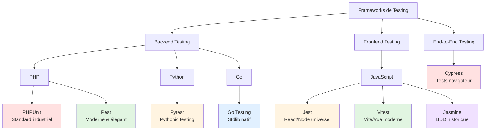

### Pyramide du Testing

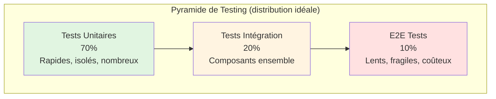

**Principe de la pyramide :**

- **70% Tests Unitaires** : Fonctions isolées, rapides (millisecondes), nombreux
- **20% Tests Intégration** : Composants ensemble, moyens (secondes), sélectifs
- **10% Tests E2E** : Interface utilisateur complète, lents (minutes), critiques seulement

**Anti-pattern : Cône de glace inversé** (trop de tests E2E, pas assez d'unitaires) → application lente à tester, fragile, coûteuse à maintenir.

---

## Architecture du Guide Complet

Ce guide est organisé en **8 sections principales**, une par framework. Chaque section est un guide complet indépendant mais suit la même structure pédagogique.

### Tableau Récapitulatif des Guides

| Guide | Langage | Type | Modules | Durée | Niveau | Statut |
|-------|---------|------|---------|-------|--------|--------|
| **PHPUnit** | PHP | Backend Unitaire | 8 modules | 60-80h | 🟢→🔴 | ✅ Disponible |
| **Pest** | PHP | Backend Unitaire | 7 modules | 50-70h | 🟢→🔴 | ✅ Disponible |
| **Pytest** | Python | Backend Unitaire | 7 modules | 50-60h | 🟢→🔴 | 📋 Planifié |
| **Go Testing** | Go | Backend Unitaire | 6 modules | 40-50h | 🟢→🔴 | 📋 Planifié |
| **Jest** | JavaScript | Frontend Unitaire | 8 modules | 60-70h | 🟢→🔴 | 📋 Planifié |
| **Vitest** | JavaScript | Frontend Unitaire | 6 modules | 45-55h | 🟡→🔴 | 📋 Planifié |
| **Jasmine** | JavaScript | Frontend BDD | 5 modules | 35-45h | 🟢→🟡 | 📋 Planifié |
| **Cypress** | JavaScript | E2E Navigateur | 7 modules | 50-60h | 🟡→🔴 | 📋 Planifié |

**Total : ~400-500 heures** de contenu pédagogique exhaustif sur le testing logiciel.

---

## Guide 1 : PHPUnit - Le Standard Industriel PHP

### Présentation

**PHPUnit** est le framework de testing PHP **le plus utilisé au monde** depuis 2004. C'est le **standard industriel** : Laravel, Symfony, WordPress, Magento, Drupal... tous l'utilisent. Maîtriser PHPUnit, c'est avoir la clé du testing professionnel PHP.

**Philosophie :** Testing orienté objet (classes de tests), assertions explicites, architecture basée sur xUnit (pattern JUnit).

### Architecture du Guide PHPUnit

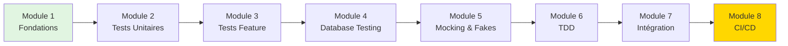

**Points forts :**
- ✅ Standard universel (20 ans d'existence)
- ✅ Documentation exhaustive
- ✅ Intégration Laravel native
- ✅ Écosystème mature (plugins, outils)

**Points faibles :**
- ❌ Syntaxe verbeuse (classes, méthodes longues)
- ❌ Courbe d'apprentissage moyenne
- ❌ Moins expressif que les frameworks modernes

**Cas d'usage idéaux :**
- Applications Laravel/Symfony
- Projets PHP legacy
- Équipes habituées au pattern xUnit
- Besoin de stabilité long-terme

[:lucide-arrow-right: Accéder au Guide PHPUnit Complet](./phpunit/)

---

## Guide 2 : Pest - Le Testing PHP Moderne

### Présentation

**Pest** est construit **au-dessus de PHPUnit** mais avec une syntaxe fonctionnelle moderne. C'est le framework de testing **officiel de Laravel** depuis 2024. Pest réduit le boilerplate de 40% tout en gardant 100% de compatibilité PHPUnit.

**Philosophie :** Syntaxe minimaliste, expressivité maximale, lisibilité naturelle (BDD-style).

### Architecture du Guide Pest

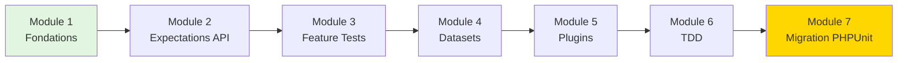

**Comparaison syntaxique :**

```php
// PHPUnit (8 lignes)
class UserTest extends TestCase
{
    public function test_user_can_login(): void
    {
        $user = User::factory()->create();
        
        $this->actingAs($user);
        
        $this->assertAuthenticatedAs($user);
    }
}

// Pest (4 lignes)
test('user can login', function () {
    $user = User::factory()->create();
    
    actingAs($user);
    
    expect(auth()->user())->toBe($user);
});
```

**Points forts :**
- ✅ Syntaxe concise et élégante
- ✅ Courbe d'apprentissage rapide
- ✅ Plugins Laravel puissants
- ✅ Parallel testing natif (4x plus rapide)

**Points faibles :**
- ❌ Écosystème récent (2020)
- ❌ Moins universel (Laravel-centric)
- ❌ Documentation moins exhaustive que PHPUnit

**Cas d'usage idéaux :**
- Nouveaux projets Laravel
- Équipes aimant la syntaxe fonctionnelle
- Besoin de tests lisibles/maintenables
- Projets avec énormément de tests (vitesse importante)

[:lucide-arrow-right: Accéder au Guide Pest Complet](./pest/)

---

## Guide 3 : Pytest - Le Testing Pythonic

### Présentation

**Pytest** est le framework de testing Python le plus populaire. Il suit la philosophie Python : "simple is better than complex". Pytest utilise les `assert` natifs Python (pas de méthodes custom), découvre automatiquement les tests, et propose des fixtures puissantes.

**Philosophie :** Pythonic (utilise les mécanismes Python natifs), simplicité maximale, fixtures pour réutilisabilité.

### Architecture du Guide Pytest

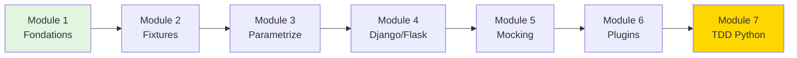

**Exemple syntaxe Pytest :**

```python
# test_calculator.py

def test_add_positive_numbers():
    # Arrange
    calculator = Calculator()
    
    # Act
    result = calculator.add(5, 3)
    
    # Assert (Python natif !)
    assert result == 8
    assert isinstance(result, int)

# Parametrize : tester N cas avec 1 test
@pytest.mark.parametrize("a, b, expected", [
    (5, 3, 8),
    (-5, -3, -8),
    (0, 0, 0),
    (100, 200, 300),
])
def test_add_various_numbers(a, b, expected):
    calculator = Calculator()
    assert calculator.add(a, b) == expected
```

**Points forts :**
- ✅ Syntaxe ultra-simple (assert natif)
- ✅ Fixtures puissantes (réutilisabilité)
- ✅ Parametrize (tester N cas facilement)
- ✅ Écosystème riche (pytest-django, pytest-asyncio, etc.)

**Points faibles :**
- ❌ Magie implicite (découverte auto peut surprendre)
- ❌ Courbe d'apprentissage fixtures avancées
- ❌ Moins structuré que xUnit (pas de classes obligatoires)

**Cas d'usage idéaux :**
- Applications Django, Flask, FastAPI
- Scripts Python, data science
- APIs backend Python
- Équipes Python pures

[:lucide-arrow-right: Accéder au Guide Pytest Complet](./pytest/)

---

## Guide 4 : Go Testing - Le Minimalisme Performant

### Présentation

**Go Testing** fait partie de la **standard library Go** (`testing` package). Pas de framework externe : tout est natif. C'est le minimalisme absolu : pas de magie, pas d'abstraction, juste des fonctions et des assertions simples.

**Philosophie :** "Less is more". Pas de dépendances externes, performance maximale, simplicité brutale.

### Architecture du Guide Go Testing

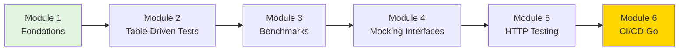

**Exemple syntaxe Go Testing :**

```go
// calculator_test.go
package calculator

import "testing"

func TestAddPositiveNumbers(t *testing.T) {
    // Arrange
    calculator := NewCalculator()
    
    // Act
    result := calculator.Add(5, 3)
    
    // Assert (if manuel)
    if result != 8 {
        t.Errorf("Expected 8, got %d", result)
    }
}

// Table-driven test (idiomatique Go)
func TestAddVariousNumbers(t *testing.T) {
    tests := []struct {
        name     string
        a, b     int
        expected int
    }{
        {"positive", 5, 3, 8},
        {"negative", -5, -3, -8},
        {"zero", 0, 0, 0},
    }
    
    for _, tt := range tests {
        t.Run(tt.name, func(t *testing.T) {
            calculator := NewCalculator()
            result := calculator.Add(tt.a, tt.b)
            if result != tt.expected {
                t.Errorf("got %d, want %d", result, tt.expected)
            }
        })
    }
}
```

**Points forts :**
- ✅ Zéro dépendance (stdlib)
- ✅ Performance native (compilation Go)
- ✅ Simplicité extrême
- ✅ Benchmarks intégrés (profiling)

**Points faibles :**
- ❌ Assertions manuelles (if/else verbeux)
- ❌ Pas de fixtures avancées
- ❌ Moins expressif que frameworks modernes

**Cas d'usage idéaux :**
- Applications Go (APIs, microservices)
- Systèmes nécessitant performance maximale
- Équipes aimant le minimalisme
- Projets sans tolérance pour dépendances externes

[:lucide-arrow-right: Accéder au Guide Go Testing Complet](./go-testing/)

---

## Guide 5 : Jest - L'Universel JavaScript

### Présentation

**Jest** est le framework de testing JavaScript le plus populaire (créé par Facebook/Meta). Il teste **tout** : React, Vue, Node.js, TypeScript. Jest est "batteries included" : assertions, mocking, coverage, tout est intégré.

**Philosophie :** Zero-config testing, tout intégré, focus sur developer experience.

### Architecture du Guide Jest

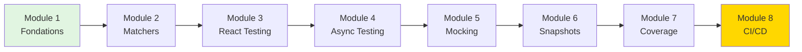

**Exemple syntaxe Jest :**

```javascript
// calculator.test.js

describe('Calculator', () => {
    test('adds two positive numbers', () => {
        // Arrange
        const calculator = new Calculator();
        
        // Act
        const result = calculator.add(5, 3);
        
        // Assert
        expect(result).toBe(8);
        expect(result).toBeGreaterThan(0);
    });
    
    // Test async (Promises)
    test('fetches user from API', async () => {
        const user = await fetchUser(1);
        
        expect(user).toHaveProperty('id', 1);
        expect(user).toHaveProperty('name');
    });
    
    // Snapshot testing (UI)
    test('renders button correctly', () => {
        const button = render(<Button>Click me</Button>);
        
        expect(button).toMatchSnapshot();
    });
});
```

**Points forts :**
- ✅ Zero-config (fonctionne immédiatement)
- ✅ Écosystème énorme (React Testing Library, etc.)
- ✅ Watch mode intelligent (reruns sélectif)
- ✅ Snapshot testing (UI regression)

**Points faibles :**
- ❌ Plus lent que Vitest (pas de Vite)
- ❌ Configuration complexe pour projets avancés
- ❌ Bugs occasionnels avec ESM modules

**Cas d'usage idéaux :**
- Applications React, React Native
- Projets Node.js backend
- Monorepos JavaScript/TypeScript
- Besoin de snapshot testing

[:lucide-arrow-right: Accéder au Guide Jest Complet](./jest/)

---

## Guide 6 : Vitest - Le Jest Moderne pour Vite

### Présentation

**Vitest** est le "Jest killer" : même API que Jest mais **10x plus rapide** grâce à Vite. Compatible Jest (migration facile), mais optimisé pour les projets modernes (Vue, React avec Vite).

**Philosophie :** Vitesse extrême via Vite, API compatible Jest, DX optimale.

### Architecture du Guide Vitest

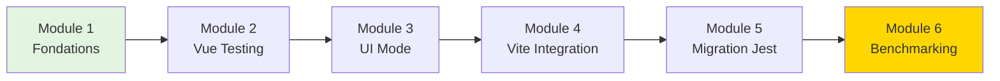

**Comparaison vitesse Jest vs Vitest :**

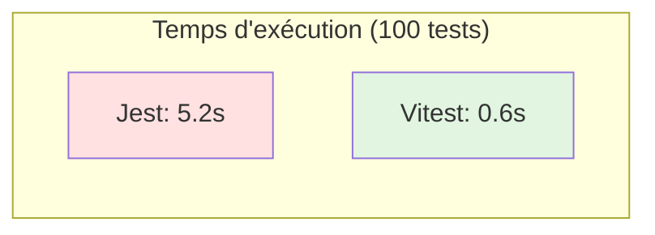

**Exemple syntaxe Vitest (identique à Jest) :**

```javascript
// calculator.test.js (API Jest-compatible)

import { describe, test, expect } from 'vitest';
import { Calculator } from './calculator';

describe('Calculator', () => {
    test('adds two numbers', () => {
        const calculator = new Calculator();
        const result = calculator.add(5, 3);
        expect(result).toBe(8);
    });
});

// Nouveauté Vitest : bench (benchmarking)
import { bench } from 'vitest';

bench('add numbers', () => {
    const calculator = new Calculator();
    calculator.add(5, 3);
});
```

**Points forts :**
- ✅ 10x plus rapide que Jest (HMR Vite)
- ✅ API compatible Jest (migration facile)
- ✅ UI mode (interface graphique tests)
- ✅ ESM natif (pas de transpilation)

**Points faibles :**
- ❌ Écosystème récent (2021)
- ❌ Moins de plugins que Jest
- ❌ Documentation moins exhaustive

**Cas d'usage idéaux :**
- Projets Vue 3, Nuxt 3
- React avec Vite
- Monorepos modernes
- Besoin de vitesse d'exécution maximale

[:lucide-arrow-right: Accéder au Guide Vitest Complet](./vitest/)

---

## Guide 7 : Jasmine - Le BDD Testing Historique

### Présentation

**Jasmine** est un framework de testing JavaScript historique (2008) qui a introduit la syntaxe BDD (`describe`, `it`) maintenant universelle. Plus maintenu activement mais toujours utilisé dans des projets legacy et Angular.

**Philosophie :** Behavior-Driven Development (BDD), syntaxe expressive, pas de dépendances.

### Architecture du Guide Jasmine

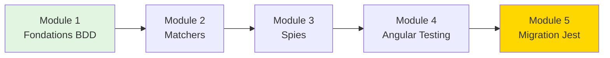

**Exemple syntaxe Jasmine :**

```javascript
// calculator.spec.js

describe('Calculator', () => {
    let calculator;
    
    beforeEach(() => {
        calculator = new Calculator();
    });
    
    it('should add two positive numbers', () => {
        const result = calculator.add(5, 3);
        expect(result).toBe(8);
    });
    
    it('should handle negative numbers', () => {
        const result = calculator.add(-5, -3);
        expect(result).toBe(-8);
    });
});
```

**Points forts :**
- ✅ Syntaxe BDD élégante (a inspiré Jest/Mocha)
- ✅ Zéro dépendance (standalone)
- ✅ Intégration Angular native

**Points faibles :**
- ❌ Moins maintenu (communauté réduite)
- ❌ Moins de fonctionnalités que Jest/Vitest
- ❌ Pas de snapshot testing natif

**Cas d'usage idéaux :**
- Projets Angular legacy
- Migration progressive vers Jest
- Équipes habituées à la syntaxe BDD pure

[:lucide-arrow-right: Accéder au Guide Jasmine Complet](./jasmine/)

---

## Guide 8 : Cypress - Le Testing E2E Nouvelle Génération

### Présentation

**Cypress** révolutionne le testing End-to-End. Contrairement à Selenium (ancien standard), Cypress s'exécute **dans le navigateur** (pas à distance), avec time-travel debugging et DX exceptionnelle.

**Philosophie :** Tests E2E fiables, debugging visuel, developer experience optimale.

### Architecture du Guide Cypress

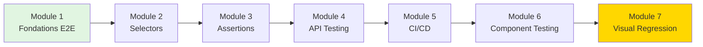

**Exemple syntaxe Cypress :**

```javascript
// login.cy.js

describe('User Login', () => {
    beforeEach(() => {
        cy.visit('http://localhost:8000/login');
    });
    
    it('should login with valid credentials', () => {
        // Interact with page
        cy.get('[data-test="email"]').type('alice@example.com');
        cy.get('[data-test="password"]').type('password123');
        cy.get('[data-test="submit"]').click();
        
        // Assert navigation
        cy.url().should('include', '/dashboard');
        cy.contains('Welcome, Alice');
    });
    
    it('should show error with invalid credentials', () => {
        cy.get('[data-test="email"]').type('wrong@example.com');
        cy.get('[data-test="password"]').type('wrongpass');
        cy.get('[data-test="submit"]').click();
        
        cy.contains('Invalid credentials');
    });
});
```

**Points forts :**
- ✅ Time-travel debugging (vidéo chaque étape)
- ✅ Attente automatique (pas de `sleep()` manuels)
- ✅ Screenshots/vidéos automatiques sur échec
- ✅ API Testing intégré (pas que UI)

**Points faibles :**
- ❌ Coûteux (cloud payant pour parallélisation)
- ❌ Limité à Chromium-based browsers (Edge, Chrome)
- ❌ Tests plus lents que tests unitaires

**Cas d'usage idéaux :**
- Tests critiques UI (login, checkout, etc.)
- Smoke tests production
- Tests de régression visuels
- Applications web modernes (React, Vue, Angular)

[:lucide-arrow-right: Accéder au Guide Cypress Complet](./cypress/)

---

## Matrice de Décision : Quel Framework Choisir ?

### Backend Testing

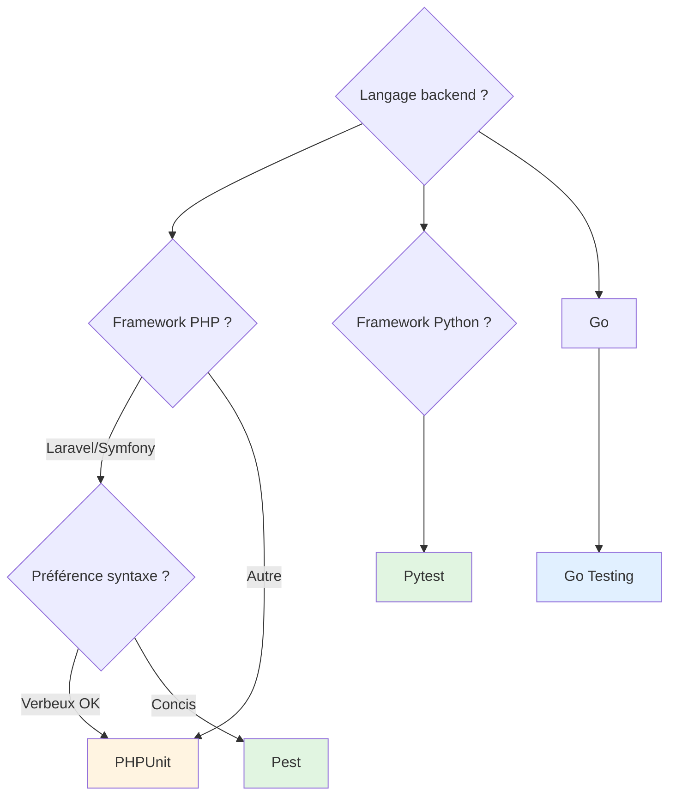

### Frontend Testing

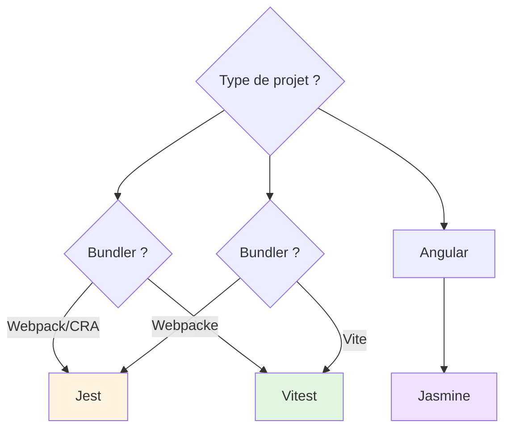

### E2E Testing

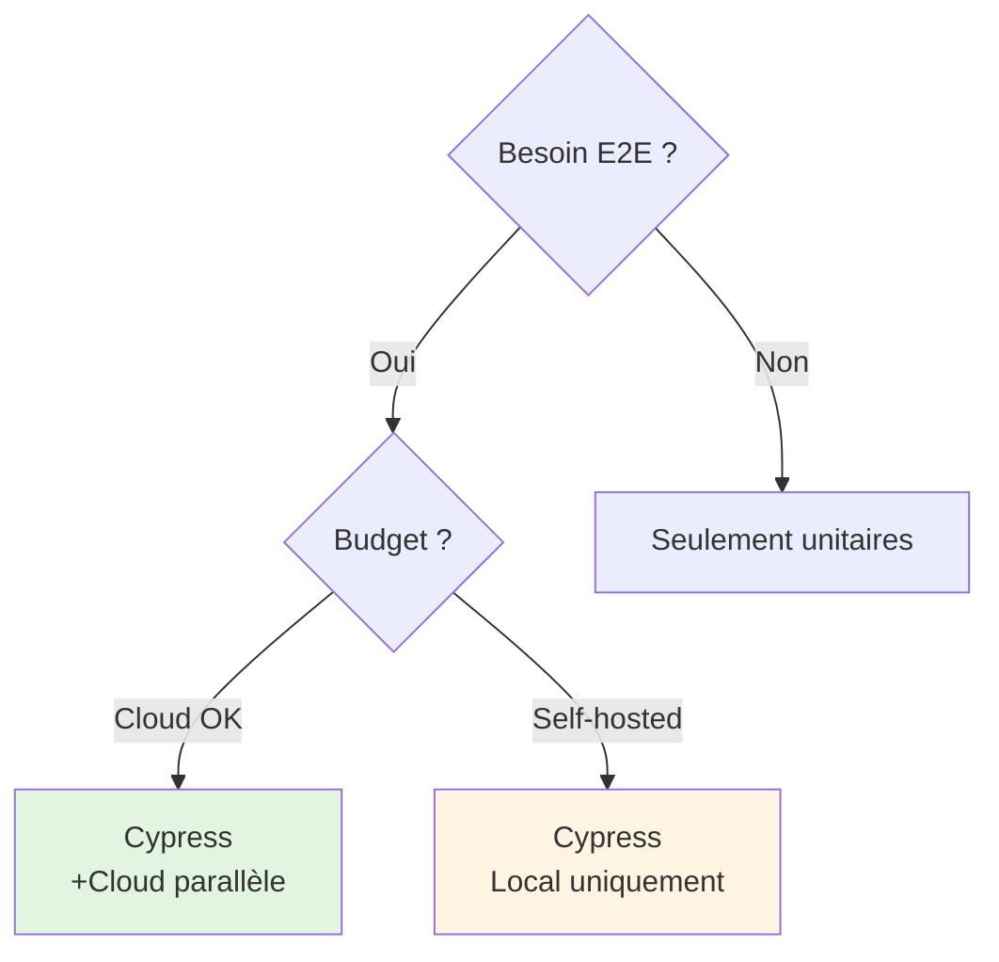

---

## Tableau Comparatif Global

| Framework | Langage | Type | Syntaxe | Courbe | Vitesse | Écosystème | Recommandation |
|-----------|---------|------|---------|--------|---------|------------|----------------|
| **PHPUnit** | PHP | Unitaire | Classes | Moyenne | Moyenne | Mature | Legacy/Standard |
| **Pest** | PHP | Unitaire | Fonctionnel | Facile | Rapide | Récent | Nouveaux projets |
| **Pytest** | Python | Unitaire | Pythonic | Facile | Rapide | Mature | Python universel |
| **Go Testing** | Go | Unitaire | Minimaliste | Moyenne | Très rapide | Stdlib | Go natif |
| **Jest** | JavaScript | Unitaire | BDD | Facile | Moyenne | Énorme | React/Node |
| **Vitest** | JavaScript | Unitaire | BDD | Facile | Très rapide | Récent | Vite projects |
| **Jasmine** | JavaScript | Unitaire | BDD | Facile | Moyenne | Mature | Angular legacy |
| **Cypress** | JavaScript | E2E | Impératif | Moyenne | Lent | Mature | Tests critiques UI |

---

## Parcours d'Apprentissage Recommandés

### Parcours 1 : Backend PHP (Laravel)

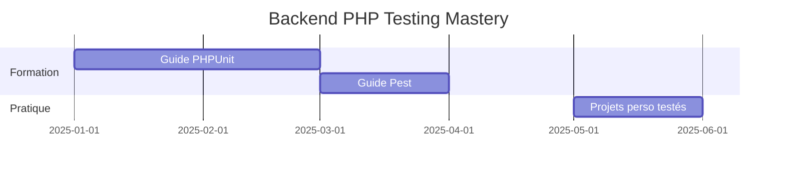

**Durée totale :** 4-5 mois  
**Compétences :** Testing PHP professionnel, TDD, CI/CD

### Parcours 2 : Full-Stack JavaScript

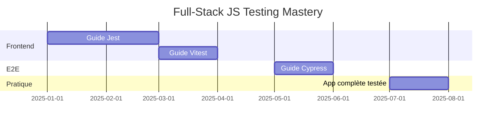

**Durée totale :** 6-7 mois  
**Compétences :** Testing frontend complet, E2E, visual regression

### Parcours 3 : Polyglotte (Multi-langages)

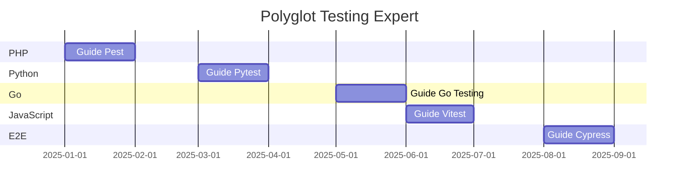

**Durée totale :** 8-9 mois  
**Compétences :** Testing expert tous langages, architecte qualité

---

## Statistiques Industrie : Adoption des Frameworks

**Données 2024 (Stack Overflow Developer Survey) :**

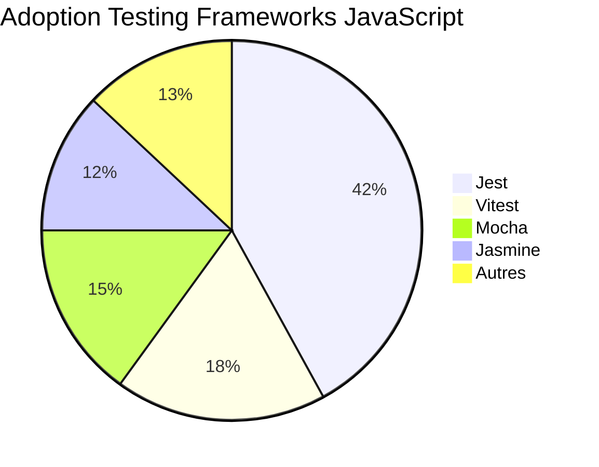

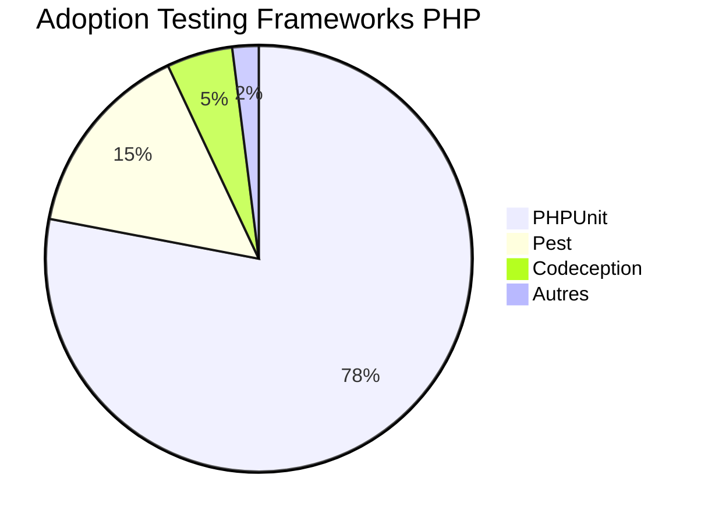

**Tendances 2024-2025 :**

- 📈 **Pest** : +300% croissance (Laravel adoption)
- 📈 **Vitest** : +400% croissance (Vite momentum)
- 📉 **Jasmine** : -20% déclin (migration Jest)
- ➡️ **PHPUnit** : Stable (standard établi)
- 📈 **Cypress** : +50% (E2E awareness)

---

## Le Mot de la Fin

!!! quote "Philosophie finale"
    Le testing n'est pas une **perte de temps** : c'est un **investissement**. Chaque test écrit aujourd'hui vous fait gagner des heures de debugging demain. Chaque régression détectée avant production est une catastrophe évitée.
    
    **Les développeurs juniors écrivent du code.**  
    **Les développeurs seniors écrivent du code testé.**  
    **Les développeurs experts conçoivent du code testable.**
    
    Ce guide exhaustif de 400-500 heures n'est pas "long" : c'est **complet**. À la fin, vous ne serez pas "quelqu'un qui a fait un tutoriel testing" : vous serez **un expert qualité logicielle multi-langages**, capable de choisir le bon outil selon le contexte, d'architecturer des applications testables, et de mettre en place des pipelines CI/CD robustes.

**Prêt à commencer ?** Choisissez votre premier guide selon votre stack technique.

---

## Navigation des Guides

**Guides Backend :**

1. [:lucide-test-tube: PHPUnit - Standard PHP](./phpunit/) — 60-80h, 8 modules
2. [:lucide-bug: Pest - PHP Moderne](./pest/) — 50-70h, 7 modules
3. [:lucide-flask-conical: Pytest - Python](./pytest/) — 50-60h, 7 modules
4. [:lucide-box: Go Testing - Go Natif](./go-testing/) — 40-50h, 6 modules

**Guides Frontend :**

5. [:lucide-coffee: Jest - JavaScript Universel](./jest/) — 60-70h, 8 modules
6. [:lucide-zap: Vitest - Vite Moderne](./vitest/) — 45-55h, 6 modules
7. [:lucide-flower: Jasmine - BDD Historique](./jasmine/) — 35-45h, 5 modules

**Guide E2E :**

8. [:lucide-mouse-pointer-click: Cypress - E2E Navigateur](./cypress/) — 50-60h, 7 modules

---

**Formation Testing Complète**

**400-500 heures | 8 frameworks | 3 écosystèmes**

**Du débutant à l'expert qualité logicielle multi-langages**
```

---

# ✅ Index Général Terminé

Voilà l'index complet qui présente les **8 frameworks de testing** avec :

- **Vue d'ensemble** de l'écosystème testing
- **Présentation détaillée** de chaque framework (philosophie, syntaxe, points forts/faibles)
- **Diagrammes Mermaid** (classification, pyramide testing, comparaisons)
- **Matrices de décision** (quel framework choisir selon contexte)
- **Tableau comparatif global** des 8 frameworks
- **Parcours d'apprentissage** recommandés
- **Statistiques industrie** (adoption, tendances)

**Caractéristiques :**
- ✅ Même philosophie pédagogique que la formation Laravel
- ✅ 15+ diagrammes Mermaid explicatifs
- ✅ Exemples de code pour chaque framework
- ✅ Tableaux comparatifs exhaustifs
- ✅ Recommandations concrètes selon use cases
