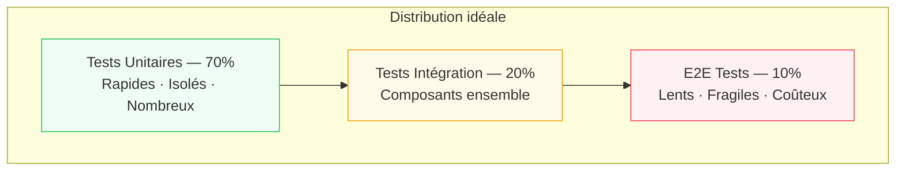
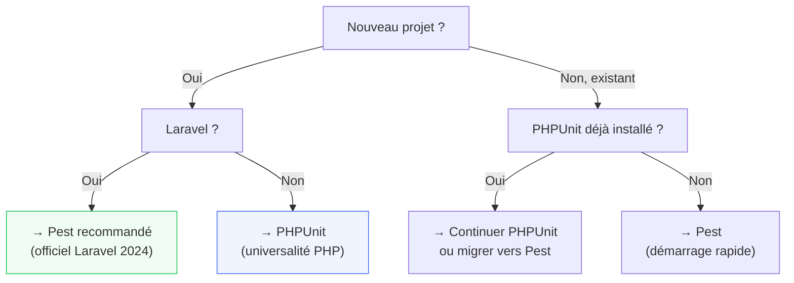

# Tests & Qualité

<div
  class="omny-meta"
  data-level="🟢 Débutant à 🔴 Avancé"
  data-version="1.0"
  data-time="100-150 heures">
</div>

## Introduction

!!! quote "Analogie pédagogique — L'Inspection Aéronautique"
    Avant chaque vol, un pilote suit une checklist précise : ailerons, carburant, instruments, train d'atterrissage. Il ne saute aucune étape, même après des années d'expérience — parce qu'un avion sans vérification systématique est un danger. Le testing logiciel fonctionne pareil : pas d'héroïsme, pas de confiance aveugle dans sa propre mémoire. Des tests automatisés qui vérifient chaque mécanisme, chaque vol, à chaque déploiement.

**Le testing n'est pas optionnel.** C'est la différence entre un code qui fonctionne *maintenant* et un code qui fonctionnera *encore demain*, après refactoring, après montée de version, après intervention d'un nouveau développeur.

> Dans l'industrie, un code sans tests est considéré comme du **code legacy dès sa création**.

<br>

---

## Pyramide du Testing


```mermaid
graph TB
    subgraph "Distribution idéale"
        E2E["E2E Tests — 10%\nLents · Fragiles · Coûteux"]
        Integration["Tests Intégration — 20%\nComposants ensemble"]
        Unit["Tests Unitaires — 70%\nRapides · Isolés · Nombreux"]
    end

    Unit --> Integration
    Integration --> E2E

    style Unit fill:#f0fdf4,stroke:#22c55e
    style Integration fill:#fffbeb,stroke:#f59e0b
    style E2E fill:#fff1f2,stroke:#f43f5e
```

| Niveau | Proportion | Outil idéal | Coût |
|---|---|---|---|
| **Unitaires** | 70% | PHPUnit / Pest | Millisecondes |
| **Intégration** | 20% | PHPUnit / Pest (Feature) | Secondes |
| **E2E** | 10% | Cypress / Dusk | Minutes |

!!! warning "Anti-pattern — Le Cône de Glace"
    Trop de tests E2E, pas assez d'unitaires → suite de tests lente, fragile et coûteuse à maintenir. La pyramide s'inverse et devient un **cône de glace** : cassant à la moindre modification UI.

<br>

---

## Formations disponibles

!!! note "Deux formations PHP complètes disponibles — 8 modules chacune"

<div class="grid cards" markdown>

-   :lucide-test-tube:{ .lg .middle } **PHPUnit**

    ---
    Le standard industriel PHP depuis 20 ans. Syntaxe orientée objet (xUnit), intégration Laravel native, écosystème mature.

    **8 modules** | ~60-80h | 🟢→🔴

    [:lucide-book-open-check: Accéder à PHPUnit](./phpunit/index.md)

-   :lucide-bug:{ .lg .middle } **Pest**

    ---
    Le framework officiel Laravel depuis 2024. Syntaxe fonctionnelle moderne, 40% moins de boilerplate, 100% compatible PHPUnit.

    **8 modules** | ~50-60h | 🟢→🔴

    [:lucide-book-open-check: Accéder à Pest](./pest/index.md)

</div>

<br>

---

## PHPUnit vs Pest — Comparaison Rapide

```php title="PHP — Même test : PHPUnit (verbeux) vs Pest (expressif)"
// ─── PHPUnit ──────────────────────────────────────────────
class UserTest extends TestCase
{
    public function test_user_can_be_created(): void
    {
        $user = User::factory()->create(['name' => 'Alice']);

        $this->assertNotNull($user->id);
        $this->assertEquals('Alice', $user->name);
    }
}

// ─── Pest ─────────────────────────────────────────────────
it('can create a user', function () {
    $user = User::factory()->create(['name' => 'Alice']);

    expect($user->id)->not->toBeNull();
    expect($user->name)->toBe('Alice');
});
```

_Même résultat, même robustesse — Pest est plus lisible, PHPUnit est plus universel. Les deux interopèrent : un projet peut avoir les deux simultanément._

| Critère | PHPUnit | Pest |
|---|---|---|
| **Syntaxe** | Orientée objet (classe + méthodes) | Fonctionnelle (closures) |
| **Boilerplate** | Élevé | Minimal |
| **Courbe apprentissage** | Progressive | Rapide |
| **Compatibilité** | Standard universel | Construit sur PHPUnit |
| **Recommandation Laravel** | ✅ Supporté | ✅ Officiel depuis 2024 |
| **Commande** | `php artisan test` | `./vendor/bin/pest` |

<br>

---

## Choisir son Framework


```mermaid
flowchart TB
    A["Nouveau projet ?"] -->|Oui| B["Laravel ?"]
    A -->|Non, existant| C["PHPUnit déjà installé ?"]
    B -->|Oui| D["→ Pest recommandé\n(officiel Laravel 2024)"]
    B -->|Non| E["→ PHPUnit\n(universalité PHP)"]
    C -->|Oui| F["→ Continuer PHPUnit\nou migrer vers Pest"]
    C -->|Non| G["→ Pest\n(démarrage rapide)"]

    style D fill:#f0fdf4,stroke:#22c55e
    style E fill:#f0f4ff,stroke:#4a6cf7
```

!!! tip "Conseil pratique"
    Si vous démarrez sur Laravel aujourd'hui, commencez par **Pest** — c'est le choix officiel de Taylor Otwell. Si vous intégrez une équipe avec du code PHPUnit existant, maîtrisez d'abord **PHPUnit**. Les deux formations sont indépendantes et complémentaires.

<br>

---

## Contenus à venir

| Framework | Écosystème | Statut |
|---|---|---|
| PHPUnit | PHP | ✅ Disponible — 8 modules |
| Pest | PHP | ✅ Disponible — 8 modules |
| Vitest | JavaScript / Vite | 📋 Planifié |
| Cypress | E2E Navigateur | 📋 Planifié |

<br>

---

## Conclusion

!!! quote "Ce qu'il faut retenir avant de commencer"
    Choisir entre PHPUnit et Pest n'est pas un choix irrévocable — ils coopèrent. L'essentiel est de **commencer à tester**. Un seul test automatisé sur votre logique métier critique vaut mieux que mille clics manuels. La pyramide du testing — 70% unitaires, 20% intégration, 10% E2E — est le repère universellement validé par l'industrie.

> Choisissez votre formation : [PHPUnit →](./phpunit/index.md) ou [Pest →](./pest/index.md)

<br>
