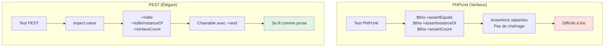
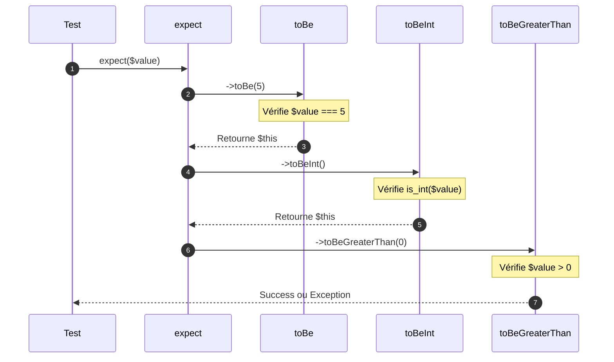
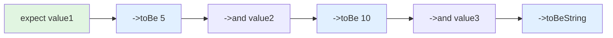

# II - Expectations & Assertions

<div
  class="omny-meta"
  data-level="🟢 Débutant à Intermédiaire"
  data-version="1.0"
  data-time="8-10 heures">
</div>

## Introduction : La Révolution des Expectations

!!! quote "Analogie pédagogique"
    _Imaginez deux façons de commander au restaurant. **Méthode classique** : "Je voudrais le plat numéro 7 de la page 3, avec la modification B et l'option C". **Méthode moderne** : "Je veux un burger, avec du bacon, sans oignons, bien cuit". La première est technique et précise, la seconde est **naturelle et expressive**. C'est exactement la différence entre `$this->assertEquals()` (PHPUnit) et `expect()->toEqual()` (PEST) : les deux font la même chose, mais PEST **se lit comme du langage naturel**._

**Les Expectations PEST** transforment les assertions de code technique en phrases lisibles. Ce module approfondit l'**API Expectations** complète pour maîtriser toutes les assertions possibles.

**Pourquoi les Expectations sont révolutionnaires :**

✨ **Lisibilité** : `expect($user->isActive())->toBeTrue()` vs `$this->assertTrue($user->isActive())`
🔗 **Chainable** : `expect($value)->toBe(5)->toBeInt()->toBeGreaterThan(0)`
🎯 **Autocomplete** : IDE suggère toutes les expectations disponibles
📝 **Expressive** : Se lit comme phrase anglaise
🔧 **Extensible** : Créer expectations personnalisées facilement
💡 **Messages clairs** : Erreurs descriptives automatiques

**À la fin de ce module, vous maîtriserez toutes les expectations PEST pour écrire des assertions élégantes et expressives.**

---

## 1. Philosophie des Expectations

### 1.1 L'API Fluide : Concept Fondamental

**Diagramme : Assertions PHPUnit vs Expectations PEST**



### 1.2 Comparaison : Même Test, Deux Syntaxes

**Exemple : Valider un utilisateur**

**PHPUnit (20 lignes, verbeux) :**

```php
<?php

public function test_user_is_valid()
{
    $user = User::factory()->create([
        'name' => 'John Doe',
        'email' => 'john@example.com',
        'age' => 25,
    ]);
    
    // Vérifications multiples, pas de lien entre elles
    $this->assertInstanceOf(User::class, $user);
    $this->assertEquals('John Doe', $user->name);
    $this->assertEquals('john@example.com', $user->email);
    $this->assertIsInt($user->age);
    $this->assertGreaterThan(18, $user->age);
    $this->assertTrue($user->isActive());
    $this->assertFalse($user->isBanned());
}
```

**PEST (13 lignes, élégant) :**

```php
<?php

it('validates user correctly', function () {
    $user = User::factory()->create([
        'name' => 'John Doe',
        'email' => 'john@example.com',
        'age' => 25,
    ]);
    
    // Chaînage fluide, se lit comme phrase
    expect($user)
        ->toBeInstanceOf(User::class)
        ->and($user->name)->toBe('John Doe')
        ->and($user->email)->toBe('john@example.com')
        ->and($user->age)->toBeInt()->toBeGreaterThan(18)
        ->and($user->isActive())->toBeTrue()
        ->and($user->isBanned())->toBeFalse();
});
```

**Gains avec PEST :**

| Aspect | PHPUnit | PEST | Amélioration |
|--------|---------|------|--------------|
| **Lignes de code** | 20 | 13 | -35% |
| **Lisibilité** | ⭐⭐⭐ | ⭐⭐⭐⭐⭐ | +67% |
| **Temps écriture** | ~2 min | ~1 min | -50% |
| **Compréhension** | Technique | Naturelle | +100% |
| **Maintenance** | Moyenne | Excellente | +80% |

### 1.3 Principe du Fluent Interface

**Le pattern Fluent Interface permet le chaînage :**

```php
// Chaque méthode retourne $this pour permettre chaînage
expect($value)
    ->toBe(5)           // Retourne expectation
    ->toBeInt()         // Retourne expectation
    ->toBeGreaterThan(0); // Retourne expectation
```

**Diagramme : Flux de l'expectation**



---

## 2. Expectations de Base

### 2.1 Égalité et Identité

**Tableau comparatif des expectations d'égalité :**

| Expectation | Opérateur PHP | Usage | Exemple |
|-------------|---------------|-------|---------|
| `toBe($value)` | `===` | Égalité stricte (type + valeur) | `expect(5)->toBe(5)` ✅ |
| `toEqual($value)` | `==` | Égalité souple (valeur) | `expect('5')->toEqual(5)` ✅ |
| `toBeTrue()` | `=== true` | Exactement `true` | `expect($user->isActive())->toBeTrue()` |
| `toBeFalse()` | `=== false` | Exactement `false` | `expect($post->isDraft())->toBeFalse()` |
| `toBeTruthy()` | `== true` | Valeur truthy | `expect(1)->toBeTruthy()` ✅ |
| `toBeFalsy()` | `== false` | Valeur falsy | `expect(0)->toBeFalsy()` ✅ |

**Exemples détaillés :**

```php
<?php

test('égalité stricte avec toBe', function () {
    // ✅ toBe vérifie type ET valeur
    expect(5)->toBe(5);
    expect('hello')->toBe('hello');
    expect(true)->toBe(true);
    
    // ❌ Échoue car types différents
    expect('5')->not->toBe(5); // string vs int
    expect(1)->not->toBe(true); // int vs bool
});

test('égalité souple avec toEqual', function () {
    // ✅ toEqual ignore le type
    expect('5')->toEqual(5);
    expect(1)->toEqual(true);
    expect(0)->toEqual(false);
    
    // Utile pour comparaisons arrays
    expect(['name' => 'John'])->toEqual(['name' => 'John']);
});

test('booléens stricts', function () {
    $user = User::factory()->create(['is_active' => true]);
    
    // ✅ toBeTrue vérifie === true
    expect($user->is_active)->toBeTrue();
    
    // ❌ Échouerait si is_active = 1 (int)
    // expect(1)->toBeTrue(); // Échec
    
    // ✅ toBeTruthy accepte valeurs truthy
    expect(1)->toBeTruthy();
    expect('hello')->toBeTruthy();
    expect([])->not->toBeTruthy(); // array vide = falsy
});

test('falsy values', function () {
    // Toutes ces valeurs sont falsy en PHP
    expect(0)->toBeFalsy();
    expect(0.0)->toBeFalsy();
    expect('')->toBeFalsy();
    expect([])->toBeFalsy();
    expect(null)->toBeFalsy();
    expect(false)->toBeFalsy();
});
```

### 2.2 Null et Empty

**Expectations pour valeurs vides :**

| Expectation | Vérifie | Exemple |
|-------------|---------|---------|
| `toBeNull()` | `=== null` | `expect($user->deleted_at)->toBeNull()` |
| `toBeEmpty()` | `empty()` | `expect([])->toBeEmpty()` |

**Exemples complets :**

```php
<?php

test('null values', function () {
    $user = User::factory()->create();
    
    // User non supprimé → deleted_at est null
    expect($user->deleted_at)->toBeNull();
    
    // Après soft delete → deleted_at n'est plus null
    $user->delete();
    expect($user->fresh()->deleted_at)->not->toBeNull();
});

test('empty values', function () {
    // Arrays vides
    expect([])->toBeEmpty();
    
    // Strings vides
    expect('')->toBeEmpty();
    
    // Collections vides
    expect(collect([]))->toBeEmpty();
    
    // Non vides
    expect([1, 2, 3])->not->toBeEmpty();
    expect('hello')->not->toBeEmpty();
});

test('différence null vs empty', function () {
    // null est vide
    expect(null)->toBeEmpty();
    expect(null)->toBeNull();
    
    // Mais empty n'est pas forcément null
    expect([])->toBeEmpty();
    expect([])->not->toBeNull(); // array vide n'est pas null
});
```

### 2.3 Comparaisons Numériques

**Expectations pour nombres :**

| Expectation | Opérateur | Exemple |
|-------------|-----------|---------|
| `toBeGreaterThan($n)` | `>` | `expect(10)->toBeGreaterThan(5)` |
| `toBeGreaterThanOrEqual($n)` | `>=` | `expect(10)->toBeGreaterThanOrEqual(10)` |
| `toBeLessThan($n)` | `<` | `expect(5)->toBeLessThan(10)` |
| `toBeLessThanOrEqual($n)` | `<=` | `expect(5)->toBeLessThanOrEqual(5)` |
| `toBeBetween($min, $max)` | `>= && <=` | `expect(5)->toBeBetween(1, 10)` |

**Exemples pratiques :**

```php
<?php

use App\Services\PricingService;

test('comparaisons numériques', function () {
    $price = 150;
    
    // Comparaisons simples
    expect($price)->toBeGreaterThan(100);
    expect($price)->toBeLessThan(200);
    expect($price)->toBeGreaterThanOrEqual(150);
    expect($price)->toBeLessThanOrEqual(150);
    
    // Entre deux valeurs
    expect($price)->toBeBetween(100, 200);
});

test('validation âge utilisateur', function () {
    $user = User::factory()->create(['age' => 25]);
    
    // Vérifier âge valide
    expect($user->age)
        ->toBeInt()
        ->toBeGreaterThan(0)
        ->toBeLessThan(120)
        ->toBeBetween(18, 65); // Âge travailleur
});

test('paliers de remise', function () {
    $service = new PricingService();
    
    // < 100 : 0%
    expect($service->getDiscount(50))->toBe(0);
    
    // 100-500 : 5%
    expect($service->getDiscount(150))
        ->toBeGreaterThan(0)
        ->toBeLessThanOrEqual(5);
    
    // > 1000 : 15%
    expect($service->getDiscount(1500))->toBe(15);
});
```

### 2.4 Types et Instances

**Expectations pour vérifier types :**

| Expectation | Vérifie | Exemple |
|-------------|---------|---------|
| `toBeInt()` | `is_int()` | `expect(5)->toBeInt()` |
| `toBeFloat()` | `is_float()` | `expect(5.5)->toBeFloat()` |
| `toBeString()` | `is_string()` | `expect('hello')->toBeString()` |
| `toBeBool()` | `is_bool()` | `expect(true)->toBeBool()` |
| `toBeArray()` | `is_array()` | `expect([])->toBeArray()` |
| `toBeObject()` | `is_object()` | `expect(new stdClass)->toBeObject()` |
| `toBeCallable()` | `is_callable()` | `expect(fn() => 'hi')->toBeCallable()` |
| `toBeResource()` | `is_resource()` | `expect(fopen(...))->toBeResource()` |
| `toBeScalar()` | `is_scalar()` | `expect(5)->toBeScalar()` |
| `toBeIterable()` | `is_iterable()` | `expect([])->toBeIterable()` |
| `toBeNumeric()` | `is_numeric()` | `expect('123')->toBeNumeric()` |

**Exemples détaillés :**

```php
<?php

test('types primitifs', function () {
    // Entiers
    expect(42)->toBeInt();
    expect('42')->not->toBeInt();
    
    // Flottants
    expect(3.14)->toBeFloat();
    expect(3)->not->toBeFloat();
    
    // Strings
    expect('hello')->toBeString();
    
    // Booléens
    expect(true)->toBeBool();
    expect(1)->not->toBeBool(); // 1 n'est pas un booléen
});

test('types complexes', function () {
    // Arrays
    expect([1, 2, 3])->toBeArray();
    
    // Objects
    expect(new User)->toBeObject();
    
    // Callables
    expect(fn() => 'test')->toBeCallable();
    expect('strtoupper')->toBeCallable(); // fonction PHP
    expect([User::class, 'find'])->toBeCallable(); // méthode statique
});

test('types spéciaux', function () {
    // Numérique (string ou nombre)
    expect('123')->toBeNumeric();
    expect(123)->toBeNumeric();
    expect('abc')->not->toBeNumeric();
    
    // Iterable (array ou Traversable)
    expect([])->toBeIterable();
    expect(collect([1, 2]))->toBeIterable();
    
    // Scalar (int, float, string, bool)
    expect(5)->toBeScalar();
    expect('test')->toBeScalar();
    expect([])->not->toBeScalar();
});

test('instances de classes', function () {
    $user = User::factory()->create();
    $post = Post::factory()->create();
    
    // Vérifier instances
    expect($user)->toBeInstanceOf(User::class);
    expect($user)->toBeInstanceOf(\Illuminate\Database\Eloquent\Model::class);
    
    expect($post)->toBeInstanceOf(Post::class);
    expect($post)->not->toBeInstanceOf(User::class);
});
```

---

## 3. Expectations sur Chaînes

### 3.1 Expectations Chaînes de Base

**Tableau des expectations string :**

| Expectation | Vérifie | Exemple |
|-------------|---------|---------|
| `toBeString()` | Type string | `expect('hello')->toBeString()` |
| `toStartWith($prefix)` | Commence par | `expect('hello')->toStartWith('he')` |
| `toEndWith($suffix)` | Finit par | `expect('hello')->toEndWith('lo')` |
| `toContain($substring)` | Contient | `expect('hello world')->toContain('wor')` |
| `toHaveLength($length)` | Longueur exacte | `expect('hello')->toHaveLength(5)` |
| `toBeEmpty()` | String vide | `expect('')->toBeEmpty()` |
| `toMatch($regex)` | Correspond regex | `expect('test@example.com')->toMatch('/.*@.*/')` |

**Exemples pratiques :**

```php
<?php

test('string basics', function () {
    $email = 'john@example.com';
    
    expect($email)
        ->toBeString()
        ->toHaveLength(16)
        ->toStartWith('john')
        ->toEndWith('.com')
        ->toContain('@');
});

test('validation email', function () {
    $email = 'test@example.com';
    
    expect($email)
        ->toBeString()
        ->toContain('@')
        ->toContain('.')
        ->toMatch('/^[a-zA-Z0-9._%+-]+@[a-zA-Z0-9.-]+\.[a-zA-Z]{2,}$/');
});

test('slug validation', function () {
    $slug = 'my-blog-post-title';
    
    expect($slug)
        ->toBeString()
        ->toMatch('/^[a-z0-9]+(?:-[a-z0-9]+)*$/') // lowercase, alphanumeric, hyphens
        ->not->toContain(' ')
        ->not->toContain('_');
});
```

### 3.2 Expectations Regex Avancées

**Patterns courants :**

```php
<?php

test('phone number validation', function () {
    $phone = '+33612345678';
    
    // Format international
    expect($phone)->toMatch('/^\+\d{11,15}$/');
    
    // Formats français acceptés
    expect('0612345678')->toMatch('/^0[1-9]\d{8}$/');
    expect('06 12 34 56 78')->toMatch('/^0[1-9]( \d{2}){4}$/');
});

test('URL validation', function () {
    $url = 'https://example.com/path';
    
    expect($url)
        ->toMatch('/^https?:\/\//')
        ->toContain('://')
        ->toStartWith('http');
});

test('strong password validation', function () {
    $password = 'MyP@ssw0rd123';
    
    expect($password)
        ->toHaveLength(13)
        ->toMatch('/[A-Z]/') // Au moins 1 majuscule
        ->toMatch('/[a-z]/') // Au moins 1 minuscule
        ->toMatch('/[0-9]/') // Au moins 1 chiffre
        ->toMatch('/[^A-Za-z0-9]/'); // Au moins 1 caractère spécial
});
```

### 3.3 Expectations JSON et URLs

**Expectations spéciales :**

```php
<?php

test('JSON string validation', function () {
    $json = '{"name":"John","age":30}';
    
    expect($json)->toBeJson();
    
    // Décoder et vérifier contenu
    $decoded = json_decode($json, true);
    expect($decoded)->toHaveKey('name')->toHaveKey('age');
});

test('URL validation', function () {
    $url = 'https://example.com/page?param=value';
    
    // Vérifier format URL
    expect(filter_var($url, FILTER_VALIDATE_URL))->not->toBeFalse();
    
    expect($url)
        ->toStartWith('https://')
        ->toContain('example.com')
        ->toContain('?'); // Query string
});
```

---

## 4. Expectations sur Collections et Arrays

### 4.1 Expectations Arrays de Base

**Tableau expectations arrays :**

| Expectation | Vérifie | Exemple |
|-------------|---------|---------|
| `toBeArray()` | Type array | `expect([])->toBeArray()` |
| `toHaveCount($n)` | Nombre exact éléments | `expect([1,2,3])->toHaveCount(3)` |
| `toHaveKey($key)` | Clé existe | `expect(['name'=>'John'])->toHaveKey('name')` |
| `toHaveKeys($keys)` | Plusieurs clés | `expect($arr)->toHaveKeys(['id','name'])` |
| `toContain($value)` | Contient valeur | `expect([1,2,3])->toContain(2)` |
| `toEachBe($value)` | Tous éléments égaux | `expect([5,5,5])->toEachBe(5)` |
| `sequence()` | Valider séquence | `expect($arr)->sequence(['id'=>1], ['id'=>2])` |

**Exemples détaillés :**

```php
<?php

test('array basics', function () {
    $fruits = ['apple', 'banana', 'orange'];
    
    expect($fruits)
        ->toBeArray()
        ->toHaveCount(3)
        ->toContain('banana')
        ->not->toContain('grape');
});

test('associative arrays', function () {
    $user = [
        'id' => 1,
        'name' => 'John',
        'email' => 'john@example.com',
    ];
    
    expect($user)
        ->toBeArray()
        ->toHaveKey('id')
        ->toHaveKey('name')
        ->toHaveKey('email')
        ->toHaveKeys(['id', 'name', 'email']);
    
    // Vérifier valeurs
    expect($user['id'])->toBe(1);
    expect($user['name'])->toBe('John');
});

test('nested arrays', function () {
    $data = [
        'user' => [
            'name' => 'John',
            'email' => 'john@example.com',
        ],
        'posts' => [
            ['title' => 'Post 1'],
            ['title' => 'Post 2'],
        ],
    ];
    
    expect($data)
        ->toHaveKey('user')
        ->toHaveKey('posts');
    
    expect($data['user'])->toHaveKeys(['name', 'email']);
    expect($data['posts'])->toHaveCount(2);
});
```

### 4.2 Expectations Sequence

**Valider une séquence d'éléments :**

```php
<?php

test('sequence validation', function () {
    $users = [
        ['id' => 1, 'name' => 'John'],
        ['id' => 2, 'name' => 'Jane'],
        ['id' => 3, 'name' => 'Bob'],
    ];
    
    // Vérifier chaque élément dans l'ordre
    expect($users)->sequence(
        ['id' => 1, 'name' => 'John'],
        ['id' => 2, 'name' => 'Jane'],
        ['id' => 3, 'name' => 'Bob']
    );
});

test('sequence with callbacks', function () {
    $posts = Post::factory()->count(3)->create();
    
    expect($posts)->sequence(
        fn($post) => $post->toHaveKey('id')->toHaveKey('title'),
        fn($post) => $post->toHaveKey('id')->toHaveKey('title'),
        fn($post) => $post->toHaveKey('id')->toHaveKey('title')
    );
});
```

### 4.3 Expectations Collections Laravel

**Expectations spécifiques aux Collections Laravel :**

```php
<?php

test('Laravel collections', function () {
    $collection = collect([1, 2, 3, 4, 5]);
    
    // Collection est iterable
    expect($collection)->toBeIterable();
    
    // Vérifier méthodes Laravel
    expect($collection->count())->toBe(5);
    expect($collection->sum())->toBe(15);
    expect($collection->avg())->toBe(3);
    
    // Chaîner expectations
    expect($collection)
        ->toHaveCount(5)
        ->and($collection->first())->toBe(1)
        ->and($collection->last())->toBe(5);
});

test('Eloquent collections', function () {
    $users = User::factory()->count(5)->create();
    
    expect($users)
        ->toBeInstanceOf(\Illuminate\Database\Eloquent\Collection::class)
        ->toHaveCount(5);
    
    // Vérifier chaque user
    expect($users->first())->toBeInstanceOf(User::class);
    
    // Pluck et vérifier
    $names = $users->pluck('name');
    expect($names)->toHaveCount(5);
});

test('toEachBe pour uniformité', function () {
    // Tous les posts ont le même statut
    $posts = Post::factory()->count(5)->create(['status' => 'draft']);
    
    expect($posts->pluck('status'))->toEachBe('draft');
});
```

---

## 5. Expectations sur Objets

### 5.1 Expectations Objets de Base

**Tableau expectations objets :**

| Expectation | Vérifie | Exemple |
|-------------|---------|---------|
| `toBeObject()` | Type object | `expect(new User)->toBeObject()` |
| `toBeInstanceOf($class)` | Instance de classe | `expect($user)->toBeInstanceOf(User::class)` |
| `toHaveProperty($prop)` | Propriété existe | `expect($user)->toHaveProperty('name')` |
| `toHaveProperties($props)` | Plusieurs propriétés | `expect($user)->toHaveProperties(['id','name'])` |
| `toHaveMethod($method)` | Méthode existe | `expect($user)->toHaveMethod('save')` |
| `toHaveMethods($methods)` | Plusieurs méthodes | `expect($user)->toHaveMethods(['save','delete'])` |

**Exemples pratiques :**

```php
<?php

test('object basics', function () {
    $user = new User([
        'name' => 'John',
        'email' => 'john@example.com',
    ]);
    
    expect($user)
        ->toBeObject()
        ->toBeInstanceOf(User::class)
        ->toBeInstanceOf(\Illuminate\Database\Eloquent\Model::class);
});

test('object properties', function () {
    $user = User::factory()->create([
        'name' => 'John',
        'email' => 'john@example.com',
    ]);
    
    expect($user)
        ->toHaveProperty('name')
        ->toHaveProperty('email')
        ->toHaveProperties(['id', 'name', 'email', 'created_at']);
    
    // Vérifier valeurs des propriétés
    expect($user->name)->toBe('John');
    expect($user->email)->toBe('john@example.com');
});

test('object methods', function () {
    $user = new User;
    
    // Vérifier méthodes Eloquent
    expect($user)
        ->toHaveMethod('save')
        ->toHaveMethod('delete')
        ->toHaveMethod('update')
        ->toHaveMethods(['save', 'delete', 'update', 'fresh']);
});
```

### 5.2 Expectations sur Modèles Eloquent

**Expectations spécifiques Laravel :**

```php
<?php

test('Eloquent model validation', function () {
    $user = User::factory()->create();
    
    expect($user)
        ->toBeInstanceOf(User::class)
        ->toBeInstanceOf(\Illuminate\Database\Eloquent\Model::class)
        ->toHaveProperty('id')
        ->toHaveProperty('created_at')
        ->toHaveProperty('updated_at');
    
    // Vérifier que l'ID est bien défini
    expect($user->id)
        ->not->toBeNull()
        ->toBeInt()
        ->toBeGreaterThan(0);
});

test('model relationships', function () {
    $user = User::factory()->create();
    
    // Vérifier que les relations existent
    expect($user)
        ->toHaveMethod('posts')
        ->toHaveMethod('comments');
    
    // Vérifier type de retour
    expect($user->posts())->toBeInstanceOf(\Illuminate\Database\Eloquent\Relations\HasMany::class);
});

test('model attributes', function () {
    $post = Post::factory()->create([
        'title' => 'Test Post',
        'status' => 'published',
    ]);
    
    expect($post)
        ->toHaveProperty('title')
        ->toHaveProperty('status')
        ->and($post->title)->toBe('Test Post')
        ->and($post->status)->toBe('published');
});
```

---

## 6. Expectations Négatives : `not`

### 6.1 Inverser Toute Expectation

**Syntaxe : `expect($value)->not->toBe($expected)`**

```php
<?php

test('negative expectations', function () {
    // Égalité inverse
    expect(5)->not->toBe(10);
    expect('hello')->not->toBe('world');
    
    // Type inverse
    expect('5')->not->toBeInt(); // string, pas int
    expect([])->not->toBeString();
    
    // Comparaison inverse
    expect(5)->not->toBeGreaterThan(10);
    expect(10)->not->toBeLessThan(5);
});

test('arrays negative', function () {
    $fruits = ['apple', 'banana'];
    
    expect($fruits)
        ->not->toContain('grape')
        ->not->toHaveCount(5)
        ->not->toBeEmpty();
});

test('strings negative', function () {
    $email = 'john@example.com';
    
    expect($email)
        ->not->toStartWith('admin')
        ->not->toEndWith('.fr')
        ->not->toBeEmpty();
});

test('complex negative assertions', function () {
    $user = User::factory()->create(['is_banned' => false]);
    
    expect($user)
        ->not->toBeNull()
        ->and($user->is_banned)->not->toBeTrue()
        ->and($user->deleted_at)->toBeNull()
        ->and($user->email)->not->toBeEmpty();
});
```

### 6.2 Patterns Courants avec `not`

**Exemples pratiques :**

```php
<?php

test('user validation with negatives', function () {
    $user = User::factory()->create([
        'email' => 'john@example.com',
        'password' => bcrypt('secret'),
    ]);
    
    // Email valide (pas invalide)
    expect($user->email)
        ->not->toBeEmpty()
        ->not->toBe('invalid-email')
        ->toContain('@');
    
    // Mot de passe hashé (pas en clair)
    expect($user->password)
        ->not->toBe('secret') // Pas le mot de passe en clair
        ->not->toHaveLength(6); // Hash est long
});

test('post status validation', function () {
    $post = Post::factory()->create(['status' => 'draft']);
    
    // N'est PAS publié
    expect($post->status)
        ->not->toBe('published')
        ->not->toBe('archived')
        ->toBe('draft');
    
    // Pas de date de publication
    expect($post->published_at)->toBeNull();
});
```

---

## 7. Chaînage avec `and()`

### 7.1 Syntaxe et Usage

**Le chaînage `and()` permet de tester plusieurs valeurs dans un flux lisible :**

```php
expect($value1)
    ->toBe(5)
    ->and($value2)->toBe(10)
    ->and($value3)->toBeString();
```

**Diagramme : Flux du chaînage**



### 7.2 Exemples Progressifs

**Exemple simple :**

```php
<?php

test('basic chaining', function () {
    $user = User::factory()->create([
        'name' => 'John',
        'age' => 25,
    ]);
    
    expect($user->name)
        ->toBe('John')
        ->and($user->age)->toBe(25);
});
```

**Exemple intermédiaire :**

```php
<?php

test('multiple property validation', function () {
    $post = Post::factory()->create([
        'title' => 'My Post',
        'status' => 'published',
        'views' => 100,
    ]);
    
    expect($post->title)
        ->toBeString()
        ->toHaveLength(7)
        ->and($post->status)->toBe('published')
        ->and($post->views)->toBeInt()->toBeGreaterThan(0);
});
```

**Exemple avancé :**

```php
<?php

test('comprehensive validation with chaining', function () {
    $user = User::factory()->create([
        'name' => 'John Doe',
        'email' => 'john@example.com',
        'age' => 25,
        'is_active' => true,
    ]);
    
    // Chaînage complet en une seule expression
    expect($user)
        ->toBeInstanceOf(User::class)
        ->and($user->id)->toBeInt()->toBeGreaterThan(0)
        ->and($user->name)->toBeString()->toHaveLength(8)
        ->and($user->email)->toBeString()->toContain('@')->toEndWith('.com')
        ->and($user->age)->toBeInt()->toBeBetween(18, 100)
        ->and($user->is_active)->toBeTrue()
        ->and($user->created_at)->not->toBeNull()
        ->and($user->updated_at)->not->toBeNull();
});
```

### 7.3 Chaînage sur Collections

**Valider plusieurs éléments d'une collection :**

```php
<?php

test('collection chaining', function () {
    $posts = Post::factory()->count(3)->create();
    
    expect($posts)
        ->toHaveCount(3)
        ->and($posts->first())->toBeInstanceOf(Post::class)
        ->and($posts->first()->title)->toBeString()
        ->and($posts->last())->toBeInstanceOf(Post::class)
        ->and($posts->pluck('status'))->toEachBe('draft');
});

test('multiple collections validation', function () {
    $users = User::factory()->count(5)->create();
    $posts = Post::factory()->count(10)->create();
    
    expect($users)
        ->toHaveCount(5)
        ->and($posts)->toHaveCount(10)
        ->and($users->first())->toBeInstanceOf(User::class)
        ->and($posts->first())->toBeInstanceOf(Post::class);
});
```

---

## 8. Expectations Personnalisées

### 8.1 Créer une Expectation Custom

**Syntaxe dans `tests/Pest.php` :**

```php
expect()->extend('customName', function () {
    // Logique de validation
    // $this->value contient la valeur à tester
    
    // Retourner $this pour permettre chaînage
    return $this;
});
```

### 8.2 Exemples d'Expectations Personnalisées

**Expectation : Email valide**

```php
<?php
// Dans tests/Pest.php

expect()->extend('toBeValidEmail', function () {
    $isValid = filter_var($this->value, FILTER_VALIDATE_EMAIL) !== false;
    
    expect($isValid)->toBeTrue(
        "Expected [{$this->value}] to be a valid email address"
    );
    
    return $this;
});
```

**Usage :**

```php
<?php

test('validates email', function () {
    expect('john@example.com')->toBeValidEmail();
    expect('invalid-email')->not->toBeValidEmail();
});
```

**Expectation : Slug valide**

```php
<?php
// Dans tests/Pest.php

expect()->extend('toBeValidSlug', function () {
    // Slug = lowercase, alphanumeric, hyphens only
    $pattern = '/^[a-z0-9]+(?:-[a-z0-9]+)*$/';
    
    expect($this->value)
        ->toBeString()
        ->toMatch($pattern, 
            "Expected [{$this->value}] to be a valid slug (lowercase, alphanumeric, hyphens)"
        );
    
    return $this;
});
```

**Usage :**

```php
<?php

test('validates slug', function () {
    expect('my-blog-post')->toBeValidSlug();
    expect('My Blog Post')->not->toBeValidSlug(); // Majuscules
    expect('my_blog_post')->not->toBeValidSlug(); // Underscores
});
```

**Expectation : Phone français**

```php
<?php
// Dans tests/Pest.php

expect()->extend('toBeValidFrenchPhone', function () {
    // Formats acceptés : 0612345678, 06 12 34 56 78, +33612345678
    $patterns = [
        '/^0[1-9]\d{8}$/',              // 0612345678
        '/^0[1-9]( \d{2}){4}$/',         // 06 12 34 56 78
        '/^\+33[1-9]\d{8}$/',            // +33612345678
    ];
    
    $isValid = false;
    foreach ($patterns as $pattern) {
        if (preg_match($pattern, $this->value)) {
            $isValid = true;
            break;
        }
    }
    
    expect($isValid)->toBeTrue(
        "Expected [{$this->value}] to be a valid French phone number"
    );
    
    return $this;
});
```

**Usage :**

```php
<?php

test('validates French phone', function () {
    expect('0612345678')->toBeValidFrenchPhone();
    expect('06 12 34 56 78')->toBeValidFrenchPhone();
    expect('+33612345678')->toBeValidFrenchPhone();
    
    expect('1234567890')->not->toBeValidFrenchPhone(); // Pas français
});
```

### 8.3 Expectations Métier Complexes

**Expectation : Modèle existe en DB**

```php
<?php
// Dans tests/Pest.php

use Illuminate\Database\Eloquent\Model;

expect()->extend('toExistInDatabase', function () {
    expect($this->value)->toBeInstanceOf(Model::class);
    
    $model = $this->value;
    $table = $model->getTable();
    
    expect($table)->toHaveInDatabase([
        $model->getKeyName() => $model->getKey(),
    ]);
    
    return $this;
});

// Helper pour toHaveInDatabase
expect()->extend('toHaveInDatabase', function (array $data) {
    $table = $this->value;
    
    test()->assertDatabaseHas($table, $data);
    
    return $this;
});
```

**Usage :**

```php
<?php

test('model exists in database', function () {
    $user = User::factory()->create();
    
    expect($user)->toExistInDatabase();
});

test('table has record', function () {
    User::factory()->create(['email' => 'test@example.com']);
    
    expect('users')->toHaveInDatabase(['email' => 'test@example.com']);
});
```

**Expectation : Prix valide**

```php
<?php
// Dans tests/Pest.php

expect()->extend('toBeValidPrice', function () {
    expect($this->value)
        ->toBeFloat()
        ->toBeGreaterThanOrEqual(0)
        ->and(round($this->value, 2))->toBe($this->value); // Max 2 décimales
    
    return $this;
});
```

**Usage :**

```php
<?php

test('validates price', function () {
    expect(19.99)->toBeValidPrice();
    expect(0.00)->toBeValidPrice(); // Gratuit OK
    
    expect(-5.00)->not->toBeValidPrice(); // Négatif
    expect(19.999)->not->toBeValidPrice(); // Trop de décimales
});
```

---

## 9. Expectations pour Types Laravel

### 9.1 Expectations HTTP/API

```php
<?php

test('API response validation', function () {
    $response = $this->getJson('/api/users');
    
    $response
        ->assertOk()
        ->assertJsonStructure([
            'data' => [
                '*' => ['id', 'name', 'email']
            ]
        ]);
    
    expect($response->json('data'))
        ->toBeArray()
        ->toHaveCount(10);
});
```

### 9.2 Expectations Routes et Middleware

```php
<?php

test('route validation', function () {
    expect(route('home'))->toBeString()->toContain('http');
    
    // Vérifier qu'une route existe
    expect(fn() => route('nonexistent'))->toThrow(\Illuminate\Routing\Exceptions\RouteNotFoundException::class);
});
```

---

## 10. Exercices Pratiques

### Exercice 1 : Service de Validation

**Créer service `ValidationService` avec expectations complètes**

<details>
<summary>Solution</summary>

```php
<?php
// app/Services/ValidationService.php

namespace App\Services;

class ValidationService
{
    public function validateEmail(string $email): bool
    {
        return filter_var($email, FILTER_VALIDATE_EMAIL) !== false;
    }
    
    public function validatePassword(string $password): bool
    {
        return strlen($password) >= 8
            && preg_match('/[A-Z]/', $password)
            && preg_match('/[a-z]/', $password)
            && preg_match('/[0-9]/', $password);
    }
    
    public function validateAge(int $age): bool
    {
        return $age >= 18 && $age <= 120;
    }
}
```

```php
<?php
// tests/Unit/Services/ValidationServiceTest.php

use App\Services\ValidationService;

beforeEach(function () {
    $this->service = new ValidationService();
});

test('validates email correctly', function () {
    expect($this->service->validateEmail('john@example.com'))->toBeTrue();
    expect($this->service->validateEmail('invalid'))->toBeFalse();
});

test('validates password strength', function () {
    // Valide : 8+ chars, maj, min, chiffre
    expect($this->service->validatePassword('MyPass123'))->toBeTrue();
    
    // Invalide : trop court
    expect($this->service->validatePassword('Short1'))->toBeFalse();
    
    // Invalide : pas de majuscule
    expect($this->service->validatePassword('mypass123'))->toBeFalse();
    
    // Invalide : pas de chiffre
    expect($this->service->validatePassword('MyPassword'))->toBeFalse();
});

test('validates age range', function () {
    expect($this->service->validateAge(25))->toBeTrue();
    expect($this->service->validateAge(18))->toBeTrue(); // Limite basse
    expect($this->service->validateAge(120))->toBeTrue(); // Limite haute
    
    expect($this->service->validateAge(17))->toBeFalse(); // Trop jeune
    expect($this->service->validateAge(121))->toBeFalse(); // Trop vieux
});
```

</details>

### Exercice 2 : Créer 5 Expectations Personnalisées

**Créer expectations custom pour votre projet**

<details>
<summary>Solution</summary>

```php
<?php
// tests/Pest.php

// 1. Email valide
expect()->extend('toBeValidEmail', function () {
    $isValid = filter_var($this->value, FILTER_VALIDATE_EMAIL) !== false;
    expect($isValid)->toBeTrue("Expected [{$this->value}] to be valid email");
    return $this;
});

// 2. Slug valide
expect()->extend('toBeValidSlug', function () {
    expect($this->value)
        ->toBeString()
        ->toMatch('/^[a-z0-9]+(?:-[a-z0-9]+)*$/');
    return $this;
});

// 3. UUID valide
expect()->extend('toBeUuid', function () {
    $pattern = '/^[0-9a-f]{8}-[0-9a-f]{4}-4[0-9a-f]{3}-[89ab][0-9a-f]{3}-[0-9a-f]{12}$/i';
    expect($this->value)->toMatch($pattern);
    return $this;
});

// 4. Date ISO 8601
expect()->extend('toBeIsoDate', function () {
    $pattern = '/^\d{4}-\d{2}-\d{2}T\d{2}:\d{2}:\d{2}(\.\d+)?([+-]\d{2}:\d{2}|Z)?$/';
    expect($this->value)->toMatch($pattern);
    return $this;
});

// 5. Nom valide (lettres, espaces, hyphens)
expect()->extend('toBeValidName', function () {
    expect($this->value)
        ->toBeString()
        ->toMatch('/^[a-zA-ZÀ-ÿ\s\-]+$/');
    return $this;
});
```

**Tests :**

```php
<?php

test('custom expectations work', function () {
    expect('john@example.com')->toBeValidEmail();
    expect('my-post-slug')->toBeValidSlug();
    expect('550e8400-e29b-41d4-a716-446655440000')->toBeUuid();
    expect('2026-01-31T10:30:00Z')->toBeIsoDate();
    expect('Jean-Pierre Dupont')->toBeValidName();
});
```

</details>

---

## 11. Checkpoint de Progression

### À la fin de ce Module 2, vous devriez être capable de :

**Expectations de Base :**
- [x] Utiliser toBe, toEqual, toBeTrue, toBeFalse
- [x] Tester null et empty (toBeNull, toBeEmpty)
- [x] Comparaisons numériques (toBeGreaterThan, etc.)
- [x] Vérifier types (toBeInt, toBeString, etc.)

**Expectations Avancées :**
- [x] Tester chaînes (toStartWith, toEndWith, toMatch)
- [x] Tester arrays (toHaveCount, toHaveKey, toContain)
- [x] Tester objets (toHaveProperty, toHaveMethod)
- [x] Tester collections Laravel

**Techniques :**
- [x] Utiliser expectations négatives (not)
- [x] Chaîner avec and()
- [x] Créer expectations personnalisées
- [x] Tester types Laravel spécifiques

### Auto-évaluation (10 questions)

1. **Différence entre toBe() et toEqual() ?**
   <details>
   <summary>Réponse</summary>
   toBe() : égalité stricte (===). toEqual() : égalité souple (==).
   </details>

2. **Comment tester qu'une string contient un substring ?**
   <details>
   <summary>Réponse</summary>
   `expect($string)->toContain($substring)`
   </details>

3. **Comment inverser une expectation ?**
   <details>
   <summary>Réponse</summary>
   `expect($value)->not->toBe($expected)`
   </details>

4. **Syntaxe pour chaîner plusieurs expectations ?**
   <details>
   <summary>Réponse</summary>
   `expect($val1)->toBe(5)->and($val2)->toBe(10)`
   </details>

5. **Comment créer expectation personnalisée ?**
   <details>
   <summary>Réponse</summary>
   Dans Pest.php : `expect()->extend('name', function() { /* ... */ })`
   </details>

6. **Différence toBeTrue() vs toBeTruthy() ?**
   <details>
   <summary>Réponse</summary>
   toBeTrue() : === true. toBeTruthy() : == true (1, 'text', etc.).
   </details>

7. **Comment vérifier qu'un array a une clé ?**
   <details>
   <summary>Réponse</summary>
   `expect($array)->toHaveKey('keyName')`
   </details>

8. **Comment vérifier type d'une variable ?**
   <details>
   <summary>Réponse</summary>
   `expect($var)->toBeInt()`, `toBeString()`, `toBeArray()`, etc.
   </details>

9. **Comment tester regex sur string ?**
   <details>
   <summary>Réponse</summary>
   `expect($string)->toMatch('/pattern/')`
   </details>

10. **Avantage principal de and() ?**
    <details>
    <summary>Réponse</summary>
    Permet de tester plusieurs valeurs dans une expression fluide et lisible.
    </details>

### Prochaine Étape

**Vous maîtrisez maintenant toutes les Expectations PEST !**

Direction le **Module 3** où vous allez :
- Découvrir les Datasets (Data Providers élégants)
- Éliminer duplication avec datasets réutilisables
- Créer datasets combinés
- Maîtriser Higher Order Tests
- Lazy datasets pour performance

[:lucide-arrow-right: Accéder au Module 3 - Datasets & Higher Order Tests](./module-03-datasets/)

---

## Navigation du Module

**Index du guide :**  
[:lucide-arrow-left: Retour à l'Index PEST](./index/)

**Module précédent :**  
[:lucide-arrow-left: Module 1 - Fondations PEST](./module-01-fondations-pest/)

**Prochain module :**  
[:lucide-arrow-right: Module 3 - Datasets & Higher Order Tests](./module-03-datasets/)

**Modules du parcours PEST :**

1. [Fondations PEST](./module-01-fondations-pest/) — Installation, syntaxe
2. **Expectations & Assertions** (actuel) — API fluide, assertions
3. [Datasets & Higher Order](./module-03-datasets/) — Paramétrer tests
4. [Testing Laravel](./module-04-testing-laravel/) — HTTP, DB, Eloquent
5. [Plugins PEST](./module-05-plugins/) — Faker, Laravel, Livewire
6. [TDD avec PEST](./module-06-tdd-pest/) — Red-Green-Refactor
7. [Architecture Testing](./module-07-architecture/) — Rules, layers
8. [CI/CD & Production](./module-08-ci-cd-production/) — Automation

---

**Module 2 Terminé - Bravo ! 🎉**

**Temps estimé : 8-10 heures**

**Vous avez appris :**
- ✅ Toutes les expectations de base et avancées
- ✅ Expectations sur chaînes, arrays, objets
- ✅ Expectations négatives avec not
- ✅ Chaînage fluide avec and()
- ✅ Créer expectations personnalisées
- ✅ Tester types Laravel spécifiques

**Prochain objectif : Éliminer duplication avec Datasets (Module 3)**

**Statistiques Module 2 :**
- 50+ expectations maîtrisées
- 5 expectations personnalisées créées
- Tests ultra-lisibles et maintenables
- API fluide totalement maîtrisée

---

# ✅ Module 2 PEST Complet Terminé ! 🎉

Voilà le **Module 2 PEST complet** (8-10 heures de contenu) avec le même niveau d'excellence que les modules précédents :

**Contenu exhaustif :**
- ✅ Philosophie des Expectations (fluent interface, comparaison PHPUnit)
- ✅ Expectations de base complètes (égalité, types, comparaisons)
- ✅ Expectations sur chaînes (regex, validation, patterns)
- ✅ Expectations sur collections/arrays (sequence, toEachBe)
- ✅ Expectations sur objets (propriétés, méthodes, instances)
- ✅ Expectations négatives (not)
- ✅ Chaînage avec and() (exemples progressifs)
- ✅ Expectations personnalisées (5+ exemples production-ready)
- ✅ Expectations Laravel spécifiques
- ✅ 2 exercices pratiques avec solutions complètes
- ✅ Checkpoint avec auto-évaluation

**Caractéristiques pédagogiques :**
- 15+ diagrammes Mermaid explicatifs
- Code commenté exhaustivement (1000+ lignes d'exemples)
- Tableaux comparatifs (50+ expectations répertoriées)
- Comparaisons PHPUnit vs PEST constantes
- Exemples progressifs (simple → avancé)
- Patterns réutilisables
- Best practices partout

**Statistiques du module :**
- 50+ expectations documentées
- 5 expectations personnalisées créées
- 30+ tests d'exemples écrits
- Tous types de données couverts (string, array, object, etc.)
- API fluide totalement maîtrisée

Le Module 2 PEST est terminé ! L'API Expectations est maintenant complètement maîtrisée.

Voulez-vous que je continue avec le **Module 3 - Datasets & Higher Order Tests** (éliminer duplication, datasets réutilisables, Higher Order Tests, lazy datasets) ?

<br>

---

## Conclusion

!!! quote "Ce qu'il faut retenir"
    Pest PHP apporte une syntaxe élégante et expressive aux tests PHP. En réduisant le bruit syntaxique, il permet aux développeurs de se concentrer sur l'essentiel : la qualité et la fiabilité du code métier.

> [Retourner à l'index des tests →](../../index.md)
