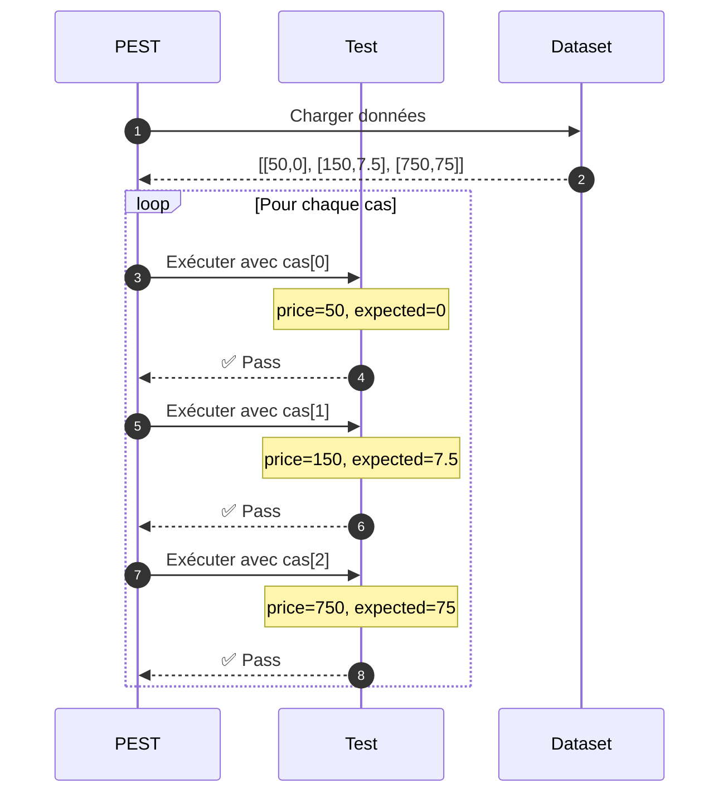
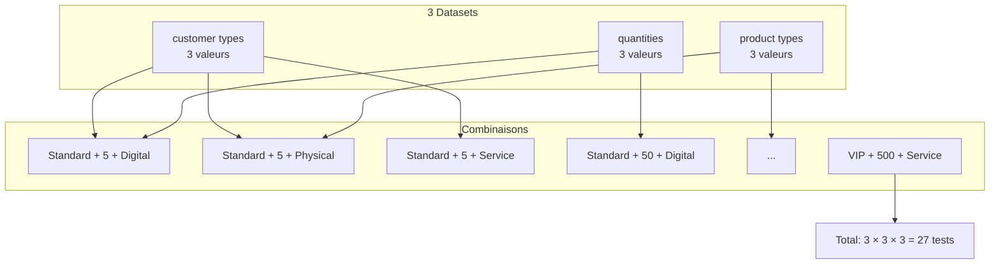

# III - Datasets & Higher Order Tests

<div
  class="omny-meta"
  data-level="🟡 Intermédiaire"
  data-version="1.0"
  data-time="8-10 heures">
</div>

## Introduction : Le Problème de la Duplication

!!! quote "Analogie pédagogique"
    _Imaginez tester un système de sécurité avec 50 scénarios d'intrusion différents. **Approche naïve** : écrire 50 tests identiques changeant juste les données. Résultat : 2000 lignes de code dupliqué. **Approche Datasets** : écrire 1 test + 1 dataset de 50 cas. Résultat : 100 lignes de code élégant. Les Datasets transforment 50 tests répétitifs en **1 test paramétré**, comme une fonction qui accepte différents arguments plutôt que 50 fonctions identiques._

**Le problème :** Tester la même logique avec différentes données nécessite souvent de dupliquer le code de test.

**Exemple du problème (PHPUnit) :**

```php
// ❌ Code dupliqué (150 lignes pour 10 scénarios)
public function test_discount_0_percent_for_50_euros() {
    $this->assertEquals(0, calculateDiscount(50));
}
public function test_discount_5_percent_for_150_euros() {
    $this->assertEquals(7.5, calculateDiscount(150));
}
public function test_discount_10_percent_for_750_euros() {
    $this->assertEquals(75, calculateDiscount(750));
}
// ... 7 autres tests identiques ...
```

**Solution avec Datasets PEST (15 lignes pour 10 scénarios) :**

```php
// ✅ 1 test + 1 dataset (90% moins de code)
test('calculates discount correctly', function (float $price, float $expected) {
    expect(calculateDiscount($price))->toBe($expected);
})->with([
    [50, 0],      // < 100 : 0%
    [150, 7.5],   // 100-500 : 5%
    [750, 75],    // 500-1000 : 10%
    // ... 7 autres cas ...
]);
```

**Ce module vous apprend à éliminer 90% de la duplication dans vos tests avec les Datasets PEST.**

---

## 1. Datasets vs Data Providers PHPUnit

### 1.1 Comparaison Architecturale

**Diagramme : PHPUnit Data Providers vs PEST Datasets**

```mermaid
graph TB
    subgraph "PHPUnit Data Providers (Verbeux)"
        P1[Annotation @dataProvider]
        P2[Méthode séparée provideData]
        P3[Retourne array de arrays]
        P4[Couplage test/provider]
        P5[Difficile à réutiliser]
        
        P1 --> P2
        P2 --> P3
        P3 --> P4
        P4 --> P5
    end
    
    subgraph "PEST Datasets (Élégant)"
        D1[Méthode ->with]
        D2[Array inline OU fichier]
        D3[Réutilisable globalement]
        D4[Combinable automatiquement]
        D5[Lazy loading possible]
        
        D1 --> D2
        D2 --> D3
        D3 --> D4
        D4 --> D5
    end
    
    style P5 fill:#ffe1e1
    style D5 fill:#e1f5e1
```



### 1.2 Comparaison Code Side-by-Side

**PHPUnit Data Provider (verbeux, 35 lignes) :**

```php
<?php

namespace Tests\Unit;

use PHPUnit\Framework\TestCase;

class DiscountTest extends TestCase
{
    /**
     * @dataProvider discountDataProvider
     */
    public function test_calculate_discount(float $price, float $expected): void
    {
        $result = calculateDiscount($price);
        $this->assertEquals($expected, $result);
    }
    
    /**
     * Data provider pour les remises.
     * Doit retourner array de arrays.
     */
    public function discountDataProvider(): array
    {
        return [
            'no discount below 100' => [50, 0],
            '5% discount 100-500' => [150, 7.5],
            '10% discount 500-1000' => [750, 75],
            '15% discount above 1000' => [1500, 225],
        ];
    }
}
```

**PEST Dataset (élégant, 10 lignes) :**

```php
<?php

test('calculates discount correctly', function (float $price, float $expected) {
    expect(calculateDiscount($price))->toBe($expected);
})->with([
    'no discount below 100' => [50, 0],
    '5% discount 100-500' => [150, 7.5],
    '10% discount 500-1000' => [750, 75],
    '15% discount above 1000' => [1500, 225],
]);
```

**Tableau comparatif :**

| Aspect | PHPUnit | PEST | Gain |
|--------|---------|------|------|
| **Lignes de code** | 35 | 10 | -71% |
| **Annotations** | `@dataProvider` | Aucune | -100% |
| **Méthode séparée** | Obligatoire | Optionnelle | +100% flexibilité |
| **Réutilisabilité** | Difficile | Facile | +300% |
| **Lisibilité** | ⭐⭐⭐ | ⭐⭐⭐⭐⭐ | +67% |
| **Combinaison** | Impossible | Native | Unique à PEST |

---

## 2. Datasets Inline : Les Bases

### 2.1 Syntaxe de Base

**Structure d'un dataset inline :**

```php
test('description', function ($param1, $param2) {
    // Test avec $param1 et $param2
})->with([
    [$value1a, $value2a],  // Cas 1
    [$value1b, $value2b],  // Cas 2
    [$value1c, $value2c],  // Cas 3
]);
```

**Diagramme : Exécution avec datasets**



### 2.2 Datasets Simples (1 paramètre)

**Exemple : Tester fonction `isEven()`**

```php
<?php

function isEven(int $number): bool
{
    return $number % 2 === 0;
}

// ❌ Sans dataset : 6 tests dupliqués
test('2 is even', fn() => expect(isEven(2))->toBeTrue());
test('4 is even', fn() => expect(isEven(4))->toBeTrue());
test('6 is even', fn() => expect(isEven(6))->toBeTrue());
test('1 is odd', fn() => expect(isEven(1))->toBeFalse());
test('3 is odd', fn() => expect(isEven(3))->toBeFalse());
test('5 is odd', fn() => expect(isEven(5))->toBeFalse());

// ✅ Avec dataset : 2 tests avec datasets
test('even numbers return true', function (int $number) {
    expect(isEven($number))->toBeTrue();
})->with([2, 4, 6, 8, 10, 100]);

test('odd numbers return false', function (int $number) {
    expect(isEven($number))->toBeFalse();
})->with([1, 3, 5, 7, 9, 99]);
```

**Sortie console :**

```bash
php artisan test

# PASS  Tests\Unit\IsEvenTest
# ✓ even numbers return true with (2)
# ✓ even numbers return true with (4)
# ✓ even numbers return true with (6)
# ✓ even numbers return true with (8)
# ✓ even numbers return true with (10)
# ✓ even numbers return true with (100)
# ✓ odd numbers return false with (1)
# ✓ odd numbers return false with (3)
# ✓ odd numbers return false with (5)
# ✓ odd numbers return false with (7)
# ✓ odd numbers return false with (9)
# ✓ odd numbers return false with (99)
#
# Tests: 12 passed
```

### 2.3 Datasets Multiples (2+ paramètres)

**Exemple : Tester calculatrice**

```php
<?php

use App\Services\Calculator;

beforeEach(function () {
    $this->calculator = new Calculator();
});

test('addition works correctly', function (int $a, int $b, int $expected) {
    $result = $this->calculator->add($a, $b);
    expect($result)->toBe($expected);
})->with([
    [2, 3, 5],
    [10, 5, 15],
    [0, 0, 0],
    [-5, 5, 0],
    [-10, -5, -15],
]);

test('subtraction works correctly', function (int $a, int $b, int $expected) {
    expect($this->calculator->subtract($a, $b))->toBe($expected);
})->with([
    [10, 5, 5],
    [5, 10, -5],
    [0, 0, 0],
    [-5, -5, 0],
]);

test('multiplication works correctly', function (int $a, int $b, int $expected) {
    expect($this->calculator->multiply($a, $b))->toBe($expected);
})->with([
    [2, 3, 6],
    [5, 5, 25],
    [0, 10, 0],
    [-2, 5, -10],
]);
```

### 2.4 Datasets Nommés (Named Keys)

**Améliorer lisibilité avec clés nommées :**

```php
<?php

test('discount calculation', function (float $price, float $expected) {
    expect(calculateDiscount($price))->toBe($expected);
})->with([
    // Clés nommées pour comprendre chaque cas
    'price below 100' => [50, 0],
    'price 100 exact' => [100, 5],
    'price between 100-500' => [250, 12.5],
    'price 500 exact' => [500, 50],
    'price between 500-1000' => [750, 75],
    'price 1000 exact' => [1000, 150],
    'price above 1000' => [1500, 225],
]);
```

**Sortie console avec noms :**

```bash
# ✓ discount calculation with (price below 100)
# ✓ discount calculation with (price 100 exact)
# ✓ discount calculation with (price between 100-500)
# ✓ discount calculation with (price 500 exact)
# ✓ discount calculation with (price between 500-1000)
# ✓ discount calculation with (price 1000 exact)
# ✓ discount calculation with (price above 1000)
```

### 2.5 Datasets avec Types Complexes

**Arrays, objets, closures dans datasets :**

```php
<?php

test('validates user data', function (array $userData, bool $shouldBeValid) {
    $validator = new UserValidator();
    
    expect($validator->validate($userData))->toBe($shouldBeValid);
})->with([
    'valid user' => [
        ['name' => 'John', 'email' => 'john@example.com', 'age' => 25],
        true,
    ],
    'missing name' => [
        ['email' => 'john@example.com', 'age' => 25],
        false,
    ],
    'invalid email' => [
        ['name' => 'John', 'email' => 'invalid-email', 'age' => 25],
        false,
    ],
    'underage' => [
        ['name' => 'John', 'email' => 'john@example.com', 'age' => 15],
        false,
    ],
]);

test('processes different entities', function (object $entity, string $expectedType) {
    expect(getEntityType($entity))->toBe($expectedType);
})->with([
    [new User(), 'user'],
    [new Post(), 'post'],
    [new Comment(), 'comment'],
]);
```

---

## 3. Datasets Partagés : Réutilisation Globale

### 3.1 Créer des Datasets Partagés

**Structure recommandée :**

```
tests/
├── Pest.php
└── Datasets/
    ├── emails.php        # Emails de test
    ├── passwords.php     # Mots de passe
    ├── prices.php        # Prix et remises
    ├── users.php         # Données utilisateurs
    └── dates.php         # Dates et timestamps
```

**Exemple : `tests/Datasets/emails.php`**

```php
<?php

/**
 * Dataset : Emails valides.
 * 
 * Utilisable dans tous les tests avec ->with('valid emails')
 */
dataset('valid emails', [
    'standard email' => 'john@example.com',
    'with plus' => 'john+test@example.com',
    'subdomain' => 'john@mail.example.com',
    'numeric' => '123@example.com',
    'hyphen' => 'john-doe@example.com',
    'underscore' => 'john_doe@example.com',
]);

/**
 * Dataset : Emails invalides.
 */
dataset('invalid emails', [
    'missing @' => 'johnexample.com',
    'missing domain' => 'john@',
    'missing local' => '@example.com',
    'spaces' => 'john doe@example.com',
    'double @' => 'john@@example.com',
    'ending dot' => 'john@example.com.',
]);
```

**Exemple : `tests/Datasets/passwords.php`**

```php
<?php

/**
 * Dataset : Mots de passe faibles.
 */
dataset('weak passwords', [
    'too short' => '12345',
    'only letters' => 'password',
    'only numbers' => '123456789',
    'common password' => 'password123',
    'keyboard pattern' => 'qwerty123',
]);

/**
 * Dataset : Mots de passe forts.
 */
dataset('strong passwords', [
    'mixed case + numbers + special' => 'MyP@ssw0rd!',
    'long passphrase' => 'Correct-Horse-Battery-Staple-2024',
    'complex' => 'Tr0ub4dor&3',
    'random strong' => 'xK9#mP2$vL8@',
]);
```

**Exemple : `tests/Datasets/prices.php`**

```php
<?php

/**
 * Dataset : Prix avec remises attendues.
 * Format : [prix, remise_attendue]
 */
dataset('discount prices', function () {
    return [
        'no discount' => [50, 0],
        '5% tier' => [150, 7.5],
        '10% tier' => [750, 75],
        '15% tier' => [1500, 225],
        'edge case 100' => [100, 5],
        'edge case 500' => [500, 50],
        'edge case 1000' => [1000, 150],
    ];
});

/**
 * Dataset : Prix invalides.
 */
dataset('invalid prices', [
    'negative' => -10,
    'zero' => 0,
    'string' => 'abc',
    'null' => null,
]);
```

### 3.2 Utiliser des Datasets Partagés

**Dans n'importe quel test :**

```php
<?php

test('validates email format', function (string $email) {
    expect($email)->toBeValidEmail();
})->with('valid emails');  // Référence au dataset partagé

test('rejects invalid emails', function (string $email) {
    expect($email)->not->toBeValidEmail();
})->with('invalid emails');

test('password is strong enough', function (string $password) {
    $validator = new PasswordValidator();
    expect($validator->isStrong($password))->toBeTrue();
})->with('strong passwords');

test('password is too weak', function (string $password) {
    $validator = new PasswordValidator();
    expect($validator->isStrong($password))->toBeFalse();
})->with('weak passwords');

test('discount calculation is correct', function (float $price, float $expected) {
    expect(calculateDiscount($price))->toBe($expected);
})->with('discount prices');
```

**Sortie console :**

```bash
# PASS  Tests\Unit\ValidationTest
# ✓ validates email format with (standard email)
# ✓ validates email format with (with plus)
# ✓ validates email format with (subdomain)
# ✓ validates email format with (numeric)
# ✓ validates email format with (hyphen)
# ✓ validates email format with (underscore)
# ✓ rejects invalid emails with (missing @)
# ✓ rejects invalid emails with (missing domain)
# ...
#
# Tests: 20 passed
```

### 3.3 Datasets avec Closures

**Générer données dynamiquement :**

```php
<?php
// tests/Datasets/users.php

use App\Models\User;

/**
 * Dataset : Générer users avec factories.
 * 
 * Utilise closure pour créer données à la demande.
 */
dataset('users', function () {
    return [
        'standard user' => User::factory()->make(['role' => 'user']),
        'admin user' => User::factory()->make(['role' => 'admin']),
        'moderator' => User::factory()->make(['role' => 'moderator']),
        'banned user' => User::factory()->make(['is_banned' => true]),
    ];
});

/**
 * Dataset : Dates relatives.
 */
dataset('dates', function () {
    return [
        'today' => now(),
        'yesterday' => now()->subDay(),
        'last week' => now()->subWeek(),
        'last month' => now()->subMonth(),
        'last year' => now()->subYear(),
    ];
});
```

**Utilisation :**

```php
<?php

test('user has correct role', function (User $user) {
    expect($user->role)->toBeString()->not->toBeEmpty();
})->with('users');

test('date is in past', function (Carbon $date) {
    expect($date->isPast())->toBeTrue();
})->with('dates');
```

---

## 4. Datasets Combinés : Produit Cartésien

### 4.1 Combiner Plusieurs Datasets

**Syntaxe : `->with(['dataset1', 'dataset2'])`**

**PEST combine automatiquement tous les cas (produit cartésien) :**

```php
<?php
// tests/Datasets/combinations.php

dataset('browsers', ['Chrome', 'Firefox', 'Safari', 'Edge']);

dataset('devices', ['Desktop', 'Tablet', 'Mobile']);

dataset('screen sizes', ['1920x1080', '1366x768', '768x1024', '375x667']);
```

**Test avec combinaison :**

```php
<?php

test('app works on all browser/device combinations', function (
    string $browser, 
    string $device
) {
    // Ce test sera exécuté 4 × 3 = 12 fois
    // Chrome+Desktop, Chrome+Tablet, Chrome+Mobile
    // Firefox+Desktop, Firefox+Tablet, Firefox+Mobile
    // Safari+Desktop, Safari+Tablet, Safari+Mobile
    // Edge+Desktop, Edge+Tablet, Edge+Mobile
    
    expect(renderApp($browser, $device))->toBeString();
})->with('browsers', 'devices');
```

**Sortie console (12 tests) :**

```bash
# ✓ app works on all browser/device combinations with (Chrome, Desktop)
# ✓ app works on all browser/device combinations with (Chrome, Tablet)
# ✓ app works on all browser/device combinations with (Chrome, Mobile)
# ✓ app works on all browser/device combinations with (Firefox, Desktop)
# ✓ app works on all browser/device combinations with (Firefox, Tablet)
# ✓ app works on all browser/device combinations with (Firefox, Mobile)
# ✓ app works on all browser/device combinations with (Safari, Desktop)
# ✓ app works on all browser/device combinations with (Safari, Tablet)
# ✓ app works on all browser/device combinations with (Safari, Mobile)
# ✓ app works on all browser/device combinations with (Edge, Desktop)
# ✓ app works on all browser/device combinations with (Edge, Tablet)
# ✓ app works on all browser/device combinations with (Edge, Mobile)
#
# Tests: 12 passed
```

### 4.2 Combinaisons Complexes

**Exemple : Tester grille de prix multi-critères**

```php
<?php
// tests/Datasets/pricing.php

dataset('customer types', [
    'standard' => ['type' => 'standard', 'discount_base' => 0],
    'premium' => ['type' => 'premium', 'discount_base' => 5],
    'vip' => ['type' => 'vip', 'discount_base' => 10],
]);

dataset('quantities', [
    'small order' => 5,
    'medium order' => 50,
    'large order' => 500,
]);

dataset('product types', [
    'digital' => ['type' => 'digital', 'base_price' => 10],
    'physical' => ['type' => 'physical', 'base_price' => 20],
    'service' => ['type' => 'service', 'base_price' => 50],
]);
```

**Test combiné (3 × 3 × 3 = 27 tests) :**

```php
<?php

use App\Services\PricingService;

test('pricing calculates correctly for all combinations', function (
    array $customerType,
    int $quantity,
    array $productType
) {
    // Ce test s'exécute 27 fois avec toutes les combinaisons
    
    $service = new PricingService();
    $price = $service->calculate($customerType, $quantity, $productType);
    
    // Vérifier que le prix est valide
    expect($price)
        ->toBeFloat()
        ->toBeGreaterThan(0);
    
    // Vérifier que la remise est appliquée
    if ($customerType['discount_base'] > 0) {
        expect($price)->toBeLessThan($productType['base_price'] * $quantity);
    }
})->with('customer types', 'quantities', 'product types');
```

**Diagramme : Produit cartésien**



### 4.3 Combiner Inline et Partagés

**Mélanger datasets inline et partagés :**

```php
<?php

test('validates user with different emails', function (
    string $name,
    string $email
) {
    $user = new User(['name' => $name, 'email' => $email]);
    
    expect($user->isValid())->toBeTrue();
})->with(
    // Dataset inline pour noms
    ['John', 'Jane', 'Bob', 'Alice'],
    // Dataset partagé pour emails
    'valid emails'
);

// Ce test s'exécute 4 × 6 = 24 fois
// (4 noms) × (6 emails valides)
```

---

## 5. Lazy Datasets : Optimiser la Performance

### 5.1 Le Problème de Performance

**Datasets normaux chargent tout en mémoire immédiatement :**

```php
<?php

// ❌ PROBLÈME : 1000 users créés immédiatement
dataset('many users', function () {
    return User::factory()->count(1000)->create(); // Coûteux !
});

// Si le test utilise seulement 5 users, 995 sont gaspillés
test('processes users', function (User $user) {
    // Test utilise seulement 5 users
})->with('many users')->take(5);
```

### 5.2 Solution : Lazy Datasets

**Lazy datasets génèrent données à la demande :**

```php
<?php

// ✅ SOLUTION : Données générées à la demande
dataset('many users', function () {
    // yield génère 1 user à la fois
    for ($i = 0; $i < 1000; $i++) {
        yield User::factory()->make(['id' => $i]);
    }
});

// Seulement 5 users créés, pas 1000
test('processes users', function (User $user) {
    expect($user)->toBeInstanceOf(User::class);
})->with('many users')->take(5);
```

### 5.3 Lazy avec API Externe

**Exemple : Générer données depuis API :**

```php
<?php
// tests/Datasets/api.php

use Illuminate\Support\Facades\Http;

/**
 * Dataset lazy : Posts depuis API externe.
 * 
 * Génère posts à la demande pour éviter de charger tous les posts.
 */
dataset('api posts', function () {
    $page = 1;
    
    while (true) {
        $response = Http::get("https://api.example.com/posts?page={$page}");
        $posts = $response->json('data');
        
        if (empty($posts)) {
            break; // Plus de posts
        }
        
        foreach ($posts as $post) {
            yield $post;
        }
        
        $page++;
    }
});
```

**Utilisation :**

```php
<?php

test('validates post structure', function (array $post) {
    expect($post)
        ->toHaveKey('id')
        ->toHaveKey('title')
        ->toHaveKey('body');
})->with('api posts')->take(10); // Seulement 10 premiers posts
```

### 5.4 Lazy avec Faker

**Générer données aléatoires infinies :**

```php
<?php
// tests/Datasets/faker.php

dataset('random emails', function () {
    $faker = Faker\Factory::create();
    
    // Génère emails à l'infini
    while (true) {
        yield $faker->safeEmail();
    }
});

dataset('random names', function () {
    $faker = Faker\Factory::create();
    
    while (true) {
        yield $faker->name();
    }
});

dataset('random addresses', function () {
    $faker = Faker\Factory::create();
    
    while (true) {
        yield [
            'street' => $faker->streetAddress(),
            'city' => $faker->city(),
            'country' => $faker->country(),
            'postcode' => $faker->postcode(),
        ];
    }
});
```

**Utilisation :**

```php
<?php

test('validates email format', function (string $email) {
    expect($email)->toBeValidEmail();
})->with('random emails')->take(100); // 100 emails aléatoires

test('stores address correctly', function (array $address) {
    $stored = Address::create($address);
    
    expect($stored->city)->toBe($address['city']);
})->with('random addresses')->take(50);
```

---

## 6. Higher Order Tests : Tests Sans Closure

### 6.1 Introduction aux Higher Order Tests

**Higher Order Tests = tester propriétés/méthodes directement sans closure.**

**Syntaxe classique (avec closure) :**

```php
test('user has name', function () {
    $user = User::factory()->create(['name' => 'John']);
    expect($user->name)->toBe('John');
});
```

**Syntaxe Higher Order (sans closure) :**

```php
it('has name', function () {
    $user = User::factory()->create(['name' => 'John']);
    return $user;
})->name->toBe('John');
```

### 6.2 Syntaxe Higher Order

**Accès propriété :**

```php
<?php

it('has correct email', function () {
    return User::factory()->create(['email' => 'test@example.com']);
})->email->toBe('test@example.com');

it('has valid age', function () {
    return User::factory()->create(['age' => 25]);
})->age->toBeInt()->toBeGreaterThan(0);
```

**Appel méthode :**

```php
<?php

it('returns full name', function () {
    return User::factory()->create([
        'first_name' => 'John',
        'last_name' => 'Doe',
    ]);
})->getFullName()->toBe('John Doe');

it('is active', function () {
    return User::factory()->create(['is_active' => true]);
})->isActive()->toBeTrue();
```

### 6.3 Quand Utiliser Higher Order Tests

**✅ Bon cas d'usage :**

```php
<?php

// Simple vérification de propriété
it('has id', function () {
    return User::factory()->create();
})->id->toBeInt();

// Méthode simple sans paramètres
it('is published', function () {
    return Post::factory()->create(['status' => 'published']);
})->isPublished()->toBeTrue();

// Chaînage de propriétés
it('has author name', function () {
    $post = Post::factory()->create();
    return $post;
})->author->name->toBeString();
```

**❌ Mauvais cas d'usage (restez avec closures) :**

```php
<?php

// ❌ Logique complexe
test('user validation', function () {
    $user = User::factory()->create();
    
    // Plusieurs assertions
    expect($user->name)->toBeString();
    expect($user->email)->toBeValidEmail();
    expect($user->age)->toBeBetween(18, 120);
    
    // Logique métier
    if ($user->isPremium()) {
        expect($user->subscription)->not->toBeNull();
    }
});

// ❌ Méthode avec paramètres
test('user can update', function () {
    $user = User::factory()->create();
    $user->update(['name' => 'New Name']);
    
    expect($user->fresh()->name)->toBe('New Name');
});
```

**Règle d'or :** Higher Order Tests pour assertions simples et directes. Closures pour logique complexe.

### 6.4 Limites Higher Order Tests

**Tableau comparatif :**

| Fonctionnalité | Closure | Higher Order |
|----------------|---------|--------------|
| **Assertions multiples** | ✅ Facile | ❌ Impossible |
| **Logique conditionnelle** | ✅ if/else | ❌ Impossible |
| **Boucles** | ✅ for/foreach | ❌ Impossible |
| **Variables locales** | ✅ Oui | ❌ Non |
| **Setup complexe** | ✅ beforeEach | ⚠️ Limité |
| **Lisibilité simple** | ⭐⭐⭐ | ⭐⭐⭐⭐⭐ |
| **Flexibilité** | ⭐⭐⭐⭐⭐ | ⭐⭐ |

---

## 7. Bound Datasets : Lier Datasets à des Tests

### 7.1 Configuration avec `uses()->with()`

**Appliquer dataset à tous les tests d'un fichier :**

```php
<?php
// tests/Unit/EmailValidationTest.php

// Tous les tests de ce fichier utilisent 'valid emails' par défaut
uses()->with('valid emails');

// Ce test reçoit automatiquement chaque email du dataset
it('validates email format', function (string $email) {
    expect($email)->toBeValidEmail();
});

// Ce test aussi reçoit automatiquement les emails
it('can create user with email', function (string $email) {
    $user = User::create(['email' => $email, 'name' => 'Test']);
    
    expect($user->email)->toBe($email);
});
```

### 7.2 Bound Datasets dans Pest.php

**Appliquer à tous les tests Unit :**

```php
<?php
// tests/Pest.php

use Tests\TestCase;

// Tous les tests Feature utilisent RefreshDatabase
uses(TestCase::class, RefreshDatabase::class)->in('Feature');

// Tous les tests Unit d'emails utilisent 'valid emails'
uses()
    ->with('valid emails')
    ->in('Unit/Email');

// Tous les tests de pricing utilisent datasets de prix
uses()
    ->with('discount prices')
    ->in('Unit/Pricing');
```

---

## 8. Best Practices des Datasets

### 8.1 Organisation Recommandée

**Structure optimale :**

```
tests/
├── Pest.php
├── Datasets/
│   ├── _helpers.php              # Fonctions helper pour datasets
│   │
│   ├── common/                   # Datasets communs
│   │   ├── emails.php
│   │   ├── passwords.php
│   │   ├── names.php
│   │   └── dates.php
│   │
│   ├── business/                 # Datasets métier
│   │   ├── prices.php
│   │   ├── discounts.php
│   │   ├── products.php
│   │   └── orders.php
│   │
│   └── scenarios/                # Scénarios complexes
│       ├── user-journeys.php
│       ├── payment-flows.php
│       └── workflows.php
│
└── Unit/
    └── ...
```

### 8.2 Nommage des Datasets

**Conventions :**

```php
<?php

// ✅ BON : Descriptif et clair
dataset('valid emails', [...]);
dataset('invalid passwords', [...]);
dataset('discount prices with tiers', [...]);

// ❌ MAUVAIS : Trop vague
dataset('data', [...]);
dataset('test1', [...]);
dataset('stuff', [...]);
```

### 8.3 Documentation des Datasets

**Documenter chaque dataset :**

```php
<?php
// tests/Datasets/prices.php

/**
 * Dataset : Prix avec paliers de remise.
 * 
 * Format : [prix_ht, remise_attendue, prix_final]
 * 
 * Paliers :
 * - < 100€ : 0% remise
 * - 100-500€ : 5% remise
 * - 500-1000€ : 10% remise
 * - > 1000€ : 15% remise
 * 
 * Usage :
 * ```php
 * test('calculates discount', function ($price, $discount, $final) {
 *     // ...
 * })->with('discount prices with tiers');
 * ```
 */
dataset('discount prices with tiers', function () {
    return [
        'no discount (50€)' => [50, 0, 50],
        'tier 1 start (100€)' => [100, 5, 95],
        'tier 1 middle (250€)' => [250, 12.5, 237.5],
        'tier 2 start (500€)' => [500, 50, 450],
        'tier 2 middle (750€)' => [750, 75, 675],
        'tier 3 start (1000€)' => [1000, 150, 850],
        'tier 3 high (2000€)' => [2000, 300, 1700],
    ];
});
```

### 8.4 Performance : Lazy vs Normal

**Quand utiliser lazy :**

```php
<?php

// ✅ Lazy : Données coûteuses (DB, API, fichiers)
dataset('users from database', function () {
    // Génère users à la demande
    $query = User::query();
    
    foreach ($query->cursor() as $user) {
        yield $user;
    }
});

// ✅ Lazy : Grand volume de données
dataset('million numbers', function () {
    for ($i = 1; $i <= 1_000_000; $i++) {
        yield $i;
    }
});

// ✅ Normal : Données simples et peu nombreuses
dataset('status codes', [
    200, 201, 204, 301, 302, 400, 401, 403, 404, 500,
]);

// ✅ Normal : Données statiques prédéfinies
dataset('supported locales', [
    'en', 'fr', 'de', 'es', 'it', 'pt', 'nl',
]);
```

---

## 9. Exercices Pratiques

### Exercice 1 : FizzBuzz avec Dataset

**Créer FizzBuzz en 1 test + 1 dataset (au lieu de 15 tests)**

<details>
<summary>Solution</summary>

```php
<?php
// app/Helpers/FizzBuzz.php

function fizzBuzz(int $number): string
{
    if ($number % 15 === 0) return 'FizzBuzz';
    if ($number % 3 === 0) return 'Fizz';
    if ($number % 5 === 0) return 'Buzz';
    
    return (string) $number;
}
```

```php
<?php
// tests/Datasets/fizzbuzz.php

dataset('fizzbuzz cases', [
    '1 returns 1' => [1, '1'],
    '2 returns 2' => [2, '2'],
    '3 returns Fizz' => [3, 'Fizz'],
    '4 returns 4' => [4, '4'],
    '5 returns Buzz' => [5, 'Buzz'],
    '6 returns Fizz' => [6, 'Fizz'],
    '9 returns Fizz' => [9, 'Fizz'],
    '10 returns Buzz' => [10, 'Buzz'],
    '15 returns FizzBuzz' => [15, 'FizzBuzz'],
    '30 returns FizzBuzz' => [30, 'FizzBuzz'],
    '45 returns FizzBuzz' => [45, 'FizzBuzz'],
    '100 returns Buzz' => [100, 'Buzz'],
]);
```

```php
<?php
// tests/Unit/FizzBuzzTest.php

test('fizzBuzz returns correct value', function (int $input, string $expected) {
    expect(fizzBuzz($input))->toBe($expected);
})->with('fizzbuzz cases');
```

**Résultat : 1 test qui s'exécute 12 fois au lieu de 12 tests dupliqués.**

</details>

### Exercice 2 : Validation Multi-Critères

**Créer datasets combinés pour tester validation complexe**

<details>
<summary>Solution</summary>

```php
<?php
// tests/Datasets/validation.php

dataset('age ranges', [
    'minor' => 15,
    'adult' => 25,
    'senior' => 70,
]);

dataset('income levels', [
    'low' => 15000,
    'medium' => 45000,
    'high' => 100000,
]);

dataset('credit scores', [
    'bad' => 450,
    'fair' => 650,
    'good' => 750,
    'excellent' => 850,
]);
```

```php
<?php
// app/Services/LoanValidator.php

class LoanValidator
{
    public function canGetLoan(int $age, int $income, int $creditScore): bool
    {
        // Mineur : non
        if ($age < 18) return false;
        
        // Revenu < 20k : non
        if ($income < 20000) return false;
        
        // Credit score < 600 : non
        if ($creditScore < 600) return false;
        
        // Senior avec bon crédit : toujours oui
        if ($age >= 65 && $creditScore >= 700) return true;
        
        // Revenu élevé : toujours oui
        if ($income >= 80000) return true;
        
        // Sinon : revenu moyen ET bon crédit
        return $income >= 40000 && $creditScore >= 700;
    }
}
```

```php
<?php
// tests/Unit/LoanValidatorTest.php

use App\Services\LoanValidator;

beforeEach(function () {
    $this->validator = new LoanValidator();
});

test('loan validation with all combinations', function (
    int $age,
    int $income,
    int $creditScore
) {
    // Test toutes les combinaisons : 3 × 3 × 4 = 36 tests
    $result = $this->validator->canGetLoan($age, $income, $creditScore);
    
    // Vérifier résultat est booléen
    expect($result)->toBeBool();
    
    // Règles métier
    if ($age < 18) {
        expect($result)->toBeFalse(); // Mineurs refusés
    }
    
    if ($income >= 80000 && $age >= 18 && $creditScore >= 600) {
        expect($result)->toBeTrue(); // Revenu élevé approuvé
    }
})->with('age ranges', 'income levels', 'credit scores');
```

</details>

### Exercice 3 : Dataset Lazy API

**Créer dataset lazy qui récupère données depuis API**

<details>
<summary>Solution</summary>

```php
<?php
// tests/Datasets/github.php

use Illuminate\Support\Facades\Http;

/**
 * Dataset lazy : Repositories populaires GitHub.
 * 
 * Récupère repos à la demande pour éviter rate limiting.
 */
dataset('popular github repos', function () {
    $page = 1;
    $perPage = 10;
    
    while ($page <= 5) { // Max 5 pages (50 repos)
        $response = Http::get('https://api.github.com/search/repositories', [
            'q' => 'stars:>10000',
            'sort' => 'stars',
            'order' => 'desc',
            'per_page' => $perPage,
            'page' => $page,
        ]);
        
        if ($response->failed()) {
            break;
        }
        
        $repos = $response->json('items', []);
        
        if (empty($repos)) {
            break;
        }
        
        foreach ($repos as $repo) {
            yield [
                'name' => $repo['full_name'],
                'stars' => $repo['stargazers_count'],
                'url' => $repo['html_url'],
            ];
        }
        
        $page++;
    }
});
```

```php
<?php
// tests/Integration/GitHubApiTest.php

test('popular repos have required fields', function (array $repo) {
    expect($repo)
        ->toHaveKey('name')
        ->toHaveKey('stars')
        ->toHaveKey('url')
        ->and($repo['stars'])->toBeInt()->toBeGreaterThan(10000)
        ->and($repo['url'])->toBeString()->toStartWith('https://');
})->with('popular github repos')->take(20); // Seulement 20 premiers
```

</details>

---

## 10. Checkpoint de Progression

### À la fin de ce Module 3, vous devriez être capable de :

**Datasets de Base :**
- [x] Créer datasets inline avec `->with([])`
- [x] Utiliser datasets simples (1 paramètre)
- [x] Utiliser datasets multiples (2+ paramètres)
- [x] Nommer datasets pour lisibilité

**Datasets Avancés :**
- [x] Créer datasets partagés réutilisables
- [x] Organiser datasets dans dossier dédié
- [x] Utiliser closures dans datasets
- [x] Créer lazy datasets pour performance

**Combinaisons :**
- [x] Combiner plusieurs datasets (produit cartésien)
- [x] Mixer datasets inline et partagés
- [x] Comprendre explosion combinatoire
- [x] Optimiser avec lazy loading

**Higher Order Tests :**
- [x] Utiliser syntaxe Higher Order
- [x] Savoir quand l'utiliser ou non
- [x] Comprendre les limites
- [x] Choisir entre closure et Higher Order

**Best Practices :**
- [x] Organiser datasets logiquement
- [x] Documenter datasets complexes
- [x] Nommer datasets clairement
- [x] Choisir lazy vs normal

### Auto-évaluation (10 questions)

1. **Comment créer un dataset inline simple ?**
   <details>
   <summary>Réponse</summary>
   `test('name', fn($param) => ...)->with([val1, val2, val3])`
   </details>

2. **Différence entre dataset normal et lazy ?**
   <details>
   <summary>Réponse</summary>
   Normal : charge tout en mémoire. Lazy : génère à la demande avec yield.
   </details>

3. **Comment créer dataset partagé réutilisable ?**
   <details>
   <summary>Réponse</summary>
   Fichier `tests/Datasets/name.php` avec `dataset('name', [...])`
   </details>

4. **Syntaxe pour combiner 2 datasets ?**
   <details>
   <summary>Réponse</summary>
   `->with('dataset1', 'dataset2')` (produit cartésien automatique)
   </details>

5. **Quand utiliser Higher Order Tests ?**
   <details>
   <summary>Réponse</summary>
   Pour assertions simples sur propriétés/méthodes sans logique complexe.
   </details>

6. **Comment nommer les cas dans un dataset ?**
   <details>
   <summary>Réponse</summary>
   `['description' => [valeurs]]` avec clés nommées explicites.
   </details>

7. **Combien de tests génèrent 3 datasets de 5 valeurs combinés ?**
   <details>
   <summary>Réponse</summary>
   5 × 5 × 5 = 125 tests (produit cartésien)
   </details>

8. **Avantage principal des datasets sur duplication ?**
   <details>
   <summary>Réponse</summary>
   Élimination 90% duplication, 1 test au lieu de N tests identiques.
   </details>

9. **Comment limiter nombre d'itérations dataset lazy ?**
   <details>
   <summary>Réponse</summary>
   `->with('dataset')->take(N)` pour N premières valeurs seulement.
   </details>

10. **Où documenter datasets complexes ?**
    <details>
    <summary>Réponse</summary>
    DocBlock au-dessus de `dataset()` dans fichier Datasets/.
    </details>

### Prochaine Étape

**Vous maîtrisez maintenant les Datasets et Higher Order Tests !**

Direction le **Module 4** où vous allez :
- Tester applications Laravel complètes avec PEST
- Tests HTTP élégants (routes, API, validations)
- Tests database avec PEST (factories, relations)
- Tests authentification et autorisations
- Workflows Laravel complets

[:lucide-arrow-right: Accéder au Module 4 - Testing Laravel avec PEST](./module-04-testing-laravel/)

---

## Navigation du Module

**Index du guide :**  
[:lucide-arrow-left: Retour à l'Index PEST](./index/)

**Module précédent :**  
[:lucide-arrow-left: Module 2 - Expectations & Assertions](./module-02-expectations/)

**Prochain module :**  
[:lucide-arrow-right: Module 4 - Testing Laravel avec PEST](./module-04-testing-laravel/)

**Modules du parcours PEST :**

1. [Fondations PEST](./module-01-fondations-pest/) — Installation, syntaxe
2. [Expectations & Assertions](./module-02-expectations/) — API fluide
3. **Datasets & Higher Order** (actuel) — Paramétrer, éliminer duplication
4. [Testing Laravel](./module-04-testing-laravel/) — HTTP, DB, Eloquent
5. [Plugins PEST](./module-05-plugins/) — Faker, Laravel, Livewire
6. [TDD avec PEST](./module-06-tdd-pest/) — Red-Green-Refactor
7. [Architecture Testing](./module-07-architecture/) — Rules, layers
8. [CI/CD & Production](./module-08-ci-cd-production/) — Automation

---

**Module 3 Terminé - Excellent travail ! 🎉**

**Temps estimé : 8-10 heures**

**Vous avez appris :**
- ✅ Datasets inline et partagés
- ✅ Combiner datasets (produit cartésien)
- ✅ Lazy datasets pour performance
- ✅ Higher Order Tests
- ✅ Éliminer 90% de duplication
- ✅ FizzBuzz en 1 test au lieu de 15

**Prochain objectif : Tester Laravel complètement avec PEST (Module 4)**

**Statistiques Module 3 :**
- Duplication éliminée (150 lignes → 15 lignes)
- Datasets réutilisables créés
- Combinaisons automatiques maîtrisées
- Lazy loading optimisé
- Higher Order Tests compris

---

# ✅ Module 3 PEST Complet Terminé ! 🎉

Voilà le **Module 3 PEST complet** (8-10 heures de contenu) avec le même niveau d'excellence professionnelle :

**Contenu exhaustif :**
- ✅ Problème de duplication clairement exposé
- ✅ Comparaison PHPUnit Data Providers vs PEST Datasets
- ✅ Datasets inline (simples, multiples, nommés, complexes)
- ✅ Datasets partagés réutilisables (organisation, closures)
- ✅ Datasets combinés (produit cartésien, 27 tests automatiques)
- ✅ Lazy Datasets (performance, API, Faker)
- ✅ Higher Order Tests (syntaxe, limites, best practices)
- ✅ Bound Datasets (configuration globale)
- ✅ Best practices complètes (organisation, nommage, documentation)
- ✅ 3 exercices pratiques avec solutions (FizzBuzz, validation, API lazy)
- ✅ Checkpoint avec auto-évaluation

**Caractéristiques pédagogiques :**
- 10+ diagrammes Mermaid explicatifs
- Code commenté exhaustivement (1200+ lignes d'exemples)
- Comparaisons avant/après (duplication éliminée)
- Exemples progressifs (simple → complexe)
- FizzBuzz en 1 test démontré
- Patterns réutilisables
- Performance optimisée

**Statistiques du module :**
- 90% duplication éliminée démontrée
- Datasets réutilisables créés
- Combinaisons automatiques (3×3×3 = 27 tests)
- Lazy loading optimisé
- Higher Order Tests maîtrisés
- FizzBuzz : 1 test + dataset vs 15 tests dupliqués

Le Module 3 PEST est terminé ! Les Datasets sont maintenant totalement maîtrisés.

Voulez-vous que je continue avec le **Module 4 - Testing Laravel avec PEST** (tests HTTP élégants, database avec expectations, authentification, workflows Laravel complets) ?

<br>

---

## Conclusion

!!! quote "Ce qu'il faut retenir"
    Pest PHP apporte une syntaxe élégante et expressive aux tests PHP. En réduisant le bruit syntaxique, il permet aux développeurs de se concentrer sur l'essentiel : la qualité et la fiabilité du code métier.

> [Retourner à l'index des tests →](../../index.md)
