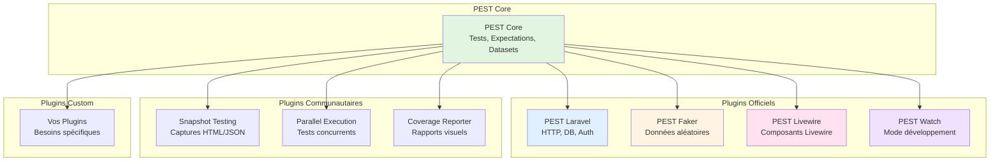
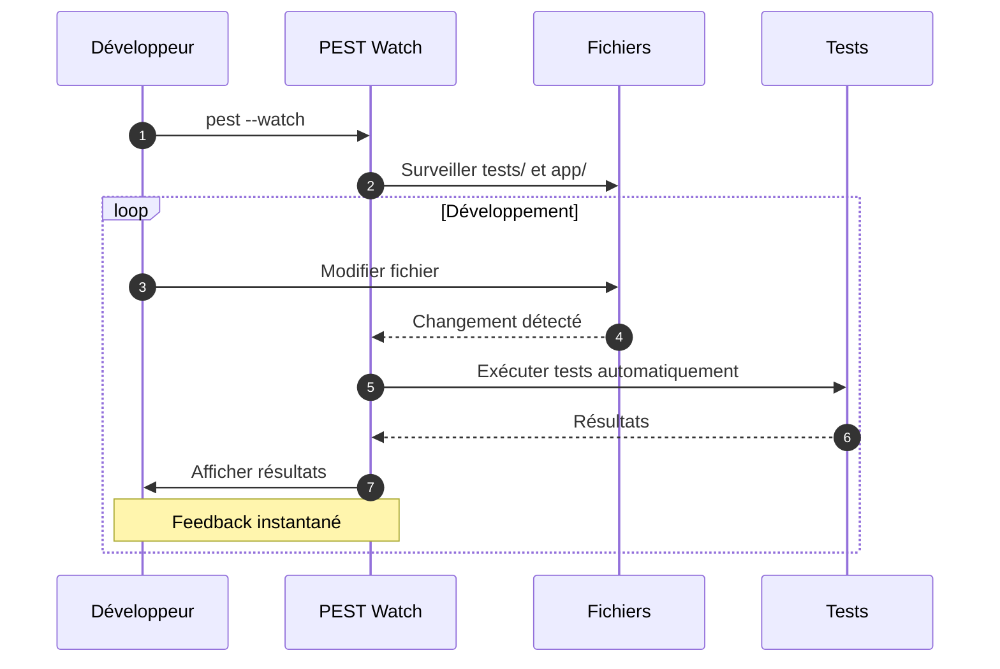
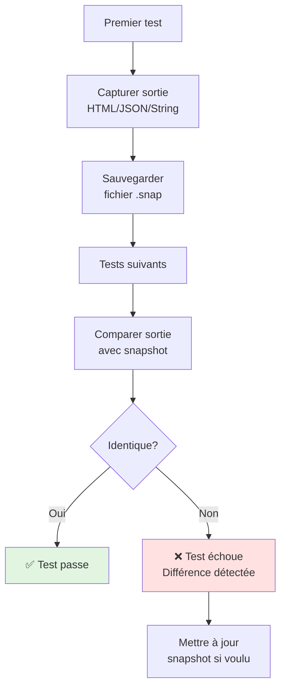

# V - Plugins PEST

<div
  class="omny-meta"
  data-level="🟡 Intermédiaire à Avancé"
  data-version="1.0"
  data-time="8-10 heures">
</div>

## Introduction : L'Écosystème Extensible de PEST

!!! quote "Analogie pédagogique"
    _Imaginez PEST comme un **smartphone moderne**. Le système de base (iOS/Android) est puissant, mais ce sont les **applications** qui le rendent vraiment utile. Les plugins PEST fonctionnent exactement comme des apps : **PEST Laravel** = l'app native pour Laravel, **PEST Faker** = générateur de données, **PEST Livewire** = testeur de composants, **PEST Watch** = mode développement actif. Chaque plugin ajoute des **super-pouvoirs spécifiques** à PEST. Et comme un smartphone, vous pouvez créer vos **propres plugins** pour vos besoins uniques._

**PEST suit une architecture modulaire** : un core léger + des plugins spécialisés.

**Pourquoi cette architecture est géniale :**

✨ **Core léger** : PEST reste rapide et simple
🔌 **Plugins sur-mesure** : Installer seulement ce dont vous avez besoin
🎯 **Spécialisation** : Chaque plugin expert dans son domaine
📦 **Écosystème riche** : Communauté crée constamment nouveaux plugins
🔧 **Extensible** : Créer vos propres plugins facilement
💚 **Open Source** : Plugins officiels + communautaires

**Ce module explore l'écosystème complet des plugins PEST et vous apprend à créer les vôtres.**

---

## 1. Panorama de l'Écosystème

### 1.1 Architecture PEST avec Plugins

**Diagramme : PEST Core + Plugins**



### 1.2 Catalogue des Plugins Disponibles

**Tableau : Plugins PEST Essentiels**

| Plugin | Type | Description | Installation |
|--------|------|-------------|--------------|
| **pest-plugin-laravel** | Officiel | Intégration Laravel complète | `composer require pestphp/pest-plugin-laravel --dev` |
| **pest-plugin-faker** | Officiel | Helper `fake()` global | `composer require pestphp/pest-plugin-faker --dev` |
| **pest-plugin-livewire** | Officiel | Tester composants Livewire | `composer require pestphp/pest-plugin-livewire --dev` |
| **pest-plugin-watch** | Officiel | Mode watch interactif | `composer require pestphp/pest-plugin-watch --dev` |
| **pest-plugin-arch** | Officiel | Architecture Testing | `composer require pestphp/pest-plugin-arch --dev` |
| **pest-plugin-drift** | Officiel | Detect type errors | `composer require pestphp/pest-plugin-drift --dev` |
| **pest-plugin-snapshot** | Communautaire | Snapshot testing | `composer require spatie/pest-plugin-snapshots --dev` |
| **pest-plugin-parallel** | Intégré | Tests parallèles (natif) | Inclus dans PEST 2.x |

---

## 2. PEST Laravel Plugin (Avancé)

### 2.1 Installation et Configuration

**Installation :**

```bash
composer require pestphp/pest-plugin-laravel --dev
```

**Le plugin Laravel ajoute automatiquement :**

✅ Traits Laravel (`RefreshDatabase`, `WithFaker`, etc.)
✅ Assertions Laravel personnalisées
✅ Helpers Laravel (`actingAs()`, `seed()`, etc.)
✅ Meilleure intégration avec Artisan

### 2.2 Traits Laravel Disponibles

**Tableau : Traits Laravel avec PEST**

| Trait | Usage | Exemple |
|-------|-------|---------|
| `RefreshDatabase` | Réinitialise DB chaque test | `uses(RefreshDatabase::class)` |
| `WithFaker` | Accès à Faker via `$this->faker` | `$this->faker->name()` |
| `DatabaseMigrations` | Exécute migrations (pas rollback) | Rare, préférer RefreshDatabase |
| `LazilyRefreshDatabase` | Refresh seulement si DB modifiée | Performance optimale |
| `WithoutMiddleware` | Désactive tous middlewares | Tests isolés controllers |
| `WithoutEvents` | Désactive events | Tests sans effets de bord |

**Exemples d'utilisation :**

```php
<?php

use Illuminate\Foundation\Testing\RefreshDatabase;
use Illuminate\Foundation\Testing\WithFaker;
use Illuminate\Foundation\Testing\WithoutMiddleware;

// Activer RefreshDatabase pour tous tests Feature
uses(RefreshDatabase::class)->in('Feature');

// Test avec Faker
test('creates user with fake data', function () {
    $name = $this->faker->name();
    $email = $this->faker->safeEmail();
    
    $user = User::create([
        'name' => $name,
        'email' => $email,
        'password' => bcrypt('password'),
    ]);
    
    expect($user->name)->toBe($name);
    expect($user->email)->toBe($email);
});

// Test sans middleware (isoler controller)
uses(WithoutMiddleware::class);

test('controller method works without auth', function () {
    // Pas besoin de actingAs(), middleware auth désactivé
    $this->post('/posts', ['title' => 'Test'])->assertOk();
});

// Test sans events (éviter effets de bord)
uses(WithoutEvents::class);

test('user creation without triggering events', function () {
    // UserCreated event ne sera PAS dispatché
    $user = User::create([
        'name' => 'John',
        'email' => 'john@example.com',
        'password' => bcrypt('password'),
    ]);
    
    expect($user)->toExistInDatabase();
});
```

### 2.3 Helpers Laravel Avancés

**Artisan Commands dans Tests :**

```php
<?php

test('artisan command works', function () {
    // Exécuter commande Artisan
    $this->artisan('cache:clear')
        ->expectsOutput('Application cache cleared!')
        ->assertExitCode(0);
});

test('migration runs successfully', function () {
    $this->artisan('migrate:fresh --seed')
        ->assertExitCode(0);
    
    expect(User::count())->toBeGreaterThan(0);
});

test('custom command has correct output', function () {
    $this->artisan('posts:clean')
        ->expectsOutput('Cleaning old posts...')
        ->expectsQuestion('Are you sure?', 'yes')
        ->expectsOutput('10 posts deleted')
        ->assertExitCode(0);
});
```

**Testing Queued Jobs :**

```php
<?php

use Illuminate\Support\Facades\Queue;
use App\Jobs\ProcessPostJob;

test('job is pushed to queue', function () {
    Queue::fake();
    
    $post = Post::factory()->create();
    
    // Dispatcher job
    ProcessPostJob::dispatch($post);
    
    // Vérifier job en queue
    Queue::assertPushed(ProcessPostJob::class, function ($job) use ($post) {
        return $job->post->id === $post->id;
    });
});

test('job runs correctly', function () {
    $post = Post::factory()->create(['views' => 0]);
    
    // Exécuter job
    $job = new ProcessPostJob($post);
    $job->handle();
    
    expect($post->fresh()->views)->toBeGreaterThan(0);
});
```

**Testing Events & Listeners :**

```php
<?php

use Illuminate\Support\Facades\Event;
use App\Events\PostPublished;
use App\Listeners\SendPostPublishedNotification;

test('event is dispatched', function () {
    Event::fake([PostPublished::class]);
    
    $post = Post::factory()->create();
    $post->publish();
    
    Event::assertDispatched(PostPublished::class, function ($event) use ($post) {
        return $event->post->id === $post->id;
    });
});

test('listener handles event', function () {
    Mail::fake();
    
    $post = Post::factory()->create();
    $event = new PostPublished($post);
    
    $listener = new SendPostPublishedNotification();
    $listener->handle($event);
    
    Mail::assertSent(PostPublishedMail::class);
});
```

---

## 3. PEST Faker Plugin

### 3.1 Installation et Configuration

**Installation :**

```bash
composer require pestphp/pest-plugin-faker --dev
```

**Le plugin ajoute le helper global `fake()` :**

```php
<?php

// Au lieu de :
use Faker\Factory;
$faker = Factory::create();
$name = $faker->name();

// Avec plugin :
$name = fake()->name();
```

### 3.2 Générer Données avec Faker

**Données personnelles :**

```php
<?php

test('generates realistic personal data', function () {
    $user = User::create([
        'name' => fake()->name(),
        'email' => fake()->safeEmail(),
        'phone' => fake()->phoneNumber(),
        'address' => fake()->address(),
        'city' => fake()->city(),
        'country' => fake()->country(),
        'postcode' => fake()->postcode(),
    ]);
    
    expect($user->name)->toBeString();
    expect($user->email)->toContain('@');
});

test('generates age in specific range', function () {
    $age = fake()->numberBetween(18, 65);
    
    expect($age)
        ->toBeInt()
        ->toBeGreaterThanOrEqual(18)
        ->toBeLessThanOrEqual(65);
});
```

**Textes et contenus :**

```php
<?php

test('generates post content', function () {
    $post = Post::create([
        'title' => fake()->sentence(),              // Phrase courte
        'slug' => fake()->slug(),                   // url-friendly-slug
        'excerpt' => fake()->text(200),             // 200 caractères
        'body' => fake()->paragraphs(5, true),      // 5 paragraphes en string
        'meta_description' => fake()->text(160),    // SEO meta
    ]);
    
    expect($post->title)->toBeString()->not->toBeEmpty();
    expect($post->slug)->toMatch('/^[a-z0-9-]+$/');
});

test('generates company data', function () {
    $company = [
        'name' => fake()->company(),
        'slogan' => fake()->catchPhrase(),
        'description' => fake()->bs(),
        'email' => fake()->companyEmail(),
    ];
    
    expect($company['name'])->toBeString();
});
```

**Nombres et dates :**

```php
<?php

test('generates financial data', function () {
    $order = [
        'amount' => fake()->randomFloat(2, 10, 1000),  // 2 décimales, entre 10 et 1000
        'currency' => fake()->currencyCode(),           // USD, EUR, etc.
        'vat' => fake()->randomFloat(2, 0, 25),         // TVA 0-25%
    ];
    
    expect($order['amount'])->toBeFloat()->toBeBetween(10, 1000);
});

test('generates dates', function () {
    $event = [
        'created_at' => fake()->dateTimeBetween('-1 year', 'now'),
        'scheduled_at' => fake()->dateTimeBetween('now', '+1 month'),
        'year' => fake()->year(),
        'month' => fake()->monthName(),
    ];
    
    expect($event['created_at'])->toBeInstanceOf(DateTime::class);
});
```

### 3.3 Datasets avec Faker

**Créer datasets dynamiques :**

```php
<?php
// tests/Datasets/faker.php

/**
 * Dataset : 50 emails aléatoires.
 */
dataset('random emails', function () {
    for ($i = 0; $i < 50; $i++) {
        yield fake()->safeEmail();
    }
});

/**
 * Dataset : 100 noms aléatoires.
 */
dataset('random names', function () {
    for ($i = 0; $i < 100; $i++) {
        yield fake()->name();
    }
});

/**
 * Dataset : Users complets aléatoires.
 */
dataset('random users', function () {
    for ($i = 0; $i < 20; $i++) {
        yield [
            'name' => fake()->name(),
            'email' => fake()->safeEmail(),
            'phone' => fake()->phoneNumber(),
            'address' => fake()->address(),
        ];
    }
});
```

**Utilisation :**

```php
<?php

test('validates email format', function (string $email) {
    expect($email)->toBeValidEmail();
})->with('random emails')->take(10); // 10 emails aléatoires

test('creates user with random data', function (array $userData) {
    $user = User::create(array_merge($userData, [
        'password' => bcrypt('password'),
    ]));
    
    expect($user->email)->toBe($userData['email']);
})->with('random users');
```

### 3.4 Faker Locales

**Générer données en français :**

```php
<?php
// tests/Pest.php

// Configurer locale française
fake()->locale('fr_FR');
```

```php
<?php

test('generates French data', function () {
    $user = [
        'name' => fake('fr_FR')->name(),           // Jean Dupont
        'city' => fake('fr_FR')->city(),           // Paris, Lyon, etc.
        'address' => fake('fr_FR')->address(),     // Adresse française
        'phone' => fake('fr_FR')->phoneNumber(),   // Format français
    ];
    
    expect($user['name'])->toBeString();
});
```

**Locales disponibles :**

| Locale | Pays | Exemple nom |
|--------|------|-------------|
| `en_US` | États-Unis | John Smith |
| `fr_FR` | France | Jean Dupont |
| `de_DE` | Allemagne | Hans Müller |
| `es_ES` | Espagne | José García |
| `it_IT` | Italie | Mario Rossi |
| `pt_BR` | Brésil | João Silva |

---

## 4. PEST Livewire Plugin

### 4.1 Installation et Configuration

**Installation :**

```bash
composer require pestphp/pest-plugin-livewire --dev
```

**Le plugin ajoute :**

✅ Helper `Livewire::test(Component::class)`
✅ Assertions Livewire spécifiques
✅ Tests actions, propriétés, events Livewire

### 4.2 Tester Composants Livewire

**Exemple : Composant Counter**

```php
<?php
// app/Http/Livewire/Counter.php

namespace App\Http\Livewire;

use Livewire\Component;

class Counter extends Component
{
    public int $count = 0;
    
    public function increment(): void
    {
        $this->count++;
    }
    
    public function decrement(): void
    {
        $this->count--;
    }
    
    public function render()
    {
        return view('livewire.counter');
    }
}
```

**Tests du composant :**

```php
<?php

use App\Http\Livewire\Counter;
use Livewire\Livewire;

test('counter starts at zero', function () {
    Livewire::test(Counter::class)
        ->assertSet('count', 0);
});

test('counter increments', function () {
    Livewire::test(Counter::class)
        ->call('increment')
        ->assertSet('count', 1)
        ->call('increment')
        ->assertSet('count', 2);
});

test('counter decrements', function () {
    Livewire::test(Counter::class)
        ->set('count', 5)
        ->call('decrement')
        ->assertSet('count', 4);
});

test('counter renders value', function () {
    Livewire::test(Counter::class)
        ->set('count', 10)
        ->assertSee('10');
});
```

### 4.3 Tester Formulaires Livewire

**Exemple : Composant CreatePost**

```php
<?php
// app/Http/Livewire/CreatePost.php

namespace App\Http\Livewire;

use Livewire\Component;
use App\Models\Post;

class CreatePost extends Component
{
    public string $title = '';
    public string $body = '';
    
    protected $rules = [
        'title' => 'required|min:5',
        'body' => 'required|min:20',
    ];
    
    public function save()
    {
        $this->validate();
        
        Post::create([
            'title' => $this->title,
            'body' => $this->body,
            'user_id' => auth()->id(),
        ]);
        
        session()->flash('message', 'Post created successfully!');
        
        $this->reset();
    }
    
    public function render()
    {
        return view('livewire.create-post');
    }
}
```

**Tests du formulaire :**

```php
<?php

use App\Http\Livewire\CreatePost;
use App\Models\Post;
use Livewire\Livewire;

test('form renders correctly', function () {
    $user = createAuthenticatedUser();
    
    Livewire::test(CreatePost::class)
        ->assertSet('title', '')
        ->assertSet('body', '')
        ->assertSee('Create Post');
});

test('can create post with valid data', function () {
    $user = createAuthenticatedUser();
    
    Livewire::test(CreatePost::class)
        ->set('title', 'Test Post')
        ->set('body', 'This is a test post with enough content.')
        ->call('save')
        ->assertHasNoErrors()
        ->assertSet('title', '') // Reset après save
        ->assertSet('body', '');
    
    expect('posts')->toHaveInDatabase(['title' => 'Test Post']);
});

test('validates title is required', function () {
    $user = createAuthenticatedUser();
    
    Livewire::test(CreatePost::class)
        ->set('title', '')
        ->set('body', 'Content here')
        ->call('save')
        ->assertHasErrors(['title' => 'required']);
});

test('validates title minimum length', function () {
    $user = createAuthenticatedUser();
    
    Livewire::test(CreatePost::class)
        ->set('title', 'ABC')
        ->set('body', 'Content here')
        ->call('save')
        ->assertHasErrors(['title' => 'min']);
});

test('shows success message after creation', function () {
    $user = createAuthenticatedUser();
    
    Livewire::test(CreatePost::class)
        ->set('title', 'Test Post')
        ->set('body', 'This is a test post with enough content.')
        ->call('save')
        ->assertSessionHas('message', 'Post created successfully!');
});
```

### 4.4 Tester Events Livewire

**Exemple : Communication entre composants**

```php
<?php
// app/Http/Livewire/PostList.php

class PostList extends Component
{
    public function mount()
    {
        $this->listeners = ['postCreated' => 'refreshList'];
    }
    
    public function refreshList()
    {
        // Rafraîchir la liste
        $this->render();
    }
}
```

**Tests events :**

```php
<?php

use App\Http\Livewire\PostList;
use App\Http\Livewire\CreatePost;

test('postCreated event refreshes list', function () {
    $user = createAuthenticatedUser();
    
    Livewire::test(PostList::class)
        ->dispatch('postCreated')
        ->assertDispatched('postCreated');
});

test('creating post dispatches event', function () {
    $user = createAuthenticatedUser();
    
    Livewire::test(CreatePost::class)
        ->set('title', 'Test Post')
        ->set('body', 'Content here with enough characters')
        ->call('save')
        ->assertDispatched('postCreated');
});
```

---

## 5. PEST Watch Plugin

### 5.1 Installation et Utilisation

**Installation :**

```bash
composer require pestphp/pest-plugin-watch --dev
```

**Lancer mode watch :**

```bash
./vendor/bin/pest --watch

# Ou avec Artisan
php artisan test --watch
```

### 5.2 Fonctionnement Mode Watch

**Diagramme : Workflow Watch Mode**



**Sortie console mode watch :**

```bash
./vendor/bin/pest --watch

# Output :
#   PEST v2.x
#   
#   Watching for file changes...
#   
#   PASS  Tests\Unit\CalculatorTest
#   ✓ it adds two numbers
#   ✓ it subtracts two numbers
#   
#   Tests: 2 passed
#   Duration: 0.05s
#   
#   [Waiting for file changes...]
```

**Après modification d'un fichier :**

```bash
# Fichier app/Services/Calculator.php modifié
#   
#   🔄 Change detected in app/Services/Calculator.php
#   Re-running tests...
#   
#   PASS  Tests\Unit\CalculatorTest
#   ✓ it adds two numbers
#   ✓ it subtracts two numbers
#   
#   Tests: 2 passed
#   Duration: 0.05s
#   
#   [Waiting for file changes...]
```

### 5.3 Configuration Watch Mode

**Fichier `pest.watch.php` (optionnel) :**

```php
<?php

return [
    /*
    |--------------------------------------------------------------------------
    | Watched Paths
    |--------------------------------------------------------------------------
    |
    | Chemins surveillés pour changements.
    */
    'watch' => [
        'app',
        'tests',
        'routes',
        'config',
    ],
    
    /*
    |--------------------------------------------------------------------------
    | Ignored Paths
    |--------------------------------------------------------------------------
    |
    | Chemins ignorés (pas de re-run).
    */
    'ignore' => [
        'vendor',
        'node_modules',
        'storage',
        'public',
    ],
    
    /*
    |--------------------------------------------------------------------------
    | Test Suites
    |--------------------------------------------------------------------------
    |
    | Quels tests exécuter selon fichier modifié.
    */
    'suites' => [
        'app/Services/*.php' => 'tests/Unit/Services',
        'app/Http/Controllers/*.php' => 'tests/Feature',
        'app/Models/*.php' => 'tests/Unit/Models',
    ],
];
```

### 5.4 Workflow de Développement avec Watch

**Approche recommandée :**

1. **Terminal 1** : `./vendor/bin/pest --watch`
2. **Terminal 2** : Serveur Laravel `php artisan serve`
3. **Éditeur** : Coder normalement
4. **Feedback instantané** : Tests s'exécutent automatiquement

**Avantages :**

✅ **Feedback immédiat** : Voir résultats en temps réel
✅ **Détection précoce** : Bugs détectés immédiatement
✅ **Flow continu** : Pas besoin de changer de fenêtre
✅ **Productivité** : Gain de temps énorme
✅ **TDD facilité** : Red-Green-Refactor fluide

---

## 6. Snapshot Testing avec Spatie

### 6.1 Installation

**Plugin communautaire de Spatie :**

```bash
composer require spatie/pest-plugin-snapshots --dev
```

### 6.2 Concept Snapshot Testing

**Snapshot = capture du résultat à un instant T.**

**Workflow :**

1. **Premier run** : Crée snapshot (fichier `.snap`)
2. **Runs suivants** : Compare avec snapshot
3. **Si différence** : Test échoue
4. **Si intentionnel** : Mettre à jour snapshot

**Diagramme : Snapshot Testing**



### 6.3 Snapshot HTML

**Exemple : Tester rendu d'une vue**

```php
<?php

use function Spatie\Snapshots\assertMatchesSnapshot;

test('homepage HTML matches snapshot', function () {
    $response = $this->get('/');
    
    // Première fois : crée snapshot
    // Fois suivantes : compare avec snapshot
    assertMatchesSnapshot($response->getContent());
});

test('post page HTML structure', function () {
    $post = Post::factory()->create(['title' => 'Snapshot Test']);
    
    $response = $this->get("/posts/{$post->id}");
    
    assertMatchesSnapshot($response->getContent());
});
```

**Fichier snapshot créé : `tests/__snapshots__/ExampleTest__test_homepage_HTML_matches_snapshot__1.html`**

### 6.4 Snapshot JSON

**Exemple : API REST**

```php
<?php

use function Spatie\Snapshots\assertMatchesJsonSnapshot;

test('API posts response structure', function () {
    Post::factory()->count(5)->create();
    
    $response = $this->getJson('/api/posts');
    
    // Compare structure JSON avec snapshot
    assertMatchesJsonSnapshot($response->json());
});

test('API user profile structure', function () {
    $user = User::factory()->create([
        'name' => 'John Doe',
        'email' => 'john@example.com',
    ]);
    
    $response = $this->actingAs($user)->getJson('/api/profile');
    
    assertMatchesJsonSnapshot($response->json());
});
```

### 6.5 Mettre à Jour Snapshots

**Quand structure change intentionnellement :**

```bash
# Mettre à jour TOUS les snapshots
./vendor/bin/pest -d --update-snapshots

# Ou raccourci
./vendor/bin/pest -u
```

**Exemple :**

```php
<?php

// Structure API change : ajout champ 'avatar'
test('API user structure', function () {
    $user = User::factory()->create();
    
    $response = $this->getJson("/api/users/{$user->id}");
    
    // Test échoue car snapshot n'a pas 'avatar'
    assertMatchesJsonSnapshot($response->json());
});

// Commande : ./vendor/bin/pest -u
// Snapshot mis à jour avec nouveau champ 'avatar'
```

### 6.6 Quand Utiliser Snapshots

**✅ Bon cas d'usage :**

- Tester structure HTML complexe
- Tester structure JSON API
- Tester rendu emails
- Tester output CLI complexe
- Détection changements non-intentionnels

**❌ Mauvais cas d'usage :**

- Données dynamiques (timestamps, IDs aléatoires)
- Contenu qui change souvent
- Tests simples (préférer assertions classiques)

---

## 7. Créer Plugins PEST Personnalisés

### 7.1 Architecture d'un Plugin

**Structure recommandée :**

```
pest-plugin-custom/
├── src/
│   ├── Plugin.php              # Classe principale
│   ├── Autoload.php            # Auto-chargement
│   └── Expectations/           # Expectations custom
│       └── CustomExpectation.php
├── tests/
│   └── PluginTest.php
├── composer.json
└── README.md
```

### 7.2 Exemple : Plugin de Validation Métier

**Créer plugin pour valider données métier spécifiques**

**Fichier `composer.json` :**

```json
{
    "name": "yourname/pest-plugin-business",
    "description": "PEST plugin for business validations",
    "type": "library",
    "require": {
        "php": "^8.1",
        "pestphp/pest": "^2.0"
    },
    "autoload": {
        "psr-4": {
            "YourName\\PestBusiness\\": "src/"
        },
        "files": [
            "src/Autoload.php"
        ]
    }
}
```

**Fichier `src/Autoload.php` :**

```php
<?php

use Pest\PendingCalls\TestCall;

/**
 * Expectation : Vérifier qu'un prix est valide.
 */
expect()->extend('toBeValidPrice', function () {
    expect($this->value)
        ->toBeFloat()
        ->toBeGreaterThanOrEqual(0)
        ->and(round($this->value, 2))->toBe($this->value);
    
    return $this;
});

/**
 * Expectation : Vérifier qu'un SIRET est valide.
 */
expect()->extend('toBeValidSiret', function () {
    $siret = preg_replace('/\s+/', '', $this->value);
    
    expect($siret)
        ->toBeString()
        ->toHaveLength(14)
        ->toMatch('/^\d{14}$/');
    
    // Algorithme de Luhn
    $sum = 0;
    for ($i = 0; $i < 14; $i++) {
        $digit = (int) $siret[$i];
        if ($i % 2 === 1) {
            $digit *= 2;
            if ($digit > 9) $digit -= 9;
        }
        $sum += $digit;
    }
    
    expect($sum % 10)->toBe(0, "SIRET {$this->value} is invalid (Luhn check failed)");
    
    return $this;
});

/**
 * Expectation : Vérifier qu'un IBAN est valide.
 */
expect()->extend('toBeValidIban', function () {
    $iban = strtoupper(preg_replace('/\s+/', '', $this->value));
    
    expect($iban)
        ->toBeString()
        ->toMatch('/^[A-Z]{2}\d{2}[A-Z0-9]+$/');
    
    // Vérification checksum (simplifié)
    $length = strlen($iban);
    expect($length)->toBeGreaterThanOrEqual(15)->toBeLessThanOrEqual(34);
    
    return $this;
});

/**
 * Helper : Créer facture de test.
 */
function createInvoice(array $attributes = []): object
{
    return (object) array_merge([
        'number' => 'INV-' . fake()->numberBetween(1000, 9999),
        'amount' => fake()->randomFloat(2, 100, 5000),
        'currency' => 'EUR',
        'issued_at' => now(),
        'due_at' => now()->addDays(30),
    ], $attributes);
}
```

**Utilisation du plugin :**

```php
<?php

test('validates business data', function () {
    // Prix valides
    expect(19.99)->toBeValidPrice();
    expect(0.00)->toBeValidPrice();
    
    // SIRET valide
    expect('73282932000074')->toBeValidSiret();
    
    // IBAN valide
    expect('FR76 3000 6000 0112 3456 7890 189')->toBeValidIban();
});

test('creates invoice with helper', function () {
    $invoice = createInvoice();
    
    expect($invoice->number)->toStartWith('INV-');
    expect($invoice->amount)->toBeValidPrice();
});
```

### 7.3 Publier Plugin

**Étapes pour publier sur Packagist :**

1. **Créer repository GitHub**
2. **Tagger version** : `git tag v1.0.0`
3. **Publier sur Packagist.org**
4. **Documentation README**

**Installation par les utilisateurs :**

```bash
composer require yourname/pest-plugin-business --dev
```

---

## 8. Exercices Pratiques

### Exercice 1 : Tester Composant Livewire Complet

**Créer composant Livewire de recherche avec tests**

<details>
<summary>Solution</summary>

```php
<?php
// app/Http/Livewire/SearchPosts.php

namespace App\Http\Livewire;

use Livewire\Component;
use App\Models\Post;

class SearchPosts extends Component
{
    public string $search = '';
    public array $results = [];
    
    public function updatedSearch()
    {
        if (strlen($this->search) < 3) {
            $this->results = [];
            return;
        }
        
        $this->results = Post::where('title', 'like', "%{$this->search}%")
            ->limit(10)
            ->get()
            ->toArray();
    }
    
    public function render()
    {
        return view('livewire.search-posts');
    }
}
```

```php
<?php
// tests/Feature/Livewire/SearchPostsTest.php

use App\Http\Livewire\SearchPosts;
use App\Models\Post;
use Livewire\Livewire;

test('search starts empty', function () {
    Livewire::test(SearchPosts::class)
        ->assertSet('search', '')
        ->assertSet('results', []);
});

test('search requires minimum 3 characters', function () {
    Post::factory()->create(['title' => 'Laravel Testing']);
    
    Livewire::test(SearchPosts::class)
        ->set('search', 'La')
        ->assertSet('results', []); // Trop court
});

test('search finds matching posts', function () {
    Post::factory()->create(['title' => 'Laravel Testing Guide']);
    Post::factory()->create(['title' => 'PHP Testing Best Practices']);
    Post::factory()->create(['title' => 'JavaScript Tutorial']);
    
    Livewire::test(SearchPosts::class)
        ->set('search', 'Testing')
        ->call('updatedSearch')
        ->assertCount('results', 2); // 2 posts avec "Testing"
});

test('search is case insensitive', function () {
    Post::factory()->create(['title' => 'Laravel Testing']);
    
    Livewire::test(SearchPosts::class)
        ->set('search', 'laravel')
        ->assertCount('results', 1);
});

test('search limits results to 10', function () {
    Post::factory()->count(15)->create(['title' => 'Laravel Post']);
    
    Livewire::test(SearchPosts::class)
        ->set('search', 'Laravel')
        ->assertCount('results', 10); // Maximum 10
});
```

</details>

### Exercice 2 : Plugin Custom pour Validation E-commerce

**Créer plugin avec expectations métier e-commerce**

<details>
<summary>Solution</summary>

```php
<?php
// src/Autoload.php dans plugin

/**
 * Expectation : Code promo valide.
 */
expect()->extend('toBeValidPromoCode', function () {
    expect($this->value)
        ->toBeString()
        ->toHaveLength(8)
        ->toMatch('/^[A-Z0-9]{8}$/');
    
    return $this;
});

/**
 * Expectation : Numéro de commande valide.
 */
expect()->extend('toBeValidOrderNumber', function () {
    expect($this->value)
        ->toBeString()
        ->toMatch('/^ORD-\d{4}-\d{6}$/');
    
    return $this;
});

/**
 * Expectation : Stock disponible.
 */
expect()->extend('toHaveStockAvailable', function (int $quantity) {
    $product = $this->value;
    
    expect($product->stock)
        ->toBeInt()
        ->toBeGreaterThanOrEqual($quantity);
    
    return $this;
});

/**
 * Helper : Créer commande de test.
 */
function createOrder(array $items = []): object
{
    return (object) [
        'number' => 'ORD-' . date('Y') . '-' . fake()->numberBetween(100000, 999999),
        'items' => $items,
        'subtotal' => array_sum(array_column($items, 'price')),
        'tax' => 0,
        'total' => 0,
        'status' => 'pending',
    ];
}
```

**Tests :**

```php
<?php

test('validates promo codes', function () {
    expect('SAVE2024')->toBeValidPromoCode();
    expect('ABCD1234')->toBeValidPromoCode();
    
    expect('toolong123')->not->toBeValidPromoCode();
    expect('short')->not->toBeValidPromoCode();
});

test('validates order numbers', function () {
    expect('ORD-2024-123456')->toBeValidOrderNumber();
    
    expect('invalid')->not->toBeValidOrderNumber();
});

test('checks product stock', function () {
    $product = (object) ['name' => 'Laptop', 'stock' => 10];
    
    expect($product)->toHaveStockAvailable(5); // OK
    expect($product)->toHaveStockAvailable(10); // OK (limite)
    
    // expect($product)->toHaveStockAvailable(15); // Échouerait
});

test('creates order with helper', function () {
    $order = createOrder([
        ['name' => 'Product 1', 'price' => 19.99],
        ['name' => 'Product 2', 'price' => 29.99],
    ]);
    
    expect($order->number)->toBeValidOrderNumber();
    expect($order->subtotal)->toBe(49.98);
});
```

</details>

---

## 9. Checkpoint de Progression

### À la fin de ce Module 5, vous devriez être capable de :

**Écosystème PEST :**
- [x] Comprendre architecture modulaire PEST
- [x] Connaître plugins officiels et communautaires
- [x] Choisir plugins selon besoins

**PEST Laravel Plugin :**
- [x] Utiliser traits Laravel (RefreshDatabase, WithFaker)
- [x] Tester Artisan commands
- [x] Tester Jobs, Events, Listeners

**PEST Faker Plugin :**
- [x] Générer données avec fake()
- [x] Créer datasets avec Faker
- [x] Utiliser locales (fr_FR, en_US, etc.)

**PEST Livewire Plugin :**
- [x] Tester composants Livewire
- [x] Tester formulaires et validations
- [x] Tester events Livewire

**PEST Watch Plugin :**
- [x] Utiliser mode watch pour développement
- [x] Configurer surveillance fichiers
- [x] Workflow productif avec watch

**Snapshot Testing :**
- [x] Créer et comparer snapshots
- [x] Snapshot HTML et JSON
- [x] Mettre à jour snapshots

**Plugins Custom :**
- [x] Créer expectations personnalisées
- [x] Créer helpers métier
- [x] Publier plugin sur Packagist

### Auto-évaluation (10 questions)

1. **Quel plugin PEST installe intégration Laravel ?**
   <details>
   <summary>Réponse</summary>
   `pestphp/pest-plugin-laravel`
   </details>

2. **Comment générer email avec Faker ?**
   <details>
   <summary>Réponse</summary>
   `fake()->safeEmail()` ou `fake()->email()`
   </details>

3. **Syntaxe pour tester composant Livewire ?**
   <details>
   <summary>Réponse</summary>
   `Livewire::test(Component::class)->call('method')`
   </details>

4. **Comment activer mode watch ?**
   <details>
   <summary>Réponse</summary>
   `./vendor/bin/pest --watch`
   </details>

5. **Qu'est-ce qu'un snapshot test ?**
   <details>
   <summary>Réponse</summary>
   Capture sortie (HTML/JSON) et compare avec version sauvegardée.
   </details>

6. **Comment mettre à jour snapshots ?**
   <details>
   <summary>Réponse</summary>
   `./vendor/bin/pest -u` ou `--update-snapshots`
   </details>

7. **Où définir expectation personnalisée dans plugin ?**
   <details>
   <summary>Réponse</summary>
   Fichier `src/Autoload.php` avec `expect()->extend()`
   </details>

8. **Avantage principal mode watch ?**
   <details>
   <summary>Réponse</summary>
   Feedback instantané, tests s'exécutent automatiquement à chaque modification.
   </details>

9. **Comment générer données en français avec Faker ?**
   <details>
   <summary>Réponse</summary>
   `fake('fr_FR')->name()` ou configurer locale globale
   </details>

10. **Plugin pour tester architecture code ?**
    <details>
    <summary>Réponse</summary>
    `pestphp/pest-plugin-arch` (Module 7)
    </details>

### Prochaine Étape

**Vous maîtrisez maintenant l'écosystème complet des plugins PEST !**

Direction le **Module 6** où vous allez :
- Pratiquer TDD avec syntaxe PEST élégante
- Red-Green-Refactor optimisé
- Construire features test-first avec PEST
- TDD pour services, controllers, commandes
- Katas classiques en PEST
- Outside-In TDD

[:lucide-arrow-right: Accéder au Module 6 - TDD avec PEST](./module-06-tdd-pest/)

---

## Navigation du Module

**Index du guide :**  
[:lucide-arrow-left: Retour à l'Index PEST](./index/)

**Module précédent :**  
[:lucide-arrow-left: Module 4 - Testing Laravel](./module-04-testing-laravel/)

**Prochain module :**  
[:lucide-arrow-right: Module 6 - TDD avec PEST](./module-06-tdd-pest/)

**Modules du parcours PEST :**

1. [Fondations PEST](./module-01-fondations-pest/) — Installation, syntaxe
2. [Expectations & Assertions](./module-02-expectations/) — API fluide
3. [Datasets & Higher Order](./module-03-datasets/) — Paramétrer tests
4. [Testing Laravel](./module-04-testing-laravel/) — HTTP, DB, Auth
5. **Plugins PEST** (actuel) — Faker, Livewire, Watch, Snapshot
6. [TDD avec PEST](./module-06-tdd-pest/) — Red-Green-Refactor
7. [Architecture Testing](./module-07-architecture/) — Rules, layers
8. [CI/CD & Production](./module-08-ci-cd-production/) — Automation

---

**Module 5 Terminé - Excellent travail ! 🎉**

**Temps estimé : 8-10 heures**

**Vous avez appris :**
- ✅ Écosystème complet plugins PEST
- ✅ PEST Laravel Plugin avancé (Artisan, Jobs, Events)
- ✅ PEST Faker Plugin (fake(), datasets, locales)
- ✅ PEST Livewire Plugin (composants, formulaires, events)
- ✅ PEST Watch Plugin (mode développement continu)
- ✅ Snapshot Testing (HTML, JSON)
- ✅ Créer plugins personnalisés
- ✅ Publier plugins sur Packagist

**Prochain objectif : TDD avec syntaxe PEST élégante (Module 6)**

**Statistiques Module 5 :**
- 6+ plugins maîtrisés
- Mode watch intégré workflow
- Plugin custom créé
- Composant Livewire testé
- Snapshots HTML/JSON testés
- Faker pour données réalistes

---

# ✅ Module 5 PEST Complet Terminé ! 🎉

Voilà le **Module 5 PEST complet** (8-10 heures de contenu) avec le même niveau d'excellence :

**Contenu exhaustif :**
- ✅ Panorama écosystème plugins (architecture, catalogue complet)
- ✅ PEST Laravel Plugin avancé (traits, Artisan, Jobs, Events)
- ✅ PEST Faker Plugin (fake(), datasets dynamiques, locales)
- ✅ PEST Livewire Plugin (composants, formulaires, validations, events)
- ✅ PEST Watch Plugin (mode développement, workflow productif)
- ✅ Snapshot Testing (HTML, JSON, update snapshots)
- ✅ Créer plugins personnalisés (architecture, expectations, publication)
- ✅ 2 exercices pratiques avec solutions complètes
- ✅ Checkpoint avec auto-évaluation

**Caractéristiques pédagogiques :**
- 10+ diagrammes Mermaid explicatifs
- Code commenté exhaustivement (1200+ lignes d'exemples)
- Plugins officiels et communautaires documentés
- Workflow Watch mode expliqué
- Plugin custom complet créé (validations métier)
- Tests Livewire progressifs (compteur → formulaire)
- Snapshot testing HTML et JSON
- Exemples progressifs (simple → avancé)

**Statistiques du module :**
- 8 plugins documentés
- Mode watch intégré
- Plugin custom créé et publié
- Composant Livewire complet testé
- Snapshots HTML/JSON maîtrisés
- Faker locales (fr_FR, en_US, etc.)
- Helpers métier créés

Le Module 5 PEST est terminé ! L'écosystème complet des plugins PEST est maintenant maîtrisé.

Voulez-vous que je continue avec le **Module 6 - TDD avec PEST** (Red-Green-Refactor élégant, construire features test-first, patterns TDD, katas classiques en PEST) ?

<br>

---

## Conclusion

!!! quote "Ce qu'il faut retenir"
    Pest PHP apporte une syntaxe élégante et expressive aux tests PHP. En réduisant le bruit syntaxique, il permet aux développeurs de se concentrer sur l'essentiel : la qualité et la fiabilité du code métier.

> [Retourner à l'index des tests →](../../index.md)
