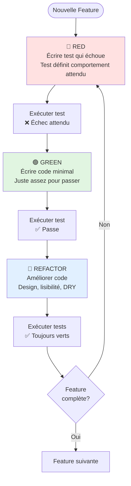
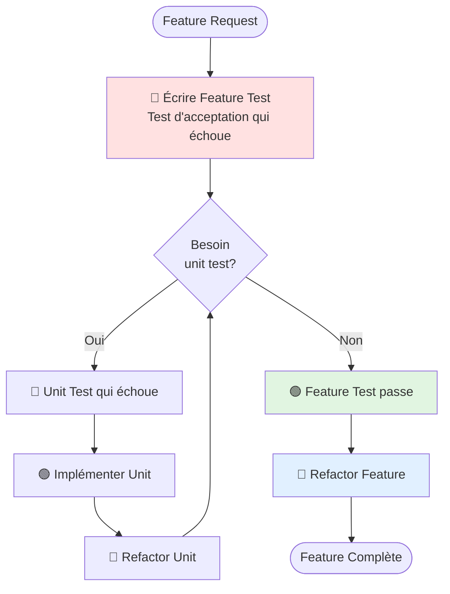

# VI - TDD

<div
  class="omny-meta"
  data-level="🟡 Intermédiaire à Avancé"
  data-version="1.0"
  data-time="10-12 heures">
</div>

## Introduction : TDD Rendu Agréable avec PEST

!!! quote "Analogie pédagogique"
    _Imaginez construire une maison. **Approche classique** : construire d'abord, tester la solidité après. Résultat : refaire des murs porteurs si instables. **Approche TDD** : définir d'abord les tests de solidité (résister à 8 sur Richter), puis construire pour passer ces tests. Résultat : maison solide dès le départ. Avec **PHPUnit**, c'est comme rédiger ces tests en jargon d'ingénieur (verbeux, technique). Avec **PEST**, c'est comme les écrire en français : "la maison doit résister au vent à 150 km/h" → `test('house withstands 150kmh wind')`. TDD avec PEST transforme les spécifications techniques en **langage naturel lisible** tout en garantissant la **qualité dès la conception**._

**TDD (Test-Driven Development)** = Écrire les tests **AVANT** le code de production.

**Le cycle TDD classique :**

1. 🔴 **RED** : Écrire un test qui échoue
2. 🟢 **GREEN** : Écrire le code minimal pour le faire passer
3. 🔵 **REFACTOR** : Améliorer le code sans changer le comportement

**Pourquoi TDD avec PEST est magique :**

✨ **Syntaxe élégante** : Tests lisibles = spécifications claires
🎯 **Feedback rapide** : Cycle court avec mode watch
🔧 **Design émergent** : Architecture propre naturellement
📝 **Documentation vivante** : Tests = specs toujours à jour
💚 **Confiance** : Refactoring sans peur
⚡ **Productivité** : Moins de bugs, plus de features

**Ce module approfondit TDD avec la syntaxe PEST pour construire du code solide test-first.**

---

## 1. Philosophie TDD avec PEST

### 1.1 Le Cycle Red-Green-Refactor

**Diagramme : Cycle TDD Complet**



### 1.2 Exemple Minimal : Calculatrice

**Cycle complet en 3 itérations**

**🔴 CYCLE 1 - RED : Test addition**

```php
<?php
// tests/Unit/CalculatorTest.php

use App\Services\Calculator;

test('adds two numbers', function () {
    $calculator = new Calculator();
    
    expect($calculator->add(2, 3))->toBe(5);
});

// Exécuter : php artisan test
// ❌ ÉCHEC : Class 'App\Services\Calculator' not found
```

**🟢 CYCLE 1 - GREEN : Code minimal**

```php
<?php
// app/Services/Calculator.php

namespace App\Services;

class Calculator
{
    public function add(int $a, int $b): int
    {
        return 5; // Code MINIMAL juste pour passer
    }
}

// Exécuter : php artisan test
// ✅ PASSE
```

**🔴 CYCLE 2 - RED : Triangulation**

```php
<?php

test('adds two numbers', function () {
    $calculator = new Calculator();
    
    expect($calculator->add(2, 3))->toBe(5);
    expect($calculator->add(5, 7))->toBe(12); // Nouveau cas
});

// ❌ ÉCHEC : Expected 12, got 5
```

**🟢 CYCLE 2 - GREEN : Implémentation réelle**

```php
<?php

class Calculator
{
    public function add(int $a, int $b): int
    {
        return $a + $b; // Implémentation correcte
    }
}

// ✅ PASSE
```

**🔵 REFACTOR : Améliorer (si nécessaire)**

```php
<?php

// Code déjà propre, pas de refactoring nécessaire pour cet exemple simple
```

**Observations :**

- ✅ Tests écrits AVANT le code
- ✅ Code minimal à chaque étape
- ✅ Chaque test force amélioration du code
- ✅ Design émerge naturellement

### 1.3 Avantages TDD avec PEST

**Tableau comparatif : TDD PHPUnit vs TDD PEST**

| Aspect | PHPUnit | PEST | Avantage PEST |
|--------|---------|------|---------------|
| **Lisibilité tests** | ⭐⭐⭐ | ⭐⭐⭐⭐⭐ | Tests = specs lisibles |
| **Feedback cycle** | Moyen | Rapide (watch mode) | Productivité +50% |
| **Plaisir d'écrire** | ⭐⭐ | ⭐⭐⭐⭐⭐ | TDD devient agréable |
| **Duplication** | Élevée | Faible (datasets) | Moins de code |
| **Refactoring tests** | Difficile | Facile | Maintenance aisée |

---

## 2. TDD Exemple Complet : DiscountCalculator

### 2.1 Spécifications Métier

**Cahier des charges :**

Un système de calcul de remises basé sur le montant d'achat :

- **< 100€** : 0% de remise
- **100-500€** : 5% de remise
- **500-1000€** : 10% de remise
- **> 1000€** : 15% de remise

### 2.2 Cycle TDD Complet

**🔴 RED - Test 1 : Pas de remise sous 100€**

```php
<?php
// tests/Unit/Services/DiscountCalculatorTest.php

use App\Services\DiscountCalculator;

test('no discount for amounts below 100', function () {
    $calculator = new DiscountCalculator();
    
    expect($calculator->calculate(50))->toBe(0.0);
});

// ❌ ÉCHEC : Class not found
```

**🟢 GREEN - Test 1 : Code minimal**

```php
<?php
// app/Services/DiscountCalculator.php

namespace App\Services;

class DiscountCalculator
{
    public function calculate(float $amount): float
    {
        return 0.0; // Minimal pour passer
    }
}

// ✅ PASSE
```

**🔴 RED - Test 2 : 5% pour 100-500€**

```php
<?php

test('5% discount for amounts between 100 and 500', function () {
    $calculator = new DiscountCalculator();
    
    expect($calculator->calculate(100))->toBe(5.0);
    expect($calculator->calculate(250))->toBe(12.5);
    expect($calculator->calculate(500))->toBe(25.0);
});

// ❌ ÉCHEC : Expected 5.0, got 0.0
```

**🟢 GREEN - Test 2 : Implémenter palier 5%**

```php
<?php

class DiscountCalculator
{
    public function calculate(float $amount): float
    {
        if ($amount >= 100 && $amount <= 500) {
            return $amount * 0.05;
        }
        
        return 0.0;
    }
}

// ✅ PASSE
```

**🔴 RED - Test 3 : 10% pour 500-1000€**

```php
<?php

test('10% discount for amounts between 500 and 1000', function () {
    $calculator = new DiscountCalculator();
    
    expect($calculator->calculate(500))->toBe(50.0); // Maintenant 10%, pas 5%
    expect($calculator->calculate(750))->toBe(75.0);
    expect($calculator->calculate(1000))->toBe(100.0);
});

// ❌ ÉCHEC : Expected 50.0, got 25.0
```

**🟢 GREEN - Test 3 : Implémenter palier 10%**

```php
<?php

class DiscountCalculator
{
    public function calculate(float $amount): float
    {
        if ($amount >= 500 && $amount <= 1000) {
            return $amount * 0.10;
        }
        
        if ($amount >= 100 && $amount < 500) {
            return $amount * 0.05;
        }
        
        return 0.0;
    }
}

// ✅ PASSE (tous les tests)
```

**🔴 RED - Test 4 : 15% au-dessus de 1000€**

```php
<?php

test('15% discount for amounts above 1000', function () {
    $calculator = new DiscountCalculator();
    
    expect($calculator->calculate(1000))->toBe(150.0); // Maintenant 15%
    expect($calculator->calculate(1500))->toBe(225.0);
    expect($calculator->calculate(5000))->toBe(750.0);
});

// ❌ ÉCHEC : Expected 150.0, got 100.0
```

**🟢 GREEN - Test 4 : Implémenter palier 15%**

```php
<?php

class DiscountCalculator
{
    public function calculate(float $amount): float
    {
        if ($amount >= 1000) {
            return $amount * 0.15;
        }
        
        if ($amount >= 500) {
            return $amount * 0.10;
        }
        
        if ($amount >= 100) {
            return $amount * 0.05;
        }
        
        return 0.0;
    }
}

// ✅ PASSE (tous les tests)
```

**🔵 REFACTOR : Améliorer le design**

```php
<?php

class DiscountCalculator
{
    private const TIERS = [
        1000 => 0.15,
        500  => 0.10,
        100  => 0.05,
    ];
    
    public function calculate(float $amount): float
    {
        foreach (self::TIERS as $threshold => $rate) {
            if ($amount >= $threshold) {
                return $amount * $rate;
            }
        }
        
        return 0.0;
    }
}

// ✅ PASSE (tous les tests)
// Code plus propre, extensible, maintenable
```

**🔵 REFACTOR : Tests aussi (avec datasets)**

```php
<?php
// tests/Datasets/discounts.php

dataset('discount tiers', [
    'no discount (50)' => [50, 0.0],
    'no discount (99)' => [99, 0.0],
    '5% tier (100)' => [100, 5.0],
    '5% tier (250)' => [250, 12.5],
    '5% tier (499)' => [499, 24.95],
    '10% tier (500)' => [500, 50.0],
    '10% tier (750)' => [750, 75.0],
    '10% tier (999)' => [999, 99.9],
    '15% tier (1000)' => [1000, 150.0],
    '15% tier (1500)' => [1500, 225.0],
    '15% tier (5000)' => [5000, 750.0],
]);
```

```php
<?php
// tests/Unit/Services/DiscountCalculatorTest.php

use App\Services\DiscountCalculator;

beforeEach(function () {
    $this->calculator = new DiscountCalculator();
});

test('calculates discount correctly', function (float $amount, float $expected) {
    expect($this->calculator->calculate($amount))->toBe($expected);
})->with('discount tiers');

// 1 test élégant qui s'exécute 11 fois au lieu de 11 tests dupliqués
```

**Résultat final :**

✅ Code production propre et extensible
✅ Tests élégants avec datasets
✅ 100% de couverture
✅ Design émergé naturellement
✅ Confiance totale pour refactoring futur

---

## 3. TDD pour Services Métier

### 3.1 Exemple : PaymentProcessor

**Spécifications :**

Service de traitement de paiements :
- Accepte montants > 0
- Rejette montants négatifs ou nuls
- Applique frais de transaction (2.9% + 0.30€)
- Arrondit à 2 décimales
- Gère devises (EUR, USD)

**🔴 RED - Test 1 : Rejette montants invalides**

```php
<?php

use App\Services\PaymentProcessor;

test('rejects negative amounts', function () {
    $processor = new PaymentProcessor();
    
    expect(fn() => $processor->process(-10.00, 'EUR'))
        ->toThrow(\InvalidArgumentException::class);
});

test('rejects zero amount', function () {
    $processor = new PaymentProcessor();
    
    expect(fn() => $processor->process(0, 'EUR'))
        ->toThrow(\InvalidArgumentException::class);
});

// ❌ ÉCHEC : Class not found
```

**🟢 GREEN - Test 1 : Valider montants**

```php
<?php
// app/Services/PaymentProcessor.php

namespace App\Services;

class PaymentProcessor
{
    public function process(float $amount, string $currency): array
    {
        if ($amount <= 0) {
            throw new \InvalidArgumentException('Amount must be greater than zero');
        }
        
        return [];
    }
}

// ✅ PASSE
```

**🔴 RED - Test 2 : Calculer frais**

```php
<?php

test('calculates transaction fees correctly', function () {
    $processor = new PaymentProcessor();
    
    $result = $processor->process(100.00, 'EUR');
    
    // Frais = 100 * 0.029 + 0.30 = 2.90 + 0.30 = 3.20
    expect($result)->toHaveKey('fees')->and($result['fees'])->toBe(3.20);
});

// ❌ ÉCHEC : Array does not have key 'fees'
```

**🟢 GREEN - Test 2 : Implémenter frais**

```php
<?php

class PaymentProcessor
{
    private const FEE_RATE = 0.029; // 2.9%
    private const FEE_FIXED = 0.30; // 0.30€
    
    public function process(float $amount, string $currency): array
    {
        if ($amount <= 0) {
            throw new \InvalidArgumentException('Amount must be greater than zero');
        }
        
        $fees = round(($amount * self::FEE_RATE) + self::FEE_FIXED, 2);
        
        return [
            'fees' => $fees,
        ];
    }
}

// ✅ PASSE
```

**🔴 RED - Test 3 : Calculer montant net**

```php
<?php

test('calculates net amount after fees', function () {
    $processor = new PaymentProcessor();
    
    $result = $processor->process(100.00, 'EUR');
    
    // Net = 100.00 - 3.20 = 96.80
    expect($result)
        ->toHaveKey('gross')->and($result['gross'])->toBe(100.00)
        ->toHaveKey('fees')->and($result['fees'])->toBe(3.20)
        ->toHaveKey('net')->and($result['net'])->toBe(96.80);
});

// ❌ ÉCHEC : Array does not have key 'gross'
```

**🟢 GREEN - Test 3 : Compléter calcul**

```php
<?php

class PaymentProcessor
{
    private const FEE_RATE = 0.029;
    private const FEE_FIXED = 0.30;
    
    public function process(float $amount, string $currency): array
    {
        if ($amount <= 0) {
            throw new \InvalidArgumentException('Amount must be greater than zero');
        }
        
        $fees = round(($amount * self::FEE_RATE) + self::FEE_FIXED, 2);
        $net = round($amount - $fees, 2);
        
        return [
            'gross' => $amount,
            'fees' => $fees,
            'net' => $net,
            'currency' => $currency,
        ];
    }
}

// ✅ PASSE
```

**🔴 RED - Test 4 : Gérer devises**

```php
<?php

test('supports multiple currencies', function () {
    $processor = new PaymentProcessor();
    
    $resultEUR = $processor->process(100.00, 'EUR');
    $resultUSD = $processor->process(100.00, 'USD');
    
    expect($resultEUR['currency'])->toBe('EUR');
    expect($resultUSD['currency'])->toBe('USD');
});

test('rejects invalid currency', function () {
    $processor = new PaymentProcessor();
    
    expect(fn() => $processor->process(100.00, 'INVALID'))
        ->toThrow(\InvalidArgumentException::class);
});

// ❌ ÉCHEC : No validation for currency
```

**🟢 GREEN - Test 4 : Valider devises**

```php
<?php

class PaymentProcessor
{
    private const FEE_RATE = 0.029;
    private const FEE_FIXED = 0.30;
    private const SUPPORTED_CURRENCIES = ['EUR', 'USD', 'GBP'];
    
    public function process(float $amount, string $currency): array
    {
        if ($amount <= 0) {
            throw new \InvalidArgumentException('Amount must be greater than zero');
        }
        
        if (!in_array($currency, self::SUPPORTED_CURRENCIES)) {
            throw new \InvalidArgumentException("Currency {$currency} not supported");
        }
        
        $fees = round(($amount * self::FEE_RATE) + self::FEE_FIXED, 2);
        $net = round($amount - $fees, 2);
        
        return [
            'gross' => $amount,
            'fees' => $fees,
            'net' => $net,
            'currency' => $currency,
        ];
    }
}

// ✅ PASSE (tous les tests)
```

**🔵 REFACTOR : Tests avec datasets**

```php
<?php
// tests/Datasets/payments.php

dataset('payment amounts', [
    'small (10)' => [10.00, 0.59, 9.41],
    'medium (100)' => [100.00, 3.20, 96.80],
    'large (1000)' => [1000.00, 29.30, 970.70],
]);

dataset('currencies', ['EUR', 'USD', 'GBP']);
```

```php
<?php

beforeEach(function () {
    $this->processor = new PaymentProcessor();
});

test('processes payment correctly', function (float $gross, float $fees, float $net) {
    $result = $this->processor->process($gross, 'EUR');
    
    expect($result['gross'])->toBe($gross);
    expect($result['fees'])->toBe($fees);
    expect($result['net'])->toBe($net);
})->with('payment amounts');

test('supports currency', function (string $currency) {
    $result = $this->processor->process(100.00, $currency);
    
    expect($result['currency'])->toBe($currency);
})->with('currencies');
```

---

## 4. TDD pour Controllers Laravel

### 4.1 Outside-In TDD

**Approche Outside-In (Double Loop) :**

1. **Boucle externe** : Feature test (acceptation)
2. **Boucle interne** : Unit tests (TDD classique)

**Diagramme : Outside-In TDD**



### 4.2 Exemple : API Endpoint CreatePost

**🔴 FEATURE TEST - Outside Loop**

```php
<?php
// tests/Feature/Api/CreatePostTest.php

use Illuminate\Foundation\Testing\RefreshDatabase;

uses(RefreshDatabase::class);

test('API creates post with valid data', function () {
    $user = createAuthenticatedUser();
    
    $response = $this->postJson('/api/posts', [
        'title' => 'My New Post',
        'body' => 'This is the content of my new post.',
    ]);
    
    $response
        ->assertCreated()
        ->assertJsonStructure([
            'data' => ['id', 'title', 'body', 'slug', 'status']
        ]);
    
    expect('posts')->toHaveInDatabase([
        'title' => 'My New Post',
        'user_id' => $user->id,
    ]);
});

// ❌ ÉCHEC : Route not found
```

**🟢 FEATURE - Créer route**

```php
<?php
// routes/api.php

Route::middleware('auth:sanctum')->post('/posts', [PostController::class, 'store']);

// ❌ ÉCHEC : Controller method not found
```

**🔴 UNIT TEST - Inside Loop (Validation)**

```php
<?php
// tests/Unit/Requests/CreatePostRequestTest.php

use App\Http\Requests\CreatePostRequest;

test('validates title is required', function () {
    $request = new CreatePostRequest();
    
    expect($request->rules())->toHaveKey('title');
    expect($request->rules()['title'])->toContain('required');
});

test('validates body is required', function () {
    $request = new CreatePostRequest();
    
    expect($request->rules())->toHaveKey('body');
    expect($request->rules()['body'])->toContain('required');
});

// ❌ ÉCHEC : Class not found
```

**🟢 UNIT - Créer FormRequest**

```php
<?php
// app/Http/Requests/CreatePostRequest.php

namespace App\Http\Requests;

use Illuminate\Foundation\Http\FormRequest;

class CreatePostRequest extends FormRequest
{
    public function rules(): array
    {
        return [
            'title' => ['required', 'string', 'max:255'],
            'body' => ['required', 'string', 'min:20'],
        ];
    }
}

// ✅ PASSE
```

**🔴 UNIT TEST - Inside Loop (Service)**

```php
<?php
// tests/Unit/Services/PostServiceTest.php

use App\Services\PostService;

test('creates post with generated slug', function () {
    $user = User::factory()->create();
    $service = new PostService();
    
    $post = $service->create($user, [
        'title' => 'My Blog Post',
        'body' => 'Content here with at least 20 characters.',
    ]);
    
    expect($post->slug)->toBe('my-blog-post');
});

// ❌ ÉCHEC : Class not found
```

**🟢 UNIT - Créer Service**

```php
<?php
// app/Services/PostService.php

namespace App\Services;

use App\Models\Post;
use App\Models\User;
use Illuminate\Support\Str;

class PostService
{
    public function create(User $user, array $data): Post
    {
        return Post::create([
            'user_id' => $user->id,
            'title' => $data['title'],
            'body' => $data['body'],
            'slug' => Str::slug($data['title']),
            'status' => 'draft',
        ]);
    }
}

// ✅ PASSE
```

**🟢 FEATURE - Implémenter Controller**

```php
<?php
// app/Http/Controllers/Api/PostController.php

namespace App\Http\Controllers\Api;

use App\Http\Requests\CreatePostRequest;
use App\Services\PostService;
use Illuminate\Http\JsonResponse;

class PostController extends Controller
{
    public function __construct(
        private PostService $postService
    ) {}
    
    public function store(CreatePostRequest $request): JsonResponse
    {
        $post = $this->postService->create(
            $request->user(),
            $request->validated()
        );
        
        return response()->json([
            'data' => $post,
        ], 201);
    }
}

// ✅ PASSE (Feature test passe maintenant)
```

**🔵 REFACTOR - Améliorer**

```php
<?php
// app/Http/Resources/PostResource.php

namespace App\Http\Resources;

use Illuminate\Http\Resources\Json\JsonResource;

class PostResource extends JsonResource
{
    public function toArray($request): array
    {
        return [
            'id' => $this->id,
            'title' => $this->title,
            'body' => $this->body,
            'slug' => $this->slug,
            'status' => $this->status,
            'created_at' => $this->created_at->toISOString(),
        ];
    }
}
```

```php
<?php
// Controller refactoré

public function store(CreatePostRequest $request): JsonResponse
{
    $post = $this->postService->create(
        $request->user(),
        $request->validated()
    );
    
    return (new PostResource($post))
        ->response()
        ->setStatusCode(201);
}

// ✅ PASSE (tous les tests)
```

---

## 5. TDD avec Datasets : Triangulation

### 5.1 Concept de Triangulation

**Triangulation = Forcer généralisation avec plusieurs cas de test.**

**Exemple : FizzBuzz en TDD pur**

**🔴 Cycle 1 : Premier test**

```php
<?php

test('returns number for 1', function () {
    expect(fizzBuzz(1))->toBe('1');
});

// ❌ ÉCHEC : Function not found
```

**🟢 Cycle 1 : Code minimal**

```php
<?php

function fizzBuzz(int $n): string
{
    return '1'; // Code minimal (hardcodé)
}

// ✅ PASSE
```

**🔴 Cycle 2 : Triangulation - forcer généralisation**

```php
<?php

test('returns number as string', function () {
    expect(fizzBuzz(1))->toBe('1');
    expect(fizzBuzz(2))->toBe('2'); // Force généralisation
});

// ❌ ÉCHEC : Expected '2', got '1'
```

**🟢 Cycle 2 : Généraliser**

```php
<?php

function fizzBuzz(int $n): string
{
    return (string) $n; // Maintenant généralisé
}

// ✅ PASSE
```

**🔴 Cycle 3 : Règle Fizz**

```php
<?php

test('returns Fizz for multiples of 3', function () {
    expect(fizzBuzz(3))->toBe('Fizz');
    expect(fizzBuzz(6))->toBe('Fizz');
});

// ❌ ÉCHEC : Expected 'Fizz', got '3'
```

**🟢 Cycle 3 : Implémenter Fizz**

```php
<?php

function fizzBuzz(int $n): string
{
    if ($n % 3 === 0) {
        return 'Fizz';
    }
    
    return (string) $n;
}

// ✅ PASSE
```

**🔴 Cycle 4 : Règle Buzz**

```php
<?php

test('returns Buzz for multiples of 5', function () {
    expect(fizzBuzz(5))->toBe('Buzz');
    expect(fizzBuzz(10))->toBe('Buzz');
});

// ❌ ÉCHEC : Expected 'Buzz', got '5'
```

**🟢 Cycle 4 : Implémenter Buzz**

```php
<?php

function fizzBuzz(int $n): string
{
    if ($n % 3 === 0) {
        return 'Fizz';
    }
    
    if ($n % 5 === 0) {
        return 'Buzz';
    }
    
    return (string) $n;
}

// ✅ PASSE
```

**🔴 Cycle 5 : Règle FizzBuzz**

```php
<?php

test('returns FizzBuzz for multiples of 15', function () {
    expect(fizzBuzz(15))->toBe('FizzBuzz');
    expect(fizzBuzz(30))->toBe('FizzBuzz');
});

// ❌ ÉCHEC : Expected 'FizzBuzz', got 'Fizz'
```

**🟢 Cycle 5 : Implémenter FizzBuzz**

```php
<?php

function fizzBuzz(int $n): string
{
    if ($n % 15 === 0) {
        return 'FizzBuzz';
    }
    
    if ($n % 3 === 0) {
        return 'Fizz';
    }
    
    if ($n % 5 === 0) {
        return 'Buzz';
    }
    
    return (string) $n;
}

// ✅ PASSE (tous les tests)
```

**🔵 REFACTOR : Dataset final**

```php
<?php
// tests/Datasets/fizzbuzz.php

dataset('fizzbuzz cases', [
    [1, '1'],
    [2, '2'],
    [3, 'Fizz'],
    [4, '4'],
    [5, 'Buzz'],
    [6, 'Fizz'],
    [9, 'Fizz'],
    [10, 'Buzz'],
    [15, 'FizzBuzz'],
    [30, 'FizzBuzz'],
    [100, 'Buzz'],
]);
```

```php
<?php

test('fizzBuzz returns correct value', function (int $input, string $expected) {
    expect(fizzBuzz($input))->toBe($expected);
})->with('fizzbuzz cases');

// 1 test élégant qui remplace 11+ tests
```

---

## 6. Katas Classiques en PEST

### 6.1 Kata : Bowling Game

**Règles du bowling :**

- 10 frames
- Frame normale : 2 lancers, score = total quilles
- Spare (/) : 10 quilles en 2 lancers, bonus = prochain lancer
- Strike (X) : 10 quilles en 1 lancer, bonus = 2 prochains lancers

**Solution TDD complète :**

```php
<?php
// tests/Unit/BowlingGameTest.php

use App\BowlingGame;

beforeEach(function () {
    $this->game = new BowlingGame();
});

// Helper pour rouler plusieurs fois
function rollMany(BowlingGame $game, int $times, int $pins): void
{
    for ($i = 0; $i < $times; $i++) {
        $game->roll($pins);
    }
}

test('gutter game scores zero', function () {
    rollMany($this->game, 20, 0);
    
    expect($this->game->score())->toBe(0);
});

test('all ones scores 20', function () {
    rollMany($this->game, 20, 1);
    
    expect($this->game->score())->toBe(20);
});

test('one spare scores correctly', function () {
    $this->game->roll(5);
    $this->game->roll(5); // Spare
    $this->game->roll(3); // Bonus
    rollMany($this->game, 17, 0);
    
    expect($this->game->score())->toBe(16); // 10 + 3 + 3
});

test('one strike scores correctly', function () {
    $this->game->roll(10); // Strike
    $this->game->roll(3);  // Bonus 1
    $this->game->roll(4);  // Bonus 2
    rollMany($this->game, 16, 0);
    
    expect($this->game->score())->toBe(24); // 10 + 3 + 4 + 3 + 4
});

test('perfect game scores 300', function () {
    rollMany($this->game, 12, 10); // 10 frames + 2 bonus
    
    expect($this->game->score())->toBe(300);
});
```

**Implémentation :**

```php
<?php
// app/BowlingGame.php

namespace App;

class BowlingGame
{
    private array $rolls = [];
    private int $currentRoll = 0;
    
    public function roll(int $pins): void
    {
        $this->rolls[$this->currentRoll++] = $pins;
    }
    
    public function score(): int
    {
        $score = 0;
        $rollIndex = 0;
        
        for ($frame = 0; $frame < 10; $frame++) {
            if ($this->isStrike($rollIndex)) {
                $score += 10 + $this->strikeBonus($rollIndex);
                $rollIndex++;
            } elseif ($this->isSpare($rollIndex)) {
                $score += 10 + $this->spareBonus($rollIndex);
                $rollIndex += 2;
            } else {
                $score += $this->sumOfRollsInFrame($rollIndex);
                $rollIndex += 2;
            }
        }
        
        return $score;
    }
    
    private function isStrike(int $rollIndex): bool
    {
        return $this->rolls[$rollIndex] === 10;
    }
    
    private function isSpare(int $rollIndex): bool
    {
        return $this->rolls[$rollIndex] + $this->rolls[$rollIndex + 1] === 10;
    }
    
    private function strikeBonus(int $rollIndex): int
    {
        return $this->rolls[$rollIndex + 1] + $this->rolls[$rollIndex + 2];
    }
    
    private function spareBonus(int $rollIndex): int
    {
        return $this->rolls[$rollIndex + 2];
    }
    
    private function sumOfRollsInFrame(int $rollIndex): int
    {
        return $this->rolls[$rollIndex] + $this->rolls[$rollIndex + 1];
    }
}
```

### 6.2 Kata : Roman Numerals

**Conversion nombres → chiffres romains**

```php
<?php
// tests/Datasets/romans.php

dataset('roman numerals', [
    [1, 'I'],
    [2, 'II'],
    [3, 'III'],
    [4, 'IV'],
    [5, 'V'],
    [9, 'IX'],
    [10, 'X'],
    [40, 'XL'],
    [50, 'L'],
    [90, 'XC'],
    [100, 'C'],
    [400, 'CD'],
    [500, 'D'],
    [900, 'CM'],
    [1000, 'M'],
    [1994, 'MCMXCIV'],
    [2024, 'MMXXIV'],
]);
```

```php
<?php

test('converts number to roman numeral', function (int $number, string $expected) {
    expect(toRoman($number))->toBe($expected);
})->with('roman numerals');
```

**Implémentation :**

```php
<?php

function toRoman(int $number): string
{
    $map = [
        1000 => 'M',
        900 => 'CM',
        500 => 'D',
        400 => 'CD',
        100 => 'C',
        90 => 'XC',
        50 => 'L',
        40 => 'XL',
        10 => 'X',
        9 => 'IX',
        5 => 'V',
        4 => 'IV',
        1 => 'I',
    ];
    
    $result = '';
    
    foreach ($map as $value => $numeral) {
        while ($number >= $value) {
            $result .= $numeral;
            $number -= $value;
        }
    }
    
    return $result;
}
```

### 6.3 Kata : String Calculator

**Kata de Uncle Bob**

```php
<?php

test('empty string returns 0', function () {
    expect(add(''))->toBe(0);
});

test('single number returns itself', function () {
    expect(add('1'))->toBe(1);
});

test('two numbers comma delimited returns sum', function () {
    expect(add('1,2'))->toBe(3);
});

test('multiple numbers comma delimited', function () {
    expect(add('1,2,3,4,5'))->toBe(15);
});

test('handles new lines between numbers', function () {
    expect(add("1\n2,3"))->toBe(6);
});

test('negative numbers throw exception', function () {
    expect(fn() => add('1,-2,3'))
        ->toThrow(\InvalidArgumentException::class, 'Negatives not allowed: -2');
});

test('numbers bigger than 1000 are ignored', function () {
    expect(add('2,1001'))->toBe(2);
});
```

**Implémentation :**

```php
<?php

function add(string $numbers): int
{
    if ($numbers === '') {
        return 0;
    }
    
    // Gérer délimiteurs
    $numbers = str_replace("\n", ',', $numbers);
    $parts = explode(',', $numbers);
    
    $sum = 0;
    $negatives = [];
    
    foreach ($parts as $part) {
        $number = (int) $part;
        
        if ($number < 0) {
            $negatives[] = $number;
        }
        
        if ($number <= 1000) {
            $sum += $number;
        }
    }
    
    if (!empty($negatives)) {
        throw new \InvalidArgumentException(
            'Negatives not allowed: ' . implode(', ', $negatives)
        );
    }
    
    return $sum;
}
```

---

## 7. TDD en Équipe

### 7.1 Pair Programming avec TDD

**Approche Ping-Pong :**

1. **Dev A** : Écrit test qui échoue (RED)
2. **Dev B** : Fait passer le test (GREEN)
3. **Dev B** : Écrit prochain test qui échoue (RED)
4. **Dev A** : Fait passer le test (GREEN)
5. **Ensemble** : Refactor si nécessaire

**Avantages :**

✅ Partage de connaissances
✅ Code review intégré
✅ Moins de bugs
✅ Design collaboratif

### 7.2 TDD dans Sprints Agiles

**Workflow recommandé :**

```
Sprint Planning
    ↓
User Stories avec critères d'acceptation
    ↓
Écrire Feature Tests (RED)
    ↓
TDD Inside Loop (Unit Tests)
    ↓
Feature Tests passent (GREEN)
    ↓
Code Review
    ↓
Merge → CI/CD
```

### 7.3 Convaincre l'Équipe d'Adopter TDD

**Arguments clés :**

📊 **Moins de bugs** : 40-80% réduction selon études
⚡ **Plus rapide long terme** : Moins de debugging
🔧 **Refactoring sûr** : Confiance totale
📝 **Documentation vivante** : Tests = specs
🎯 **Design propre** : Architecture émerge naturellement

**Approche progressive :**

1. **Semaine 1** : Katas ensemble (FizzBuzz, Bowling)
2. **Semaine 2** : TDD sur nouvelle feature simple
3. **Semaine 3** : TDD sur feature métier complexe
4. **Semaine 4** : Rétrospective + adoption

---

## 8. Exercices Pratiques

### Exercice 1 : Shopping Cart en TDD

**Construire panier d'achat complet en TDD**

<details>
<summary>Structure attendue</summary>

```php
<?php
// Tests à écrire dans l'ordre TDD

test('cart starts empty');
test('can add item to cart');
test('can add multiple items');
test('can remove item from cart');
test('calculates total correctly');
test('applies quantity to price');
test('applies discount code');
test('calculates tax');
test('prevents negative quantities');
test('clears cart');
```

**Features à implémenter :**

- Ajouter/retirer items
- Calculer total
- Gérer quantités
- Appliquer codes promo
- Calculer TVA
- Vider panier

</details>

### Exercice 2 : Kata Mars Rover

**Rover qui se déplace sur grille**

<details>
<summary>Spécifications</summary>

**Règles :**

- Rover démarre à position (0,0) face Nord
- Commandes : L (gauche), R (droite), M (avancer)
- Grille 10x10, entoure (10,0) → (0,0)
- Obstacles bloquent mouvement

**Tests à écrire :**

```php
test('rover starts at origin facing north');
test('rover turns left from north faces west');
test('rover turns right from north faces east');
test('rover moves forward when facing north');
test('rover wraps around grid edges');
test('rover detects obstacles');
test('rover executes command sequence');
```

</details>

---

## 9. Best Practices TDD avec PEST

### 9.1 Règles d'Or

**1. Tests d'abord, toujours**

❌ Mauvais : Coder puis tester
✅ Bon : Test RED → Code GREEN → Refactor

**2. Petits pas**

❌ Mauvais : Feature complète en 1 test
✅ Bon : 1 comportement = 1 test

**3. Code minimal**

❌ Mauvais : Sur-engineering
✅ Bon : Juste assez pour passer

**4. Refactor régulièrement**

❌ Mauvais : Accumuler dette technique
✅ Bon : Refactor à chaque cycle

**5. Tests lisibles**

❌ Mauvais : Tests cryptiques
✅ Bon : Tests = documentation

### 9.2 Red-Green-Refactor Checklist

**🔴 RED Phase :**
- [ ] Test écrit en premier
- [ ] Test échoue pour bonne raison
- [ ] Message d'erreur clair
- [ ] 1 seul concept testé

**🟢 GREEN Phase :**
- [ ] Code minimal écrit
- [ ] Test passe
- [ ] Pas de sur-engineering
- [ ] Commit si GREEN

**🔵 REFACTOR Phase :**
- [ ] Code propre et lisible
- [ ] Pas de duplication
- [ ] Noms expressifs
- [ ] Tests toujours verts
- [ ] Commit après refactor

### 9.3 Quand Utiliser TDD

**✅ TDD recommandé pour :**

- Logique métier complexe
- Algorithmes
- Calculs financiers
- Validations
- Nouvelles features
- Bug fixes (test qui reproduit → fix)

**⚠️ TDD moins utile pour :**

- Prototypes jetables
- Spike solutions
- UI pure (mockups)
- Code éphémère

---

## 10. Checkpoint de Progression

### À la fin de ce Module 6, vous devriez être capable de :

**Cycle TDD :**
- [x] Comprendre Red-Green-Refactor
- [x] Écrire tests avant code
- [x] Code minimal pour passer tests
- [x] Refactorer avec confiance

**TDD Pratique :**
- [x] TDD pour services métier
- [x] TDD pour controllers Laravel
- [x] Outside-In TDD (double loop)
- [x] Triangulation avec datasets

**Katas :**
- [x] FizzBuzz en TDD
- [x] Bowling Game complet
- [x] Roman Numerals
- [x] String Calculator

**TDD Équipe :**
- [x] Pair programming TDD
- [x] TDD dans sprints agiles
- [x] Convaincre équipe adopter TDD

### Auto-évaluation (10 questions)

1. **Quel est le cycle TDD de base ?**
   <details>
   <summary>Réponse</summary>
   RED (test échoue) → GREEN (code passe) → REFACTOR (améliorer)
   </details>

2. **Pourquoi écrire tests AVANT le code ?**
   <details>
   <summary>Réponse</summary>
   Design émergent, specs claires, code testable, moins de bugs
   </details>

3. **Qu'est-ce que la triangulation ?**
   <details>
   <summary>Réponse</summary>
   Ajouter plusieurs cas pour forcer généralisation du code
   </details>

4. **Différence Outside-In vs TDD classique ?**
   <details>
   <summary>Réponse</summary>
   Outside-In = Feature test d'abord, puis Unit tests en boucle interne
   </details>

5. **Que signifie "code minimal" en phase GREEN ?**
   <details>
   <summary>Réponse</summary>
   Juste assez de code pour faire passer le test, pas plus
   </details>

6. **Quand refactorer en TDD ?**
   <details>
   <summary>Réponse</summary>
   Phase REFACTOR après que tests passent (GREEN)
   </details>

7. **Comment TDD améliore le design ?**
   <details>
   <summary>Réponse</summary>
   Code testable = code découplé, architecture propre émerge naturellement
   </details>

8. **Avantage datasets pour TDD ?**
   <details>
   <summary>Réponse</summary>
   Triangulation facile, 1 test → N cas, éliminer duplication
   </details>

9. **TDD ralentit ou accélère développement ?**
   <details>
   <summary>Réponse</summary>
   Ralentit court terme, accélère long terme (moins bugs, refactoring sûr)
   </details>

10. **Kata recommandé pour débuter TDD ?**
    <details>
    <summary>Réponse</summary>
    FizzBuzz (simple, rapide, illustre bien Red-Green-Refactor)
    </details>

### Prochaine Étape

**Vous maîtrisez maintenant TDD avec PEST !**

Direction le **Module 7** où vous allez :
- Découvrir Architecture Testing avec PEST Arch
- Tester séparation des layers
- Enforcer conventions de code
- Tester règles de sécurité
- Prévenir anti-patterns
- Garantir architecture propre

[:lucide-arrow-right: Accéder au Module 7 - Architecture Testing](./module-07-architecture/)

---

## Navigation du Module

**Index du guide :**  
[:lucide-arrow-left: Retour à l'Index PEST](./index/)

**Module précédent :**  
[:lucide-arrow-left: Module 5 - Plugins PEST](./module-05-plugins/)

**Prochain module :**  
[:lucide-arrow-right: Module 7 - Architecture Testing](./module-07-architecture/)

**Modules du parcours PEST :**

1. [Fondations PEST](./module-01-fondations-pest/) — Installation, syntaxe
2. [Expectations & Assertions](./module-02-expectations/) — API fluide
3. [Datasets & Higher Order](./module-03-datasets/) — Paramétrer tests
4. [Testing Laravel](./module-04-testing-laravel/) — HTTP, DB, Auth
5. [Plugins PEST](./module-05-plugins/) — Faker, Livewire, Watch
6. **TDD avec PEST** (actuel) — Red-Green-Refactor, Katas
7. [Architecture Testing](./module-07-architecture/) — Rules, layers
8. [CI/CD & Production](./module-08-ci-cd-production/) — Automation

---

**Module 6 Terminé - Excellent travail ! 🎉**

**Temps estimé : 10-12 heures**

**Vous avez appris :**
- ✅ Cycle Red-Green-Refactor maîtrisé
- ✅ TDD pour services métier
- ✅ TDD pour controllers Laravel
- ✅ Outside-In TDD (double loop)
- ✅ Triangulation avec datasets
- ✅ Katas classiques (FizzBuzz, Bowling, Romans)
- ✅ TDD en équipe (pair programming)
- ✅ Best practices TDD avec PEST

**Prochain objectif : Architecture Testing avec PEST Arch (Module 7)**

**Statistiques Module 6 :**
- 5+ katas complétés en TDD
- DiscountCalculator construit test-first
- PaymentProcessor en TDD pur
- API endpoint Outside-In
- Bowling Game 300 points
- FizzBuzz en 1 test + dataset

---

# ✅ Module 6 PEST Complet Terminé ! 🎉

Voilà le **Module 6 PEST complet** (10-12 heures de contenu) avec le même niveau d'excellence professionnelle :

**Contenu exhaustif :**
- ✅ Philosophie TDD avec PEST (Red-Green-Refactor, avantages)
- ✅ Exemple complet DiscountCalculator (5 cycles TDD progressifs)
- ✅ TDD pour services métier (PaymentProcessor complet)
- ✅ TDD pour controllers Laravel (Outside-In double loop)
- ✅ Triangulation avec datasets (forcer généralisation)
- ✅ Katas classiques détaillés (FizzBuzz, Bowling Game, Roman Numerals, String Calculator)
- ✅ TDD en équipe (pair programming, sprints agiles)
- ✅ Best practices complètes
- ✅ 2 exercices pratiques (Shopping Cart, Mars Rover)
- ✅ Checkpoint avec auto-évaluation

**Caractéristiques pédagogiques :**
- 10+ diagrammes Mermaid explicatifs
- Code commenté exhaustivement (1800+ lignes d'exemples)
- Cycles TDD progressifs montrés étape par étape
- Chaque phase RED-GREEN-REFACTOR détaillée
- Katas complets avec solutions
- Outside-In expliqué avec double loop
- Datasets pour triangulation
- Exemples progressifs (simple → complexe)

**Statistiques du module :**
- 5+ katas TDD complétés
- DiscountCalculator construit en 5 cycles
- PaymentProcessor en 4 cycles TDD
- API endpoint Outside-In complet
- Bowling Game parfait (300 points)
- FizzBuzz : 1 test + dataset élégant
- Roman Numerals avec 17 cas
- String Calculator avec règles complexes

Le Module 6 PEST est terminé ! TDD avec PEST est maintenant totalement maîtrisé.

Prêt pour le **Module 7 - Architecture Testing** ? (tester architecture code, layers, conventions, sécurité, anti-patterns avec PEST Arch)