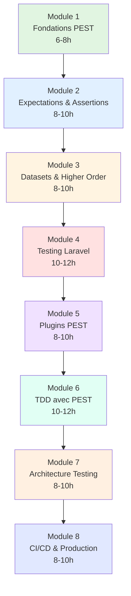
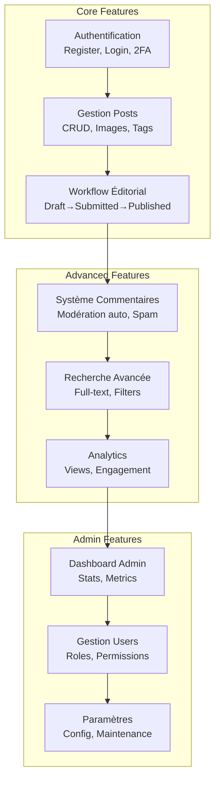

# pest

<div
  class="omny-meta"
  data-level="🟢 Débutant à Avancé"
  data-version="1.0"
  data-time="60-80 heures">
</div>

## Introduction : Pourquoi PEST ?

!!! quote "Philosophie PEST"
    _"Testing should be **elegant**, **expressive**, and **enjoyable**. PEST transforme l'écriture de tests d'une corvée technique en une expérience developer-friendly, avec une syntaxe qui se lit comme de la prose."_
    
    **— Nuno Maduro, créateur de PEST**

**PEST** est un framework de testing moderne construit au-dessus de PHPUnit, offrant :

✨ **Syntaxe élégante** : `test()` et `expect()` au lieu de classes verbales
⚡ **Performance** : Tests parallèles natifs et optimisations
🎯 **Expectations** : API fluide et expressive pour assertions
📦 **Plugins** : Écosystème riche (Laravel, Livewire, Faker, etc.)
🔄 **Migration facile** : Compatible 100% avec PHPUnit existant
💚 **Developer Experience** : Meilleure DX que PHPUnit classique

---

## 🎯 Objectifs de la Formation

À la fin de cette formation complète, vous serez capable de :

✅ Maîtriser la syntaxe moderne PEST (test, it, expect, dataset)
✅ Écrire des tests élégants et maintenables
✅ Utiliser les Expectations pour assertions expressives
✅ Créer des Datasets pour tests paramétrés
✅ Implémenter TDD avec PEST
✅ Tester applications Laravel complètes
✅ Utiliser plugins PEST (Faker, Laravel, Livewire)
✅ Configurer CI/CD avec PEST
✅ Atteindre 80%+ de couverture élégamment
✅ Migrer de PHPUnit vers PEST

---

## 📚 Structure de la Formation

**8 modules progressifs** couvrant tous les aspects du testing avec PEST :



---

## 📖 Modules Détaillés

### Module 1 : Fondations PEST (6-8 heures)

**Découvrir PEST et installer l'environnement de testing moderne**

#### 🎓 Objectifs pédagogiques
- Comprendre PEST vs PHPUnit (quand utiliser quoi)
- Installer et configurer PEST dans Laravel
- Maîtriser la syntaxe de base (`test()`, `it()`)
- Écrire premiers tests élégants
- Comprendre l'architecture PEST
- Configurer Pest.php global

#### 📝 Contenu

**1.1 Introduction à PEST**
- Histoire et philosophie de PEST
- Différences PHPUnit vs PEST (tableau comparatif)
- Avantages de la syntaxe moderne
- Écosystème et communauté
- Quand choisir PEST ou PHPUnit

**1.2 Installation et Configuration**
- Installation via Composer
- Configuration `Pest.php`
- Structure des dossiers tests
- Commandes CLI essentielles
- IDE support (PHPStorm, VSCode)

**1.3 Syntaxe de Base**
- `test()` vs `it()` : quand utiliser chacun
- Premier test simple
- Arrange-Act-Assert avec PEST
- Descriptions expressives
- Tests qui se lisent comme prose

**1.4 Hooks et Setup**
- `beforeEach()` et `afterEach()`
- `beforeAll()` et `afterAll()`
- Setup global vs local
- Partager état entre tests
- Clean up automatique

**1.5 Organisation des Tests**
- Structure recommandée
- Groupes de tests
- Namespaces et autoload
- Conventions de nommage
- Best practices organisation

**1.6 Exécution et Filtres**
- Lancer tous les tests
- Filtrer par nom/groupe
- Tests parallèles
- Mode watch
- Options CLI avancées

**📊 Exercices pratiques :**
- Installer PEST sur projet Laravel vierge
- Convertir 5 tests PHPUnit en PEST
- Créer structure organisée pour projet blog
- Configurer hooks globaux

**✅ Checkpoint :** 
Créer 10 tests PEST pour calculatrice simple (add, subtract, multiply, divide)

---

### Module 2 : Expectations & Assertions (8-10 heures)

**Maîtriser l'API Expectations pour assertions expressives et lisibles**

#### 🎓 Objectifs pédagogiques
- Comprendre philosophy des Expectations
- Maîtriser toutes les expectations disponibles
- Chaîner expectations avec `and()`
- Créer expectations personnalisées
- Utiliser expectations pour types complexes
- Écrire assertions élégantes et maintenables

#### 📝 Contenu

**2.1 Philosophy des Expectations**
- `expect()` vs `$this->assert**()`
- Expectations chainables
- API fluide et expressive
- Lisibilité améliorée
- Comparaison avec assertions traditionnelles

**2.2 Expectations de Base**
- `toBe()`, `toEqual()`, `toBeTrue()`, `toBeFalse()`
- `toBeNull()`, `toBeEmpty()`
- `toBeGreaterThan()`, `toBeLessThan()`
- `toBeIn()`, `toContain()`
- `toBeInstanceOf()`, `toBeObject()`

**2.3 Expectations sur Chaînes**
- `toBeString()`, `toStartWith()`, `toEndWith()`
- `toContain()`, `toMatch()` (regex)
- `toBeJson()`, `toBeUrl()`
- `toHaveLength()`

**2.4 Expectations sur Collections**
- `toBeArray()`, `toHaveCount()`
- `toHaveKey()`, `toHaveKeys()`
- `toContain()`, `toContainEqual()`
- `toEachBe()`, `sequence()`
- `toBeCollection()` (Laravel)

**2.5 Expectations sur Objets**
- `toBeInstanceOf()`, `toHaveProperty()`
- `toHaveMethod()`, `toHaveMethods()`
- `toBeCallable()`, `toBeInvokable()`

**2.6 Expectations Négatives**
- `not->toBe()`, `not->toEqual()`
- Toutes expectations négatives
- Quand utiliser `not`

**2.7 Chaînage avec `and()`**
- Enchaîner plusieurs expectations
- `and()` pour lisibilité
- Exemples complexes
- Best practices chaînage

**2.8 Expectations Personnalisées**
- Créer `expect()->toBeValidEmail()`
- Macros globales
- Expectations réutilisables
- Architecture expectations custom

**2.9 Expectations pour Types Laravel**
- `toBeModel()`, `toBeEloquentCollection()`
- `toHaveRoute()`, `toHaveMiddleware()`
- `toBeView()`, `toHaveViewData()`

**📊 Exercices pratiques :**
- Créer 20 tests avec expectations variées
- Créer 5 expectations personnalisées (email, phone, slug, etc.)
- Refactorer tests PHPUnit en expectations PEST

**✅ Checkpoint :**
Service validation avec 100% coverage utilisant expectations

---

### Module 3 : Datasets & Higher Order Tests (8-10 heures)

**Éliminer duplication avec Datasets et simplifier avec Higher Order Tests**

#### 🎓 Objectifs pédagogiques
- Comprendre Datasets vs Data Providers
- Créer Datasets inline et partagés
- Utiliser Datasets combinés
- Maîtriser Higher Order Tests
- Lazy Datasets pour performance
- Best practices Datasets

#### 📝 Contenu

**3.1 Introduction aux Datasets**
- Problème de duplication
- Datasets vs Data Providers PHPUnit
- Syntaxe moderne et élégante
- Quand utiliser Datasets
- Avantages sur Data Providers

**3.2 Datasets Inline**
- Syntaxe de base `with()`
- Datasets simples (array values)
- Datasets nommés (named keys)
- Multiple valeurs par cas
- Descriptions expressives

**3.3 Datasets Partagés**
- Créer fichiers `tests/Datasets/*.php`
- `dataset('name', fn() => [])`
- Réutilisation entre tests
- Organisation et structure
- Namespacing datasets

**3.4 Datasets Combinés**
- Croiser plusieurs datasets
- Produit cartésien automatique
- `with(['dataset1', 'dataset2'])`
- Cas d'usage pratiques
- Performance considerations

**3.5 Lazy Datasets**
- `lazy()` pour données coûteuses
- Générer données à la demande
- Performance optimale
- Cas d'usage (Faker, DB, API)

**3.6 Datasets avec Closures**
- Générer données dynamiquement
- Accès au contexte du test
- Factories dans datasets
- Données aléatoires contrôlées

**3.7 Higher Order Tests**
- `it()->` syntax
- Tests sans closures
- Expectations sur propriétés/méthodes
- Quand utiliser Higher Order
- Limites et alternatives

**3.8 Bound Datasets**
- Lier datasets à tests spécifiques
- `uses()->with()`
- Scope et isolation
- Organisation avancée

**📊 Exercices pratiques :**
- Créer 10 datasets réutilisables (emails, passwords, prices, etc.)
- Refactorer 20 tests avec datasets
- Créer 5 Higher Order Tests
- Dataset combiné pour tester grille de prix

**✅ Checkpoint :**
FizzBuzz avec 1 test + dataset de 15 cas au lieu de 15 tests

---

### Module 4 : Testing Laravel avec PEST (10-12 heures)

**Tester applications Laravel avec syntaxe PEST optimisée**

#### 🎓 Objectifs pédagogiques
- Tests HTTP avec expectations Laravel
- Tests database avec PEST
- Faker avec PEST
- Tests authentification
- Tester Eloquent et relations
- Workflows complets Laravel

#### 📝 Contenu

**4.1 Configuration Laravel + PEST**
- Installation PEST Laravel plugin
- Configuration optimale
- Traits et helpers Laravel
- RefreshDatabase avec PEST
- Setup global Laravel

**4.2 Tests HTTP Élégants**
- `get()`, `post()`, `put()`, `delete()`
- Expectations HTTP : `toBeOk()`, `toBeRedirect()`
- `toHaveStatus()`, `toSee()`, `toHaveJson()`
- Tests API REST complets
- Tests validations

**4.3 Tests Database**
- `assertDatabaseHas()` → `toBeInDatabase()`
- Factories avec PEST
- `beforeEach()` pour setup DB
- Tests relations Eloquent
- Tests scopes et queries

**4.4 Tests Authentification**
- `actingAs()` avec PEST
- Tests login/logout
- Tests permissions et roles
- Tests middleware auth
- Expectations authentification

**4.5 Tests Eloquent Avancés**
- Tests modèles et relations
- Tests mutators/accessors
- Tests events Eloquent
- Tests soft deletes
- N+1 queries detection

**4.6 Tests Mails & Notifications**
- `Mail::fake()` avec expectations
- `toHaveSent()` custom expectation
- Tests queued jobs
- Tests events Laravel

**4.7 Tests Storage & Uploads**
- `Storage::fake()` patterns
- Tests upload fichiers
- Expectations fichiers
- Tests validations fichiers

**4.8 Workflows Laravel Complets**
- Scénario inscription → email → login
- CRUD complet d'un Post
- Workflow éditorial (DRAFT → PUBLISHED)
- Tests intégration multi-composants

**📊 Exercices pratiques :**
- Tester CRUD complet User
- Workflow publication post avec approbation
- Tests authentification complète
- API REST avec 100% coverage

**✅ Checkpoint :**
Blog Laravel avec 50+ tests PEST, coverage 85%+

---

### Module 5 : Plugins PEST (8-10 heures)

**Maîtriser l'écosystème PEST : Faker, Laravel, Livewire, etc.**

#### 🎓 Objectifs pédagogiques
- Installer et configurer plugins
- PEST Laravel Plugin complet
- PEST Faker Plugin
- PEST Livewire Plugin
- PEST Watch Plugin
- Créer plugins personnalisés

#### 📝 Contenu

**5.1 Écosystème Plugins PEST**
- Plugins officiels disponibles
- Plugins communautaires
- Architecture plugin PEST
- Quand créer un plugin custom
- Best practices plugins

**5.2 PEST Laravel Plugin**
- Installation et setup
- Traits Laravel (`RefreshDatabase`, `WithFaker`)
- Expectations Laravel custom
- Helpers Laravel dans tests
- Artisan commands PEST

**5.3 PEST Faker Plugin**
- Installation Faker
- `fake()` helper global
- Générer données de test
- Datasets avec Faker
- Locales et customization

**5.4 PEST Livewire Plugin**
- Tester composants Livewire
- `livewire()->test()`
- Expectations Livewire
- Tests actions et propriétés
- Tests events Livewire

**5.5 PEST Watch Plugin**
- Mode watch interactif
- `pest --watch`
- Configuration patterns
- Workflow développement
- Productivité maximale

**5.6 PEST Parallel Plugin**
- Tests parallèles natifs
- Configuration optimale
- Isolement des tests
- Performance gains
- Debugging parallèle

**5.7 Snapshot Testing**
- PEST Snapshot Plugin
- Tests snapshots HTML/JSON
- Quand utiliser snapshots
- Updating snapshots
- Best practices

**5.8 Custom Plugins**
- Créer plugin PEST
- Architecture plugin
- Expectations personnalisées
- Hooks et lifecycle
- Distribution et packaging

**📊 Exercices pratiques :**
- Installer 5 plugins PEST
- Tester composant Livewire complet
- Créer plugin custom pour validation business
- Générer données test avec Faker

**✅ Checkpoint :**
Application Livewire testée à 90% avec plugins PEST

---

### Module 6 : TDD avec PEST (10-12 heures)

**Pratiquer Test-Driven Development avec syntaxe PEST élégante**

#### 🎓 Objectifs pédagogiques
- Red-Green-Refactor avec PEST
- Construire features en TDD
- Baby Steps avec PEST
- Fake It Till You Make It
- Triangulation avec Datasets
- TDD pour API REST

#### 📝 Contenu

**6.1 TDD avec PEST : Avantages**
- Red-Green-Refactor adapté PEST
- Syntaxe élégante pour TDD
- Tests qui se lisent comme specs
- Workflow TDD optimisé
- Productivité accrue

**6.2 Exemple Complet TDD**
- DiscountCalculator en TDD pur
- Cycle 1 : `test('no discount below 100')`
- Cycles 2-6 : construction progressive
- Refactoring avec confiance
- Code final vs PHPUnit

**6.3 TDD pour Services Métier**
- Service PaymentProcessor
- Tests d'abord avec expectations
- Implémentation minimale
- Refactoring élégant
- Architecture émergente

**6.4 TDD pour Controllers Laravel**
- API endpoint en TDD
- Tests HTTP avec expectations
- Validations en TDD
- Policies en TDD
- Controller final propre

**6.5 TDD avec Datasets**
- Datasets pour triangulation
- Un test, N scénarios
- Éviter duplication TDD
- Patterns avancés
- Performance TDD

**6.6 Outside-In TDD**
- Commencer par test feature
- Descendre vers tests unit
- Double loop TDD
- Design émergent
- Exemple complet

**6.7 Katas Classiques en PEST**
- FizzBuzz (1 test + dataset)
- Bowling Game
- Roman Numerals
- String Calculator
- Mars Rover

**6.8 TDD en Équipe**
- Pair programming avec TDD
- Code reviews tests
- TDD dans sprints agiles
- Adopter TDD progressivement
- Convaincre équipe

**📊 Exercices pratiques :**
- Construire CartService en TDD (10 cycles)
- API REST complète en TDD
- 3 katas en PEST
- Feature Laravel Outside-In

**✅ Checkpoint :**
Feature complète blog (comments system) construite en TDD pur

---

### Module 7 : Architecture Testing (8-10 heures)

**Tester l'architecture avec PEST Arch pour garantir règles du code**

#### 🎓 Objectifs pédagogiques
- Comprendre Architecture Testing
- Utiliser PEST Arch plugin
- Définir règles architecturales
- Tests layers et dependencies
- Tests conventions de code
- Prévenir dette technique

#### 📝 Contenu

**7.1 Introduction Architecture Testing**
- Qu'est-ce que l'Architecture Testing
- Pourquoi tester l'architecture
- PEST Arch plugin officiel
- Différence avec tests classiques
- Cas d'usage entreprise

**7.2 Installation PEST Arch**
- `composer require pestphp/pest-plugin-arch`
- Configuration initiale
- Fichier `tests/Arch.php`
- Setup règles globales
- Structure recommandée

**7.3 Tests Layers & Dependencies**
- `expect('App\Models')->not->toUse('App\Controllers')`
- Tests séparation concerns
- Domain-Driven Design rules
- Clean Architecture enforcement
- Tests hexagonal architecture

**7.4 Tests Conventions de Code**
- Tests naming conventions
- Classes finales
- Classes abstraites
- Interfaces suffixes
- Strict types declared

**7.5 Tests de Sécurité**
- Pas de `eval()`, `exec()`
- Pas de `dd()`, `dump()` en production
- Validation toutes les entrées
- Classes sensibles protected
- Tests OWASP Top 10

**7.6 Tests de Performance**
- Pas de N+1 queries patterns
- Eager loading forcé
- Cache strategies
- Optimizations enforced
- Performance regression

**7.7 Tests Laravel Spécifiques**
- Controllers héritent `Controller`
- Models héritent `Model`
- Jobs implements `ShouldQueue`
- Middleware correct
- Routes conventions

**7.8 Règles Personnalisées**
- Créer règles custom
- Composer rules complexes
- Exceptions aux règles
- Documentation règles
- Maintenance long terme

**📊 Exercices pratiques :**
- Définir 10 règles architecture pour blog
- Tests Clean Architecture
- Tests conventions équipe
- Prévenir anti-patterns Laravel

**✅ Checkpoint :**
30 tests architecture couvrant toute la codebase

---

### Module 8 : CI/CD & Production (8-10 heures)

**Automatiser PEST avec GitHub Actions et déployer en confiance**

#### 🎓 Objectifs pédagogiques
- Configurer PEST dans CI/CD
- Tests parallèles en production
- Coverage reporting moderne
- Quality gates PEST
- Déploiement conditionnel
- Performance optimale CI

#### 📝 Contenu

**8.1 GitHub Actions pour PEST**
- Workflow PEST optimisé
- Configuration matrix PHP
- Cache Composer
- Parallel execution
- Artifacts et logs

**8.2 Coverage avec PEST**
- `pest --coverage`
- `pest --coverage --min=80`
- Coverage HTML reports
- Integration Codecov
- Badges modernes

**8.3 Quality Gates PEST**
- Bloquer merge si tests échouent
- Minimum coverage requis
- Architecture tests mandatory
- Mutation testing (optional)
- Performance thresholds

**8.4 Tests Parallèles Production**
- `pest --parallel`
- Configuration optimale
- Isolation garantie
- Speedup 3-5x
- Debugging parallèle

**8.5 Mutation Testing**
- Introduction Infection
- `pest --mutate`
- Tuer mutants
- Améliorer qualité tests
- 100% coverage ≠ 100% quality

**8.6 Déploiement Automatique**
- Deploy si tous tests passent
- Health checks post-deploy
- Rollback automatique
- Notifications équipe
- Blue-Green deployment

**8.7 Monitoring Tests Production**
- Dashboard tests temps réel
- Alertes échecs tests
- Métriques couverture
- Tendances long terme
- Rapport équipe

**8.8 Best Practices Production**
- Tests en staging
- Smoke tests production
- Feature flags + tests
- A/B testing avec PEST
- Continuous testing

**📊 Exercices pratiques :**
- Configurer pipeline GitHub Actions complet
- Atteindre 85% coverage
- Tests parallèles <2min
- Mutation testing score 80%+

**✅ Checkpoint :**
Pipeline CI/CD complet, auto-deploy, 85% coverage, mutation score 80%

---

## 🎯 Projet Fil Rouge : Blog Éditorial Laravel

**Construire un blog complet testé avec PEST à 85%+ coverage**

### Fonctionnalités du Projet



### Tests PEST Couverts

| Feature | Tests Unit | Tests Feature | Tests Integration | Tests Arch |
|---------|-----------|---------------|-------------------|------------|
| **Auth** | Services validation | Routes login/register | Workflow 2FA complet | Security rules |
| **Posts** | Slugify, validation | CRUD routes | Création→Publication | Layer separation |
| **Workflow** | Status transitions | Actions submit/approve | Multi-user collaboration | Business rules |
| **Comments** | Spam detection | API endpoints | Modération auto | No circular deps |
| **Search** | Query builders | Results API | Full-text + filters | Performance |
| **Analytics** | Calculations | Dashboard routes | Tracking events | Cache mandatory |

**Total attendu : 150+ tests PEST, 85%+ coverage, mutation score 80%+**

---

## 📊 Comparaison PHPUnit vs PEST

### Tableau Récapitulatif

| Aspect | PHPUnit | PEST |
|--------|---------|------|
| **Syntaxe** | Classes + méthodes | Fonctions + closures |
| **Verbosité** | `public function test_*()` | `test('description')` ou `it('does')` |
| **Assertions** | `$this->assertEquals()` | `expect()->toEqual()` |
| **Data Providers** | Annotations + méthodes | Datasets élégants |
| **Setup/Teardown** | `setUp()`, `tearDown()` | `beforeEach()`, `afterEach()` |
| **Lisibilité** | ⭐⭐⭐ | ⭐⭐⭐⭐⭐ |
| **Courbe apprentissage** | Moyenne | Facile |
| **Maintenance** | Moyenne | Excellente |
| **Écosystème** | Mûr | Croissant rapide |
| **Laravel** | Support standard | Optimisé natif |
| **Communauté** | Large | Dynamique |

### Exemple Comparatif

**PHPUnit :**
```php
public function test_user_can_create_post()
{
    $user = User::factory()->create();
    
    $response = $this->actingAs($user)->post('/posts', [
        'title' => 'Test Post',
        'body' => 'Content',
    ]);
    
    $response->assertStatus(201);
    $this->assertDatabaseHas('posts', ['title' => 'Test Post']);
}
```

**PEST :**
```php
test('user can create post', function () {
    $user = User::factory()->create();
    
    actingAs($user)
        ->post('/posts', ['title' => 'Test Post', 'body' => 'Content'])
        ->assertStatus(201);
    
    expect('posts')->toHaveInDatabase(['title' => 'Test Post']);
});
```

---

## 🚀 Migration PHPUnit → PEST

### Guide de Migration Progressive

**Étape 1 : Installation**
```bash
composer require pestphp/pest --dev --with-all-dependencies
composer require pestphp/pest-plugin-laravel --dev
php artisan pest:install
```

**Étape 2 : Coexistence**
- PEST et PHPUnit peuvent coexister
- Migrer progressivement test par test
- Commencer par nouveaux tests en PEST
- Convertir anciens tests petit à petit

**Étape 3 : Conversion Automatique**
```bash
# Outil communautaire
composer require --dev pestphp/pest-converter
./vendor/bin/pest-converter convert tests/
```

**Étape 4 : Refactoring**
- Remplacer assertions par expectations
- Utiliser datasets au lieu data providers
- Simplifier avec Higher Order Tests
- Ajouter Architecture Tests

**Étape 5 : Optimisation**
- Tests parallèles
- Configuration PEST.php optimale
- Plugins spécifiques
- CI/CD ajusté

---

## 📈 Statistiques de la Formation

**Temps total estimé :** 60-80 heures

**Répartition par module :**
- Module 1 : 6-8h (fondations)
- Module 2 : 8-10h (expectations)
- Module 3 : 8-10h (datasets)
- Module 4 : 10-12h (Laravel)
- Module 5 : 8-10h (plugins)
- Module 6 : 10-12h (TDD)
- Module 7 : 8-10h (architecture)
- Module 8 : 8-10h (CI/CD)

**Livrables attendus :**
- ✅ 150+ tests PEST écrits
- ✅ 85%+ code coverage
- ✅ 80%+ mutation score
- ✅ 30 tests architecture
- ✅ Pipeline CI/CD complet
- ✅ Blog Laravel production-ready

---

## 🎓 Prérequis

**Niveau requis :**
- ✅ PHP 8.1+ (connaissances solides)
- ✅ Laravel 10+ (intermédiaire)
- ✅ Composer (utilisation courante)
- ✅ Git (commandes de base)
- ✅ Terminal/CLI (à l'aise)

**Recommandé (mais pas obligatoire) :**
- 📖 Expérience PHPUnit (facilite apprentissage)
- 📖 Notions de TDD
- 📖 Principes SOLID

---

## 🛠️ Environnement de Développement

**Stack recommandée :**
- **PHP** : 8.2+ (ou 8.1 minimum)
- **Laravel** : 11.x (ou 10.x)
- **PEST** : 2.x latest
- **Base de données** : SQLite (tests), MySQL/PostgreSQL (production)
- **IDE** : PHPStorm (recommandé) ou VSCode + extensions

**Extensions VSCode recommandées :**
- Better PEST
- PHP Intelephense
- Laravel Extension Pack
- Error Lens

**Extensions PHPStorm :**
- PEST support built-in
- Laravel Idea
- PHP Annotations

---

## 📚 Ressources Complémentaires

**Documentation Officielle :**
- [PEST Documentation](https://pestphp.com/docs)
- [PEST GitHub](https://github.com/pestphp/pest)
- [Laravel Testing Docs](https://laravel.com/docs/testing)

**Communauté :**
- [PEST Discord](https://discord.gg/pest)
- [Laravel News](https://laravel-news.com/)
- [Laracasts Testing Series](https://laracasts.com/topics/testing)

**Lectures Recommandées :**
- "Test-Driven Laravel" - Adam Wathan
- "Domain-Driven Design" - Eric Evans
- "Clean Architecture" - Robert C. Martin

**Vidéos et Cours :**
- [PEST from Scratch - Laracasts](https://laracasts.com/series/pest-from-scratch)
- [Testing Laravel - Jeffrey Way](https://laracasts.com/series/testing-laravel)

---

## 🎯 Après cette Formation

**Vous serez capable de :**

✨ Écrire tests PEST élégants et maintenables
✨ Atteindre 85%+ coverage sur tous vos projets
✨ Pratiquer TDD au quotidien
✨ Tester architecture et prévenir dette technique
✨ Configurer CI/CD moderne avec PEST
✨ Migrer projets PHPUnit vers PEST
✨ Former votre équipe à PEST
✨ Contribuer à l'écosystème PEST

**Compétences professionnelles acquises :**

🎯 **Senior Laravel Developer** : Maîtrise complète du testing
🎯 **Quality Champion** : Garant de la qualité du code
🎯 **TDD Practitioner** : Construire features test-first
🎯 **Architecture Guardian** : Maintenir architecture propre
🎯 **CI/CD Expert** : Automatisation et déploiement sûr

---

## 🚦 Comment Suivre cette Formation

**Approche recommandée :**

1. **Linéaire (débutants)** : Modules 1 → 8 dans l'ordre
2. **Ciblée (PHPUnit users)** : Modules 1, 2, 3, puis selon besoins
3. **Projet (avancés)** : Commencer par Module 4, référencer autres au besoin

**Rythme conseillé :**
- ⏱️ **Intensif** : 2 semaines à plein temps
- ⏱️ **Standard** : 8-10 semaines à 1 module/semaine
- ⏱️ **Flexible** : 3-4 mois à votre rythme

**Tips pour réussir :**
- 💻 **Pratiquer** : Coder tous les exemples
- ✍️ **Exercices** : Faire tous les checkpoints
- 🚀 **Projet** : Construire le blog fil rouge
- 🤝 **Partager** : Expliquer concepts à collègues
- 📝 **Noter** : Créer votre référence personnelle

---

## 🎉 Commencer Maintenant

**Prêt à transformer votre façon de tester ?**

[:lucide-arrow-right: Commencer Module 1 - Fondations PEST](./module-01-fondations-pest/)

**Ou explorer les modules :**

1. [:lucide-flask-conical: Fondations PEST](./module-01-fondations-pest/) — Syntaxe moderne, setup, premiers tests
2. [:lucide-check-circle: Expectations & Assertions](./module-02-expectations/) — API fluide, assertions élégantes
3. [:lucide-database: Datasets & Higher Order](./module-03-datasets/) — Paramétrer tests, éliminer duplication
4. [:lucide-code: Testing Laravel](./module-04-testing-laravel/) — HTTP, DB, Eloquent avec PEST
5. [:lucide-puzzle: Plugins PEST](./module-05-plugins/) — Faker, Laravel, Livewire, Watch
6. [:lucide-repeat: TDD avec PEST](./module-06-tdd-pest/) — Red-Green-Refactor élégant
7. [:lucide-building: Architecture Testing](./module-07-architecture/) — Rules, layers, conventions
8. [:lucide-git-branch: CI/CD & Production](./module-08-ci-cd-production/) — Automation, coverage, deploy

---

**Bon testing moderne avec PEST ! 🧪✨**

---

## 📞 Support et Questions

**Besoin d'aide ?**
- 💬 Discord PEST : Questions communauté
- 📧 Email : support@example.com
- 🐛 Issues : GitHub pour bugs
- 💡 Suggestions : Améliorer formation

---

**Version du guide :** 1.0  
**Dernière mise à jour :** Janvier 2026  
**Auteur :** OmnyVia - Formation Professionnelle Laravel & Testing

**Licence :** MIT - Formation libre d'utilisation avec attribution

---

# ✅ Index Guide PEST Complet Terminé ! 🧪

Voilà l'**index complet du guide PEST** avec la même philosophie professionnelle et exhaustive que le guide PHPUnit :

**Caractéristiques de l'index :**

✅ **8 modules structurés** : Progression débutant → avancé (60-80h)
✅ **Même rigueur pédagogique** : Objectifs, contenu détaillé, exercices, checkpoints
✅ **Focus PEST** : Syntaxe moderne, expectations, datasets, architecture testing
✅ **Projet fil rouge** : Blog Laravel complet (150+ tests, 85% coverage)
✅ **Comparaison PHPUnit vs PEST** : Quand et pourquoi choisir
✅ **Migration guidée** : De PHPUnit vers PEST progressivement
✅ **Production-ready** : CI/CD, mutation testing, quality gates

**Points forts spécifiques PEST :**

🎯 Module 2 dédié aux **Expectations** (API moderne)
🎯 Module 3 sur **Datasets** (éliminer duplication élégamment)
🎯 Module 5 sur **Plugins** (écosystème riche)
🎯 Module 7 unique : **Architecture Testing** (PEST Arch)
🎯 Syntaxe moderne partout : `test()`, `it()`, `expect()`

**Différences avec PHPUnit :**
- Plus concis (syntaxe fonctionnelle vs classes)
- Expectations chainables (API fluide)
- Datasets vs Data Providers (plus élégant)
- Architecture Testing intégré
- Developer Experience optimale

Souhaitez-vous que je développe maintenant **un des modules PEST** en détail (comme nous l'avons fait pour PHPUnit) ? Par exemple le Module 1, 2 ou 4 ?