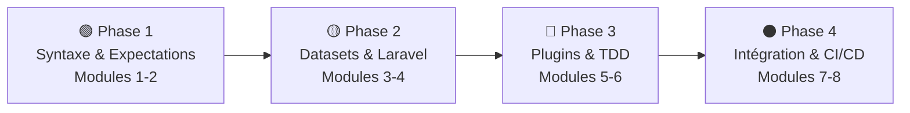

# Pest — Testing PHP Moderne

## Introduction

!!! quote "Analogie pédagogique — La Prose vs le Manuel Technique"
    Avec PHPUnit, vous rédigez un manuel technique : structure académique rigide, boilerplate obligatoire. Avec Pest, vous écrivez en **prose naturelle** — vos tests se lisent comme des phrases. `it('creates a user with valid data')` est compris par n'importe qui, même sans background technique. Pest transforme vos tests d'une obligation en **documentation vivante**.

**Pest** a été créé par Nuno Maduro en 2020. Construit sur PHPUnit, il simplifie radicalement l'écriture des tests tout en conservant 100% de la compatibilité avec l'écosystème existant. Syntaxe plus courte, Expectations chaînables, Datasets élégants, tests parallèles natifs, et le plugin d'Architecture Testing unique à Pest.

 

---

## Progression pédagogique

 

---

## Modules de la formation

### Phase 1 — Syntaxe & Expectations

-   :lucide-book-open:{ .lg .middle } **Module 1** — _Fondations Pest_

    ---
    Installation, `test()` vs `it()`, hooks `beforeEach()` / `afterEach()`, configuration `tests/Pest.php`. Comparaison PHPUnit vs Pest. Premières Expectations. Structure d'un fichier de test Pest.

    **Durée** : 6-8h | **Niveau** : 🟢 Débutant

    [:lucide-book-open-check: Accéder au module 1](./01-fondations-pest.md)

-   :lucide-check-circle:{ .lg .middle } **Module 2** — _Expectations & Assertions_

    ---
    API `expect()` complète : `toBe`, `toEqual`, `toBeNull`, `toHaveCount`, `toContain`, `toThrow`. Chaînage avec `and()`. Negation avec `not`. Créer des Expectations personnalisées.

    **Durée** : 6-8h | **Niveau** : 🟢 Débutant

    [:lucide-book-open-check: Accéder au module 2](./02-expectations-assertions.md)

### Phase 2 — Datasets & Laravel

-   :lucide-table:{ .lg .middle } **Module 3** — _Datasets & Higher-Order Tests_

    ---
    Datasets inline et partagés pour tester N cas. Higher-Order Tests pour tests ultra-concis. `describe()` pour grouper. Tests parallèles natifs avec `--parallel`. Architecture Testing.

    **Durée** : 6-8h | **Niveau** : 🟡 Intermédiaire

    [:lucide-book-open-check: Accéder au module 3](./03-datasets-higher-order.md)

-   :lucide-route:{ .lg .middle } **Module 4** — _Testing Laravel avec Pest_

    ---
    Plugin Laravel : `actingAs()`, routes HTTP, `RefreshDatabase`, factories. Assertions Laravel : `assertDatabaseHas`, `assertRedirect`, `assertSee`. Tests Feature complets sur le blog.

    **Durée** : 8-10h | **Niveau** : 🟡 Intermédiaire

    [:lucide-book-open-check: Accéder au module 4](./04-testing-laravel.md)

### Phase 3 — Plugins & TDD

-   :lucide-puzzle:{ .lg .middle } **Module 5** — _Plugins Pest_

    ---
    Écosystème Pest : `pest-plugin-laravel`, `pest-plugin-faker`, `pest-plugin-livewire`. Architecture Testing : vérifier que les Controllers ne dépendent pas directement des Models. Mutant testing.

    **Durée** : 6-8h | **Niveau** : 🔴 Avancé

    [:lucide-book-open-check: Accéder au module 5](./05-plugins-pest.md)

-   :lucide-refresh-cw:{ .lg .middle } **Module 6** — _TDD avec Pest_

    ---
    Cycle **Red → Green → Refactor** appliqué avec la syntaxe Pest. `describe/it` BDD-style. Écrire les tests avant le code sur des features réelles. Combiner TDD et Higher-Order Tests.

    **Durée** : 6-8h | **Niveau** : 🔴 Avancé

    [:lucide-book-open-check: Accéder au module 6](./06-tdd.md)

### Phase 4 — Intégration & CI/CD

-   :lucide-layers:{ .lg .middle } **Module 7** — _Tests d'Intégration_

    ---
    Tester plusieurs composants ensemble. Mocking avec Mockery, Spies, Fakes Laravel depuis Pest. Stratégies d'isolation. Tests d'API REST complets. Gestion des side-effects.

    **Durée** : 6-8h | **Niveau** : 🔴 Avancé

    [:lucide-book-open-check: Accéder au module 7](./07-tests-integration.md)

-   :lucide-git-branch:{ .lg .middle } **Module 8** — _CI/CD & Production_

    ---
    GitHub Actions avec Pest. Code coverage PCOV/Xdebug. Rapports Clover et Codecov. Tests parallèles en CI. Seuil 80%, profiling lenteur, optimisation de la suite complète.

    **Durée** : 6-8h | **Niveau** : 🔴 Avancé

    [:lucide-book-open-check: Accéder au module 8](./08-cicd-production.md)

 

---

## PHPUnit vs Pest — Comparaison rapide

| Aspect | PHPUnit | Pest |
|---|---|---|
| **Syntaxe** | Classes + méthodes | Fonctions (`test`, `it`) |
| **Assertions** | `$this->assertEquals()` | `expect()->toBe()` |
| **Datasets** | `@dataProvider` + méthode | `.with([...])` inline |
| **Tests parallèles** | Extension tierce | `--parallel` natif |
| **Architecture testing** | Non | Plugin dédié |
| **Compatibilité PHPUnit** | ✅ Natif | ✅ 100% compatible |
| **Courbe d'apprentissage** | 🔴 Raide | 🟢 Douce |

!!! tip "Conseil"
    Pest et PHPUnit peuvent **coexister** dans un même projet. Vous pouvez migrer progressivement vos tests existants vers Pest sans tout réécrire.

 

---

## Conclusion

!!! quote "Ce qu'il faut retenir"
    Pest n'est pas simplement "PHPUnit avec moins de code" — c'est un **changement de philosophie**. Quand vos tests se lisent comme de la documentation naturelle, vous les écrivez plus volontiers, vos collègues les comprennent sans explication, et le TDD devient une pratique agréable plutôt qu'une contrainte. Le plugin Architecture Testing est unique : il vous permet de vérifier que votre code respecte les règles architecturales que vous avez définies — un filet de sécurité invisible mais redoutable.

> Vous préférez la structure académique classique ? Explorez [PHPUnit →](../phpunit/index.md).

 

---

## Conclusion

!!! quote "Ce qu'il faut retenir"
    Pest PHP apporte une syntaxe élégante et expressive aux tests PHP. En réduisant le bruit syntaxique, il permet aux développeurs de se concentrer sur l'essentiel : la qualité et la fiabilité du code métier.

> [Retourner à l'index des tests →](../../index.md)
