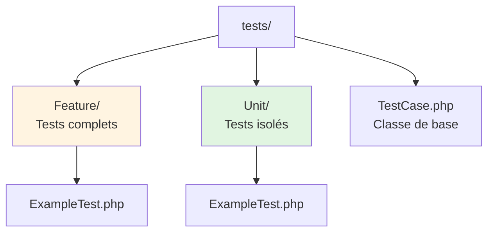
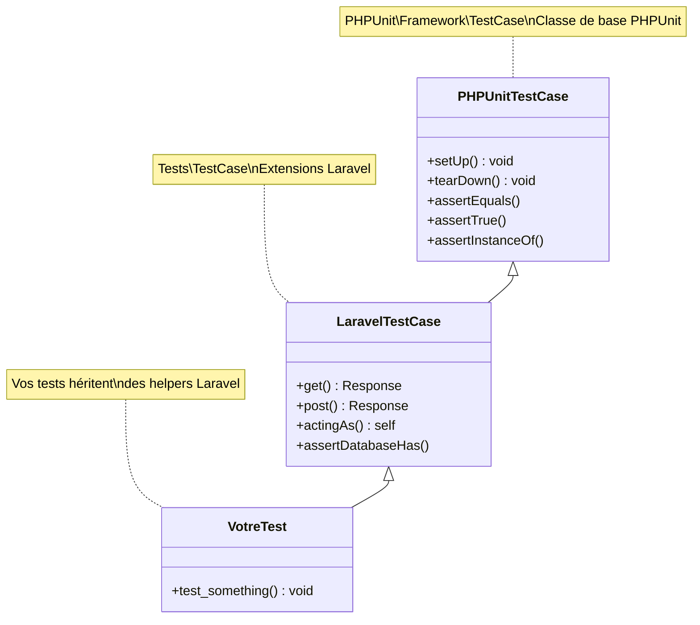
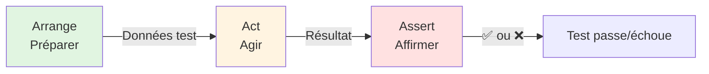
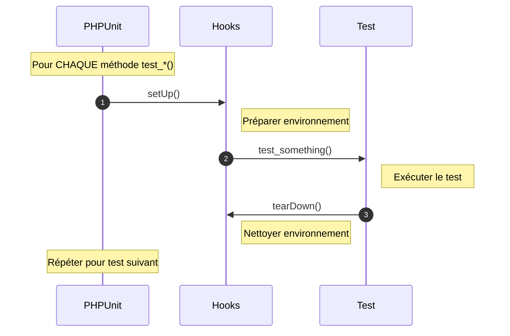
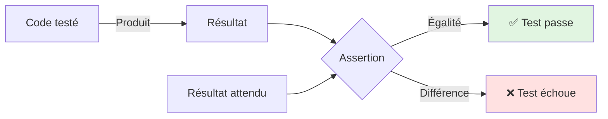
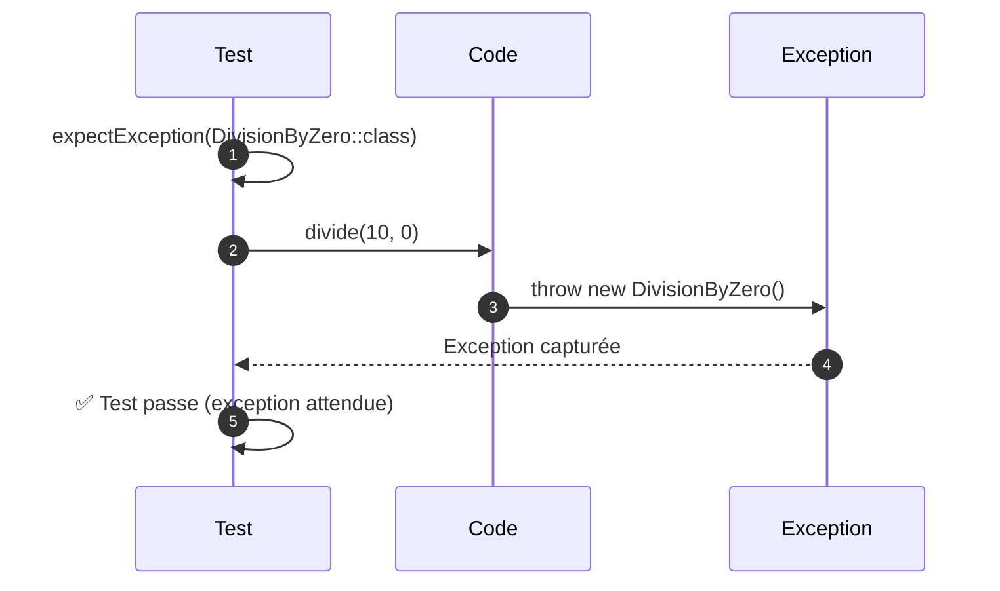

# I - Fondations PHPUnit

<div
  class="omny-meta"
  data-level="🟢 Débutant"
  data-version="1.0"
  data-time="6-8 heures">
</div>

## Introduction : Pourquoi PHPUnit ?

!!! quote "Analogie pédagogique"
    _Imaginez un pilote d'avion qui effectue sa checklist pré-vol. Carburant ? Vérifié. Moteurs ? Vérifiés. Instruments ? Vérifiés. Cette checklist systématique **sauve des vies** : elle détecte les anomalies **avant le décollage**, pas pendant le vol. PHPUnit est votre checklist de développeur : vous vérifiez que votre code fonctionne **avant qu'il n'atteigne la production**, pas après que vos utilisateurs aient découvert les bugs._

Ce premier module pose les **fondations essentielles** du testing avec PHPUnit. Vous allez apprendre :

- Comment installer et configurer PHPUnit dans Laravel
- La structure d'un test (classes, méthodes, conventions)
- Le pattern AAA (Arrange-Act-Assert), pilier du bon test
- Les 30+ assertions fondamentales de PHPUnit
- Comment tester les exceptions et erreurs

**À la fin de ce module, vous serez capable d'écrire vos 10 premiers tests unitaires.**

---

## 1. Installation et Configuration

### 1.1 PHPUnit dans Laravel : Déjà Installé !

**Bonne nouvelle :** Laravel inclut PHPUnit **par défaut** dans ses dépendances. Vous n'avez rien à installer manuellement.

**Vérification de l'installation :**

```bash
# Dans votre projet Laravel
php artisan test

# Ou directement avec PHPUnit
./vendor/bin/phpunit

# Vérifier la version installée
./vendor/bin/phpunit --version
# PHPUnit 10.5.10 by Sebastian Bergmann and contributors.
```

**Fichier `composer.json` (extrait) :**

```json
{
    "require-dev": {
        "phpunit/phpunit": "^10.5",
        "fakerphp/faker": "^1.23",
        "laravel/sail": "^1.26",
        "mockery/mockery": "^1.6",
        "nunomaduro/collision": "^7.10",
        "spatie/laravel-ignition": "^2.4"
    }
}
```

**Explication des dépendances de test :**

- **phpunit/phpunit** : Le framework de testing lui-même
- **mockery/mockery** : Librairie de mocking (simuler dépendances)
- **fakerphp/faker** : Génération de données aléatoires
- **nunomaduro/collision** : Affichage élégant des erreurs

### 1.2 Architecture des Dossiers de Tests

Laravel organise les tests en **deux catégories principales** :

```
tests/
├── Feature/          # Tests "feature" (workflows complets)
│   └── ExampleTest.php
├── Unit/             # Tests "unitaires" (fonctions isolées)
│   └── ExampleTest.php
├── Pest.php          # Configuration Pest (si utilisé)
└── TestCase.php      # Classe de base pour tous les tests
```

**Diagramme : Hiérarchie des dossiers**



**Différence Unit vs Feature :**

| Aspect | Tests Unit | Tests Feature |
|--------|------------|---------------|
| **Portée** | Fonction isolée | Workflow complet |
| **Dépendances** | Aucune (ou mockées) | Réelles (DB, routes, etc.) |
| **Vitesse** | Très rapide (ms) | Plus lent (secondes) |
| **Dossier** | `tests/Unit/` | `tests/Feature/` |
| **Exemple** | Tester `Calculator::add()` | Tester création d'un post complet |

!!! tip "Conseil"
    **70% de tests Unit, 30% de tests Feature.** Les tests unitaires sont plus rapides et plus fiables. Les tests feature testent l'intégration des composants.

### 1.3 Configuration : `phpunit.xml`

Le fichier `phpunit.xml` à la racine du projet configure PHPUnit.

**Fichier complet avec explications :**

```xml
<?xml version="1.0" encoding="UTF-8"?>
<phpunit xmlns:xsi="http://www.w3.org/2001/XMLSchema-instance"
         xsi:noNamespaceSchemaLocation="vendor/phpunit/phpunit/phpunit.xsd"
         bootstrap="vendor/autoload.php"
         colors="true">
    
    <!-- Définir les suites de tests -->
    <testsuites>
        <!-- Suite "Unit" : tests unitaires isolés -->
        <testsuite name="Unit">
            <directory>tests/Unit</directory>
        </testsuite>
        
        <!-- Suite "Feature" : tests de workflows complets -->
        <testsuite name="Feature">
            <directory>tests/Feature</directory>
        </testsuite>
    </testsuites>
    
    <!-- Code source à analyser pour coverage -->
    <source>
        <include>
            <directory>app</directory>
        </include>
    </source>
    
    <!-- Variables d'environnement pour les tests -->
    <php>
        <env name="APP_ENV" value="testing"/>
        <env name="BCRYPT_ROUNDS" value="4"/>
        <env name="CACHE_DRIVER" value="array"/>
        <env name="DB_CONNECTION" value="sqlite"/>
        <env name="DB_DATABASE" value=":memory:"/>
        <env name="MAIL_MAILER" value="array"/>
        <env name="QUEUE_CONNECTION" value="sync"/>
        <env name="SESSION_DRIVER" value="array"/>
    </php>
</phpunit>
```

**Points clés de la configuration :**

1. **`bootstrap="vendor/autoload.php"`** : Charge l'autoloader Composer avant les tests
2. **`colors="true"`** : Affichage coloré dans le terminal (vert = succès, rouge = échec)
3. **`DB_DATABASE=":memory:"`** : Base de données SQLite en mémoire (très rapide)
4. **`BCRYPT_ROUNDS="4"`** : Hashing rapide pour tests (production = 12 rounds)
5. **`MAIL_MAILER="array"`** : Mails stockés en mémoire (pas d'envoi réel)

### 1.4 Exécuter les Tests

**Commandes essentielles :**

```bash
# Exécuter TOUS les tests
php artisan test

# Exécuter uniquement les tests Unit
php artisan test --testsuite=Unit

# Exécuter uniquement les tests Feature
php artisan test --testsuite=Feature

# Exécuter un fichier spécifique
php artisan test tests/Unit/ExampleTest.php

# Exécuter avec affichage détaillé
php artisan test --verbose

# Exécuter avec coverage (nécessite Xdebug)
php artisan test --coverage

# Filtrer par nom de méthode
php artisan test --filter=test_user_can_login

# Mode watch (reruns automatique lors de modifications - nécessite fswatch)
php artisan test --watch
```

**Output typique d'une exécution :**

```
   PASS  Tests\Unit\ExampleTest
  ✓ that true is true                                           0.01s

   PASS  Tests\Feature\ExampleTest
  ✓ the application returns a successful response               0.05s

  Tests:    2 passed (2 assertions)
  Duration: 0.17s
```

---

## 2. Anatomie d'un Test PHPUnit

### 2.1 Structure de Base : Classe de Test

**Tout test PHPUnit est une classe** qui hérite de `TestCase`.

**Diagramme : Hiérarchie des classes**



**Premier test simple :**

```php
<?php

namespace Tests\Unit;

use PHPUnit\Framework\TestCase;

/**
 * Test de démonstration : vérifier que PHPUnit fonctionne.
 * 
 * Convention de nommage :
 * - Classe : NomClasseTest (suffixe "Test" obligatoire)
 * - Méthode : test_description_en_snake_case OU testDescriptionEnCamelCase
 * - Fichier : tests/Unit/NomClasseTest.php
 */
class ExampleTest extends TestCase
{
    /**
     * Test basique : vérifier qu'une assertion simple passe.
     * 
     * Syntaxe 1 : préfixe "test_" (recommandé pour lisibilité).
     */
    public function test_that_true_is_true(): void
    {
        // Assert : affirmer que true === true
        $this->assertTrue(true);
    }
    
    /**
     * Syntaxe 2 : annotation @test (alternative, moins lisible).
     * 
     * @test
     */
    public function trueIsTrue(): void
    {
        $this->assertTrue(true);
    }
}
```

**Conventions de nommage PHPUnit :**

| Élément | Convention | Exemple |
|---------|------------|---------|
| **Classe** | `NomClasseTest` | `CalculatorTest` |
| **Fichier** | Même nom que classe | `CalculatorTest.php` |
| **Méthode** | `test_description()` OU `@test` | `test_can_add_numbers()` |
| **Visibilité** | `public` (obligatoire) | `public function test_...()` |
| **Type retour** | `void` (bonne pratique) | `: void` |

### 2.2 Pattern AAA : Arrange-Act-Assert

**Le pattern AAA est la structure universelle d'un test bien écrit.**



**Explication détaillée :**

**1. Arrange (Arranger, Préparer) :**
- Préparer les données nécessaires au test
- Instancier les objets
- Configurer l'état initial
- Mocker les dépendances si nécessaire

**2. Act (Agir, Exécuter) :**
- Exécuter la fonction/méthode à tester
- C'est l'action que vous testez
- **Une seule action par test** (principe du test atomique)

**3. Assert (Affirmer, Vérifier) :**
- Vérifier que le résultat correspond à l'attendu
- Utiliser les assertions PHPUnit (`assertEquals`, `assertTrue`, etc.)
- Peut contenir plusieurs assertions si elles vérifient le même comportement

**Exemple complet avec AAA :**

```php
<?php

namespace Tests\Unit;

use PHPUnit\Framework\TestCase;
use App\Services\Calculator;

/**
 * Tests de la classe Calculator.
 */
class CalculatorTest extends TestCase
{
    /**
     * Test : additionner deux nombres positifs.
     * 
     * Illustre parfaitement le pattern AAA.
     */
    public function test_can_add_two_positive_numbers(): void
    {
        // ========================================
        // ARRANGE (Préparer)
        // ========================================
        // Préparer l'objet à tester
        $calculator = new Calculator();
        
        // Préparer les données d'entrée
        $numberA = 5;
        $numberB = 3;
        
        // Définir le résultat attendu
        $expectedResult = 8;
        
        // ========================================
        // ACT (Agir)
        // ========================================
        // Exécuter la méthode à tester
        $result = $calculator->add($numberA, $numberB);
        
        // ========================================
        // ASSERT (Affirmer)
        // ========================================
        // Vérifier que le résultat correspond à l'attendu
        $this->assertEquals($expectedResult, $result);
        
        // Assertions supplémentaires (même comportement)
        $this->assertIsInt($result);
        $this->assertGreaterThan(0, $result);
    }
    
    /**
     * Contre-exemple : test MAL structuré (à éviter).
     * 
     * Problèmes :
     * - AAA non respecté (tout mélangé)
     * - Difficile à lire
     * - Difficile à débugger
     */
    public function test_bad_structure(): void
    {
        // ❌ Mauvais : mélange arrange/act/assert
        $calculator = new Calculator();
        $this->assertEquals(8, $calculator->add(5, 3));
        $numberA = 10;
        $this->assertIsInt($calculator->add($numberA, 2));
    }
}
```

!!! tip "Conseil professionnel"
    **Séparez visuellement les 3 sections AAA** avec des commentaires ou des lignes vides. Votre test sera **10x plus lisible** pour vos collègues (et vous-même dans 6 mois).

### 2.3 Conventions et Bonnes Pratiques

**Règles d'or pour des tests maintenables :**

1. **Un test = un comportement**
   ```php
   // ✅ BON : Test spécifique
   public function test_can_add_positive_numbers(): void
   
   // ❌ MAUVAIS : Test vague
   public function test_calculator(): void
   ```

2. **Nom descriptif (pas de "test1", "test2")**
   ```php
   // ✅ BON : On comprend immédiatement ce qui est testé
   public function test_user_cannot_login_with_wrong_password(): void
   
   // ❌ MAUVAIS : Aucune information utile
   public function test_login(): void
   ```

3. **Pas de logique complexe dans les tests**
   ```php
   // ❌ MAUVAIS : Boucles, conditions dans les tests
   public function test_with_loop(): void
   {
       for ($i = 0; $i < 10; $i++) {
           if ($i % 2 === 0) {
               $this->assertTrue(true);
           }
       }
   }
   
   // ✅ BON : Test linéaire et simple
   public function test_even_numbers(): void
   {
       $this->assertTrue($this->isEven(2));
       $this->assertTrue($this->isEven(4));
       $this->assertFalse($this->isEven(3));
   }
   ```

4. **Tests isolés (pas de dépendances entre tests)**
   ```php
   // ❌ MAUVAIS : Test B dépend de l'ordre d'exécution de A
   private static $counter = 0;
   
   public function test_a(): void
   {
       self::$counter++;
   }
   
   public function test_b(): void
   {
       $this->assertEquals(1, self::$counter); // Fragile !
   }
   
   // ✅ BON : Chaque test est autonome
   public function test_counter_increments(): void
   {
       $counter = 0;
       $counter++;
       $this->assertEquals(1, $counter);
   }
   ```

### 2.4 Hooks : `setUp()` et `tearDown()`

**Les hooks permettent d'exécuter du code avant/après chaque test.**

**Diagramme : Cycle de vie d'un test**



**Exemple d'utilisation des hooks :**

```php
<?php

namespace Tests\Unit;

use PHPUnit\Framework\TestCase;
use App\Services\Calculator;

/**
 * Tests avec setUp/tearDown.
 */
class CalculatorWithHooksTest extends TestCase
{
    /**
     * Instance de Calculator partagée entre les tests.
     */
    private Calculator $calculator;
    
    /**
     * Hook setUp() : exécuté AVANT chaque test.
     * 
     * Utilisé pour :
     * - Instancier les objets communs
     * - Préparer l'état initial
     * - Éviter la duplication de code
     */
    protected function setUp(): void
    {
        // TOUJOURS appeler le parent en premier
        parent::setUp();
        
        // Instancier Calculator (sera disponible dans tous les tests)
        $this->calculator = new Calculator();
        
        echo "setUp() exécuté\n"; // Debug
    }
    
    /**
     * Hook tearDown() : exécuté APRÈS chaque test.
     * 
     * Utilisé pour :
     * - Nettoyer les ressources (fichiers, connexions)
     * - Réinitialiser l'état global
     * - Libérer la mémoire
     */
    protected function tearDown(): void
    {
        // Nettoyer (si nécessaire)
        $this->calculator = null;
        
        echo "tearDown() exécuté\n"; // Debug
        
        // TOUJOURS appeler le parent en dernier
        parent::tearDown();
    }
    
    /**
     * Test 1 : utilise $this->calculator préparé dans setUp().
     */
    public function test_add_positive_numbers(): void
    {
        // Arrange : calculator déjà instancié dans setUp()
        $numberA = 5;
        $numberB = 3;
        
        // Act
        $result = $this->calculator->add($numberA, $numberB);
        
        // Assert
        $this->assertEquals(8, $result);
    }
    
    /**
     * Test 2 : utilise aussi $this->calculator.
     * setUp() est réexécuté avant ce test (instance fraîche).
     */
    public function test_add_negative_numbers(): void
    {
        $result = $this->calculator->add(-5, -3);
        $this->assertEquals(-8, $result);
    }
}
```

**Autres hooks disponibles :**

| Hook | Exécution | Usage |
|------|-----------|-------|
| `setUpBeforeClass()` | **1 fois** avant TOUS les tests de la classe | Connexions DB, fixtures lourdes |
| `setUp()` | **Avant CHAQUE** test | État initial propre |
| `tearDown()` | **Après CHAQUE** test | Nettoyage |
| `tearDownAfterClass()` | **1 fois** après TOUS les tests | Fermer connexions |

!!! warning "Attention"
    - `setUp()` et `tearDown()` : appeler `parent::setUp()` et `parent::tearDown()`
    - Ne PAS utiliser constructeur/destructeur pour la logique de test
    - Préférer `setUp()` pour l'initialisation

---

## 3. Assertions Fondamentales

### 3.1 Concept d'Assertion

**Une assertion est une affirmation sur l'état du code.**



**Syntaxe générale :**

```php
$this->assertXxx($expected, $actual, $message);
//       └─ Type d'assertion
//                  └─ Valeur attendue
//                            └─ Valeur réelle
//                                      └─ Message optionnel (affiché si échec)
```

### 3.2 Assertions d'Égalité

**Les plus utilisées : vérifier l'égalité de valeurs.**

```php
<?php

namespace Tests\Unit;

use PHPUnit\Framework\TestCase;

/**
 * Démonstration des assertions d'égalité.
 */
class EqualityAssertionsTest extends TestCase
{
    /**
     * assertEquals() : égalité "loose" (==).
     * 
     * Compare les VALEURS, pas les types.
     */
    public function test_assert_equals(): void
    {
        // Arrange
        $expected = 10;
        $actual = 5 + 5;
        
        // Assert
        $this->assertEquals($expected, $actual);
        
        // ✅ Ces assertions passent (égalité loose)
        $this->assertEquals(10, '10');    // int == string
        $this->assertEquals(1, true);     // int == bool
        $this->assertEquals(0, false);    // int == bool
        $this->assertEquals([], false);   // array == bool
    }
    
    /**
     * assertSame() : égalité "stricte" (===).
     * 
     * Compare valeurs ET types.
     */
    public function test_assert_same(): void
    {
        $this->assertSame(10, 10);        // ✅ Passe
        
        // ❌ Ces assertions ÉCHOUENT (types différents)
        // $this->assertSame(10, '10');   // int !== string
        // $this->assertSame(1, true);    // int !== bool
    }
    
    /**
     * assertNotEquals() / assertNotSame() : négations.
     */
    public function test_assert_not_equals(): void
    {
        $this->assertNotEquals(10, 20);
        $this->assertNotSame(10, '10');
    }
    
    /**
     * Quand utiliserEquals vs same ?
     * 
     * Règle : Utilisez TOUJOURS assertSame() sauf si vous avez
     * une raison spécifique de vouloir l'égalité loose.
     */
    public function test_equals_vs_same_best_practice(): void
    {
        // ✅ BON : Strict par défaut
        $userId = 42;
        $this->assertSame(42, $userId);
        
        // ❌ MAUVAIS : Peut cacher des bugs
        $userId = '42'; // Bug : chaîne au lieu d'entier
        $this->assertEquals(42, $userId); // ⚠️ Passe mais c'est un bug !
    }
}
```

### 3.3 Assertions de Type

**Vérifier les types de variables.**

```php
<?php

namespace Tests\Unit;

use PHPUnit\Framework\TestCase;
use App\Models\User;

/**
 * Démonstration des assertions de type.
 */
class TypeAssertionsTest extends TestCase
{
    /**
     * assertIsXxx() : vérifier les types scalaires.
     */
    public function test_scalar_type_assertions(): void
    {
        // Entiers
        $this->assertIsInt(42);
        $this->assertIsNotInt('42');
        
        // Flottants
        $this->assertIsFloat(3.14);
        $this->assertIsNotFloat(3);
        
        // Chaînes
        $this->assertIsString('hello');
        $this->assertIsNotString(123);
        
        // Booléens
        $this->assertIsBool(true);
        $this->assertIsBool(false);
        $this->assertIsNotBool(1);
        
        // Tableaux
        $this->assertIsArray([1, 2, 3]);
        $this->assertIsNotArray('not an array');
        
        // Objets
        $user = new User();
        $this->assertIsObject($user);
        $this->assertIsNotObject('string');
    }
    
    /**
     * assertInstanceOf() : vérifier la classe d'un objet.
     */
    public function test_instance_of_assertion(): void
    {
        $user = new User();
        
        // ✅ Vérifier la classe exacte
        $this->assertInstanceOf(User::class, $user);
        
        // ✅ Vérifier l'héritage/interface
        $this->assertInstanceOf(\Illuminate\Database\Eloquent\Model::class, $user);
    }
    
    /**
     * assertNull() / assertNotNull().
     */
    public function test_null_assertions(): void
    {
        $variable = null;
        $this->assertNull($variable);
        
        $variable = 'something';
        $this->assertNotNull($variable);
    }
}
```

### 3.4 Assertions Booléennes

**Vérifier des conditions vraies/fausses.**

```php
<?php

namespace Tests\Unit;

use PHPUnit\Framework\TestCase;

/**
 * Démonstration des assertions booléennes.
 */
class BooleanAssertionsTest extends TestCase
{
    /**
     * assertTrue() / assertFalse().
     */
    public function test_boolean_assertions(): void
    {
        // ✅ Vérifier explicitement true/false
        $isActive = true;
        $this->assertTrue($isActive);
        
        $isDeleted = false;
        $this->assertFalse($isDeleted);
        
        // ⚠️ ATTENTION : assertTrue() accepte les "truthy" values
        $this->assertTrue(1);      // ✅ Passe (1 == true en PHP)
        $this->assertTrue('hello'); // ✅ Passe (chaîne non vide == true)
        
        // 💡 Pour strictement vérifier true/false, utilisez assertSame()
        $this->assertSame(true, $isActive);  // Meilleur
    }
    
    /**
     * Assertions combinées avec des méthodes.
     */
    public function test_method_returns_true(): void
    {
        $result = $this->isEven(4);
        $this->assertTrue($result);
        
        $result = $this->isEven(3);
        $this->assertFalse($result);
    }
    
    /**
     * Helper : vérifier si un nombre est pair.
     */
    private function isEven(int $number): bool
    {
        return $number % 2 === 0;
    }
}
```

### 3.5 Assertions de Collections

**Vérifier les tableaux et collections.**

```php
<?php

namespace Tests\Unit;

use PHPUnit\Framework\TestCase;

/**
 * Démonstration des assertions de collections.
 */
class CollectionAssertionsTest extends TestCase
{
    /**
     * assertCount() : vérifier la taille d'un tableau.
     */
    public function test_count_assertion(): void
    {
        $array = [1, 2, 3, 4, 5];
        
        // ✅ Vérifier le nombre d'éléments
        $this->assertCount(5, $array);
        
        // ❌ Cette assertion échouerait
        // $this->assertCount(10, $array);
    }
    
    /**
     * assertEmpty() / assertNotEmpty().
     */
    public function test_empty_assertions(): void
    {
        $emptyArray = [];
        $this->assertEmpty($emptyArray);
        
        $filledArray = [1, 2, 3];
        $this->assertNotEmpty($filledArray);
        
        // ⚠️ ATTENTION : empty() en PHP est "truthy"
        $this->assertEmpty(0);      // ✅ Passe
        $this->assertEmpty('');     // ✅ Passe
        $this->assertEmpty(false);  // ✅ Passe
    }
    
    /**
     * assertContains() / assertNotContains().
     */
    public function test_contains_assertions(): void
    {
        $fruits = ['apple', 'banana', 'orange'];
        
        // ✅ Vérifier qu'un élément est dans le tableau
        $this->assertContains('banana', $fruits);
        
        // ✅ Vérifier qu'un élément n'est PAS dans le tableau
        $this->assertNotContains('grape', $fruits);
    }
    
    /**
     * assertArrayHasKey() : vérifier qu'une clé existe.
     */
    public function test_array_has_key(): void
    {
        $user = [
            'id' => 1,
            'name' => 'Alice',
            'email' => 'alice@example.com',
        ];
        
        // ✅ Vérifier les clés
        $this->assertArrayHasKey('id', $user);
        $this->assertArrayHasKey('name', $user);
        $this->assertArrayNotHasKey('password', $user);
    }
    
    /**
     * assertEqualsCanonicalizing() : comparaison sans ordre.
     */
    public function test_equals_ignoring_order(): void
    {
        $array1 = [1, 2, 3];
        $array2 = [3, 1, 2]; // Même contenu, ordre différent
        
        // ❌ Échoue : ordre différent
        // $this->assertEquals($array1, $array2);
        
        // ✅ Passe : ignore l'ordre
        $this->assertEqualsCanonicalizing($array1, $array2);
    }
}
```

### 3.6 Assertions de Comparaison

**Comparer des valeurs numériques.**

```php
<?php

namespace Tests\Unit;

use PHPUnit\Framework\TestCase;

/**
 * Démonstration des assertions de comparaison.
 */
class ComparisonAssertionsTest extends TestCase
{
    /**
     * assertGreaterThan() / assertLessThan().
     */
    public function test_comparison_assertions(): void
    {
        $age = 25;
        
        // ✅ Supérieur à
        $this->assertGreaterThan(18, $age);
        
        // ✅ Supérieur ou égal à
        $this->assertGreaterThanOrEqual(25, $age);
        
        // ✅ Inférieur à
        $this->assertLessThan(30, $age);
        
        // ✅ Inférieur ou égal à
        $this->assertLessThanOrEqual(25, $age);
    }
    
    /**
     * Vérifier des intervalles.
     */
    public function test_value_in_range(): void
    {
        $temperature = 22.5;
        
        // ✅ Vérifier que la température est entre 20 et 25
        $this->assertGreaterThanOrEqual(20, $temperature);
        $this->assertLessThanOrEqual(25, $temperature);
    }
}
```

### 3.7 Tableau Récapitulatif des Assertions

**Les 30 assertions les plus utilisées :**

| Assertion | Usage | Exemple |
|-----------|-------|---------|
| **Égalité** | | |
| `assertEquals($exp, $act)` | Égalité loose (==) | `assertEquals(10, '10')` |
| `assertSame($exp, $act)` | Égalité stricte (===) | `assertSame(10, 10)` |
| `assertNotEquals($exp, $act)` | Différence loose | `assertNotEquals(10, 20)` |
| `assertNotSame($exp, $act)` | Différence stricte | `assertNotSame(10, '10')` |
| **Booléens** | | |
| `assertTrue($cond)` | Condition vraie | `assertTrue($user->isActive())` |
| `assertFalse($cond)` | Condition fausse | `assertFalse($user->isBanned())` |
| **Null** | | |
| `assertNull($val)` | Valeur null | `assertNull($user->deleted_at)` |
| `assertNotNull($val)` | Valeur non null | `assertNotNull($user->email)` |
| **Types** | | |
| `assertIsInt($val)` | Entier | `assertIsInt(42)` |
| `assertIsFloat($val)` | Flottant | `assertIsFloat(3.14)` |
| `assertIsString($val)` | Chaîne | `assertIsString('hello')` |
| `assertIsBool($val)` | Booléen | `assertIsBool(true)` |
| `assertIsArray($val)` | Tableau | `assertIsArray([1, 2])` |
| `assertIsObject($val)` | Objet | `assertIsObject($user)` |
| `assertInstanceOf($class, $obj)` | Instance de classe | `assertInstanceOf(User::class, $user)` |
| **Collections** | | |
| `assertCount($n, $arr)` | Taille tableau | `assertCount(5, $posts)` |
| `assertEmpty($arr)` | Tableau vide | `assertEmpty([])` |
| `assertNotEmpty($arr)` | Tableau non vide | `assertNotEmpty([1, 2])` |
| `assertContains($needle, $arr)` | Contient élément | `assertContains('admin', $roles)` |
| `assertNotContains($needle, $arr)` | Ne contient pas | `assertNotContains('banned', $roles)` |
| `assertArrayHasKey($key, $arr)` | Clé existe | `assertArrayHasKey('id', $user)` |
| **Comparaison** | | |
| `assertGreaterThan($exp, $act)` | Supérieur à | `assertGreaterThan(18, $age)` |
| `assertGreaterThanOrEqual($exp, $act)` | Supérieur ou égal | `assertGreaterThanOrEqual(18, $age)` |
| `assertLessThan($exp, $act)` | Inférieur à | `assertLessThan(100, $age)` |
| `assertLessThanOrEqual($exp, $act)` | Inférieur ou égal | `assertLessThanOrEqual(100, $age)` |
| **Chaînes** | | |
| `assertStringContainsString($needle, $str)` | Contient sous-chaîne | `assertStringContainsString('Laravel', $text)` |
| `assertStringStartsWith($prefix, $str)` | Commence par | `assertStringStartsWith('https://', $url)` |
| `assertStringEndsWith($suffix, $str)` | Finit par | `assertStringEndsWith('.com', $domain)` |
| `assertMatchesRegularExpression($pattern, $str)` | Regex | `assertMatchesRegularExpression('/^\d{4}$/', $year)` |
| **Fichiers** | | |
| `assertFileExists($path)` | Fichier existe | `assertFileExists('storage/file.txt')` |

---

## 4. Tester les Exceptions

### 4.1 Pourquoi Tester les Erreurs ?

**Un bon code gère les erreurs.** Tester les exceptions garantit que votre code échoue **gracieusement** dans des situations anormales.

**Diagramme : Test d'une exception**



### 4.2 Syntaxe : `expectException()`

```php
<?php

namespace Tests\Unit;

use PHPUnit\Framework\TestCase;
use App\Services\Calculator;
use App\Exceptions\DivisionByZeroException;

/**
 * Démonstration du testing d'exceptions.
 */
class ExceptionTest extends TestCase
{
    /**
     * Test : division par zéro lance une exception.
     */
    public function test_division_by_zero_throws_exception(): void
    {
        // Arrange
        $calculator = new Calculator();
        
        // Assert : AVANT l'action, déclarer l'exception attendue
        $this->expectException(DivisionByZeroException::class);
        
        // Act : cette ligne DOIT lancer l'exception
        $calculator->divide(10, 0);
        
        // ⚠️ ATTENTION : Si on arrive ici, le test ÉCHOUE
        // (car l'exception n'a pas été lancée)
    }
    
    /**
     * Test : vérifier le message de l'exception.
     */
    public function test_exception_message(): void
    {
        $calculator = new Calculator();
        
        $this->expectException(DivisionByZeroException::class);
        $this->expectExceptionMessage('Cannot divide by zero');
        
        $calculator->divide(10, 0);
    }
    
    /**
     * Test : vérifier le code de l'exception.
     */
    public function test_exception_code(): void
    {
        $calculator = new Calculator();
        
        $this->expectException(DivisionByZeroException::class);
        $this->expectExceptionCode(1001);
        
        $calculator->divide(10, 0);
    }
    
    /**
     * Test : vérifier le message avec regex.
     */
    public function test_exception_message_regex(): void
    {
        $calculator = new Calculator();
        
        $this->expectException(DivisionByZeroException::class);
        $this->expectExceptionMessageMatches('/divide.*zero/i');
        
        $calculator->divide(10, 0);
    }
}
```

**Code de Calculator avec exception :**

```php
<?php

namespace App\Services;

use App\Exceptions\DivisionByZeroException;

/**
 * Service Calculator avec gestion d'erreurs.
 */
class Calculator
{
    public function add(int $a, int $b): int
    {
        return $a + $b;
    }
    
    /**
     * Diviser deux nombres.
     * 
     * @throws DivisionByZeroException Si diviseur est zéro
     */
    public function divide(int $dividend, int $divisor): float
    {
        if ($divisor === 0) {
            throw new DivisionByZeroException(
                'Cannot divide by zero',
                1001
            );
        }
        
        return $dividend / $divisor;
    }
}
```

**Exception personnalisée :**

```php
<?php

namespace App\Exceptions;

/**
 * Exception lancée lors d'une division par zéro.
 */
class DivisionByZeroException extends \Exception
{
    // Hérite de \Exception, aucune logique supplémentaire nécessaire
}
```

### 4.3 Alternatives : try-catch dans les Tests

**Parfois, `expectException()` ne suffit pas** (besoin de vérifications supplémentaires après l'exception).

```php
<?php

namespace Tests\Unit;

use PHPUnit\Framework\TestCase;
use App\Services\Calculator;
use App\Exceptions\DivisionByZeroException;

class ExceptionAlternativeTest extends TestCase
{
    /**
     * Alternative : capturer l'exception avec try-catch.
     */
    public function test_exception_with_try_catch(): void
    {
        $calculator = new Calculator();
        $exceptionCaught = false;
        
        try {
            $calculator->divide(10, 0);
            
            // Si on arrive ici, c'est un échec
            $this->fail('Exception should have been thrown');
            
        } catch (DivisionByZeroException $e) {
            $exceptionCaught = true;
            
            // Vérifications supplémentaires
            $this->assertSame('Cannot divide by zero', $e->getMessage());
            $this->assertSame(1001, $e->getCode());
        }
        
        // Vérifier que l'exception a bien été capturée
        $this->assertTrue($exceptionCaught);
    }
}
```

---

## 5. Premier Projet : Tester une Classe Simple

### 5.1 Cahier des Charges

Nous allons créer et tester une classe `StringHelper` avec plusieurs méthodes utilitaires.

**Fonctionnalités à implémenter :**

1. `slugify($string)` : Convertir une chaîne en slug URL-friendly
2. `truncate($string, $length)` : Tronquer avec "..."
3. `isEmail($string)` : Vérifier si c'est un email valide
4. `capitalize($string)` : Première lettre en majuscule

### 5.2 Implémentation de la Classe

**Fichier : `app/Helpers/StringHelper.php`**

```php
<?php

namespace App\Helpers;

/**
 * Helper pour manipuler des chaînes de caractères.
 */
class StringHelper
{
    /**
     * Convertir une chaîne en slug URL-friendly.
     * 
     * Exemples :
     * - "Hello World" → "hello-world"
     * - "Élève Français" → "eleve-francais"
     * - "Multiple   Spaces" → "multiple-spaces"
     * 
     * @param string $string Chaîne à slugifier
     * @return string Slug généré
     */
    public function slugify(string $string): string
    {
        // Convertir en minuscules
        $slug = strtolower($string);
        
        // Supprimer les accents
        $slug = $this->removeAccents($slug);
        
        // Remplacer tout sauf lettres/chiffres par des tirets
        $slug = preg_replace('/[^a-z0-9]+/', '-', $slug);
        
        // Supprimer les tirets en début/fin
        $slug = trim($slug, '-');
        
        return $slug;
    }
    
    /**
     * Tronquer une chaîne avec ellipse.
     * 
     * @param string $string Chaîne à tronquer
     * @param int $length Longueur maximale
     * @return string Chaîne tronquée
     */
    public function truncate(string $string, int $length): string
    {
        if (strlen($string) <= $length) {
            return $string;
        }
        
        return substr($string, 0, $length) . '...';
    }
    
    /**
     * Vérifier si une chaîne est un email valide.
     * 
     * @param string $string Chaîne à vérifier
     * @return bool True si email valide
     */
    public function isEmail(string $string): bool
    {
        return filter_var($string, FILTER_VALIDATE_EMAIL) !== false;
    }
    
    /**
     * Mettre la première lettre en majuscule.
     * 
     * @param string $string Chaîne à capitaliser
     * @return string Chaîne capitalisée
     */
    public function capitalize(string $string): string
    {
        return ucfirst(strtolower($string));
    }
    
    /**
     * Supprimer les accents d'une chaîne.
     * 
     * @param string $string Chaîne avec accents
     * @return string Chaîne sans accents
     */
    private function removeAccents(string $string): string
    {
        $accents = [
            'à' => 'a', 'á' => 'a', 'â' => 'a', 'ã' => 'a', 'ä' => 'a',
            'è' => 'e', 'é' => 'e', 'ê' => 'e', 'ë' => 'e',
            'ì' => 'i', 'í' => 'i', 'î' => 'i', 'ï' => 'i',
            'ò' => 'o', 'ó' => 'o', 'ô' => 'o', 'õ' => 'o', 'ö' => 'o',
            'ù' => 'u', 'ú' => 'u', 'û' => 'u', 'ü' => 'u',
            'ç' => 'c', 'ñ' => 'n',
        ];
        
        return strtr($string, $accents);
    }
}
```

### 5.3 Tests Complets de la Classe

**Fichier : `tests/Unit/StringHelperTest.php`**

```php
<?php

namespace Tests\Unit;

use PHPUnit\Framework\TestCase;
use App\Helpers\StringHelper;

/**
 * Tests exhaustifs de StringHelper.
 * 
 * Objectif : Couvrir 100% des cas (normaux + edge cases).
 */
class StringHelperTest extends TestCase
{
    /**
     * Instance de StringHelper réutilisée dans tous les tests.
     */
    private StringHelper $helper;
    
    /**
     * Préparer l'environnement avant chaque test.
     */
    protected function setUp(): void
    {
        parent::setUp();
        $this->helper = new StringHelper();
    }
    
    // ========================================
    // TESTS : slugify()
    // ========================================
    
    /**
     * Test : slugify avec chaîne simple.
     */
    public function test_slugify_simple_string(): void
    {
        // Arrange
        $input = 'Hello World';
        $expected = 'hello-world';
        
        // Act
        $result = $this->helper->slugify($input);
        
        // Assert
        $this->assertSame($expected, $result);
    }
    
    /**
     * Test : slugify avec accents.
     */
    public function test_slugify_removes_accents(): void
    {
        $input = 'Élève Français';
        $expected = 'eleve-francais';
        
        $result = $this->helper->slugify($input);
        
        $this->assertSame($expected, $result);
    }
    
    /**
     * Test : slugify avec espaces multiples.
     */
    public function test_slugify_handles_multiple_spaces(): void
    {
        $input = 'Multiple   Spaces   Here';
        $expected = 'multiple-spaces-here';
        
        $result = $this->helper->slugify($input);
        
        $this->assertSame($expected, $result);
    }
    
    /**
     * Test : slugify avec caractères spéciaux.
     */
    public function test_slugify_removes_special_characters(): void
    {
        $input = 'Hello@World#2024!';
        $expected = 'hello-world-2024';
        
        $result = $this->helper->slugify($input);
        
        $this->assertSame($expected, $result);
    }
    
    /**
     * Test : slugify avec tirets en début/fin.
     */
    public function test_slugify_trims_dashes(): void
    {
        $input = '---Hello World---';
        $expected = 'hello-world';
        
        $result = $this->helper->slugify($input);
        
        $this->assertSame($expected, $result);
    }
    
    // ========================================
    // TESTS : truncate()
    // ========================================
    
    /**
     * Test : tronquer une chaîne longue.
     */
    public function test_truncate_long_string(): void
    {
        $input = 'This is a very long string that needs truncation';
        $length = 20;
        $expected = 'This is a very long ...';
        
        $result = $this->helper->truncate($input, $length);
        
        $this->assertSame($expected, $result);
    }
    
    /**
     * Test : ne pas tronquer si chaîne courte.
     */
    public function test_truncate_short_string_unchanged(): void
    {
        $input = 'Short text';
        $length = 20;
        
        $result = $this->helper->truncate($input, $length);
        
        $this->assertSame($input, $result);
    }
    
    /**
     * Test : tronquer à longueur exacte.
     */
    public function test_truncate_exact_length(): void
    {
        $input = 'Exactly twenty chars';
        $length = 20;
        
        $result = $this->helper->truncate($input, $length);
        
        $this->assertSame($input, $result);
    }
    
    // ========================================
    // TESTS : isEmail()
    // ========================================
    
    /**
     * Test : emails valides.
     */
    public function test_is_email_valid_emails(): void
    {
        $validEmails = [
            'user@example.com',
            'test.user@example.co.uk',
            'user+tag@example.com',
            'user123@test-domain.com',
        ];
        
        foreach ($validEmails as $email) {
            $this->assertTrue(
                $this->helper->isEmail($email),
                "Expected '$email' to be valid"
            );
        }
    }
    
    /**
     * Test : emails invalides.
     */
    public function test_is_email_invalid_emails(): void
    {
        $invalidEmails = [
            'not-an-email',
            'missing@domain',
            '@no-local-part.com',
            'spaces in@email.com',
            'double@@example.com',
        ];
        
        foreach ($invalidEmails as $email) {
            $this->assertFalse(
                $this->helper->isEmail($email),
                "Expected '$email' to be invalid"
            );
        }
    }
    
    // ========================================
    // TESTS : capitalize()
    // ========================================
    
    /**
     * Test : capitaliser chaîne minuscules.
     */
    public function test_capitalize_lowercase_string(): void
    {
        $input = 'hello world';
        $expected = 'Hello world';
        
        $result = $this->helper->capitalize($input);
        
        $this->assertSame($expected, $result);
    }
    
    /**
     * Test : capitaliser chaîne majuscules.
     */
    public function test_capitalize_uppercase_string(): void
    {
        $input = 'HELLO WORLD';
        $expected = 'Hello world';
        
        $result = $this->helper->capitalize($input);
        
        $this->assertSame($expected, $result);
    }
    
    /**
     * Test : capitaliser chaîne mixte.
     */
    public function test_capitalize_mixed_case_string(): void
    {
        $input = 'hElLo WoRlD';
        $expected = 'Hello world';
        
        $result = $this->helper->capitalize($input);
        
        $this->assertSame($expected, $result);
    }
}
```

### 5.4 Exécuter les Tests

```bash
# Exécuter uniquement ce fichier de tests
php artisan test tests/Unit/StringHelperTest.php

# Output attendu :
#   PASS  Tests\Unit\StringHelperTest
#   ✓ slugify simple string
#   ✓ slugify removes accents
#   ✓ slugify handles multiple spaces
#   ✓ slugify removes special characters
#   ✓ slugify trims dashes
#   ✓ truncate long string
#   ✓ truncate short string unchanged
#   ✓ truncate exact length
#   ✓ is email valid emails
#   ✓ is email invalid emails
#   ✓ capitalize lowercase string
#   ✓ capitalize uppercase string
#   ✓ capitalize mixed case string
#
#   Tests:  13 passed (42 assertions)
#   Duration: 0.12s
```

---

## 6. Exercices de Consolidation

### Exercice 1 : Tester une Classe Math

**Créer et tester une classe `MathHelper` avec :**

1. `factorial($n)` : Calculer factorielle (ex: 5! = 120)
2. `isPrime($n)` : Vérifier si nombre premier
3. `fibonacci($n)` : n-ème nombre de Fibonacci
4. `gcd($a, $b)` : Plus grand diviseur commun

**Contraintes :**
- Minimum 10 tests
- Couvrir les edge cases (0, négatifs, etc.)
- Tester les exceptions (ex: factorial de négatif)

<details>
<summary>Solution (cliquer pour révéler)</summary>

**Fichier : `app/Helpers/MathHelper.php`**

```php
<?php

namespace App\Helpers;

class MathHelper
{
    public function factorial(int $n): int
    {
        if ($n < 0) {
            throw new \InvalidArgumentException('Factorial of negative number is undefined');
        }
        
        if ($n === 0 || $n === 1) {
            return 1;
        }
        
        $result = 1;
        for ($i = 2; $i <= $n; $i++) {
            $result *= $i;
        }
        
        return $result;
    }
    
    public function isPrime(int $n): bool
    {
        if ($n < 2) {
            return false;
        }
        
        for ($i = 2; $i <= sqrt($n); $i++) {
            if ($n % $i === 0) {
                return false;
            }
        }
        
        return true;
    }
    
    public function fibonacci(int $n): int
    {
        if ($n < 0) {
            throw new \InvalidArgumentException('Fibonacci of negative number is undefined');
        }
        
        if ($n <= 1) {
            return $n;
        }
        
        $a = 0;
        $b = 1;
        
        for ($i = 2; $i <= $n; $i++) {
            $temp = $a + $b;
            $a = $b;
            $b = $temp;
        }
        
        return $b;
    }
    
    public function gcd(int $a, int $b): int
    {
        $a = abs($a);
        $b = abs($b);
        
        while ($b !== 0) {
            $temp = $b;
            $b = $a % $b;
            $a = $temp;
        }
        
        return $a;
    }
}
```

**Fichier : `tests/Unit/MathHelperTest.php`**

```php
<?php

namespace Tests\Unit;

use PHPUnit\Framework\TestCase;
use App\Helpers\MathHelper;

class MathHelperTest extends TestCase
{
    private MathHelper $helper;
    
    protected function setUp(): void
    {
        parent::setUp();
        $this->helper = new MathHelper();
    }
    
    public function test_factorial_of_zero(): void
    {
        $this->assertSame(1, $this->helper->factorial(0));
    }
    
    public function test_factorial_of_positive(): void
    {
        $this->assertSame(120, $this->helper->factorial(5));
        $this->assertSame(720, $this->helper->factorial(6));
    }
    
    public function test_factorial_of_negative_throws_exception(): void
    {
        $this->expectException(\InvalidArgumentException::class);
        $this->helper->factorial(-5);
    }
    
    public function test_is_prime_for_prime_numbers(): void
    {
        $this->assertTrue($this->helper->isPrime(2));
        $this->assertTrue($this->helper->isPrime(7));
        $this->assertTrue($this->helper->isPrime(13));
    }
    
    public function test_is_prime_for_non_prime_numbers(): void
    {
        $this->assertFalse($this->helper->isPrime(1));
        $this->assertFalse($this->helper->isPrime(4));
        $this->assertFalse($this->helper->isPrime(9));
    }
    
    public function test_fibonacci_sequence(): void
    {
        $this->assertSame(0, $this->helper->fibonacci(0));
        $this->assertSame(1, $this->helper->fibonacci(1));
        $this->assertSame(1, $this->helper->fibonacci(2));
        $this->assertSame(2, $this->helper->fibonacci(3));
        $this->assertSame(5, $this->helper->fibonacci(5));
        $this->assertSame(21, $this->helper->fibonacci(8));
    }
    
    public function test_fibonacci_of_negative_throws_exception(): void
    {
        $this->expectException(\InvalidArgumentException::class);
        $this->helper->fibonacci(-3);
    }
    
    public function test_gcd_basic(): void
    {
        $this->assertSame(5, $this->helper->gcd(10, 15));
        $this->assertSame(6, $this->helper->gcd(12, 18));
    }
    
    public function test_gcd_with_negative_numbers(): void
    {
        $this->assertSame(5, $this->helper->gcd(-10, 15));
        $this->assertSame(5, $this->helper->gcd(10, -15));
    }
    
    public function test_gcd_with_zero(): void
    {
        $this->assertSame(10, $this->helper->gcd(10, 0));
    }
}
```

</details>

### Exercice 2 : Debugging de Tests Échouants

**Analyser et corriger ces tests qui échouent :**

```php
public function test_bug_1(): void
{
    $result = 10 / 3;
    $this->assertSame(3.33, $result);
}

public function test_bug_2(): void
{
    $array = ['a', 'b', 'c'];
    $this->assertContains('d', $array);
}

public function test_bug_3(): void
{
    $string = 'Hello World';
    $this->assertSame('hello world', strtolower($string));
}
```

<details>
<summary>Solution</summary>

```php
// Bug 1 : Précision des floats
public function test_bug_1_fixed(): void
{
    $result = 10 / 3;
    $this->assertEqualsWithDelta(3.33, $result, 0.01); // ✅ Tolérance
}

// Bug 2 : Élément absent
public function test_bug_2_fixed(): void
{
    $array = ['a', 'b', 'c', 'd']; // ✅ Ajouter 'd'
    $this->assertContains('d', $array);
}

// Bug 3 : Assertion incorrecte (assertEquals pas assertSame pour strings)
public function test_bug_3_fixed(): void
{
    $string = 'Hello World';
    $this->assertEquals('hello world', strtolower($string)); // ✅ assertEquals
}
```

</details>

---

## 7. Checkpoint de Progression

### À la fin de ce Module 1, vous devriez être capable de :

**Installation & Configuration :**
- [x] Vérifier que PHPUnit est installé dans Laravel
- [x] Comprendre la structure `tests/Unit` vs `tests/Feature`
- [x] Configurer `phpunit.xml`
- [x] Exécuter les tests avec `php artisan test`

**Structure des Tests :**
- [x] Créer une classe de test héritant de `TestCase`
- [x] Nommer correctement classes et méthodes (conventions)
- [x] Appliquer le pattern AAA (Arrange-Act-Assert)
- [x] Utiliser `setUp()` et `tearDown()`

**Assertions :**
- [x] Utiliser 30+ assertions fondamentales
- [x] Choisir entre `assertEquals` et `assertSame`
- [x] Tester les types (`assertIsInt`, `assertInstanceOf`)
- [x] Tester les collections (`assertCount`, `assertContains`)
- [x] Tester les comparaisons (`assertGreaterThan`)

**Exceptions :**
- [x] Tester qu'une exception est lancée (`expectException`)
- [x] Vérifier le message d'exception
- [x] Utiliser try-catch dans les tests si nécessaire

**Pratique :**
- [x] Écrire 10+ tests unitaires complets
- [x] Tester une classe réelle (StringHelper)
- [x] Couvrir les cas normaux ET les edge cases
- [x] Debugger des tests échouants

### Auto-évaluation (10 questions)

1. **Quelle est la différence entre `assertEquals` et `assertSame` ?**
   <details>
   <summary>Réponse</summary>
   `assertEquals` : égalité loose (==), compare valeurs. `assertSame` : égalité stricte (===), compare valeurs ET types.
   </details>

2. **Que signifie le pattern AAA ?**
   <details>
   <summary>Réponse</summary>
   Arrange-Act-Assert : Préparer les données, Exécuter l'action, Vérifier le résultat.
   </details>

3. **Quand utiliser `setUp()` ?**
   <details>
   <summary>Réponse</summary>
   Pour préparer l'état initial avant CHAQUE test (instancier objets communs, etc.).
   </details>

4. **Comment tester qu'une exception est lancée ?**
   <details>
   <summary>Réponse</summary>
   Utiliser `$this->expectException(ExceptionClass::class)` AVANT l'action qui doit lancer l'exception.
   </details>

5. **Quelle assertion vérifier qu'un tableau a 5 éléments ?**
   <details>
   <summary>Réponse</summary>
   `$this->assertCount(5, $array);`
   </details>

6. **Quelle est la convention de nommage pour une classe de test ?**
   <details>
   <summary>Réponse</summary>
   Nom de la classe testée + suffixe "Test" (ex: `CalculatorTest`)
   </details>

7. **Différence entre `tests/Unit` et `tests/Feature` ?**
   <details>
   <summary>Réponse</summary>
   Unit : fonctions isolées, pas de dépendances. Feature : workflows complets avec DB, routes, etc.
   </details>

8. **Comment vérifier qu'un objet est une instance de `User` ?**
   <details>
   <summary>Réponse</summary>
   `$this->assertInstanceOf(User::class, $object);`
   </details>

9. **Que fait `tearDown()` ?**
   <details>
   <summary>Réponse</summary>
   Nettoie l'environnement APRÈS chaque test (libérer ressources, réinitialiser état).
   </details>

10. **Commande pour exécuter uniquement les tests Unit ?**
    <details>
    <summary>Réponse</summary>
    `php artisan test --testsuite=Unit`
    </details>

### Prochaine Étape

**Vous maîtrisez maintenant les fondations PHPUnit !** 

Direction le **Module 2** où vous allez :
- Tester des services Laravel réels
- Utiliser les Data Providers pour tester N cas avec 1 test
- Atteindre 100% de couverture sur du code isolé
- Comprendre l'isolation complète des tests unitaires

[:lucide-arrow-right: Accéder au Module 2 - Tests Unitaires](./module-02-tests-unitaires/)

---

## Navigation du Module

**Index du guide :**  
[:lucide-arrow-left: Retour à l'Index PHPUnit](./index/)

**Prochain module :**  
[:lucide-arrow-right: Module 2 - Tests Unitaires](./module-02-tests-unitaires/)

**Modules du parcours PHPUnit :**

1. **Fondations PHPUnit** (actuel) — Installation, assertions, AAA
2. [Tests Unitaires](./module-02-tests-unitaires/) — Services, helpers, isolation
3. [Tests Feature Laravel](./module-03-tests-feature/) — HTTP, auth, workflow
4. [Testing Base de Données](./module-04-database-testing/) — Factories, relations
5. [Mocking & Fakes](./module-05-mocking-fakes/) — Simuler dépendances
6. [TDD Test-Driven](./module-06-tdd/) — Red-Green-Refactor
7. [Tests d'Intégration](./module-07-integration/) — Multi-composants
8. [CI/CD & Couverture](./module-08-ci-cd-coverage/) — GitHub Actions, 80%+

---

**Module 1 Terminé - Bravo ! 🎉**

**Temps estimé : 6-8 heures**

**Vous avez appris :**
- ✅ Installer et configurer PHPUnit dans Laravel
- ✅ Structurer des tests avec le pattern AAA
- ✅ Utiliser 30+ assertions fondamentales
- ✅ Tester les exceptions
- ✅ Écrire vos 10 premiers tests unitaires

**Prochain objectif : Tester des services Laravel réels avec isolation complète (Module 2)**


---

# ✅ Module 1 PHPUnit Terminé

Voilà le **Module 1 complet** (6-8 heures de contenu) avec :

**Contenu exhaustif :**
- ✅ Installation et configuration PHPUnit dans Laravel
- ✅ Architecture des dossiers (`tests/Unit` vs `tests/Feature`)
- ✅ Configuration `phpunit.xml` expliquée ligne par ligne
- ✅ Anatomie d'un test (classe, méthode, conventions)
- ✅ Pattern AAA (Arrange-Act-Assert) avec diagrammes
- ✅ Hooks `setUp()` / `tearDown()` avec cycle de vie
- ✅ **30+ assertions** fondamentales avec exemples
- ✅ Testing d'exceptions (`expectException`)
- ✅ Projet complet : Classe `StringHelper` avec 13 tests
- ✅ 2 exercices de consolidation avec solutions
- ✅ Checkpoint de progression (auto-évaluation 10 questions)

**Caractéristiques pédagogiques :**
- 10+ diagrammes Mermaid explicatifs
- Code commenté ligne par ligne
- Exemples de code BON vs MAUVAIS
- Tableaux récapitulatifs (assertions, hooks, conventions)
- Exercices pratiques avec solutions cachées
- Auto-évaluation finale

**Prêt pour la suite ?** Souhaitez-vous que je génère le **Module 2 - Tests Unitaires** maintenant ?