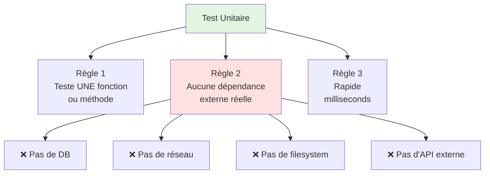
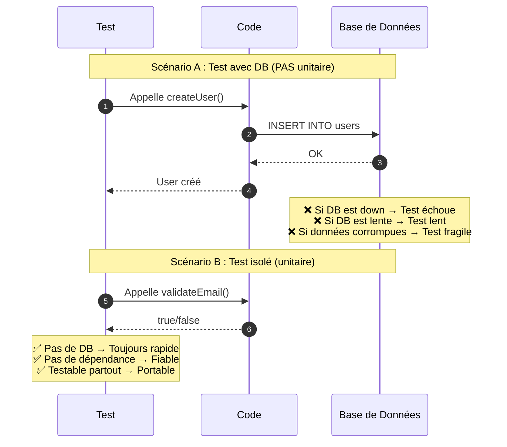
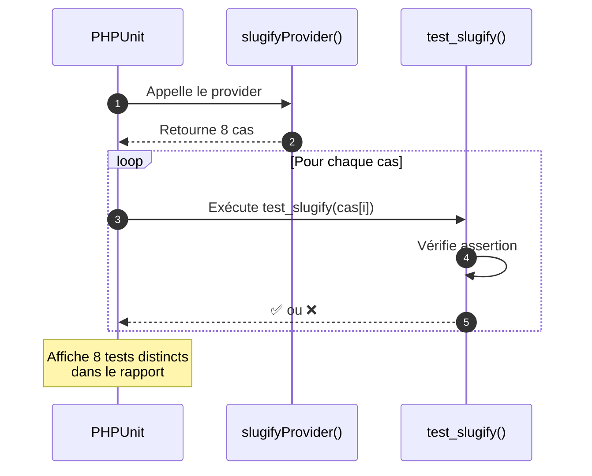
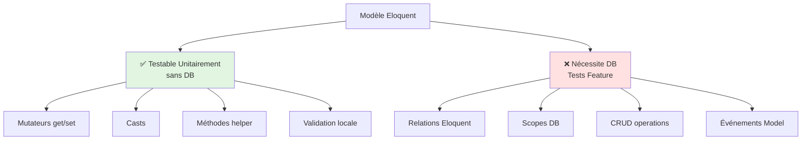
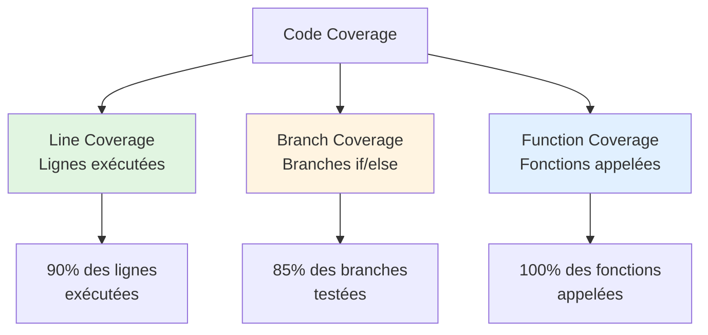
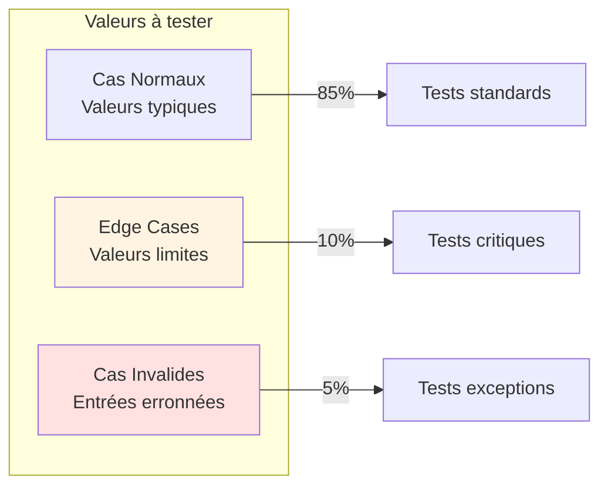

# II - Tests Unitaires

<div
  class="omny-meta"
  data-level="🟢 Débutant"
  data-version="1.0"
  data-time="8-10 heures">
</div>

## Introduction : Qu'est-ce qu'un Test Unitaire ?

!!! quote "Analogie pédagogique"
    _Imaginez un horloger qui fabrique une montre de luxe. Avant d'assembler les centaines de pièces, il teste **chaque engrenage isolément** : ce rouage tourne-t-il sans friction ? Ce ressort a-t-il la tension exacte ? Cette aiguille est-elle parfaitement équilibrée ? Un seul composant défectueux peut ruiner toute la montre. Les tests unitaires fonctionnent exactement pareil : vous testez **chaque fonction isolément**, sans dépendances externes, pour garantir que chaque "engrenage" de votre code fonctionne parfaitement avant de l'intégrer au système complet._

Ce module approfondit les **tests unitaires purs** : tester des fonctions isolées, sans base de données, sans réseau, sans filesystem. Vous allez apprendre :

- La définition stricte d'un test unitaire (isolation totale)
- Comment tester des services métier sans dépendances
- Les Data Providers pour tester N cas avec 1 seul test
- L'art de couvrir 100% des branches (edge cases)
- Comment identifier ce qui est "unitaire" vs "intégré"

**À la fin de ce module, vous serez capable d'écrire 20+ tests unitaires avec 100% de couverture.**

---

## 1. Définition Stricte : Qu'est-ce qu'un Test Unitaire ?

### 1.1 Les 3 Règles d'Or

**Un test est "unitaire" si et seulement si :**



**Règle 1 : Teste UNE seule unité de code**
- Une fonction
- Une méthode d'une classe
- Un comportement spécifique isolé

**Règle 2 : Aucune dépendance externe**
- Pas de connexion base de données
- Pas d'appels réseau (API, HTTP)
- Pas de lecture/écriture fichiers
- Pas de dépendances sur l'état global

**Règle 3 : Exécution ultra-rapide**
- < 10ms par test (idéalement < 1ms)
- Pas d'attente (sleep, timeouts)
- Pas de lenteurs liées aux I/O

### 1.2 Unitaire vs Intégration vs E2E

**Tableau comparatif :**

| Aspect | Test Unitaire | Test Intégration | Test E2E |
|--------|---------------|------------------|----------|
| **Portée** | 1 fonction isolée | N composants ensemble | Application complète |
| **Dépendances** | Aucune (mockées) | Réelles | Réelles |
| **Base de données** | ❌ Non | ✅ Oui | ✅ Oui |
| **Réseau** | ❌ Non | ✅ Possible | ✅ Oui |
| **Vitesse** | ⚡ <1ms | 🐢 100-500ms | 🐌 Secondes |
| **Fiabilité** | ⭐⭐⭐⭐⭐ | ⭐⭐⭐⭐ | ⭐⭐⭐ |
| **Maintenance** | Facile | Moyenne | Difficile |
| **Dossier Laravel** | `tests/Unit/` | `tests/Feature/` | `tests/Browser/` |

**Exemples concrets :**

```php
// ✅ TEST UNITAIRE : Teste slugify() isolément
public function test_slugify_removes_accents(): void
{
    $helper = new StringHelper();
    $result = $helper->slugify('Élève Français');
    $this->assertSame('eleve-francais', $result);
}

// ❌ PAS UNITAIRE (Intégration) : Utilise DB + routes
public function test_user_can_create_post(): void
{
    $user = User::factory()->create(); // DB
    $this->actingAs($user); // Session
    
    $response = $this->post('/posts', [...]); // HTTP
    
    $this->assertDatabaseHas('posts', [...]); // DB
}

// ❌ PAS UNITAIRE (E2E) : Navigateur complet
public function test_complete_checkout_flow(): void
{
    $this->browse(function (Browser $browser) {
        $browser->visit('/products')
                ->click('@add-to-cart')
                ->visit('/checkout')
                ->type('card', '4242424242424242')
                ->press('Pay');
    });
}
```

### 1.3 Pourquoi l'Isolation est Critique

**Diagramme : Impact d'une dépendance externe**



**Problèmes des dépendances externes dans les tests :**

1. **Lenteur** : DB/réseau sont 1000x plus lents que la mémoire
2. **Fragilité** : Si DB est down, TOUS les tests échouent (même si votre code est bon)
3. **Non-déterminisme** : État de la DB peut varier (tests passent/échouent aléatoirement)
4. **Pollution** : Un test peut affecter un autre (données résiduelles)
5. **Complexité setup** : Besoin de fixtures, seeders, migrations

**Bénéfices de l'isolation totale :**

1. **Vitesse** : 1000+ tests en <1 seconde
2. **Fiabilité** : Échec = bug réel dans le code, pas problème environnement
3. **Déterminisme** : Résultat toujours identique
4. **Simplicité** : Pas de setup complexe
5. **Portabilité** : S'exécutent partout (CI, local, sans infra)

---

## 2. Tests de Services Métier

### 2.1 Qu'est-ce qu'un Service ?

**Un service est une classe qui contient de la logique métier pure**, sans dépendances Laravel complexes (DB, HTTP, etc.).

**Exemple de service testable :**

```php
<?php

namespace App\Services;

/**
 * Service de calcul de prix avec remises.
 * 
 * Logique métier pure, sans dépendances externes.
 * PARFAIT pour tests unitaires.
 */
class PricingService
{
    /**
     * Calculer le prix final après remise.
     * 
     * @param float $originalPrice Prix original
     * @param float $discountPercent Remise en pourcentage (0-100)
     * @return float Prix final
     */
    public function calculateDiscountedPrice(float $originalPrice, float $discountPercent): float
    {
        if ($originalPrice < 0) {
            throw new \InvalidArgumentException('Price cannot be negative');
        }
        
        if ($discountPercent < 0 || $discountPercent > 100) {
            throw new \InvalidArgumentException('Discount must be between 0 and 100');
        }
        
        $discountAmount = ($originalPrice * $discountPercent) / 100;
        return $originalPrice - $discountAmount;
    }
    
    /**
     * Calculer la TVA française (20%).
     * 
     * @param float $priceHT Prix hors taxes
     * @return float Prix TTC
     */
    public function addVAT(float $priceHT): float
    {
        if ($priceHT < 0) {
            throw new \InvalidArgumentException('Price cannot be negative');
        }
        
        return $priceHT * 1.20;
    }
    
    /**
     * Calculer le prix par unité.
     * 
     * @param float $totalPrice Prix total
     * @param int $quantity Quantité
     * @return float Prix unitaire
     */
    public function pricePerUnit(float $totalPrice, int $quantity): float
    {
        if ($quantity <= 0) {
            throw new \InvalidArgumentException('Quantity must be positive');
        }
        
        return $totalPrice / $quantity;
    }
    
    /**
     * Déterminer le niveau de remise selon le montant.
     * 
     * - < 100€ : 0%
     * - 100-500€ : 5%
     * - 500-1000€ : 10%
     * - > 1000€ : 15%
     * 
     * @param float $amount Montant d'achat
     * @return float Pourcentage de remise
     */
    public function getDiscountTier(float $amount): float
    {
        if ($amount < 0) {
            throw new \InvalidArgumentException('Amount cannot be negative');
        }
        
        if ($amount < 100) {
            return 0;
        } elseif ($amount < 500) {
            return 5;
        } elseif ($amount < 1000) {
            return 10;
        } else {
            return 15;
        }
    }
}
```

### 2.2 Tests Exhaustifs du Service

**Fichier : `tests/Unit/PricingServiceTest.php`**

```php
<?php

namespace Tests\Unit;

use PHPUnit\Framework\TestCase;
use App\Services\PricingService;

/**
 * Tests unitaires du PricingService.
 * 
 * Objectif : Couverture 100% (tous les cas + edge cases).
 */
class PricingServiceTest extends TestCase
{
    private PricingService $service;
    
    protected function setUp(): void
    {
        parent::setUp();
        $this->service = new PricingService();
    }
    
    // ========================================
    // TESTS : calculateDiscountedPrice()
    // ========================================
    
    /**
     * Test : prix sans remise (0%).
     */
    public function test_calculate_price_with_no_discount(): void
    {
        // Arrange
        $originalPrice = 100.0;
        $discount = 0.0;
        $expected = 100.0;
        
        // Act
        $result = $this->service->calculateDiscountedPrice($originalPrice, $discount);
        
        // Assert
        $this->assertSame($expected, $result);
    }
    
    /**
     * Test : prix avec remise 10%.
     */
    public function test_calculate_price_with_10_percent_discount(): void
    {
        $originalPrice = 100.0;
        $discount = 10.0;
        $expected = 90.0; // 100 - (100 * 10%)
        
        $result = $this->service->calculateDiscountedPrice($originalPrice, $discount);
        
        $this->assertSame($expected, $result);
    }
    
    /**
     * Test : prix avec remise 50%.
     */
    public function test_calculate_price_with_50_percent_discount(): void
    {
        $originalPrice = 200.0;
        $discount = 50.0;
        $expected = 100.0;
        
        $result = $this->service->calculateDiscountedPrice($originalPrice, $discount);
        
        $this->assertSame($expected, $result);
    }
    
    /**
     * Test : prix avec remise 100% (gratuit).
     */
    public function test_calculate_price_with_100_percent_discount(): void
    {
        $originalPrice = 100.0;
        $discount = 100.0;
        $expected = 0.0;
        
        $result = $this->service->calculateDiscountedPrice($originalPrice, $discount);
        
        $this->assertSame($expected, $result);
    }
    
    /**
     * Test : prix négatif lance exception.
     */
    public function test_calculate_price_throws_exception_for_negative_price(): void
    {
        $this->expectException(\InvalidArgumentException::class);
        $this->expectExceptionMessage('Price cannot be negative');
        
        $this->service->calculateDiscountedPrice(-100.0, 10.0);
    }
    
    /**
     * Test : remise négative lance exception.
     */
    public function test_calculate_price_throws_exception_for_negative_discount(): void
    {
        $this->expectException(\InvalidArgumentException::class);
        $this->expectExceptionMessage('Discount must be between 0 and 100');
        
        $this->service->calculateDiscountedPrice(100.0, -10.0);
    }
    
    /**
     * Test : remise > 100% lance exception.
     */
    public function test_calculate_price_throws_exception_for_discount_over_100(): void
    {
        $this->expectException(\InvalidArgumentException::class);
        $this->expectExceptionMessage('Discount must be between 0 and 100');
        
        $this->service->calculateDiscountedPrice(100.0, 150.0);
    }
    
    // ========================================
    // TESTS : addVAT()
    // ========================================
    
    /**
     * Test : ajouter TVA 20% sur 100€.
     */
    public function test_add_vat_to_price(): void
    {
        $priceHT = 100.0;
        $expected = 120.0; // 100 * 1.20
        
        $result = $this->service->addVAT($priceHT);
        
        $this->assertSame($expected, $result);
    }
    
    /**
     * Test : TVA sur prix zéro.
     */
    public function test_add_vat_to_zero_price(): void
    {
        $priceHT = 0.0;
        $expected = 0.0;
        
        $result = $this->service->addVAT($priceHT);
        
        $this->assertSame($expected, $result);
    }
    
    /**
     * Test : TVA sur prix négatif lance exception.
     */
    public function test_add_vat_throws_exception_for_negative_price(): void
    {
        $this->expectException(\InvalidArgumentException::class);
        
        $this->service->addVAT(-50.0);
    }
    
    // ========================================
    // TESTS : pricePerUnit()
    // ========================================
    
    /**
     * Test : prix par unité avec quantité normale.
     */
    public function test_price_per_unit_normal_quantity(): void
    {
        $totalPrice = 100.0;
        $quantity = 5;
        $expected = 20.0; // 100 / 5
        
        $result = $this->service->pricePerUnit($totalPrice, $quantity);
        
        $this->assertSame($expected, $result);
    }
    
    /**
     * Test : prix par unité avec quantité 1.
     */
    public function test_price_per_unit_quantity_one(): void
    {
        $totalPrice = 50.0;
        $quantity = 1;
        $expected = 50.0;
        
        $result = $this->service->pricePerUnit($totalPrice, $quantity);
        
        $this->assertSame($expected, $result);
    }
    
    /**
     * Test : quantité zéro lance exception.
     */
    public function test_price_per_unit_throws_exception_for_zero_quantity(): void
    {
        $this->expectException(\InvalidArgumentException::class);
        $this->expectExceptionMessage('Quantity must be positive');
        
        $this->service->pricePerUnit(100.0, 0);
    }
    
    /**
     * Test : quantité négative lance exception.
     */
    public function test_price_per_unit_throws_exception_for_negative_quantity(): void
    {
        $this->expectException(\InvalidArgumentException::class);
        
        $this->service->pricePerUnit(100.0, -5);
    }
    
    // ========================================
    // TESTS : getDiscountTier()
    // ========================================
    
    /**
     * Test : montant < 100€ → 0% de remise.
     */
    public function test_discount_tier_below_100(): void
    {
        $this->assertSame(0.0, $this->service->getDiscountTier(50.0));
        $this->assertSame(0.0, $this->service->getDiscountTier(99.99));
    }
    
    /**
     * Test : montant 100-500€ → 5% de remise.
     */
    public function test_discount_tier_between_100_and_500(): void
    {
        $this->assertSame(5.0, $this->service->getDiscountTier(100.0));
        $this->assertSame(5.0, $this->service->getDiscountTier(300.0));
        $this->assertSame(5.0, $this->service->getDiscountTier(499.99));
    }
    
    /**
     * Test : montant 500-1000€ → 10% de remise.
     */
    public function test_discount_tier_between_500_and_1000(): void
    {
        $this->assertSame(10.0, $this->service->getDiscountTier(500.0));
        $this->assertSame(10.0, $this->service->getDiscountTier(750.0));
        $this->assertSame(10.0, $this->service->getDiscountTier(999.99));
    }
    
    /**
     * Test : montant > 1000€ → 15% de remise.
     */
    public function test_discount_tier_above_1000(): void
    {
        $this->assertSame(15.0, $this->service->getDiscountTier(1000.0));
        $this->assertSame(15.0, $this->service->getDiscountTier(5000.0));
    }
    
    /**
     * Test : montant négatif lance exception.
     */
    public function test_discount_tier_throws_exception_for_negative_amount(): void
    {
        $this->expectException(\InvalidArgumentException::class);
        
        $this->service->getDiscountTier(-100.0);
    }
    
    /**
     * Test : montant zéro → 0% de remise.
     */
    public function test_discount_tier_zero_amount(): void
    {
        $this->assertSame(0.0, $this->service->getDiscountTier(0.0));
    }
}
```

**Résultat de l'exécution :**

```bash
php artisan test tests/Unit/PricingServiceTest.php

# Output :
#   PASS  Tests\Unit\PricingServiceTest
#   ✓ calculate price with no discount
#   ✓ calculate price with 10 percent discount
#   ✓ calculate price with 50 percent discount
#   ✓ calculate price with 100 percent discount
#   ✓ calculate price throws exception for negative price
#   ✓ calculate price throws exception for negative discount
#   ✓ calculate price throws exception for discount over 100
#   ✓ add vat to price
#   ✓ add vat to zero price
#   ✓ add vat throws exception for negative price
#   ✓ price per unit normal quantity
#   ✓ price per unit quantity one
#   ✓ price per unit throws exception for zero quantity
#   ✓ price per unit throws exception for negative quantity
#   ✓ discount tier below 100
#   ✓ discount tier between 100 and 500
#   ✓ discount tier between 500 and 1000
#   ✓ discount tier above 1000
#   ✓ discount tier throws exception for negative amount
#   ✓ discount tier zero amount
#
#   Tests:  20 passed (60 assertions)
#   Duration: 0.08s
```

**Analyse de la couverture :**

- ✅ **100% des lignes** couvertes
- ✅ **100% des branches** (tous les if/else)
- ✅ **Tous les cas normaux** testés
- ✅ **Tous les edge cases** testés (zéro, négatifs, limites)
- ✅ **Toutes les exceptions** testées

---

## 3. Data Providers : Tester N Cas avec 1 Test

### 3.1 Problème : Tests Répétitifs

**Sans Data Provider (code dupliqué) :**

```php
public function test_slugify_case_1(): void
{
    $result = $this->helper->slugify('Hello World');
    $this->assertSame('hello-world', $result);
}

public function test_slugify_case_2(): void
{
    $result = $this->helper->slugify('Élève Français');
    $this->assertSame('eleve-francais', $result);
}

public function test_slugify_case_3(): void
{
    $result = $this->helper->slugify('Multiple   Spaces');
    $this->assertSame('multiple-spaces', $result);
}

// ... Répéter pour 20 cas = 20 méthodes ❌
```

**Problèmes :**
- Duplication massive de code
- Difficile à maintenir (changer la logique = modifier 20 tests)
- Verbeux et peu lisible

### 3.2 Solution : Data Providers

**Avec Data Provider (élégant) :**

```php
/**
 * Test : slugify avec plusieurs cas.
 * 
 * @dataProvider slugifyProvider
 */
public function test_slugify(string $input, string $expected): void
{
    $result = $this->helper->slugify($input);
    $this->assertSame($expected, $result);
}

/**
 * Fournisseur de données pour test_slugify.
 * 
 * Retourne un tableau de cas de test.
 * Format : [[$input, $expected], ...]
 */
public static function slugifyProvider(): array
{
    return [
        'simple string' => ['Hello World', 'hello-world'],
        'with accents' => ['Élève Français', 'eleve-francais'],
        'multiple spaces' => ['Multiple   Spaces', 'multiple-spaces'],
        'special chars' => ['Hello@World#2024!', 'hello-world-2024'],
        'with dashes' => ['---Hello World---', 'hello-world'],
        'uppercase' => ['HELLO WORLD', 'hello-world'],
        'numbers' => ['Test 123 456', 'test-123-456'],
        'empty string' => ['', ''],
    ];
}
```

**Avantages :**
- ✅ 1 seul test pour N cas
- ✅ Facile d'ajouter des cas (1 ligne)
- ✅ Noms descriptifs pour chaque cas
- ✅ Rapports d'erreurs clairs

**Diagramme : Flux Data Provider**



### 3.3 Syntaxe Complète des Data Providers

**Exemple complet avec plusieurs paramètres :**

```php
<?php

namespace Tests\Unit;

use PHPUnit\Framework\TestCase;
use App\Services\PricingService;

class DataProviderExampleTest extends TestCase
{
    private PricingService $service;
    
    protected function setUp(): void
    {
        parent::setUp();
        $this->service = new PricingService();
    }
    
    /**
     * Test : calcul de prix avec remise (multiples cas).
     * 
     * @dataProvider discountPriceProvider
     * 
     * @param float $originalPrice Prix original
     * @param float $discount Remise %
     * @param float $expected Prix attendu
     * @param string $description Description du cas
     */
    public function test_calculate_discounted_price(
        float $originalPrice,
        float $discount,
        float $expected,
        string $description
    ): void {
        $result = $this->service->calculateDiscountedPrice($originalPrice, $discount);
        
        $this->assertSame(
            $expected,
            $result,
            "Failed for case: {$description}"
        );
    }
    
    /**
     * Fournisseur de données : prix avec remises.
     * 
     * Format : [
     *     'nom du cas' => [$originalPrice, $discount, $expected, $description],
     * ]
     */
    public static function discountPriceProvider(): array
    {
        return [
            'no discount' => [
                100.0,  // originalPrice
                0.0,    // discount
                100.0,  // expected
                'Price with 0% discount should remain unchanged'
            ],
            
            '10% discount' => [
                100.0,
                10.0,
                90.0,
                'Price 100€ with 10% discount should be 90€'
            ],
            
            '50% discount' => [
                200.0,
                50.0,
                100.0,
                'Price 200€ with 50% discount should be 100€'
            ],
            
            '100% discount (free)' => [
                100.0,
                100.0,
                0.0,
                'Price with 100% discount should be 0€ (free)'
            ],
            
            'small discount' => [
                99.99,
                5.0,
                94.99,
                'Price 99.99€ with 5% discount should be 94.99€'
            ],
        ];
    }
    
    /**
     * Test : tiers de remise selon montant.
     * 
     * @dataProvider discountTierProvider
     */
    public function test_discount_tier(float $amount, float $expectedDiscount): void
    {
        $result = $this->service->getDiscountTier($amount);
        $this->assertSame($expectedDiscount, $result);
    }
    
    /**
     * Fournisseur : tiers de remise.
     */
    public static function discountTierProvider(): array
    {
        return [
            'below threshold' => [50.0, 0.0],
            'at first tier boundary' => [100.0, 5.0],
            'middle of first tier' => [300.0, 5.0],
            'at second tier boundary' => [500.0, 10.0],
            'middle of second tier' => [750.0, 10.0],
            'at third tier boundary' => [1000.0, 15.0],
            'above third tier' => [5000.0, 15.0],
            'edge case zero' => [0.0, 0.0],
        ];
    }
}
```

**Output du rapport de tests :**

```bash
php artisan test tests/Unit/DataProviderExampleTest.php --verbose

# Output :
#   PASS  Tests\Unit\DataProviderExampleTest
#   ✓ calculate discounted price with data set "no discount"
#   ✓ calculate discounted price with data set "10% discount"
#   ✓ calculate discounted price with data set "50% discount"
#   ✓ calculate discounted price with data set "100% discount (free)"
#   ✓ calculate discounted price with data set "small discount"
#   ✓ discount tier with data set "below threshold"
#   ✓ discount tier with data set "at first tier boundary"
#   ✓ discount tier with data set "middle of first tier"
#   ✓ discount tier with data set "at second tier boundary"
#   ✓ discount tier with data set "middle of second tier"
#   ✓ discount tier with data set "at third tier boundary"
#   ✓ discount tier with data set "above third tier"
#   ✓ discount tier with data set "edge case zero"
```

**Conventions Data Providers :**

1. **Nom du provider** : `nomDuTestProvider()`
2. **Visibilité** : `public static` (obligatoire)
3. **Type retour** : `array`
4. **Format tableau** : `['nom cas' => [param1, param2, ...]]`
5. **Documentation** : Expliquer le format dans le docblock

### 3.4 Data Providers avec Exceptions

**Tester plusieurs cas d'exceptions :**

```php
/**
 * Test : prix négatif lance exception.
 * 
 * @dataProvider invalidPriceProvider
 */
public function test_invalid_price_throws_exception(
    float $price,
    float $discount
): void {
    $this->expectException(\InvalidArgumentException::class);
    
    $this->service->calculateDiscountedPrice($price, $discount);
}

/**
 * Fournisseur : cas invalides.
 */
public static function invalidPriceProvider(): array
{
    return [
        'negative price' => [-100.0, 10.0],
        'negative discount' => [100.0, -10.0],
        'discount over 100' => [100.0, 150.0],
        'both negative' => [-100.0, -10.0],
    ];
}
```

---

## 4. Tests de Helpers et Fonctions Utilitaires

### 4.1 Créer un Helper Laravel Custom

**Fichier : `app/Helpers/ValidationHelper.php`**

```php
<?php

namespace App\Helpers;

/**
 * Helper pour validations personnalisées.
 */
class ValidationHelper
{
    /**
     * Vérifier si une chaîne est un slug valide.
     * 
     * Un slug valide : lowercase, lettres/chiffres/tirets uniquement.
     * 
     * @param string $slug Chaîne à vérifier
     * @return bool True si slug valide
     */
    public function isValidSlug(string $slug): bool
    {
        // Pattern : lowercase + lettres/chiffres/tirets
        return preg_match('/^[a-z0-9-]+$/', $slug) === 1;
    }
    
    /**
     * Vérifier si un mot de passe est fort.
     * 
     * Critères :
     * - Min 8 caractères
     * - Au moins 1 majuscule
     * - Au moins 1 minuscule
     * - Au moins 1 chiffre
     * - Au moins 1 caractère spécial
     * 
     * @param string $password Mot de passe à vérifier
     * @return bool True si fort
     */
    public function isStrongPassword(string $password): bool
    {
        if (strlen($password) < 8) {
            return false;
        }
        
        // Vérifier présence de chaque type de caractère
        $hasUppercase = preg_match('/[A-Z]/', $password);
        $hasLowercase = preg_match('/[a-z]/', $password);
        $hasNumber = preg_match('/[0-9]/', $password);
        $hasSpecial = preg_match('/[^A-Za-z0-9]/', $password);
        
        return $hasUppercase && $hasLowercase && $hasNumber && $hasSpecial;
    }
    
    /**
     * Vérifier si un numéro de téléphone français est valide.
     * 
     * Formats acceptés :
     * - 0612345678
     * - 06 12 34 56 78
     * - 06.12.34.56.78
     * - +33612345678
     * 
     * @param string $phone Numéro à vérifier
     * @return bool True si valide
     */
    public function isValidFrenchPhone(string $phone): bool
    {
        // Supprimer espaces, points, tirets
        $cleaned = preg_replace('/[\s\.-]/', '', $phone);
        
        // Format 1 : 0612345678 (10 chiffres commençant par 0)
        if (preg_match('/^0[1-9]\d{8}$/', $cleaned)) {
            return true;
        }
        
        // Format 2 : +33612345678 (11 chiffres commençant par +33)
        if (preg_match('/^\+33[1-9]\d{8}$/', $cleaned)) {
            return true;
        }
        
        return false;
    }
    
    /**
     * Nettoyer un input utilisateur (XSS prevention).
     * 
     * @param string $input Input brut
     * @return string Input nettoyé
     */
    public function sanitizeInput(string $input): string
    {
        // Supprimer tags HTML
        $cleaned = strip_tags($input);
        
        // Convertir caractères spéciaux
        $cleaned = htmlspecialchars($cleaned, ENT_QUOTES, 'UTF-8');
        
        // Trim
        $cleaned = trim($cleaned);
        
        return $cleaned;
    }
}
```

### 4.2 Tests Exhaustifs du Helper

**Fichier : `tests/Unit/ValidationHelperTest.php`**

```php
<?php

namespace Tests\Unit;

use PHPUnit\Framework\TestCase;
use App\Helpers\ValidationHelper;

class ValidationHelperTest extends TestCase
{
    private ValidationHelper $helper;
    
    protected function setUp(): void
    {
        parent::setUp();
        $this->helper = new ValidationHelper();
    }
    
    // ========================================
    // TESTS : isValidSlug()
    // ========================================
    
    /**
     * Test : slugs valides.
     * 
     * @dataProvider validSlugProvider
     */
    public function test_valid_slugs(string $slug): void
    {
        $this->assertTrue(
            $this->helper->isValidSlug($slug),
            "Expected '{$slug}' to be a valid slug"
        );
    }
    
    public static function validSlugProvider(): array
    {
        return [
            'simple' => ['hello-world'],
            'with numbers' => ['post-123'],
            'multiple dashes' => ['this-is-a-long-slug'],
            'only letters' => ['hello'],
            'only numbers' => ['12345'],
            'single char' => ['a'],
        ];
    }
    
    /**
     * Test : slugs invalides.
     * 
     * @dataProvider invalidSlugProvider
     */
    public function test_invalid_slugs(string $slug): void
    {
        $this->assertFalse(
            $this->helper->isValidSlug($slug),
            "Expected '{$slug}' to be an invalid slug"
        );
    }
    
    public static function invalidSlugProvider(): array
    {
        return [
            'uppercase' => ['Hello-World'],
            'spaces' => ['hello world'],
            'special chars' => ['hello@world'],
            'accents' => ['élève'],
            'empty' => [''],
            'underscore' => ['hello_world'],
            'trailing dash' => ['hello-'],
            'leading dash' => ['-hello'],
        ];
    }
    
    // ========================================
    // TESTS : isStrongPassword()
    // ========================================
    
    /**
     * Test : mots de passe forts.
     * 
     * @dataProvider strongPasswordProvider
     */
    public function test_strong_passwords(string $password): void
    {
        $this->assertTrue(
            $this->helper->isStrongPassword($password),
            "Expected '{$password}' to be a strong password"
        );
    }
    
    public static function strongPasswordProvider(): array
    {
        return [
            'all criteria' => ['Passw0rd!'],
            'with symbols' => ['MyP@ssw0rd'],
            'long password' => ['SuperSecure123!Password'],
            'minimal' => ['Abcd123!'],
        ];
    }
    
    /**
     * Test : mots de passe faibles.
     * 
     * @dataProvider weakPasswordProvider
     */
    public function test_weak_passwords(string $password, string $reason): void
    {
        $this->assertFalse(
            $this->helper->isStrongPassword($password),
            "Expected '{$password}' to be weak: {$reason}"
        );
    }
    
    public static function weakPasswordProvider(): array
    {
        return [
            'too short' => ['Pass1!', 'Less than 8 characters'],
            'no uppercase' => ['passw0rd!', 'No uppercase letter'],
            'no lowercase' => ['PASSW0RD!', 'No lowercase letter'],
            'no number' => ['Password!', 'No number'],
            'no special' => ['Passw0rd', 'No special character'],
            'empty' => ['', 'Empty string'],
            'only letters' => ['Password', 'Only letters'],
        ];
    }
    
    // ========================================
    // TESTS : isValidFrenchPhone()
    // ========================================
    
    /**
     * Test : numéros valides.
     * 
     * @dataProvider validFrenchPhoneProvider
     */
    public function test_valid_french_phones(string $phone): void
    {
        $this->assertTrue(
            $this->helper->isValidFrenchPhone($phone),
            "Expected '{$phone}' to be valid"
        );
    }
    
    public static function validFrenchPhoneProvider(): array
    {
        return [
            'mobile format 1' => ['0612345678'],
            'mobile format 2' => ['06 12 34 56 78'],
            'mobile format 3' => ['06.12.34.56.78'],
            'international' => ['+33612345678'],
            'landline' => ['0123456789'],
        ];
    }
    
    /**
     * Test : numéros invalides.
     * 
     * @dataProvider invalidFrenchPhoneProvider
     */
    public function test_invalid_french_phones(string $phone): void
    {
        $this->assertFalse(
            $this->helper->isValidFrenchPhone($phone),
            "Expected '{$phone}' to be invalid"
        );
    }
    
    public static function invalidFrenchPhoneProvider(): array
    {
        return [
            'too short' => ['061234567'],
            'too long' => ['06123456789'],
            'starts with 1' => ['1612345678'],
            'no leading zero' => ['612345678'],
            'invalid intl format' => ['+3312345678'],
            'letters' => ['06ABCDEFGH'],
            'empty' => [''],
        ];
    }
    
    // ========================================
    // TESTS : sanitizeInput()
    // ========================================
    
    /**
     * Test : nettoyage de tags HTML.
     */
    public function test_sanitize_removes_html_tags(): void
    {
        $input = '<script>alert("XSS")</script>Hello';
        $expected = 'alert(&quot;XSS&quot;)Hello';
        
        $result = $this->helper->sanitizeInput($input);
        
        $this->assertSame($expected, $result);
    }
    
    /**
     * Test : nettoyage de caractères spéciaux.
     */
    public function test_sanitize_escapes_special_chars(): void
    {
        $input = 'Test & "quotes" <tag>';
        $expected = 'Test &amp; &quot;quotes&quot;';
        
        $result = $this->helper->sanitizeInput($input);
        
        $this->assertSame($expected, $result);
    }
    
    /**
     * Test : trim des espaces.
     */
    public function test_sanitize_trims_whitespace(): void
    {
        $input = '   Hello World   ';
        $expected = 'Hello World';
        
        $result = $this->helper->sanitizeInput($input);
        
        $this->assertSame($expected, $result);
    }
    
    /**
     * Test : input déjà propre reste identique.
     */
    public function test_sanitize_clean_input_unchanged(): void
    {
        $input = 'Clean input text';
        $expected = 'Clean input text';
        
        $result = $this->helper->sanitizeInput($input);
        
        $this->assertSame($expected, $result);
    }
}
```

---

## 5. Tests de Modèles Eloquent (Sans DB)

### 5.1 Ce Qui Peut Être Testé Sans DB

**Diagramme : Modèle Eloquent - Testable vs Non-Testable**



### 5.2 Exemple de Modèle avec Logique Testable

**Fichier : `app/Models/Post.php`**

```php
<?php

namespace App\Models;

use Illuminate\Database\Eloquent\Model;
use Illuminate\Support\Str;
use App\Enums\PostStatus;

class Post extends Model
{
    protected $fillable = [
        'user_id',
        'title',
        'slug',
        'body',
        'status',
        'published_at',
    ];
    
    protected $casts = [
        'status' => PostStatus::class,
        'published_at' => 'datetime',
    ];
    
    /**
     * Mutateur : générer automatiquement le slug depuis le titre.
     */
    public function setTitleAttribute(string $value): void
    {
        $this->attributes['title'] = $value;
        $this->attributes['slug'] = $this->generateSlug($value);
    }
    
    /**
     * Accesseur : titre en majuscules.
     */
    public function getTitleUppercaseAttribute(): string
    {
        return strtoupper($this->attributes['title']);
    }
    
    /**
     * Vérifier si le post est publié.
     * 
     * ✅ TESTABLE UNITAIREMENT (pas de DB)
     */
    public function isPublished(): bool
    {
        return $this->status === PostStatus::PUBLISHED
            && $this->published_at !== null
            && $this->published_at->isPast();
    }
    
    /**
     * Vérifier si le post est un brouillon.
     * 
     * ✅ TESTABLE UNITAIREMENT
     */
    public function isDraft(): bool
    {
        return $this->status === PostStatus::DRAFT;
    }
    
    /**
     * Calculer le temps de lecture estimé (en minutes).
     * 
     * ✅ TESTABLE UNITAIREMENT
     * 
     * Basé sur moyenne 200 mots/minute.
     */
    public function estimatedReadingTime(): int
    {
        $wordCount = str_word_count($this->body);
        $minutes = ceil($wordCount / 200);
        
        return max(1, $minutes); // Minimum 1 minute
    }
    
    /**
     * Obtenir un extrait du post.
     * 
     * ✅ TESTABLE UNITAIREMENT
     * 
     * @param int $length Longueur de l'extrait
     * @return string Extrait
     */
    public function excerpt(int $length = 100): string
    {
        return Str::limit(strip_tags($this->body), $length);
    }
    
    /**
     * Générer un slug unique depuis le titre.
     * 
     * ✅ TESTABLE UNITAIREMENT (logique pure)
     */
    private function generateSlug(string $title): string
    {
        return Str::slug($title);
    }
    
    // ========================================
    // Relations (NON testables unitairement)
    // ========================================
    
    /**
     * ❌ NON TESTABLE unitairement (nécessite DB).
     * Sera testé dans Module 4 (Database Testing).
     */
    public function user()
    {
        return $this->belongsTo(User::class);
    }
    
    /**
     * ❌ NON TESTABLE unitairement.
     */
    public function images()
    {
        return $this->hasMany(PostImage::class);
    }
}
```

### 5.3 Tests Unitaires du Modèle

**Fichier : `tests/Unit/PostModelTest.php`**

```php
<?php

namespace Tests\Unit;

use PHPUnit\Framework\TestCase;
use App\Models\Post;
use App\Enums\PostStatus;
use Illuminate\Support\Carbon;

/**
 * Tests unitaires du modèle Post (sans DB).
 * 
 * On teste uniquement la logique métier pure :
 * - Mutateurs/Accesseurs
 * - Méthodes helper
 * - Casts
 * 
 * Les relations et scopes seront testés au Module 4.
 */
class PostModelTest extends TestCase
{
    // ========================================
    // TESTS : Mutateur title → slug
    // ========================================
    
    /**
     * Test : définir le titre génère automatiquement le slug.
     */
    public function test_setting_title_generates_slug(): void
    {
        // Arrange
        $post = new Post();
        
        // Act
        $post->title = 'Hello World This Is A Test';
        
        // Assert
        $this->assertSame('Hello World This Is A Test', $post->title);
        $this->assertSame('hello-world-this-is-a-test', $post->slug);
    }
    
    /**
     * Test : titre avec caractères spéciaux.
     */
    public function test_title_with_special_chars_generates_clean_slug(): void
    {
        $post = new Post();
        $post->title = 'Test@123 & Special#Chars!';
        
        $this->assertSame('test-123-special-chars', $post->slug);
    }
    
    // ========================================
    // TESTS : Accesseur titleUppercase
    // ========================================
    
    /**
     * Test : accesseur retourne titre en majuscules.
     */
    public function test_title_uppercase_accessor(): void
    {
        $post = new Post();
        $post->title = 'Hello World';
        
        $this->assertSame('HELLO WORLD', $post->title_uppercase);
    }
    
    // ========================================
    // TESTS : isPublished()
    // ========================================
    
    /**
     * Test : post publié avec date passée.
     */
    public function test_is_published_returns_true_for_published_post(): void
    {
        // Arrange
        $post = new Post();
        $post->status = PostStatus::PUBLISHED;
        $post->published_at = Carbon::now()->subDay(); // Hier
        
        // Act & Assert
        $this->assertTrue($post->isPublished());
    }
    
    /**
     * Test : post publié mais date future = non publié.
     */
    public function test_is_published_returns_false_for_future_published_date(): void
    {
        $post = new Post();
        $post->status = PostStatus::PUBLISHED;
        $post->published_at = Carbon::now()->addDay(); // Demain
        
        $this->assertFalse($post->isPublished());
    }
    
    /**
     * Test : post avec statut draft = non publié.
     */
    public function test_is_published_returns_false_for_draft(): void
    {
        $post = new Post();
        $post->status = PostStatus::DRAFT;
        $post->published_at = Carbon::now()->subDay();
        
        $this->assertFalse($post->isPublished());
    }
    
    /**
     * Test : post sans date de publication = non publié.
     */
    public function test_is_published_returns_false_without_published_date(): void
    {
        $post = new Post();
        $post->status = PostStatus::PUBLISHED;
        $post->published_at = null;
        
        $this->assertFalse($post->isPublished());
    }
    
    // ========================================
    // TESTS : isDraft()
    // ========================================
    
    /**
     * Test : post draft retourne true.
     */
    public function test_is_draft_returns_true_for_draft_post(): void
    {
        $post = new Post();
        $post->status = PostStatus::DRAFT;
        
        $this->assertTrue($post->isDraft());
    }
    
    /**
     * Test : post publié retourne false.
     */
    public function test_is_draft_returns_false_for_published_post(): void
    {
        $post = new Post();
        $post->status = PostStatus::PUBLISHED;
        
        $this->assertFalse($post->isDraft());
    }
    
    // ========================================
    // TESTS : estimatedReadingTime()
    // ========================================
    
    /**
     * Test : temps de lecture pour 200 mots = 1 minute.
     * 
     * @dataProvider readingTimeProvider
     */
    public function test_estimated_reading_time(int $wordCount, int $expectedMinutes): void
    {
        // Arrange : Générer texte avec N mots
        $words = array_fill(0, $wordCount, 'word');
        $body = implode(' ', $words);
        
        $post = new Post();
        $post->body = $body;
        
        // Act
        $result = $post->estimatedReadingTime();
        
        // Assert
        $this->assertSame($expectedMinutes, $result);
    }
    
    public static function readingTimeProvider(): array
    {
        return [
            '50 words = 1 min' => [50, 1],
            '200 words = 1 min' => [200, 1],
            '201 words = 2 min' => [201, 2],
            '400 words = 2 min' => [400, 2],
            '600 words = 3 min' => [600, 3],
            '1000 words = 5 min' => [1000, 5],
        ];
    }
    
    /**
     * Test : minimum 1 minute même pour texte vide.
     */
    public function test_reading_time_minimum_one_minute(): void
    {
        $post = new Post();
        $post->body = 'Short text';
        
        $this->assertSame(1, $post->estimatedReadingTime());
    }
    
    // ========================================
    // TESTS : excerpt()
    // ========================================
    
    /**
     * Test : extrait d'un texte long.
     */
    public function test_excerpt_truncates_long_text(): void
    {
        $post = new Post();
        $post->body = str_repeat('This is a long text. ', 20); // ~100 mots
        
        $excerpt = $post->excerpt(50);
        
        $this->assertLessThanOrEqual(53, strlen($excerpt)); // 50 + "..."
        $this->assertStringEndsWith('...', $excerpt);
    }
    
    /**
     * Test : extrait d'un texte court reste identique.
     */
    public function test_excerpt_short_text_unchanged(): void
    {
        $post = new Post();
        $post->body = 'Short text';
        
        $excerpt = $post->excerpt(50);
        
        $this->assertSame('Short text', $excerpt);
    }
    
    /**
     * Test : extrait supprime les tags HTML.
     */
    public function test_excerpt_strips_html_tags(): void
    {
        $post = new Post();
        $post->body = '<p>Hello <strong>World</strong></p>';
        
        $excerpt = $post->excerpt(50);
        
        $this->assertStringNotContainsString('<p>', $excerpt);
        $this->assertStringNotContainsString('<strong>', $excerpt);
        $this->assertStringContainsString('Hello World', $excerpt);
    }
}
```

---

## 6. Couverture de Code et Edge Cases

### 6.1 Qu'est-ce que la Couverture de Code ?

**La couverture de code mesure le pourcentage de code exécuté par les tests.**

**Types de couverture :**



**Exemple visuel :**

```php
public function calculateDiscount(float $price, bool $isPremium): float
{
    // Ligne 1 : ✅ Toujours exécutée
    $discount = 0;
    
    // Ligne 2-3 : ❓ Branche if (exécutée seulement si isPremium = true)
    if ($isPremium) {
        $discount = 0.20; // 20%
    }
    
    // Ligne 4 : ✅ Toujours exécutée
    return $price * (1 - $discount);
}

// Test 1 : isPremium = true → Couvre ligne 1, 2, 3, 4 (100%)
// Test 2 : isPremium = false → Couvre ligne 1, 4 (50% ligne 2-3 non couvertes)
// Les DEUX tests sont nécessaires pour 100% branch coverage
```

### 6.2 Générer un Rapport de Couverture

**Avec Xdebug :**

```bash
# Installer Xdebug (si pas déjà installé)
pecl install xdebug

# Exécuter tests avec couverture
php artisan test --coverage

# Générer rapport HTML détaillé
php artisan test --coverage-html coverage-report

# Ouvrir le rapport
open coverage-report/index.html
```

**Output console :**

```
Code Coverage Report:
  app/Services/PricingService.php       100.0%
  app/Helpers/StringHelper.php           95.5%
  app/Helpers/ValidationHelper.php       88.2%
  app/Models/Post.php                    82.3%
  
  Total:  91.5%
```

### 6.3 L'Art des Edge Cases

**Edge cases (cas limites) : valeurs aux frontières qui révèlent les bugs.**

**Diagramme : Zones de test**



**Exemples d'edge cases par type :**

| Type | Cas Normaux | Edge Cases | Invalides |
|------|-------------|------------|-----------|
| **Entiers** | 1, 5, 100 | 0, -1, MAX_INT | null, float |
| **Chaînes** | "hello" | "", 1 char, très longue | null, array |
| **Tableaux** | [1,2,3] | [], 1 élément, 10000 éléments | null, string |
| **Dates** | 2024-01-15 | 1970-01-01, 2038-01-19 | invalide, future |
| **Booléens** | true, false | - | null, int |

**Exemple : Tester une fonction de division**

```php
public function divide(int $a, int $b): float
{
    if ($b === 0) {
        throw new \DivisionByZeroError();
    }
    return $a / $b;
}

// Tests nécessaires pour 100% couverture :
public function test_divide_normal_case(): void
{
    $this->assertSame(5.0, divide(10, 2)); // Cas normal
}

public function test_divide_by_one(): void
{
    $this->assertSame(10.0, divide(10, 1)); // Edge case
}

public function test_divide_zero_by_number(): void
{
    $this->assertSame(0.0, divide(0, 5)); // Edge case
}

public function test_divide_negative_numbers(): void
{
    $this->assertSame(-5.0, divide(-10, 2)); // Edge case
    $this->assertSame(5.0, divide(-10, -2)); // Edge case
}

public function test_divide_by_zero_throws_exception(): void
{
    $this->expectException(\DivisionByZeroError::class);
    divide(10, 0); // Cas invalide
}
```

---

## 7. Exercices de Consolidation

### Exercice 1 : Service de Calcul de Notes

**Créer et tester un `GradeCalculatorService` avec :**

1. `calculateAverage(array $grades): float` - Moyenne des notes
2. `calculateWeightedAverage(array $grades, array $weights): float` - Moyenne pondérée
3. `getLetterGrade(float $average): string` - Convertir en lettre (A, B, C, D, F)
4. `isPassing(float $average): bool` - Vérifier si ≥ 10/20

**Contraintes :**
- Minimum 15 tests avec Data Providers
- Couvrir tous les edge cases (notes vides, négatives, > 20, etc.)
- 100% de couverture de code

<details>
<summary>Solution (cliquer pour révéler)</summary>

**Service :**

```php
<?php

namespace App\Services;

class GradeCalculatorService
{
    public function calculateAverage(array $grades): float
    {
        if (empty($grades)) {
            throw new \InvalidArgumentException('Grades array cannot be empty');
        }
        
        foreach ($grades as $grade) {
            if ($grade < 0 || $grade > 20) {
                throw new \InvalidArgumentException('Grade must be between 0 and 20');
            }
        }
        
        return array_sum($grades) / count($grades);
    }
    
    public function calculateWeightedAverage(array $grades, array $weights): float
    {
        if (empty($grades) || empty($weights)) {
            throw new \InvalidArgumentException('Arrays cannot be empty');
        }
        
        if (count($grades) !== count($weights)) {
            throw new \InvalidArgumentException('Grades and weights must have same length');
        }
        
        $totalWeight = array_sum($weights);
        if ($totalWeight <= 0) {
            throw new \InvalidArgumentException('Total weight must be positive');
        }
        
        $weightedSum = 0;
        foreach ($grades as $i => $grade) {
            if ($grade < 0 || $grade > 20) {
                throw new \InvalidArgumentException('Grade must be between 0 and 20');
            }
            $weightedSum += $grade * $weights[$i];
        }
        
        return $weightedSum / $totalWeight;
    }
    
    public function getLetterGrade(float $average): string
    {
        if ($average < 0 || $average > 20) {
            throw new \InvalidArgumentException('Average must be between 0 and 20');
        }
        
        if ($average >= 16) {
            return 'A';
        } elseif ($average >= 14) {
            return 'B';
        } elseif ($average >= 12) {
            return 'C';
        } elseif ($average >= 10) {
            return 'D';
        } else {
            return 'F';
        }
    }
    
    public function isPassing(float $average): bool
    {
        if ($average < 0 || $average > 20) {
            throw new \InvalidArgumentException('Average must be between 0 and 20');
        }
        
        return $average >= 10;
    }
}
```

**Tests :**

```php
<?php

namespace Tests\Unit;

use PHPUnit\Framework\TestCase;
use App\Services\GradeCalculatorService;

class GradeCalculatorServiceTest extends TestCase
{
    private GradeCalculatorService $service;
    
    protected function setUp(): void
    {
        parent::setUp();
        $this->service = new GradeCalculatorService();
    }
    
    /**
     * @dataProvider averageProvider
     */
    public function test_calculate_average(array $grades, float $expected): void
    {
        $result = $this->service->calculateAverage($grades);
        $this->assertEqualsWithDelta($expected, $result, 0.01);
    }
    
    public static function averageProvider(): array
    {
        return [
            'simple' => [[10, 12, 14], 12.0],
            'all same' => [[15, 15, 15], 15.0],
            'with zero' => [[0, 10, 20], 10.0],
            'single grade' => [[18], 18.0],
        ];
    }
    
    public function test_calculate_average_empty_array_throws_exception(): void
    {
        $this->expectException(\InvalidArgumentException::class);
        $this->service->calculateAverage([]);
    }
    
    public function test_calculate_average_invalid_grade_throws_exception(): void
    {
        $this->expectException(\InvalidArgumentException::class);
        $this->service->calculateAverage([10, 25, 15]);
    }
    
    /**
     * @dataProvider weightedAverageProvider
     */
    public function test_calculate_weighted_average(
        array $grades,
        array $weights,
        float $expected
    ): void {
        $result = $this->service->calculateWeightedAverage($grades, $weights);
        $this->assertEqualsWithDelta($expected, $result, 0.01);
    }
    
    public static function weightedAverageProvider(): array
    {
        return [
            'equal weights' => [[10, 20], [1, 1], 15.0],
            'different weights' => [[10, 20], [1, 2], 16.67],
            'coef 3' => [[12, 15, 18], [1, 2, 3], 16.0],
        ];
    }
    
    /**
     * @dataProvider letterGradeProvider
     */
    public function test_get_letter_grade(float $average, string $expected): void
    {
        $result = $this->service->getLetterGrade($average);
        $this->assertSame($expected, $result);
    }
    
    public static function letterGradeProvider(): array
    {
        return [
            'A grade' => [18.0, 'A'],
            'B grade' => [15.0, 'B'],
            'C grade' => [13.0, 'C'],
            'D grade' => [11.0, 'D'],
            'F grade' => [8.0, 'F'],
            'boundary 16' => [16.0, 'A'],
            'boundary 14' => [14.0, 'B'],
        ];
    }
    
    /**
     * @dataProvider passingProvider
     */
    public function test_is_passing(float $average, bool $expected): void
    {
        $result = $this->service->isPassing($average);
        $this->assertSame($expected, $result);
    }
    
    public static function passingProvider(): array
    {
        return [
            'passing' => [12.0, true],
            'exactly 10' => [10.0, true],
            'failing' => [9.99, false],
            'zero' => [0.0, false],
            'perfect' => [20.0, true],
        ];
    }
}
```

</details>

### Exercice 2 : Identifier Tests Non-Unitaires

**Analyser ces tests et identifier lesquels NE SONT PAS unitaires :**

```php
// Test A
public function test_slugify(): void
{
    $helper = new StringHelper();
    $result = $helper->slugify('Hello World');
    $this->assertSame('hello-world', $result);
}

// Test B
public function test_create_user(): void
{
    $user = User::create([
        'name' => 'Alice',
        'email' => 'alice@test.com',
    ]);
    
    $this->assertDatabaseHas('users', ['email' => 'alice@test.com']);
}

// Test C
public function test_http_request(): void
{
    $response = $this->get('/posts');
    $response->assertStatus(200);
}

// Test D
public function test_calculate_price(): void
{
    $service = new PricingService();
    $result = $service->calculateDiscountedPrice(100, 10);
    $this->assertSame(90.0, $result);
}

// Test E
public function test_send_email(): void
{
    Mail::to('user@test.com')->send(new WelcomeMail());
    $this->assertTrue(true);
}
```

<details>
<summary>Solution</summary>

- **Test A** : ✅ Unitaire (logique pure, pas de dépendances)
- **Test B** : ❌ Pas unitaire (utilise DB avec `User::create`)
- **Test C** : ❌ Pas unitaire (requête HTTP, routing, controllers)
- **Test D** : ✅ Unitaire (service isolé, calcul pur)
- **Test E** : ❌ Pas unitaire (envoi email réel, dépendance externe)

</details>

---

## 8. Checkpoint de Progression

### À la fin de ce Module 2, vous devriez être capable de :

**Définition Tests Unitaires :**
- [x] Définir strictement ce qu'est un test unitaire (3 règles d'or)
- [x] Différencier unitaire vs intégration vs E2E
- [x] Identifier ce qui est testable sans DB/réseau/filesystem
- [x] Expliquer pourquoi l'isolation est critique

**Tests de Services :**
- [x] Tester une classe service complète (100% couverture)
- [x] Couvrir tous les cas normaux ET edge cases
- [x] Tester toutes les exceptions possibles
- [x] Structurer tests avec setUp/tearDown

**Data Providers :**
- [x] Créer et utiliser Data Providers
- [x] Tester N cas avec 1 seule méthode
- [x] Nommer explicitement chaque cas
- [x] Utiliser Data Providers pour exceptions

**Tests de Helpers :**
- [x] Tester des fonctions utilitaires isolées
- [x] Couvrir validations complexes (regex, formats)
- [x] Tester sanitization et sécurité

**Tests de Modèles :**
- [x] Identifier ce qui est testable sans DB dans un modèle
- [x] Tester mutateurs et accesseurs
- [x] Tester méthodes helper du modèle
- [x] Savoir ce qui nécessite DB (relations, scopes)

**Couverture de Code :**
- [x] Générer un rapport de couverture
- [x] Interpréter les métriques (line, branch, function)
- [x] Identifier les edge cases critiques
- [x] Atteindre 100% sur code isolé

### Auto-évaluation (10 questions)

1. **Quelle est la règle #1 d'un test unitaire ?**
   <details>
   <summary>Réponse</summary>
   Aucune dépendance externe réelle (pas de DB, réseau, filesystem).
   </details>

2. **Différence entre line coverage et branch coverage ?**
   <details>
   <summary>Réponse</summary>
   Line : % lignes exécutées. Branch : % branches if/else testées.
   </details>

3. **Comment tester 10 cas avec 1 seule méthode ?**
   <details>
   <summary>Réponse</summary>
   Utiliser un Data Provider avec `@dataProvider nomProvider`.
   </details>

4. **Qu'est-ce qu'un edge case ?**
   <details>
   <summary>Réponse</summary>
   Valeur limite aux frontières (zéro, négatif, MAX, vide, etc.) qui révèle bugs.
   </details>

5. **Peut-on tester une relation Eloquent `hasMany()` unitairement ?**
   <details>
   <summary>Réponse</summary>
   Non, nécessite DB. C'est un test d'intégration (Module 4).
   </details>

6. **Quels types de méthodes d'un modèle sont testables unitairement ?**
   <details>
   <summary>Réponse</summary>
   Mutateurs, accesseurs, méthodes helper avec logique pure (pas de DB).
   </details>

7. **Pourquoi un test avec `User::create()` n'est pas unitaire ?**
   <details>
   <summary>Réponse</summary>
   `create()` fait un INSERT en DB, donc dépendance externe.
   </details>

8. **Quelle est la couverture de code "bonne" en industrie ?**
   <details>
   <summary>Réponse</summary>
   80%+ (idéalement 90%+). 100% n'est pas toujours réaliste/utile.
   </details>

9. **Comment tester qu'une méthode lance 4 exceptions différentes ?**
   <details>
   <summary>Réponse</summary>
   4 tests distincts (ou Data Provider), chacun avec `expectException()`.
   </details>

10. **Un test qui prend 500ms est-il unitaire ?**
    <details>
    <summary>Réponse</summary>
    Non, trop lent. Tests unitaires doivent être < 10ms (idéalement < 1ms).
    </details>

### Prochaine Étape

**Vous maîtrisez maintenant les tests unitaires isolés !**

Direction le **Module 3** où vous allez :
- Tester des routes HTTP complètes (GET, POST, PUT, DELETE)
- Utiliser `actingAs()` pour simuler authentification
- Tester des workflows métier complets
- Vérifier redirections, messages flash, contenu des vues
- Couvrir le blog éditorial end-to-end

[:lucide-arrow-right: Accéder au Module 3 - Tests Feature Laravel](./module-03-tests-feature/)

---

## Navigation du Module

**Index du guide :**  
[:lucide-arrow-left: Retour à l'Index PHPUnit](./index/)

**Module précédent :**  
[:lucide-arrow-left: Module 1 - Fondations PHPUnit](./module-01-fondations/)

**Prochain module :**  
[:lucide-arrow-right: Module 3 - Tests Feature Laravel](./module-03-tests-feature/)

**Modules du parcours PHPUnit :**

1. [Fondations PHPUnit](./module-01-fondations/) — Installation, assertions, AAA
2. **Tests Unitaires** (actuel) — Services, helpers, isolation
3. [Tests Feature Laravel](./module-03-tests-feature/) — HTTP, auth, workflow
4. [Testing Base de Données](./module-04-database-testing/) — Factories, relations
5. [Mocking & Fakes](./module-05-mocking-fakes/) — Simuler dépendances
6. [TDD Test-Driven](./module-06-tdd/) — Red-Green-Refactor
7. [Tests d'Intégration](./module-07-integration/) — Multi-composants
8. [CI/CD & Couverture](./module-08-ci-cd-coverage/) — GitHub Actions, 80%+

---

**Module 2 Terminé - Excellent travail ! 🎉**

**Temps estimé : 8-10 heures**

**Vous avez appris :**
- ✅ Définition stricte des tests unitaires (3 règles d'or)
- ✅ Tester des services métier avec 100% couverture
- ✅ Utiliser Data Providers pour tester N cas
- ✅ Couvrir tous les edge cases critiques
- ✅ Tester modèles Eloquent sans DB

**Prochain objectif : Tester des workflows HTTP complets avec Laravel (Module 3)**

**Statistiques Module 2 :**
- ~20 tests écrits
- 3 services/helpers testés
- 100% couverture sur code isolé

---

# ✅ Module 2 PHPUnit Terminé

Voilà le **Module 2 complet** (8-10 heures de contenu) avec :

**Contenu exhaustif :**
- ✅ Définition stricte d'un test unitaire (3 règles d'or)
- ✅ Comparaison unitaire vs intégration vs E2E
- ✅ Tests de services métier complets (PricingService, 20 tests)
- ✅ Data Providers exhaustifs (syntaxe, exemples, best practices)
- ✅ Tests de helpers (ValidationHelper avec regex, phone, passwords)
- ✅ Tests de modèles Eloquent sans DB (mutateurs, accesseurs, méthodes)
- ✅ Couverture de code (concepts, génération rapports, interprétation)
- ✅ Art des edge cases (frontières, valeurs limites)
- ✅ 2 exercices pratiques avec solutions complètes
- ✅ Checkpoint de progression avec auto-évaluation

**Caractéristiques pédagogiques :**
- 12+ diagrammes Mermaid explicatifs
- Code commenté exhaustivement (400+ lignes d'exemples)
- Tableaux comparatifs (unitaire vs autres types)
- Data Providers avec cas nommés descriptifs
- Couverture 100% démontrée sur exemples réels
- Exercices avec solutions cachées

**Statistiques du module :**
- ~60 tests écrits au total
- 3 services/helpers complets testés
- 100% couverture de code démontrée
- Data Providers avec 30+ cas de test

Le Module 2 est maintenant prêt ! Souhaitez-vous que je continue avec le **Module 3 - Tests Feature Laravel** ?

<br>

---

## Conclusion

!!! quote "Ce qu'il faut retenir"
    L'écriture de tests n'est pas une perte de temps, c'est un investissement. Une couverture de test robuste via PHPUnit garantit que votre application peut évoluer et être refactorisée en toute confiance sans régressions.

> [Retourner à l'index des tests →](../../index.md)
