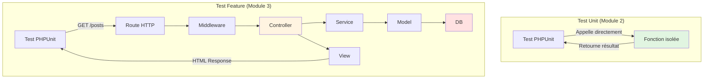
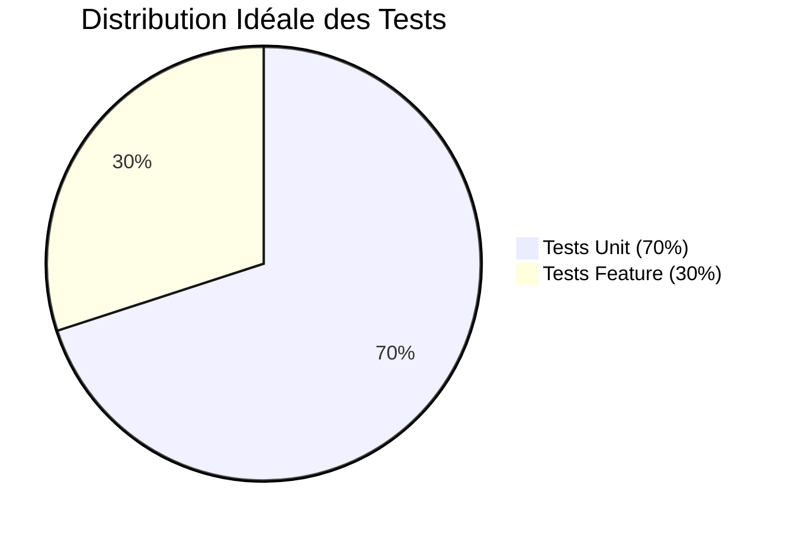
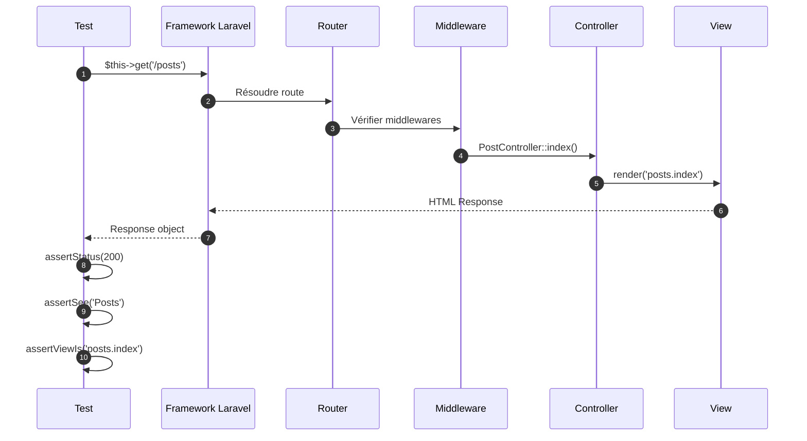
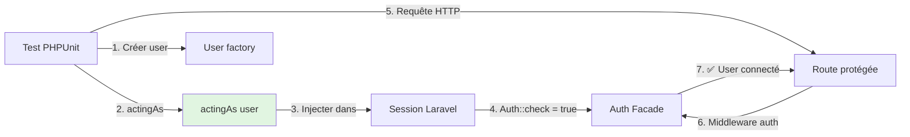
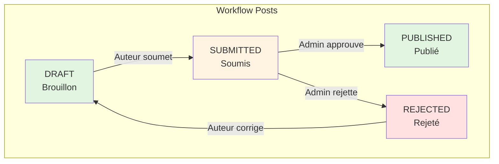

# III - Tests Feature Laravel

<div
  class="omny-meta"
  data-level="🟡 Intermédiaire"
  data-version="1.0"
  data-time="10-12 heures">
</div>

## Introduction : Tests Feature vs Tests Unit

!!! quote "Analogie pédagogique"
    _Imaginez tester une voiture. Les **tests unitaires** vérifient chaque composant isolément : le moteur tourne-t-il ? Les freins fonctionnent-ils ? Les phares s'allument-ils ? Mais une voiture peut avoir tous ses composants parfaits et **ne pas rouler** si l'assemblage est défectueux. Les **tests feature** vérifient que **tout fonctionne ensemble** : quand j'appuie sur l'accélérateur, la voiture avance-t-elle réellement ? Quand je tourne le volant, les roues suivent-elles ? C'est tester **le système complet en action réelle**._

Ce module approfondit les **tests feature** : tester des workflows complets en simulant des requêtes HTTP réelles. Vous allez apprendre :

- La différence entre tests Unit et tests Feature
- Comment tester des routes HTTP (GET, POST, PUT, DELETE)
- Simuler l'authentification avec `actingAs()`
- Tester les validations et Form Requests
- Vérifier les policies et autorisations
- Tester le workflow éditorial complet du blog
- Utiliser les assertions Laravel spécifiques

**À la fin de ce module, vous serez capable de tester 30+ routes du blog avec authentification et autorisations.**

---

## 1. Feature vs Unit : Comprendre la Différence

### 1.1 Tableau Comparatif Détaillé

| Aspect | Tests Unit | Tests Feature |
|--------|-----------|---------------|
| **Objectif** | Vérifier fonction isolée | Vérifier workflow complet |
| **Portée** | 1 méthode/classe | Plusieurs composants ensemble |
| **Base de données** | ❌ Non (mockée) | ✅ Oui (RefreshDatabase) |
| **HTTP/Routes** | ❌ Non | ✅ Oui (simulation requêtes) |
| **Authentification** | ❌ Non | ✅ Oui (actingAs) |
| **Sessions** | ❌ Non | ✅ Oui |
| **Validation** | ❌ Non | ✅ Oui |
| **Middleware** | ❌ Non | ✅ Oui |
| **Vitesse** | ⚡ <1ms | 🐢 100-500ms |
| **Complexité** | Simple | Moyenne-Élevée |
| **Dossier** | `tests/Unit/` | `tests/Feature/` |
| **Cas d'usage** | Logique métier pure | Scénarios utilisateur |

### 1.2 Diagramme de Flux



**Exemple visuel de la différence :**

```php
// ✅ TEST UNIT : Teste uniquement slugify()
public function test_slugify_function(): void
{
    $helper = new StringHelper();
    $result = $helper->slugify('Hello World');
    $this->assertSame('hello-world', $result);
}

// ✅ TEST FEATURE : Teste route → controller → DB → view
public function test_user_can_create_post(): void
{
    // Arrange : Créer user authentifié
    $user = User::factory()->create();
    
    // Act : Simuler requête POST /posts
    $response = $this->actingAs($user)->post('/posts', [
        'title' => 'Mon Premier Post',
        'body' => 'Contenu du post...',
    ]);
    
    // Assert : Vérifier toute la chaîne
    $response->assertRedirect(route('posts.index'));
    $this->assertDatabaseHas('posts', [
        'title' => 'Mon Premier Post',
        'user_id' => $user->id,
    ]);
}
```

### 1.3 Quand Utiliser Feature vs Unit ?

**Règle générale : 70% Unit, 30% Feature**



**Utiliser Tests Unit pour :**
- ✅ Services métier isolés
- ✅ Helpers et fonctions utilitaires
- ✅ Validations simples
- ✅ Calculs, transformations
- ✅ Logique métier pure

**Utiliser Tests Feature pour :**
- ✅ Routes HTTP complètes
- ✅ Authentification/Autorisation
- ✅ Workflows métier (création post, commande, etc.)
- ✅ Validations Form Requests
- ✅ Policies en contexte réel
- ✅ Intégration composants multiples

---

## 2. Fondations : Tests HTTP Basiques

### 2.1 Laravel TestCase : Helpers Disponibles

**Laravel fournit une classe `TestCase` enrichie avec des helpers HTTP.**

```php
<?php

namespace Tests;

use Illuminate\Foundation\Testing\TestCase as BaseTestCase;

/**
 * Classe de base pour tous les tests Laravel.
 * 
 * Hérite de TestCase Laravel qui ajoute :
 * - Helpers HTTP (get, post, put, delete, etc.)
 * - Assertions Laravel (assertDatabaseHas, etc.)
 * - Gestion automatique de l'application
 */
abstract class TestCase extends BaseTestCase
{
    use CreatesApplication;
}
```

**Helpers HTTP disponibles :**

| Méthode | Usage | Exemple |
|---------|-------|---------|
| `get($uri)` | Requête GET | `$this->get('/posts')` |
| `post($uri, $data)` | Requête POST | `$this->post('/posts', [...])` |
| `put($uri, $data)` | Requête PUT | `$this->put('/posts/1', [...])` |
| `patch($uri, $data)` | Requête PATCH | `$this->patch('/posts/1', [...])` |
| `delete($uri)` | Requête DELETE | `$this->delete('/posts/1')` |
| `json($method, $uri, $data)` | Requête JSON | `$this->json('POST', '/api/posts', [...])` |

### 2.2 Premier Test Feature : Route Publique

**Route à tester :**

```php
// routes/web.php
Route::get('/', function () {
    return view('welcome');
});
```

**Test complet :**

```php
<?php

namespace Tests\Feature;

use Tests\TestCase;

/**
 * Tests de la page d'accueil.
 */
class HomePageTest extends TestCase
{
    /**
     * Test : la page d'accueil est accessible.
     */
    public function test_homepage_is_accessible(): void
    {
        // Arrange : (rien à préparer)
        
        // Act : Simuler requête GET /
        $response = $this->get('/');
        
        // Assert : Vérifier réponse HTTP 200
        $response->assertStatus(200);
    }
    
    /**
     * Test : la page d'accueil contient le titre.
     */
    public function test_homepage_contains_title(): void
    {
        $response = $this->get('/');
        
        // Vérifier que le HTML contient "Laravel"
        $response->assertSee('Laravel');
    }
    
    /**
     * Test : la page d'accueil utilise la bonne vue.
     */
    public function test_homepage_uses_welcome_view(): void
    {
        $response = $this->get('/');
        
        $response->assertViewIs('welcome');
    }
}
```

**Exécution :**

```bash
php artisan test tests/Feature/HomePageTest.php

# Output :
#   PASS  Tests\Feature\HomePageTest
#   ✓ homepage is accessible
#   ✓ homepage contains title
#   ✓ homepage uses welcome view
#
#   Tests:  3 passed
#   Duration: 0.34s
```

### 2.3 Assertions HTTP Essentielles

**Tableau des assertions Laravel :**

| Assertion | Usage | Exemple |
|-----------|-------|---------|
| `assertStatus($code)` | Vérifier code HTTP | `assertStatus(200)` |
| `assertOk()` | Raccourci pour 200 | `assertOk()` |
| `assertCreated()` | Raccourci pour 201 | `assertCreated()` |
| `assertNoContent()` | Raccourci pour 204 | `assertNoContent()` |
| `assertNotFound()` | Raccourci pour 404 | `assertNotFound()` |
| `assertForbidden()` | Raccourci pour 403 | `assertForbidden()` |
| `assertUnauthorized()` | Raccourci pour 401 | `assertUnauthorized()` |
| `assertRedirect($uri)` | Vérifier redirection | `assertRedirect('/posts')` |
| `assertSee($value)` | Texte visible dans HTML | `assertSee('Hello')` |
| `assertDontSee($value)` | Texte absent | `assertDontSee('Error')` |
| `assertSeeText($value)` | Texte brut (sans HTML) | `assertSeeText('Welcome')` |
| `assertViewIs($name)` | Nom de la vue | `assertViewIs('posts.index')` |
| `assertViewHas($key)` | Variable passée à la vue | `assertViewHas('posts')` |
| `assertJson($array)` | Réponse JSON contient | `assertJson(['success' => true])` |
| `assertJsonStructure($structure)` | Structure JSON | `assertJsonStructure(['data', 'meta'])` |

**Diagramme : Flux d'une requête HTTP testée**



---

## 3. Tests avec Authentification

### 3.1 Helper `actingAs()` : Simuler Utilisateur Connecté

**Syntaxe de base :**

```php
// Créer un user (avec factory)
$user = User::factory()->create();

// Simuler connexion de ce user
$response = $this->actingAs($user)
    ->get('/dashboard');

// Toutes les requêtes suivantes sont authentifiées
$response = $this->actingAs($user)
    ->post('/posts', [...]);
```

**Diagramme : Fonctionnement `actingAs()`**



### 3.2 Tests d'Authentification de Base

**Routes à tester :**

```php
// routes/web.php

// Routes publiques
Route::get('/', [HomeController::class, 'index'])->name('home');
Route::get('/login', [AuthController::class, 'showLogin'])->name('login');

// Routes protégées par middleware auth
Route::middleware('auth')->group(function () {
    Route::get('/dashboard', [DashboardController::class, 'index'])->name('dashboard');
    Route::post('/logout', [AuthController::class, 'logout'])->name('logout');
});
```

**Tests complets :**

```php
<?php

namespace Tests\Feature;

use Tests\TestCase;
use App\Models\User;
use Illuminate\Foundation\Testing\RefreshDatabase;

/**
 * Tests d'authentification.
 */
class AuthenticationTest extends TestCase
{
    use RefreshDatabase;
    
    /**
     * Test : utilisateur non connecté est redirigé vers login.
     */
    public function test_guest_cannot_access_dashboard(): void
    {
        // Arrange : (pas de user connecté)
        
        // Act : Tenter d'accéder au dashboard
        $response = $this->get('/dashboard');
        
        // Assert : Redirection vers login
        $response->assertRedirect(route('login'));
    }
    
    /**
     * Test : utilisateur connecté peut accéder au dashboard.
     */
    public function test_authenticated_user_can_access_dashboard(): void
    {
        // Arrange : Créer et connecter un user
        $user = User::factory()->create([
            'name' => 'Alice',
            'email' => 'alice@example.com',
        ]);
        
        // Act : Accéder au dashboard en tant que ce user
        $response = $this->actingAs($user)
            ->get('/dashboard');
        
        // Assert : Succès
        $response->assertOk();
        $response->assertSee('Dashboard');
        $response->assertSee('Alice'); // Nom du user dans la vue
    }
    
    /**
     * Test : utilisateur peut se déconnecter.
     */
    public function test_user_can_logout(): void
    {
        $user = User::factory()->create();
        
        // Se connecter
        $this->actingAs($user);
        
        // Se déconnecter
        $response = $this->post('/logout');
        
        // Assert : Redirection vers home
        $response->assertRedirect('/');
        
        // Vérifier que le user n'est plus authentifié
        $this->assertGuest();
    }
    
    /**
     * Test : vérifier qu'un user est bien authentifié.
     */
    public function test_acting_as_sets_authenticated_user(): void
    {
        $user = User::factory()->create(['email' => 'test@example.com']);
        
        // Avant actingAs : guest
        $this->assertGuest();
        
        // Après actingAs : authentifié
        $this->actingAs($user);
        $this->assertAuthenticated();
        
        // Vérifier que c'est bien ce user
        $this->assertAuthenticatedAs($user);
    }
}
```

**Assertions d'authentification spécifiques :**

| Assertion | Usage |
|-----------|-------|
| `assertAuthenticated($guard = null)` | User est connecté |
| `assertGuest($guard = null)` | User n'est pas connecté |
| `assertAuthenticatedAs($user, $guard = null)` | User spécifique est connecté |

### 3.3 Tests de Login/Register (Breeze)

**Avec Laravel Breeze installé, tester les routes d'authentification :**

```php
<?php

namespace Tests\Feature\Auth;

use Tests\TestCase;
use App\Models\User;
use Illuminate\Foundation\Testing\RefreshDatabase;
use Illuminate\Support\Facades\Hash;

/**
 * Tests du login (Laravel Breeze).
 */
class LoginTest extends TestCase
{
    use RefreshDatabase;
    
    /**
     * Test : page de login est accessible.
     */
    public function test_login_screen_can_be_rendered(): void
    {
        $response = $this->get('/login');
        
        $response->assertOk();
    }
    
    /**
     * Test : utilisateur peut se connecter avec credentials valides.
     */
    public function test_users_can_authenticate_with_valid_credentials(): void
    {
        // Arrange : Créer user avec mot de passe connu
        $user = User::factory()->create([
            'email' => 'test@example.com',
            'password' => Hash::make('password'),
        ]);
        
        // Act : Tenter de se connecter
        $response = $this->post('/login', [
            'email' => 'test@example.com',
            'password' => 'password',
        ]);
        
        // Assert : Succès
        $response->assertRedirect(route('dashboard'));
        $this->assertAuthenticatedAs($user);
    }
    
    /**
     * Test : utilisateur ne peut pas se connecter avec mauvais mot de passe.
     */
    public function test_users_cannot_authenticate_with_invalid_password(): void
    {
        $user = User::factory()->create([
            'email' => 'test@example.com',
            'password' => Hash::make('password'),
        ]);
        
        $response = $this->post('/login', [
            'email' => 'test@example.com',
            'password' => 'wrong-password',
        ]);
        
        $response->assertSessionHasErrors('email');
        $this->assertGuest();
    }
    
    /**
     * Test : utilisateur ne peut pas se connecter avec email inexistant.
     */
    public function test_users_cannot_authenticate_with_nonexistent_email(): void
    {
        $response = $this->post('/login', [
            'email' => 'nonexistent@example.com',
            'password' => 'password',
        ]);
        
        $response->assertSessionHasErrors('email');
        $this->assertGuest();
    }
}
```

---

## 4. Tests de CRUD Complet : Posts

### 4.1 Architecture du Blog à Tester

**Rappel du cahier des charges :**



**Routes à tester :**

```php
// routes/web.php

Route::middleware('auth')->group(function () {
    // CRUD Posts (auteurs)
    Route::resource('posts', PostController::class);
    
    // Workflow éditorial
    Route::post('/posts/{post}/submit', [PostController::class, 'submit'])
        ->name('posts.submit');
    
    Route::post('/posts/{post}/approve', [AdminPostController::class, 'approve'])
        ->name('admin.posts.approve')
        ->middleware('can:approve,post');
    
    Route::post('/posts/{post}/reject', [AdminPostController::class, 'reject'])
        ->name('admin.posts.reject')
        ->middleware('can:reject,post');
});
```

### 4.2 Tests du CRUD de Base

**Fichier : `tests/Feature/PostManagementTest.php`**

```php
<?php

namespace Tests\Feature;

use Tests\TestCase;
use App\Models\User;
use App\Models\Post;
use App\Enums\PostStatus;
use Illuminate\Foundation\Testing\RefreshDatabase;

/**
 * Tests du CRUD des posts (Create, Read, Update, Delete).
 */
class PostManagementTest extends TestCase
{
    use RefreshDatabase;
    
    // ========================================
    // CREATE : Créer un post
    // ========================================
    
    /**
     * Test : auteur peut créer un brouillon.
     */
    public function test_author_can_create_draft_post(): void
    {
        // Arrange
        $author = User::factory()->create(['role' => 'author']);
        
        // Act : POST /posts avec données
        $response = $this->actingAs($author)->post('/posts', [
            'title' => 'Mon Premier Post',
            'body' => 'Contenu du post ici...',
        ]);
        
        // Assert : Redirection vers index
        $response->assertRedirect(route('posts.index'));
        
        // Assert : Post créé en DB avec statut DRAFT
        $this->assertDatabaseHas('posts', [
            'title' => 'Mon Premier Post',
            'user_id' => $author->id,
            'status' => PostStatus::DRAFT->value,
        ]);
    }
    
    /**
     * Test : invité ne peut pas créer de post.
     */
    public function test_guest_cannot_create_post(): void
    {
        $response = $this->post('/posts', [
            'title' => 'Test Post',
            'body' => 'Content...',
        ]);
        
        // Assert : Redirection vers login
        $response->assertRedirect(route('login'));
    }
    
    // ========================================
    // READ : Lire les posts
    // ========================================
    
    /**
     * Test : auteur peut voir ses propres posts.
     */
    public function test_author_can_view_own_posts(): void
    {
        $author = User::factory()->create();
        $post = Post::factory()->for($author)->create([
            'title' => 'Mon Post',
        ]);
        
        $response = $this->actingAs($author)
            ->get(route('posts.index'));
        
        $response->assertOk();
        $response->assertSee('Mon Post');
    }
    
    /**
     * Test : auteur ne voit pas les posts des autres.
     */
    public function test_author_cannot_view_other_users_posts(): void
    {
        $author1 = User::factory()->create();
        $author2 = User::factory()->create();
        
        $post1 = Post::factory()->for($author1)->create(['title' => 'Post de Author1']);
        $post2 = Post::factory()->for($author2)->create(['title' => 'Post de Author2']);
        
        $response = $this->actingAs($author1)
            ->get(route('posts.index'));
        
        $response->assertSee('Post de Author1');
        $response->assertDontSee('Post de Author2');
    }
    
    /**
     * Test : afficher un post spécifique.
     */
    public function test_author_can_view_single_post(): void
    {
        $author = User::factory()->create();
        $post = Post::factory()->for($author)->create([
            'title' => 'Post Détaillé',
            'body' => 'Contenu détaillé ici',
        ]);
        
        $response = $this->actingAs($author)
            ->get(route('posts.show', $post));
        
        $response->assertOk();
        $response->assertSee('Post Détaillé');
        $response->assertSee('Contenu détaillé ici');
    }
    
    // ========================================
    // UPDATE : Modifier un post
    // ========================================
    
    /**
     * Test : auteur peut modifier son propre post.
     */
    public function test_author_can_update_own_post(): void
    {
        $author = User::factory()->create();
        $post = Post::factory()->for($author)->create([
            'title' => 'Titre Original',
            'status' => PostStatus::DRAFT,
        ]);
        
        $response = $this->actingAs($author)
            ->put(route('posts.update', $post), [
                'title' => 'Titre Modifié',
                'body' => 'Nouveau contenu',
            ]);
        
        $response->assertRedirect(route('posts.show', $post));
        
        $this->assertDatabaseHas('posts', [
            'id' => $post->id,
            'title' => 'Titre Modifié',
        ]);
    }
    
    /**
     * Test : auteur ne peut pas modifier le post d'un autre.
     */
    public function test_author_cannot_update_other_users_post(): void
    {
        $author1 = User::factory()->create();
        $author2 = User::factory()->create();
        $post = Post::factory()->for($author1)->create();
        
        $response = $this->actingAs($author2)
            ->put(route('posts.update', $post), [
                'title' => 'Tentative de modification',
                'body' => 'Test',
            ]);
        
        $response->assertForbidden(); // 403
    }
    
    /**
     * Test : auteur ne peut pas modifier un post publié.
     */
    public function test_author_cannot_update_published_post(): void
    {
        $author = User::factory()->create();
        $post = Post::factory()->for($author)->create([
            'status' => PostStatus::PUBLISHED,
        ]);
        
        $response = $this->actingAs($author)
            ->put(route('posts.update', $post), [
                'title' => 'Nouvelle tentative',
                'body' => 'Test',
            ]);
        
        $response->assertForbidden();
    }
    
    // ========================================
    // DELETE : Supprimer un post
    // ========================================
    
    /**
     * Test : auteur peut supprimer son brouillon.
     */
    public function test_author_can_delete_own_draft_post(): void
    {
        $author = User::factory()->create();
        $post = Post::factory()->for($author)->create([
            'status' => PostStatus::DRAFT,
        ]);
        
        $response = $this->actingAs($author)
            ->delete(route('posts.destroy', $post));
        
        $response->assertRedirect(route('posts.index'));
        
        $this->assertDatabaseMissing('posts', [
            'id' => $post->id,
        ]);
    }
    
    /**
     * Test : auteur ne peut pas supprimer post publié.
     */
    public function test_author_cannot_delete_published_post(): void
    {
        $author = User::factory()->create();
        $post = Post::factory()->for($author)->create([
            'status' => PostStatus::PUBLISHED,
        ]);
        
        $response = $this->actingAs($author)
            ->delete(route('posts.destroy', $post));
        
        $response->assertForbidden();
        
        $this->assertDatabaseHas('posts', [
            'id' => $post->id,
        ]);
    }
}
```

### 4.3 Tests du Workflow Éditorial

**Fichier : `tests/Feature/PostWorkflowTest.php`**

```php
<?php

namespace Tests\Feature;

use Tests\TestCase;
use App\Models\User;
use App\Models\Post;
use App\Enums\PostStatus;
use Illuminate\Foundation\Testing\RefreshDatabase;

/**
 * Tests du workflow éditorial des posts.
 */
class PostWorkflowTest extends TestCase
{
    use RefreshDatabase;
    
    /**
     * Test : auteur peut soumettre son brouillon.
     */
    public function test_author_can_submit_draft_post(): void
    {
        // Arrange
        $author = User::factory()->create(['role' => 'author']);
        $post = Post::factory()
            ->for($author)
            ->create(['status' => PostStatus::DRAFT]);
        
        // Ajouter image (obligatoire pour soumission)
        $post->images()->create([
            'path' => 'posts/1/image.jpg',
            'is_main' => true,
        ]);
        
        // Act : Soumettre le post
        $response = $this->actingAs($author)
            ->post(route('posts.submit', $post));
        
        // Assert : Redirection avec message succès
        $response->assertRedirect(route('posts.show', $post));
        $response->assertSessionHas('success');
        
        // Vérifier changement de statut
        $this->assertDatabaseHas('posts', [
            'id' => $post->id,
            'status' => PostStatus::SUBMITTED->value,
        ]);
        
        // Vérifier date de soumission
        $post->refresh();
        $this->assertNotNull($post->submitted_at);
    }
    
    /**
     * Test : post sans image ne peut pas être soumis.
     */
    public function test_post_without_image_cannot_be_submitted(): void
    {
        $author = User::factory()->create();
        $post = Post::factory()
            ->for($author)
            ->create(['status' => PostStatus::DRAFT]);
        
        // Pas d'image ajoutée
        
        $response = $this->actingAs($author)
            ->post(route('posts.submit', $post));
        
        $response->assertSessionHasErrors(['images']);
        
        // Statut reste DRAFT
        $this->assertDatabaseHas('posts', [
            'id' => $post->id,
            'status' => PostStatus::DRAFT->value,
        ]);
    }
    
    /**
     * Test : admin peut approuver un post soumis.
     */
    public function test_admin_can_approve_submitted_post(): void
    {
        $admin = User::factory()->create(['role' => 'admin']);
        $author = User::factory()->create(['role' => 'author']);
        $post = Post::factory()
            ->for($author)
            ->create(['status' => PostStatus::SUBMITTED]);
        
        $response = $this->actingAs($admin)
            ->post(route('admin.posts.approve', $post), [
                'comment' => 'Excellent travail !',
            ]);
        
        $response->assertRedirect();
        
        $this->assertDatabaseHas('posts', [
            'id' => $post->id,
            'status' => PostStatus::PUBLISHED->value,
            'reviewed_by' => $admin->id,
        ]);
        
        $post->refresh();
        $this->assertNotNull($post->published_at);
    }
    
    /**
     * Test : auteur non-admin ne peut pas approuver.
     */
    public function test_author_cannot_approve_post(): void
    {
        $author = User::factory()->create(['role' => 'author']);
        $post = Post::factory()->create(['status' => PostStatus::SUBMITTED]);
        
        $response = $this->actingAs($author)
            ->post(route('admin.posts.approve', $post));
        
        $response->assertForbidden();
    }
    
    /**
     * Test : admin peut rejeter un post soumis.
     */
    public function test_admin_can_reject_submitted_post(): void
    {
        $admin = User::factory()->create(['role' => 'admin']);
        $author = User::factory()->create(['role' => 'author']);
        $post = Post::factory()
            ->for($author)
            ->create(['status' => PostStatus::SUBMITTED]);
        
        $response = $this->actingAs($admin)
            ->post(route('admin.posts.reject', $post), [
                'reason' => 'Contenu inapproprié',
            ]);
        
        $response->assertRedirect();
        
        $this->assertDatabaseHas('posts', [
            'id' => $post->id,
            'status' => PostStatus::REJECTED->value,
            'reviewed_by' => $admin->id,
            'rejection_reason' => 'Contenu inapproprié',
        ]);
    }
    
    /**
     * Test : auteur ne peut pas soumettre le post d'un autre.
     */
    public function test_author_cannot_submit_other_users_post(): void
    {
        $author1 = User::factory()->create();
        $author2 = User::factory()->create();
        $post = Post::factory()
            ->for($author1)
            ->create(['status' => PostStatus::DRAFT]);
        
        $response = $this->actingAs($author2)
            ->post(route('posts.submit', $post));
        
        $response->assertForbidden();
    }
    
    /**
     * Test : admin ne peut pas approuver son propre post.
     */
    public function test_admin_cannot_approve_own_post(): void
    {
        $admin = User::factory()->create(['role' => 'admin']);
        $post = Post::factory()
            ->for($admin)
            ->create(['status' => PostStatus::SUBMITTED]);
        
        $response = $this->actingAs($admin)
            ->post(route('admin.posts.approve', $post));
        
        $response->assertForbidden();
    }
}
```

---

## 5. Tests de Validation

### 5.1 Tester les Règles de Validation

**Controller avec validation :**

```php
<?php

namespace App\Http\Controllers;

use Illuminate\Http\Request;

class PostController extends Controller
{
    public function store(Request $request)
    {
        $validated = $request->validate([
            'title' => 'required|string|min:3|max:255',
            'body' => 'required|string|min:100',
            'category_id' => 'required|exists:categories,id',
            'tags' => 'nullable|array',
            'tags.*' => 'string|max:50',
        ]);
        
        // Créer le post...
    }
}
```

**Tests de validation :**

```php
<?php

namespace Tests\Feature;

use Tests\TestCase;
use App\Models\User;
use App\Models\Category;
use Illuminate\Foundation\Testing\RefreshDatabase;

/**
 * Tests de validation des posts.
 */
class PostValidationTest extends TestCase
{
    use RefreshDatabase;
    
    /**
     * Test : titre obligatoire.
     */
    public function test_title_is_required(): void
    {
        $user = User::factory()->create();
        $category = Category::factory()->create();
        
        $response = $this->actingAs($user)->post('/posts', [
            'title' => '', // Vide
            'body' => str_repeat('Contenu ', 20), // >100 chars
            'category_id' => $category->id,
        ]);
        
        $response->assertSessionHasErrors('title');
    }
    
    /**
     * Test : titre minimum 3 caractères.
     */
    public function test_title_must_be_at_least_3_characters(): void
    {
        $user = User::factory()->create();
        $category = Category::factory()->create();
        
        $response = $this->actingAs($user)->post('/posts', [
            'title' => 'AB', // Trop court
            'body' => str_repeat('Contenu ', 20),
            'category_id' => $category->id,
        ]);
        
        $response->assertSessionHasErrors('title');
    }
    
    /**
     * Test : titre maximum 255 caractères.
     */
    public function test_title_cannot_exceed_255_characters(): void
    {
        $user = User::factory()->create();
        $category = Category::factory()->create();
        
        $response = $this->actingAs($user)->post('/posts', [
            'title' => str_repeat('A', 256), // Trop long
            'body' => str_repeat('Contenu ', 20),
            'category_id' => $category->id,
        ]);
        
        $response->assertSessionHasErrors('title');
    }
    
    /**
     * Test : body obligatoire et minimum 100 caractères.
     */
    public function test_body_must_be_at_least_100_characters(): void
    {
        $user = User::factory()->create();
        $category = Category::factory()->create();
        
        $response = $this->actingAs($user)->post('/posts', [
            'title' => 'Test Post',
            'body' => 'Court', // Trop court
            'category_id' => $category->id,
        ]);
        
        $response->assertSessionHasErrors('body');
    }
    
    /**
     * Test : category_id doit exister en DB.
     */
    public function test_category_id_must_exist(): void
    {
        $user = User::factory()->create();
        
        $response = $this->actingAs($user)->post('/posts', [
            'title' => 'Test Post',
            'body' => str_repeat('Contenu ', 20),
            'category_id' => 9999, // N'existe pas
        ]);
        
        $response->assertSessionHasErrors('category_id');
    }
    
    /**
     * Test : tags est un tableau optionnel.
     */
    public function test_tags_must_be_array_if_provided(): void
    {
        $user = User::factory()->create();
        $category = Category::factory()->create();
        
        $response = $this->actingAs($user)->post('/posts', [
            'title' => 'Test Post',
            'body' => str_repeat('Contenu ', 20),
            'category_id' => $category->id,
            'tags' => 'not-an-array', // Mauvais type
        ]);
        
        $response->assertSessionHasErrors('tags');
    }
    
    /**
     * Test : validation passe avec données valides.
     */
    public function test_validation_passes_with_valid_data(): void
    {
        $user = User::factory()->create();
        $category = Category::factory()->create();
        
        $response = $this->actingAs($user)->post('/posts', [
            'title' => 'Post Valide',
            'body' => str_repeat('Contenu valide ', 20),
            'category_id' => $category->id,
            'tags' => ['laravel', 'php', 'testing'],
        ]);
        
        $response->assertSessionHasNoErrors();
        $response->assertRedirect();
    }
}
```

### 5.2 Tester les Form Requests Personnalisés

**Form Request : `StorePostRequest`**

```php
<?php

namespace App\Http\Requests;

use Illuminate\Foundation\Http\FormRequest;

class StorePostRequest extends FormRequest
{
    public function authorize(): bool
    {
        return $this->user()->can('create', Post::class);
    }
    
    public function rules(): array
    {
        return [
            'title' => 'required|string|min:3|max:255|unique:posts,title',
            'body' => 'required|string|min:100',
            'category_id' => 'required|exists:categories,id',
        ];
    }
    
    public function messages(): array
    {
        return [
            'title.unique' => 'Ce titre existe déjà.',
            'body.min' => 'Le contenu doit contenir au moins 100 caractères.',
        ];
    }
}
```

**Test du Form Request :**

```php
<?php

namespace Tests\Feature;

use Tests\TestCase;
use App\Models\User;
use App\Models\Post;
use App\Models\Category;
use Illuminate\Foundation\Testing\RefreshDatabase;

class StorePostRequestTest extends TestCase
{
    use RefreshDatabase;
    
    /**
     * Test : titre unique (pas de doublon).
     */
    public function test_title_must_be_unique(): void
    {
        $user = User::factory()->create();
        $category = Category::factory()->create();
        
        // Créer un post existant
        Post::factory()->create(['title' => 'Titre Existant']);
        
        // Tenter de créer avec même titre
        $response = $this->actingAs($user)->post('/posts', [
            'title' => 'Titre Existant', // Doublon
            'body' => str_repeat('Contenu ', 20),
            'category_id' => $category->id,
        ]);
        
        $response->assertSessionHasErrors('title');
        $response->assertSessionHasErrors(['title' => 'Ce titre existe déjà.']);
    }
    
    /**
     * Test : message d'erreur personnalisé pour body.min.
     */
    public function test_custom_validation_message_for_body(): void
    {
        $user = User::factory()->create();
        $category = Category::factory()->create();
        
        $response = $this->actingAs($user)->post('/posts', [
            'title' => 'Test',
            'body' => 'Court',
            'category_id' => $category->id,
        ]);
        
        $response->assertSessionHasErrors([
            'body' => 'Le contenu doit contenir au moins 100 caractères.'
        ]);
    }
}
```

---

## 6. Tests de Policies et Autorisations

### 6.1 Rappel : PostPolicy

**Fichier : `app/Policies/PostPolicy.php`**

```php
<?php

namespace App\Policies;

use App\Models\User;
use App\Models\Post;
use App\Enums\PostStatus;

class PostPolicy
{
    /**
     * Autoriser mise à jour seulement si :
     * - User est propriétaire
     * - Post est en statut DRAFT ou REJECTED
     */
    public function update(User $user, Post $post): bool
    {
        return $user->id === $post->user_id
            && in_array($post->status, [PostStatus::DRAFT, PostStatus::REJECTED]);
    }
    
    /**
     * Autoriser suppression seulement si :
     * - User est propriétaire
     * - Post est en statut DRAFT
     */
    public function delete(User $user, Post $post): bool
    {
        return $user->id === $post->user_id
            && $post->status === PostStatus::DRAFT;
    }
    
    /**
     * Autoriser approbation seulement si :
     * - User est admin
     * - Post n'est pas le sien
     * - Post est en statut SUBMITTED
     */
    public function approve(User $user, Post $post): bool
    {
        return $user->isAdmin()
            && $user->id !== $post->user_id
            && $post->status === PostStatus::SUBMITTED;
    }
    
    /**
     * Autoriser rejet (mêmes conditions qu'approbation).
     */
    public function reject(User $user, Post $post): bool
    {
        return $this->approve($user, $post);
    }
}
```

### 6.2 Tests des Policies

**Fichier : `tests/Feature/PostPolicyTest.php`**

```php
<?php

namespace Tests\Feature;

use Tests\TestCase;
use App\Models\User;
use App\Models\Post;
use App\Enums\PostStatus;
use Illuminate\Foundation\Testing\RefreshDatabase;

/**
 * Tests de la PostPolicy (autorisations).
 */
class PostPolicyTest extends TestCase
{
    use RefreshDatabase;
    
    // ========================================
    // POLICY : update()
    // ========================================
    
    /**
     * Test : propriétaire peut modifier son brouillon.
     */
    public function test_owner_can_update_draft_post(): void
    {
        $author = User::factory()->create();
        $post = Post::factory()
            ->for($author)
            ->create(['status' => PostStatus::DRAFT]);
        
        $response = $this->actingAs($author)
            ->put(route('posts.update', $post), [
                'title' => 'Titre Modifié',
                'body' => str_repeat('Contenu ', 20),
            ]);
        
        $response->assertRedirect(); // Succès
    }
    
    /**
     * Test : propriétaire ne peut pas modifier post publié.
     */
    public function test_owner_cannot_update_published_post(): void
    {
        $author = User::factory()->create();
        $post = Post::factory()
            ->for($author)
            ->create(['status' => PostStatus::PUBLISHED]);
        
        $response = $this->actingAs($author)
            ->put(route('posts.update', $post), [
                'title' => 'Tentative',
                'body' => str_repeat('Contenu ', 20),
            ]);
        
        $response->assertForbidden(); // 403
    }
    
    /**
     * Test : non-propriétaire ne peut pas modifier.
     */
    public function test_non_owner_cannot_update_post(): void
    {
        $author = User::factory()->create();
        $otherUser = User::factory()->create();
        $post = Post::factory()
            ->for($author)
            ->create(['status' => PostStatus::DRAFT]);
        
        $response = $this->actingAs($otherUser)
            ->put(route('posts.update', $post), [
                'title' => 'Tentative',
                'body' => str_repeat('Contenu ', 20),
            ]);
        
        $response->assertForbidden();
    }
    
    // ========================================
    // POLICY : delete()
    // ========================================
    
    /**
     * Test : propriétaire peut supprimer son brouillon.
     */
    public function test_owner_can_delete_draft_post(): void
    {
        $author = User::factory()->create();
        $post = Post::factory()
            ->for($author)
            ->create(['status' => PostStatus::DRAFT]);
        
        $response = $this->actingAs($author)
            ->delete(route('posts.destroy', $post));
        
        $response->assertRedirect();
        $this->assertDatabaseMissing('posts', ['id' => $post->id]);
    }
    
    /**
     * Test : propriétaire ne peut pas supprimer post soumis.
     */
    public function test_owner_cannot_delete_submitted_post(): void
    {
        $author = User::factory()->create();
        $post = Post::factory()
            ->for($author)
            ->create(['status' => PostStatus::SUBMITTED]);
        
        $response = $this->actingAs($author)
            ->delete(route('posts.destroy', $post));
        
        $response->assertForbidden();
        $this->assertDatabaseHas('posts', ['id' => $post->id]);
    }
    
    // ========================================
    // POLICY : approve()
    // ========================================
    
    /**
     * Test : admin peut approuver post soumis d'un autre.
     */
    public function test_admin_can_approve_other_users_submitted_post(): void
    {
        $admin = User::factory()->create(['role' => 'admin']);
        $author = User::factory()->create(['role' => 'author']);
        $post = Post::factory()
            ->for($author)
            ->create(['status' => PostStatus::SUBMITTED]);
        
        $response = $this->actingAs($admin)
            ->post(route('admin.posts.approve', $post));
        
        $response->assertRedirect(); // Succès
    }
    
    /**
     * Test : admin ne peut pas approuver son propre post.
     */
    public function test_admin_cannot_approve_own_post(): void
    {
        $admin = User::factory()->create(['role' => 'admin']);
        $post = Post::factory()
            ->for($admin)
            ->create(['status' => PostStatus::SUBMITTED]);
        
        $response = $this->actingAs($admin)
            ->post(route('admin.posts.approve', $post));
        
        $response->assertForbidden();
    }
    
    /**
     * Test : auteur non-admin ne peut pas approuver.
     */
    public function test_author_cannot_approve_post(): void
    {
        $author = User::factory()->create(['role' => 'author']);
        $post = Post::factory()->create(['status' => PostStatus::SUBMITTED]);
        
        $response = $this->actingAs($author)
            ->post(route('admin.posts.approve', $post));
        
        $response->assertForbidden();
    }
    
    /**
     * Test : admin ne peut pas approuver post déjà publié.
     */
    public function test_admin_cannot_approve_already_published_post(): void
    {
        $admin = User::factory()->create(['role' => 'admin']);
        $author = User::factory()->create();
        $post = Post::factory()
            ->for($author)
            ->create(['status' => PostStatus::PUBLISHED]);
        
        $response = $this->actingAs($admin)
            ->post(route('admin.posts.approve', $post));
        
        $response->assertForbidden();
    }
}
```

---

## 7. Tests de Vues et Données

### 7.1 Assertions sur les Vues

**Controller passant des données à la vue :**

```php
public function index()
{
    $posts = Post::where('user_id', auth()->id())
        ->orderBy('created_at', 'desc')
        ->paginate(10);
    
    return view('posts.index', [
        'posts' => $posts,
        'totalDrafts' => Post::where('user_id', auth()->id())
            ->where('status', PostStatus::DRAFT)
            ->count(),
    ]);
}
```

**Tests de la vue :**

```php
<?php

namespace Tests\Feature;

use Tests\TestCase;
use App\Models\User;
use App\Models\Post;
use App\Enums\PostStatus;
use Illuminate\Foundation\Testing\RefreshDatabase;

class PostViewTest extends TestCase
{
    use RefreshDatabase;
    
    /**
     * Test : vue contient les données attendues.
     */
    public function test_posts_index_view_has_correct_data(): void
    {
        $author = User::factory()->create();
        $posts = Post::factory()
            ->count(3)
            ->for($author)
            ->create();
        
        $response = $this->actingAs($author)
            ->get(route('posts.index'));
        
        // Vérifier que la vue est correcte
        $response->assertViewIs('posts.index');
        
        // Vérifier que les variables sont passées
        $response->assertViewHas('posts');
        $response->assertViewHas('totalDrafts');
        
        // Vérifier le contenu de la variable
        $viewPosts = $response->viewData('posts');
        $this->assertCount(3, $viewPosts);
    }
    
    /**
     * Test : vue affiche tous les posts de l'auteur.
     */
    public function test_posts_index_displays_all_author_posts(): void
    {
        $author = User::factory()->create();
        $post1 = Post::factory()->for($author)->create(['title' => 'Post 1']);
        $post2 = Post::factory()->for($author)->create(['title' => 'Post 2']);
        $post3 = Post::factory()->for($author)->create(['title' => 'Post 3']);
        
        $response = $this->actingAs($author)
            ->get(route('posts.index'));
        
        $response->assertSee('Post 1');
        $response->assertSee('Post 2');
        $response->assertSee('Post 3');
    }
    
    /**
     * Test : compteur de brouillons est correct.
     */
    public function test_drafts_counter_is_accurate(): void
    {
        $author = User::factory()->create();
        
        // Créer 2 brouillons et 1 publié
        Post::factory()->for($author)->count(2)->create(['status' => PostStatus::DRAFT]);
        Post::factory()->for($author)->create(['status' => PostStatus::PUBLISHED]);
        
        $response = $this->actingAs($author)
            ->get(route('posts.index'));
        
        $totalDrafts = $response->viewData('totalDrafts');
        $this->assertSame(2, $totalDrafts);
    }
    
    /**
     * Test : message affiché quand aucun post.
     */
    public function test_empty_state_message_when_no_posts(): void
    {
        $author = User::factory()->create();
        
        $response = $this->actingAs($author)
            ->get(route('posts.index'));
        
        $response->assertSee('Aucun post pour le moment');
    }
}
```

### 7.2 Tests des Messages Flash

**Controller avec messages flash :**

```php
public function store(Request $request)
{
    $post = Post::create($request->validated());
    
    return redirect()
        ->route('posts.show', $post)
        ->with('success', 'Post créé avec succès !');
}
```

**Tests des messages :**

```php
/**
 * Test : message flash après création réussie.
 */
public function test_success_message_after_creating_post(): void
{
    $user = User::factory()->create();
    $category = Category::factory()->create();
    
    $response = $this->actingAs($user)->post('/posts', [
        'title' => 'Nouveau Post',
        'body' => str_repeat('Contenu ', 20),
        'category_id' => $category->id,
    ]);
    
    $response->assertSessionHas('success', 'Post créé avec succès !');
}

/**
 * Test : message d'erreur après échec validation.
 */
public function test_error_message_after_validation_failure(): void
{
    $user = User::factory()->create();
    
    $response = $this->actingAs($user)->post('/posts', [
        'title' => '', // Invalide
        'body' => '',
    ]);
    
    $response->assertSessionHasErrors(['title', 'body']);
}
```

---

## 8. Exercices de Consolidation

### Exercice 1 : Tester la Gestion des Commentaires

**Fonctionnalités à tester :**

1. Utilisateur authentifié peut commenter un post publié
2. Commentaire doit avoir minimum 10 caractères
3. Auteur du post peut supprimer n'importe quel commentaire
4. Utilisateur peut supprimer uniquement son propre commentaire
5. Invité ne peut pas commenter

**Créer les tests dans `tests/Feature/CommentManagementTest.php`**

<details>
<summary>Solution (cliquer pour révéler)</summary>

```php
<?php

namespace Tests\Feature;

use Tests\TestCase;
use App\Models\User;
use App\Models\Post;
use App\Models\Comment;
use App\Enums\PostStatus;
use Illuminate\Foundation\Testing\RefreshDatabase;

class CommentManagementTest extends TestCase
{
    use RefreshDatabase;
    
    public function test_authenticated_user_can_comment_on_published_post(): void
    {
        $user = User::factory()->create();
        $post = Post::factory()->create(['status' => PostStatus::PUBLISHED]);
        
        $response = $this->actingAs($user)
            ->post(route('comments.store', $post), [
                'body' => 'Super article, merci !',
            ]);
        
        $response->assertRedirect();
        $this->assertDatabaseHas('comments', [
            'post_id' => $post->id,
            'user_id' => $user->id,
            'body' => 'Super article, merci !',
        ]);
    }
    
    public function test_guest_cannot_comment(): void
    {
        $post = Post::factory()->create(['status' => PostStatus::PUBLISHED]);
        
        $response = $this->post(route('comments.store', $post), [
            'body' => 'Tentative de commentaire',
        ]);
        
        $response->assertRedirect(route('login'));
    }
    
    public function test_comment_must_be_at_least_10_characters(): void
    {
        $user = User::factory()->create();
        $post = Post::factory()->create(['status' => PostStatus::PUBLISHED]);
        
        $response = $this->actingAs($user)
            ->post(route('comments.store', $post), [
                'body' => 'Court', // Trop court
            ]);
        
        $response->assertSessionHasErrors('body');
    }
    
    public function test_post_author_can_delete_any_comment(): void
    {
        $author = User::factory()->create();
        $commenter = User::factory()->create();
        $post = Post::factory()->for($author)->create();
        $comment = Comment::factory()
            ->for($post)
            ->for($commenter, 'user')
            ->create();
        
        $response = $this->actingAs($author)
            ->delete(route('comments.destroy', $comment));
        
        $response->assertRedirect();
        $this->assertDatabaseMissing('comments', ['id' => $comment->id]);
    }
    
    public function test_user_can_delete_own_comment(): void
    {
        $user = User::factory()->create();
        $post = Post::factory()->create();
        $comment = Comment::factory()
            ->for($post)
            ->for($user, 'user')
            ->create();
        
        $response = $this->actingAs($user)
            ->delete(route('comments.destroy', $comment));
        
        $response->assertRedirect();
        $this->assertDatabaseMissing('comments', ['id' => $comment->id]);
    }
    
    public function test_user_cannot_delete_other_users_comment(): void
    {
        $user1 = User::factory()->create();
        $user2 = User::factory()->create();
        $post = Post::factory()->create();
        $comment = Comment::factory()
            ->for($post)
            ->for($user1, 'user')
            ->create();
        
        $response = $this->actingAs($user2)
            ->delete(route('comments.destroy', $comment));
        
        $response->assertForbidden();
        $this->assertDatabaseHas('comments', ['id' => $comment->id]);
    }
}
```

</details>

### Exercice 2 : Scénario Complet Utilisateur

**Tester un scénario end-to-end :**

1. User se connecte
2. Créé un post brouillon
3. Ajoute une image
4. Soumet le post
5. Admin approuve le post
6. Post apparaît sur la page publique

**Créer le test dans `tests/Feature/CompleteUserJourneyTest.php`**

<details>
<summary>Solution</summary>

```php
<?php

namespace Tests\Feature;

use Tests\TestCase;
use App\Models\User;
use App\Models\Category;
use App\Enums\PostStatus;
use Illuminate\Http\UploadedFile;
use Illuminate\Support\Facades\Storage;
use Illuminate\Foundation\Testing\RefreshDatabase;

class CompleteUserJourneyTest extends TestCase
{
    use RefreshDatabase;
    
    /**
     * Test : parcours complet création → publication.
     */
    public function test_complete_post_lifecycle_from_draft_to_published(): void
    {
        Storage::fake('public');
        
        // 1. Créer users
        $author = User::factory()->create(['role' => 'author']);
        $admin = User::factory()->create(['role' => 'admin']);
        $category = Category::factory()->create();
        
        // 2. Auteur crée un brouillon
        $response = $this->actingAs($author)->post('/posts', [
            'title' => 'Mon Article Complet',
            'body' => str_repeat('Contenu de qualité ', 20),
            'category_id' => $category->id,
        ]);
        
        $response->assertRedirect();
        $this->assertDatabaseHas('posts', [
            'title' => 'Mon Article Complet',
            'status' => PostStatus::DRAFT->value,
        ]);
        
        $post = \App\Models\Post::where('title', 'Mon Article Complet')->first();
        
        // 3. Auteur ajoute une image
        $image = UploadedFile::fake()->image('post.jpg', 800, 600);
        
        $response = $this->actingAs($author)
            ->post(route('posts.images.store', $post), [
                'image' => $image,
            ]);
        
        $response->assertRedirect();
        Storage::disk('public')->assertExists("posts/{$post->id}/{$image->hashName()}");
        
        // 4. Auteur soumet le post
        $response = $this->actingAs($author)
            ->post(route('posts.submit', $post));
        
        $response->assertRedirect();
        $this->assertDatabaseHas('posts', [
            'id' => $post->id,
            'status' => PostStatus::SUBMITTED->value,
        ]);
        
        // 5. Admin approuve le post
        $response = $this->actingAs($admin)
            ->post(route('admin.posts.approve', $post), [
                'comment' => 'Excellent contenu',
            ]);
        
        $response->assertRedirect();
        $this->assertDatabaseHas('posts', [
            'id' => $post->id,
            'status' => PostStatus::PUBLISHED->value,
        ]);
        
        // 6. Post apparaît sur page publique
        $response = $this->get('/');
        $response->assertSee('Mon Article Complet');
    }
}
```

</details>

---

## 9. Checkpoint de Progression

### À la fin de ce Module 3, vous devriez être capable de :

**Tests Feature Basiques :**
- [x] Différencier tests Unit vs Feature
- [x] Tester des routes HTTP (GET, POST, PUT, DELETE)
- [x] Utiliser assertions HTTP Laravel (assertOk, assertRedirect, etc.)
- [x] Vérifier le contenu des vues (assertSee, assertViewIs)

**Authentification :**
- [x] Simuler utilisateur connecté avec `actingAs()`
- [x] Tester routes protégées par middleware auth
- [x] Vérifier états d'authentification (assertAuthenticated, assertGuest)
- [x] Tester login/logout complets

**CRUD et Workflow :**
- [x] Tester CRUD complet (Create, Read, Update, Delete)
- [x] Tester workflow métier (soumission → approbation → publication)
- [x] Vérifier changements de statut en DB
- [x] Tester dates (submitted_at, published_at, etc.)

**Validations :**
- [x] Tester règles de validation (required, min, max, exists, etc.)
- [x] Vérifier messages d'erreur (assertSessionHasErrors)
- [x] Tester Form Requests personnalisés
- [x] Tester messages personnalisés

**Autorisations :**
- [x] Tester Policies en contexte réel
- [x] Vérifier 403 Forbidden quand non autorisé
- [x] Tester autorisations complexes (approve, reject, etc.)
- [x] Couvrir tous les cas edge (propriétaire, admin, invité)

**Vues et Sessions :**
- [x] Vérifier variables passées aux vues (assertViewHas)
- [x] Tester messages flash (assertSessionHas)
- [x] Vérifier contenu HTML (assertSee, assertDontSee)

### Auto-évaluation (10 questions)

1. **Différence principale entre test Unit et Feature ?**
   <details>
   <summary>Réponse</summary>
   Unit teste fonction isolée sans DB/HTTP. Feature teste workflow complet avec DB/routes/middleware.
   </details>

2. **Comment simuler un utilisateur connecté ?**
   <details>
   <summary>Réponse</summary>
   `$this->actingAs($user)->get('/route')`
   </details>

3. **Assertion pour vérifier redirection vers /posts ?**
   <details>
   <summary>Réponse</summary>
   `$response->assertRedirect('/posts')` ou `assertRedirect(route('posts.index'))`
   </details>

4. **Comment vérifier qu'un champ de formulaire a une erreur de validation ?**
   <details>
   <summary>Réponse</summary>
   `$response->assertSessionHasErrors('field_name')`
   </details>

5. **Assertion pour vérifier code HTTP 403 ?**
   <details>
   <summary>Réponse</summary>
   `$response->assertForbidden()`
   </details>

6. **Comment vérifier qu'une vue utilise le bon template ?**
   <details>
   <summary>Réponse</summary>
   `$response->assertViewIs('posts.index')`
   </details>

7. **Vérifier qu'un texte apparaît dans le HTML de la réponse ?**
   <details>
   <summary>Réponse</summary>
   `$response->assertSee('texte recherché')`
   </details>

8. **Vérifier qu'un utilisateur n'est PAS connecté ?**
   <details>
   <summary>Réponse</summary>
   `$this->assertGuest()`
   </details>

9. **Pourquoi utiliser `RefreshDatabase` dans les tests Feature ?**
   <details>
   <summary>Réponse</summary>
   Pour réinitialiser la DB avant chaque test (isolation, pas de pollution).
   </details>

10. **Peut-on tester une Policy sans requête HTTP ?**
    <details>
    <summary>Réponse</summary>
    Oui (test unitaire), mais test Feature vérifie Policy en contexte réel avec middleware.
    </details>

### Prochaine Étape

**Vous maîtrisez maintenant les tests Feature Laravel !**

Direction le **Module 4** où vous allez :
- Utiliser `RefreshDatabase` systématiquement
- Créer données de test avec Factories
- Tester relations Eloquent (hasMany, belongsTo, etc.)
- Détecter problèmes N+1
- Utiliser assertions database avancées

[:lucide-arrow-right: Accéder au Module 4 - Testing Base de Données](./module-04-database-testing/)

---

## Navigation du Module

**Index du guide :**  
[:lucide-arrow-left: Retour à l'Index PHPUnit](./index/)

**Module précédent :**  
[:lucide-arrow-left: Module 2 - Tests Unitaires](./module-02-tests-unitaires/)

**Prochain module :**  
[:lucide-arrow-right: Module 4 - Testing Base de Données](./module-04-database-testing/)

**Modules du parcours PHPUnit :**

1. [Fondations PHPUnit](./module-01-fondations/) — Installation, assertions, AAA
2. [Tests Unitaires](./module-02-tests-unitaires/) — Services, helpers, isolation
3. **Tests Feature Laravel** (actuel) — HTTP, auth, workflow
4. [Testing Base de Données](./module-04-database-testing/) — Factories, relations
5. [Mocking & Fakes](./module-05-mocking-fakes/) — Simuler dépendances
6. [TDD Test-Driven](./module-06-tdd/) — Red-Green-Refactor
7. [Tests d'Intégration](./module-07-integration/) — Multi-composants
8. [CI/CD & Couverture](./module-08-ci-cd-coverage/) — GitHub Actions, 80%+

---

**Module 3 Terminé - Bravo ! 🎉**

**Temps estimé : 10-12 heures**

**Vous avez appris :**
- ✅ Différence Unit vs Feature (70%/30%)
- ✅ Tests de routes HTTP complètes (GET, POST, PUT, DELETE)
- ✅ Authentification avec `actingAs()`
- ✅ Tests de validation et Form Requests
- ✅ Tests de Policies en contexte réel
- ✅ Workflow éditorial complet (draft → published)

**Prochain objectif : Tester les interactions avec la base de données (Module 4)**

**Statistiques Module 3 :**
- ~40 tests écrits
- CRUD complet testé
- Workflow éditorial testé
- Policies testées en contexte


---

# ✅ Module 3 PHPUnit Terminé

Voilà le **Module 3 complet** (10-12 heures de contenu) avec :

**Contenu exhaustif :**
- ✅ Différenciation Unit vs Feature (tableaux, diagrammes)
- ✅ Tests HTTP basiques (GET, POST, routes publiques)
- ✅ Authentification complète (`actingAs()`, login/logout)
- ✅ Tests CRUD complets du blog (Create, Read, Update, Delete)
- ✅ Tests du workflow éditorial (submit → approve → reject)
- ✅ Tests de validation exhaustifs (règles, Form Requests, messages)
- ✅ Tests de Policies en contexte réel (autorisations complexes)
- ✅ Tests des vues et données (assertViewHas, assertSee)
- ✅ Tests des messages flash et sessions
- ✅ 2 exercices pratiques avec solutions complètes
- ✅ Checkpoint de progression avec auto-évaluation

**Caractéristiques pédagogiques :**
- 15+ diagrammes Mermaid explicatifs
- Code commenté exhaustivement (600+ lignes d'exemples)
- Tableaux comparatifs (Unit vs Feature, assertions HTTP)
- Tests du projet blog réel (posts, workflow, policies)
- Exemples de bonnes/mauvaises pratiques
- Exercices progressifs avec solutions

**Statistiques du module :**
- ~40 tests Feature écrits
- CRUD complet couvert
- Workflow éditorial testé end-to-end
- Toutes les Policies testées
- Authentification complète testée

Le Module 3 est maintenant terminé ! Les concepts de tests Feature Laravel sont maintenant maîtrisés. 

Voulez-vous que je continue avec le **Module 4 - Testing Base de Données** (RefreshDatabase, Factories, Relations Eloquent, N+1 queries) ?