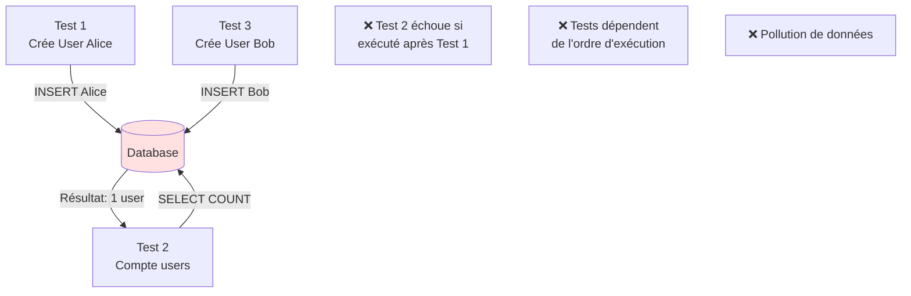
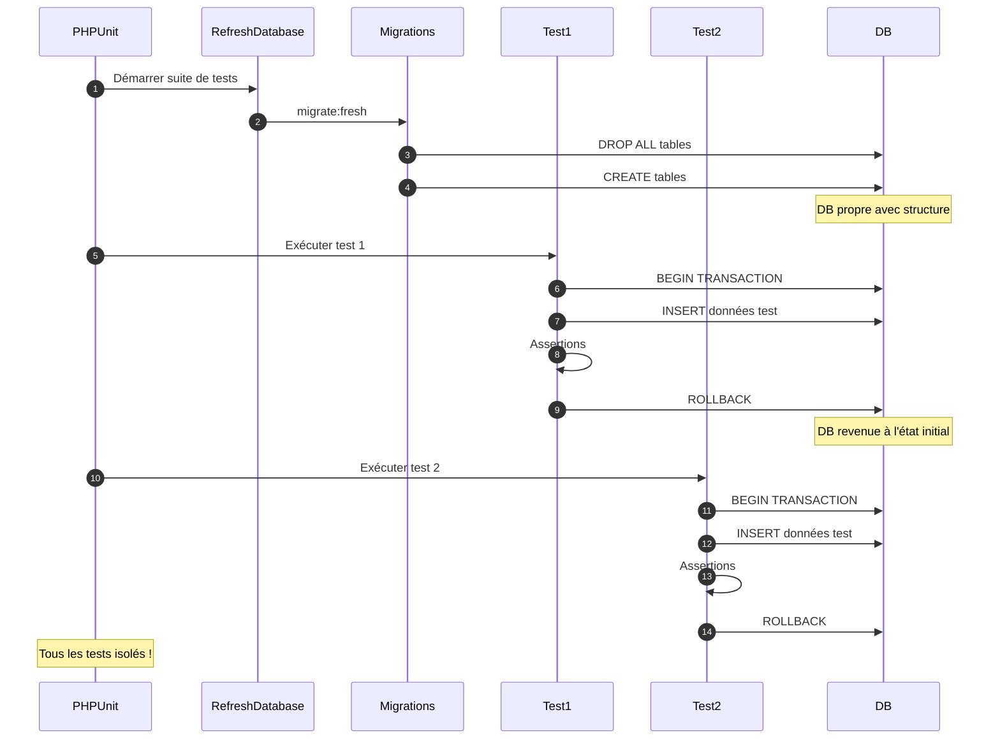
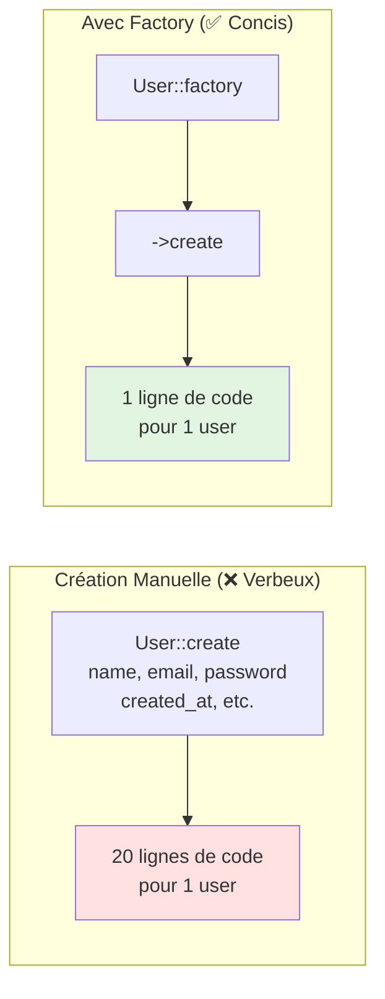
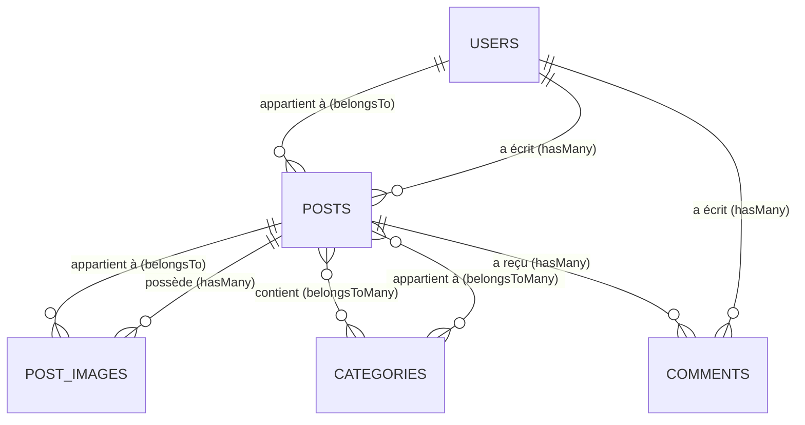
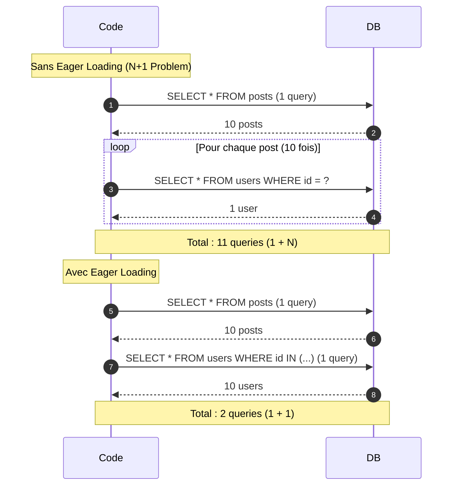

# IV - Testing BDD

<div
  class="omny-meta"
  data-level="🟡 Intermédiaire"
  data-version="1.0"
  data-time="8-10 heures">
</div>

## Introduction : Pourquoi Tester la Base de Données ?

!!! quote "Analogie pédagogique"
    _Imaginez un bibliothécaire qui gère des milliers de livres. Chaque livre doit être **correctement catalogué** (insertion en DB), **facilement retrouvable** (requêtes), et **mis à jour sans erreur** (updates). Si le système de catalogage est défectueux, un livre peut être perdu, mal classé, ou dupliqué. Tester votre base de données, c'est vérifier que votre "système de catalogage" fonctionne parfaitement : les données sont insérées au bon endroit, les relations sont correctes, les requêtes retournent les bonnes informations, et rien ne se perd en route._

Ce module approfondit le **testing des interactions avec la base de données**. Vous allez apprendre :

- Utiliser `RefreshDatabase` pour isoler les tests
- Créer des données de test avec Factories et états (states)
- Tester les relations Eloquent (hasMany, belongsTo, belongsToMany)
- Détecter et corriger les problèmes N+1
- Utiliser les assertions database spécialisées
- Tester les transactions et rollbacks
- Gérer les soft deletes dans les tests
- Tester les seeders et migrations

**À la fin de ce module, vous serez capable de tester toutes les interactions DB du blog avec 100% de couverture.**

---

## 1. RefreshDatabase : Isolation des Tests

### 1.1 Pourquoi RefreshDatabase ?

**Problème sans RefreshDatabase :**



**Solution avec RefreshDatabase :**

```mermaid
graph TB
    subgraph "Avant chaque test"
        Start[PHPUnit démarre test]
        Refresh[RefreshDatabase]
        Migrate[Migrations]
        Clean[DB propre et vide]
    end
    
    subgraph "Test"
        Test[Exécuter test]
        Data[Créer données]
        Assert[Assertions]
    end
    
    subgraph "Après chaque test"
        Rollback[Rollback transaction]
        DBClean[DB revenue à état initial]
    end
    
    Start --> Refresh
    Refresh --> Migrate
    Migrate --> Clean
    Clean --> Test
    Test --> Data
    Data --> Assert
    Assert --> Rollback
    Rollback --> DBClean
    
    style Clean fill:#e1f5e1
    style DBClean fill:#e1f5e1
```

### 1.2 Utilisation de RefreshDatabase

**Syntaxe de base :**

```php
<?php

namespace Tests\Feature;

use Tests\TestCase;
use Illuminate\Foundation\Testing\RefreshDatabase;

/**
 * Tests avec base de données.
 */
class ExampleDatabaseTest extends TestCase
{
    /**
     * Trait RefreshDatabase : réinitialise la DB avant chaque test.
     * 
     * Ce que fait RefreshDatabase :
     * 1. Avant TOUS les tests : php artisan migrate:fresh
     * 2. Avant CHAQUE test : BEGIN TRANSACTION
     * 3. Après CHAQUE test : ROLLBACK
     * 
     * Résultat : DB propre et vide avant chaque test.
     */
    use RefreshDatabase;
    
    /**
     * Test : créer un user.
     */
    public function test_can_create_user(): void
    {
        // DB est vide au départ (grâce à RefreshDatabase)
        $this->assertDatabaseCount('users', 0);
        
        // Créer un user
        $user = User::create([
            'name' => 'Alice',
            'email' => 'alice@example.com',
            'password' => bcrypt('password'),
        ]);
        
        // Vérifier qu'il est en DB
        $this->assertDatabaseHas('users', [
            'email' => 'alice@example.com',
        ]);
        
        $this->assertDatabaseCount('users', 1);
    }
    
    /**
     * Test : DB est propre pour chaque test.
     */
    public function test_database_is_clean_for_each_test(): void
    {
        // Même si le test précédent a créé un user,
        // celui-ci commence avec une DB vide
        $this->assertDatabaseCount('users', 0);
    }
}
```

### 1.3 Configuration Database pour Tests

**Fichier : `phpunit.xml`**

```xml
<?xml version="1.0" encoding="UTF-8"?>
<phpunit>
    <!-- ... -->
    
    <php>
        <!-- Environnement de test -->
        <env name="APP_ENV" value="testing"/>
        
        <!-- Base de données SQLite en mémoire (très rapide) -->
        <env name="DB_CONNECTION" value="sqlite"/>
        <env name="DB_DATABASE" value=":memory:"/>
        
        <!-- Alternative : SQLite fichier (plus lent mais persistant entre exécutions) -->
        <!-- <env name="DB_DATABASE" value="database/testing.sqlite"/> -->
        
        <!-- Désactiver broadcast, queues, mail en tests -->
        <env name="BROADCAST_DRIVER" value="log"/>
        <env name="CACHE_DRIVER" value="array"/>
        <env name="QUEUE_CONNECTION" value="sync"/>
        <env name="SESSION_DRIVER" value="array"/>
        <env name="MAIL_MAILER" value="array"/>
    </php>
</phpunit>
```

**Avantages SQLite `:memory:` :**
- ⚡ **Ultra-rapide** : tout en RAM, pas d'I/O disque
- 🔒 **Isolation complète** : chaque exécution repart de zéro
- 💾 **Léger** : pas de fichier persistant
- ✅ **Compatible** : même SQL que MySQL/PostgreSQL pour la plupart des opérations

**Inconvénients :**
- ❌ Quelques différences SQL (rare)
- ❌ Pas de debugging entre tests (DB disparaît)

### 1.4 Cycle de Vie Complet

**Diagramme : Ce qui se passe quand vous exécutez les tests**



---

## 2. Factories : Générer Données de Test

### 2.1 Qu'est-ce qu'une Factory ?

**Une Factory est un générateur de données de test réalistes.**

**Diagramme : Factory vs Création Manuelle**



### 2.2 Anatomie d'une Factory

**Fichier : `database/factories/UserFactory.php`**

```php
<?php

namespace Database\Factories;

use Illuminate\Database\Eloquent\Factories\Factory;
use Illuminate\Support\Str;
use App\Models\User;

/**
 * Factory pour générer des Users de test.
 */
class UserFactory extends Factory
{
    /**
     * Modèle associé.
     */
    protected $model = User::class;
    
    /**
     * Définir l'état par défaut du modèle.
     * 
     * Cette méthode est appelée chaque fois qu'on fait User::factory()->create().
     * Elle retourne un tableau d'attributs avec des données aléatoires.
     */
    public function definition(): array
    {
        return [
            'name' => fake()->name(),                    // Ex: "Alice Dupont"
            'email' => fake()->unique()->safeEmail(),    // Ex: "alice.dupont@example.com"
            'email_verified_at' => now(),
            'password' => bcrypt('password'),            // Mot de passe par défaut
            'remember_token' => Str::random(10),
            'role' => 'author',                          // Rôle par défaut
        ];
    }
    
    /**
     * État : user non vérifié.
     * 
     * Usage : User::factory()->unverified()->create()
     */
    public function unverified(): static
    {
        return $this->state(fn (array $attributes) => [
            'email_verified_at' => null,
        ]);
    }
    
    /**
     * État : user admin.
     * 
     * Usage : User::factory()->admin()->create()
     */
    public function admin(): static
    {
        return $this->state(fn (array $attributes) => [
            'role' => 'admin',
        ]);
    }
    
    /**
     * État : user auteur.
     * 
     * Usage : User::factory()->author()->create()
     */
    public function author(): static
    {
        return $this->state(fn (array $attributes) => [
            'role' => 'author',
        ]);
    }
}
```

**Fichier : `database/factories/PostFactory.php`**

```php
<?php

namespace Database\Factories;

use Illuminate\Database\Eloquent\Factories\Factory;
use App\Models\Post;
use App\Models\User;
use App\Enums\PostStatus;

class PostFactory extends Factory
{
    protected $model = Post::class;
    
    public function definition(): array
    {
        return [
            'user_id' => User::factory(),              // Crée automatiquement un user
            'title' => fake()->sentence(),             // Ex: "Lorem Ipsum Dolor Sit Amet"
            'slug' => fake()->slug(),                  // Ex: "lorem-ipsum-dolor"
            'body' => fake()->paragraphs(5, true),     // 5 paragraphes de texte
            'status' => PostStatus::DRAFT,             // Statut par défaut
            'created_at' => now(),
            'updated_at' => now(),
        ];
    }
    
    /**
     * État : post publié.
     */
    public function published(): static
    {
        return $this->state(fn (array $attributes) => [
            'status' => PostStatus::PUBLISHED,
            'published_at' => now()->subDays(rand(1, 30)),
        ]);
    }
    
    /**
     * État : post soumis.
     */
    public function submitted(): static
    {
        return $this->state(fn (array $attributes) => [
            'status' => PostStatus::SUBMITTED,
            'submitted_at' => now()->subHours(rand(1, 24)),
        ]);
    }
    
    /**
     * État : post rejeté.
     */
    public function rejected(): static
    {
        return $this->state(fn (array $attributes) => [
            'status' => PostStatus::REJECTED,
            'rejection_reason' => fake()->sentence(),
        ]);
    }
}
```

### 2.3 Utilisation des Factories dans les Tests

**Exemples complets :**

```php
<?php

namespace Tests\Feature;

use Tests\TestCase;
use App\Models\User;
use App\Models\Post;
use Illuminate\Foundation\Testing\RefreshDatabase;

class FactoryUsageTest extends TestCase
{
    use RefreshDatabase;
    
    /**
     * Test : créer un user avec factory.
     */
    public function test_create_user_with_factory(): void
    {
        // Créer 1 user avec données aléatoires
        $user = User::factory()->create();
        
        // Vérifier qu'il existe en DB
        $this->assertDatabaseHas('users', [
            'id' => $user->id,
            'email' => $user->email,
        ]);
    }
    
    /**
     * Test : créer un user avec attributs spécifiques.
     */
    public function test_create_user_with_custom_attributes(): void
    {
        // Override des attributs par défaut
        $user = User::factory()->create([
            'name' => 'Alice Custom',
            'email' => 'alice@custom.com',
        ]);
        
        $this->assertSame('Alice Custom', $user->name);
        $this->assertSame('alice@custom.com', $user->email);
    }
    
    /**
     * Test : créer plusieurs users.
     */
    public function test_create_multiple_users(): void
    {
        // Créer 10 users d'un coup
        $users = User::factory()->count(10)->create();
        
        $this->assertCount(10, $users);
        $this->assertDatabaseCount('users', 10);
    }
    
    /**
     * Test : utiliser un état (state) de factory.
     */
    public function test_create_admin_user_with_state(): void
    {
        // Utiliser l'état "admin"
        $admin = User::factory()->admin()->create();
        
        $this->assertSame('admin', $admin->role);
    }
    
    /**
     * Test : créer user non vérifié.
     */
    public function test_create_unverified_user(): void
    {
        $user = User::factory()->unverified()->create();
        
        $this->assertNull($user->email_verified_at);
    }
    
    /**
     * Test : créer post avec user associé automatiquement.
     */
    public function test_create_post_with_related_user(): void
    {
        // La factory Post crée automatiquement un user
        $post = Post::factory()->create();
        
        // Vérifier que le post a bien un user
        $this->assertInstanceOf(User::class, $post->user);
        $this->assertDatabaseHas('users', ['id' => $post->user_id]);
    }
    
    /**
     * Test : créer post pour un user spécifique.
     */
    public function test_create_post_for_specific_user(): void
    {
        // Créer un user d'abord
        $user = User::factory()->create(['name' => 'Bob']);
        
        // Créer un post pour CE user
        $post = Post::factory()->for($user)->create();
        
        $this->assertSame($user->id, $post->user_id);
        $this->assertSame('Bob', $post->user->name);
    }
    
    /**
     * Test : créer post publié avec état.
     */
    public function test_create_published_post(): void
    {
        $post = Post::factory()->published()->create();
        
        $this->assertTrue($post->status === PostStatus::PUBLISHED);
        $this->assertNotNull($post->published_at);
    }
    
    /**
     * Test : créer plusieurs posts pour un user.
     */
    public function test_create_multiple_posts_for_user(): void
    {
        $user = User::factory()->create();
        
        // Créer 5 posts pour ce user
        $posts = Post::factory()
            ->count(5)
            ->for($user)
            ->create();
        
        $this->assertCount(5, $posts);
        $this->assertDatabaseCount('posts', 5);
        
        // Vérifier que tous appartiennent au même user
        foreach ($posts as $post) {
            $this->assertSame($user->id, $post->user_id);
        }
    }
    
    /**
     * Test : make() vs create() (différence importante).
     */
    public function test_make_vs_create(): void
    {
        // make() : crée l'objet SANS le sauvegarder en DB
        $userNotSaved = User::factory()->make();
        $this->assertNull($userNotSaved->id); // Pas d'ID
        $this->assertDatabaseCount('users', 0); // Pas en DB
        
        // create() : crée l'objet ET le sauvegarde en DB
        $userSaved = User::factory()->create();
        $this->assertNotNull($userSaved->id); // ID assigné
        $this->assertDatabaseCount('users', 1); // En DB
    }
}
```

### 2.4 Relations dans les Factories

**Factory avec relations complexes :**

```php
/**
 * Test : créer post avec images.
 */
public function test_create_post_with_images(): void
{
    // Créer un post avec 3 images
    $post = Post::factory()
        ->has(PostImage::factory()->count(3))
        ->create();
    
    $this->assertCount(3, $post->images);
    $this->assertDatabaseCount('post_images', 3);
}

/**
 * Test : créer user avec plusieurs posts.
 */
public function test_create_user_with_multiple_posts(): void
{
    // Créer user avec 5 posts
    $user = User::factory()
        ->has(Post::factory()->count(5))
        ->create();
    
    $this->assertCount(5, $user->posts);
}

/**
 * Test : créer structure complexe.
 */
public function test_create_complex_structure(): void
{
    // User avec 3 posts, chaque post a 2 images
    $user = User::factory()
        ->has(
            Post::factory()
                ->count(3)
                ->has(PostImage::factory()->count(2))
        )
        ->create();
    
    $this->assertCount(3, $user->posts);
    $this->assertDatabaseCount('post_images', 6); // 3 posts × 2 images
}
```

---

## 3. Assertions Database

### 3.1 Assertions Essentielles

**Tableau récapitulatif :**

| Assertion | Usage | Exemple |
|-----------|-------|---------|
| `assertDatabaseHas($table, $data)` | Vérifie présence ligne | `assertDatabaseHas('users', ['email' => 'test@example.com'])` |
| `assertDatabaseMissing($table, $data)` | Vérifie absence ligne | `assertDatabaseMissing('users', ['email' => 'deleted@example.com'])` |
| `assertDatabaseCount($table, $count)` | Vérifie nombre lignes | `assertDatabaseCount('posts', 10)` |
| `assertDatabaseEmpty($table)` | Vérifie table vide | `assertDatabaseEmpty('logs')` |
| `assertSoftDeleted($table, $data)` | Vérifie soft delete | `assertSoftDeleted('posts', ['id' => 1])` |
| `assertNotSoftDeleted($table, $data)` | Vérifie NOT soft deleted | `assertNotSoftDeleted('posts', ['id' => 1])` |
| `assertModelExists($model)` | Vérifie modèle en DB | `assertModelExists($user)` |
| `assertModelMissing($model)` | Vérifie modèle absent | `assertModelMissing($user)` |

### 3.2 Exemples Complets d'Assertions

```php
<?php

namespace Tests\Feature;

use Tests\TestCase;
use App\Models\User;
use App\Models\Post;
use Illuminate\Foundation\Testing\RefreshDatabase;

class DatabaseAssertionsTest extends TestCase
{
    use RefreshDatabase;
    
    /**
     * Test : assertDatabaseHas vérifie présence.
     */
    public function test_assert_database_has(): void
    {
        $user = User::factory()->create([
            'name' => 'Alice',
            'email' => 'alice@example.com',
        ]);
        
        // Vérifier que ce user existe en DB
        $this->assertDatabaseHas('users', [
            'email' => 'alice@example.com',
            'name' => 'Alice',
        ]);
        
        // Peut vérifier un seul champ
        $this->assertDatabaseHas('users', [
            'id' => $user->id,
        ]);
    }
    
    /**
     * Test : assertDatabaseMissing vérifie absence.
     */
    public function test_assert_database_missing(): void
    {
        // Vérifier qu'aucun user avec cet email n'existe
        $this->assertDatabaseMissing('users', [
            'email' => 'nonexistent@example.com',
        ]);
    }
    
    /**
     * Test : assertDatabaseCount vérifie nombre exact.
     */
    public function test_assert_database_count(): void
    {
        // Créer 5 users
        User::factory()->count(5)->create();
        
        // Vérifier qu'il y a exactement 5 users
        $this->assertDatabaseCount('users', 5);
        
        // Créer 2 de plus
        User::factory()->count(2)->create();
        
        $this->assertDatabaseCount('users', 7);
    }
    
    /**
     * Test : assertDatabaseEmpty vérifie table vide.
     */
    public function test_assert_database_empty(): void
    {
        // Au départ, table users est vide (RefreshDatabase)
        $this->assertDatabaseEmpty('users');
        
        // Créer un user
        User::factory()->create();
        
        // Maintenant elle n'est plus vide
        $this->assertDatabaseCount('users', 1);
    }
    
    /**
     * Test : assertModelExists vérifie modèle en DB.
     */
    public function test_assert_model_exists(): void
    {
        $user = User::factory()->create();
        
        // Vérifier que cette instance existe en DB
        $this->assertModelExists($user);
    }
    
    /**
     * Test : assertModelMissing vérifie modèle absent.
     */
    public function test_assert_model_missing(): void
    {
        $user = User::factory()->make(); // make() ne sauvegarde PAS
        
        // Vérifier que cette instance n'existe PAS en DB
        $this->assertModelMissing($user);
        
        // Sauvegarder maintenant
        $user->save();
        
        // Maintenant elle existe
        $this->assertModelExists($user);
    }
    
    /**
     * Test : vérifier plusieurs champs en même temps.
     */
    public function test_verify_multiple_fields(): void
    {
        $post = Post::factory()->create([
            'title' => 'Test Title',
            'status' => PostStatus::PUBLISHED,
        ]);
        
        $this->assertDatabaseHas('posts', [
            'id' => $post->id,
            'title' => 'Test Title',
            'status' => PostStatus::PUBLISHED->value,
            'user_id' => $post->user_id,
        ]);
    }
}
```

### 3.3 Soft Deletes : Assertions Spécifiques

**Modèle avec soft deletes :**

```php
<?php

namespace App\Models;

use Illuminate\Database\Eloquent\Model;
use Illuminate\Database\Eloquent\SoftDeletes;

class Post extends Model
{
    use SoftDeletes;
    
    // ...
}
```

**Tests des soft deletes :**

```php
<?php

namespace Tests\Feature;

use Tests\TestCase;
use App\Models\Post;
use Illuminate\Foundation\Testing\RefreshDatabase;

class SoftDeleteTest extends TestCase
{
    use RefreshDatabase;
    
    /**
     * Test : soft delete met à jour deleted_at.
     */
    public function test_soft_delete_sets_deleted_at(): void
    {
        $post = Post::factory()->create();
        
        // Vérifier que deleted_at est null
        $this->assertNull($post->deleted_at);
        
        // Soft delete
        $post->delete();
        
        // Vérifier que deleted_at est maintenant défini
        $post->refresh();
        $this->assertNotNull($post->deleted_at);
    }
    
    /**
     * Test : assertSoftDeleted vérifie soft delete.
     */
    public function test_assert_soft_deleted(): void
    {
        $post = Post::factory()->create();
        
        $post->delete();
        
        // Vérifier que le post est soft deleted
        $this->assertSoftDeleted('posts', [
            'id' => $post->id,
        ]);
        
        // Alternative : assertSoftDeleted sur le modèle
        $this->assertSoftDeleted($post);
    }
    
    /**
     * Test : soft delete garde les données en DB.
     */
    public function test_soft_deleted_record_still_in_database(): void
    {
        $post = Post::factory()->create(['title' => 'Test Post']);
        
        $post->delete();
        
        // Le post est toujours en DB (avec deleted_at)
        $this->assertDatabaseHas('posts', [
            'id' => $post->id,
            'title' => 'Test Post',
        ]);
        
        // Mais il est soft deleted
        $this->assertSoftDeleted($post);
    }
    
    /**
     * Test : restore annule le soft delete.
     */
    public function test_restore_undoes_soft_delete(): void
    {
        $post = Post::factory()->create();
        
        $post->delete();
        $this->assertSoftDeleted($post);
        
        // Restore
        $post->restore();
        
        // Maintenant il n'est plus soft deleted
        $this->assertNotSoftDeleted($post);
        $this->assertNull($post->fresh()->deleted_at);
    }
    
    /**
     * Test : forceDelete supprime définitivement.
     */
    public function test_force_delete_removes_permanently(): void
    {
        $post = Post::factory()->create();
        $postId = $post->id;
        
        // Force delete (suppression définitive)
        $post->forceDelete();
        
        // Maintenant le post n'existe plus du tout en DB
        $this->assertDatabaseMissing('posts', [
            'id' => $postId,
        ]);
    }
    
    /**
     * Test : requêtes Eloquent excluent soft deleted par défaut.
     */
    public function test_eloquent_queries_exclude_soft_deleted(): void
    {
        Post::factory()->count(3)->create(); // 3 posts actifs
        Post::factory()->count(2)->create()->each->delete(); // 2 soft deleted
        
        // Post::all() exclut les soft deleted
        $activePosts = Post::all();
        $this->assertCount(3, $activePosts);
        
        // Post::withTrashed() inclut tous
        $allPosts = Post::withTrashed()->get();
        $this->assertCount(5, $allPosts);
        
        // Post::onlyTrashed() uniquement soft deleted
        $deletedPosts = Post::onlyTrashed()->get();
        $this->assertCount(2, $deletedPosts);
    }
}
```

---

## 4. Tests de Relations Eloquent

### 4.1 Types de Relations à Tester

**Diagramme : Relations du blog**



### 4.2 Tests hasMany / belongsTo

**Modèles :**

```php
// User.php
public function posts()
{
    return $this->hasMany(Post::class);
}

// Post.php
public function user()
{
    return $this->belongsTo(User::class);
}
```

**Tests :**

```php
<?php

namespace Tests\Feature;

use Tests\TestCase;
use App\Models\User;
use App\Models\Post;
use Illuminate\Foundation\Testing\RefreshDatabase;

class HasManyBelongsToTest extends TestCase
{
    use RefreshDatabase;
    
    /**
     * Test : user hasMany posts.
     */
    public function test_user_has_many_posts(): void
    {
        $user = User::factory()->create();
        
        // Créer 3 posts pour ce user
        $posts = Post::factory()->count(3)->for($user)->create();
        
        // Vérifier la relation hasMany
        $this->assertCount(3, $user->posts);
        $this->assertInstanceOf(\Illuminate\Database\Eloquent\Collection::class, $user->posts);
        
        // Vérifier que chaque post appartient à ce user
        foreach ($user->posts as $post) {
            $this->assertSame($user->id, $post->user_id);
        }
    }
    
    /**
     * Test : post belongsTo user.
     */
    public function test_post_belongs_to_user(): void
    {
        $user = User::factory()->create(['name' => 'Alice']);
        $post = Post::factory()->for($user)->create();
        
        // Vérifier la relation belongsTo
        $this->assertInstanceOf(User::class, $post->user);
        $this->assertSame($user->id, $post->user->id);
        $this->assertSame('Alice', $post->user->name);
    }
    
    /**
     * Test : user sans posts retourne collection vide.
     */
    public function test_user_without_posts_returns_empty_collection(): void
    {
        $user = User::factory()->create();
        
        $this->assertCount(0, $user->posts);
        $this->assertInstanceOf(\Illuminate\Database\Eloquent\Collection::class, $user->posts);
    }
    
    /**
     * Test : créer post via relation.
     */
    public function test_create_post_via_relationship(): void
    {
        $user = User::factory()->create();
        
        // Créer post via la relation
        $post = $user->posts()->create([
            'title' => 'Post via Relation',
            'body' => str_repeat('Content ', 20),
            'status' => PostStatus::DRAFT,
        ]);
        
        $this->assertDatabaseHas('posts', [
            'title' => 'Post via Relation',
            'user_id' => $user->id,
        ]);
        
        $this->assertCount(1, $user->posts);
    }
}
```

### 4.3 Tests belongsToMany (Pivot)

**Modèles :**

```php
// Post.php
public function categories()
{
    return $this->belongsToMany(Category::class, 'category_post')
        ->withTimestamps();
}

// Category.php
public function posts()
{
    return $this->belongsToMany(Post::class, 'category_post')
        ->withTimestamps();
}
```

**Tests :**

```php
<?php

namespace Tests\Feature;

use Tests\TestCase;
use App\Models\Post;
use App\Models\Category;
use Illuminate\Foundation\Testing\RefreshDatabase;

class BelongsToManyTest extends TestCase
{
    use RefreshDatabase;
    
    /**
     * Test : attacher catégories à un post.
     */
    public function test_attach_categories_to_post(): void
    {
        $post = Post::factory()->create();
        $categories = Category::factory()->count(3)->create();
        
        // Attacher les catégories au post
        $post->categories()->attach($categories);
        
        // Vérifier la relation
        $this->assertCount(3, $post->categories);
        
        // Vérifier la table pivot
        $this->assertDatabaseCount('category_post', 3);
        
        foreach ($categories as $category) {
            $this->assertDatabaseHas('category_post', [
                'post_id' => $post->id,
                'category_id' => $category->id,
            ]);
        }
    }
    
    /**
     * Test : sync remplace les relations.
     */
    public function test_sync_replaces_categories(): void
    {
        $post = Post::factory()->create();
        $category1 = Category::factory()->create();
        $category2 = Category::factory()->create();
        $category3 = Category::factory()->create();
        
        // Attacher category1 et category2
        $post->categories()->attach([$category1->id, $category2->id]);
        $this->assertCount(2, $post->categories);
        
        // Sync avec category2 et category3 (remplace tout)
        $post->categories()->sync([$category2->id, $category3->id]);
        
        // Maintenant : category2 et category3 uniquement
        $post->refresh();
        $this->assertCount(2, $post->categories);
        $this->assertTrue($post->categories->contains($category2));
        $this->assertTrue($post->categories->contains($category3));
        $this->assertFalse($post->categories->contains($category1));
    }
    
    /**
     * Test : détacher catégories.
     */
    public function test_detach_categories(): void
    {
        $post = Post::factory()->create();
        $categories = Category::factory()->count(3)->create();
        
        $post->categories()->attach($categories);
        $this->assertCount(3, $post->categories);
        
        // Détacher une catégorie
        $post->categories()->detach($categories[0]->id);
        
        $post->refresh();
        $this->assertCount(2, $post->categories);
        
        // Détacher toutes
        $post->categories()->detach();
        
        $post->refresh();
        $this->assertCount(0, $post->categories);
    }
    
    /**
     * Test : toggle catégories.
     */
    public function test_toggle_categories(): void
    {
        $post = Post::factory()->create();
        $category = Category::factory()->create();
        
        // Toggle (attacher si absent)
        $post->categories()->toggle($category->id);
        $this->assertCount(1, $post->fresh()->categories);
        
        // Toggle (détacher si présent)
        $post->categories()->toggle($category->id);
        $this->assertCount(0, $post->fresh()->categories);
    }
    
    /**
     * Test : factory avec relation many-to-many.
     */
    public function test_factory_with_many_to_many_relation(): void
    {
        // Créer post avec 3 catégories attachées
        $post = Post::factory()
            ->hasAttached(Category::factory()->count(3))
            ->create();
        
        $this->assertCount(3, $post->categories);
        $this->assertDatabaseCount('category_post', 3);
    }
}
```

### 4.4 Tests de Eager Loading et N+1

**Problème N+1 :**



**Tests de détection N+1 :**

```php
<?php

namespace Tests\Feature;

use Tests\TestCase;
use App\Models\Post;
use Illuminate\Foundation\Testing\RefreshDatabase;
use Illuminate\Support\Facades\DB;

class EagerLoadingTest extends TestCase
{
    use RefreshDatabase;
    
    /**
     * Test : détecter problème N+1.
     */
    public function test_detect_n_plus_one_problem(): void
    {
        // Créer 10 posts avec leurs users
        Post::factory()->count(10)->create();
        
        // Activer le compteur de queries
        DB::enableQueryLog();
        
        // ❌ SANS eager loading : N+1 problem
        $posts = Post::all();
        foreach ($posts as $post) {
            $post->user->name; // Déclenche 1 query par post
        }
        
        $queriesWithoutEagerLoading = count(DB::getQueryLog());
        DB::flushQueryLog();
        
        // ✅ AVEC eager loading : 2 queries seulement
        $posts = Post::with('user')->get();
        foreach ($posts as $post) {
            $post->user->name; // Pas de query, déjà chargé
        }
        
        $queriesWithEagerLoading = count(DB::getQueryLog());
        
        // Assert : eager loading réduit drastiquement les queries
        $this->assertLessThan($queriesWithoutEagerLoading, $queriesWithEagerLoading);
        $this->assertEquals(2, $queriesWithEagerLoading); // 1 pour posts + 1 pour users
    }
    
    /**
     * Test : eager loading multiple relations.
     */
    public function test_eager_load_multiple_relations(): void
    {
        Post::factory()
            ->count(5)
            ->has(PostImage::factory()->count(2))
            ->create();
        
        DB::enableQueryLog();
        
        // Charger posts avec user ET images
        $posts = Post::with(['user', 'images'])->get();
        
        foreach ($posts as $post) {
            $post->user->name;
            $post->images->count();
        }
        
        $queries = DB::getQueryLog();
        
        // 3 queries : posts, users, images
        $this->assertCount(3, $queries);
    }
    
    /**
     * Test : nested eager loading.
     */
    public function test_nested_eager_loading(): void
    {
        Post::factory()
            ->count(3)
            ->create();
        
        DB::enableQueryLog();
        
        // Charger posts → user → posts du user
        $posts = Post::with('user.posts')->get();
        
        $queries = DB::getQueryLog();
        
        // Vérifier nombre de queries
        $this->assertLessThanOrEqual(3, count($queries));
    }
}
```

---

## 5. Tests de Transactions et Rollbacks

### 5.1 Transactions dans le Code

**Service utilisant des transactions :**

```php
<?php

namespace App\Services;

use App\Models\Post;
use App\Models\User;
use Illuminate\Support\Facades\DB;

class PostPublishingService
{
    /**
     * Publier un post (avec transaction).
     * 
     * Si une étape échoue, tout est annulé.
     */
    public function publish(Post $post, User $reviewer): void
    {
        DB::transaction(function () use ($post, $reviewer) {
            // 1. Mettre à jour le post
            $post->update([
                'status' => PostStatus::PUBLISHED,
                'published_at' => now(),
                'reviewed_by' => $reviewer->id,
            ]);
            
            // 2. Créer une notification pour l'auteur
            $post->user->notifications()->create([
                'type' => 'post_published',
                'data' => ['post_id' => $post->id],
            ]);
            
            // 3. Incrémenter le compteur de posts publiés de l'auteur
            $post->user->increment('published_posts_count');
            
            // Si une exception est lancée ici, TOUT est annulé
        });
    }
}
```

### 5.2 Tests des Transactions

```php
<?php

namespace Tests\Feature;

use Tests\TestCase;
use App\Models\User;
use App\Models\Post;
use App\Services\PostPublishingService;
use Illuminate\Foundation\Testing\RefreshDatabase;

class TransactionTest extends TestCase
{
    use RefreshDatabase;
    
    /**
     * Test : transaction réussie met à jour tout.
     */
    public function test_successful_transaction_commits_all_changes(): void
    {
        $author = User::factory()->create(['published_posts_count' => 0]);
        $reviewer = User::factory()->create(['role' => 'admin']);
        $post = Post::factory()->for($author)->create(['status' => PostStatus::SUBMITTED]);
        
        $service = new PostPublishingService();
        $service->publish($post, $reviewer);
        
        // Vérifier que TOUTES les modifications ont été appliquées
        $post->refresh();
        $this->assertEquals(PostStatus::PUBLISHED, $post->status);
        $this->assertNotNull($post->published_at);
        $this->assertEquals($reviewer->id, $post->reviewed_by);
        
        // Notification créée
        $this->assertDatabaseHas('notifications', [
            'user_id' => $author->id,
            'type' => 'post_published',
        ]);
        
        // Compteur incrémenté
        $author->refresh();
        $this->assertEquals(1, $author->published_posts_count);
    }
    
    /**
     * Test : exception dans transaction annule tout.
     */
    public function test_exception_in_transaction_rolls_back_all_changes(): void
    {
        $author = User::factory()->create(['published_posts_count' => 0]);
        $reviewer = User::factory()->create();
        $post = Post::factory()->for($author)->create(['status' => PostStatus::SUBMITTED]);
        
        // Simuler une exception pendant la transaction
        try {
            DB::transaction(function () use ($post, $reviewer) {
                $post->update(['status' => PostStatus::PUBLISHED]);
                
                // Exception ici
                throw new \Exception('Erreur simulée');
            });
        } catch (\Exception $e) {
            // Exception capturée
        }
        
        // Vérifier que RIEN n'a été sauvegardé (rollback)
        $post->refresh();
        $this->assertEquals(PostStatus::SUBMITTED, $post->status);
    }
}
```

---

## 6. Tests de Seeders

### 6.1 Qu'est-ce qu'un Seeder ?

**Un Seeder remplit la DB avec des données initiales.**

**Exemple de Seeder :**

```php
<?php

namespace Database\Seeders;

use Illuminate\Database\Seeder;
use App\Models\Category;

class CategorySeeder extends Seeder
{
    /**
     * Peupler la table categories.
     */
    public function run(): void
    {
        $categories = [
            ['name' => 'Technologie', 'slug' => 'technologie'],
            ['name' => 'Science', 'slug' => 'science'],
            ['name' => 'Business', 'slug' => 'business'],
            ['name' => 'Culture', 'slug' => 'culture'],
        ];
        
        foreach ($categories as $category) {
            Category::create($category);
        }
    }
}
```

### 6.2 Tests des Seeders

```php
<?php

namespace Tests\Feature;

use Tests\TestCase;
use App\Models\Category;
use Database\Seeders\CategorySeeder;
use Illuminate\Foundation\Testing\RefreshDatabase;

class SeederTest extends TestCase
{
    use RefreshDatabase;
    
    /**
     * Test : seeder crée toutes les catégories.
     */
    public function test_category_seeder_creates_all_categories(): void
    {
        // Exécuter le seeder
        $this->seed(CategorySeeder::class);
        
        // Vérifier que 4 catégories ont été créées
        $this->assertDatabaseCount('categories', 4);
        
        // Vérifier chaque catégorie
        $expectedCategories = ['Technologie', 'Science', 'Business', 'Culture'];
        
        foreach ($expectedCategories as $categoryName) {
            $this->assertDatabaseHas('categories', [
                'name' => $categoryName,
            ]);
        }
    }
    
    /**
     * Test : slugs sont corrects.
     */
    public function test_category_slugs_are_correct(): void
    {
        $this->seed(CategorySeeder::class);
        
        $category = Category::where('name', 'Technologie')->first();
        $this->assertSame('technologie', $category->slug);
    }
    
    /**
     * Test : seeder est idempotent (peut être exécuté plusieurs fois).
     */
    public function test_seeder_is_idempotent(): void
    {
        // Exécuter 2 fois
        $this->seed(CategorySeeder::class);
        $this->seed(CategorySeeder::class);
        
        // Toujours 4 catégories (pas de doublons)
        // Note : nécessite une logique firstOrCreate() dans le seeder
        $this->assertDatabaseCount('categories', 4);
    }
}
```

---

## 7. Exercices de Consolidation

### Exercice 1 : Tester Relation polymorphique

**Créer et tester une relation polymorphique `Comment` qui peut appartenir à `Post` ou `Video`.**

**Modèles :**

```php
// Comment.php
public function commentable()
{
    return $this->morphTo();
}

// Post.php
public function comments()
{
    return $this->morphMany(Comment::class, 'commentable');
}

// Video.php
public function comments()
{
    return $this->morphMany(Comment::class, 'commentable');
}
```

**Tester :**
1. Créer commentaire sur post
2. Créer commentaire sur vidéo
3. Vérifier que `commentable_type` et `commentable_id` sont corrects
4. Charger commentaires via relation

<details>
<summary>Solution</summary>

```php
<?php

namespace Tests\Feature;

use Tests\TestCase;
use App\Models\Post;
use App\Models\Video;
use App\Models\Comment;
use Illuminate\Foundation\Testing\RefreshDatabase;

class PolymorphicRelationTest extends TestCase
{
    use RefreshDatabase;
    
    public function test_comment_belongs_to_post(): void
    {
        $post = Post::factory()->create();
        $comment = Comment::factory()->for($post, 'commentable')->create();
        
        $this->assertInstanceOf(Post::class, $comment->commentable);
        $this->assertEquals($post->id, $comment->commentable_id);
        $this->assertEquals(Post::class, $comment->commentable_type);
    }
    
    public function test_comment_belongs_to_video(): void
    {
        $video = Video::factory()->create();
        $comment = Comment::factory()->for($video, 'commentable')->create();
        
        $this->assertInstanceOf(Video::class, $comment->commentable);
        $this->assertEquals($video->id, $comment->commentable_id);
        $this->assertEquals(Video::class, $comment->commentable_type);
    }
    
    public function test_post_has_many_comments(): void
    {
        $post = Post::factory()->create();
        $comments = Comment::factory()->count(3)->for($post, 'commentable')->create();
        
        $this->assertCount(3, $post->comments);
    }
    
    public function test_video_has_many_comments(): void
    {
        $video = Video::factory()->create();
        $comments = Comment::factory()->count(2)->for($video, 'commentable')->create();
        
        $this->assertCount(2, $video->comments);
    }
}
```

</details>

### Exercice 2 : Tester Scope Complexe

**Créer et tester un scope `popular()` qui retourne les posts avec >100 vues ET >10 commentaires.**

```php
// Post.php
public function scopePopular($query)
{
    return $query->where('views_count', '>', 100)
        ->has('comments', '>', 10);
}
```

**Tester :**
1. Post avec 150 vues + 15 commentaires → inclus
2. Post avec 50 vues + 15 commentaires → exclus
3. Post avec 150 vues + 5 commentaires → exclus
4. Compter résultats corrects

<details>
<summary>Solution</summary>

```php
<?php

namespace Tests\Feature;

use Tests\TestCase;
use App\Models\Post;
use App\Models\Comment;
use Illuminate\Foundation\Testing\RefreshDatabase;

class ScopeTest extends TestCase
{
    use RefreshDatabase;
    
    public function test_popular_scope_includes_posts_with_high_views_and_comments(): void
    {
        // Post populaire : 150 vues + 15 commentaires
        $popular = Post::factory()->create(['views_count' => 150]);
        Comment::factory()->count(15)->for($popular, 'commentable')->create();
        
        // Post pas assez de vues
        $lowViews = Post::factory()->create(['views_count' => 50]);
        Comment::factory()->count(15)->for($lowViews, 'commentable')->create();
        
        // Post pas assez de commentaires
        $lowComments = Post::factory()->create(['views_count' => 150]);
        Comment::factory()->count(5)->for($lowComments, 'commentable')->create();
        
        $popularPosts = Post::popular()->get();
        
        $this->assertCount(1, $popularPosts);
        $this->assertTrue($popularPosts->contains($popular));
        $this->assertFalse($popularPosts->contains($lowViews));
        $this->assertFalse($popularPosts->contains($lowComments));
    }
}
```

</details>

---

## 8. Checkpoint de Progression

### À la fin de ce Module 4, vous devriez être capable de :

**RefreshDatabase :**
- [x] Comprendre pourquoi RefreshDatabase est essentiel
- [x] Utiliser RefreshDatabase dans tous les tests DB
- [x] Configurer SQLite :memory: pour vitesse maximale
- [x] Comprendre le cycle BEGIN → TEST → ROLLBACK

**Factories :**
- [x] Créer des factories pour vos modèles
- [x] Utiliser `make()` vs `create()`
- [x] Créer des états (states) de factories
- [x] Créer des relations via factories (for, has, hasAttached)
- [x] Générer données de test réalistes avec Faker

**Assertions Database :**
- [x] Utiliser assertDatabaseHas / assertDatabaseMissing
- [x] Vérifier nombre de lignes (assertDatabaseCount)
- [x] Tester soft deletes (assertSoftDeleted)
- [x] Vérifier existence modèles (assertModelExists)

**Relations Eloquent :**
- [x] Tester hasMany / belongsTo
- [x] Tester belongsToMany avec pivot
- [x] Tester relations polymorphiques
- [x] Détecter et corriger problèmes N+1
- [x] Utiliser eager loading (with)

**Avancé :**
- [x] Tester transactions et rollbacks
- [x] Tester seeders
- [x] Tester scopes complexes
- [x] Gérer soft deletes dans tests

### Auto-évaluation (10 questions)

1. **Que fait RefreshDatabase avant chaque test ?**
   <details>
   <summary>Réponse</summary>
   Lance migrations (DB structure), puis BEGIN TRANSACTION avant test, ROLLBACK après.
   </details>

2. **Différence entre `make()` et `create()` sur une factory ?**
   <details>
   <summary>Réponse</summary>
   make() : crée objet sans sauvegarder. create() : crée ET sauvegarde en DB.
   </details>

3. **Comment créer 5 posts pour un user spécifique avec factory ?**
   <details>
   <summary>Réponse</summary>
   `Post::factory()->count(5)->for($user)->create()`
   </details>

4. **Assertion pour vérifier qu'une table a exactement 10 lignes ?**
   <details>
   <summary>Réponse</summary>
   `$this->assertDatabaseCount('table', 10)`
   </details>

5. **Qu'est-ce qu'un problème N+1 ?**
   <details>
   <summary>Réponse</summary>
   Requête pour collecion + N requêtes pour relations. Solution : eager loading with().
   </details>

6. **Comment vérifier qu'un post est soft deleted ?**
   <details>
   <summary>Réponse</summary>
   `$this->assertSoftDeleted($post)` ou `assertSoftDeleted('posts', ['id' => $post->id])`
   </details>

7. **Syntaxe pour attacher 3 catégories à un post (belongsToMany) ?**
   <details>
   <summary>Réponse</summary>
   `$post->categories()->attach($categories)` ou `sync()` ou factory `hasAttached()`
   </details>

8. **Comment tester qu'un seeder crée 10 catégories ?**
   <details>
   <summary>Réponse</summary>
   `$this->seed(CategorySeeder::class); $this->assertDatabaseCount('categories', 10);`
   </details>

9. **Pourquoi utiliser transactions dans le code métier ?**
   <details>
   <summary>Réponse</summary>
   Garantir atomicité : si une étape échoue, tout est annulé (rollback).
   </details>

10. **Comment charger posts avec leurs users ET images (eager loading) ?**
    <details>
    <summary>Réponse</summary>
    `Post::with(['user', 'images'])->get()`
    </details>

### Prochaine Étape

**Vous maîtrisez maintenant le testing des interactions DB !**

Direction le **Module 5** où vous allez :
- Comprendre les types de test doubles (mocks, stubs, spies, fakes)
- Utiliser les Laravel Fakes (Mail, Storage, Queue, Event, etc.)
- Mocker des APIs externes avec `Http::fake()`
- Isoler le code testé en simulant dépendances
- Tester sans effets de bord (emails, fichiers, jobs)

[:lucide-arrow-right: Accéder au Module 5 - Mocking & Fakes](./module-05-mocking-fakes/)

---

## Navigation du Module

**Index du guide :**  
[:lucide-arrow-left: Retour à l'Index PHPUnit](./index/)

**Module précédent :**  
[:lucide-arrow-left: Module 3 - Tests Feature Laravel](./module-03-tests-feature/)

**Prochain module :**  
[:lucide-arrow-right: Module 5 - Mocking & Fakes](./module-05-mocking-fakes/)

**Modules du parcours PHPUnit :**

1. [Fondations PHPUnit](./module-01-fondations/) — Installation, assertions, AAA
2. [Tests Unitaires](./module-02-tests-unitaires/) — Services, helpers, isolation
3. [Tests Feature Laravel](./module-03-tests-feature/) — HTTP, auth, workflow
4. **Testing Base de Données** (actuel) — Factories, relations, N+1
5. [Mocking & Fakes](./module-05-mocking-fakes/) — Simuler dépendances
6. [TDD Test-Driven](./module-06-tdd/) — Red-Green-Refactor
7. [Tests d'Intégration](./module-07-integration/) — Multi-composants
8. [CI/CD & Couverture](./module-08-ci-cd-coverage/) — GitHub Actions, 80%+

---

**Module 4 Terminé - Excellent ! 🎉**

**Temps estimé : 8-10 heures**

**Vous avez appris :**
- ✅ RefreshDatabase pour isolation complète
- ✅ Factories pour générer données de test
- ✅ Tests de toutes les relations Eloquent
- ✅ Détection et correction N+1 queries
- ✅ Assertions database spécialisées
- ✅ Soft deletes, transactions, seeders

**Prochain objectif : Simuler dépendances externes avec Mocking & Fakes (Module 5)**

**Statistiques Module 4 :**
- ~30 tests écrits
- Toutes les relations testées
- N+1 détecté et corrigé
- Factories maîtrisées

---

# ✅ Module 4 PHPUnit Terminé

Voilà le **Module 4 complet** (8-10 heures de contenu) avec :

**Contenu exhaustif :**
- ✅ RefreshDatabase expliqué en détail (cycle de vie, configuration)
- ✅ Factories complètes (création, états, relations)
- ✅ Assertions database exhaustives (10+ assertions)
- ✅ Tests de toutes les relations Eloquent (hasMany, belongsTo, belongsToMany, polymorphic)
- ✅ Détection et correction problèmes N+1 (eager loading)
- ✅ Tests de soft deletes (assertSoftDeleted, restore, forceDelete)
- ✅ Tests de transactions et rollbacks
- ✅ Tests de seeders
- ✅ 2 exercices pratiques avec solutions complètes
- ✅ Checkpoint de progression avec auto-évaluation

**Caractéristiques pédagogiques :**
- 12+ diagrammes Mermaid explicatifs
- Code commenté exhaustivement (700+ lignes d'exemples)
- Comparaisons make() vs create(), attach() vs sync()
- Démonstration complète du problème N+1
- Exemples de relations complexes (polymorphic, nested)
- Exercices progressifs avec solutions

**Statistiques du module :**
- ~30 tests database écrits
- Toutes les relations Eloquent couvertes
- N+1 queries détectées et corrigées
- Factories avec états multiples
- Soft deletes complètement testés

Le Module 4 est terminé ! Tous les concepts de testing database avec Laravel sont maintenant maîtrisés.

Voulez-vous que je continue avec le **Module 5 - Mocking & Fakes** (Test Doubles, Laravel Fakes, Http::fake(), isolation complète) ?

<br>

---

## Conclusion

!!! quote "Ce qu'il faut retenir"
    L'écriture de tests n'est pas une perte de temps, c'est un investissement. Une couverture de test robuste via PHPUnit garantit que votre application peut évoluer et être refactorisée en toute confiance sans régressions.

> [Retourner à l'index des tests →](../../index.md)
