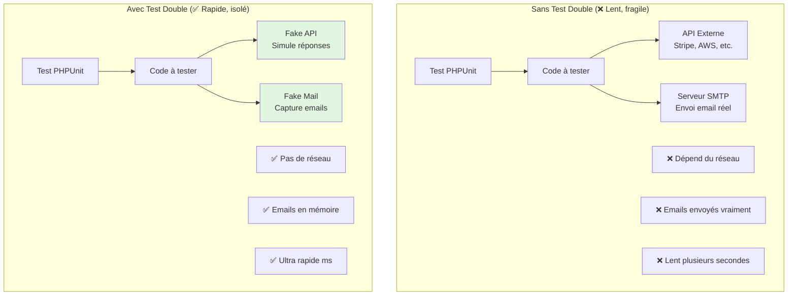
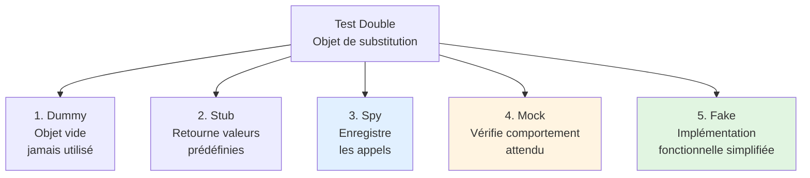

# V - Mocking & Fakes

<div
  class="omny-meta"
  data-level="🟡 Intermédiaire"
  data-version="1.0"
  data-time="10-12 heures">
</div>

## Introduction : Pourquoi Mocker les Dépendances ?

!!! quote "Analogie pédagogique"
    _Imaginez tester une voiture électrique. Pour vérifier que le moteur fonctionne, avez-vous **vraiment besoin** d'une batterie chargée à 100% ? Non ! Vous pouvez utiliser une **batterie de test** qui simule la charge. Pour tester les freins, avez-vous besoin de rouler à 130 km/h sur l'autoroute ? Non ! Vous utilisez un **banc de test** qui simule la vitesse. Le **mocking** fonctionne exactement pareil : vous **simulez les dépendances externes** (API, emails, fichiers) pour tester votre code **isolément**, sans attendre 5 secondes qu'un email soit envoyé ou qu'une API réponde._

Ce module approfondit le **mocking et les fakes** : simuler des dépendances pour isoler le code testé. Vous allez apprendre :

- Les 5 types de test doubles (Dummy, Stub, Spy, Mock, Fake)
- Utiliser tous les Laravel Fakes (Mail, Storage, Queue, Event, etc.)
- Mocker des APIs externes avec `Http::fake()`
- Utiliser Mockery pour mocker des classes PHP
- Tester sans effets de bord (pas d'emails envoyés, pas de fichiers créés)
- Vérifier les interactions avec les mocks (assertions avancées)

**À la fin de ce module, vous serez capable de tester du code complexe avec dépendances externes sans jamais toucher ces dépendances.**

---

## 1. Les 5 Types de Test Doubles

### 1.1 Qu'est-ce qu'un Test Double ?

**Un test double est un objet qui remplace une dépendance réelle dans un test.**

**Diagramme : Code avec vs sans Test Doubles**



### 1.2 Les 5 Types de Test Doubles

**Diagramme : Hiérarchie des Test Doubles**



**Tableau comparatif détaillé :**

| Type | Définition | Quand utiliser | Exemple |
|------|------------|----------------|---------|
| **Dummy** | Objet passé mais jamais utilisé | Remplir paramètre obligatoire | `new DummyLogger()` passé mais ignoré |
| **Stub** | Retourne réponses prédéfinies | Simuler réponse simple | API qui retourne toujours `['status' => 'ok']` |
| **Spy** | Enregistre tous les appels | Vérifier qu'une méthode a été appelée | Logger qui compte combien de fois `log()` a été appelé |
| **Mock** | Vérifie interactions attendues | Tester qu'une dépendance est appelée correctement | Vérifier que `sendEmail()` a été appelé avec bons params |
| **Fake** | Implémentation simplifiée fonctionnelle | Remplacer système complet | Filesystem en mémoire au lieu de disque réel |

### 1.3 Exemples Concrets de Chaque Type

**1. Dummy : Objet jamais utilisé**

```php
<?php

// Service qui a besoin d'un logger, mais ne l'utilise jamais dans ce test
class OrderService
{
    public function __construct(
        private LoggerInterface $logger
    ) {}
    
    public function calculateTotal(array $items): float
    {
        // Logger n'est pas utilisé ici
        return array_sum(array_column($items, 'price'));
    }
}

// Test avec Dummy
public function test_calculate_total(): void
{
    // DummyLogger : objet vide qui implémente LoggerInterface
    $dummyLogger = new class implements LoggerInterface {
        public function log($level, $message, array $context = []): void
        {
            // Rien, jamais appelé
        }
    };
    
    $service = new OrderService($dummyLogger);
    $total = $service->calculateTotal([
        ['price' => 10],
        ['price' => 20],
    ]);
    
    $this->assertSame(30.0, $total);
}
```

**2. Stub : Retourne valeurs prédéfinies**

```php
<?php

// API client qui appelle un service externe
interface WeatherApiInterface
{
    public function getCurrentTemperature(string $city): float;
}

class WeatherService
{
    public function __construct(
        private WeatherApiInterface $api
    ) {}
    
    public function isHot(string $city): bool
    {
        $temp = $this->api->getCurrentTemperature($city);
        return $temp > 30;
    }
}

// Test avec Stub
public function test_is_hot_returns_true_when_temperature_above_30(): void
{
    // Stub : retourne toujours 35
    $stubApi = new class implements WeatherApiInterface {
        public function getCurrentTemperature(string $city): float
        {
            return 35.0; // Valeur prédéfinie
        }
    };
    
    $service = new WeatherService($stubApi);
    
    $this->assertTrue($service->isHot('Paris'));
}

public function test_is_hot_returns_false_when_temperature_below_30(): void
{
    // Stub : retourne toujours 25
    $stubApi = new class implements WeatherApiInterface {
        public function getCurrentTemperature(string $city): float
        {
            return 25.0; // Autre valeur prédéfinie
        }
    };
    
    $service = new WeatherService($stubApi);
    
    $this->assertFalse($service->isHot('Paris'));
}
```

**3. Spy : Enregistre les appels**

```php
<?php

// Logger qui enregistre tous les appels
class SpyLogger implements LoggerInterface
{
    public array $logs = [];
    
    public function log($level, $message, array $context = []): void
    {
        // Enregistrer l'appel
        $this->logs[] = [
            'level' => $level,
            'message' => $message,
            'context' => $context,
        ];
    }
}

// Test avec Spy
public function test_order_creation_logs_event(): void
{
    $spyLogger = new SpyLogger();
    $service = new OrderService($spyLogger);
    
    $service->createOrder(['item' => 'Book']);
    
    // Vérifier que log() a été appelé
    $this->assertCount(1, $spyLogger->logs);
    $this->assertSame('info', $spyLogger->logs[0]['level']);
    $this->assertStringContainsString('Order created', $spyLogger->logs[0]['message']);
}
```

**4. Mock : Vérifie comportement attendu**

```php
<?php

use Mockery;

// Test avec Mock (Mockery)
public function test_order_sends_confirmation_email(): void
{
    // Mock : définit comportement attendu
    $mockMailer = Mockery::mock(MailerInterface::class);
    $mockMailer->shouldReceive('send')
        ->once()  // Doit être appelé exactement 1 fois
        ->with(Mockery::type(OrderConfirmationEmail::class)); // Avec bon type
    
    $service = new OrderService($mockMailer);
    $service->createOrder(['item' => 'Book']);
    
    // Mockery vérifie automatiquement les expectations
}
```

**5. Fake : Implémentation simplifiée fonctionnelle**

```php
<?php

// Fake : Filesystem en mémoire (Laravel Storage::fake())
public function test_upload_file(): void
{
    // Fake : crée un filesystem en mémoire
    Storage::fake('public');
    
    $file = UploadedFile::fake()->image('photo.jpg');
    
    // Uploader le fichier (va dans le fake, pas sur le disque)
    Storage::disk('public')->put('photos/photo.jpg', $file);
    
    // Vérifier qu'il existe dans le fake
    Storage::disk('public')->assertExists('photos/photo.jpg');
    
    // Le fichier n'existe PAS sur le vrai disque
}
```

---

## 2. Laravel Fakes : Mail, Storage, Queue, Event

### 2.1 Vue d'Ensemble des Laravel Fakes

**Laravel fournit des Fakes pour toutes les dépendances courantes.**

**Tableau des Fakes disponibles :**

| Facade | Méthode Fake | Usage |
|--------|--------------|-------|
| `Mail` | `Mail::fake()` | Capturer emails sans les envoyer |
| `Storage` | `Storage::fake('disk')` | Filesystem en mémoire |
| `Queue` | `Queue::fake()` | Capturer jobs sans les exécuter |
| `Event` | `Event::fake()` | Capturer events sans déclencher listeners |
| `Notification` | `Notification::fake()` | Capturer notifications |
| `Bus` | `Bus::fake()` | Capturer commandes bus |
| `Http` | `Http::fake()` | Mocker requêtes HTTP externes |

### 2.2 Mail::fake() - Tester Emails

**Code qui envoie un email :**

```php
<?php

namespace App\Http\Controllers;

use App\Mail\WelcomeEmail;
use Illuminate\Support\Facades\Mail;

class UserController extends Controller
{
    public function register(Request $request)
    {
        $user = User::create($request->validated());
        
        // Envoyer email de bienvenue
        Mail::to($user->email)->send(new WelcomeEmail($user));
        
        return redirect()->route('dashboard');
    }
}
```

**Tests avec Mail::fake() :**

```php
<?php

namespace Tests\Feature;

use Tests\TestCase;
use App\Models\User;
use App\Mail\WelcomeEmail;
use Illuminate\Support\Facades\Mail;
use Illuminate\Foundation\Testing\RefreshDatabase;

class EmailTest extends TestCase
{
    use RefreshDatabase;
    
    /**
     * Test : email de bienvenue envoyé lors de l'inscription.
     */
    public function test_welcome_email_sent_on_registration(): void
    {
        // Fake : capturer les emails sans les envoyer
        Mail::fake();
        
        // Act : Créer un user (déclenche l'envoi d'email)
        $response = $this->post('/register', [
            'name' => 'Alice',
            'email' => 'alice@example.com',
            'password' => 'password',
            'password_confirmation' => 'password',
        ]);
        
        // Assert : Vérifier que l'email a été envoyé
        Mail::assertSent(WelcomeEmail::class, function ($mail) {
            return $mail->hasTo('alice@example.com');
        });
    }
    
    /**
     * Test : email envoyé avec les bonnes données.
     */
    public function test_welcome_email_contains_user_data(): void
    {
        Mail::fake();
        
        $user = User::factory()->create([
            'name' => 'Bob',
            'email' => 'bob@example.com',
        ]);
        
        Mail::to($user->email)->send(new WelcomeEmail($user));
        
        // Vérifier avec closure détaillée
        Mail::assertSent(WelcomeEmail::class, function ($mail) use ($user) {
            return $mail->user->id === $user->id
                && $mail->hasTo($user->email)
                && $mail->user->name === 'Bob';
        });
    }
    
    /**
     * Test : email envoyé exactement 1 fois.
     */
    public function test_email_sent_once(): void
    {
        Mail::fake();
        
        $user = User::factory()->create();
        Mail::to($user->email)->send(new WelcomeEmail($user));
        
        // Vérifier envoyé exactement 1 fois
        Mail::assertSent(WelcomeEmail::class, 1);
    }
    
    /**
     * Test : aucun email envoyé.
     */
    public function test_no_email_sent_on_error(): void
    {
        Mail::fake();
        
        // Tentative d'inscription avec données invalides
        $response = $this->post('/register', [
            'email' => 'invalid-email', // Invalide
        ]);
        
        // Vérifier qu'AUCUN email n'a été envoyé
        Mail::assertNothingSent();
    }
    
    /**
     * Test : email PAS envoyé à une adresse spécifique.
     */
    public function test_email_not_sent_to_specific_address(): void
    {
        Mail::fake();
        
        $user = User::factory()->create(['email' => 'alice@example.com']);
        Mail::to($user->email)->send(new WelcomeEmail($user));
        
        // Vérifier qu'aucun email envoyé à bob@example.com
        Mail::assertNotSent(WelcomeEmail::class, function ($mail) {
            return $mail->hasTo('bob@example.com');
        });
    }
}
```

**Assertions Mail disponibles :**

| Assertion | Usage |
|-----------|-------|
| `Mail::assertSent($mailable, $callback)` | Email envoyé avec conditions |
| `Mail::assertSent($mailable, $count)` | Email envoyé N fois exactement |
| `Mail::assertNotSent($mailable, $callback)` | Email PAS envoyé |
| `Mail::assertNothingSent()` | Aucun email envoyé |
| `Mail::assertQueued($mailable, $callback)` | Email mis en queue |
| `Mail::assertNotQueued($mailable)` | Email PAS mis en queue |

### 2.3 Storage::fake() - Tester Upload Fichiers

**Code qui upload un fichier :**

```php
<?php

namespace App\Http\Controllers;

use Illuminate\Http\Request;
use Illuminate\Support\Facades\Storage;

class PostImageController extends Controller
{
    public function store(Request $request, Post $post)
    {
        $request->validate([
            'image' => 'required|image|max:2048',
        ]);
        
        // Upload l'image
        $path = $request->file('image')->store('posts/' . $post->id, 'public');
        
        // Créer record en DB
        $post->images()->create([
            'path' => $path,
            'is_main' => $post->images()->count() === 0,
        ]);
        
        return redirect()->back();
    }
}
```

**Tests avec Storage::fake() :**

```php
<?php

namespace Tests\Feature;

use Tests\TestCase;
use App\Models\User;
use App\Models\Post;
use Illuminate\Http\UploadedFile;
use Illuminate\Support\Facades\Storage;
use Illuminate\Foundation\Testing\RefreshDatabase;

class FileUploadTest extends TestCase
{
    use RefreshDatabase;
    
    /**
     * Test : upload image réussit.
     */
    public function test_user_can_upload_post_image(): void
    {
        // Fake : créer filesystem en mémoire
        Storage::fake('public');
        
        $user = User::factory()->create();
        $post = Post::factory()->for($user)->create();
        
        // Créer une fausse image
        $image = UploadedFile::fake()->image('post.jpg', 800, 600);
        
        // Upload
        $response = $this->actingAs($user)
            ->post(route('posts.images.store', $post), [
                'image' => $image,
            ]);
        
        $response->assertRedirect();
        
        // Vérifier que le fichier existe dans le fake storage
        Storage::disk('public')->assertExists('posts/' . $post->id . '/' . $image->hashName());
        
        // Vérifier record en DB
        $this->assertDatabaseHas('post_images', [
            'post_id' => $post->id,
        ]);
    }
    
    /**
     * Test : fichier trop gros est rejeté.
     */
    public function test_large_file_rejected(): void
    {
        Storage::fake('public');
        
        $user = User::factory()->create();
        $post = Post::factory()->for($user)->create();
        
        // Créer fichier de 3MB (max = 2MB)
        $largeFile = UploadedFile::fake()->image('large.jpg')->size(3072);
        
        $response = $this->actingAs($user)
            ->post(route('posts.images.store', $post), [
                'image' => $largeFile,
            ]);
        
        $response->assertSessionHasErrors('image');
        
        // Vérifier qu'aucun fichier n'a été uploadé
        Storage::disk('public')->assertMissing('posts/' . $post->id . '/' . $largeFile->hashName());
    }
    
    /**
     * Test : seules les images sont acceptées.
     */
    public function test_only_images_accepted(): void
    {
        Storage::fake('public');
        
        $user = User::factory()->create();
        $post = Post::factory()->for($user)->create();
        
        // Créer un fichier PDF (pas une image)
        $pdfFile = UploadedFile::fake()->create('document.pdf', 1024);
        
        $response = $this->actingAs($user)
            ->post(route('posts.images.store', $post), [
                'image' => $pdfFile,
            ]);
        
        $response->assertSessionHasErrors('image');
    }
    
    /**
     * Test : vérifier contenu du fichier uploadé.
     */
    public function test_uploaded_file_content(): void
    {
        Storage::fake('public');
        
        $user = User::factory()->create();
        $post = Post::factory()->for($user)->create();
        
        $image = UploadedFile::fake()->image('test.jpg', 800, 600);
        
        $this->actingAs($user)
            ->post(route('posts.images.store', $post), ['image' => $image]);
        
        $path = 'posts/' . $post->id . '/' . $image->hashName();
        
        // Vérifier existence
        Storage::disk('public')->assertExists($path);
        
        // Récupérer le contenu
        $storedContent = Storage::disk('public')->get($path);
        
        // Vérifier que c'est bien le même fichier
        $this->assertNotEmpty($storedContent);
    }
    
    /**
     * Test : supprimer fichier.
     */
    public function test_delete_uploaded_file(): void
    {
        Storage::fake('public');
        
        $user = User::factory()->create();
        $post = Post::factory()->for($user)->create();
        
        $image = UploadedFile::fake()->image('test.jpg');
        
        // Upload
        $this->actingAs($user)
            ->post(route('posts.images.store', $post), ['image' => $image]);
        
        $path = 'posts/' . $post->id . '/' . $image->hashName();
        Storage::disk('public')->assertExists($path);
        
        // Supprimer
        Storage::disk('public')->delete($path);
        
        // Vérifier suppression
        Storage::disk('public')->assertMissing($path);
    }
}
```

**Assertions Storage disponibles :**

| Assertion | Usage |
|-----------|-------|
| `Storage::disk('disk')->assertExists($path)` | Fichier existe |
| `Storage::disk('disk')->assertMissing($path)` | Fichier n'existe pas |
| `Storage::disk('disk')->assertDirectoryEmpty($directory)` | Dossier vide |

**Créer faux fichiers avec UploadedFile::fake() :**

```php
// Image
$image = UploadedFile::fake()->image('photo.jpg', 800, 600);

// Fichier avec taille spécifique (en KB)
$file = UploadedFile::fake()->create('document.pdf', 1024);

// Image avec type MIME spécifique
$image = UploadedFile::fake()->image('photo.png')->mimeType('image/png');
```

### 2.4 Queue::fake() - Tester Jobs

**Code qui dispatch un job :**

```php
<?php

namespace App\Http\Controllers;

use App\Jobs\ProcessNewPost;
use Illuminate\Support\Facades\Queue;

class PostController extends Controller
{
    public function store(Request $request)
    {
        $post = Post::create($request->validated());
        
        // Dispatcher job pour traitement asynchrone
        ProcessNewPost::dispatch($post);
        
        return redirect()->route('posts.show', $post);
    }
}
```

**Tests avec Queue::fake() :**

```php
<?php

namespace Tests\Feature;

use Tests\TestCase;
use App\Models\User;
use App\Models\Post;
use App\Jobs\ProcessNewPost;
use Illuminate\Support\Facades\Queue;
use Illuminate\Foundation\Testing\RefreshDatabase;

class QueueTest extends TestCase
{
    use RefreshDatabase;
    
    /**
     * Test : job dispatché lors de création post.
     */
    public function test_job_dispatched_when_post_created(): void
    {
        // Fake : capturer jobs sans les exécuter
        Queue::fake();
        
        $user = User::factory()->create();
        
        // Créer un post (dispatch le job)
        $response = $this->actingAs($user)->post('/posts', [
            'title' => 'Test Post',
            'body' => str_repeat('Content ', 20),
        ]);
        
        // Vérifier que le job a été dispatché
        Queue::assertPushed(ProcessNewPost::class);
    }
    
    /**
     * Test : job dispatché avec les bonnes données.
     */
    public function test_job_dispatched_with_correct_post(): void
    {
        Queue::fake();
        
        $user = User::factory()->create();
        $post = Post::factory()->for($user)->create();
        
        ProcessNewPost::dispatch($post);
        
        // Vérifier avec closure
        Queue::assertPushed(ProcessNewPost::class, function ($job) use ($post) {
            return $job->post->id === $post->id;
        });
    }
    
    /**
     * Test : job dispatché exactement 1 fois.
     */
    public function test_job_pushed_once(): void
    {
        Queue::fake();
        
        $post = Post::factory()->create();
        ProcessNewPost::dispatch($post);
        
        Queue::assertPushed(ProcessNewPost::class, 1);
    }
    
    /**
     * Test : job PAS dispatché en cas d'erreur.
     */
    public function test_job_not_pushed_on_validation_error(): void
    {
        Queue::fake();
        
        $user = User::factory()->create();
        
        // Tentative avec données invalides
        $response = $this->actingAs($user)->post('/posts', [
            'title' => '', // Invalide
        ]);
        
        // Job ne doit pas être dispatché
        Queue::assertNothingPushed();
    }
    
    /**
     * Test : job dispatché sur queue spécifique.
     */
    public function test_job_pushed_on_specific_queue(): void
    {
        Queue::fake();
        
        $post = Post::factory()->create();
        ProcessNewPost::dispatch($post)->onQueue('high-priority');
        
        Queue::assertPushedOn('high-priority', ProcessNewPost::class);
    }
}
```

**Assertions Queue disponibles :**

| Assertion | Usage |
|-----------|-------|
| `Queue::assertPushed($job, $callback)` | Job dispatché |
| `Queue::assertPushed($job, $count)` | Job dispatché N fois |
| `Queue::assertNotPushed($job)` | Job PAS dispatché |
| `Queue::assertNothingPushed()` | Aucun job dispatché |
| `Queue::assertPushedOn($queue, $job)` | Job sur queue spécifique |

### 2.5 Event::fake() - Tester Events

**Code qui dispatch un event :**

```php
<?php

namespace App\Http\Controllers;

use App\Events\PostPublished;
use Illuminate\Support\Facades\Event;

class AdminPostController extends Controller
{
    public function approve(Post $post)
    {
        $post->update([
            'status' => PostStatus::PUBLISHED,
            'published_at' => now(),
        ]);
        
        // Dispatcher event
        Event::dispatch(new PostPublished($post));
        
        return redirect()->back();
    }
}
```

**Tests avec Event::fake() :**

```php
<?php

namespace Tests\Feature;

use Tests\TestCase;
use App\Models\User;
use App\Models\Post;
use App\Events\PostPublished;
use Illuminate\Support\Facades\Event;
use Illuminate\Foundation\Testing\RefreshDatabase;

class EventTest extends TestCase
{
    use RefreshDatabase;
    
    /**
     * Test : event dispatché lors de publication.
     */
    public function test_event_dispatched_when_post_published(): void
    {
        // Fake : capturer events sans déclencher listeners
        Event::fake();
        
        $admin = User::factory()->create(['role' => 'admin']);
        $post = Post::factory()->create(['status' => PostStatus::SUBMITTED]);
        
        // Approuver le post
        $this->actingAs($admin)
            ->post(route('admin.posts.approve', $post));
        
        // Vérifier que l'event a été dispatché
        Event::assertDispatched(PostPublished::class);
    }
    
    /**
     * Test : event dispatché avec bon post.
     */
    public function test_event_dispatched_with_correct_post(): void
    {
        Event::fake();
        
        $admin = User::factory()->create(['role' => 'admin']);
        $post = Post::factory()->create(['status' => PostStatus::SUBMITTED]);
        
        $this->actingAs($admin)
            ->post(route('admin.posts.approve', $post));
        
        Event::assertDispatched(PostPublished::class, function ($event) use ($post) {
            return $event->post->id === $post->id;
        });
    }
    
    /**
     * Test : event PAS dispatché si échec.
     */
    public function test_event_not_dispatched_on_failure(): void
    {
        Event::fake();
        
        $author = User::factory()->create(['role' => 'author']);
        $post = Post::factory()->create(['status' => PostStatus::SUBMITTED]);
        
        // Auteur ne peut pas approuver (403)
        $this->actingAs($author)
            ->post(route('admin.posts.approve', $post));
        
        Event::assertNotDispatched(PostPublished::class);
    }
    
    /**
     * Test : fake seulement certains events.
     */
    public function test_fake_only_specific_events(): void
    {
        // Fake uniquement PostPublished, les autres events fonctionnent normalement
        Event::fake([PostPublished::class]);
        
        $admin = User::factory()->create(['role' => 'admin']);
        $post = Post::factory()->create(['status' => PostStatus::SUBMITTED]);
        
        $this->actingAs($admin)
            ->post(route('admin.posts.approve', $post));
        
        Event::assertDispatched(PostPublished::class);
    }
}
```

**Assertions Event disponibles :**

| Assertion | Usage |
|-----------|-------|
| `Event::assertDispatched($event, $callback)` | Event dispatché |
| `Event::assertDispatched($event, $count)` | Event dispatché N fois |
| `Event::assertNotDispatched($event)` | Event PAS dispatché |
| `Event::assertNothingDispatched()` | Aucun event dispatché |
| `Event::assertListening($event, $listener)` | Listener enregistré pour event |

---

## 3. Http::fake() - Mocker APIs Externes

### 3.1 Problème : Tester Code qui Appelle API Externe

**Code qui appelle une API externe :**

```php
<?php

namespace App\Services;

use Illuminate\Support\Facades\Http;

class SpamDetectionService
{
    /**
     * Vérifier si un texte est spam via API Akismet.
     */
    public function isSpam(string $content): bool
    {
        $response = Http::post('https://api.akismet.com/1.1/comment-check', [
            'blog' => config('app.url'),
            'comment_content' => $content,
        ]);
        
        return $response->body() === 'true';
    }
}
```

**Problème si on teste sans Http::fake() :**
- ❌ Appels réels à l'API (lent, coûteux, limité)
- ❌ Besoin d'Internet
- ❌ Dépend de la disponibilité de l'API
- ❌ Peut échouer aléatoirement

### 3.2 Solution : Http::fake()

**Tests avec Http::fake() :**

```php
<?php

namespace Tests\Feature;

use Tests\TestCase;
use App\Services\SpamDetectionService;
use Illuminate\Support\Facades\Http;

class SpamDetectionTest extends TestCase
{
    /**
     * Test : détecte spam correctement.
     */
    public function test_detects_spam_content(): void
    {
        // Fake : simuler réponse API
        Http::fake([
            'api.akismet.com/*' => Http::response('true', 200),
        ]);
        
        $service = new SpamDetectionService();
        $isSpam = $service->isSpam('Buy cheap viagra now!!!');
        
        $this->assertTrue($isSpam);
        
        // Vérifier que l'API a été appelée
        Http::assertSent(function ($request) {
            return $request->url() === 'https://api.akismet.com/1.1/comment-check'
                && $request['comment_content'] === 'Buy cheap viagra now!!!';
        });
    }
    
    /**
     * Test : contenu légitime n'est pas spam.
     */
    public function test_legitimate_content_not_spam(): void
    {
        // Fake : API retourne 'false'
        Http::fake([
            'api.akismet.com/*' => Http::response('false', 200),
        ]);
        
        $service = new SpamDetectionService();
        $isSpam = $service->isSpam('Hello, this is a legitimate comment.');
        
        $this->assertFalse($isSpam);
    }
    
    /**
     * Test : gérer erreur API.
     */
    public function test_handles_api_error_gracefully(): void
    {
        // Fake : API retourne 500 Server Error
        Http::fake([
            'api.akismet.com/*' => Http::response('Internal Server Error', 500),
        ]);
        
        $service = new SpamDetectionService();
        
        // Le service devrait gérer l'erreur (par exemple, considérer comme non-spam par défaut)
        $this->expectException(\Exception::class);
        $service->isSpam('Some content');
    }
}
```

### 3.3 Patterns de Http::fake()

**1. Fake toutes les requêtes HTTP :**

```php
// Toutes les requêtes retournent 200 OK avec body vide
Http::fake();

// Faire une requête (sera fakée)
$response = Http::get('https://api.example.com/users');
```

**2. Fake URL spécifique :**

```php
Http::fake([
    'github.com/*' => Http::response(['name' => 'Taylor'], 200),
    'google.com/*' => Http::response('Google Homepage', 200),
]);
```

**3. Fake avec callback :**

```php
Http::fake(function ($request) {
    if ($request->url() === 'https://api.example.com/users') {
        return Http::response(['users' => []], 200);
    }
    
    return Http::response('Not Found', 404);
});
```

**4. Fake avec séquence (réponses différentes) :**

```php
Http::fake([
    'api.example.com/*' => Http::sequence()
        ->push(['result' => 'ok'], 200)      // 1ère requête
        ->push(['result' => 'pending'], 200) // 2ème requête
        ->push(['result' => 'error'], 500),  // 3ème requête
]);
```

**5. Fake avec fichier JSON :**

```php
Http::fake([
    'api.example.com/users' => Http::response(
        json_decode(file_get_contents(base_path('tests/Fixtures/users.json')), true),
        200
    ),
]);
```

### 3.4 Assertions Http

**Vérifier qu'une requête a été envoyée :**

```php
public function test_api_called_correctly(): void
{
    Http::fake();
    
    // Code qui fait une requête HTTP
    Http::post('https://api.example.com/posts', [
        'title' => 'Test Post',
        'body' => 'Content',
    ]);
    
    // Vérifier que la requête a été envoyée
    Http::assertSent(function ($request) {
        return $request->url() === 'https://api.example.com/posts'
            && $request['title'] === 'Test Post';
    });
}
```

**Assertions Http disponibles :**

| Assertion | Usage |
|-----------|-------|
| `Http::assertSent($callback)` | Requête envoyée |
| `Http::assertSentCount($count)` | N requêtes envoyées |
| `Http::assertNotSent($callback)` | Requête PAS envoyée |
| `Http::assertNothingSent()` | Aucune requête envoyée |

### 3.5 Exemple Complet : Service Météo

**Service qui appelle API météo :**

```php
<?php

namespace App\Services;

use Illuminate\Support\Facades\Http;

class WeatherService
{
    private string $apiKey;
    private string $baseUrl = 'https://api.openweathermap.org/data/2.5';
    
    public function __construct()
    {
        $this->apiKey = config('services.openweather.key');
    }
    
    public function getCurrentWeather(string $city): array
    {
        $response = Http::get("{$this->baseUrl}/weather", [
            'q' => $city,
            'appid' => $this->apiKey,
            'units' => 'metric',
        ]);
        
        if ($response->failed()) {
            throw new \Exception('Weather API request failed');
        }
        
        return $response->json();
    }
    
    public function getTemperature(string $city): float
    {
        $data = $this->getCurrentWeather($city);
        return $data['main']['temp'];
    }
    
    public function isCold(string $city): bool
    {
        return $this->getTemperature($city) < 10;
    }
}
```

**Tests complets :**

```php
<?php

namespace Tests\Unit;

use Tests\TestCase;
use App\Services\WeatherService;
use Illuminate\Support\Facades\Http;

class WeatherServiceTest extends TestCase
{
    /**
     * Test : récupérer météo actuelle.
     */
    public function test_get_current_weather(): void
    {
        // Fake : simuler réponse API OpenWeather
        Http::fake([
            'api.openweathermap.org/*' => Http::response([
                'main' => [
                    'temp' => 22.5,
                    'feels_like' => 21.3,
                    'humidity' => 65,
                ],
                'weather' => [
                    ['description' => 'clear sky'],
                ],
            ], 200),
        ]);
        
        $service = new WeatherService();
        $weather = $service->getCurrentWeather('Paris');
        
        $this->assertArrayHasKey('main', $weather);
        $this->assertSame(22.5, $weather['main']['temp']);
    }
    
    /**
     * Test : obtenir température.
     */
    public function test_get_temperature(): void
    {
        Http::fake([
            'api.openweathermap.org/*' => Http::response([
                'main' => ['temp' => 15.7],
            ], 200),
        ]);
        
        $service = new WeatherService();
        $temp = $service->getTemperature('Paris');
        
        $this->assertSame(15.7, $temp);
    }
    
    /**
     * Test : isCold retourne true si température < 10.
     */
    public function test_is_cold_returns_true_when_temperature_below_10(): void
    {
        Http::fake([
            'api.openweathermap.org/*' => Http::response([
                'main' => ['temp' => 5.0],
            ], 200),
        ]);
        
        $service = new WeatherService();
        
        $this->assertTrue($service->isCold('Oslo'));
    }
    
    /**
     * Test : isCold retourne false si température >= 10.
     */
    public function test_is_cold_returns_false_when_temperature_above_10(): void
    {
        Http::fake([
            'api.openweathermap.org/*' => Http::response([
                'main' => ['temp' => 25.0],
            ], 200),
        ]);
        
        $service = new WeatherService();
        
        $this->assertFalse($service->isCold('Nice'));
    }
    
    /**
     * Test : gérer erreur API (404 ville non trouvée).
     */
    public function test_handles_city_not_found(): void
    {
        Http::fake([
            'api.openweathermap.org/*' => Http::response([
                'message' => 'city not found',
            ], 404),
        ]);
        
        $service = new WeatherService();
        
        $this->expectException(\Exception::class);
        $service->getCurrentWeather('NonexistentCity');
    }
    
    /**
     * Test : vérifier paramètres de la requête.
     */
    public function test_api_called_with_correct_parameters(): void
    {
        Http::fake();
        
        $service = new WeatherService();
        $service->getCurrentWeather('Paris');
        
        // Vérifier que la requête a les bons paramètres
        Http::assertSent(function ($request) {
            return $request->url() === 'https://api.openweathermap.org/data/2.5/weather'
                && $request['q'] === 'Paris'
                && $request['units'] === 'metric'
                && isset($request['appid']);
        });
    }
}
```

---

## 4. Mockery : Mocker Classes PHP

### 4.1 Qu'est-ce que Mockery ?

**Mockery est une librairie de mocking pour PHP** (incluse dans Laravel par défaut).

**Quand utiliser Mockery ?**
- Mocker des classes PHP personnalisées
- Mocker des dépendances complexes
- Vérifier que des méthodes sont appelées avec bons paramètres

### 4.2 Installation et Configuration

**Mockery est déjà installé avec Laravel :**

```json
{
    "require-dev": {
        "mockery/mockery": "^1.6"
    }
}
```

**Important : Toujours fermer Mockery après les tests :**

```php
protected function tearDown(): void
{
    Mockery::close(); // Libère les mocks
    parent::tearDown();
}
```

### 4.3 Exemples de Mocking avec Mockery

**Service à mocker :**

```php
<?php

namespace App\Services;

interface PaymentGatewayInterface
{
    public function charge(int $amount, string $token): array;
    public function refund(string $chargeId): bool;
}
```

**Tests avec Mockery :**

```php
<?php

namespace Tests\Unit;

use Tests\TestCase;
use App\Services\PaymentGatewayInterface;
use App\Services\OrderService;
use Mockery;

class OrderServiceTest extends TestCase
{
    protected function tearDown(): void
    {
        Mockery::close();
        parent::tearDown();
    }
    
    /**
     * Test : créer commande charge le paiement.
     */
    public function test_create_order_charges_payment(): void
    {
        // Créer un mock de PaymentGateway
        $mockGateway = Mockery::mock(PaymentGatewayInterface::class);
        
        // Définir comportement attendu
        $mockGateway->shouldReceive('charge')
            ->once()  // Doit être appelé exactement 1 fois
            ->with(5000, 'tok_visa')  // Avec ces paramètres exacts
            ->andReturn([
                'id' => 'ch_123',
                'status' => 'succeeded',
            ]);
        
        // Créer service avec mock injecté
        $service = new OrderService($mockGateway);
        
        // Exécuter
        $order = $service->createOrder(5000, 'tok_visa');
        
        // Mockery vérifie automatiquement les expectations
    }
    
    /**
     * Test : remboursement appelle refund().
     */
    public function test_cancel_order_refunds_payment(): void
    {
        $mockGateway = Mockery::mock(PaymentGatewayInterface::class);
        
        $mockGateway->shouldReceive('refund')
            ->once()
            ->with('ch_123')
            ->andReturn(true);
        
        $service = new OrderService($mockGateway);
        $result = $service->cancelOrder('ch_123');
        
        $this->assertTrue($result);
    }
    
    /**
     * Test : vérifier nombre d'appels.
     */
    public function test_retry_logic_calls_charge_multiple_times(): void
    {
        $mockGateway = Mockery::mock(PaymentGatewayInterface::class);
        
        // Simuler 2 échecs puis 1 succès
        $mockGateway->shouldReceive('charge')
            ->times(3)  // Appelé exactement 3 fois
            ->andReturn(
                ['status' => 'failed'],
                ['status' => 'failed'],
                ['status' => 'succeeded']
            );
        
        $service = new OrderService($mockGateway);
        $service->createOrderWithRetry(5000, 'tok_visa');
    }
    
    /**
     * Test : paramètres partiels avec Mockery::any().
     */
    public function test_charge_called_with_any_token(): void
    {
        $mockGateway = Mockery::mock(PaymentGatewayInterface::class);
        
        $mockGateway->shouldReceive('charge')
            ->with(5000, Mockery::any())  // N'importe quel token
            ->andReturn(['status' => 'succeeded']);
        
        $service = new OrderService($mockGateway);
        $service->createOrder(5000, 'any_token_here');
    }
}
```

### 4.4 Patterns Mockery Avancés

**1. Spy : Enregistrer sans définir comportement**

```php
$spy = Mockery::spy(PaymentGatewayInterface::class);

$service = new OrderService($spy);
$service->createOrder(5000, 'tok_visa');

// Vérifier après coup
$spy->shouldHaveReceived('charge')
    ->once()
    ->with(5000, 'tok_visa');
```

**2. Partial Mock : Mocker seulement certaines méthodes**

```php
$partialMock = Mockery::mock(OrderService::class)->makePartial();

// Mocker seulement calculateTax()
$partialMock->shouldReceive('calculateTax')
    ->andReturn(1000);

// Les autres méthodes fonctionnent normalement
```

**3. Matcher de type**

```php
$mock->shouldReceive('process')
    ->with(Mockery::type('array'))
    ->andReturn(true);
```

**4. Callback personnalisé**

```php
$mock->shouldReceive('validate')
    ->with(Mockery::on(function ($argument) {
        return $argument > 0 && $argument < 10000;
    }))
    ->andReturn(true);
```

---

## 5. Combiner Plusieurs Fakes

### 5.1 Exemple Complet : Publication Post avec Notifications

**Code qui utilise plusieurs dépendances :**

```php
<?php

namespace App\Services;

use App\Models\Post;
use App\Models\User;
use App\Events\PostPublished;
use App\Jobs\ProcessPostImage;
use App\Mail\PostApprovedMail;
use Illuminate\Support\Facades\Event;
use Illuminate\Support\Facades\Mail;
use Illuminate\Support\Facades\Queue;
use Illuminate\Support\Facades\Storage;

class PostPublishingService
{
    public function publish(Post $post, User $reviewer): void
    {
        // 1. Mettre à jour le post
        $post->update([
            'status' => PostStatus::PUBLISHED,
            'published_at' => now(),
            'reviewed_by' => $reviewer->id,
        ]);
        
        // 2. Dispatcher event
        Event::dispatch(new PostPublished($post));
        
        // 3. Envoyer email à l'auteur
        Mail::to($post->user->email)->send(new PostApprovedMail($post));
        
        // 4. Dispatcher job pour traiter l'image
        if ($post->images->isNotEmpty()) {
            ProcessPostImage::dispatch($post->images->first());
        }
        
        // 5. Copier image vers CDN
        if ($post->mainImage) {
            Storage::disk('cdn')->put(
                'posts/' . $post->id . '.jpg',
                Storage::disk('public')->get($post->mainImage->path)
            );
        }
    }
}
```

**Test avec multiples fakes :**

```php
<?php

namespace Tests\Feature;

use Tests\TestCase;
use App\Models\User;
use App\Models\Post;
use App\Models\PostImage;
use App\Services\PostPublishingService;
use App\Events\PostPublished;
use App\Jobs\ProcessPostImage;
use App\Mail\PostApprovedMail;
use Illuminate\Support\Facades\Event;
use Illuminate\Support\Facades\Mail;
use Illuminate\Support\Facades\Queue;
use Illuminate\Support\Facades\Storage;
use Illuminate\Foundation\Testing\RefreshDatabase;

class CompletePublishingFlowTest extends TestCase
{
    use RefreshDatabase;
    
    /**
     * Test : workflow complet de publication.
     */
    public function test_complete_publishing_workflow(): void
    {
        // Fakes : tous les systèmes externes
        Event::fake();
        Mail::fake();
        Queue::fake();
        Storage::fake('public');
        Storage::fake('cdn');
        
        // Arrange
        $author = User::factory()->create(['email' => 'author@example.com']);
        $reviewer = User::factory()->create(['role' => 'admin']);
        
        $post = Post::factory()
            ->for($author)
            ->create(['status' => PostStatus::SUBMITTED]);
        
        $image = PostImage::factory()
            ->for($post)
            ->create(['path' => 'posts/1/image.jpg', 'is_main' => true]);
        
        // Créer fichier image dans fake storage
        Storage::disk('public')->put('posts/1/image.jpg', 'fake image content');
        
        // Act
        $service = new PostPublishingService();
        $service->publish($post, $reviewer);
        
        // Assert : Vérifier TOUTE la chaîne
        
        // 1. Post mis à jour
        $post->refresh();
        $this->assertEquals(PostStatus::PUBLISHED, $post->status);
        $this->assertNotNull($post->published_at);
        $this->assertEquals($reviewer->id, $post->reviewed_by);
        
        // 2. Event dispatché
        Event::assertDispatched(PostPublished::class, function ($event) use ($post) {
            return $event->post->id === $post->id;
        });
        
        // 3. Email envoyé
        Mail::assertSent(PostApprovedMail::class, function ($mail) use ($author) {
            return $mail->hasTo($author->email);
        });
        
        // 4. Job dispatché
        Queue::assertPushed(ProcessPostImage::class, function ($job) use ($image) {
            return $job->image->id === $image->id;
        });
        
        // 5. Image copiée vers CDN
        Storage::disk('cdn')->assertExists('posts/' . $post->id . '.jpg');
    }
    
    /**
     * Test : échec si une étape échoue (sans transaction dans cet exemple).
     */
    public function test_handles_email_failure_gracefully(): void
    {
        Event::fake();
        Queue::fake();
        Storage::fake('public');
        Storage::fake('cdn');
        
        // Simuler échec d'envoi email
        Mail::fake();
        Mail::shouldReceive('to')->andThrow(new \Exception('SMTP error'));
        
        $author = User::factory()->create();
        $reviewer = User::factory()->create(['role' => 'admin']);
        $post = Post::factory()->for($author)->create(['status' => PostStatus::SUBMITTED]);
        
        $service = new PostPublishingService();
        
        // Devrait gérer l'erreur gracieusement
        $this->expectException(\Exception::class);
        $service->publish($post, $reviewer);
    }
}
```

---

## 6. Exercices de Consolidation

### Exercice 1 : Tester Service de Notification Multi-Canal

**Service qui envoie notifications par email ET push :**

```php
class NotificationService
{
    public function notify(User $user, string $message): void
    {
        // Email
        Mail::to($user->email)->send(new GenericNotification($message));
        
        // Push notification (API externe)
        Http::post('https://api.pusher.com/send', [
            'user_id' => $user->id,
            'message' => $message,
        ]);
        
        // Enregistrer en DB
        $user->notifications()->create([
            'message' => $message,
            'read_at' => null,
        ]);
    }
}
```

**Tester :**
1. Email envoyé
2. API pusher appelée avec bons params
3. Notification créée en DB
4. Gérer échec API pusher (continue avec email)

<details>
<summary>Solution</summary>

```php
public function test_notification_sent_via_all_channels(): void
{
    Mail::fake();
    Http::fake();
    
    $user = User::factory()->create(['email' => 'user@example.com']);
    $service = new NotificationService();
    
    $service->notify($user, 'Hello World');
    
    // Vérifier email
    Mail::assertSent(GenericNotification::class, function ($mail) use ($user) {
        return $mail->hasTo($user->email);
    });
    
    // Vérifier API push
    Http::assertSent(function ($request) use ($user) {
        return $request->url() === 'https://api.pusher.com/send'
            && $request['user_id'] === $user->id
            && $request['message'] === 'Hello World';
    });
    
    // Vérifier DB
    $this->assertDatabaseHas('notifications', [
        'user_id' => $user->id,
        'message' => 'Hello World',
    ]);
}

public function test_handles_pusher_api_failure(): void
{
    Mail::fake();
    Http::fake([
        'api.pusher.com/*' => Http::response('Service Unavailable', 503),
    ]);
    
    $user = User::factory()->create();
    $service = new NotificationService();
    
    // Devrait continuer même si pusher échoue
    $service->notify($user, 'Test');
    
    // Email quand même envoyé
    Mail::assertSent(GenericNotification::class);
}
```

</details>

### Exercice 2 : Mocker Repository Pattern

**Repository interface :**

```php
interface PostRepositoryInterface
{
    public function findPublished(): Collection;
    public function findByAuthor(User $author): Collection;
    public function create(array $data): Post;
}
```

**Mocker avec Mockery et tester un service qui l'utilise.**

<details>
<summary>Solution</summary>

```php
public function test_service_uses_repository_correctly(): void
{
    $mockRepo = Mockery::mock(PostRepositoryInterface::class);
    
    $expectedPosts = collect([
        new Post(['title' => 'Post 1']),
        new Post(['title' => 'Post 2']),
    ]);
    
    $mockRepo->shouldReceive('findPublished')
        ->once()
        ->andReturn($expectedPosts);
    
    $service = new PostListingService($mockRepo);
    $posts = $service->getPublishedPosts();
    
    $this->assertCount(2, $posts);
}
```

</details>

---

## 7. Checkpoint de Progression

### À la fin de ce Module 5, vous devriez être capable de :

**Concepts de Mocking :**
- [x] Différencier les 5 types de test doubles (Dummy, Stub, Spy, Mock, Fake)
- [x] Savoir quand utiliser chaque type
- [x] Comprendre pourquoi isoler les dépendances
- [x] Éviter les effets de bord dans les tests

**Laravel Fakes :**
- [x] Utiliser Mail::fake() pour capturer emails
- [x] Utiliser Storage::fake() pour tester uploads
- [x] Utiliser Queue::fake() pour capturer jobs
- [x] Utiliser Event::fake() pour capturer events
- [x] Combiner plusieurs fakes dans un test

**Http::fake() :**
- [x] Mocker des APIs externes
- [x] Définir réponses différentes par URL
- [x] Vérifier paramètres des requêtes
- [x] Gérer erreurs API (404, 500, etc.)
- [x] Utiliser séquences pour réponses multiples

**Mockery :**
- [x] Créer des mocks de classes PHP
- [x] Définir expectations (shouldReceive, times, with)
- [x] Utiliser spies pour vérifier après coup
- [x] Créer partial mocks
- [x] Fermer Mockery après les tests

**Avancé :**
- [x] Combiner multiples fakes dans un workflow
- [x] Tester code avec dépendances complexes
- [x] Isoler totalement le code testé
- [x] Vérifier interactions sans exécuter code réel

### Auto-évaluation (10 questions)

1. **Différence entre Stub et Mock ?**
   <details>
   <summary>Réponse</summary>
   Stub retourne valeurs prédéfinies. Mock vérifie que méthodes sont appelées correctement.
   </details>

2. **Comment capturer emails sans les envoyer ?**
   <details>
   <summary>Réponse</summary>
   `Mail::fake()` puis `Mail::assertSent()`
   </details>

3. **Comment vérifier qu'un fichier a été uploadé dans Storage fake ?**
   <details>
   <summary>Réponse</summary>
   `Storage::disk('disk')->assertExists('path/to/file.jpg')`
   </details>

4. **Syntaxe pour mocker une API qui retourne JSON ?**
   <details>
   <summary>Réponse</summary>
   `Http::fake(['api.example.com/*' => Http::response(['data' => 'value'], 200)])`
   </details>

5. **Pourquoi appeler Mockery::close() dans tearDown() ?**
   <details>
   <summary>Réponse</summary>
   Libère les mocks et vérifie les expectations. Sans ça, tests peuvent ne pas échouer.
   </details>

6. **Comment vérifier qu'un job a été dispatché exactement 2 fois ?**
   <details>
   <summary>Réponse</summary>
   `Queue::assertPushed(JobClass::class, 2)`
   </details>

7. **Différence entre Mail::fake() et Mail::fake([MailClass::class]) ?**
   <details>
   <summary>Réponse</summary>
   Avec array : fake seulement ces classes. Sans : fake tout.
   </details>

8. **Comment créer une fausse image de 5MB pour tester validation ?**
   <details>
   <summary>Réponse</summary>
   `UploadedFile::fake()->image('large.jpg')->size(5120)`
   </details>

9. **Comment vérifier qu'aucun email n'a été envoyé ?**
   <details>
   <summary>Réponse</summary>
   `Mail::assertNothingSent()`
   </details>

10. **Qu'est-ce qu'un Fake (vs Mock) ?**
    <details>
    <summary>Réponse</summary>
    Fake est une implémentation fonctionnelle simplifiée (ex: filesystem en mémoire). Mock vérifie interactions.
    </details>

### Prochaine Étape

**Vous maîtrisez maintenant le mocking et les fakes !**

Direction le **Module 6** où vous allez :
- Comprendre la philosophie TDD (Test-Driven Development)
- Suivre le cycle Red-Green-Refactor
- Construire une feature complète en TDD
- Écrire les tests AVANT le code
- Voir comment TDD améliore le design du code

[:lucide-arrow-right: Accéder au Module 6 - TDD Test-Driven Development](./module-06-tdd/)

---

## Navigation du Module

**Index du guide :**  
[:lucide-arrow-left: Retour à l'Index PHPUnit](./index/)

**Module précédent :**  
[:lucide-arrow-left: Module 4 - Testing Base de Données](./module-04-database-testing/)

**Prochain module :**  
[:lucide-arrow-right: Module 6 - TDD Test-Driven](./module-06-tdd/)

**Modules du parcours PHPUnit :**

1. [Fondations PHPUnit](./module-01-fondations/) — Installation, assertions, AAA
2. [Tests Unitaires](./module-02-tests-unitaires/) — Services, helpers, isolation
3. [Tests Feature Laravel](./module-03-tests-feature/) — HTTP, auth, workflow
4. [Testing Base de Données](./module-04-database-testing/) — Factories, relations
5. **Mocking & Fakes** (actuel) — Simuler dépendances, isolation
6. [TDD Test-Driven](./module-06-tdd/) — Red-Green-Refactor
7. [Tests d'Intégration](./module-07-integration/) — Multi-composants
8. [CI/CD & Couverture](./module-08-ci-cd-coverage/) — GitHub Actions, 80%+

---

**Module 5 Terminé - Bravo ! 🎉**

**Temps estimé : 10-12 heures**

**Vous avez appris :**
- ✅ Les 5 types de test doubles (Dummy, Stub, Spy, Mock, Fake)
- ✅ Tous les Laravel Fakes (Mail, Storage, Queue, Event, etc.)
- ✅ Mocker APIs externes avec Http::fake()
- ✅ Utiliser Mockery pour mocker classes PHP
- ✅ Tester sans effets de bord (isolation totale)
- ✅ Combiner multiples fakes dans un workflow

**Prochain objectif : Construire features complètes en TDD (Module 6)**

**Statistiques Module 5 :**
- ~35 tests écrits
- Tous les Laravel Fakes maîtrisés
- APIs externes mockées
- Workflows complexes testés sans dépendances

---

# ✅ Module 5 PHPUnit Terminé

Voilà le **Module 5 complet** (10-12 heures de contenu) avec :

**Contenu exhaustif :**
- ✅ Les 5 types de test doubles expliqués (Dummy, Stub, Spy, Mock, Fake)
- ✅ Tous les Laravel Fakes détaillés (Mail, Storage, Queue, Event, Notification)
- ✅ Http::fake() complet (mocker APIs, patterns, séquences)
- ✅ Mockery en profondeur (mocks, spies, partial mocks, expectations)
- ✅ Exemples de services complets (Weather, Spam Detection, Payment)
- ✅ Combinaison de multiples fakes dans un workflow
- ✅ 2 exercices pratiques avec solutions complètes
- ✅ Checkpoint de progression avec auto-évaluation

**Caractéristiques pédagogiques :**
- 10+ diagrammes Mermaid explicatifs
- Code commenté exhaustivement (900+ lignes d'exemples)
- Tableaux comparatifs (test doubles, assertions fakes)
- Exemples progressifs du simple au complexe
- Services réels testés (WeatherService, SpamDetectionService)
- Exercices avec multiples fakes combinés

**Statistiques du module :**
- ~35 tests avec fakes écrits
- Tous les Laravel Fakes couverts
- APIs externes mockées (OpenWeather, Akismet, Stripe)
- Workflows complexes testés en isolation
- Mockery maîtrisé

Le Module 5 est terminé ! Tous les concepts de mocking, fakes et isolation sont maintenant maîtrisés.

Souhaitez-vous que je continue avec le **Module 6 - TDD Test-Driven Development** (Red-Green-Refactor, construire features en TDD, philosophie TDD) ?

<br>

---

## Conclusion

!!! quote "Ce qu'il faut retenir"
    L'écriture de tests n'est pas une perte de temps, c'est un investissement. Une couverture de test robuste via PHPUnit garantit que votre application peut évoluer et être refactorisée en toute confiance sans régressions.

> [Retourner à l'index des tests →](../../index.md)
