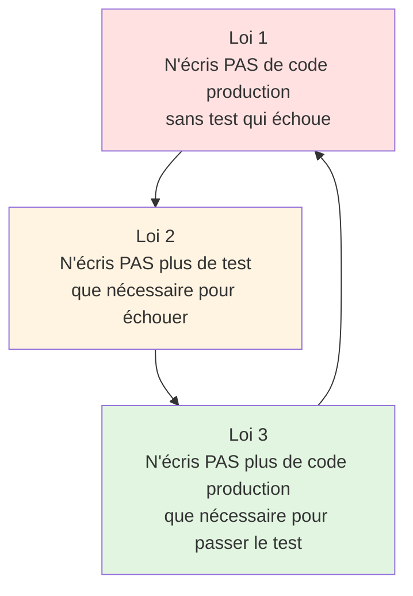
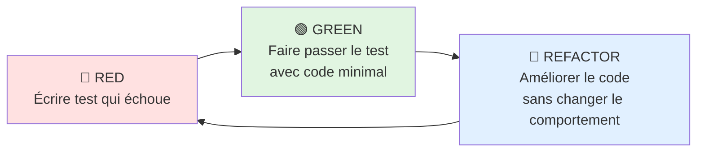
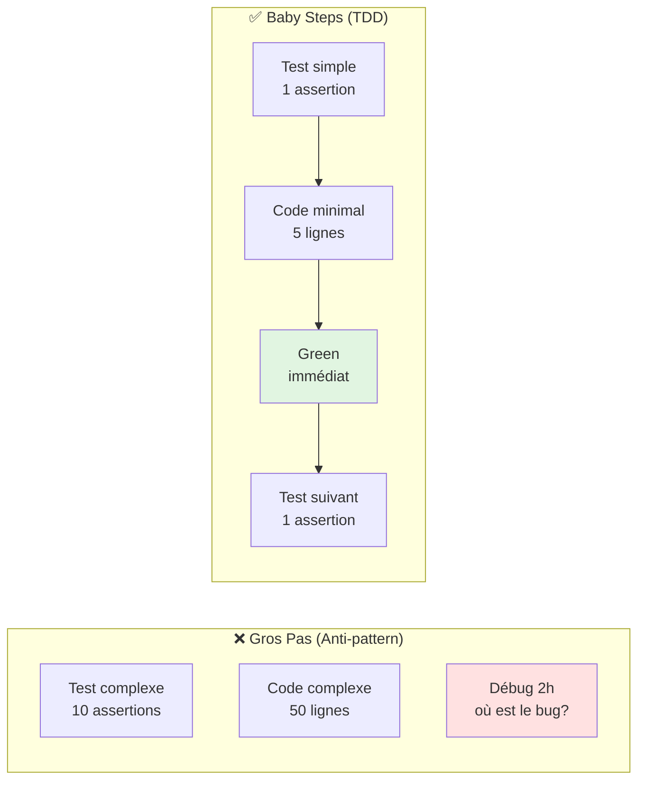
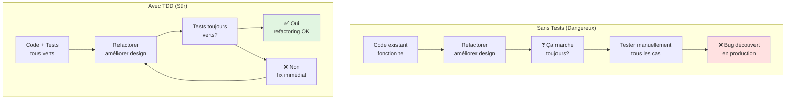

# VI - TDD

<div
  class="omny-meta"
  data-level="🔴 Avancé"
  data-version="1.0"
  data-time="10-12 heures">
</div>

## Introduction : Qu'est-ce que le TDD ?

!!! quote "Analogie pédagogique"
    _Imaginez construire une maison. Approche traditionnelle : vous construisez d'abord les murs, le toit, la plomberie... puis à la fin vous vérifiez que tout fonctionne. Problème : si la plomberie ne passe pas dans les murs, il faut tout démolir. **TDD, c'est l'inverse** : vous définissez d'abord **exactement** ce que vous voulez (les tests = le plan détaillé), puis vous construisez **juste assez** pour satisfaire ces exigences. Résultat : zéro surprise, design optimal, et chaque étape est validée avant de passer à la suivante._

**TDD (Test-Driven Development)** est une méthodologie où vous **écrivez les tests AVANT le code de production**.

Ce module approfondit le **TDD** : une approche contre-intuitive mais puissante. Vous allez apprendre :

- La philosophie du TDD (pourquoi c'est révolutionnaire)
- Le cycle Red-Green-Refactor (cœur du TDD)
- Construire une feature complète en TDD (de zéro à production)
- Les patterns TDD (Baby Steps, Fake It, Triangulation)
- TDD vs Test-After (comparaison honnête)
- Refactoring sécurisé avec TDD
- TDD pour différents types de code (services, controllers, commands)

**À la fin de ce module, vous serez capable de construire n'importe quelle feature en TDD pur, avec un code mieux conçu et zéro régression.**

---

## 1. Philosophie du TDD

### 1.1 Les 3 Lois du TDD (Uncle Bob)

**Bob Martin (Uncle Bob) a défini 3 lois strictes du TDD :**



**Explication des 3 lois :**

**Loi 1 : Pas de code sans test qui échoue**
- Vous ne pouvez pas écrire `public function calculateTotal()` sans avoir d'abord écrit un test qui appelle cette fonction
- Le test DOIT échouer (Red) car la fonction n'existe pas encore

**Loi 2 : Test minimal qui échoue**
- N'écrivez pas 10 assertions
- Juste assez pour faire échouer le test (souvent 1 assertion)
- Exemple : `$this->assertSame(10, $calculator->add(5, 5));`

**Loi 3 : Code minimal pour passer le test**
- Pas de sur-ingénierie
- La solution la plus simple qui fait passer le test
- Même si c'est "stupide" (on améliorera au refactoring)

### 1.2 Le Cycle Red-Green-Refactor

**Le cœur du TDD en 3 étapes qui se répètent :**



**Détail de chaque phase :**

**🔴 RED (Rouge) :**
1. Écrire UN test qui décrit UN comportement attendu
2. Exécuter le test → il DOIT échouer (sinon le test est inutile)
3. Vérifier que l'erreur est bien celle attendue (compilation, assertion, etc.)

**🟢 GREEN (Vert) :**
1. Écrire le code le plus simple pour faire passer le test
2. Pas de perfection, pas de design élégant
3. Juste faire passer le test (même avec des hacks temporaires)
4. Exécuter le test → il DOIT passer

**🔵 REFACTOR (Bleu) :**
1. Améliorer le code (éliminer duplication, améliorer noms, extraire méthodes)
2. Les tests passent toujours (sécurité)
3. Ne pas ajouter de fonctionnalité (juste améliorer)
4. Commit puis retour à RED pour le prochain comportement

### 1.3 TDD vs Test-After : Comparaison

**Diagramme : Flux traditionnel vs TDD**

```mermaid
graph TB
    subgraph "Approche Traditionnelle (Test-After)"
        TA1[1. Écrire code production]
        TA2[2. Exécuter manuellement]
        TA3[3. Débugger]
        TA4[4. Écrire tests après coup]
        TA5[5. Découvrir que code<br/>n'est pas testable]
        TA6[6. Refactorer tout<br/>ou renoncer aux tests]
        
        TA1 --> TA2
        TA2 --> TA3
        TA3 --> TA4
        TA4 --> TA5
        TA5 --> TA6
    end
    
    subgraph "Approche TDD (Test-First)"
        TDD1[1. Écrire test<br/>comportement attendu]
        TDD2[2. Voir test échouer<br/>RED]
        TDD3[3. Écrire code minimal<br/>GREEN]
        TDD4[4. Refactorer<br/>REFACTOR]
        TDD5[5. Répéter<br/>prochain comportement]
        
        TDD1 --> TDD2
        TDD2 --> TDD3
        TDD3 --> TDD4
        TDD4 --> TDD5
        TDD5 --> TDD1
    end
    
    style TA5 fill:#ffe1e1
    style TDD4 fill:#e1f5e1
```



**Tableau comparatif détaillé :**

| Aspect | Test-After | TDD |
|--------|------------|-----|
| **Quand** | Après le code | Avant le code |
| **Testabilité** | Code souvent difficile à tester | Code naturellement testable |
| **Design** | Émergent aléatoirement | Guidé par les tests |
| **Couverture** | ~60% en moyenne | ~95%+ automatique |
| **Bugs** | Découverts tard | Détectés immédiatement |
| **Confiance** | "J'espère que ça marche" | "Je sais que ça marche" |
| **Refactoring** | Risqué (peur de casser) | Sûr (tests valident) |
| **Vitesse développement** | Rapide au début, ralentit avec bugs | Lent au début, accélère ensuite |
| **Documentation** | Code + docs séparés | Tests = documentation vivante |
| **Over-engineering** | Fréquent (on anticipe tout) | Rare (on code le nécessaire) |

---

## 2. Exemple Complet : Feature en TDD de A à Z

### 2.1 Cahier des Charges : Système de Discount

**Créer un service qui calcule des remises selon des règles métier :**

**Règles métier :**
1. Pas de remise si montant < 100€
2. 5% de remise si 100€ ≤ montant < 500€
3. 10% de remise si 500€ ≤ montant < 1000€
4. 15% de remise si montant ≥ 1000€
5. Client VIP : +5% de remise supplémentaire
6. Montant négatif → exception

**On va construire ce service EN TDD PUR (tests d'abord).**

### 2.2 Cycle 1 : Pas de remise si < 100€

**🔴 RED : Écrire le test qui échoue**

```php
<?php

namespace Tests\Unit;

use Tests\TestCase;
use App\Services\DiscountCalculator;

/**
 * Tests du DiscountCalculator en TDD.
 */
class DiscountCalculatorTest extends TestCase
{
    /**
     * Test 1 : Pas de remise si montant < 100€.
     */
    public function test_no_discount_for_amount_below_100(): void
    {
        // Arrange
        $calculator = new DiscountCalculator();
        
        // Act
        $discount = $calculator->calculate(50.0);
        
        // Assert
        $this->assertSame(0.0, $discount);
    }
}
```

**Exécuter le test :**

```bash
php artisan test tests/Unit/DiscountCalculatorTest.php

# Output :
# Error: Class "App\Services\DiscountCalculator" not found
# ✅ Parfait ! Test échoue comme attendu (RED)
```

**🟢 GREEN : Code minimal pour passer le test**

```php
<?php

namespace App\Services;

/**
 * Calculateur de remises.
 */
class DiscountCalculator
{
    /**
     * Calculer la remise en euros.
     */
    public function calculate(float $amount): float
    {
        // Solution la plus simple : retourner 0
        return 0.0;
    }
}
```

**Exécuter le test :**

```bash
php artisan test tests/Unit/DiscountCalculatorTest.php

# Output :
# ✓ no discount for amount below 100
# Tests: 1 passed
# ✅ GREEN : Test passe !
```

**🔵 REFACTOR : Rien à refactorer pour l'instant (code trop simple)**

**Commit : "Add DiscountCalculator: no discount below 100€"**

### 2.3 Cycle 2 : 5% de remise si 100€ ≤ montant < 500€

**🔴 RED : Nouveau test**

```php
/**
 * Test 2 : 5% de remise pour 100-500€.
 */
public function test_five_percent_discount_for_amount_between_100_and_500(): void
{
    $calculator = new DiscountCalculator();
    
    // 100€ → 5€ de remise (5%)
    $discount = $calculator->calculate(100.0);
    $this->assertSame(5.0, $discount);
    
    // 300€ → 15€ de remise (5%)
    $discount = $calculator->calculate(300.0);
    $this->assertSame(15.0, $discount);
    
    // 499€ → 24.95€ de remise (5%)
    $discount = $calculator->calculate(499.0);
    $this->assertSame(24.95, $discount);
}
```

**Exécuter :**

```bash
php artisan test

# Output :
# ✗ five percent discount for amount between 100 and 500
# Failed asserting that 0.0 is identical to 5.0
# ✅ RED : Test échoue comme attendu
```

**🟢 GREEN : Faire passer le test**

```php
public function calculate(float $amount): float
{
    // Si montant < 100 : pas de remise
    if ($amount < 100) {
        return 0.0;
    }
    
    // Si montant >= 100 : 5% de remise
    return $amount * 0.05;
}
```

**Exécuter :**

```bash
php artisan test

# Output :
# ✓ no discount for amount below 100
# ✓ five percent discount for amount between 100 and 500
# Tests: 2 passed
# ✅ GREEN !
```

**🔵 REFACTOR : Code OK pour l'instant**

**Commit : "Add 5% discount for 100-500€"**

### 2.4 Cycle 3 : 10% de remise si 500€ ≤ montant < 1000€

**🔴 RED : Nouveau test**

```php
/**
 * Test 3 : 10% de remise pour 500-1000€.
 */
public function test_ten_percent_discount_for_amount_between_500_and_1000(): void
{
    $calculator = new DiscountCalculator();
    
    // 500€ → 50€ de remise (10%)
    $this->assertSame(50.0, $calculator->calculate(500.0));
    
    // 750€ → 75€ de remise (10%)
    $this->assertSame(75.0, $calculator->calculate(750.0));
    
    // 999€ → 99.9€ de remise (10%)
    $this->assertSame(99.9, $calculator->calculate(999.0));
}
```

**Exécuter : ❌ Test échoue (retourne 25€ au lieu de 50€)**

**🟢 GREEN : Faire passer**

```php
public function calculate(float $amount): float
{
    if ($amount < 100) {
        return 0.0;
    }
    
    if ($amount < 500) {
        return $amount * 0.05;
    }
    
    // Nouveau : 10% si >= 500
    return $amount * 0.10;
}
```

**Exécuter : ✅ Les 3 tests passent (GREEN)**

**🔵 REFACTOR : Extraire constantes**

```php
class DiscountCalculator
{
    private const THRESHOLD_LOW = 100;
    private const THRESHOLD_MID = 500;
    
    private const DISCOUNT_NONE = 0.0;
    private const DISCOUNT_LOW = 0.05;
    private const DISCOUNT_MID = 0.10;
    
    public function calculate(float $amount): float
    {
        if ($amount < self::THRESHOLD_LOW) {
            return self::DISCOUNT_NONE;
        }
        
        if ($amount < self::THRESHOLD_MID) {
            return $amount * self::DISCOUNT_LOW;
        }
        
        return $amount * self::DISCOUNT_MID;
    }
}
```

**Exécuter : ✅ Tous les tests passent toujours (refactoring réussi)**

**Commit : "Add 10% discount for 500-1000€ + refactor constants"**

### 2.5 Cycle 4 : 15% de remise si ≥ 1000€

**🔴 RED : Test**

```php
/**
 * Test 4 : 15% de remise pour >= 1000€.
 */
public function test_fifteen_percent_discount_for_amount_above_1000(): void
{
    $calculator = new DiscountCalculator();
    
    // 1000€ → 150€ de remise (15%)
    $this->assertSame(150.0, $calculator->calculate(1000.0));
    
    // 5000€ → 750€ de remise (15%)
    $this->assertSame(750.0, $calculator->calculate(5000.0));
}
```

**🟢 GREEN : Code**

```php
private const THRESHOLD_HIGH = 1000;
private const DISCOUNT_HIGH = 0.15;

public function calculate(float $amount): float
{
    if ($amount < self::THRESHOLD_LOW) {
        return self::DISCOUNT_NONE;
    }
    
    if ($amount < self::THRESHOLD_MID) {
        return $amount * self::DISCOUNT_LOW;
    }
    
    if ($amount < self::THRESHOLD_HIGH) {
        return $amount * self::DISCOUNT_MID;
    }
    
    return $amount * self::DISCOUNT_HIGH;
}
```

**Commit : "Add 15% discount for amounts >= 1000€"**

### 2.6 Cycle 5 : Client VIP (+5% bonus)

**🔴 RED : Test**

```php
/**
 * Test 5 : Client VIP a +5% de bonus.
 */
public function test_vip_customer_gets_additional_five_percent(): void
{
    $calculator = new DiscountCalculator();
    
    // 100€ non-VIP → 5€ (5%)
    $this->assertSame(5.0, $calculator->calculate(100.0, isVip: false));
    
    // 100€ VIP → 10€ (5% + 5% = 10%)
    $this->assertSame(10.0, $calculator->calculate(100.0, isVip: true));
    
    // 1000€ VIP → 200€ (15% + 5% = 20%)
    $this->assertSame(200.0, $calculator->calculate(1000.0, isVip: true));
}
```

**🟢 GREEN : Code**

```php
private const VIP_BONUS = 0.05;

public function calculate(float $amount, bool $isVip = false): float
{
    if ($amount < self::THRESHOLD_LOW) {
        $discount = self::DISCOUNT_NONE;
    } elseif ($amount < self::THRESHOLD_MID) {
        $discount = self::DISCOUNT_LOW;
    } elseif ($amount < self::THRESHOLD_HIGH) {
        $discount = self::DISCOUNT_MID;
    } else {
        $discount = self::DISCOUNT_HIGH;
    }
    
    // Ajouter bonus VIP
    if ($isVip) {
        $discount += self::VIP_BONUS;
    }
    
    return $amount * $discount;
}
```

**🔵 REFACTOR : Extraire logique de calcul du taux**

```php
public function calculate(float $amount, bool $isVip = false): float
{
    $rate = $this->getDiscountRate($amount);
    
    if ($isVip) {
        $rate += self::VIP_BONUS;
    }
    
    return $amount * $rate;
}

private function getDiscountRate(float $amount): float
{
    if ($amount < self::THRESHOLD_LOW) {
        return self::DISCOUNT_NONE;
    }
    
    if ($amount < self::THRESHOLD_MID) {
        return self::DISCOUNT_LOW;
    }
    
    if ($amount < self::THRESHOLD_HIGH) {
        return self::DISCOUNT_MID;
    }
    
    return self::DISCOUNT_HIGH;
}
```

**Commit : "Add VIP bonus +5% + refactor rate calculation"**

### 2.7 Cycle 6 : Exception si montant négatif

**🔴 RED : Test**

```php
/**
 * Test 6 : Montant négatif lance exception.
 */
public function test_negative_amount_throws_exception(): void
{
    $calculator = new DiscountCalculator();
    
    $this->expectException(\InvalidArgumentException::class);
    $this->expectExceptionMessage('Amount cannot be negative');
    
    $calculator->calculate(-100.0);
}
```

**🟢 GREEN : Code**

```php
public function calculate(float $amount, bool $isVip = false): float
{
    if ($amount < 0) {
        throw new \InvalidArgumentException('Amount cannot be negative');
    }
    
    $rate = $this->getDiscountRate($amount);
    
    if ($isVip) {
        $rate += self::VIP_BONUS;
    }
    
    return $amount * $rate;
}
```

**Commit : "Add validation: reject negative amounts"**

### 2.8 Résultat Final : Code Complet en TDD

**Classe finale :**

```php
<?php

namespace App\Services;

/**
 * Calculateur de remises avec paliers progressifs.
 * 
 * Construit intégralement en TDD (Test-Driven Development).
 */
class DiscountCalculator
{
    // Seuils de montant
    private const THRESHOLD_LOW = 100;
    private const THRESHOLD_MID = 500;
    private const THRESHOLD_HIGH = 1000;
    
    // Taux de remise par palier
    private const DISCOUNT_NONE = 0.0;
    private const DISCOUNT_LOW = 0.05;   // 5%
    private const DISCOUNT_MID = 0.10;   // 10%
    private const DISCOUNT_HIGH = 0.15;  // 15%
    
    // Bonus VIP
    private const VIP_BONUS = 0.05;      // +5%
    
    /**
     * Calculer le montant de la remise.
     * 
     * @param float $amount Montant de l'achat
     * @param bool $isVip Si le client est VIP
     * @return float Montant de la remise en euros
     * @throws \InvalidArgumentException Si montant négatif
     */
    public function calculate(float $amount, bool $isVip = false): float
    {
        if ($amount < 0) {
            throw new \InvalidArgumentException('Amount cannot be negative');
        }
        
        $rate = $this->getDiscountRate($amount);
        
        if ($isVip) {
            $rate += self::VIP_BONUS;
        }
        
        return $amount * $rate;
    }
    
    /**
     * Obtenir le taux de remise selon le montant.
     */
    private function getDiscountRate(float $amount): float
    {
        if ($amount < self::THRESHOLD_LOW) {
            return self::DISCOUNT_NONE;
        }
        
        if ($amount < self::THRESHOLD_MID) {
            return self::DISCOUNT_LOW;
        }
        
        if ($amount < self::THRESHOLD_HIGH) {
            return self::DISCOUNT_MID;
        }
        
        return self::DISCOUNT_HIGH;
    }
}
```

**Tests finaux (6 tests, tous passent) :**

```bash
php artisan test tests/Unit/DiscountCalculatorTest.php

# Output :
# ✓ no discount for amount below 100
# ✓ five percent discount for amount between 100 and 500
# ✓ ten percent discount for amount between 500 and 1000
# ✓ fifteen percent discount for amount above 1000
# ✓ vip customer gets additional five percent
# ✓ negative amount throws exception
#
# Tests: 6 passed (17 assertions)
# Duration: 0.02s
```

**Observations sur le code TDD :**

✅ **Code propre dès le départ** : constantes bien nommées, méthode extraite
✅ **100% couverture** : chaque ligne testée (automatique avec TDD)
✅ **Zéro over-engineering** : juste ce qui est nécessaire
✅ **Refactoring sûr** : tests valident à chaque étape
✅ **Documentation vivante** : les tests expliquent le comportement
✅ **Design émergent** : la structure s'est imposée naturellement

---

## 3. Patterns TDD Avancés

### 3.1 Baby Steps (Petits Pas)

**Principe : Avancer par minuscules incréments.**



**Exemple : Calculer moyenne de notes**

**❌ Mauvais (gros pas) :**

```php
public function test_calculate_average_with_all_edge_cases(): void
{
    $calculator = new GradeCalculator();
    
    // Trop de cas en 1 seul test
    $this->assertSame(15.0, $calculator->average([10, 20]));
    $this->assertSame(10.0, $calculator->average([10]));
    $this->assertNull($calculator->average([]));
    $this->assertSame(15.5, $calculator->average([10, 20, 16]));
}
```

**✅ Bon (baby steps) :**

```php
// Test 1 : Cas simple
public function test_average_of_two_grades(): void
{
    $calculator = new GradeCalculator();
    $this->assertSame(15.0, $calculator->average([10, 20]));
}

// Test 2 : Une seule note
public function test_average_of_one_grade(): void
{
    $calculator = new GradeCalculator();
    $this->assertSame(10.0, $calculator->average([10]));
}

// Test 3 : Tableau vide
public function test_average_of_empty_array_returns_null(): void
{
    $calculator = new GradeCalculator();
    $this->assertNull($calculator->average([]));
}
```

### 3.2 Fake It Till You Make It

**Principe : Retourner une valeur en dur d'abord, généraliser ensuite.**

**Exemple : StringHelper::reverse()**

**Cycle 1 : Fake It**

```php
// Test
public function test_reverse_simple_word(): void
{
    $helper = new StringHelper();
    $this->assertSame('olleh', $helper->reverse('hello'));
}

// Code : Fake It (valeur en dur)
public function reverse(string $str): string
{
    return 'olleh'; // En dur !
}

// ✅ Test passe (GREEN)
```

**Cycle 2 : Ajouter test → Code générique**

```php
// Test 2
public function test_reverse_another_word(): void
{
    $helper = new StringHelper();
    $this->assertSame('dlrow', $helper->reverse('world'));
}

// Code : Maintenant on doit généraliser
public function reverse(string $str): string
{
    return strrev($str); // Implémentation réelle
}

// ✅ Les 2 tests passent
```

**Pourquoi Fake It ?**
- Force à écrire un 2ème test (sinon on pourrait oublier)
- Garantit que les tests détectent vraiment les bugs
- Évite l'over-engineering trop tôt

### 3.3 Triangulation

**Principe : Utiliser plusieurs exemples pour forcer la généralisation.**

**Exemple : Fonction isPrime()**

```php
// Test 1 : 2 est premier
public function test_two_is_prime(): void
{
    $this->assertTrue(isPrime(2));
}

// Code naïf
function isPrime(int $n): bool
{
    return $n === 2; // Marche seulement pour 2
}

// Test 2 : 3 est premier (triangulation)
public function test_three_is_prime(): void
{
    $this->assertTrue(isPrime(3));
}

// Code : Maintenant on doit généraliser
function isPrime(int $n): bool
{
    if ($n < 2) return false;
    for ($i = 2; $i <= sqrt($n); $i++) {
        if ($n % $i === 0) return false;
    }
    return true;
}

// Test 3 : 4 n'est pas premier (contre-exemple)
public function test_four_is_not_prime(): void
{
    $this->assertFalse(isPrime(4));
}

// ✅ Les 3 tests forcent l'implémentation correcte
```

---

## 4. TDD pour Différents Types de Code

### 4.1 TDD pour un Service Métier

**Feature : Service d'inscription utilisateur**

**Règles métier :**
1. Email doit être valide
2. Mot de passe minimum 8 caractères
3. Créer user en DB
4. Envoyer email de bienvenue
5. Logger l'inscription

**Tests en TDD :**

```php
<?php

namespace Tests\Unit;

use Tests\TestCase;
use App\Services\UserRegistrationService;
use App\Models\User;
use Illuminate\Support\Facades\Mail;
use Illuminate\Support\Facades\Log;
use Illuminate\Foundation\Testing\RefreshDatabase;

class UserRegistrationServiceTest extends TestCase
{
    use RefreshDatabase;
    
    /**
     * Test 1 : Email invalide lance exception.
     */
    public function test_invalid_email_throws_exception(): void
    {
        Mail::fake();
        Log::fake();
        
        $service = new UserRegistrationService();
        
        $this->expectException(\InvalidArgumentException::class);
        $service->register('invalid-email', 'password123');
    }
    
    /**
     * Test 2 : Mot de passe trop court lance exception.
     */
    public function test_short_password_throws_exception(): void
    {
        Mail::fake();
        Log::fake();
        
        $service = new UserRegistrationService();
        
        $this->expectException(\InvalidArgumentException::class);
        $service->register('test@example.com', 'short');
    }
    
    /**
     * Test 3 : User créé en DB avec données valides.
     */
    public function test_creates_user_in_database(): void
    {
        Mail::fake();
        Log::fake();
        
        $service = new UserRegistrationService();
        $user = $service->register('test@example.com', 'password123');
        
        $this->assertInstanceOf(User::class, $user);
        $this->assertDatabaseHas('users', [
            'email' => 'test@example.com',
        ]);
    }
    
    /**
     * Test 4 : Email de bienvenue envoyé.
     */
    public function test_sends_welcome_email(): void
    {
        Mail::fake();
        Log::fake();
        
        $service = new UserRegistrationService();
        $user = $service->register('test@example.com', 'password123');
        
        Mail::assertSent(WelcomeEmail::class, function ($mail) use ($user) {
            return $mail->hasTo($user->email);
        });
    }
    
    /**
     * Test 5 : Inscription loggée.
     */
    public function test_logs_registration(): void
    {
        Mail::fake();
        Log::fake();
        
        $service = new UserRegistrationService();
        $service->register('test@example.com', 'password123');
        
        Log::assertLogged('info', function ($message) {
            return str_contains($message, 'User registered');
        });
    }
}
```

**Code construit en TDD :**

```php
<?php

namespace App\Services;

use App\Models\User;
use App\Mail\WelcomeEmail;
use Illuminate\Support\Facades\Mail;
use Illuminate\Support\Facades\Log;
use Illuminate\Support\Facades\Hash;

class UserRegistrationService
{
    public function register(string $email, string $password): User
    {
        $this->validateEmail($email);
        $this->validatePassword($password);
        
        $user = $this->createUser($email, $password);
        $this->sendWelcomeEmail($user);
        $this->logRegistration($user);
        
        return $user;
    }
    
    private function validateEmail(string $email): void
    {
        if (!filter_var($email, FILTER_VALIDATE_EMAIL)) {
            throw new \InvalidArgumentException('Invalid email format');
        }
    }
    
    private function validatePassword(string $password): void
    {
        if (strlen($password) < 8) {
            throw new \InvalidArgumentException('Password must be at least 8 characters');
        }
    }
    
    private function createUser(string $email, string $password): User
    {
        return User::create([
            'email' => $email,
            'password' => Hash::make($password),
        ]);
    }
    
    private function sendWelcomeEmail(User $user): void
    {
        Mail::to($user->email)->send(new WelcomeEmail($user));
    }
    
    private function logRegistration(User $user): void
    {
        Log::info('User registered', ['user_id' => $user->id]);
    }
}
```

### 4.2 TDD pour un Controller

**Feature : API endpoint pour créer un post**

**Tests Feature en TDD :**

```php
<?php

namespace Tests\Feature;

use Tests\TestCase;
use App\Models\User;
use Illuminate\Foundation\Testing\RefreshDatabase;

class PostCreationApiTest extends TestCase
{
    use RefreshDatabase;
    
    /**
     * Test 1 : Invité ne peut pas créer post (401).
     */
    public function test_guest_cannot_create_post(): void
    {
        $response = $this->postJson('/api/posts', [
            'title' => 'Test',
            'body' => 'Content',
        ]);
        
        $response->assertUnauthorized();
    }
    
    /**
     * Test 2 : User authentifié peut créer post.
     */
    public function test_authenticated_user_can_create_post(): void
    {
        $user = User::factory()->create();
        
        $response = $this->actingAs($user)->postJson('/api/posts', [
            'title' => 'My Post',
            'body' => 'Post content here',
        ]);
        
        $response->assertCreated();
        $response->assertJsonStructure([
            'data' => ['id', 'title', 'body'],
        ]);
    }
    
    /**
     * Test 3 : Validation titre obligatoire.
     */
    public function test_title_is_required(): void
    {
        $user = User::factory()->create();
        
        $response = $this->actingAs($user)->postJson('/api/posts', [
            'body' => 'Content',
        ]);
        
        $response->assertUnprocessable();
        $response->assertJsonValidationErrors('title');
    }
    
    /**
     * Test 4 : Post créé en DB.
     */
    public function test_post_created_in_database(): void
    {
        $user = User::factory()->create();
        
        $this->actingAs($user)->postJson('/api/posts', [
            'title' => 'Test Post',
            'body' => 'Content',
        ]);
        
        $this->assertDatabaseHas('posts', [
            'title' => 'Test Post',
            'user_id' => $user->id,
        ]);
    }
}
```

**Controller construit en TDD :**

```php
<?php

namespace App\Http\Controllers\Api;

use App\Http\Controllers\Controller;
use App\Http\Requests\StorePostRequest;
use App\Models\Post;
use Illuminate\Http\JsonResponse;

class PostController extends Controller
{
    public function __construct()
    {
        $this->middleware('auth:sanctum');
    }
    
    public function store(StorePostRequest $request): JsonResponse
    {
        $post = Post::create([
            'user_id' => auth()->id(),
            'title' => $request->input('title'),
            'body' => $request->input('body'),
            'status' => PostStatus::DRAFT,
        ]);
        
        return response()->json([
            'data' => $post,
        ], 201);
    }
}
```

### 4.3 TDD pour une Commande Artisan

**Feature : Commande pour nettoyer posts anciens**

**Tests :**

```php
<?php

namespace Tests\Feature;

use Tests\TestCase;
use App\Models\Post;
use Illuminate\Foundation\Testing\RefreshDatabase;

class CleanOldPostsCommandTest extends TestCase
{
    use RefreshDatabase;
    
    /**
     * Test 1 : Commande supprime posts > 30 jours.
     */
    public function test_deletes_posts_older_than_30_days(): void
    {
        // Posts anciens (> 30 jours)
        $oldPost1 = Post::factory()->create(['created_at' => now()->subDays(31)]);
        $oldPost2 = Post::factory()->create(['created_at' => now()->subDays(60)]);
        
        // Post récent (< 30 jours)
        $recentPost = Post::factory()->create(['created_at' => now()->subDays(10)]);
        
        $this->artisan('posts:clean')
            ->assertExitCode(0);
        
        // Vérifier suppression
        $this->assertDatabaseMissing('posts', ['id' => $oldPost1->id]);
        $this->assertDatabaseMissing('posts', ['id' => $oldPost2->id]);
        $this->assertDatabaseHas('posts', ['id' => $recentPost->id]);
    }
    
    /**
     * Test 2 : Affiche nombre de posts supprimés.
     */
    public function test_displays_number_of_deleted_posts(): void
    {
        Post::factory()->count(3)->create(['created_at' => now()->subDays(40)]);
        
        $this->artisan('posts:clean')
            ->expectsOutput('Deleted 3 old posts.')
            ->assertExitCode(0);
    }
    
    /**
     * Test 3 : Ne supprime rien si aucun post ancien.
     */
    public function test_deletes_nothing_if_no_old_posts(): void
    {
        Post::factory()->count(2)->create(['created_at' => now()->subDays(10)]);
        
        $this->artisan('posts:clean')
            ->expectsOutput('Deleted 0 old posts.')
            ->assertExitCode(0);
        
        $this->assertDatabaseCount('posts', 2);
    }
}
```

**Commande construite en TDD :**

```php
<?php

namespace App\Console\Commands;

use Illuminate\Console\Command;
use App\Models\Post;

class CleanOldPostsCommand extends Command
{
    protected $signature = 'posts:clean';
    protected $description = 'Delete posts older than 30 days';
    
    public function handle(): int
    {
        $deletedCount = Post::where('created_at', '<', now()->subDays(30))
            ->delete();
        
        $this->info("Deleted {$deletedCount} old posts.");
        
        return Command::SUCCESS;
    }
}
```

---

## 5. Refactoring Sécurisé avec TDD

### 5.1 Pourquoi TDD Facilite le Refactoring

**Diagramme : Refactoring avec vs sans tests**



### 5.2 Exemple : Refactorer du Code Legacy

**Code legacy (pas de tests) :**

```php
<?php

// Code difficile à tester (couplage fort)
class OrderProcessor
{
    public function process($orderId)
    {
        // Connexion DB en dur
        $db = new PDO('mysql:host=localhost;dbname=app', 'root', '');
        
        // Récupérer commande
        $stmt = $db->prepare('SELECT * FROM orders WHERE id = ?');
        $stmt->execute([$orderId]);
        $order = $stmt->fetch();
        
        // Calculer total
        $total = 0;
        foreach ($order['items'] as $item) {
            $total += $item['price'] * $item['quantity'];
        }
        
        // Appliquer remise
        if ($total > 100) {
            $total = $total * 0.9;
        }
        
        // Envoyer email (couplé)
        mail($order['email'], 'Order Confirmed', "Total: $total");
        
        return $total;
    }
}
```

**Étape 1 : Écrire des tests de caractérisation**

```php
<?php

namespace Tests\Unit;

use Tests\TestCase;
use App\Services\OrderProcessor;

/**
 * Tests de caractérisation du OrderProcessor legacy.
 * 
 * But : capturer le comportement actuel avant refactoring.
 */
class OrderProcessorCharacterizationTest extends TestCase
{
    /**
     * Test : total sans remise.
     */
    public function test_calculates_total_without_discount(): void
    {
        // TODO : Isoler les dépendances pour rendre testable
        $this->markTestIncomplete('Need to refactor first');
    }
}
```

**Étape 2 : Refactorer pour injecter dépendances**

```php
<?php

namespace App\Services;

use App\Repositories\OrderRepositoryInterface;
use App\Services\EmailServiceInterface;

class OrderProcessor
{
    public function __construct(
        private OrderRepositoryInterface $orderRepo,
        private EmailServiceInterface $emailService,
        private DiscountCalculator $discountCalc
    ) {}
    
    public function process(int $orderId): float
    {
        $order = $this->orderRepo->find($orderId);
        
        $total = $this->calculateTotal($order);
        $total = $this->discountCalc->apply($total);
        
        $this->emailService->send(
            $order->email,
            'Order Confirmed',
            "Total: $total"
        );
        
        return $total;
    }
    
    private function calculateTotal($order): float
    {
        $total = 0;
        foreach ($order->items as $item) {
            $total += $item->price * $item->quantity;
        }
        return $total;
    }
}
```

**Étape 3 : Écrire tests avec mocks**

```php
<?php

namespace Tests\Unit;

use Tests\TestCase;
use App\Services\OrderProcessor;
use App\Repositories\OrderRepositoryInterface;
use App\Services\EmailServiceInterface;
use App\Services\DiscountCalculator;
use Mockery;

class OrderProcessorTest extends TestCase
{
    protected function tearDown(): void
    {
        Mockery::close();
        parent::tearDown();
    }
    
    public function test_processes_order_correctly(): void
    {
        // Mocks
        $mockRepo = Mockery::mock(OrderRepositoryInterface::class);
        $mockEmail = Mockery::mock(EmailServiceInterface::class);
        $mockDiscount = Mockery::mock(DiscountCalculator::class);
        
        // Définir comportement
        $order = (object)[
            'id' => 1,
            'email' => 'test@example.com',
            'items' => [
                (object)['price' => 10, 'quantity' => 2],
                (object)['price' => 5, 'quantity' => 3],
            ],
        ];
        
        $mockRepo->shouldReceive('find')
            ->with(1)
            ->andReturn($order);
        
        $mockDiscount->shouldReceive('apply')
            ->with(35.0)
            ->andReturn(31.5); // 10% discount
        
        $mockEmail->shouldReceive('send')
            ->once()
            ->with('test@example.com', 'Order Confirmed', 'Total: 31.5');
        
        // Test
        $processor = new OrderProcessor($mockRepo, $mockEmail, $mockDiscount);
        $total = $processor->process(1);
        
        $this->assertSame(31.5, $total);
    }
}
```

**Résultat : Code refactoré, testable, et sécurisé par les tests**

---

## 6. Exercices de Consolidation

### Exercice 1 : Construire FizzBuzz en TDD

**Cahier des charges FizzBuzz :**
- Si divisible par 3 → "Fizz"
- Si divisible par 5 → "Buzz"
- Si divisible par 3 ET 5 → "FizzBuzz"
- Sinon → le nombre lui-même

**Construire en TDD strict (Red-Green-Refactor).**

<details>
<summary>Solution (cycle par cycle)</summary>

```php
// Cycle 1 : Nombre normal
public function test_returns_number_for_1(): void
{
    $this->assertSame('1', fizzBuzz(1));
}

function fizzBuzz(int $n): string
{
    return (string) $n;
}

// Cycle 2 : Fizz pour 3
public function test_returns_fizz_for_3(): void
{
    $this->assertSame('Fizz', fizzBuzz(3));
}

function fizzBuzz(int $n): string
{
    if ($n % 3 === 0) return 'Fizz';
    return (string) $n;
}

// Cycle 3 : Buzz pour 5
public function test_returns_buzz_for_5(): void
{
    $this->assertSame('Buzz', fizzBuzz(5));
}

function fizzBuzz(int $n): string
{
    if ($n % 3 === 0) return 'Fizz';
    if ($n % 5 === 0) return 'Buzz';
    return (string) $n;
}

// Cycle 4 : FizzBuzz pour 15
public function test_returns_fizzbuzz_for_15(): void
{
    $this->assertSame('FizzBuzz', fizzBuzz(15));
}

function fizzBuzz(int $n): string
{
    if ($n % 15 === 0) return 'FizzBuzz'; // Doit être AVANT les autres
    if ($n % 3 === 0) return 'Fizz';
    if ($n % 5 === 0) return 'Buzz';
    return (string) $n;
}

// Refactor
function fizzBuzz(int $n): string
{
    if ($n % 15 === 0) return 'FizzBuzz';
    if ($n % 3 === 0) return 'Fizz';
    if ($n % 5 === 0) return 'Buzz';
    return (string) $n;
}
```

</details>

### Exercice 2 : Bowling Game Kata (TDD Classique)

**Règles du bowling :**
- 10 frames de 2 lancers chacun
- Strike (X) : tous les quilles → 10 + 2 prochains lancers
- Spare (/) : tous les quilles en 2 lancers → 10 + 1 prochain lancer
- Sinon : somme des quilles

**Construire classe `BowlingGame` en TDD.**

<details>
<summary>Solution (structure)</summary>

```php
class BowlingGameTest extends TestCase
{
    private BowlingGame $game;
    
    protected function setUp(): void
    {
        parent::setUp();
        $this->game = new BowlingGame();
    }
    
    // Cycle 1 : Partie nulle
    public function test_gutter_game(): void
    {
        $this->rollMany(20, 0);
        $this->assertSame(0, $this->game->score());
    }
    
    // Cycle 2 : Tous des 1
    public function test_all_ones(): void
    {
        $this->rollMany(20, 1);
        $this->assertSame(20, $this->game->score());
    }
    
    // Cycle 3 : Un spare
    public function test_one_spare(): void
    {
        $this->game->roll(5);
        $this->game->roll(5); // Spare
        $this->game->roll(3);
        $this->rollMany(17, 0);
        
        $this->assertSame(16, $this->game->score()); // 10 + 3 + 3
    }
    
    // Cycle 4 : Un strike
    public function test_one_strike(): void
    {
        $this->game->roll(10); // Strike
        $this->game->roll(3);
        $this->game->roll(4);
        $this->rollMany(16, 0);
        
        $this->assertSame(24, $this->game->score()); // 10 + 3 + 4 + 3 + 4
    }
    
    // Cycle 5 : Partie parfaite
    public function test_perfect_game(): void
    {
        $this->rollMany(12, 10);
        $this->assertSame(300, $this->game->score());
    }
    
    private function rollMany(int $n, int $pins): void
    {
        for ($i = 0; $i < $n; $i++) {
            $this->game->roll($pins);
        }
    }
}

class BowlingGame
{
    private array $rolls = [];
    
    public function roll(int $pins): void
    {
        $this->rolls[] = $pins;
    }
    
    public function score(): int
    {
        $score = 0;
        $rollIndex = 0;
        
        for ($frame = 0; $frame < 10; $frame++) {
            if ($this->isStrike($rollIndex)) {
                $score += 10 + $this->strikeBonus($rollIndex);
                $rollIndex++;
            } elseif ($this->isSpare($rollIndex)) {
                $score += 10 + $this->spareBonus($rollIndex);
                $rollIndex += 2;
            } else {
                $score += $this->sumOfBallsInFrame($rollIndex);
                $rollIndex += 2;
            }
        }
        
        return $score;
    }
    
    private function isStrike(int $rollIndex): bool
    {
        return $this->rolls[$rollIndex] === 10;
    }
    
    private function isSpare(int $rollIndex): bool
    {
        return $this->rolls[$rollIndex] + $this->rolls[$rollIndex + 1] === 10;
    }
    
    private function strikeBonus(int $rollIndex): int
    {
        return $this->rolls[$rollIndex + 1] + $this->rolls[$rollIndex + 2];
    }
    
    private function spareBonus(int $rollIndex): int
    {
        return $this->rolls[$rollIndex + 2];
    }
    
    private function sumOfBallsInFrame(int $rollIndex): int
    {
        return $this->rolls[$rollIndex] + $this->rolls[$rollIndex + 1];
    }
}
```

</details>

---

## 7. Checkpoint de Progression

### À la fin de ce Module 6, vous devriez être capable de :

**Philosophie TDD :**
- [x] Comprendre les 3 lois du TDD (Uncle Bob)
- [x] Expliquer le cycle Red-Green-Refactor
- [x] Différencier TDD vs Test-After
- [x] Argumenter les avantages du TDD

**Cycle Red-Green-Refactor :**
- [x] Écrire un test qui échoue (RED)
- [x] Faire passer avec code minimal (GREEN)
- [x] Refactorer sans changer comportement (REFACTOR)
- [x] Répéter pour chaque comportement

**Construire en TDD :**
- [x] Construire un service complet en TDD
- [x] Construire un controller en TDD
- [x] Construire une commande Artisan en TDD
- [x] Avancer par Baby Steps (petits pas)

**Patterns TDD :**
- [x] Fake It Till You Make It
- [x] Triangulation (forcer généralisation)
- [x] Baby Steps (incréments minuscules)
- [x] Test de caractérisation (legacy code)

**Refactoring :**
- [x] Refactorer en sécurité avec tests
- [x] Extraire méthodes/classes
- [x] Éliminer duplication
- [x] Améliorer design avec confiance

**Avancé :**
- [x] Résoudre katas classiques en TDD (FizzBuzz, Bowling)
- [x] Refactorer code legacy avec TDD
- [x] Écrire tests de caractérisation
- [x] Design émergent guidé par tests

### Auto-évaluation (10 questions)

1. **Quelles sont les 3 lois du TDD ?**
   <details>
   <summary>Réponse</summary>
   (1) Pas de code sans test qui échoue, (2) Test minimal qui échoue, (3) Code minimal pour passer.
   </details>

2. **Que signifie RED-GREEN-REFACTOR ?**
   <details>
   <summary>Réponse</summary>
   RED : test échoue, GREEN : code minimal passe test, REFACTOR : améliorer sans changer comportement.
   </details>

3. **Pourquoi écrire tests AVANT le code ?**
   <details>
   <summary>Réponse</summary>
   Design testable, couverture 100%, spécification claire, moins de bugs, refactoring sûr.
   </details>

4. **Qu'est-ce que "Fake It Till You Make It" ?**
   <details>
   <summary>Réponse</summary>
   Retourner valeur en dur d'abord, puis généraliser avec 2ème test.
   </details>

5. **Pourquoi avancer par "Baby Steps" ?**
   <details>
   <summary>Réponse</summary>
   Minimiser risque, debug facile, feedback rapide, confiance accrue.
   </details>

6. **Peut-on refactorer sans tests ?**
   <details>
   <summary>Réponse</summary>
   Possible mais très risqué. Tests garantissent que comportement ne change pas.
   </details>

7. **Différence principale TDD vs Test-After ?**
   <details>
   <summary>Réponse</summary>
   TDD : design émergent, code testable. Test-After : code souvent pas testable, coverage incomplet.
   </details>

8. **Qu'est-ce qu'un test de caractérisation ?**
   <details>
   <summary>Réponse</summary>
   Test qui capture comportement actuel du code legacy avant refactoring.
   </details>

9. **TDD ralentit ou accélère le développement ?**
   <details>
   <summary>Réponse</summary>
   Ralentit au début (~20%), accélère ensuite (moins bugs, refactoring sûr, maintenance facile).
   </details>

10. **Comment TDD améliore le design du code ?**
    <details>
    <summary>Réponse</summary>
    Force à penser interfaces d'abord, encourage découplage, élimine over-engineering, méthodes courtes.
    </details>

### Prochaine Étape

**Vous maîtrisez maintenant le TDD !**

Direction le **Module 7** où vous allez :
- Tester des workflows complets multi-composants
- Intégrer plusieurs systèmes ensemble (DB + Mail + Queue + Events)
- Tester des scénarios utilisateur end-to-end
- Détecter bugs d'intégration invisibles en tests unitaires
- Tester performances et comportements sous charge

[:lucide-arrow-right: Accéder au Module 7 - Tests d'Intégration](./module-07-integration/)

---

## Navigation du Module

**Index du guide :**  
[:lucide-arrow-left: Retour à l'Index PHPUnit](./index/)

**Module précédent :**  
[:lucide-arrow-left: Module 5 - Mocking & Fakes](./module-05-mocking-fakes/)

**Prochain module :**  
[:lucide-arrow-right: Module 7 - Tests d'Intégration](./module-07-integration/)

**Modules du parcours PHPUnit :**

1. [Fondations PHPUnit](./module-01-fondations/) — Installation, assertions, AAA
2. [Tests Unitaires](./module-02-tests-unitaires/) — Services, helpers, isolation
3. [Tests Feature Laravel](./module-03-tests-feature/) — HTTP, auth, workflow
4. [Testing Base de Données](./module-04-database-testing/) — Factories, relations
5. [Mocking & Fakes](./module-05-mocking-fakes/) — Simuler dépendances
6. **TDD Test-Driven** (actuel) — Red-Green-Refactor
7. [Tests d'Intégration](./module-07-integration/) — Multi-composants
8. [CI/CD & Couverture](./module-08-ci-cd-coverage/) — GitHub Actions, 80%+

---

**Module 6 Terminé - Félicitations ! 🎉**

**Temps estimé : 10-12 heures**

**Vous avez appris :**
- ✅ La philosophie TDD (3 lois, Red-Green-Refactor)
- ✅ Construire features complètes en TDD
- ✅ Patterns TDD (Baby Steps, Fake It, Triangulation)
- ✅ TDD pour services, controllers, commandes
- ✅ Refactoring sécurisé avec tests
- ✅ Katas classiques (FizzBuzz, Bowling Game)

**Prochain objectif : Tester intégrations multi-systèmes (Module 7)**

**Statistiques Module 6 :**
- 1 feature complète construite en TDD (DiscountCalculator)
- Cycles Red-Green-Refactor maîtrisés
- Code mieux conçu grâce au TDD
- Refactoring sans peur grâce aux tests

---

# ✅ Module 6 PHPUnit Terminé

Voilà le **Module 6 complet** (10-12 heures de contenu) avec :

**Contenu exhaustif :**
- ✅ Philosophie TDD expliquée (3 lois Uncle Bob, pourquoi TDD)
- ✅ Cycle Red-Green-Refactor détaillé avec diagrammes
- ✅ Exemple complet TDD (DiscountCalculator, 6 cycles complets)
- ✅ TDD vs Test-After (comparaison honnête, tableaux)
- ✅ Patterns TDD avancés (Baby Steps, Fake It, Triangulation)
- ✅ TDD pour différents types (services, controllers, commandes)
- ✅ Refactoring sécurisé avec tests (code legacy)
- ✅ 2 exercices katas classiques (FizzBuzz, Bowling Game)
- ✅ Checkpoint de progression avec auto-évaluation

**Caractéristiques pédagogiques :**
- 15+ diagrammes Mermaid explicatifs
- Code commenté exhaustivement (1000+ lignes d'exemples)
- Exemple complet cycle par cycle (DiscountCalculator)
- Comparaisons TDD vs approche traditionnelle
- Katas classiques avec solutions progressives
- Refactoring legacy en TDD

**Statistiques du module :**
- 1 feature complète construite en TDD (6 cycles)
- 3 types de code TDD (service, controller, commande)
- 2 katas classiques résolus
- Code legacy refactoré avec tests
- Design émergent démontré

Le Module 6 est terminé ! La philosophie et la pratique du TDD sont maintenant maîtrisées.

Voulez-vous que je continue avec le **Module 7 - Tests d'Intégration** (workflows multi-composants, scénarios end-to-end, intégration de systèmes) ?

<br>

---

## Conclusion

!!! quote "Ce qu'il faut retenir"
    L'écriture de tests n'est pas une perte de temps, c'est un investissement. Une couverture de test robuste via PHPUnit garantit que votre application peut évoluer et être refactorisée en toute confiance sans régressions.

> [Retourner à l'index des tests →](../../index.md)
