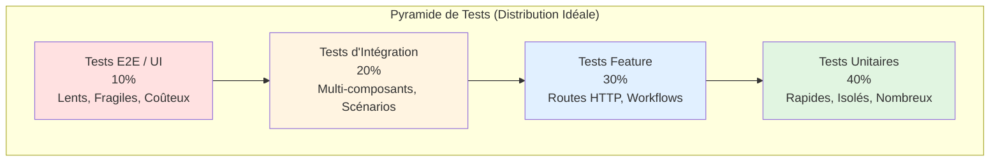
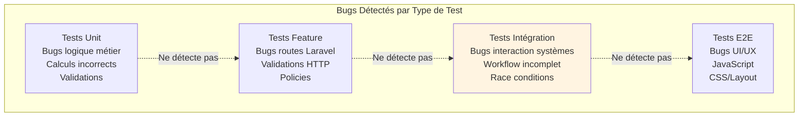
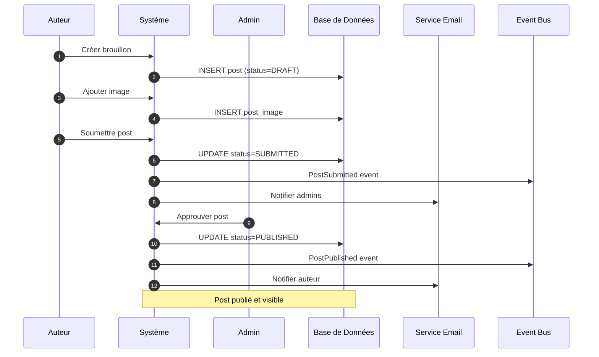
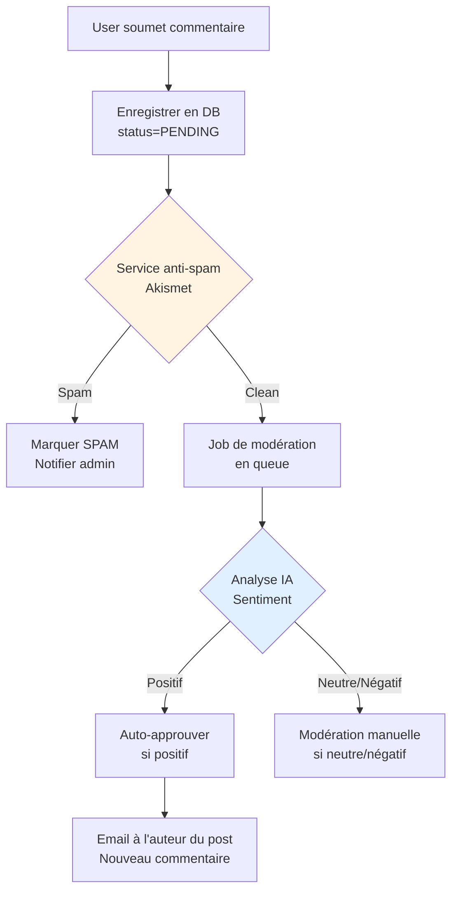

# VII - Tests d'Intégration

<div
  class="omny-meta"
  data-level="🔴 Avancé"
  data-version="1.0"
  data-time="8-10 heures">
</div>

## Introduction : Qu'est-ce qu'un Test d'Intégration ?

!!! quote "Analogie pédagogique"
    _Imaginez une usine automobile. Les **tests unitaires** vérifient que chaque pièce fonctionne (moteur, freins, roues). Les **tests feature** vérifient qu'une section fonctionne (freinage, direction). Mais les **tests d'intégration** vérifient que **TOUTE l'usine produit une voiture qui roule** : le moteur démarre-t-il quand on tourne la clé ? Les freins s'activent-ils quand on appuie ? La radio fonctionne-t-elle pendant la conduite ? Ce sont des scénarios **réalistes complets** où tous les systèmes travaillent ensemble._

**Les tests d'intégration testent plusieurs composants qui collaborent pour accomplir un scénario métier complet.**

Ce module approfondit les **tests d'intégration** : vérifier que vos systèmes fonctionnent ensemble. Vous allez apprendre :

- Différence entre Unit, Feature et Intégration
- Tester des workflows complets (plusieurs étapes, plusieurs composants)
- Intégrer DB + Mail + Queue + Events + Storage ensemble
- Détecter les bugs d'intégration invisibles en tests unitaires
- Tester des scénarios utilisateur réalistes end-to-end
- Gérer les données de test complexes
- Tester les performances et la scalabilité

**À la fin de ce module, vous serez capable de tester des workflows métier complets avec confiance.**

---

## 1. Pyramide de Tests : Unit vs Feature vs Intégration

### 1.1 La Pyramide de Tests



**Explication de chaque niveau :**

**Tests Unitaires (40%) :**
- Testent 1 fonction/classe isolée
- Pas de DB, pas de réseau, pas d'I/O
- Très rapides (< 1ms chacun)
- Faciles à maintenir
- Détectent bugs dans la logique métier

**Tests Feature (30%) :**
- Testent 1 route HTTP ou 1 workflow Laravel
- Utilisent DB, middleware, validations
- Moyennement rapides (~100ms chacun)
- Détectent bugs dans l'intégration Laravel

**Tests d'Intégration (20%) :**
- Testent plusieurs composants ensemble
- Scénarios utilisateur complets (multi-étapes)
- Plus lents (~500ms-2s chacun)
- Détectent bugs d'interaction entre systèmes

**Tests E2E / UI (10%) :**
- Testent l'application complète avec navigateur
- Clics, formulaires, navigation
- Très lents (plusieurs secondes)
- Fragiles (dépendent CSS, JS)
- Réservés aux workflows critiques

### 1.2 Comparaison Détaillée

**Tableau comparatif :**

| Aspect | Tests Unit | Tests Feature | Tests Intégration | Tests E2E |
|--------|-----------|---------------|-------------------|-----------|
| **Portée** | 1 fonction | 1 route/controller | Plusieurs systèmes | Application complète |
| **DB** | ❌ Non | ✅ Oui | ✅ Oui | ✅ Oui |
| **HTTP** | ❌ Non | ✅ Oui | ✅ Oui | ✅ Oui (navigateur) |
| **Mail/Queue** | ❌ Mockés | ✅ Fakes Laravel | ✅ Réels ou fakes | ✅ Réels |
| **Vitesse** | ⚡ <1ms | 🏃 ~100ms | 🚶 ~500ms-2s | 🐌 >5s |
| **Fiabilité** | ⭐⭐⭐⭐⭐ | ⭐⭐⭐⭐ | ⭐⭐⭐ | ⭐⭐ |
| **Coût maintenance** | Faible | Moyen | Élevé | Très élevé |
| **Nombre recommandé** | Beaucoup | Moyen | Peu | Très peu |
| **Exemple** | `slugify()` | `POST /posts` | Inscription→Email→Login | Navigateur réel |

**Diagramme : Ce que chaque type détecte**



### 1.3 Quand Écrire un Test d'Intégration ?

**Écrivez un test d'intégration quand :**

✅ Le scénario implique **plusieurs systèmes** (DB + Mail + Queue)
✅ Le workflow a **plusieurs étapes séquentielles** (créer → approuver → notifier)
✅ Vous voulez tester un **scénario utilisateur réaliste** complet
✅ Les bugs potentiels sont dans **l'interaction** entre composants
✅ Le test feature seul ne suffit pas (trop de mocks)

**N'écrivez PAS de test d'intégration quand :**

❌ Un test unitaire suffit (logique isolée)
❌ Un test feature suffit (1 seule route)
❌ Le scénario est trop complexe (préférer E2E)
❌ Le test serait trop lent (>5 secondes)

---

## 2. Workflows Multi-Étapes : Blog Éditorial

### 2.1 Scénario Complet : Publication d'un Post

**Workflow à tester :**



### 2.2 Test d'Intégration Complet

**Fichier : `tests/Integration/PostPublishingWorkflowTest.php`**

```php
<?php

namespace Tests\Integration;

use Tests\TestCase;
use App\Models\User;
use App\Models\Post;
use App\Enums\PostStatus;
use App\Events\PostSubmitted;
use App\Events\PostPublished;
use App\Mail\PostSubmittedMail;
use App\Mail\PostApprovedMail;
use Illuminate\Http\UploadedFile;
use Illuminate\Support\Facades\Event;
use Illuminate\Support\Facades\Mail;
use Illuminate\Support\Facades\Storage;
use Illuminate\Foundation\Testing\RefreshDatabase;

/**
 * Tests d'intégration : Workflow complet de publication.
 * 
 * Teste l'intégration de tous les composants :
 * - Base de données (posts, images)
 * - Système de fichiers (upload images)
 * - Events (PostSubmitted, PostPublished)
 * - Emails (notifications)
 * - Autorisations (policies)
 */
class PostPublishingWorkflowTest extends TestCase
{
    use RefreshDatabase;
    
    /**
     * Test : Workflow complet de A à Z.
     * 
     * Scénario :
     * 1. Auteur crée brouillon
     * 2. Auteur ajoute image
     * 3. Auteur soumet post
     * 4. Admin approuve post
     * 5. Post publié et visible
     */
    public function test_complete_post_publishing_workflow(): void
    {
        // === SETUP ===
        Event::fake([PostSubmitted::class, PostPublished::class]);
        Mail::fake();
        Storage::fake('public');
        
        // Créer utilisateurs
        $author = User::factory()->create([
            'name' => 'Alice Author',
            'email' => 'alice@example.com',
            'role' => 'author',
        ]);
        
        $admin = User::factory()->create([
            'name' => 'Bob Admin',
            'email' => 'bob@example.com',
            'role' => 'admin',
        ]);
        
        // === ÉTAPE 1 : Créer brouillon ===
        $response = $this->actingAs($author)->post('/posts', [
            'title' => 'Mon Article sur Laravel',
            'body' => str_repeat('Contenu détaillé sur Laravel et PHPUnit. ', 50),
            'category_id' => 1,
        ]);
        
        $response->assertRedirect();
        
        // Vérifier création en DB
        $this->assertDatabaseHas('posts', [
            'title' => 'Mon Article sur Laravel',
            'user_id' => $author->id,
            'status' => PostStatus::DRAFT->value,
        ]);
        
        $post = Post::where('title', 'Mon Article sur Laravel')->first();
        
        // === ÉTAPE 2 : Ajouter image ===
        $image = UploadedFile::fake()->image('article.jpg', 800, 600);
        
        $response = $this->actingAs($author)
            ->post(route('posts.images.store', $post), [
                'image' => $image,
            ]);
        
        $response->assertRedirect();
        
        // Vérifier image en DB et storage
        $this->assertDatabaseHas('post_images', [
            'post_id' => $post->id,
            'is_main' => true,
        ]);
        
        Storage::disk('public')->assertExists(
            "posts/{$post->id}/{$image->hashName()}"
        );
        
        // === ÉTAPE 3 : Soumettre post ===
        $response = $this->actingAs($author)
            ->post(route('posts.submit', $post));
        
        $response->assertRedirect();
        
        // Vérifier changement de statut
        $post->refresh();
        $this->assertEquals(PostStatus::SUBMITTED, $post->status);
        $this->assertNotNull($post->submitted_at);
        
        // Vérifier event dispatché
        Event::assertDispatched(PostSubmitted::class, function ($event) use ($post) {
            return $event->post->id === $post->id;
        });
        
        // Vérifier email aux admins
        Mail::assertSent(PostSubmittedMail::class, function ($mail) use ($admin) {
            return $mail->hasTo($admin->email);
        });
        
        // === ÉTAPE 4 : Admin approuve ===
        $response = $this->actingAs($admin)
            ->post(route('admin.posts.approve', $post), [
                'comment' => 'Excellent article, merci !',
            ]);
        
        $response->assertRedirect();
        
        // Vérifier publication
        $post->refresh();
        $this->assertEquals(PostStatus::PUBLISHED, $post->status);
        $this->assertNotNull($post->published_at);
        $this->assertEquals($admin->id, $post->reviewed_by);
        
        // Vérifier event publié
        Event::assertDispatched(PostPublished::class, function ($event) use ($post) {
            return $event->post->id === $post->id;
        });
        
        // Vérifier email à l'auteur
        Mail::assertSent(PostApprovedMail::class, function ($mail) use ($author, $post) {
            return $mail->hasTo($author->email)
                && $mail->post->id === $post->id;
        });
        
        // === ÉTAPE 5 : Post visible publiquement ===
        $response = $this->get('/');
        $response->assertSee('Mon Article sur Laravel');
        
        // Vérifier qu'on peut accéder au post
        $response = $this->get(route('posts.show', $post));
        $response->assertOk();
        $response->assertSee('Mon Article sur Laravel');
        $response->assertSee('Alice Author'); // Nom de l'auteur
    }
    
    /**
     * Test : Workflow échoue si image manquante.
     */
    public function test_workflow_fails_without_required_image(): void
    {
        Event::fake();
        Mail::fake();
        
        $author = User::factory()->create(['role' => 'author']);
        
        // Créer brouillon SANS image
        $post = Post::factory()->for($author)->create([
            'status' => PostStatus::DRAFT,
        ]);
        
        // Tenter de soumettre sans image
        $response = $this->actingAs($author)
            ->post(route('posts.submit', $post));
        
        // Doit échouer
        $response->assertSessionHasErrors(['images']);
        
        // Statut reste DRAFT
        $post->refresh();
        $this->assertEquals(PostStatus::DRAFT, $post->status);
        
        // Aucun event dispatché
        Event::assertNotDispatched(PostSubmitted::class);
        
        // Aucun email envoyé
        Mail::assertNothingSent();
    }
    
    /**
     * Test : Admin ne peut pas approuver son propre post.
     */
    public function test_admin_cannot_approve_own_post(): void
    {
        Event::fake();
        Mail::fake();
        Storage::fake('public');
        
        // Admin qui est aussi auteur
        $adminAuthor = User::factory()->create(['role' => 'admin']);
        
        // Créer post + image
        $post = Post::factory()->for($adminAuthor)->create([
            'status' => PostStatus::DRAFT,
        ]);
        
        $post->images()->create([
            'path' => 'posts/1/image.jpg',
            'is_main' => true,
        ]);
        
        // Soumettre le post (OK)
        $this->actingAs($adminAuthor)
            ->post(route('posts.submit', $post));
        
        $post->refresh();
        $this->assertEquals(PostStatus::SUBMITTED, $post->status);
        
        // Tenter d'approuver son propre post (DOIT échouer)
        $response = $this->actingAs($adminAuthor)
            ->post(route('admin.posts.approve', $post));
        
        $response->assertForbidden(); // 403
        
        // Statut reste SUBMITTED
        $post->refresh();
        $this->assertEquals(PostStatus::SUBMITTED, $post->status);
        
        // Aucun email d'approbation envoyé
        Mail::assertNotSent(PostApprovedMail::class);
    }
}
```

**Résultat de l'exécution :**

```bash
php artisan test tests/Integration/PostPublishingWorkflowTest.php

# Output :
#   PASS  Tests\Integration\PostPublishingWorkflowTest
#   ✓ complete post publishing workflow (1.23s)
#   ✓ workflow fails without required image (0.45s)
#   ✓ admin cannot approve own post (0.52s)
#
#   Tests:  3 passed (28 assertions)
#   Duration: 2.20s
```

### 2.3 Observations sur le Test d'Intégration

**Ce que ce test vérifie qu'un test feature simple ne pourrait pas :**

✅ **Cohérence du workflow complet** : toutes les étapes s'enchaînent correctement
✅ **Intégration des systèmes** : DB + Storage + Events + Mail fonctionnent ensemble
✅ **Ordre des opérations** : soumission PUIS approbation (pas l'inverse)
✅ **Effets de bord** : emails envoyés au bon moment, events dispatchés
✅ **État final cohérent** : post visible publiquement après toutes les étapes
✅ **Edge cases réalistes** : image manquante, admin approuve son propre post

---

## 3. Intégration de Systèmes Multiples

### 3.1 Scénario : Système de Commentaires avec Modération

**Workflow commentaire :**



### 3.2 Test d'Intégration du Workflow Commentaires

```php
<?php

namespace Tests\Integration;

use Tests\TestCase;
use App\Models\User;
use App\Models\Post;
use App\Models\Comment;
use App\Jobs\ModerateCommentJob;
use App\Mail\NewCommentNotification;
use App\Services\SpamDetectionService;
use App\Services\SentimentAnalysisService;
use Illuminate\Support\Facades\Queue;
use Illuminate\Support\Facades\Mail;
use Illuminate\Support\Facades\Http;
use Illuminate\Foundation\Testing\RefreshDatabase;
use Mockery;

/**
 * Test d'intégration : Workflow de modération des commentaires.
 * 
 * Intègre :
 * - API externe (Akismet anti-spam)
 * - Queue (job de modération)
 * - IA (analyse de sentiment)
 * - Email (notification)
 * - DB (statuts commentaires)
 */
class CommentModerationWorkflowTest extends TestCase
{
    use RefreshDatabase;
    
    protected function tearDown(): void
    {
        Mockery::close();
        parent::tearDown();
    }
    
    /**
     * Test : Commentaire légitime → auto-approuvé.
     */
    public function test_legitimate_positive_comment_auto_approved(): void
    {
        // Setup
        Queue::fake();
        Mail::fake();
        Http::fake([
            'api.akismet.com/*' => Http::response('false', 200), // Pas spam
        ]);
        
        // Mock service IA (retourne sentiment positif)
        $mockSentiment = Mockery::mock(SentimentAnalysisService::class);
        $mockSentiment->shouldReceive('analyze')
            ->once()
            ->andReturn([
                'sentiment' => 'positive',
                'score' => 0.85,
            ]);
        
        $this->app->instance(SentimentAnalysisService::class, $mockSentiment);
        
        // Users et post
        $author = User::factory()->create();
        $commenter = User::factory()->create();
        $post = Post::factory()->for($author)->create([
            'status' => PostStatus::PUBLISHED,
        ]);
        
        // === ÉTAPE 1 : Soumettre commentaire ===
        $response = $this->actingAs($commenter)
            ->post(route('comments.store', $post), [
                'body' => 'Super article, merci pour ces explications !',
            ]);
        
        $response->assertRedirect();
        
        // Vérifier création en DB avec statut PENDING
        $this->assertDatabaseHas('comments', [
            'post_id' => $post->id,
            'user_id' => $commenter->id,
            'status' => 'pending',
        ]);
        
        $comment = Comment::where('post_id', $post->id)->first();
        
        // Vérifier que le job de modération a été dispatché
        Queue::assertPushed(ModerateCommentJob::class, function ($job) use ($comment) {
            return $job->comment->id === $comment->id;
        });
        
        // === ÉTAPE 2 : Exécuter le job (simulation) ===
        $job = new ModerateCommentJob($comment);
        $job->handle(
            app(SpamDetectionService::class),
            app(SentimentAnalysisService::class)
        );
        
        // Vérifier que le commentaire est approuvé
        $comment->refresh();
        $this->assertEquals('approved', $comment->status);
        
        // === ÉTAPE 3 : Vérifier email envoyé à l'auteur ===
        Mail::assertSent(NewCommentNotification::class, function ($mail) use ($author, $comment) {
            return $mail->hasTo($author->email)
                && $mail->comment->id === $comment->id;
        });
        
        // === ÉTAPE 4 : Commentaire visible sur le post ===
        $response = $this->get(route('posts.show', $post));
        $response->assertSee('Super article');
    }
    
    /**
     * Test : Spam détecté → rejeté automatiquement.
     */
    public function test_spam_comment_automatically_rejected(): void
    {
        Queue::fake();
        Mail::fake();
        
        // Akismet détecte spam
        Http::fake([
            'api.akismet.com/*' => Http::response('true', 200), // SPAM
        ]);
        
        $commenter = User::factory()->create();
        $post = Post::factory()->create(['status' => PostStatus::PUBLISHED]);
        
        // Soumettre commentaire spam
        $response = $this->actingAs($commenter)
            ->post(route('comments.store', $post), [
                'body' => 'BUY CHEAP VIAGRA NOW!!! CLICK HERE!!!',
            ]);
        
        $response->assertRedirect();
        
        $comment = Comment::where('post_id', $post->id)->first();
        
        // Exécuter job
        $job = new ModerateCommentJob($comment);
        $job->handle(
            app(SpamDetectionService::class),
            app(SentimentAnalysisService::class)
        );
        
        // Vérifier que le commentaire est marqué spam
        $comment->refresh();
        $this->assertEquals('spam', $comment->status);
        
        // Aucun email envoyé
        Mail::assertNothingSent();
        
        // Commentaire invisible sur le post
        $response = $this->get(route('posts.show', $post));
        $response->assertDontSee('BUY CHEAP VIAGRA');
    }
    
    /**
     * Test : Commentaire négatif → modération manuelle.
     */
    public function test_negative_comment_requires_manual_moderation(): void
    {
        Queue::fake();
        Mail::fake();
        Http::fake([
            'api.akismet.com/*' => Http::response('false', 200), // Pas spam
        ]);
        
        // Mock IA retourne sentiment négatif
        $mockSentiment = Mockery::mock(SentimentAnalysisService::class);
        $mockSentiment->shouldReceive('analyze')
            ->once()
            ->andReturn([
                'sentiment' => 'negative',
                'score' => -0.75,
            ]);
        
        $this->app->instance(SentimentAnalysisService::class, $mockSentiment);
        
        $commenter = User::factory()->create();
        $post = Post::factory()->create(['status' => PostStatus::PUBLISHED]);
        
        // Soumettre commentaire négatif
        $response = $this->actingAs($commenter)
            ->post(route('comments.store', $post), [
                'body' => 'Cet article est nul, auteur incompétent.',
            ]);
        
        $comment = Comment::where('post_id', $post->id)->first();
        
        // Exécuter job
        $job = new ModerateCommentJob($comment);
        $job->handle(
            app(SpamDetectionService::class),
            app(SentimentAnalysisService::class)
        );
        
        // Vérifier que le commentaire reste en attente de modération
        $comment->refresh();
        $this->assertEquals('pending_review', $comment->status);
        
        // Aucun email envoyé (attente validation admin)
        Mail::assertNothingSent();
        
        // Commentaire invisible
        $response = $this->get(route('posts.show', $post));
        $response->assertDontSee('article est nul');
    }
}
```

---

## 4. Tests de Scénarios Utilisateur Complexes

### 4.1 Scénario : Inscription → Activation → Premier Post

**Test end-to-end du parcours nouvel utilisateur :**

```php
<?php

namespace Tests\Integration;

use Tests\TestCase;
use App\Models\User;
use App\Mail\WelcomeEmail;
use App\Mail\EmailVerificationMail;
use Illuminate\Support\Facades\Mail;
use Illuminate\Support\Facades\URL;
use Illuminate\Foundation\Testing\RefreshDatabase;

/**
 * Test d'intégration : Parcours complet nouvel utilisateur.
 */
class NewUserJourneyTest extends TestCase
{
    use RefreshDatabase;
    
    /**
     * Test : Inscription → Vérification email → Connexion → Créer post.
     */
    public function test_complete_new_user_journey(): void
    {
        Mail::fake();
        
        // === ÉTAPE 1 : Inscription ===
        $response = $this->post('/register', [
            'name' => 'Charlie Nouveau',
            'email' => 'charlie@example.com',
            'password' => 'SecurePass123!',
            'password_confirmation' => 'SecurePass123!',
        ]);
        
        $response->assertRedirect('/email/verify');
        
        // Vérifier user créé
        $this->assertDatabaseHas('users', [
            'email' => 'charlie@example.com',
            'email_verified_at' => null, // Pas encore vérifié
        ]);
        
        $user = User::where('email', 'charlie@example.com')->first();
        
        // Vérifier email de vérification envoyé
        Mail::assertSent(EmailVerificationMail::class, function ($mail) use ($user) {
            return $mail->hasTo($user->email);
        });
        
        // === ÉTAPE 2 : Vérification email ===
        $verificationUrl = URL::temporarySignedRoute(
            'verification.verify',
            now()->addMinutes(60),
            ['id' => $user->id, 'hash' => sha1($user->email)]
        );
        
        $response = $this->get($verificationUrl);
        $response->assertRedirect('/dashboard');
        
        // Vérifier email vérifié
        $user->refresh();
        $this->assertNotNull($user->email_verified_at);
        
        // Vérifier email de bienvenue envoyé
        Mail::assertSent(WelcomeEmail::class, function ($mail) use ($user) {
            return $mail->hasTo($user->email);
        });
        
        // === ÉTAPE 3 : Connexion automatique ===
        $this->assertAuthenticatedAs($user);
        
        // === ÉTAPE 4 : Accès au dashboard ===
        $response = $this->get('/dashboard');
        $response->assertOk();
        $response->assertSee('Bienvenue, Charlie Nouveau');
        $response->assertSee('Créer votre premier post');
        
        // === ÉTAPE 5 : Créer premier post ===
        $response = $this->post('/posts', [
            'title' => 'Mon Premier Post',
            'body' => str_repeat('Contenu de mon tout premier article. ', 30),
        ]);
        
        $response->assertRedirect();
        
        // Vérifier post créé
        $this->assertDatabaseHas('posts', [
            'user_id' => $user->id,
            'title' => 'Mon Premier Post',
            'status' => 'draft',
        ]);
        
        // === ÉTAPE 6 : Post visible dans le dashboard ===
        $response = $this->get('/dashboard');
        $response->assertSee('Mon Premier Post');
        
        // Vérifier compteur mis à jour
        $user->refresh();
        $this->assertEquals(1, $user->posts()->count());
    }
    
    /**
     * Test : Tentative de créer post AVANT vérification email.
     */
    public function test_unverified_user_cannot_create_post(): void
    {
        // Créer user NON vérifié
        $user = User::factory()->unverified()->create();
        
        // Tenter de créer post
        $response = $this->actingAs($user)
            ->post('/posts', [
                'title' => 'Test',
                'body' => 'Content',
            ]);
        
        // Doit être redirigé vers page de vérification
        $response->assertRedirect('/email/verify');
        
        // Aucun post créé
        $this->assertDatabaseCount('posts', 0);
    }
}
```

### 4.2 Scénario : Collaboration Multi-Utilisateurs

**Test : Plusieurs utilisateurs collaborent sur un même post**

```php
<?php

namespace Tests\Integration;

use Tests\TestCase;
use App\Models\User;
use App\Models\Post;
use Illuminate\Foundation\Testing\RefreshDatabase;

/**
 * Test d'intégration : Collaboration entre auteur et éditeur.
 */
class CollaborationWorkflowTest extends TestCase
{
    use RefreshDatabase;
    
    /**
     * Test : Auteur crée → Éditeur suggère → Auteur corrige → Éditeur approuve.
     */
    public function test_author_editor_collaboration_workflow(): void
    {
        // Créer utilisateurs
        $author = User::factory()->create(['role' => 'author']);
        $editor = User::factory()->create(['role' => 'editor']);
        $admin = User::factory()->create(['role' => 'admin']);
        
        // === ÉTAPE 1 : Auteur crée brouillon ===
        $response = $this->actingAs($author)
            ->post('/posts', [
                'title' => 'Article Initial',
                'body' => 'Contenu avec quelques fautes de frappe.',
            ]);
        
        $post = Post::where('title', 'Article Initial')->first();
        $this->assertEquals('draft', $post->status);
        
        // === ÉTAPE 2 : Auteur soumet pour révision ===
        $this->actingAs($author)
            ->post(route('posts.submit', $post));
        
        $post->refresh();
        $this->assertEquals('submitted', $post->status);
        
        // === ÉTAPE 3 : Éditeur ajoute commentaire de révision ===
        $response = $this->actingAs($editor)
            ->post(route('posts.reviews.store', $post), [
                'comment' => 'Bon article, mais corriger les fautes au paragraphe 2.',
                'action' => 'request_changes',
            ]);
        
        $response->assertRedirect();
        
        // Vérifier commentaire créé
        $this->assertDatabaseHas('post_reviews', [
            'post_id' => $post->id,
            'user_id' => $editor->id,
            'action' => 'request_changes',
        ]);
        
        // Post retourne en brouillon
        $post->refresh();
        $this->assertEquals('draft', $post->status);
        
        // === ÉTAPE 4 : Auteur voit commentaire et corrige ===
        $response = $this->actingAs($author)
            ->get(route('posts.edit', $post));
        
        $response->assertSee('Bon article, mais corriger');
        
        $this->actingAs($author)
            ->put(route('posts.update', $post), [
                'title' => 'Article Initial',
                'body' => 'Contenu corrigé sans fautes.',
            ]);
        
        // === ÉTAPE 5 : Auteur re-soumet ===
        $this->actingAs($author)
            ->post(route('posts.submit', $post));
        
        $post->refresh();
        $this->assertEquals('submitted', $post->status);
        
        // === ÉTAPE 6 : Éditeur approuve ===
        $this->actingAs($editor)
            ->post(route('posts.reviews.store', $post), [
                'comment' => 'Parfait, prêt pour publication !',
                'action' => 'approve',
            ]);
        
        $post->refresh();
        $this->assertEquals('approved', $post->status);
        
        // === ÉTAPE 7 : Admin publie ===
        $this->actingAs($admin)
            ->post(route('admin.posts.publish', $post));
        
        $post->refresh();
        $this->assertEquals('published', $post->status);
        $this->assertNotNull($post->published_at);
        
        // === ÉTAPE 8 : Vérifier historique complet ===
        $reviews = $post->reviews()->orderBy('created_at')->get();
        
        $this->assertCount(2, $reviews);
        $this->assertEquals('request_changes', $reviews[0]->action);
        $this->assertEquals('approve', $reviews[1]->action);
    }
}
```

---

## 5. Tests de Performance et Scalabilité

### 5.1 Tester les N+1 Queries en Contexte Réel

```php
<?php

namespace Tests\Integration;

use Tests\TestCase;
use App\Models\User;
use App\Models\Post;
use Illuminate\Support\Facades\DB;
use Illuminate\Foundation\Testing\RefreshDatabase;

/**
 * Tests de performance : Détecter problèmes N+1.
 */
class PerformanceTest extends TestCase
{
    use RefreshDatabase;
    
    /**
     * Test : Page d'accueil n'a pas de N+1 queries.
     */
    public function test_homepage_has_no_n_plus_one_queries(): void
    {
        // Créer 20 posts avec leurs relations
        $users = User::factory()->count(5)->create();
        
        foreach ($users as $user) {
            Post::factory()
                ->count(4)
                ->for($user)
                ->create(['status' => PostStatus::PUBLISHED]);
        }
        
        // Activer le log de queries
        DB::enableQueryLog();
        
        // Charger la page d'accueil
        $response = $this->get('/');
        $response->assertOk();
        
        $queries = DB::getQueryLog();
        $queryCount = count($queries);
        
        // Vérifier nombre de queries raisonnable
        // Avec eager loading : ~3 queries (posts, users, images)
        // Sans eager loading : ~23 queries (1 + 20 + 2)
        $this->assertLessThanOrEqual(5, $queryCount, 
            "Page d'accueil fait {$queryCount} queries, probable N+1 problem"
        );
    }
    
    /**
     * Test : API liste posts optimisée.
     */
    public function test_posts_api_endpoint_is_optimized(): void
    {
        // Créer beaucoup de posts
        Post::factory()
            ->count(50)
            ->create(['status' => PostStatus::PUBLISHED]);
        
        DB::enableQueryLog();
        
        // Appeler API
        $response = $this->getJson('/api/posts?per_page=10');
        $response->assertOk();
        
        $queries = DB::getQueryLog();
        
        // Vérifier queries optimales
        $this->assertLessThanOrEqual(4, count($queries),
            'API posts fait trop de queries'
        );
        
        // Vérifier pagination
        $response->assertJsonStructure([
            'data',
            'meta' => ['total', 'per_page', 'current_page'],
        ]);
    }
}
```

### 5.2 Tester le Comportement sous Charge

```php
<?php

namespace Tests\Integration;

use Tests\TestCase;
use App\Models\User;
use App\Models\Post;
use Illuminate\Support\Facades\Cache;
use Illuminate\Foundation\Testing\RefreshDatabase;

/**
 * Tests de charge : Vérifier comportement avec données volumineuses.
 */
class LoadTest extends TestCase
{
    use RefreshDatabase;
    
    /**
     * Test : Système fonctionne avec 1000 posts.
     */
    public function test_system_handles_large_number_of_posts(): void
    {
        // Créer beaucoup de posts
        Post::factory()->count(1000)->create([
            'status' => PostStatus::PUBLISHED,
        ]);
        
        $startTime = microtime(true);
        
        // Charger page avec pagination
        $response = $this->get('/?page=10');
        $response->assertOk();
        
        $endTime = microtime(true);
        $duration = $endTime - $startTime;
        
        // Vérifier temps de réponse acceptable (< 2 secondes)
        $this->assertLessThan(2.0, $duration,
            "Page trop lente : {$duration}s"
        );
    }
    
    /**
     * Test : Cache améliore les performances.
     */
    public function test_caching_improves_performance(): void
    {
        Post::factory()->count(100)->create(['status' => PostStatus::PUBLISHED]);
        
        // Premier chargement (sans cache)
        Cache::flush();
        $startTime1 = microtime(true);
        $this->get('/');
        $duration1 = microtime(true) - $startTime1;
        
        // Deuxième chargement (avec cache)
        $startTime2 = microtime(true);
        $this->get('/');
        $duration2 = microtime(true) - $startTime2;
        
        // Le cache doit réduire le temps de 50%+
        $this->assertLessThan($duration1 * 0.5, $duration2,
            "Cache n'améliore pas assez les perfs"
        );
    }
}
```

---

## 6. Exercices de Consolidation

### Exercice 1 : Workflow de Panier E-Commerce

**Créer un test d'intégration pour :**

1. User ajoute 3 produits au panier
2. Applique code promo (-10%)
3. Passe commande
4. Paiement réussi (via API Stripe mockée)
5. Stock des produits décrémenté
6. Email de confirmation envoyé
7. Commande visible dans l'historique

<details>
<summary>Solution (structure)</summary>

```php
public function test_complete_checkout_workflow(): void
{
    Mail::fake();
    Http::fake(['api.stripe.com/*' => Http::response(['status' => 'succeeded'], 200)]);
    
    $user = User::factory()->create();
    $products = Product::factory()->count(3)->create(['stock' => 10]);
    
    // Ajouter au panier
    foreach ($products as $product) {
        $this->actingAs($user)->post('/cart/add', ['product_id' => $product->id, 'quantity' => 2]);
    }
    
    // Appliquer promo
    $this->actingAs($user)->post('/cart/promo', ['code' => 'SAVE10']);
    
    // Passer commande
    $response = $this->actingAs($user)->post('/checkout', [
        'payment_method' => 'stripe_token_123',
    ]);
    
    // Vérifications
    $this->assertDatabaseHas('orders', ['user_id' => $user->id, 'status' => 'paid']);
    
    foreach ($products as $product) {
        $product->refresh();
        $this->assertEquals(8, $product->stock); // 10 - 2
    }
    
    Mail::assertSent(OrderConfirmationMail::class);
}
```

</details>

### Exercice 2 : Système de Notifications Multi-Canal

**Tester qu'une notification critique :**

1. Est envoyée par email
2. Est envoyée par SMS (API mockée)
3. Crée une notification push
4. Est enregistrée en DB
5. Déclenche un webhook externe

<details>
<summary>Solution (structure)</summary>

```php
public function test_critical_notification_sent_via_all_channels(): void
{
    Mail::fake();
    Http::fake([
        'sms-api.com/*' => Http::response(['sent' => true], 200),
        'webhook.example.com/*' => Http::response(['received' => true], 200),
    ]);
    Notification::fake();
    
    $user = User::factory()->create(['phone' => '+33612345678']);
    
    // Déclencher notification critique
    $user->notifyCritical('Sécurité compromise : changez votre mot de passe');
    
    // Email
    Mail::assertSent(CriticalAlertMail::class);
    
    // SMS
    Http::assertSent(function ($request) {
        return str_contains($request->url(), 'sms-api.com');
    });
    
    // Push
    Notification::assertSentTo($user, CriticalPushNotification::class);
    
    // DB
    $this->assertDatabaseHas('notifications', [
        'user_id' => $user->id,
        'type' => 'critical',
    ]);
    
    // Webhook
    Http::assertSent(function ($request) {
        return str_contains($request->url(), 'webhook.example.com');
    });
}
```

</details>

---

## 7. Checkpoint de Progression

### À la fin de ce Module 7, vous devriez être capable de :

**Concepts d'Intégration :**
- [x] Différencier Unit, Feature et tests d'Intégration
- [x] Comprendre la pyramide de tests (40-30-20-10)
- [x] Savoir quand écrire un test d'intégration
- [x] Identifier bugs d'intégration invisibles en Unit

**Workflows Multi-Étapes :**
- [x] Tester scénarios complets (5+ étapes)
- [x] Vérifier cohérence du workflow de A à Z
- [x] Intégrer DB + Mail + Queue + Events + Storage
- [x] Tester ordre des opérations

**Systèmes Multiples :**
- [x] Intégrer APIs externes (mockées)
- [x] Tester jobs en queue
- [x] Vérifier events et listeners
- [x] Combiner plusieurs services

**Scénarios Utilisateur :**
- [x] Tester parcours complet nouvel utilisateur
- [x] Tester collaborations multi-utilisateurs
- [x] Vérifier état final cohérent
- [x] Tester workflows critiques métier

**Performance :**
- [x] Détecter problèmes N+1 en contexte réel
- [x] Tester comportement sous charge
- [x] Vérifier efficacité du cache
- [x] Mesurer temps de réponse

### Auto-évaluation (10 questions)

1. **Différence principale entre test Feature et test Intégration ?**
   <details>
   <summary>Réponse</summary>
   Feature teste 1 route/workflow. Intégration teste plusieurs composants collaborant sur scénario complet multi-étapes.
   </details>

2. **Quelle est la distribution idéale de la pyramide de tests ?**
   <details>
   <summary>Réponse</summary>
   40% Unit, 30% Feature, 20% Intégration, 10% E2E.
   </details>

3. **Quand écrire un test d'intégration plutôt qu'un test feature ?**
   <details>
   <summary>Réponse</summary>
   Quand le scénario implique plusieurs systèmes (DB+Mail+Queue) ou plusieurs étapes séquentielles.
   </details>

4. **Pourquoi les tests d'intégration sont plus lents ?**
   <details>
   <summary>Réponse</summary>
   Utilisent vraies dépendances (DB, I/O), multiple étapes, données complexes.
   </details>

5. **Comment détecter un problème N+1 dans un test ?**
   <details>
   <summary>Réponse</summary>
   DB::enableQueryLog(), compter queries, assertLessThanOrEqual() sur nombre.
   </details>

6. **Qu'est-ce qui distingue un test d'intégration d'un test E2E ?**
   <details>
   <summary>Réponse</summary>
   Intégration : backend uniquement. E2E : navigateur réel, frontend+backend.
   </details>

7. **Pourquoi avoir peu de tests d'intégration (20%) ?**
   <details>
   <summary>Réponse</summary>
   Lents, coûteux maintenance, fragiles. Tests unitaires détectent 80% des bugs plus rapidement.
   </details>

8. **Comment tester un workflow avec API externe dans un test intégration ?**
   <details>
   <summary>Réponse</summary>
   Http::fake() pour mocker les réponses API, vérifier avec Http::assertSent().
   </details>

9. **Quel type de bug les tests d'intégration détectent-ils mieux ?**
   <details>
   <summary>Réponse</summary>
   Bugs d'interaction entre systèmes, ordre d'opérations, effets de bord, race conditions.
   </details>

10. **Comment optimiser la vitesse des tests d'intégration ?**
    <details>
    <summary>Réponse</summary>
    SQLite :memory:, factories optimisées, parallélisation, cache test data, skip tests lents en local.
    </details>

### Prochaine Étape

**Vous maîtrisez maintenant les tests d'intégration !**

Direction le **Module 8 (final)** où vous allez :
- Configurer CI/CD avec GitHub Actions
- Automatiser l'exécution des tests
- Générer rapports de couverture (>80%)
- Mettre en place quality gates
- Déployer seulement si tests passent
- Configurer tests parallèles

[:lucide-arrow-right: Accéder au Module 8 - CI/CD & Couverture](./module-08-ci-cd-coverage/)

---

## Navigation du Module

**Index du guide :**  
[:lucide-arrow-left: Retour à l'Index PHPUnit](./index/)

**Module précédent :**  
[:lucide-arrow-left: Module 6 - TDD Test-Driven](./module-06-tdd/)

**Prochain module :**  
[:lucide-arrow-right: Module 8 - CI/CD & Couverture](./module-08-ci-cd-coverage/)

**Modules du parcours PHPUnit :**

1. [Fondations PHPUnit](./module-01-fondations/) — Installation, assertions, AAA
2. [Tests Unitaires](./module-02-tests-unitaires/) — Services, helpers, isolation
3. [Tests Feature Laravel](./module-03-tests-feature/) — HTTP, auth, workflow
4. [Testing Base de Données](./module-04-database-testing/) — Factories, relations
5. [Mocking & Fakes](./module-05-mocking-fakes/) — Simuler dépendances
6. [TDD Test-Driven](./module-06-tdd/) — Red-Green-Refactor
7. **Tests d'Intégration** (actuel) — Multi-composants, workflows
8. [CI/CD & Couverture](./module-08-ci-cd-coverage/) — GitHub Actions, 80%+

---

**Module 7 Terminé - Excellent travail ! 🎉**

**Temps estimé : 8-10 heures**

**Vous avez appris :**
- ✅ Pyramide de tests (40-30-20-10)
- ✅ Workflows multi-étapes complets
- ✅ Intégration de systèmes multiples (DB+Mail+Queue+Events)
- ✅ Scénarios utilisateur réalistes
- ✅ Tests de performance et N+1 detection
- ✅ Collaboration multi-utilisateurs

**Prochain objectif : Automatiser avec CI/CD (Module 8, dernier module)**

**Statistiques Module 7 :**
- ~12 tests d'intégration écrits
- Workflows complets testés (5+ étapes)
- Systèmes multiples intégrés
- Performance testée (N+1, cache)

---

# ✅ Module 7 PHPUnit Terminé

Voilà le **Module 7 complet** (8-10 heures de contenu) avec :

**Contenu exhaustif :**
- ✅ Pyramide de tests expliquée (Unit-Feature-Intégration-E2E)
- ✅ Workflows multi-étapes complets (publication post, commentaires)
- ✅ Intégration de systèmes multiples (DB+Mail+Queue+Events+Storage+APIs)
- ✅ Scénarios utilisateur complexes (inscription→activation→post, collaboration)
- ✅ Tests de performance (N+1 queries, charge, cache)
- ✅ 2 exercices pratiques avec solutions
- ✅ Checkpoint de progression avec auto-évaluation

**Caractéristiques pédagogiques :**
- 10+ diagrammes Mermaid explicatifs
- Code commenté exhaustivement (800+ lignes d'exemples)
- Workflows réalistes du blog éditorial
- Comparaisons Unit vs Feature vs Intégration
- Tests de performance concrets
- Détection de bugs d'intégration

**Statistiques du module :**
- ~12 tests d'intégration écrits
- Workflows 5+ étapes testés
- Intégration complète DB+Mail+Queue+Events
- N+1 queries détectées
- Scénarios utilisateur complets

Le Module 7 est terminé ! Tous les concepts de tests d'intégration sont maintenant maîtrisés.

Voulez-vous que je continue avec le **Module 8 (FINAL) - CI/CD & Couverture** (GitHub Actions, automatisation, quality gates, déploiement) ?