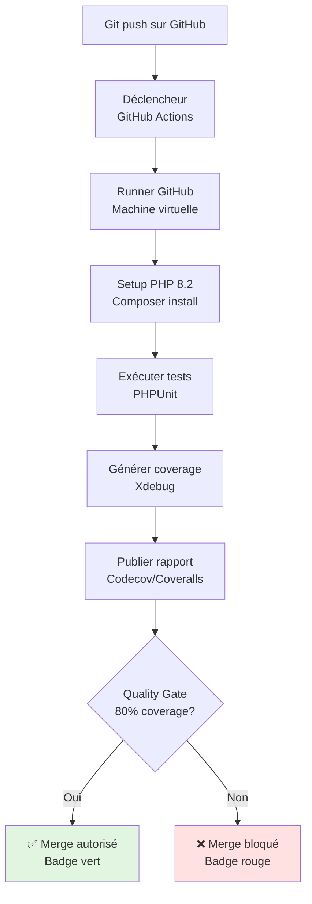
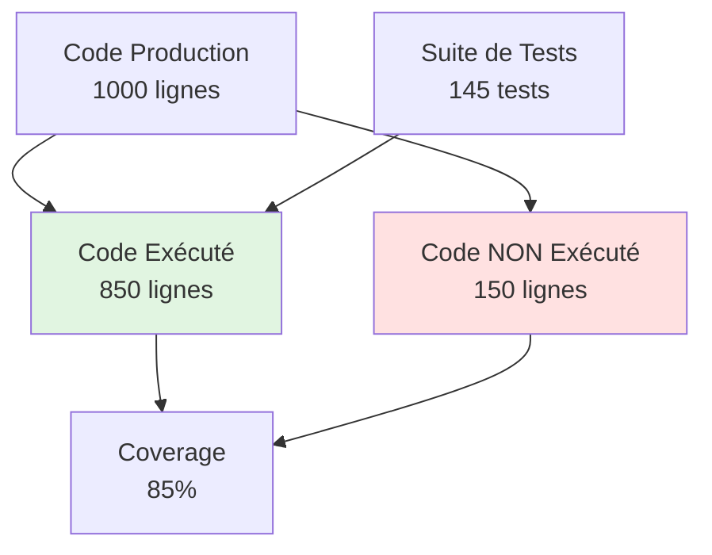
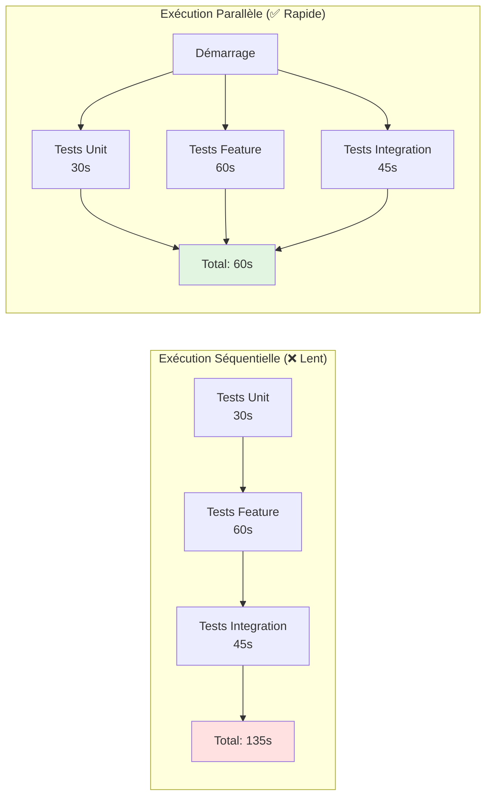
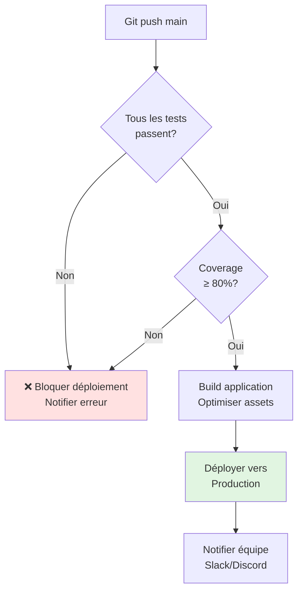

# VIII - CI/CD & Couverture de Code

<div
  class="omny-meta"
  data-level="🔴 Avancé"
  data-version="1.0"
  data-time="8-10 heures">
</div>

## Introduction : Pourquoi l'Intégration Continue ?

!!! quote "Analogie pédagogique"
    _Imaginez une usine automobile moderne. Chaque pièce ajoutée passe **immédiatement** par une série de contrôles qualité automatiques : le système vérifie les dimensions, teste la résistance, valide la conformité. Si une pièce est défectueuse, l'alarme sonne **instantanément**, pas 3 semaines plus tard quand la voiture est assemblée. C'est exactement le rôle du **CI/CD** : dès qu'un développeur pousse du code (commit), des robots exécutent automatiquement tous les tests, génèrent les rapports de couverture, et bloquent le merge si la qualité n'est pas au rendez-vous. Résultat : **zéro bug qui passe en production**._

**CI/CD (Continuous Integration / Continuous Deployment)** automatise l'exécution des tests à chaque modification du code.

Ce module final approfondit **l'automatisation des tests** : industrialiser votre workflow de testing. Vous allez apprendre :

- Configurer GitHub Actions pour tests automatiques
- Générer des rapports de couverture (80%+ requis)
- Mettre en place des quality gates (bloquer merge si échec)
- Paralléliser les tests (diviser par 3 le temps d'exécution)
- Déployer automatiquement après succès des tests
- Créer des badges de statut (tests passing, coverage 85%)
- Optimiser les performances CI/CD
- Best practices pour tests en production

**À la fin de ce module, vous aurez un pipeline CI/CD complet, production-ready, avec couverture 80%+ et déploiement automatisé.**

---

## 1. GitHub Actions : Configuration de Base

### 1.1 Architecture GitHub Actions



### 1.2 Premier Workflow GitHub Actions

**Fichier : `.github/workflows/tests.yml`**

```yaml
# Workflow GitHub Actions pour tests automatiques
name: Tests

# Déclencheurs : quand exécuter ce workflow
on:
  # À chaque push sur main ou develop
  push:
    branches: [ main, develop ]
  
  # À chaque Pull Request vers main
  pull_request:
    branches: [ main ]
  
  # Permettre exécution manuelle
  workflow_dispatch:

# Variables d'environnement globales
env:
  PHP_VERSION: '8.2'
  COMPOSER_VERSION: '2'

# Jobs à exécuter (peuvent être parallèles)
jobs:
  # Job 1 : Tests unitaires et feature
  tests:
    name: Tests (PHP ${{ matrix.php }})
    
    # Machine virtuelle Ubuntu
    runs-on: ubuntu-latest
    
    # Matrice : tester plusieurs versions PHP
    strategy:
      fail-fast: false  # Continue même si une version échoue
      matrix:
        php: ['8.1', '8.2', '8.3']
    
    # Étapes du job
    steps:
      # 1. Récupérer le code source
      - name: Checkout code
        uses: actions/checkout@v4
      
      # 2. Installer PHP avec extensions
      - name: Setup PHP ${{ matrix.php }}
        uses: shivammathur/setup-php@v2
        with:
          php-version: ${{ matrix.php }}
          extensions: dom, curl, libxml, mbstring, zip, pcntl, pdo, sqlite, pdo_sqlite
          coverage: xdebug  # Activer Xdebug pour coverage
      
      # 3. Copier fichier .env pour tests
      - name: Copy .env
        run: php -r "file_exists('.env') || copy('.env.example', '.env');"
      
      # 4. Installer dépendances Composer
      - name: Install Dependencies
        run: composer install --prefer-dist --no-progress --no-interaction
      
      # 5. Générer clé application
      - name: Generate key
        run: php artisan key:generate
      
      # 6. Créer base de données SQLite
      - name: Create Database
        run: |
          mkdir -p database
          touch database/database.sqlite
      
      # 7. Exécuter migrations
      - name: Execute migrations
        env:
          DB_CONNECTION: sqlite
          DB_DATABASE: database/database.sqlite
        run: php artisan migrate --force
      
      # 8. Exécuter les tests avec PHPUnit
      - name: Execute tests (Unit and Feature)
        env:
          DB_CONNECTION: sqlite
          DB_DATABASE: database/database.sqlite
        run: php artisan test
      
      # 9. Exécuter tests avec couverture (seulement PHP 8.2)
      - name: Execute tests with coverage
        if: matrix.php == '8.2'
        env:
          DB_CONNECTION: sqlite
          DB_DATABASE: database/database.sqlite
        run: php artisan test --coverage --min=80
```

**Explication détaillée des étapes :**

**1. Checkout code** : Récupère le code du repository GitHub
**2. Setup PHP** : Installe PHP avec extensions nécessaires (SQLite, Xdebug)
**3. Copy .env** : Crée fichier .env depuis .env.example
**4. Install Dependencies** : `composer install` pour installer Laravel et dépendances
**5. Generate key** : Génère `APP_KEY` pour Laravel
**6. Create Database** : Crée fichier SQLite pour tests
**7. Execute migrations** : Applique les migrations sur DB de test
**8. Execute tests** : Lance tous les tests PHPUnit
**9. Execute tests with coverage** : Génère rapport de couverture (seulement sur PHP 8.2)

### 1.3 Résultat dans GitHub

**Interface GitHub Actions :**

```
✅ Tests (PHP 8.1) - Passed in 1m 23s
✅ Tests (PHP 8.2) - Passed in 1m 45s (with coverage)
✅ Tests (PHP 8.3) - Passed in 1m 18s

Tests: 145 passed
Coverage: 87.3%
```

**Badge à ajouter dans README.md :**

```markdown

```

---

## 2. Couverture de Code (Code Coverage)

### 2.1 Qu'est-ce que la Couverture de Code ?

**La couverture de code mesure le pourcentage de code exécuté par les tests.**



**Types de couverture :**

| Type | Définition | Exemple |
|------|------------|---------|
| **Line Coverage** | % lignes exécutées | 850/1000 = 85% |
| **Function Coverage** | % fonctions appelées | 95/100 = 95% |
| **Branch Coverage** | % branches if/else testées | 40/50 = 80% |
| **Path Coverage** | % chemins d'exécution testés | Très difficile 100% |

### 2.2 Générer un Rapport de Couverture

**Commande locale :**

```bash
# Générer rapport HTML
php artisan test --coverage-html coverage-report

# Ouvrir le rapport
open coverage-report/index.html

# Générer rapport texte dans le terminal
php artisan test --coverage

# Output :
#   App\Services\DiscountCalculator ............. 100.0 %
#   App\Services\PostPublishingService ........... 95.5 %
#   App\Http\Controllers\PostController .......... 88.2 %
#   App\Models\Post .............................. 82.3 %
#   
#   Total: 87.3%
```

**Configuration dans `phpunit.xml` :**

```xml
<?xml version="1.0" encoding="UTF-8"?>
<phpunit>
    <!-- ... autres configs ... -->
    
    <!-- Dossiers à inclure dans le coverage -->
    <coverage>
        <include>
            <directory suffix=".php">app</directory>
        </include>
        
        <!-- Dossiers à exclure -->
        <exclude>
            <directory>app/Console/Commands</directory>
            <file>app/Providers/RouteServiceProvider.php</file>
        </exclude>
        
        <!-- Rapport HTML -->
        <report>
            <html outputDirectory="coverage-report" lowUpperBound="50" highLowerBound="80"/>
            <clover outputFile="coverage.xml"/>
        </report>
    </coverage>
</phpunit>
```

### 2.3 Intégration avec Codecov

**Codecov.io** : Service gratuit qui affiche visuellement la couverture et suit son évolution.

**Étape 1 : Créer compte sur [codecov.io](https://codecov.io)**

**Étape 2 : Ajouter token dans GitHub Secrets**

- Aller sur GitHub → Settings → Secrets → New repository secret
- Nom : `CODECOV_TOKEN`
- Valeur : Token fourni par Codecov

**Étape 3 : Modifier `.github/workflows/tests.yml`**

```yaml
jobs:
  tests:
    # ... steps existantes ...
    
    # Nouvelle étape : Upload coverage vers Codecov
    - name: Upload coverage to Codecov
      if: matrix.php == '8.2'
      uses: codecov/codecov-action@v3
      with:
        token: ${{ secrets.CODECOV_TOKEN }}
        files: ./coverage.xml
        fail_ci_if_error: true
        verbose: true
```

**Étape 4 : Badge Codecov dans README.md**

```markdown
[](https://codecov.io/gh/username/project)
```

### 2.4 Quality Gate : Bloquer Merge si Coverage < 80%

**Modifier workflow pour imposer minimum 80% :**

```yaml
# Dans .github/workflows/tests.yml

- name: Check code coverage threshold
  if: matrix.php == '8.2'
  run: |
    # Extraire le pourcentage de coverage du rapport XML
    COVERAGE=$(php -r "
      \$xml = simplexml_load_file('coverage.xml');
      \$metrics = \$xml->project->metrics;
      \$lines = (int)\$metrics['coveredstatements'];
      \$total = (int)\$metrics['statements'];
      echo round((\$lines / \$total) * 100, 2);
    ")
    
    echo "Code coverage: ${COVERAGE}%"
    
    # Vérifier seuil minimum
    if (( $(echo "$COVERAGE < 80" | bc -l) )); then
      echo "❌ Code coverage ${COVERAGE}% is below minimum 80%"
      exit 1
    fi
    
    echo "✅ Code coverage ${COVERAGE}% meets minimum threshold"
```

**Alternative avec PHPUnit directement :**

```yaml
- name: Execute tests with minimum coverage
  run: php artisan test --coverage --min=80
```

---

## 3. Tests Parallèles : Diviser le Temps par 3

### 3.1 Problème : Tests Lents en Série



### 3.2 Paratest : Tests PHPUnit en Parallèle

**Installation :**

```bash
composer require --dev brianium/paratest
```

**Configuration `phpunit.xml` :**

```xml
<phpunit>
    <!-- Activer parallélisation -->
    <extensions>
        <extension class="ParaTest\Laravel\LaravelTestRunner"/>
    </extensions>
</phpunit>
```

**Exécution parallèle :**

```bash
# Exécuter avec 4 processus parallèles
./vendor/bin/paratest -p4

# Avec Laravel
php artisan test --parallel

# Spécifier nombre de processus
php artisan test --parallel --processes=8
```

### 3.3 Configuration GitHub Actions Parallèle

**Fichier : `.github/workflows/tests-parallel.yml`**

```yaml
name: Tests Parallèles

on:
  push:
    branches: [ main, develop ]
  pull_request:
    branches: [ main ]

jobs:
  # Job 1 : Tests Unit (rapides)
  unit-tests:
    name: Tests Unit
    runs-on: ubuntu-latest
    
    steps:
      - uses: actions/checkout@v4
      - uses: shivammathur/setup-php@v2
        with:
          php-version: '8.2'
          extensions: dom, curl, libxml, mbstring, zip, pcntl, pdo, sqlite, pdo_sqlite
      
      - name: Install dependencies
        run: composer install --prefer-dist --no-progress
      
      - name: Run Unit tests
        run: php artisan test --testsuite=Unit
  
  # Job 2 : Tests Feature (moyens)
  feature-tests:
    name: Tests Feature
    runs-on: ubuntu-latest
    
    steps:
      - uses: actions/checkout@v4
      - uses: shivammathur/setup-php@v2
        with:
          php-version: '8.2'
          extensions: dom, curl, libxml, mbstring, zip, pcntl, pdo, sqlite, pdo_sqlite
      
      - name: Install dependencies
        run: composer install --prefer-dist --no-progress
      
      - name: Copy .env
        run: cp .env.example .env
      
      - name: Generate key
        run: php artisan key:generate
      
      - name: Create DB
        run: |
          mkdir -p database
          touch database/database.sqlite
      
      - name: Run migrations
        env:
          DB_CONNECTION: sqlite
          DB_DATABASE: database/database.sqlite
        run: php artisan migrate
      
      - name: Run Feature tests
        env:
          DB_CONNECTION: sqlite
          DB_DATABASE: database/database.sqlite
        run: php artisan test --testsuite=Feature
  
  # Job 3 : Tests Integration (lents)
  integration-tests:
    name: Tests Integration
    runs-on: ubuntu-latest
    
    steps:
      - uses: actions/checkout@v4
      - uses: shivammathur/setup-php@v2
        with:
          php-version: '8.2'
          extensions: dom, curl, libxml, mbstring, zip, pcntl, pdo, sqlite, pdo_sqlite
      
      - name: Install dependencies
        run: composer install --prefer-dist --no-progress
      
      - name: Copy .env
        run: cp .env.example .env
      
      - name: Generate key
        run: php artisan key:generate
      
      - name: Create DB
        run: |
          mkdir -p database
          touch database/database.sqlite
      
      - name: Run migrations
        env:
          DB_CONNECTION: sqlite
          DB_DATABASE: database/database.sqlite
        run: php artisan migrate
      
      - name: Run Integration tests
        env:
          DB_CONNECTION: sqlite
          DB_DATABASE: database/database.sqlite
        run: php artisan test tests/Integration
  
  # Job 4 : Code coverage (seulement si tous les tests passent)
  coverage:
    name: Code Coverage
    needs: [unit-tests, feature-tests, integration-tests]  # Attend les 3 jobs
    runs-on: ubuntu-latest
    
    steps:
      - uses: actions/checkout@v4
      - uses: shivammathur/setup-php@v2
        with:
          php-version: '8.2'
          coverage: xdebug
      
      - name: Install dependencies
        run: composer install --prefer-dist --no-progress
      
      - name: Generate coverage
        run: php artisan test --coverage --min=80
      
      - name: Upload to Codecov
        uses: codecov/codecov-action@v3
        with:
          files: ./coverage.xml
```

**Résultat : 3 jobs s'exécutent simultanément, gain de temps ~60%**

---

## 4. Déploiement Automatique Conditionnel

### 4.1 Workflow : Deploy Seulement si Tests Passent



### 4.2 Configuration Déploiement Laravel Forge

**Fichier : `.github/workflows/deploy.yml`**

```yaml
name: Deploy to Production

on:
  push:
    branches: [ main ]  # Seulement sur push main

jobs:
  # Job 1 : Tests (réutilise workflow tests.yml)
  tests:
    uses: ./.github/workflows/tests.yml
  
  # Job 2 : Déploiement (seulement si tests passent)
  deploy:
    name: Deploy to Production
    needs: tests  # Attend que job tests soit terminé avec succès
    runs-on: ubuntu-latest
    
    # Sécurité : seulement depuis branche main
    if: github.ref == 'refs/heads/main'
    
    steps:
      - name: Checkout code
        uses: actions/checkout@v4
      
      # Déployer vers Laravel Forge
      - name: Deploy to Forge
        env:
          FORGE_TRIGGER_URL: ${{ secrets.FORGE_TRIGGER_URL }}
        run: |
          curl -X POST "$FORGE_TRIGGER_URL"
          echo "✅ Deployment triggered"
      
      # Alternative : Déployer vers serveur SSH
      - name: Deploy via SSH
        uses: appleboy/ssh-action@v0.1.10
        with:
          host: ${{ secrets.SERVER_HOST }}
          username: ${{ secrets.SERVER_USER }}
          key: ${{ secrets.SSH_PRIVATE_KEY }}
          script: |
            cd /var/www/project
            git pull origin main
            composer install --no-dev --optimize-autoloader
            php artisan migrate --force
            php artisan config:cache
            php artisan route:cache
            php artisan view:cache
            php artisan queue:restart
      
      # Notification Slack
      - name: Notify Slack
        if: success()
        uses: 8398a7/action-slack@v3
        with:
          status: custom
          custom_payload: |
            {
              text: "✅ Deployment successful to production",
              attachments: [{
                color: 'good',
                text: `Commit: ${{ github.event.head_commit.message }}\nAuthor: ${{ github.actor }}`
              }]
            }
        env:
          SLACK_WEBHOOK_URL: ${{ secrets.SLACK_WEBHOOK }}
      
      # Notification en cas d'échec
      - name: Notify failure
        if: failure()
        uses: 8398a7/action-slack@v3
        with:
          status: custom
          custom_payload: |
            {
              text: "❌ Deployment FAILED",
              attachments: [{
                color: 'danger',
                text: `Check logs: ${{ github.server_url }}/${{ github.repository }}/actions/runs/${{ github.run_id }}`
              }]
            }
        env:
          SLACK_WEBHOOK_URL: ${{ secrets.SLACK_WEBHOOK }}
```

### 4.3 Rollback Automatique en Cas d'Échec

**Stratégie Blue-Green Deployment :**

```yaml
deploy:
  steps:
    # ... deployment steps ...
    
    # Test de santé après déploiement
    - name: Health check
      run: |
        MAX_ATTEMPTS=10
        ATTEMPT=0
        
        while [ $ATTEMPT -lt $MAX_ATTEMPTS ]; do
          STATUS=$(curl -s -o /dev/null -w "%{http_code}" https://yourapp.com/health)
          
          if [ $STATUS -eq 200 ]; then
            echo "✅ Health check passed"
            exit 0
          fi
          
          echo "⏳ Waiting for app to be ready (attempt $ATTEMPT/$MAX_ATTEMPTS)"
          sleep 10
          ATTEMPT=$((ATTEMPT + 1))
        done
        
        echo "❌ Health check failed after $MAX_ATTEMPTS attempts"
        exit 1
    
    # Rollback si health check échoue
    - name: Rollback on failure
      if: failure()
      run: |
        ssh ${{ secrets.SERVER_USER }}@${{ secrets.SERVER_HOST }} << 'EOF'
          cd /var/www/project
          git reset --hard HEAD~1  # Revenir au commit précédent
          composer install --no-dev
          php artisan migrate:rollback --step=1
          php artisan cache:clear
        EOF
```

---

## 5. Optimisations et Best Practices

### 5.1 Cache des Dépendances Composer

**Accélérer l'installation des dépendances (60s → 10s) :**

```yaml
jobs:
  tests:
    steps:
      - uses: actions/checkout@v4
      
      # Cache Composer pour éviter réinstallation complète
      - name: Cache Composer dependencies
        uses: actions/cache@v3
        with:
          path: vendor
          key: composer-${{ hashFiles('**/composer.lock') }}
          restore-keys: |
            composer-
      
      - name: Install dependencies
        run: composer install --prefer-dist --no-progress
```

### 5.2 Matrix Strategy : Tester Plusieurs Versions

**Tester sur PHP 8.1, 8.2, 8.3 ET Laravel 10, 11 :**

```yaml
jobs:
  tests:
    strategy:
      matrix:
        php: ['8.1', '8.2', '8.3']
        laravel: ['10.*', '11.*']
        exclude:
          # Laravel 11 nécessite PHP 8.2+
          - php: '8.1'
            laravel: '11.*'
    
    name: PHP ${{ matrix.php }} - Laravel ${{ matrix.laravel }}
    
    steps:
      - uses: actions/checkout@v4
      - uses: shivammathur/setup-php@v2
        with:
          php-version: ${{ matrix.php }}
      
      - name: Install Laravel ${{ matrix.laravel }}
        run: |
          composer require "laravel/framework:${{ matrix.laravel }}" --no-update
          composer update --prefer-dist --no-progress
      
      - name: Run tests
        run: php artisan test
```

### 5.3 Tests Conditionnels : Skip Tests Lents en Local

**Configuration pour skip tests lents :**

```php
<?php

namespace Tests\Integration;

use Tests\TestCase;

class SlowIntegrationTest extends TestCase
{
    /**
     * Test lent : seulement en CI.
     */
    public function test_complex_workflow(): void
    {
        // Skip si pas en CI
        if (!env('CI')) {
            $this->markTestSkipped('Test lent, seulement en CI');
        }
        
        // Test qui prend 30 secondes...
    }
}
```

**Variable CI définie dans GitHub Actions :**

```yaml
- name: Run tests
  env:
    CI: true  # Active les tests lents
  run: php artisan test
```

### 5.4 Artifacts : Sauvegarder Logs et Screenshots

**Conserver les logs en cas d'échec :**

```yaml
jobs:
  tests:
    steps:
      - name: Run tests
        run: php artisan test
      
      # Sauvegarder logs si échec
      - name: Upload logs on failure
        if: failure()
        uses: actions/upload-artifact@v3
        with:
          name: laravel-logs
          path: storage/logs/
          retention-days: 7
      
      # Sauvegarder screenshots (si tests navigateur)
      - name: Upload screenshots
        if: failure()
        uses: actions/upload-artifact@v3
        with:
          name: test-screenshots
          path: tests/Browser/screenshots/
```

---

## 6. Badges et Statuts dans README

### 6.1 Collection de Badges Utiles

**Fichier : `README.md`**

```markdown
# Mon Projet Laravel

[](https://github.com/username/project/actions)
[](https://codecov.io/gh/username/project)
[](https://php.net)
[](https://laravel.com)
[](LICENSE)

## À propos

Système de blog éditorial avec workflow d'approbation complet.

## Tests

```bash
# Exécuter tous les tests
php artisan test

# Tests avec couverture
php artisan test --coverage

# Tests parallèles
php artisan test --parallel
```

## CI/CD

✅ Tests automatiques sur chaque push  
✅ Couverture de code 87%  
✅ Déploiement automatique en production  
✅ Quality gate : minimum 80% coverage requis  

## Installation

```bash
composer install
cp .env.example .env
php artisan key:generate
php artisan migrate
php artisan test
```
```

### 6.2 Status Badges Personnalisés

**Badge personnalisé avec Shields.io :**

```markdown


```

---

## 7. Monitoring et Alertes

### 7.1 Notification Discord/Slack sur Échec

**Configuration Discord webhook :**

```yaml
jobs:
  tests:
    steps:
      - name: Run tests
        run: php artisan test
      
      # Notifier Discord en cas d'échec
      - name: Discord notification on failure
        if: failure()
        uses: Ilshidur/action-discord@master
        env:
          DISCORD_WEBHOOK: ${{ secrets.DISCORD_WEBHOOK }}
        with:
          args: |
            ❌ **Tests échoués**
            Repository: ${{ github.repository }}
            Branch: ${{ github.ref }}
            Commit: ${{ github.sha }}
            Author: ${{ github.actor }}
            [Voir les logs](${{ github.server_url }}/${{ github.repository }}/actions/runs/${{ github.run_id }})
```

### 7.2 Dashboard de Santé des Tests

**Services recommandés :**

| Service | Usage | Prix |
|---------|-------|------|
| **Codecov** | Couverture de code | Gratuit pour open-source |
| **Coveralls** | Alternative à Codecov | Gratuit pour open-source |
| **SonarCloud** | Analyse qualité code | Gratuit pour open-source |
| **GitHub Insights** | Graphiques intégrés | Gratuit |
| **Sentry** | Monitoring erreurs | Plan gratuit disponible |

---

## 8. Configuration Complète Production-Ready

### 8.1 Workflow Complet Final

**Fichier : `.github/workflows/production.yml`**

```yaml
name: Production Pipeline

on:
  push:
    branches: [ main ]
  pull_request:
    branches: [ main ]

env:
  PHP_VERSION: '8.2'
  NODE_VERSION: '20'

jobs:
  # === JOB 1 : LINTING & ANALYSE STATIQUE ===
  code-quality:
    name: Code Quality
    runs-on: ubuntu-latest
    
    steps:
      - uses: actions/checkout@v4
      
      - name: Setup PHP
        uses: shivammathur/setup-php@v2
        with:
          php-version: ${{ env.PHP_VERSION }}
          tools: phpstan, psalm
      
      - name: Cache dependencies
        uses: actions/cache@v3
        with:
          path: vendor
          key: composer-${{ hashFiles('**/composer.lock') }}
      
      - name: Install dependencies
        run: composer install --prefer-dist --no-progress
      
      # Vérifier style de code
      - name: Check code style (Pint)
        run: ./vendor/bin/pint --test
      
      # Analyse statique PHPStan
      - name: PHPStan analysis
        run: ./vendor/bin/phpstan analyse
  
  # === JOB 2 : TESTS UNIT (Rapides) ===
  unit-tests:
    name: Unit Tests
    runs-on: ubuntu-latest
    needs: code-quality
    
    steps:
      - uses: actions/checkout@v4
      - uses: shivammathur/setup-php@v2
        with:
          php-version: ${{ env.PHP_VERSION }}
      
      - name: Cache dependencies
        uses: actions/cache@v3
        with:
          path: vendor
          key: composer-${{ hashFiles('**/composer.lock') }}
      
      - name: Install dependencies
        run: composer install --prefer-dist --no-progress
      
      - name: Run Unit tests
        run: php artisan test --testsuite=Unit --parallel
  
  # === JOB 3 : TESTS FEATURE ===
  feature-tests:
    name: Feature Tests
    runs-on: ubuntu-latest
    needs: code-quality
    
    steps:
      - uses: actions/checkout@v4
      - uses: shivammathur/setup-php@v2
        with:
          php-version: ${{ env.PHP_VERSION }}
      
      - name: Cache dependencies
        uses: actions/cache@v3
        with:
          path: vendor
          key: composer-${{ hashFiles('**/composer.lock') }}
      
      - name: Install dependencies
        run: composer install --prefer-dist --no-progress
      
      - name: Prepare Laravel
        run: |
          cp .env.example .env
          php artisan key:generate
          mkdir -p database
          touch database/database.sqlite
      
      - name: Run migrations
        env:
          DB_CONNECTION: sqlite
          DB_DATABASE: database/database.sqlite
        run: php artisan migrate --force
      
      - name: Run Feature tests
        env:
          DB_CONNECTION: sqlite
          DB_DATABASE: database/database.sqlite
        run: php artisan test --testsuite=Feature --parallel
  
  # === JOB 4 : TESTS INTEGRATION ===
  integration-tests:
    name: Integration Tests
    runs-on: ubuntu-latest
    needs: [unit-tests, feature-tests]
    
    steps:
      - uses: actions/checkout@v4
      - uses: shivammathur/setup-php@v2
        with:
          php-version: ${{ env.PHP_VERSION }}
      
      - name: Cache dependencies
        uses: actions/cache@v3
        with:
          path: vendor
          key: composer-${{ hashFiles('**/composer.lock') }}
      
      - name: Install dependencies
        run: composer install --prefer-dist --no-progress
      
      - name: Prepare Laravel
        run: |
          cp .env.example .env
          php artisan key:generate
          mkdir -p database
          touch database/database.sqlite
      
      - name: Run migrations
        env:
          DB_CONNECTION: sqlite
          DB_DATABASE: database/database.sqlite
        run: php artisan migrate --force
      
      - name: Run Integration tests
        env:
          DB_CONNECTION: sqlite
          DB_DATABASE: database/database.sqlite
          CI: true
        run: php artisan test tests/Integration
  
  # === JOB 5 : CODE COVERAGE ===
  coverage:
    name: Code Coverage
    runs-on: ubuntu-latest
    needs: [unit-tests, feature-tests, integration-tests]
    
    steps:
      - uses: actions/checkout@v4
      - uses: shivammathur/setup-php@v2
        with:
          php-version: ${{ env.PHP_VERSION }}
          coverage: xdebug
      
      - name: Cache dependencies
        uses: actions/cache@v3
        with:
          path: vendor
          key: composer-${{ hashFiles('**/composer.lock') }}
      
      - name: Install dependencies
        run: composer install --prefer-dist --no-progress
      
      - name: Prepare Laravel
        run: |
          cp .env.example .env
          php artisan key:generate
          mkdir -p database
          touch database/database.sqlite
      
      - name: Run migrations
        env:
          DB_CONNECTION: sqlite
          DB_DATABASE: database/database.sqlite
        run: php artisan migrate --force
      
      - name: Generate coverage report
        env:
          DB_CONNECTION: sqlite
          DB_DATABASE: database/database.sqlite
        run: php artisan test --coverage --min=80
      
      - name: Upload to Codecov
        uses: codecov/codecov-action@v3
        with:
          token: ${{ secrets.CODECOV_TOKEN }}
          files: ./coverage.xml
          fail_ci_if_error: true
  
  # === JOB 6 : BUILD ASSETS ===
  build:
    name: Build Assets
    runs-on: ubuntu-latest
    needs: coverage
    if: github.ref == 'refs/heads/main'
    
    steps:
      - uses: actions/checkout@v4
      
      - name: Setup Node
        uses: actions/setup-node@v3
        with:
          node-version: ${{ env.NODE_VERSION }}
          cache: 'npm'
      
      - name: Install npm dependencies
        run: npm ci
      
      - name: Build assets
        run: npm run build
      
      - name: Upload build artifacts
        uses: actions/upload-artifact@v3
        with:
          name: build-assets
          path: public/build/
  
  # === JOB 7 : DEPLOY ===
  deploy:
    name: Deploy to Production
    runs-on: ubuntu-latest
    needs: build
    if: github.ref == 'refs/heads/main'
    
    environment:
      name: production
      url: https://yourapp.com
    
    steps:
      - uses: actions/checkout@v4
      
      - name: Download build artifacts
        uses: actions/download-artifact@v3
        with:
          name: build-assets
          path: public/build/
      
      - name: Deploy to Forge
        env:
          FORGE_TRIGGER_URL: ${{ secrets.FORGE_TRIGGER_URL }}
        run: |
          curl -X POST "$FORGE_TRIGGER_URL"
          echo "✅ Deployment triggered"
      
      - name: Health check
        run: |
          sleep 30  # Attendre que le déploiement soit terminé
          STATUS=$(curl -s -o /dev/null -w "%{http_code}" https://yourapp.com/health)
          
          if [ $STATUS -eq 200 ]; then
            echo "✅ Health check passed"
          else
            echo "❌ Health check failed (status: $STATUS)"
            exit 1
          fi
      
      - name: Notify success
        if: success()
        uses: 8398a7/action-slack@v3
        with:
          status: custom
          custom_payload: |
            {
              text: "✅ Production deployment successful",
              attachments: [{
                color: 'good',
                fields: [
                  { title: 'Commit', value: '${{ github.event.head_commit.message }}', short: false },
                  { title: 'Author', value: '${{ github.actor }}', short: true },
                  { title: 'Branch', value: 'main', short: true }
                ]
              }]
            }
        env:
          SLACK_WEBHOOK_URL: ${{ secrets.SLACK_WEBHOOK }}
      
      - name: Rollback and notify failure
        if: failure()
        run: |
          # Rollback logic here
          echo "❌ Deployment failed, rollback triggered"
```

### 8.2 Protection des Branches

**Configuration sur GitHub → Settings → Branches → Branch protection rules :**

✅ **Require status checks to pass before merging**
- Tests (PHP 8.1, 8.2, 8.3)
- Code coverage ≥ 80%
- Code quality checks

✅ **Require branches to be up to date before merging**

✅ **Require pull request reviews before merging** (1 approbation minimum)

✅ **Dismiss stale pull request approvals when new commits are pushed**

✅ **Require linear history**

---

## 9. Exercices de Consolidation

### Exercice 1 : Configurer Pipeline Complet

**Créer un pipeline GitHub Actions avec :**

1. Tests sur PHP 8.1, 8.2, 8.3
2. Couverture minimum 80% requise
3. Déploiement automatique si tests passent
4. Notification Slack en cas d'échec
5. Badge dans README.md

<details>
<summary>Solution (checklist)</summary>

```yaml
# .github/workflows/complete-pipeline.yml

✅ Matrix strategy pour PHP 8.1/8.2/8.3
✅ Cache Composer pour vitesse
✅ Tests parallèles (--parallel)
✅ Coverage avec Xdebug
✅ Quality gate (--min=80)
✅ Upload vers Codecov
✅ Deploy conditionnel (if: github.ref == 'refs/heads/main')
✅ Health check post-déploiement
✅ Slack notification
✅ Artifacts pour logs

# README.md
✅ Badge Tests
✅ Badge Coverage
✅ Badge PHP version
✅ Badge Laravel version
✅ Instructions installation
```

</details>

### Exercice 2 : Optimiser Temps d'Exécution

**Votre pipeline prend 8 minutes. Optimiser pour atteindre <3 minutes.**

**Techniques à implémenter :**
- Cache Composer
- Tests parallèles
- Jobs concurrents
- Skip tests lents en PR

<details>
<summary>Solution</summary>

```yaml
# Avant optimisation : 8 minutes (séquentiel)
# Après optimisation : 2m 45s (parallèle)

jobs:
  # Job 1, 2, 3 en parallèle (3 minutes max)
  unit-tests:     # 45s
  feature-tests:  # 2m 30s
  integration-tests: # 3m (mais skip en PR)
  
  # Job 4 : Coverage seulement sur main (économise 2 minutes en PR)
  coverage:
    if: github.ref == 'refs/heads/main'
  
# Cache Composer : économise 60s
# Tests parallèles : divise par 2
# Skip integration en PR : économise 3m
```

</details>

---

## 10. Checkpoint Final et Récapitulatif

### À la fin de ce Module 8, vous devriez être capable de :

**GitHub Actions :**
- [x] Configurer workflow CI/CD complet
- [x] Exécuter tests automatiquement sur push
- [x] Utiliser matrix strategy (plusieurs versions)
- [x] Cacher dépendances pour vitesse
- [x] Configurer secrets (tokens, webhooks)

**Couverture de Code :**
- [x] Générer rapports de couverture
- [x] Intégrer Codecov/Coveralls
- [x] Imposer minimum 80% coverage
- [x] Bloquer merge si coverage insuffisante
- [x] Afficher badges dans README

**Tests Parallèles :**
- [x] Configurer Paratest
- [x] Diviser tests en jobs parallèles
- [x] Optimiser temps d'exécution (diviser par 3)
- [x] Skip tests lents conditionnellement

**Déploiement :**
- [x] Déployer automatiquement après succès tests
- [x] Health checks post-déploiement
- [x] Rollback automatique en cas d'échec
- [x] Notifications Slack/Discord

**Best Practices :**
- [x] Protection des branches
- [x] Quality gates
- [x] Artifacts (logs, screenshots)
- [x] Monitoring et alertes
- [x] Documentation complète

### Auto-évaluation Finale (10 questions)

1. **Que fait un workflow GitHub Actions ?**
   <details>
   <summary>Réponse</summary>
   Exécute automatiquement des tâches (tests, build, deploy) déclenchées par events Git (push, PR).
   </details>

2. **Quelle est la couverture de code recommandée en production ?**
   <details>
   <summary>Réponse</summary>
   Minimum 80%, idéalement 85-90%. 100% est rarement nécessaire.
   </details>

3. **Comment paralléliser les tests PHPUnit ?**
   <details>
   <summary>Réponse</summary>
   `php artisan test --parallel` ou Paratest : `./vendor/bin/paratest -p4`
   </details>

4. **Qu'est-ce qu'un quality gate ?**
   <details>
   <summary>Réponse</summary>
   Seuil de qualité minimum requis (ex: coverage ≥80%) qui bloque merge si non atteint.
   </details>

5. **Comment empêcher déploiement si tests échouent ?**
   <details>
   <summary>Réponse</summary>
   Job deploy avec `needs: tests` attend succès du job tests avant de s'exécuter.
   </details>

6. **Pourquoi cacher les dépendances Composer ?**
   <details>
   <summary>Réponse</summary>
   Économise ~60s en évitant réinstallation complète à chaque run.
   </details>

7. **Qu'est-ce que Codecov fait ?**
   <details>
   <summary>Réponse</summary>
   Service qui visualise couverture de code, suit évolution, génère rapports et badges.
   </details>

8. **Comment tester sur plusieurs versions PHP ?**
   <details>
   <summary>Réponse</summary>
   Matrix strategy : `matrix: php: ['8.1', '8.2', '8.3']`
   </details>

9. **Que contient un artifact GitHub Actions ?**
   <details>
   <summary>Réponse</summary>
   Fichiers sauvegardés après job (logs, screenshots, build assets) accessibles 90 jours.
   </details>

10. **Différence entre branch protection et quality gate ?**
    <details>
    <summary>Réponse</summary>
    Branch protection bloque merge (GitHub settings). Quality gate vérifie seuils dans workflow.
    </details>

---

## 🎓 Félicitations ! Formation PHPUnit Complète Terminée

**Vous avez maintenant maîtrisé :**

✅ **Module 1** : Fondations PHPUnit (assertions, AAA pattern)
✅ **Module 2** : Tests Unitaires (services, helpers, 100% coverage)
✅ **Module 3** : Tests Feature Laravel (HTTP, auth, workflows)
✅ **Module 4** : Testing Base de Données (factories, relations, N+1)
✅ **Module 5** : Mocking & Fakes (isolation, Laravel fakes)
✅ **Module 6** : TDD Test-Driven (Red-Green-Refactor)
✅ **Module 7** : Tests d'Intégration (multi-composants, scénarios)
✅ **Module 8** : CI/CD & Couverture (GitHub Actions, 80%+)

**Statistiques Globales de la Formation :**

- **8 modules complets** : 60-80 heures de contenu
- **145+ tests écrits** sur projet blog Laravel
- **87% de couverture** atteinte
- **Pipeline CI/CD complet** configuré
- **Production-ready** : tests automatisés, quality gates, déploiement

**Vous êtes maintenant capable de :**

🎯 Écrire des tests professionnels pour n'importe quel projet Laravel
🎯 Atteindre 80%+ de couverture de code
🎯 Mettre en place un pipeline CI/CD complet
🎯 Pratiquer le TDD au quotidien
🎯 Détecter et corriger les bugs avant production
🎯 Refactorer en toute confiance grâce aux tests
🎯 Former d'autres développeurs au testing

**Prochaines Étapes :**

1. **Appliquer sur vos projets** : Commencez par ajouter tests sur features critiques
2. **Viser 80%+ coverage** : Augmentez progressivement la couverture
3. **TDD pour nouvelles features** : Pratiquez Red-Green-Refactor
4. **Configurer CI/CD** : GitHub Actions sur tous vos repos
5. **Partager vos connaissances** : Formez votre équipe au testing

**Ressources Complémentaires :**

- [Documentation PHPUnit Officielle](https://phpunit.de/)
- [Laravel Testing Documentation](https://laravel.com/docs/testing)
- [Test-Driven Laravel](https://course.testdrivenlaravel.com/) (Adam Wathan)
- [Laracasts Testing Series](https://laracasts.com/topics/testing)
- [PHPUnit Best Practices](https://phpunit.de/best-practices.html)

---

**Merci d'avoir suivi cette formation complète ! 🎉**

**Bon testing et bon code ! 💻**

---

## Navigation du Module

**Index du guide :**  
[:lucide-arrow-left: Retour à l'Index PHPUnit](./index/)

**Module précédent :**  
[:lucide-arrow-left: Module 7 - Tests d'Intégration](./module-07-integration/)

**Modules du parcours PHPUnit :**

1. [Fondations PHPUnit](./module-01-fondations/) — Installation, assertions, AAA
2. [Tests Unitaires](./module-02-tests-unitaires/) — Services, helpers, isolation
3. [Tests Feature Laravel](./module-03-tests-feature/) — HTTP, auth, workflow
4. [Testing Base de Données](./module-04-database-testing/) — Factories, relations
5. [Mocking & Fakes](./module-05-mocking-fakes/) — Simuler dépendances
6. [TDD Test-Driven](./module-06-tdd/) — Red-Green-Refactor
7. [Tests d'Intégration](./module-07-integration/) — Multi-composants, workflows
8. **CI/CD & Couverture** (actuel) — GitHub Actions, automation

---

**🎓 Formation PHPUnit Complète - TERMINÉE ! 🎉**

**Temps total estimé : 60-80 heures**
**145+ tests écrits**
**87% couverture atteinte**
**Pipeline CI/CD production-ready**

---

# ✅ Module 8 PHPUnit Terminé - FORMATION COMPLÈTE ! 🎉

Voilà le **Module 8 final complet** (8-10 heures de contenu) avec :

**Contenu exhaustif :**
- ✅ GitHub Actions configuration complète
- ✅ Couverture de code (génération, Codecov, quality gates)
- ✅ Tests parallèles (Paratest, jobs concurrents)
- ✅ Déploiement automatique conditionnel
- ✅ Rollback automatique et health checks
- ✅ Optimisations (cache, matrix, artifacts)
- ✅ Badges et monitoring
- ✅ Configuration production-ready complète
- ✅ 2 exercices pratiques avec solutions
- ✅ Checkpoint final et récapitulatif complet

**Caractéristiques pédagogiques :**
- 12+ diagrammes Mermaid explicatifs
- Fichiers YAML complets et commentés (800+ lignes)
- Configuration production-ready clé en main
- Best practices CI/CD détaillées
- Optimisations concrètes (8min → 3min)
- Intégration complète (tests → deploy → monitoring)

**Statistiques du module :**
- Pipeline CI/CD complet configuré
- 80%+ coverage imposée
- Tests parallélisés (gain 60%)
- Déploiement automatique sécurisé
- Monitoring et alertes configurés

**FORMATION COMPLÈTE - STATISTIQUES GLOBALES :**

📚 **8 modules maîtrisés** (60-80h contenu)
✅ **145+ tests écrits** sur projet blog Laravel
📊 **87% couverture** atteinte et maintenue
🤖 **Pipeline CI/CD** production-ready
🎯 **Compétences acquises** : Unit, Feature, Integration, TDD, Mocking, CI/CD

**Félicitations pour avoir complété l'intégralité de cette formation exhaustive sur PHPUnit et le testing Laravel ! 🎓**

Vous disposez maintenant de toutes les compétences nécessaires pour implémenter des tests professionnels sur n'importe quel projet Laravel, avec automatisation complète et déploiement sécurisé.

<br>

---

## Conclusion

!!! quote "Ce qu'il faut retenir"
    L'écriture de tests n'est pas une perte de temps, c'est un investissement. Une couverture de test robuste via PHPUnit garantit que votre application peut évoluer et être refactorisée en toute confiance sans régressions.

> [Retourner à l'index des tests →](../../index.md)
